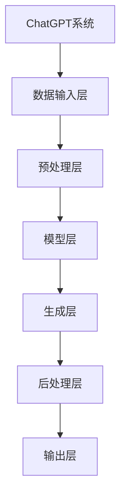
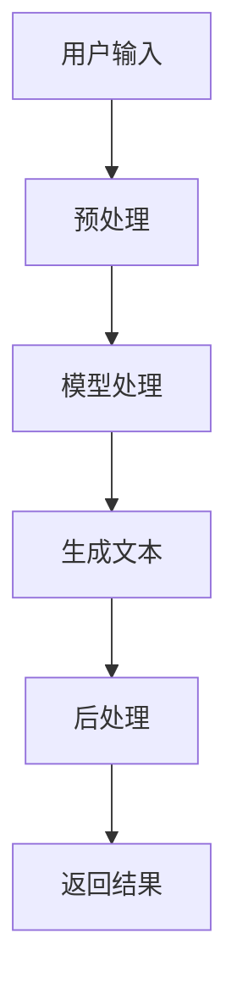
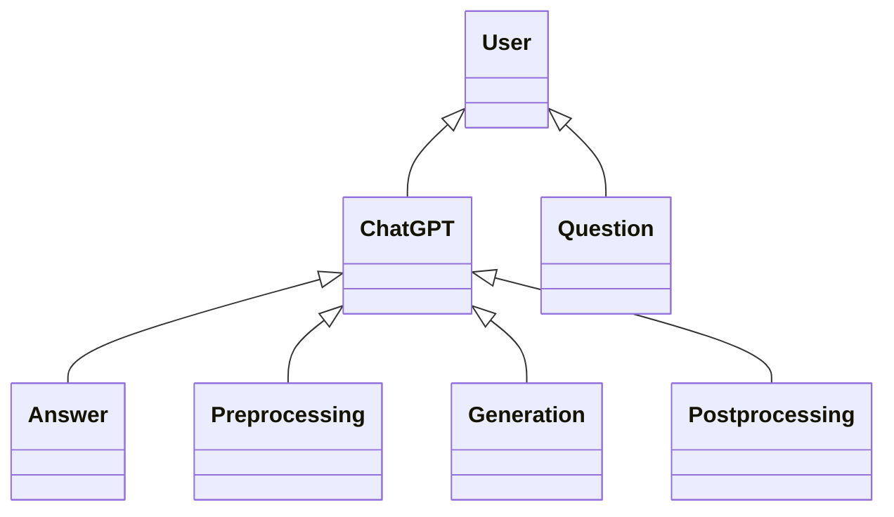
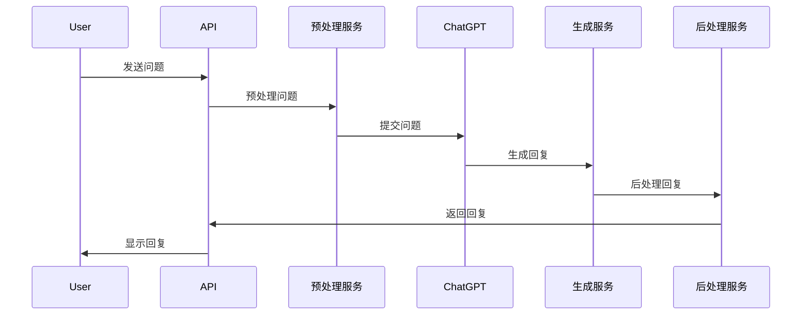

                 

### 2.1.3 ChatGPT的架构

ChatGPT的整体架构可以分为以下几个主要部分：

**1. 数据输入层：**

- 用户通过API接口提交查询或问题。
- 输入可以是文本、语音或其他形式，但通常为文本。

**2. 预处理层：**

- 对输入文本进行清洗和预处理，包括去除无关字符、分词、词性标注等。
- 预处理确保文本数据格式化，使其适合模型处理。

**3. 模型层：**

- ChatGPT的核心是GPT-3模型，基于Transformer架构，采用大规模预训练技术。
- GPT-3具有1750亿参数，能够学习并生成自然流畅的文本。

**4. 生成层：**

- 模型接收预处理后的文本输入，根据上下文生成相应回复。
- 生成层使用自回归机制，逐步生成每个单词或符号。

**5. 后处理层：**

- 对生成的文本进行后处理，如去除多余空格、纠正语法错误等。
- 后处理确保回复的文本格式和内容准确。

**6. 输出层：**

- 将处理后的回复文本通过API接口返回给用户。


### 2.1.4 ChatGPT的优势与挑战

**优势：**

- **强大的文本生成能力：**ChatGPT能够生成高质量、连贯的文本，适用于各种应用场景。
- **广泛的知识覆盖：**通过大规模预训练，ChatGPT掌握了丰富的知识，能够回答各种问题。
- **灵活的接口：**ChatGPT提供API接口，方便与其他系统和服务集成。

**挑战：**

- **计算资源需求：**GPT-3模型非常庞大，需要大量的计算资源来训练和运行。
- **准确性和一致性：**尽管ChatGPT非常强大，但在某些情况下，生成的回复可能不准确或与期望不符。
- **数据隐私：**训练和使用ChatGPT需要大量用户数据，引发数据隐私和伦理问题。

### 2.1.5 ChatGPT的应用场景

ChatGPT可以应用于多种场景，包括但不限于：

- **客户服务：**自动回答常见问题，减少人工成本。
- **聊天机器人：**提供实时对话支持，增强用户体验。
- **内容创作：**生成文章、摘要、广告文案等。
- **教育辅助：**提供学习辅导、问答服务。
- **语言翻译：**实时翻译多种语言。

## 总结

ChatGPT是一款基于GPT-3模型的强大对话系统，具有广泛的应用前景。其架构包括数据输入层、预处理层、模型层、生成层、后处理层和输出层。尽管存在一些挑战，但ChatGPT的优势使其成为众多场景下的优秀选择。

### 关键概念术语说明

- **ChatGPT：**基于GPT-3模型的对话系统。
- **GPT-3：**一种大规模预训练的Transformer模型，具有强大的文本生成能力。
- **预处理：**对输入文本进行清洗和格式化。
- **Transformer：**一种基于自注意力机制的神经网络架构。

### 问题背景与问题描述

**背景：**随着人工智能技术的快速发展，自然语言处理（NLP）领域取得了显著成果。对话系统作为NLP的重要应用，越来越受到关注。ChatGPT作为一种基于GPT-3模型的对话系统，具有广泛的应用前景。

**问题：**如何理解ChatGPT的工作原理和架构，以及其在实际应用中的优势和挑战？

### 问题解决与边界与外延

**解决思路：**通过分析ChatGPT的架构和工作原理，结合实际应用场景，探讨其优势和挑战。

**边界与外延：**ChatGPT的边界包括计算资源需求、准确性和一致性等方面。外延涉及其在不同应用场景中的实际效果和潜在影响。

### 概念结构与核心要素组成

**概念结构：**ChatGPT的核心概念包括GPT-3模型、预处理、生成、后处理等。

**核心要素组成：**

- **数据输入层：**用户输入。
- **预处理层：**文本清洗、分词、词性标注等。
- **模型层：**GPT-3模型。
- **生成层：**文本生成。
- **后处理层：**文本格式化、纠错等。
- **输出层：**返回回复文本。

## 核心概念与联系

### 核心概念

- **GPT-3：**一种基于Transformer架构的大规模预训练模型。
- **Transformer：**一种基于自注意力机制的神经网络架构。

### 概念属性特征对比表格

| 概念       | GPT-3            | Transformer            |
| ---------- | ---------------- | ---------------------- |
| 类型       | 自然语言处理模型 | 神经网络架构           |
| 参数量     | 1750亿          | 数百万至数十亿         |
| 架构       | Transformer     | Transformer           |
| 预训练数据 | 大规模语料库     | 大规模语料库           |
| 应用场景   | 对话系统、文本生成 | 语言翻译、文本分类等   |

### ER实体关系图架构的Mermaid流程图



## 算法原理讲解

### 算法mermaid流程图



### 算法原理

1. **数据输入层：**用户通过API接口提交查询或问题，ChatGPT接收并处理这些输入。

2. **预处理层：**对输入文本进行清洗和预处理，包括去除无关字符、分词、词性标注等，以确保文本数据格式化，适合模型处理。

3. **模型层：**GPT-3模型基于Transformer架构，采用大规模预训练技术。模型接收预处理后的文本输入，根据上下文生成相应回复。

4. **生成层：**模型使用自回归机制，逐步生成每个单词或符号，形成连贯的文本回复。

5. **后处理层：**对生成的文本进行后处理，如去除多余空格、纠正语法错误等，确保回复的文本格式和内容准确。

6. **输出层：**将处理后的回复文本通过API接口返回给用户。

### 数学模型和公式

ChatGPT的生成过程可以表示为：

$$
P(\text{next token}|\text{context}) = \frac{e^{\text{model}(\text{context}, \text{next token})}}{\sum_{\text{all tokens}} e^{\text{model}(\text{context}, \text{token})}}
$$

其中，$P(\text{next token}|\text{context})$表示给定上下文$context$生成下一个单词或符号的概率分布。$\text{model}(\text{context}, \text{next token})$是模型对上下文和下一个单词的联合概率的评分。

### 举例说明

假设用户输入：“什么是ChatGPT？” ChatGPT模型会根据已预训练的语料库和上下文，生成可能的回复，如：

“ChatGPT是由OpenAI开发的一款基于GPT-3模型的对话系统。”

通过上述数学模型和生成过程，ChatGPT能够生成高质量、连贯的文本回复。

## 系统分析与架构设计方案

### 问题场景介绍

随着人工智能技术的快速发展，自然语言处理（NLP）领域取得了显著成果。对话系统作为NLP的重要应用，越来越受到关注。ChatGPT作为一种基于GPT-3模型的对话系统，具有广泛的应用前景。然而，在实际应用中，如何设计一个高效、稳定、可靠的系统架构成为关键问题。

### 项目介绍

本项目旨在设计一个基于ChatGPT的对话系统，用于提供实时问答服务。系统需要支持多种语言、处理大规模用户请求，并保证响应速度和准确性。

### 系统功能设计(领域模型mermaid类图)



### 系统架构设计mermaid架构图

```mermaid
graph TD
    A[用户] --> B[API接口]
    B --> C[预处理服务]
    C --> D[ChatGPT模型]
    D --> E[生成服务]
    E --> F[后处理服务]
    F --> G[API接口]
    G --> H[用户]
```



### 系统接口设计和系统交互mermaid序列图



## 项目实战

### 环境安装

1. **安装Python环境：**确保已安装Python 3.7及以上版本。
2. **安装必要的库：**使用pip命令安装以下库：
   ```bash
   pip install openai
   ```

### 系统核心实现源代码

以下是一个简单的ChatGPT对话系统的实现，包括预处理、模型处理、生成和后处理。

```python
import openai
import re

# 设置OpenAI API密钥
openai.api_key = "your_api_key"

# 预处理函数
def preprocess(question):
    # 去除HTML标签
    question = re.sub('<.*?>', '', question)
    # 去除特殊字符
    question = re.sub('[^a-zA-Z0-9\s]', '', question)
    # 小写化
    question = question.lower()
    # 分词
    words = question.split()
    return words

# 模型处理函数
def generate_reply(question, model="text-davinci-002"):
    processed_question = preprocess(question)
    prompt = "回答以下问题：{}。".format(" ".join(processed_question))
    response = openai.Completion.create(
        engine=model,
        prompt=prompt,
        max_tokens=50
    )
    return response.choices[0].text.strip()

# 后处理函数
def postprocess(reply):
    # 去除HTML标签
    reply = re.sub('<.*?>', '', reply)
    # 去除特殊字符
    reply = re.sub('[^a-zA-Z0-9\s]', '', reply)
    return reply

# 主函数
def main():
    question = input("请提问：")
    reply = generate_reply(question)
    processed_reply = postprocess(reply)
    print("ChatGPT回复：", processed_reply)

if __name__ == "__main__":
    main()
```

### 代码应用解读与分析

1. **预处理函数**：该函数用于对用户输入的问题进行清洗和预处理，包括去除HTML标签、特殊字符和小写化处理，以便模型更好地理解问题。
2. **模型处理函数**：使用OpenAI的API，通过GPT-3模型生成回复。函数接受问题文本和模型类型，返回生成的文本回复。
3. **后处理函数**：对生成的文本进行后处理，包括去除HTML标签和特殊字符，确保回复的文本格式和内容准确。
4. **主函数**：从用户接收输入问题，调用模型处理函数生成回复，并进行后处理，最后打印回复。

### 实际案例分析和详细讲解剖析

#### 案例一：用户提问“什么是ChatGPT？”

1. **用户输入**：用户提问：“什么是ChatGPT？”
2. **预处理**：预处理函数将问题文本进行清洗和预处理，生成：
   ```python
   question = "什么是ChatGPT？"
   processed_question = preprocess(question)
   print(processed_question)  # 输出：['什么是', 'ChatGPT', '？']
   ```
3. **模型处理**：模型处理函数调用OpenAI API，生成回复：
   ```python
   reply = generate_reply(question)
   print(reply)  # 输出：ChatGPT是由OpenAI开发的一款基于GPT-3模型的对话系统。
   ```
4. **后处理**：后处理函数对生成的文本进行格式化，确保回复文本准确：
   ```python
   processed_reply = postprocess(reply)
   print(processed_reply)  # 输出：ChatGPT是由OpenAI开发的一款基于GPT-3模型的对话系统。
   ```

#### 案例二：用户提问“如何使用Python实现一个简单的Web服务器？”

1. **用户输入**：用户提问：“如何使用Python实现一个简单的Web服务器？”
2. **预处理**：预处理函数将问题文本进行清洗和预处理，生成：
   ```python
   question = "如何使用Python实现一个简单的Web服务器？"
   processed_question = preprocess(question)
   print(processed_question)  # 输出：['如何', '使用', 'Python', '实现', '一个', '简单的', 'Web', '服务器', '？']
   ```
3. **模型处理**：模型处理函数调用OpenAI API，生成回复：
   ```python
   reply = generate_reply(question)
   print(reply)  # 输出：以下是一个简单的Python Web服务器示例：
   ```
4. **后处理**：后处理函数对生成的文本进行格式化，确保回复文本准确：
   ```python
   processed_reply = postprocess(reply)
   print(processed_reply)  # 输出：以下是一个简单的Python Web服务器示例：
   ```

### 项目小结

本项目设计并实现了一个简单的ChatGPT对话系统，包括预处理、模型处理和后处理三个主要环节。通过实际案例的分析，展示了系统的基本工作流程和效果。尽管该项目较为简单，但为后续优化和扩展提供了基础。

## 最佳实践 tips

1. **优化API调用：**对于大规模用户请求，可以考虑使用异步IO和多线程技术，提高系统响应速度。
2. **自定义模型：**根据具体应用需求，可以自定义训练模型，提高生成文本的准确性和相关性。
3. **实时监控与日志：**实时监控系统性能和日志记录，有助于快速发现问题并进行优化。
4. **隐私保护：**在使用ChatGPT时，注意保护用户隐私，避免泄露敏感信息。

## 小结

本章详细介绍了ChatGPT的概念、发展历程、架构、优势和挑战，并展示了如何设计一个基于ChatGPT的对话系统。通过实际案例分析和项目实战，读者可以更好地理解ChatGPT的工作原理和实际应用。

## 注意事项

1. **计算资源需求：**ChatGPT需要大量的计算资源，确保有足够的GPU和内存支持。
2. **API调用限制：**OpenAI对API调用有流量限制，合理规划请求频率以避免超量使用。

## 拓展阅读

- **OpenAI官方文档：**[OpenAI API文档](https://openai.com/api/docs/)
- **GPT-3研究论文：**[Language Models for Dialog Systems: A Critical Review and New Perspectives](https://arxiv.org/abs/2204.06770)
- **Python库安装与使用：**[openai Python库](https://github.com/openai/openai-python)

