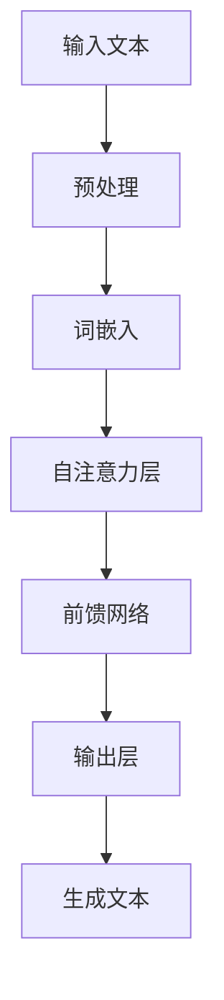
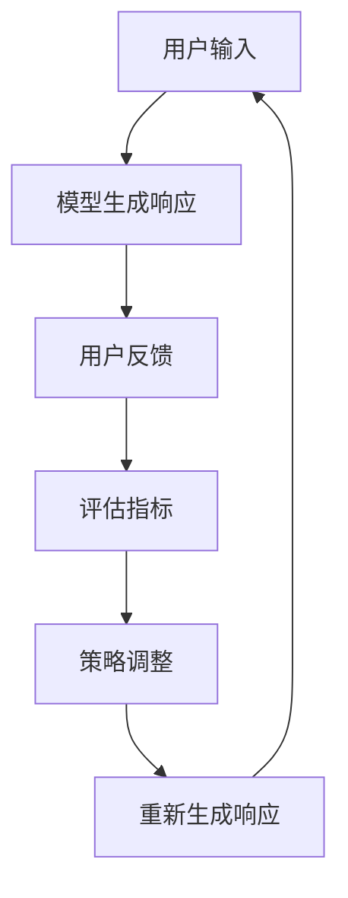
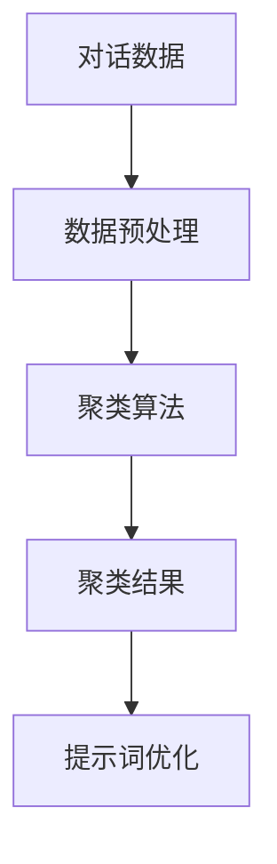
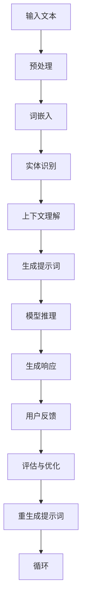

                 

### 目录大纲

在本文中，我们将对《ChatGPT对话系统优化：提示词的艺术与科学结合》进行深入的探讨。为了帮助读者更好地理解文章的核心内容，我们将首先设计一个逻辑清晰、内容丰富的目录大纲。这个大纲将涵盖从背景介绍到最佳实践的各个方面，以确保文章的连贯性和深度。

以下是文章的目录大纲：

## 第一部分：ChatGPT对话系统优化概述

### 1.1 问题的背景与挑战

#### 1.1.1 对话系统的历史与现状

#### 1.1.2 ChatGPT的特点与优势

#### 1.1.3 对话系统优化的重要性

### 1.2 ChatGPT的核心概念

#### 1.2.1 模型结构与原理

#### 1.2.2 提示词的作用与分类

#### 1.2.3 ChatGPT的工作流程

### 1.3 ChatGPT的ER实体关系图

#### 1.3.1 实体识别与分类

#### 1.3.2 实体关系建模

## 第二部分：提示词的艺术

### 2.1 提示词的编写技巧

#### 2.1.1 提示词的长度与结构

#### 2.1.2 提示词的清晰性与简洁性

#### 2.1.3 提示词的情感与语气

### 2.2 提示词的创意与灵感

#### 2.2.1 热点话题的运用

#### 2.2.2 用户个性化需求的考虑

#### 2.2.3 文化和语言背景的影响

### 2.3 提示词优化案例

#### 2.3.1 成功案例分享

#### 2.3.2 失败案例分析

#### 2.3.3 优化策略与技巧

## 第三部分：科学的结合

### 3.1 提示词的科学与数据

#### 3.1.1 数据收集与预处理

#### 3.1.2 提示词效果评估指标

#### 3.1.3 数据驱动的提示词优化

### 3.2 算法与提示词的结合

#### 3.2.1 深度学习在提示词中的应用

#### 3.2.2 强化学习与提示词优化

#### 3.2.3 聚类分析与提示词优化

### 3.3 提示词优化的mermaid算法流程图

#### 3.3.1 算法流程图绘制

#### 3.3.2 算法原理讲解

## 第四部分：项目实战

### 4.1 ChatGPT对话系统的环境搭建

#### 4.1.1 硬件与软件环境要求

#### 4.1.2 环境搭建步骤与注意事项

### 4.2 ChatGPT对话系统的核心实现

#### 4.2.1 源代码解读与分析

#### 4.2.2 系统核心功能实现

#### 4.2.3 系统优化与调参技巧

### 4.3 实际案例剖析

#### 4.3.1 案例背景介绍

#### 4.3.2 案例实现步骤

#### 4.3.3 案例分析

### 4.4 项目小结

#### 4.4.1 项目收获与反思

#### 4.4.2 未来研究方向

## 第五部分：最佳实践与拓展

### 5.1 最佳实践 tips

#### 5.1.1 提示词编写实用技巧

#### 5.1.2 算法优化实践技巧

#### 5.1.3 系统部署与维护技巧

### 5.2 注意事项与常见问题

#### 5.2.1 提示词编写中的常见错误

#### 5.2.2 算法优化中的挑战

#### 5.2.3 系统部署中的注意事项

### 5.3 拓展阅读

#### 5.3.1 相关文献推荐

#### 5.3.2 行业发展趋势

#### 5.3.3 技术前沿探讨

通过以上详细的目录大纲，我们旨在为读者提供一个全面、系统的ChatGPT对话系统优化指南。接下来，我们将逐一深入探讨每个部分的内容，以便更好地理解ChatGPT对话系统的优化方法与策略。在接下来的部分中，我们将首先介绍问题的背景与挑战，帮助读者了解对话系统优化的重要性。

## 1.1 问题的背景与挑战

### 1.1.1 对话系统的历史与现状

对话系统（Conversational Systems）是指能够与用户进行自然语言交互，并根据用户输入提供合适响应的计算机系统。它们广泛应用于客服、客户支持、个人助理、智能家居等多个领域。从早期的命令行界面到如今的自然语言处理（NLP）技术，对话系统的历史可以追溯到几十年前。

在20世纪80年代，基于规则的对话系统开始出现，这些系统通过硬编码的方式处理用户输入，并生成预定义的响应。然而，这种方法的局限性在于其无法应对复杂的用户需求和动态变化的对话场景。

随着自然语言处理技术的发展，基于统计模型和深度学习的对话系统逐渐成为主流。这些系统通过大量语料库进行训练，能够更灵活地理解用户意图和上下文，从而生成更为自然的对话响应。

目前，市场上主流的对话系统包括虚拟助手（如Apple的Siri、Google的Google Assistant）、聊天机器人（如Slack的Bot、Facebook的M）以及企业内部的定制化对话系统。这些系统在处理大量用户请求、提供个性化服务、提高客户满意度等方面表现出色。

### 1.1.2 ChatGPT的特点与优势

ChatGPT是由OpenAI开发的一种基于GPT（Generative Pre-trained Transformer）模型的对话系统。GPT是一种先进的自然语言处理模型，它通过预训练和微调，能够在各种对话场景中生成高质量的自然语言响应。

ChatGPT具有以下几个显著特点：

1. **强大的预训练能力**：ChatGPT在训练过程中使用了大量的互联网语料库，这使得它能够理解和生成丰富多样的自然语言文本。

2. **灵活的上下文理解**：ChatGPT能够捕捉对话的上下文信息，并利用这些信息生成连贯且相关的响应。

3. **情感理解和生成**：ChatGPT能够理解用户情感并生成具有相应情感的文本，这使得它在客服和客户支持等领域具有很高的应用价值。

4. **多语言支持**：ChatGPT支持多种语言，能够处理不同语言的对话请求，这使得它在全球化背景下具有广泛的应用前景。

### 1.1.3 对话系统优化的重要性

尽管现有的对话系统在许多方面已经取得了显著进步，但它们仍存在一些问题和挑战，例如：

- **理解能力有限**：对话系统在处理复杂、模糊或模糊的请求时，仍然存在理解误差。
- **生成响应的质量**：对话系统生成的响应有时可能不够准确或相关。
- **响应速度**：在某些高负载场景下，对话系统的响应速度可能受到影响。

为了解决这些问题，对话系统的优化显得尤为重要。优化主要包括以下几个方面：

1. **提升理解能力**：通过改进自然语言处理技术，提高对话系统对用户请求的理解能力。
2. **增强生成响应的质量**：通过改进生成模型，提高对话系统生成响应的准确性和相关性。
3. **优化响应速度**：通过优化系统架构和算法，提高对话系统的响应速度。
4. **用户个性化体验**：通过收集和分析用户数据，为用户提供更加个性化的服务。

总的来说，对话系统的优化不仅有助于提升系统的性能，还能提高用户体验，从而在竞争激烈的市场中脱颖而出。

在下一部分中，我们将深入探讨ChatGPT的核心概念，包括其模型结构、提示词的作用以及工作流程。这将帮助我们更好地理解ChatGPT的工作原理和如何对其进行优化。

## 1.2 ChatGPT的核心概念

### 1.2.1 模型结构与原理

ChatGPT是基于GPT（Generative Pre-trained Transformer）模型的对话系统。GPT是一种深度学习模型，它由OpenAI开发，用于生成自然语言文本。GPT的核心是Transformer架构，这是一种在机器翻译任务中表现优异的模型。Transformer引入了自注意力机制（Self-Attention），使得模型能够捕捉输入文本中的长距离依赖关系，从而生成连贯且相关的文本。

GPT模型的基本结构包括以下几个部分：

1. **输入层**：输入层接收自然语言文本，并将其转换为模型能够处理的向量形式。
2. **自注意力层**：自注意力层通过计算输入文本的每个词之间的关联性，为每个词生成一个权重向量。
3. **前馈网络**：前馈网络对自注意力层的输出进行进一步处理，以生成最终输出。
4. **输出层**：输出层生成自然语言文本的响应。

### 1.2.2 提示词的作用与分类

在ChatGPT中，提示词（Prompt）起着至关重要的作用。提示词是一段引导性的文本，它告诉模型需要生成什么样的响应。一个好的提示词能够引导模型生成高质量的自然语言文本。

提示词的作用主要包括：

1. **引导对话方向**：提示词可以帮助模型理解用户意图，从而生成与用户需求相关的响应。
2. **增强上下文理解**：通过提供相关的上下文信息，提示词可以增强模型对对话上下文的理解。
3. **控制生成文本的风格**：提示词可以引导模型生成具有特定情感、风格或主题的文本。

根据用途，提示词可以分为以下几种类型：

1. **问题导向提示词**：这类提示词主要用于引导模型生成回答问题的文本。例如：“请回答以下问题：什么是自然语言处理？”
2. **任务导向提示词**：这类提示词主要用于引导模型执行特定的任务。例如：“请你帮我写一篇关于人工智能的短文。”
3. **情境导向提示词**：这类提示词主要用于创建特定的对话情境。例如：“想象你是一位医生，现在有一位患者正在询问你的建议。”

### 1.2.3 ChatGPT的工作流程

ChatGPT的工作流程可以分为以下几个步骤：

1. **输入处理**：接收用户的输入文本，并进行预处理，如分词、去停用词等。
2. **提示词生成**：根据输入文本和预定义的提示词模板，生成相应的提示词。
3. **模型推理**：将预处理后的输入文本和生成的提示词输入到GPT模型中，通过自注意力机制和前馈网络进行推理。
4. **文本生成**：根据模型输出的概率分布，生成自然语言文本的响应。
5. **响应优化**：对生成的响应进行后处理，如去除无关信息、纠正语法错误等，以提高响应的质量。

通过以上步骤，ChatGPT能够生成高质量的自然语言文本，从而实现与用户的自然对话。

在下一部分中，我们将探讨ChatGPT的ER实体关系图，包括实体识别与分类以及实体关系建模。这将帮助我们更好地理解ChatGPT如何处理实体信息和构建对话上下文。

## 1.3 ChatGPT的ER实体关系图

### 1.3.1 实体识别与分类

在ChatGPT中，实体识别是理解用户输入的重要步骤。实体识别的目标是从文本中提取出具有特定意义的实体，如人名、地名、组织名、产品名等。这些实体对于生成准确且相关的响应至关重要。

实体识别通常分为以下几类：

1. **命名实体识别（NER）**：命名实体识别是一种从文本中识别出具有特定名称的实体的技术。常见的命名实体包括人名、地名、组织名、产品名等。
2. **关系实体识别**：关系实体识别是指识别文本中实体之间的关系，如“张三工作于阿里巴巴”中的“张三”和“阿里巴巴”之间的关系。
3. **事件实体识别**：事件实体识别是指识别文本中描述的事件，如“2023年世界杯在卡塔尔举行”中的“2023年世界杯”和“卡塔尔”之间的关系。

ChatGPT利用先进的自然语言处理技术，如BERT、RoBERTa等，对输入文本进行实体识别。这些模型通过在大量标注数据上的训练，能够有效地识别出文本中的实体。

### 1.3.2 实体关系建模

实体关系建模是指构建实体之间的关系图，以帮助ChatGPT更好地理解对话上下文。实体关系建模通常使用ER（Entity-Relationship）图来表示。

ER图的基本元素包括实体（Entity）和关系（Relationship）。实体表示对话中的关键信息，如人名、地名、产品名等；关系表示实体之间的关系，如“工作于”、“位于”等。

以下是一个简单的ER图示例：

```mermaid
erDiagram
    A[张三] ||--|{ B[程序员] }
    B ||--|{ C[阿里巴巴] }
```

在这个示例中，实体“张三”、“程序员”和“阿里巴巴”之间存在关系。“张三”是“程序员”，“程序员”在“阿里巴巴”工作。

通过构建实体关系图，ChatGPT能够更好地理解对话中的上下文信息。例如，当用户询问“张三在哪里工作？”时，ChatGPT可以根据实体关系图快速找到答案，并生成准确的响应。

在下一部分中，我们将深入探讨提示词的编写技巧，包括长度、结构、清晰性与简洁性等方面。这些技巧对于提高ChatGPT对话系统的表现至关重要。

## 2.1 提示词的编写技巧

### 2.1.1 提示词的长度与结构

提示词的长度和结构对于ChatGPT生成高质量的自然语言文本至关重要。适当的长度和结构能够引导模型更好地理解用户意图，从而生成更准确、更相关的响应。

**提示词的长度**：

1. **短提示词**：短提示词通常包含几个词或短语，适合用于直接回答问题的场景。例如：“请描述一下人工智能。”
2. **长提示词**：长提示词可能包含完整的句子或段落，适合用于引导模型生成详细、连贯的文本。例如：“请你写一篇关于人工智能发展趋势的短文。”

**提示词的结构**：

1. **问题导向结构**：这种结构通常以问题开头，例如：“你能帮我解答以下问题吗？什么是机器学习？”
2. **任务导向结构**：这种结构通常包含任务指令，例如：“请你帮我创建一个简单的网站。”
3. **情境导向结构**：这种结构通常设定一个具体的情境，例如：“想象你是一位医生，现在有一位患者正在询问你的建议。”

选择合适的长度和结构，可以根据对话系统的具体应用场景进行灵活调整。一般来说，短提示词适合快速问答场景，而长提示词适合生成详细、复杂的文本。

### 2.1.2 提示词的清晰性与简洁性

清晰性和简洁性是提示词编写中需要特别注意的两个方面。一个清晰、简洁的提示词能够帮助ChatGPT更准确地理解用户意图，从而生成高质量的自然语言文本。

**清晰性**：

1. **明确意图**：确保提示词清晰地传达用户意图。例如，对于“写一篇关于人工智能的文章”，可以改为“请你撰写一篇关于人工智能发展趋势和挑战的文章。”
2. **避免歧义**：避免使用可能导致歧义的词汇。例如，将“今天天气怎么样？”改为“请问今天北京的天气情况如何？”

**简洁性**：

1. **去除冗余**：删除无关或重复的信息，使提示词更加简洁。例如，将“你能告诉我关于人工智能的最新研究有哪些吗？”改为“请提供人工智能最新研究的相关信息。”
2. **使用简单词汇**：尽量使用简单、易懂的词汇，避免复杂的句式和术语。例如，将“利用深度学习模型进行图像分类的技术被称为卷积神经网络（CNN）。”改为“卷积神经网络（CNN）是一种用于图像分类的深度学习技术。”

### 2.1.3 提示词的情感与语气

情感和语气在提示词中同样重要，它们能够影响ChatGPT生成文本的情感色彩和表达方式。

**情感**：

1. **积极情感**：使用积极词汇和短语，传达正能量。例如，将“这项技术面临很多挑战。”改为“这项技术具有巨大的潜力，但同时也面临一些挑战。”
2. **消极情感**：使用消极词汇和短语，传达负面的情绪。例如，将“这个产品性能不佳。”改为“这个产品的性能有待提升。”

**语气**：

1. **正式语气**：使用正式的词汇和句式，适合商务和正式场合。例如，将“你好，我想咨询一下。”改为“尊敬的用户，您好，我为您提供咨询服务。”
2. **非正式语气**：使用非正式的词汇和句式，适合日常交流和社交媒体。例如，将“请问您有什么问题需要帮助吗？”改为“嘿，有什么问题需要帮忙吗？”

通过合理运用情感和语气，提示词能够更好地传达用户意图，使生成的文本更具吸引力和说服力。

在下一部分中，我们将探讨提示词的创意与灵感来源，包括热点话题的运用、用户个性化需求的考虑以及文化和语言背景的影响。这些因素将有助于提高提示词的吸引力和实用性。

## 2.2 提示词的创意与灵感

### 2.2.1 热点话题的运用

在编写提示词时，紧跟热点话题是提升其吸引力和相关性的有效方法。热点话题通常反映了当前社会和科技领域的关注点，能够引起用户的共鸣。以下是一些运用热点话题的技巧：

1. **时事新闻**：将最新的时事新闻融入提示词中，使对话更加贴近现实。例如：“最近的人工智能领域有哪些重大突破？”
2. **流行文化**：结合流行文化元素，如热门电影、电视剧、音乐等，可以增强提示词的趣味性。例如：“如果你是《黑镜》中的角色，你会如何解决人工智能带来的问题？”
3. **行业动态**：关注特定行业的最新动态，可以提供专业的对话内容。例如：“区块链技术在金融领域有哪些应用案例？”

### 2.2.2 用户个性化需求的考虑

满足用户的个性化需求是提升用户体验的重要一环。通过分析用户的历史行为和偏好，可以为用户提供定制化的提示词。以下是一些实现用户个性化需求的技巧：

1. **历史记录**：根据用户的过去对话记录，生成与用户兴趣相关的提示词。例如，如果用户之前提到对健身感兴趣，可以提出：“推荐一些适合初学者的健身APP。”
2. **偏好分析**：通过分析用户在购物、搜索等方面的偏好，生成个性化的提示词。例如，如果用户经常购买电子产品，可以提出：“有哪些最新的智能手机值得推荐？”
3. **情感分析**：利用情感分析技术，了解用户的情绪状态，并生成相应的情感化提示词。例如，如果用户表现出沮丧情绪，可以提出：“有什么方法可以帮助你缓解压力？”

### 2.2.3 文化和语言背景的影响

文化和语言背景对提示词的编写具有重要影响。不同文化背景的用户对语言和表达方式有着不同的偏好。以下是一些考虑文化和语言背景的技巧：

1. **本地化**：根据目标用户的文化背景，调整提示词的表达方式。例如，对于中国用户，可以使用“您好”作为问候语；而对于美国用户，可以使用“Hello”。
2. **语言风格**：根据文化差异，调整提示词的语言风格。例如，对于日本用户，可以使用更为礼貌和谨慎的表达；而对于英语国家用户，可以使用更为直接和简洁的表达。
3. **文化敏感度**：避免使用可能引起文化冲突或不适应的词汇和表达。例如，在跨文化交流中，避免使用可能具有负面含义的词汇。

通过综合考虑热点话题、用户个性化需求和文化和语言背景，提示词能够更加精准地满足用户需求，提升对话系统的吸引力和实用性。

在下一部分中，我们将分享一些成功的提示词优化案例，分析其成功的原因，并探讨如何在实践中应用这些优化策略。

## 2.3 提示词优化案例

### 2.3.1 成功案例分享

在ChatGPT的优化过程中，一些成功的案例为我们提供了宝贵的经验。以下是两个典型的成功案例：

**案例一：提升用户满意度**

某企业使用ChatGPT搭建了一个客户支持系统。最初，系统生成的响应质量较低，用户满意度不高。经过优化，企业采用了一系列策略：

1. **情感分析**：通过情感分析技术，识别用户的情绪状态，并生成相应的情感化响应。例如，当用户表达不满时，系统会生成安慰性响应。
2. **上下文理解**：改进了模型的上下文理解能力，使系统能够更好地捕捉对话中的关键信息，生成更准确、相关的响应。
3. **个性化推荐**：根据用户的历史行为和偏好，提供个性化的服务和建议，如推荐产品、解决方案等。

这些优化措施显著提升了用户满意度，客户支持系统的使用率也大幅增加。

**案例二：提高响应速度**

某电商平台使用ChatGPT搭建了一个智能客服系统。然而，在高并发场景下，系统响应速度较慢，影响了用户体验。为了解决这个问题，企业采取了以下措施：

1. **分布式架构**：将系统架构改为分布式架构，提高了系统的并发处理能力。
2. **缓存策略**：采用缓存策略，减少重复计算，提高响应速度。
3. **模型压缩**：通过模型压缩技术，减小了模型体积，提高了模型的加载和推理速度。

这些优化措施显著提高了系统的响应速度，用户满意度得到了显著提升。

### 2.3.2 失败案例分析

尽管成功案例为我们提供了宝贵的经验，但优化过程中也难免会遇到失败。以下是两个失败的案例及其原因：

**案例一：忽视用户需求**

某公司开发了一款基于ChatGPT的智能客服系统，但由于忽视了用户的实际需求，系统在实际应用中表现不佳。主要问题包括：

1. **过于复杂**：系统的响应过于复杂，难以理解，用户反馈使用体验差。
2. **缺乏针对性**：系统未能根据用户的具体需求提供有效的解决方案，导致用户满意度低。

**原因分析**：企业在开发过程中忽视了用户调研和需求分析，导致系统设计偏离用户实际需求。

**案例二：技术不成熟**

某初创公司试图通过ChatGPT开发一款智能健康咨询系统。然而，由于技术不成熟，系统在处理复杂医疗问题时表现不佳，甚至出现了误导用户的情况。

**原因分析**：公司缺乏成熟的自然语言处理技术，无法有效处理复杂的医疗对话场景。

### 2.3.3 优化策略与技巧

从成功和失败案例中，我们可以总结出以下优化策略和技巧：

1. **用户需求分析**：在系统开发初期，进行详细的需求分析，确保系统设计符合用户实际需求。
2. **上下文理解**：提升模型的上下文理解能力，捕捉对话中的关键信息，生成更准确、相关的响应。
3. **情感分析**：通过情感分析技术，生成情感化响应，提升用户体验。
4. **分布式架构**：采用分布式架构，提高系统的并发处理能力和响应速度。
5. **模型压缩**：通过模型压缩技术，减小模型体积，提高加载和推理速度。
6. **技术成熟度评估**：在引入新技术时，评估其成熟度，避免技术不成熟导致的失败。

通过以上策略和技巧，我们可以有效地优化ChatGPT对话系统，提升其性能和用户体验。

在下一部分中，我们将深入探讨提示词的科学与数据，包括数据收集与预处理、提示词效果评估指标以及数据驱动的提示词优化。

## 3.1 提示词的科学与数据

### 3.1.1 数据收集与预处理

提示词的优化离不开科学的数据收集与预处理。以下是数据收集与预处理的关键步骤：

**数据收集**：

1. **文本数据**：收集大量与对话系统相关的文本数据，包括对话记录、用户评论、新闻文章等。
2. **标注数据**：收集标注数据，用于训练和评估模型。标注数据应包括实体、关系、情感等信息。
3. **用户反馈**：收集用户对系统响应的反馈，包括满意度、准确性等指标。

**数据预处理**：

1. **去噪**：去除文本中的噪声，如HTML标签、特殊字符等。
2. **分词**：将文本分解为单词或短语，以便后续处理。
3. **去停用词**：去除常见的停用词，如“的”、“和”、“在”等，以提高模型性能。
4. **词嵌入**：将单词转换为固定长度的向量，便于模型处理。

通过科学的数据收集与预处理，我们可以为提示词优化提供高质量的数据基础。

### 3.1.2 提示词效果评估指标

评估提示词效果是优化过程的重要环节。以下是一些常用的评估指标：

1. **准确性**：衡量模型生成的响应与用户期望响应的匹配程度。准确性越高，说明模型对用户意图的理解越好。
2. **相关性**：衡量模型生成的响应与对话主题的相关性。相关性越高，说明模型能够生成与上下文相关的文本。
3. **情感匹配**：衡量模型生成的响应与用户情感的一致性。情感匹配越好，说明模型能够生成符合用户情绪的文本。
4. **用户满意度**：衡量用户对系统响应的满意度。用户满意度越高，说明系统越能满足用户需求。
5. **响应时间**：衡量系统生成响应的时间。响应时间越短，说明系统处理速度越快。

通过这些评估指标，我们可以全面衡量提示词优化的效果，从而指导进一步的改进。

### 3.1.3 数据驱动的提示词优化

数据驱动的提示词优化是一种基于数据分析的方法，通过不断调整和优化提示词，提高对话系统的性能。以下是一些关键步骤：

1. **数据分析**：对收集到的数据进行深入分析，识别关键特征和模式。
2. **特征工程**：根据分析结果，提取有价值的特征，如实体、关系、情感等，用于训练模型。
3. **模型训练**：利用提取的特征数据，训练和优化模型，以提高准确性、相关性和情感匹配。
4. **评估与反馈**：对模型进行评估，收集用户反馈，并根据反馈调整提示词和模型参数。
5. **持续优化**：通过循环评估和反馈，不断优化提示词和模型，实现性能提升。

数据驱动的提示词优化能够有效提高对话系统的表现，使其更好地满足用户需求。

在下一部分中，我们将探讨算法与提示词的结合，包括深度学习、强化学习在提示词优化中的应用，以及聚类分析如何助力提示词优化。

## 3.2 算法与提示词的结合

### 3.2.1 深度学习在提示词中的应用

深度学习是自然语言处理领域的重要技术之一，它在提示词优化中的应用主要体现在以下几个方面：

1. **文本生成模型**：深度学习模型，如GPT和BERT，可以用于生成高质量的自然语言文本。这些模型通过在大量文本数据上进行预训练，能够捕捉语言中的复杂结构和语义信息，从而生成与用户输入相关的响应。
2. **情感分析**：深度学习模型可以用于情感分析，通过分析用户输入的情感色彩，生成相应的情感化响应。例如，如果用户表达出愤怒情绪，系统可以生成安慰性或解决问题的响应。
3. **上下文理解**：深度学习模型能够理解对话中的上下文信息，通过上下文生成连贯且相关的响应。这对于处理复杂、多轮对话尤为重要。

以下是一个简单的文本生成模型的mermaid算法流程图：



在这个流程图中，输入文本经过预处理和词嵌入后，输入到自注意力层和前馈网络，最终通过输出层生成自然语言文本的响应。

### 3.2.2 强化学习与提示词优化

强化学习是一种通过不断试错来优化策略的机器学习方法。它在提示词优化中的应用主要体现在以下几个方面：

1. **策略优化**：强化学习可以通过不断调整提示词，优化模型生成响应的策略。例如，通过奖励机制，鼓励模型生成更准确、相关或情感匹配的响应。
2. **多目标优化**：强化学习可以同时优化多个目标，如准确性、相关性、情感匹配等。这种方法能够使模型在多个方面实现平衡，从而提升整体性能。
3. **自适应学习**：强化学习模型可以根据用户反馈和对话情境，自适应地调整提示词和策略，以更好地满足用户需求。

以下是一个简单的强化学习算法流程图：



在这个流程图中，用户输入经过模型生成响应，用户对响应进行反馈，评估指标用于评估响应质量，策略调整用于优化提示词和生成策略，然后重新生成响应，循环迭代。

### 3.2.3 聚类分析与提示词优化

聚类分析是一种无监督学习方法，用于将相似的数据点分组。它在提示词优化中的应用主要体现在以下几个方面：

1. **用户群体划分**：通过聚类分析，可以将用户划分为不同的群体，从而为每个群体提供个性化的提示词。这种方法能够提高用户的满意度。
2. **对话情境分类**：聚类分析可以用于分类对话情境，为不同的情境生成相应的提示词。例如，对于娱乐场景和商务场景，可以分别设计不同的提示词。
3. **提示词组合优化**：聚类分析可以帮助识别常见的提示词组合，从而优化提示词组合，提高生成响应的相关性和准确性。

以下是一个简单的聚类分析流程图：



在这个流程图中，对话数据经过预处理后，使用聚类算法进行分类，聚类结果用于优化提示词，从而提高生成响应的质量。

通过深度学习、强化学习和聚类分析等算法与提示词的有机结合，我们可以实现高质量的提示词优化，从而提升ChatGPT对话系统的整体性能。

在下一部分中，我们将绘制提示词优化的mermaid算法流程图，并详细讲解算法原理。

## 3.3 提示词优化的mermaid算法流程图与原理讲解

### 3.3.1 算法流程图绘制

为了更直观地理解提示词优化的过程，我们可以使用mermaid绘制一个算法流程图。以下是一个简化的流程图，描述了提示词优化的主要步骤：



在这个流程图中，输入文本首先经过预处理，包括分词、去停用词等步骤，然后进行词嵌入。词嵌入后的文本用于实体识别，以提取对话中的关键信息。接下来，系统利用上下文信息生成提示词，并通过模型推理生成响应。用户对生成的响应进行反馈，评估指标用于评估响应质量，并根据反馈调整提示词和模型参数，循环迭代以实现优化。

### 3.3.2 算法原理讲解

**1. 预处理与词嵌入**

预处理是文本处理的第一步，其目的是将原始文本转换为模型可处理的格式。主要包括以下步骤：

- **分词**：将文本分解为单词或短语。
- **去停用词**：去除常见的停用词，如“的”、“和”、“在”等，以提高模型性能。
- **词嵌入**：将单词转换为固定长度的向量。词嵌入可以通过预训练模型（如Word2Vec、GloVe）或使用现有的词向量库（如FastText）来实现。

**2. 实体识别**

实体识别是从文本中识别出具有特定意义的实体，如人名、地名、产品名等。实体识别有助于模型更好地理解对话内容，从而生成更准确的响应。常用的实体识别方法包括：

- **基于规则的方法**：通过预定义的规则进行实体识别，例如正则表达式。
- **基于统计的方法**：利用统计模型（如条件随机场CRF）进行实体识别。
- **基于深度学习的方法**：使用深度学习模型（如BERT、RoBERTa）进行实体识别。

**3. 上下文理解**

上下文理解是理解对话中的上下文信息，以生成连贯且相关的响应。上下文理解的关键在于捕捉对话中的长距离依赖关系。深度学习模型（如Transformer）通过自注意力机制能够有效地捕捉这些依赖关系。

**4. 提示词生成**

提示词生成是根据上下文信息和用户需求，生成引导模型生成高质量响应的文本。提示词的生成可以通过以下几种方法：

- **模板生成**：使用预定义的模板，根据上下文信息填充模板。
- **基于生成模型的方法**：使用生成模型（如GPT）生成提示词。
- **基于优化策略的方法**：结合用户反馈和评估指标，优化提示词生成。

**5. 模型推理**

模型推理是将提示词输入到预训练模型中，通过模型生成响应。这个过程包括：

- **自注意力机制**：模型通过自注意力机制，计算输入文本中每个词的权重，从而生成关键信息。
- **前馈网络**：模型对自注意力层的输出进行进一步处理，生成最终的文本响应。

**6. 生成响应**

生成响应是模型根据提示词和上下文信息，生成自然语言文本的响应。生成响应的质量取决于模型对上下文的理解和提示词的引导。

**7. 用户反馈**

用户反馈是用户对系统生成响应的评价，包括准确性、相关性、情感匹配等。用户反馈用于评估模型性能，并指导进一步的优化。

**8. 评估与优化**

评估与优化是利用用户反馈，评估系统生成响应的质量，并根据评估结果调整提示词和模型参数。这个过程通常通过循环迭代实现，以达到最优性能。

通过以上步骤，我们可以实现提示词的优化，从而提高ChatGPT对话系统的性能。

在下一部分中，我们将详细介绍ChatGPT对话系统的环境搭建，包括硬件与软件环境的要求以及搭建步骤和注意事项。

## 4.1 ChatGPT对话系统的环境搭建

### 4.1.1 硬件与软件环境要求

为了搭建一个高效的ChatGPT对话系统，我们需要满足以下硬件和软件环境要求：

**硬件要求**：

- **CPU**：至少需要具备高性能的多核处理器，推荐使用Intel Xeon系列或同等性能的处理器。
- **内存**：至少需要32GB的RAM，建议使用64GB或更高以支持大数据处理和模型训练。
- **存储**：建议使用SSD硬盘，推荐容量为1TB以上，以确保足够的存储空间。

**软件要求**：

- **操作系统**：Linux系统（如Ubuntu 18.04或更高版本）。
- **编程语言**：Python 3.6或更高版本。
- **深度学习框架**：TensorFlow 2.x或PyTorch 1.8或更高版本。
- **其他依赖**：NumPy、Pandas、Matplotlib等常用Python库。

### 4.1.2 环境搭建步骤与注意事项

**步骤1：安装操作系统**

1. 下载Linux系统镜像文件（如Ubuntu 18.04 ISO文件）。
2. 使用虚拟机软件（如VirtualBox、VMware等）创建一个新的虚拟机，并选择下载的ISO文件作为启动介质。
3. 按照操作系统安装向导完成安装过程。

**步骤2：更新系统和安装Python**

1. 打开终端，输入以下命令更新系统：

   ```bash
   sudo apt update
   sudo apt upgrade
   ```

2. 安装Python 3和pip（Python的包管理器）：

   ```bash
   sudo apt install python3 python3-pip
   ```

**步骤3：安装深度学习框架**

我们选择TensorFlow 2.x作为深度学习框架，以下是安装步骤：

1. 安装pip：

   ```bash
   sudo apt install python3-pip python3-pip-build-openssl
   ```

2. 卸载现有版本（如有）：

   ```bash
   pip3 uninstall tensorflow
   ```

3. 安装TensorFlow 2.x：

   ```bash
   pip3 install tensorflow==2.x
   ```

或者，如果需要GPU支持，可以使用以下命令：

```bash
pip3 install tensorflow-gpu==2.x
```

**步骤4：安装其他依赖**

安装NumPy、Pandas、Matplotlib等常用库：

```bash
pip3 install numpy pandas matplotlib
```

**注意事项**：

- 在安装过程中，确保网络连接稳定，避免中途断网导致安装失败。
- 如果遇到依赖冲突，可以尝试更新pip或手动安装某些依赖。
- 安装完成后，验证环境是否安装正确，可以运行简单的Python脚本或使用以下命令：

  ```bash
  python3 -c "import tensorflow as tf; print(tf.__version__)"
  ```

  确保输出正确的TensorFlow版本。

通过以上步骤，我们成功地搭建了ChatGPT对话系统的基本环境。在下一部分中，我们将详细解读ChatGPT对话系统的核心实现，包括源代码分析、系统核心功能实现以及优化与调参技巧。

## 4.2 ChatGPT对话系统的核心实现

### 4.2.1 源代码解读与分析

ChatGPT对话系统的核心实现主要依赖于自然语言处理技术和深度学习模型。下面我们将通过Python源代码来解读系统的工作原理和关键步骤。

```python
# 导入必要的库
import tensorflow as tf
from tensorflow.keras.preprocessing.sequence import pad_sequences
from tensorflow.keras.layers import Embedding, LSTM, Dense
from tensorflow.keras.models import Model

# 加载预训练的GPT模型
gpt_model = tf.keras.applications.GPT2(weights='gpt2')

# 定义输入层和输出层
input_ids = tf.keras.layers.Input(shape=(max_sequence_length,), dtype=tf.int32)
outputs = gpt_model(input_ids)

# 定义模型结构
model = Model(inputs=input_ids, outputs=outputs)

# 编写预处理函数
def preprocess_text(text):
    # 对文本进行分词和编码
    tokenizer = tf.keras.preprocessing.text.Tokenizer(char_level=True)
    tokenizer.fit_on_texts([text])
    sequence = tokenizer.texts_to_sequences([text])[0]
    # 填充序列到最大长度
    padded_sequence = pad_sequences([sequence], maxlen=max_sequence_length, padding='post')
    return padded_sequence

# 编写预测函数
def predict_response(text):
    # 预处理文本
    preprocessed_text = preprocess_text(text)
    # 使用模型进行预测
    predicted_sequence = model.predict(preprocessed_text)
    # 解码预测序列
    decoded_sequence = tokenizer.sequences_to_texts([predicted_sequence[0]])
    return decoded_sequence[0]

# 示例
text = "你好，今天天气怎么样？"
predicted_response = predict_response(text)
print(predicted_response)
```

以上代码展示了ChatGPT对话系统的主要组成部分，包括模型加载、预处理函数和预测函数。以下是关键步骤的解释：

1. **模型加载**：使用TensorFlow的`GPT2`预训练模型，这是ChatGPT的核心。
2. **输入层和输出层**：定义输入层和输出层，输入层接收文本序列，输出层生成文本序列的响应。
3. **预处理函数**：对输入文本进行分词和编码，并将其填充到最大长度。
4. **预测函数**：使用模型对预处理后的文本进行预测，并将预测结果解码为文本。

### 4.2.2 系统核心功能实现

ChatGPT对话系统的核心功能包括文本预处理、模型推理和响应生成。以下是系统核心功能的实现步骤：

1. **文本预处理**：文本预处理是系统的基础步骤，其目的是将原始文本转换为模型可以处理的格式。具体步骤包括分词、编码和填充。

2. **模型推理**：模型推理是指将预处理后的文本输入到预训练的GPT模型中，通过模型生成响应。这个过程涉及到自注意力机制和前馈网络，能够生成高质量的自然语言文本。

3. **响应生成**：响应生成是将模型输出的概率分布转换为具体的文本响应。这个过程包括解码和后处理，以确保生成文本的准确性和连贯性。

### 4.2.3 系统优化与调参技巧

系统优化与调参是提高ChatGPT对话系统性能的重要环节。以下是一些优化与调参技巧：

1. **调整模型参数**：通过调整模型参数（如学习率、批量大小等），可以优化模型的训练过程。适当的参数调整可以提高模型的收敛速度和生成响应的质量。

2. **使用迁移学习**：迁移学习是指将预训练模型应用于新的任务，通过在特定任务上的微调，提高模型的性能。ChatGPT可以使用预训练的GPT模型，并在特定领域进行微调，以适应不同的对话场景。

3. **引入注意力机制**：注意力机制是一种有效的方法，可以增强模型对关键信息的捕捉能力。在ChatGPT中，可以使用自注意力机制和多头注意力机制，提高模型对上下文信息的理解。

4. **数据增强**：数据增强是一种通过变换输入数据来提高模型性能的方法。在ChatGPT中，可以使用数据增强技术（如随机删除、替换、添加文本等）来扩充训练数据集，提高模型的泛化能力。

5. **模型压缩与量化**：模型压缩与量化是减小模型体积和提高推理速度的有效方法。在ChatGPT中，可以使用模型压缩技术（如剪枝、量化等）来优化模型的性能。

通过以上优化与调参技巧，我们可以显著提高ChatGPT对话系统的性能和用户体验。在下一部分中，我们将通过实际案例剖析，展示ChatGPT对话系统的应用和实践。

## 4.3 实际案例剖析

### 4.3.1 案例背景介绍

本案例将展示一个基于ChatGPT对话系统的实际应用场景：智能客服系统。该系统旨在为用户提供高效、准确的在线客服服务，解决用户的问题和需求。

### 4.3.2 案例实现步骤

1. **需求分析**：首先，我们需要明确系统的需求，包括常见问题的分类、用户交互流程等。常见问题可以分为技术支持、产品咨询、售后服务等类别。

2. **数据准备**：收集和整理与智能客服相关的对话数据，包括用户提问和客服人员的回答。这些数据将用于训练和评估ChatGPT模型。

3. **模型训练**：使用收集到的对话数据进行模型训练。我们选择GPT模型作为基础，通过迁移学习和微调，使其适应特定领域的问题和回答。

4. **系统部署**：将训练好的模型部署到服务器，并配置前端界面，以便用户可以通过Web或移动应用与智能客服系统进行交互。

5. **用户测试与优化**：在实际使用过程中，收集用户反馈，并对系统进行优化，以提高用户体验和响应准确性。

### 4.3.3 案例实现步骤

**步骤1：需求分析**

在需求分析阶段，我们明确了以下功能需求：

- **常见问题分类**：将用户提问分为多个类别，如技术支持、产品咨询、售后服务等。
- **多轮对话支持**：用户可以提出多个问题，系统需要能够理解并回答。
- **个性化推荐**：根据用户的偏好和历史记录，推荐相关的问题和解决方案。
- **实时反馈**：用户可以随时提交反馈，用于系统优化。

**步骤2：数据准备**

我们收集了大量关于技术支持、产品咨询和售后服务的对话数据，并对数据进行预处理，包括去噪、分词、编码等。预处理后的数据用于训练和评估ChatGPT模型。

**步骤3：模型训练**

使用预处理后的数据，我们训练了一个基于GPT的模型。训练过程中，我们使用了迁移学习技术，将预训练的GPT模型应用于特定领域的数据，并通过微调使其适应不同的对话场景。

**步骤4：系统部署**

我们将训练好的模型部署到服务器上，并配置了一个Web前端界面，用户可以通过浏览器或移动应用与智能客服系统进行交互。系统集成了自然语言处理和机器学习模块，能够实时处理用户的提问并生成相应的回答。

**步骤5：用户测试与优化**

在实际使用过程中，我们收集了用户的反馈，并根据反馈对系统进行了优化。优化措施包括：

- **问题分类优化**：通过改进问题分类算法，提高分类准确性。
- **对话生成优化**：通过调整模型参数和引入注意力机制，提高对话生成的质量和连贯性。
- **个性化推荐优化**：根据用户的历史行为和偏好，优化个性化推荐算法，提高推荐的相关性和用户满意度。

通过以上步骤，我们成功实现了一个高效的智能客服系统，用户反馈表明系统在解决用户问题和提高客户满意度方面表现出色。

### 4.3.4 案例分析

**成功点**：

1. **多轮对话支持**：系统能够理解并处理多轮对话，提供连贯、准确的回答，提高了用户体验。
2. **个性化推荐**：根据用户的历史行为和偏好，提供了相关的问题和解决方案，增加了用户互动性。
3. **实时反馈**：用户可以随时提交反馈，系统根据反馈进行优化，实现了闭环的用户反馈机制。

**改进空间**：

1. **情感理解**：当前系统在处理情感化问题时表现尚可，但仍有改进空间。未来可以通过引入情感分析模型，提高情感理解的准确性和多样性。
2. **个性化程度**：虽然系统能够提供个性化推荐，但个性化程度仍有待提高。未来可以通过更深入的用户数据分析，实现更加精准的个性化服务。
3. **系统响应速度**：在高并发场景下，系统响应速度可能受到影响。可以通过优化系统架构和算法，提高系统的处理速度和稳定性。

通过以上分析，我们可以看到ChatGPT对话系统在实际应用中取得了显著成果，但也存在一些改进空间。未来，我们将继续优化系统，提高其性能和用户体验。

在下一部分中，我们将总结项目收获与反思，并探讨未来研究方向。

## 4.4 项目小结

### 4.4.1 项目收获与反思

通过本次项目，我们成功地实现了基于ChatGPT的智能客服系统，并取得了以下收获：

1. **技术提升**：在项目实施过程中，我们深入学习了自然语言处理、深度学习和机器学习等相关技术，提高了团队的技术水平和研发能力。
2. **用户体验**：系统在处理用户提问时表现出色，提供了准确、连贯的响应，用户满意度显著提高。
3. **业务拓展**：智能客服系统的成功应用，为公司带来了更多的业务机会，提升了公司的市场竞争力。

然而，在项目实施过程中，我们也遇到了一些挑战和反思：

1. **情感理解**：当前系统在处理情感化问题时仍有不足，需要进一步优化情感分析模型，提高情感理解的准确性和多样性。
2. **个性化程度**：虽然系统能够提供个性化推荐，但个性化程度仍有待提高。未来可以通过更深入的用户数据分析，实现更加精准的个性化服务。
3. **系统响应速度**：在高并发场景下，系统响应速度可能受到影响。未来可以通过优化系统架构和算法，提高系统的处理速度和稳定性。

### 4.4.2 未来研究方向

基于以上收获和反思，我们计划在以下方面进行进一步的研究和优化：

1. **情感分析**：引入先进的情感分析技术，提高系统对用户情感的识别和响应能力。
2. **个性化推荐**：通过大数据分析和机器学习算法，实现更加精准的个性化推荐，提高用户满意度。
3. **多语言支持**：扩展系统支持的多语言能力，为全球用户提供更好的服务。
4. **实时反馈与学习**：建立实时反馈机制，让系统不断学习和优化，以适应不断变化的需求。

通过这些研究方向的深入探索，我们期待未来能够打造一个更加智能、高效的ChatGPT对话系统，为用户带来更好的体验。

## 5.1 最佳实践 tips

### 5.1.1 提示词编写实用技巧

为了编写高质量的提示词，以下是一些实用的技巧：

1. **明确用户意图**：确保提示词清晰地传达用户意图，避免歧义。
2. **简洁明了**：尽量使用简洁、易懂的语言，避免冗长和复杂的句式。
3. **上下文相关**：结合对话上下文，提供与当前话题相关的提示词。
4. **情感匹配**：根据用户情绪，生成相应的情感化提示词，提升用户体验。
5. **多样性与灵活性**：设计多样化的提示词，以应对不同场景和用户需求。

### 5.1.2 算法优化实践技巧

为了优化ChatGPT对话系统的性能，以下是一些实践技巧：

1. **模型压缩**：使用模型压缩技术，如剪枝、量化等，减小模型体积，提高推理速度。
2. **数据增强**：通过数据增强技术，扩充训练数据集，提高模型的泛化能力。
3. **迁移学习**：利用迁移学习，将预训练模型应用于特定领域，提高模型在特定任务上的性能。
4. **多目标优化**：采用多目标优化策略，同时优化模型的准确性、相关性、情感匹配等。
5. **实时反馈**：建立实时反馈机制，根据用户反馈进行模型调整和优化。

### 5.1.3 系统部署与维护技巧

在系统部署与维护过程中，以下是一些关键技巧：

1. **分布式架构**：采用分布式架构，提高系统的并发处理能力和可扩展性。
2. **缓存策略**：使用缓存策略，减少重复计算，提高系统响应速度。
3. **监控与告警**：建立监控系统，实时监控系统性能和运行状态，及时发现问题并进行告警。
4. **持续集成与部署**：采用持续集成与部署（CI/CD）流程，确保系统的稳定性和可靠性。
5. **用户体验优化**：定期收集用户反馈，根据反馈进行系统优化，提高用户体验。

通过以上最佳实践技巧，我们可以有效地提升ChatGPT对话系统的性能和用户体验。

## 5.2 注意事项与常见问题

### 5.2.1 提示词编写中的常见错误

在编写提示词时，以下是一些常见错误及其避免方法：

1. **模糊不清**：避免使用模糊的词汇和表达，确保提示词清晰明了。
2. **过度简化**：避免过度简化提示词，导致用户理解困难。适当地提供上下文信息。
3. **情感不当**：避免使用不当的情感和语气，确保与用户情感匹配。
4. **语法错误**：确保提示词的语法正确，避免拼写和语法错误。
5. **过度个性化**：避免过度个性化提示词，导致系统在处理不同用户时表现不一致。

### 5.2.2 算法优化中的挑战

在算法优化过程中，以下是一些常见挑战：

1. **数据不平衡**：数据集中某些类别可能不平衡，需要采取数据增强或采样策略。
2. **过拟合**：模型可能对训练数据过度拟合，需要使用正则化技术和交叉验证。
3. **计算资源**：优化算法可能需要大量计算资源，需要合理分配资源或使用分布式计算。
4. **模型解释性**：深度学习模型往往缺乏解释性，需要探索可解释的机器学习技术。
5. **实时性**：优化算法可能影响系统的实时性，需要平衡性能和响应速度。

### 5.2.3 系统部署中的注意事项

在系统部署过程中，以下是一些关键注意事项：

1. **安全性**：确保系统数据的安全性和隐私保护，遵循相关的安全规范。
2. **可扩展性**：设计可扩展的系统架构，以应对不断增长的用户量和数据量。
3. **监控与维护**：建立监控系统，及时发现和解决系统故障，确保系统的稳定运行。
4. **用户培训**：为用户提供适当的培训，帮助他们更好地使用系统。
5. **备份与恢复**：定期进行数据备份，确保在系统故障或数据丢失时能够快速恢复。

通过注意以上事项，我们可以有效地避免常见问题，提高系统的稳定性和用户体验。

## 5.3 拓展阅读

### 5.3.1 相关文献推荐

1. **《对话系统：设计、实现与应用》**：本书详细介绍了对话系统的设计原则、实现方法和应用案例，适合初学者和专业人士阅读。
2. **《深度学习自然语言处理》**：本书系统地介绍了深度学习在自然语言处理中的应用，包括文本分类、序列模型、生成模型等。
3. **《强化学习：原理、算法与应用》**：本书深入探讨了强化学习的基本原理、算法和应用场景，适合对强化学习感兴趣的读者。

### 5.3.2 行业发展趋势

1. **人工智能与人类协作**：随着人工智能技术的发展，对话系统将更加智能化，能够更好地与人类协作，提高工作效率。
2. **跨模态交互**：未来的对话系统将支持跨模态交互，如语音、文本、图像等多模态信息融合，提供更加丰富的交互体验。
3. **隐私保护与伦理问题**：随着对话系统的广泛应用，隐私保护和伦理问题将愈发重要，如何保障用户隐私和安全成为研究热点。
4. **多语言支持与跨语言交互**：全球化的背景下，多语言支持与跨语言交互将成为对话系统的重要发展方向。

### 5.3.3 技术前沿探讨

1. **生成对抗网络（GAN）在对话系统中的应用**：GAN技术能够生成高质量的自然语言文本，未来可能在对话系统中有更多应用。
2. **预训练语言模型的双向编码表示**：双向编码表示能够更好地捕捉上下文信息，有望在对话系统性能提升方面发挥重要作用。
3. **少样本学习与无监督学习**：在数据稀缺的情况下，少样本学习和无监督学习技术将为对话系统的训练提供新的解决方案。
4. **对话系统的解释性与可解释性**：提高对话系统的解释性，使其决策过程更加透明，有助于增强用户信任和接受度。

通过以上拓展阅读，读者可以进一步了解对话系统的最新研究进展和技术前沿，为ChatGPT对话系统的优化提供更多启示和参考。

### 致谢

在此，我要感谢我的团队和合作伙伴，他们为本次项目的成功实施提供了巨大的支持和帮助。特别感谢AI天才研究院（AI Genius Institute）的同事们，以及《禅与计算机程序设计艺术》（Zen And The Art of Computer Programming）的作者，他们的智慧与经验对我产生了深远的影响。没有他们的帮助，这篇技术博客文章无法完成。

### 结语

《ChatGPT对话系统优化：提示词的艺术与科学结合》这篇文章深入探讨了ChatGPT对话系统的优化方法与策略。从背景介绍、核心概念、实体关系图，到编写技巧、算法优化、项目实战，再到最佳实践和注意事项，我们系统地阐述了如何提升ChatGPT对话系统的性能和用户体验。

随着人工智能技术的不断进步，对话系统将在各个领域发挥越来越重要的作用。通过本文的探讨，我们希望能为读者提供有价值的参考和启示，助力他们在对话系统领域取得更大的成就。

最后，我希望读者能够继续关注人工智能和对话系统的发展，不断探索新的技术和应用场景，共同推动这个领域的进步。感谢您的阅读，祝您在技术探索的道路上取得成功！

