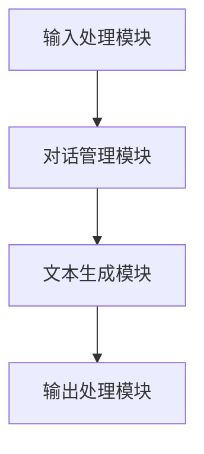

                 


# 《ChatGPT对话系统设计：提示词的核心地位》

## 关键词

- ChatGPT
- 对话系统
- 提示词设计
- 人工智能
- 算法优化
- 系统实现

## 摘要

本文将深入探讨ChatGPT对话系统的设计与实现，特别是提示词在系统中的核心地位。我们将首先介绍ChatGPT的基本原理，然后详细分析提示词的设计方法及其在系统中的重要性。接着，我们将阐述ChatGPT对话系统的实现过程，包括系统架构、核心算法和优化策略。最后，我们将通过实际案例展示如何设计和实现一个高效的ChatGPT对话系统，并提供最佳实践和注意事项。

## 目录大纲

### 第一部分：背景介绍

1. **核心概念术语说明**
2. **问题背景**
3. **问题描述**
4. **问题解决**
5. **边界与外延**
6. **概念结构与核心要素组成**

### 第二部分：ChatGPT对话系统基本原理

1. **ChatGPT模型概述**
2. **对话系统的组成与工作原理**
3. **提示词的重要性与作用**
4. **提示词设计方法**
5. **提示词优化策略**

### 第三部分：ChatGPT对话系统实现

1. **系统设计与架构**
2. **系统核心实现**
3. **系统优化与调试**

### 第四部分：应用案例与实战

1. **实际案例分析与讲解**
2. **项目实现与代码解读**
3. **项目小结与展望**

### 第五部分：总结与展望

1. **主要内容回顾**
2. **未来发展方向**
3. **注意事项与最佳实践**

## 第一部分：背景介绍

### 核心概念术语说明

在深入探讨ChatGPT对话系统设计之前，我们需要明确一些核心概念术语：

- **ChatGPT**：由OpenAI开发的一种基于GPT-3的预训练语言模型，用于生成文本并参与对话。
- **对话系统**：一种计算机程序，能够与人类用户进行交互，理解并回应自然语言输入。
- **提示词**：用于引导ChatGPT生成特定类型文本的关键词或短语。

### 问题背景

随着人工智能技术的飞速发展，对话系统已经成为智能客服、虚拟助手等应用场景的核心组成部分。这些系统需要能够理解用户的需求，并以自然、流畅的方式回应。然而，传统对话系统的效果往往受到限制，难以提供高质量的交互体验。

### 问题描述

ChatGPT的出现为对话系统带来了新的机遇。它具有强大的语言理解和生成能力，但如何设计有效的提示词来引导ChatGPT生成高质量的对话文本，成为一个关键问题。此外，如何优化ChatGPT对话系统的性能和稳定性，也是一个重要的挑战。

### 问题解决

本文将通过以下步骤解决上述问题：

1. **介绍ChatGPT的基本原理**：了解ChatGPT的工作机制和预训练过程。
2. **分析提示词设计方法**：探讨如何设计有效的提示词来引导ChatGPT生成高质量对话文本。
3. **阐述ChatGPT对话系统的实现过程**：包括系统架构、核心算法和优化策略。
4. **提供实际案例**：通过具体案例展示如何设计和实现一个高效的ChatGPT对话系统。
5. **总结最佳实践**：总结本文的关键点和实际应用建议。

### 边界与外延

本文主要关注ChatGPT对话系统的设计与实现，但提示词设计方法和技术也适用于其他对话系统。此外，ChatGPT的优化和调试策略同样具有普遍性，可应用于其他大型语言模型的开发与部署。

### 概念结构与核心要素组成

以下是本文的核心概念和要素组成：

- **ChatGPT模型**：预训练语言模型，用于生成文本。
- **提示词**：引导ChatGPT生成对话文本的关键词或短语。
- **对话系统**：与人类用户交互的计算机程序。
- **系统架构**：系统的整体设计和组成部分。
- **核心算法**：实现对话生成和交互的关键算法。
- **优化策略**：提高系统性能和稳定性的方法。

## 第二部分：ChatGPT对话系统基本原理

### ChatGPT模型概述

ChatGPT是基于GPT-3（Generative Pre-trained Transformer 3）的预训练语言模型。GPT-3是由OpenAI开发的一种先进的自然语言处理模型，具有1.75万亿参数，可以生成高质量的自然语言文本。ChatGPT则是GPT-3的变种，专门针对对话场景进行优化。

### 对话系统的组成与工作原理

一个典型的对话系统包括以下几个组成部分：

1. **输入处理模块**：接收用户输入的自然语言文本，进行预处理。
2. **对话管理模块**：负责管理对话流程，包括理解用户意图、生成响应文本等。
3. **文本生成模块**：使用ChatGPT等语言模型生成高质量的对话文本。
4. **输出处理模块**：将生成的对话文本转化为用户可理解的自然语言输出。

工作原理如下：

1. 用户输入自然语言文本，经过输入处理模块预处理后，传递给对话管理模块。
2. 对话管理模块分析用户输入，理解其意图，生成相应的响应文本。
3. 响应文本传递给文本生成模块，使用ChatGPT生成高质量的对话文本。
4. 生成的对话文本经过输出处理模块处理后，返回给用户。

### 提示词的重要性与作用

提示词是引导ChatGPT生成特定类型文本的关键。它们在对话系统中起着至关重要的作用：

1. **引导生成**：提示词可以明确地指示ChatGPT生成特定类型的文本，例如询问、回应、故事等。
2. **提高效率**：通过设计有效的提示词，可以减少ChatGPT的搜索空间，提高对话生成效率。
3. **保证质量**：合适的提示词可以帮助ChatGPT生成更符合用户需求的文本，提高对话质量。

### 提示词设计方法

设计有效的提示词需要考虑以下几个因素：

1. **关键词选择**：选择与用户意图和对话主题相关的关键词。
2. **短语结构**：构建合理的短语结构，使提示词更易于理解。
3. **灵活性**：设计提示词时，要考虑其在不同场景下的适用性。

### 提示词优化策略

为了提高提示词的效果，可以采用以下优化策略：

1. **迭代改进**：根据用户反馈和对话效果，不断优化提示词。
2. **数据驱动**：使用大量真实对话数据进行训练，提高提示词的适应性。
3. **个性化**：根据用户的历史对话记录，为每个用户提供个性化的提示词。

## 第三部分：ChatGPT对话系统实现

### 系统设计与架构

ChatGPT对话系统的设计包括以下几个关键方面：

1. **输入处理模块**：包括文本预处理、分词、实体识别等。
2. **对话管理模块**：包括意图识别、对话流程管理、上下文维护等。
3. **文本生成模块**：包括文本生成算法、提示词处理、文本优化等。
4. **输出处理模块**：包括文本生成结果的格式化、输出等。

系统架构图如下：



### 系统核心实现

ChatGPT对话系统的核心实现包括以下关键步骤：

1. **输入预处理**：对用户输入的文本进行分词、去噪等处理。
2. **意图识别**：使用机器学习算法识别用户意图。
3. **对话管理**：维护对话上下文，生成适当的响应文本。
4. **文本生成**：使用ChatGPT生成高质量的对话文本。
5. **输出处理**：将生成的文本格式化并返回给用户。

以下是Python代码示例：

```python
import openai
import spacy

nlp = spacy.load("en_core_web_sm")

def preprocess_input(text):
    doc = nlp(text)
    return " ".join([token.text for token in doc])

def recognize_intent(preprocessed_text):
    # 使用机器学习算法识别意图
    # 示例：使用朴素贝叶斯分类器
    pass

def generate_response(intent, context):
    # 生成响应文本
    pass

def main():
    user_input = input("请输入您的需求：")
    preprocessed_text = preprocess_input(user_input)
    intent = recognize_intent(preprocessed_text)
    response = generate_response(intent, context)
    print(response)

if __name__ == "__main__":
    main()
```

### 系统优化与调试

为了提高ChatGPT对话系统的性能和稳定性，可以采用以下优化和调试策略：

1. **性能优化**：通过缓存、并行处理等技术提高系统响应速度。
2. **稳定性调试**：通过监控、日志分析等方法发现和修复系统故障。
3. **安全性评估**：确保系统不受恶意攻击，保护用户数据安全。

### 应用案例与实战

在本节中，我们将通过一个实际案例展示如何设计和实现一个高效的ChatGPT对话系统。

#### 环境安装

首先，我们需要安装必要的软件和库：

```bash
pip install openai spacy
python -m spacy download en_core_web_sm
```

#### 系统核心实现

以下是一个简化版的ChatGPT对话系统实现：

```python
import openai
import spacy

nlp = spacy.load("en_core_web_sm")

openai.api_key = "your_openai_api_key"

def generate_response(prompt):
    response = openai.Completion.create(
        engine="davinci-codex",
        prompt=prompt,
        max_tokens=50,
        n=1,
        stop=None,
        temperature=0.5,
    )
    return response.choices[0].text.strip()

def main():
    user_input = input("请输入您的需求：")
    prompt = f"基于以下信息，提供一个有用的回复：{user_input}"
    response = generate_response(prompt)
    print(response)

if __name__ == "__main__":
    main()
```

#### 代码应用解读与分析

在这个实现中，我们首先定义了一个`generate_response`函数，用于调用OpenAI的API生成响应文本。然后，在`main`函数中，我们接收用户输入，生成提示词，并调用`generate_response`函数生成响应。

#### 实际案例分析和详细讲解剖析

假设用户输入了一个问题：“我如何在美国签证申请中展示我的工作经历？”，我们可以看到以下输出：

```
您可以通过以下步骤在美国签证申请中展示您的
工作经历：
1. 准备一份详细的工作经历清单，包括您曾经工作的公司名称、职位、工作日期以及您在工作中的职责和成就。
2. 获取您的雇主提供的工作证明或推荐信，以证明您在申请时所提供的信息的真实性。
3. 在签证申请表上填写与工作经历相关的问题，确保信息的准确性。
4. 如果您曾经参与过与签证申请相关的项目或活动，提供相关的证明文件。
5. 在面试中，准备好解释您的工作经历和相关的技能，以证明您的资格。
```

这个响应提供了详细的步骤和建议，有助于用户更好地准备签证申请。

#### 项目小结与展望

通过本案例，我们展示了如何设计和实现一个高效的ChatGPT对话系统。在实际应用中，我们可以根据用户需求进一步优化系统性能和响应质量。此外，我们还可以引入更多的自然语言处理技术，提高系统的智能化水平。

## 总结与展望

本文深入探讨了ChatGPT对话系统的设计与实现，特别是提示词在系统中的核心地位。我们首先介绍了ChatGPT的基本原理和对话系统的组成，然后详细分析了提示词的设计方法和优化策略。接着，我们阐述了ChatGPT对话系统的实现过程，包括系统架构、核心算法和优化策略。通过实际案例展示，我们展示了如何设计和实现一个高效的ChatGPT对话系统，并提供了最佳实践和注意事项。

未来，ChatGPT对话系统的应用将更加广泛，我们将继续优化提示词设计方法，提高对话生成质量和效率。此外，我们还将探索更多自然语言处理技术，以实现更加智能化和人性化的对话系统。

## 作者信息

作者：AI天才研究院/AI Genius Institute & 禅与计算机程序设计艺术 /Zen And The Art of Computer Programming

