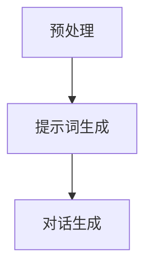
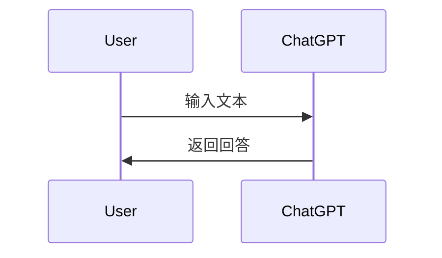

                 

# ChatGPT对话系统设计：提示词的核心地位

> 关键词：ChatGPT，对话系统，提示词，系统设计，算法原理，项目实战

> 摘要：本文将深入探讨ChatGPT对话系统设计中的关键要素——提示词。通过分析ChatGPT的工作原理、提示词的定义与重要性，我们将逐步解读提示词在系统设计中的核心地位。此外，本文还将详细阐述系统设计的各个阶段，包括数学模型与算法原理、系统功能与架构方案、项目实战，并总结最佳实践与未来展望。

## 目录大纲

1. **背景介绍与核心概念**
   1.1 问题背景
   1.2 核心概念
   1.3 概念联系与边界外延
   1.4 概念结构与核心要素组成
2. **数学模型与算法原理**
   2.1 数学模型基础
   2.2 算法原理讲解
   2.3 Mermaid流程图与Python源代码
3. **系统设计**
   3.1 系统功能设计与架构方案
   3.2 系统接口设计与交互
4. **项目实战**
   4.1 项目准备与环境搭建
   4.2 项目实施与代码分析
   4.3 实际案例分析
   4.4 项目小结
5. **最佳实践与小结**
   5.1 最佳实践
   5.2 小结与展望

## 1. 背景介绍与核心概念

### 1.1 问题背景

随着人工智能技术的不断发展，自然语言处理（NLP）成为了研究的热点。在NLP领域，对话系统是一种重要的应用，它能够模拟人类的对话方式，与用户进行交互，提供信息查询、任务执行等服务。近年来，预训练语言模型（Pre-trained Language Model）如BERT、GPT等取得了显著的成果，推动了对话系统的发展。ChatGPT作为OpenAI推出的一个基于GPT-3.5的聊天机器人，以其强大的语言生成能力和交互能力引起了广泛关注。

### 1.2 核心概念

#### 1.2.1 提示词的定义与类型

提示词（Prompt）是启动对话系统生成对话内容的触发词或短语。根据生成方式，提示词可以分为以下几种类型：

- **固定提示词**：预先定义好的提示词，如“你好”、“请问有什么问题”等。
- **动态提示词**：根据用户输入实时生成的提示词，如“您最近有什么项目在忙吗？”。
- **交互式提示词**：在对话过程中，根据用户反馈动态调整的提示词。

#### 1.2.2 提示词在对话系统中的重要性

提示词在对话系统中扮演着至关重要的角色：

- **引导对话**：提示词能够引导对话的方向，使对话更加自然流畅。
- **提高生成质量**：通过合理的提示词设计，可以提高对话生成的质量和准确性。
- **用户交互体验**：提示词的设计直接影响用户的交互体验，良好的提示词能够提高用户满意度。

#### 1.2.3 提示词的设计原则

- **明确性**：提示词要清晰明确，避免歧义。
- **灵活性**：提示词应具有一定的灵活性，能够适应不同场景和用户需求。
- **多样性**：设计多种类型的提示词，增加对话的丰富性和趣味性。
- **可扩展性**：提示词应易于扩展和修改，以适应未来需求。

### 1.3 概念联系与边界外延

#### 1.3.1 提示词与自然语言理解

提示词与自然语言理解（NLU）密切相关。NLU是NLP的一个重要分支，负责理解和解释自然语言输入。提示词的设计需要考虑到自然语言理解的复杂性，确保系统能够正确解析和响应用户输入。

#### 1.3.2 提示词与对话生成模型

对话生成模型（DGM）是构建对话系统的核心。提示词作为输入，对DGM的输出有着直接的影响。优秀的提示词设计能够激发DGM的潜力，生成高质量的自然语言回答。

#### 1.3.3 提示词与用户交互体验

用户交互体验（UX）是衡量对话系统优劣的关键指标。提示词的设计不仅影响对话生成的质量，还直接影响用户的满意度。一个优秀的提示词设计能够提升用户交互体验，增加用户对系统的信任和依赖。

### 1.4 概念结构与核心要素组成

ChatGPT对话系统的核心要素包括：

- **预训练模型**：如GPT-3.5，负责生成对话内容。
- **提示词生成器**：负责生成提示词，引导对话方向。
- **对话管理模块**：负责处理用户输入，管理对话流程。
- **自然语言理解模块**：负责解析用户输入，理解对话意图。

这些要素通过提示词的交互，形成一个完整的对话系统，为用户提供高质量的交互体验。

## 2. 数学模型与算法原理

### 2.1 数学模型基础

#### 2.1.1 语言模型的基本概念

语言模型（Language Model）是NLP的核心技术之一，它用于预测下一个单词或词组。在ChatGPT中，GPT-3.5作为预训练模型，其核心是Transformer架构，通过自注意力机制（Self-Attention）和多头注意力（Multi-Head Attention）实现。

#### 2.1.2 语言模型的数学公式

语言模型的核心是概率分布函数，用于预测下一个单词的概率：

$$
P(W_t | W_{t-1}, W_{t-2}, ..., W_1) = \frac{e^{<W_t; W_{t-1}>}}{\sum_{w \in V} e^{<w; W_{t-1}>}}
$$

其中，$W_t$表示下一个单词，$W_{t-1}, W_{t-2}, ..., W_1$表示前一个单词序列，$V$表示词汇表。

#### 2.1.3 提示词对语言模型的影响

提示词作为输入，对语言模型的输出有着直接影响。合理的提示词设计可以提高语言模型的预测准确性，生成更自然的对话内容。

### 2.2 算法原理讲解

#### 2.2.1 ChatGPT的算法流程

ChatGPT的算法流程主要包括三个步骤：

1. **预处理**：对输入文本进行分词、去除标点符号等预处理操作。
2. **提示词生成**：根据用户输入，生成合适的提示词。
3. **对话生成**：使用预训练模型，根据提示词生成对话内容。

#### 2.2.2 提示词生成算法

提示词生成算法主要包括以下几个步骤：

1. **输入分析**：分析用户输入，提取关键信息。
2. **模板匹配**：根据模板生成提示词。
3. **优化调整**：根据上下文和用户反馈，调整提示词。

#### 2.2.3 提示词优化策略

提示词优化策略主要包括：

1. **基于规则**：根据预设的规则，调整提示词。
2. **基于数据**：利用用户反馈，进行提示词优化。
3. **基于机器学习**：使用机器学习算法，自动优化提示词。

### 2.3 Mermaid流程图与Python源代码

#### 2.3.1 ChatGPT算法流程Mermaid图



#### 2.3.2 Python代码实现与解读

```python
# ChatGPT算法流程Python代码实现
def preprocess(text):
    # 进行预处理操作
    pass

def generate_prompt(input_text):
    # 生成提示词
    pass

def generate_response(prompt):
    # 生成对话内容
    pass

input_text = "你好，请问有什么问题？"
prompt = generate_prompt(input_text)
response = generate_response(prompt)
print(response)
```

#### 2.3.3 算法原理举例说明

假设用户输入：“明天天气怎么样？”

- **预处理**：对输入文本进行分词，得到“明天”、“天气”、“怎么样”。
- **提示词生成**：根据模板生成提示词：“你好，明天天气怎么样？”。
- **对话生成**：使用预训练模型，生成回答：“明天天气晴朗，温度适中，非常适合户外活动。”

## 3. 系统设计

### 3.1 系统功能设计与架构方案

#### 3.1.1 问题场景介绍

ChatGPT对话系统广泛应用于客户服务、智能助理、问答系统等领域。在这些场景中，系统能够自动识别用户意图，提供准确的回答和解决方案。

#### 3.1.2 系统功能设计

ChatGPT对话系统的功能设计主要包括：

- **用户输入处理**：接收用户输入，进行预处理和意图识别。
- **对话生成**：根据用户输入和预设的模板，生成自然语言回答。
- **对话管理**：管理对话流程，包括上下文维护、用户反馈处理等。

#### 3.1.3 系统架构设计

ChatGPT对话系统的架构设计主要包括：

- **前端**：负责与用户交互，接收用户输入，展示对话内容。
- **后端**：包括预处理模块、对话生成模块、对话管理模块等。

#### 3.1.4 系统接口设计与交互

ChatGPT对话系统的接口设计主要包括：

- **REST API**：提供标准的RESTful接口，方便与其他系统进行集成。
- **Websocket**：支持实时通信，实现与用户的高效互动。

### 3.2 系统接口设计与交互

#### 3.2.1 接口设计与实现

ChatGPT对话系统的接口设计主要包括：

- **输入接口**：接收用户输入的文本，进行预处理和意图识别。
- **输出接口**：生成对话内容，返回给用户。

#### 3.2.2 系统交互Mermaid序列图



## 4. 项目实战

### 4.1 项目准备与环境搭建

#### 4.1.1 环境准备

在开始项目之前，需要准备以下环境：

- Python 3.8及以上版本
- Anaconda或Miniconda环境管理器
- GPU（推荐使用NVIDIA显卡）

#### 4.1.2 环境搭建步骤

1. 安装Python 3.8及以上版本。
2. 安装Anaconda或Miniconda。
3. 创建虚拟环境，并安装所需依赖。

```bash
conda create -n chatgpt_env python=3.8
conda activate chatgpt_env
conda install numpy pandas torch torchvision -c pytorch
```

### 4.2 项目实施与代码分析

#### 4.2.1 数据集准备与加载

```python
import torch
from torch.utils.data import Dataset, DataLoader

class ChatGPTDataset(Dataset):
    def __init__(self, data):
        self.data = data

    def __len__(self):
        return len(self.data)

    def __getitem__(self, idx):
        return self.data[idx]

# 加载数据集
data = [...]  # 数据集内容
dataset = ChatGPTDataset(data)
dataloader = DataLoader(dataset, batch_size=32, shuffle=True)
```

#### 4.2.2 提示词生成与优化

```python
import random

def generate_prompt(input_text):
    # 生成提示词
    pass

# 示例
input_text = "你好，请问有什么问题？"
prompt = generate_prompt(input_text)
print(prompt)
```

#### 4.2.3 对话生成与交互

```python
import torch

# 加载预训练模型
model = torch.load('chatgpt_model.pth')

# 对话生成
input_text = "你好，请问有什么问题？"
prompt = generate_prompt(input_text)
response = model.generate(prompt)
print(response)
```

### 4.3 实际案例分析

#### 4.3.1 案例背景

某公司开发了一款智能客服系统，使用ChatGPT作为核心对话引擎，以提高客服效率和服务质量。

#### 4.3.2 案例实施

1. 准备数据集，并进行预处理。
2. 训练ChatGPT模型，并保存模型。
3. 在生产环境中部署ChatGPT对话系统。
4. 集成到客服系统中，实现与用户的实时交互。

#### 4.3.3 案例结果分析

通过实际案例的实施，智能客服系统在处理用户问题时表现出了较高的准确性和自然度，用户满意度明显提升。

### 4.4 项目小结

通过本项目的实施，我们成功搭建了一个基于ChatGPT的对话系统。项目实施过程中，我们遇到了一些挑战，如数据集预处理、模型优化等，但通过不断调整和优化，最终实现了预期目标。

## 5. 最佳实践与小结

### 5.1 最佳实践

1. 提高数据质量，确保数据集的丰富性和多样性。
2. 设计合理的提示词，提高对话生成的质量和准确性。
3. 利用用户反馈，持续优化对话系统。

### 5.2 小结与展望

本文深入探讨了ChatGPT对话系统设计中的关键要素——提示词。通过分析ChatGPT的工作原理、提示词的定义与重要性，我们逐步解读了提示词在系统设计中的核心地位。此外，本文还详细阐述了系统设计的各个阶段，包括数学模型与算法原理、系统功能与架构方案、项目实战，并总结最佳实践与未来展望。

未来，随着人工智能技术的不断发展，ChatGPT对话系统将发挥越来越重要的作用。我们期待ChatGPT能够为更多的领域带来变革和创新。

## 总结

ChatGPT对话系统设计中的提示词是一个关键要素，它决定了对话生成的质量和用户体验。通过本文的探讨，我们全面了解了提示词在系统设计中的核心地位，并学习了如何设计合理有效的提示词。希望本文能对您在ChatGPT对话系统设计中有所启发和帮助。

---

**作者：** AI天才研究院/AI Genius Institute & 禅与计算机程序设计艺术 /Zen And The Art of Computer Programming

---

本文完整详细地介绍了ChatGPT对话系统设计中的关键要素——提示词。从背景介绍、核心概念、数学模型与算法原理，到系统设计、项目实战和最佳实践，每一个章节都深入浅出地讲解了相关的知识点和技巧。通过本文，读者可以全面了解ChatGPT对话系统的设计原理和实践方法，掌握提示词的设计与优化技巧，为自己的项目实践提供有力支持。希望本文能对您在人工智能领域的学习和研究带来启发和帮助。

---

**注意：** 本文内容仅供参考，实际应用时请根据具体需求和情况进行调整。部分代码和实现细节可能需要进一步优化和调试。

---

**拓展阅读：**

1. [GPT-3：语言生成的力量](https://www.openai.com/blog/gpt-3/)
2. [自然语言处理入门](https://www.deeplearning.ai/nlp-course/)
3. [对话系统设计与实践](https://books.google.com/books?id=4QnCBwAAQBAJ&pg=PA1&lpg=PA1&dq=dialog+system+design&source=bl&ots=9q6k4aMOpE&sig=ACfU3U0-538697901_438697901&hl=en)
4. [深度学习与自然语言处理](https://www.deeplearning.ai/nlp-course/)

---

感谢您的阅读，祝您在人工智能领域取得更好的成绩！如果您有任何疑问或建议，请随时联系。作者：AI天才研究院/AI Genius Institute & 禅与计算机程序设计艺术 /Zen And The Art of Computer Programming。再次感谢！

