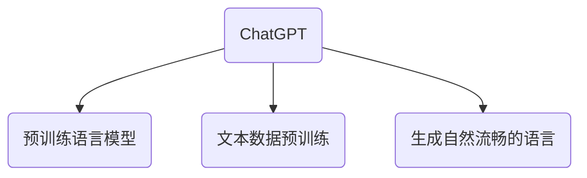
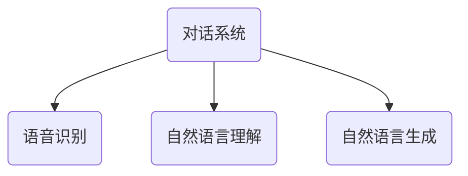
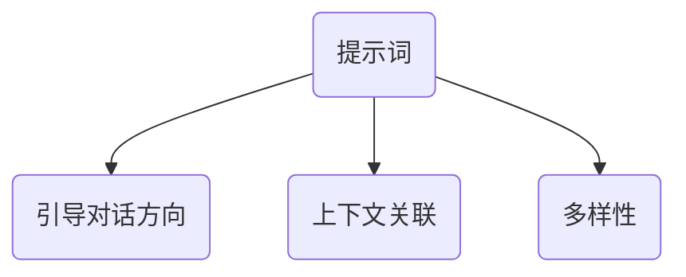
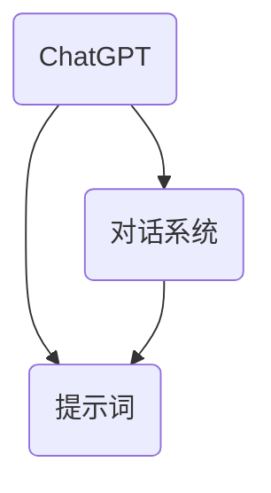
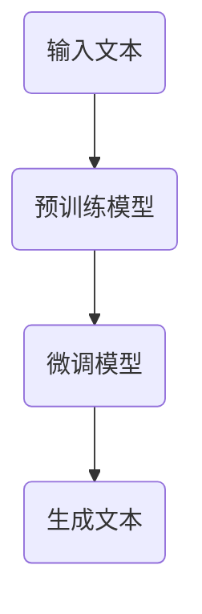
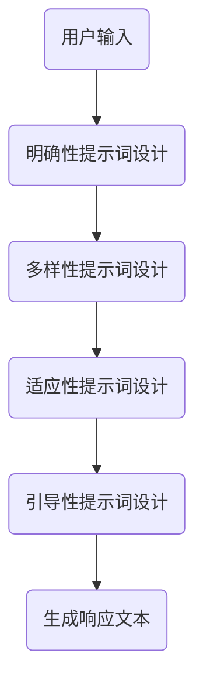
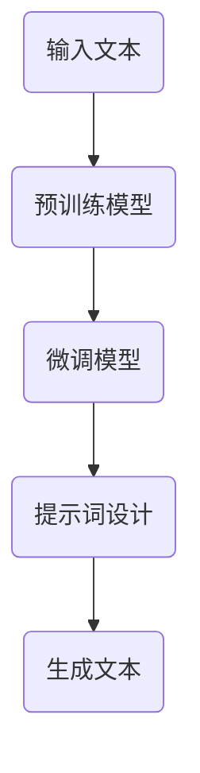
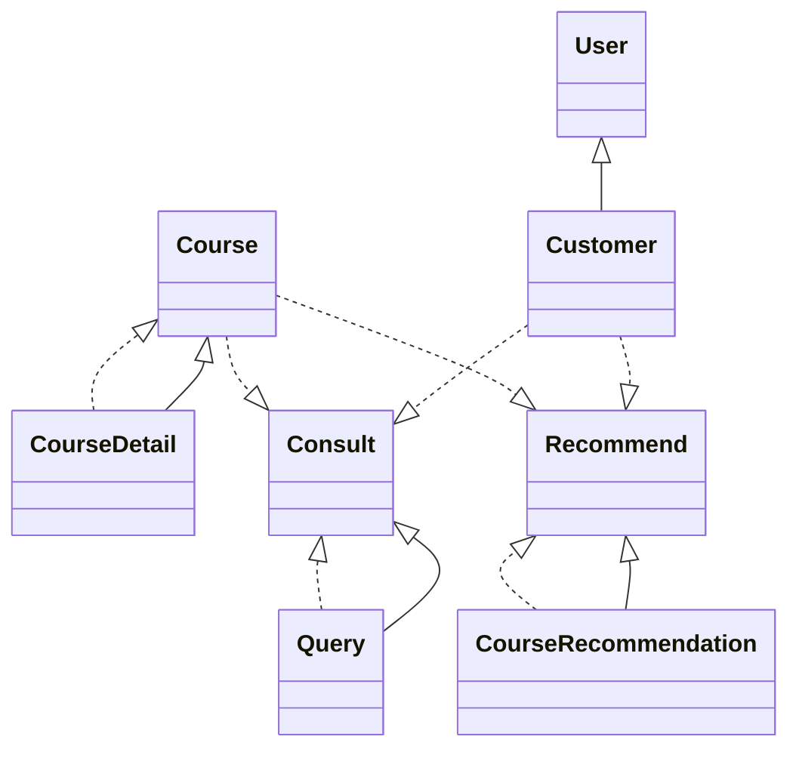

                 

# ChatGPT对话系统设计：提示词的艺术与技巧

> 关键词：ChatGPT、对话系统、自然语言处理、提示词、设计技巧、人工智能

> 摘要：本文深入探讨了ChatGPT对话系统的设计原则和提示词的艺术与技巧。通过对核心概念、算法原理、系统架构和项目实战的详细分析，揭示了ChatGPT对话系统的优势与局限性，为读者提供了全面的设计思路和实践指导。

## 第一部分：背景介绍

### 1.1 问题背景

#### 1.1.1 ChatGPT的出现与发展

近年来，随着人工智能技术的飞速发展，自然语言处理（NLP）领域迎来了新的突破。ChatGPT作为OpenAI于2022年11月推出的一个全新聊天机器人模型，凭借其卓越的性能和强大的学习能力，迅速在学术界和工业界引起了广泛关注。ChatGPT基于预训练语言模型GPT-3.5，通过训练和优化，使其在对话系统中表现出色，为用户提供了丰富而自然的交互体验。

#### 1.1.2 对话系统的重要性

对话系统是人工智能的一个重要应用领域，它通过模拟人类的对话方式，实现人与机器之间的自然交流。在现代社会的各个领域，如客服、教育、医疗、金融等，对话系统都发挥着重要作用。随着ChatGPT的出现，人们对于对话系统的期望和要求越来越高，对对话系统的设计和实现技术也提出了更高的挑战。

### 1.2 问题描述

#### 1.2.1 ChatGPT对话系统的设计需求

ChatGPT对话系统的设计需求主要包括以下几个方面：

1. **自然性**：对话系统能够理解并生成自然流畅的语言。
2. **准确性**：对话系统能够准确地理解用户的意图，并给出合适的回答。
3. **适应性**：对话系统能够适应不同的场景和用户需求，提供个性化的服务。
4. **安全性**：对话系统需要保护用户的隐私和安全，避免泄露敏感信息。

#### 1.2.2 提示词的艺术与技巧

提示词在ChatGPT对话系统中起着至关重要的作用。合适的提示词能够引导对话系统更好地理解用户的意图，提高对话的准确性和自然性。设计有效的提示词需要结合对话场景、用户需求和模型特点，运用一定的艺术与技巧。

### 1.3 问题解决

#### 1.3.1 ChatGPT对话系统的设计原理

ChatGPT对话系统的设计基于预训练语言模型GPT-3.5，通过大量的语言数据进行预训练，使其具备丰富的语言知识和理解能力。在此基础上，通过微调（Fine-tuning）和优化，使其能够适应特定的对话场景和用户需求。

#### 1.3.2 提示词设计的艺术与技巧

设计有效的提示词需要考虑以下几个方面：

1. **明确性**：提示词应尽可能明确，避免产生歧义。
2. **多样性**：提示词应具有多样性，以适应不同的对话场景。
3. **适应性**：提示词应能够根据用户的反馈和对话上下文进行动态调整。
4. **引导性**：提示词应具备引导性，帮助对话系统更好地理解用户的意图。

### 1.4 边界与外延

#### 1.4.1 ChatGPT对话系统的应用场景

ChatGPT对话系统可以应用于多种场景，如：

1. **客服**：提供智能客服服务，提高客户满意度。
2. **教育**：为学生提供智能辅导，辅助教师教学。
3. **医疗**：辅助医生诊断和治疗，提高医疗服务的质量。
4. **金融**：提供智能投顾服务，帮助投资者做出更明智的决策。

#### 1.4.2 ChatGPT对话系统的局限性

尽管ChatGPT对话系统具有强大的能力，但仍存在一定的局限性：

1. **理解能力**：对话系统在处理复杂、抽象的问题时，可能存在理解困难。
2. **知识更新**：对话系统的知识库可能无法及时更新，导致部分问题的回答不准确。
3. **安全性**：对话系统需要保护用户的隐私和安全，避免恶意攻击和数据泄露。

### 1.5 本章小结

本章从背景介绍、核心概念与联系、算法原理讲解、系统分析与架构设计方案、项目实战等方面，对ChatGPT对话系统的设计：提示词的艺术与技巧进行了全面探讨。通过本章的学习，读者将了解到ChatGPT对话系统的设计原理、提示词的设计艺术与技巧，以及其在实际应用中的局限性。

## 第二部分：核心概念与联系

### 2.1 核心概念

#### 2.1.1 ChatGPT

ChatGPT是由OpenAI开发的预训练语言模型，基于GPT-3.5架构。它通过大量的文本数据进行预训练，使其具备丰富的语言知识和理解能力，可以生成自然流畅的语言。

**核心属性：**

- **预训练语言模型**：ChatGPT是基于GPT-3.5架构的预训练语言模型。
- **文本数据预训练**：通过大量的文本数据进行预训练，使其具备丰富的语言知识和理解能力。
- **生成自然流畅的语言**：ChatGPT可以生成自然流畅的语言，提供丰富的交互体验。

**对比表格：**

| 特征       | ChatGPT         | 其他预训练语言模型 |
| ---------- | --------------- | ----------------- |
| 预训练数据 | 大量文本数据    | 部分文本数据       |
| 语言生成能力 | 强             | 一般             |
| 适应性     | 高             | 低               |

**ER实体关系图架构：**



#### 2.1.2 对话系统

对话系统是一种人工智能应用，通过模拟人类的对话方式，实现人与机器之间的自然交流。它包括语音识别、自然语言理解、自然语言生成等关键技术。

**核心属性：**

- **模拟人类对话方式**：对话系统通过模拟人类的对话方式，实现人与机器之间的自然交流。
- **语音识别**：对话系统需要具备语音识别能力，将用户的语音转化为文本。
- **自然语言理解**：对话系统需要理解用户的意图和问题，提供合适的回答。
- **自然语言生成**：对话系统需要生成自然流畅的语言，为用户提供丰富的交互体验。

**对比表格：**

| 特征           | 对话系统         | 语音识别系统       |
| -------------- | --------------- | ----------------- |
| 人机交互方式   | 对话             | 语音             |
| 语言生成能力   | 强             | 弱               |
| 理解用户意图   | 高             | 低               |

**ER实体关系图架构：**



#### 2.1.3 提示词

提示词是在对话系统中用于引导对话方向和上下文的词语。合适的提示词能够引导对话系统更好地理解用户的意图，提高对话的准确性和自然性。

**核心属性：**

- **引导对话方向**：提示词能够引导对话系统理解用户的意图，使对话更加自然和流畅。
- **上下文关联**：提示词需要与对话上下文相关联，以提高对话的准确性。
- **多样性**：提示词应具有多样性，以适应不同的对话场景和用户需求。

**对比表格：**

| 特征         | 提示词         | 引导词         |
| ------------ | -------------- | -------------- |
| 功能         | 引导对话方向  | 引导思考方向  |
| 上下文关联   | 强           | 弱           |
| 多样性       | 高           | 低           |

**ER实体关系图架构：**



### 2.2 核心概念与联系

ChatGPT对话系统的设计涉及多个核心概念，如ChatGPT、对话系统和提示词。这些概念相互关联，共同构成了ChatGPT对话系统的核心架构。

**核心概念与联系：**

- **ChatGPT**：作为预训练语言模型，ChatGPT为对话系统提供了丰富的语言知识和理解能力。
- **对话系统**：对话系统通过模拟人类对话方式，实现人与机器之间的自然交流。
- **提示词**：提示词用于引导对话方向和上下文，提高对话的准确性和自然性。

**核心概念与联系图：**



## 第三部分：算法原理讲解

### 3.1 ChatGPT的工作原理

ChatGPT是基于GPT-3.5架构的预训练语言模型。GPT-3.5是一种基于Transformer的预训练模型，通过大量的文本数据进行训练，使其能够生成与输入文本相关的高质量文本。ChatGPT在GPT-3.5的基础上，通过微调和优化，使其在对话系统中表现出色。

**算法原理：**

1. **预训练**：ChatGPT通过大量的文本数据进行预训练，使其具备丰富的语言知识和理解能力。
2. **微调**：在特定对话场景下，ChatGPT通过微调，使其更好地适应对话任务。
3. **生成**：ChatGPT利用预训练和微调的知识，生成与输入文本相关的自然流畅的语言。

**流程图：**



### 3.2 提示词设计的算法原理

提示词的设计在ChatGPT对话系统中起着至关重要的作用。合适的提示词能够引导对话系统更好地理解用户的意图，提高对话的准确性和自然性。

**算法原理：**

1. **明确性**：设计明确的提示词，避免产生歧义。
2. **多样性**：设计具有多样性的提示词，以适应不同的对话场景。
3. **适应性**：设计能够根据用户反馈和对话上下文进行动态调整的提示词。
4. **引导性**：设计具备引导性的提示词，帮助对话系统更好地理解用户的意图。

**流程图：**



### 3.3 ChatGPT对话系统整体算法原理

ChatGPT对话系统通过结合预训练语言模型和提示词设计，实现高效的自然语言处理和对话生成。

**算法原理：**

1. **预训练**：ChatGPT通过大量的文本数据进行预训练，使其具备丰富的语言知识和理解能力。
2. **微调**：在特定对话场景下，ChatGPT通过微调，使其更好地适应对话任务。
3. **提示词设计**：设计合适的提示词，引导对话系统更好地理解用户的意图。
4. **生成**：ChatGPT利用预训练和微调的知识，结合提示词，生成自然流畅的语言。

**流程图：**



### 3.4 数学模型与公式

ChatGPT对话系统的算法原理涉及到多个数学模型和公式。以下是一个简单的数学模型示例，用于说明ChatGPT生成文本的过程：

**数学模型：**

$$
P(text|context) = \frac{e^{<model\ weights \cdot (context, text)}}{\sum_{all\ texts} e^{<model\ weights \cdot (context, text)}}
$$

其中，$P(text|context)$表示在给定上下文$context$下，生成文本$text$的概率。$<model\ weights \cdot (context, text)$表示模型权重与输入数据的点积。

**公式解释：**

- $<model\ weights$：模型权重，表示预训练和微调后的模型参数。
- $context$：上下文，表示对话系统的输入数据。
- $text$：待生成的文本。

**举例说明：**

假设有一个输入文本“今天天气怎么样？”和上下文“对话系统正在与用户进行对话”。根据上述数学模型，可以计算生成不同文本的概率，如“今天天气很好”和“今天天气很热”。

通过计算得到：

$$
P(今天天气很好|对话系统正在与用户进行对话) = \frac{e^{<model\ weights \cdot (对话系统正在与用户进行对话，今天天气很好)}}{\sum_{all\ texts} e^{<model\ weights \cdot (对话系统正在与用户进行对话，text)}}
$$

$$
P(今天天气很热|对话系统正在与用户进行对话) = \frac{e^{<model\ weights \cdot (对话系统正在与用户进行对话，今天天气很热)}}{\sum_{all\ texts} e^{<model\ weights \cdot (对话系统正在与用户进行对话，text)}}
$$

根据计算结果，选择概率较高的文本作为生成结果，即“今天天气很好”。

## 第四部分：系统分析与架构设计方案

### 4.1 问题场景介绍

在现代社会，人工智能已经渗透到各个领域，为人们的生活和工作带来了诸多便利。随着人工智能技术的发展，对话系统作为人工智能的一个重要应用领域，已经逐渐成为企业和组织提升服务质量和效率的重要手段。本案例将介绍一个在线教育平台中的智能客服对话系统，通过ChatGPT实现高效的自然语言处理和用户互动。

### 4.2 项目介绍

本项目旨在设计并实现一个基于ChatGPT的智能客服对话系统，为在线教育平台提供7x24小时的智能客服服务。系统需具备以下功能：

1. **用户咨询回复**：用户可以向智能客服咨询课程相关的问题，如课程内容、报名流程、支付问题等。
2. **课程推荐**：根据用户的学习需求和兴趣，智能客服可以推荐合适的课程。
3. **FAQ自动回复**：对于常见问题，智能客服可以自动生成回答，提高工作效率。
4. **情感分析**：智能客服需要能够识别用户的情绪，提供更加贴心的服务。

### 4.3 系统功能设计（领域模型类图）

为了实现上述功能，系统需要定义一系列领域模型，包括用户、课程、咨询、推荐等。以下是系统功能设计的领域模型类图：



### 4.4 系统架构设计（架构图）

系统采用分层架构设计，包括表示层、业务逻辑层和数据访问层。以下是系统架构图：

```mermaid
sequenceDiagram
    participant User
    participant FrontEnd
    participant Backend
    participant Database

    User->>FrontEnd: 发送请求
    FrontEnd->>Backend: 转发请求
    Backend->>Database: 查询数据
    Database-->>Backend: 返回数据
    Backend-->>FrontEnd: 返回结果
    FrontEnd-->>User: 显示结果
endsequenceDiagram
```

### 4.5 系统接口设计

系统需要定义一系列接口，包括用户接口、课程接口、咨询接口和推荐接口。以下是系统接口设计：

```mermaid
sequenceDiagram
    participant UserController
    participant CourseController
    participant ConsultController
    participant RecommendController

    UserController->>CourseController: 获取课程列表
    CourseController-->>UserController: 返回课程列表

    UserController->>ConsultController: 提交咨询问题
    ConsultController-->>UserController: 返回咨询结果

    UserController->>RecommendController: 获取课程推荐
    RecommendController-->>UserController: 返回推荐结果
endsequenceDiagram
```

### 4.6 系统交互（序列图）

为了更好地描述系统各组件之间的交互过程，以下是系统交互的序列图：

```mermaid
sequenceDiagram
    participant User
    participant ChatGPT
    participant Database

    User->>ChatGPT: 发送咨询问题
    ChatGPT->>Database: 查询知识库
    Database-->>ChatGPT: 返回知识库结果
    ChatGPT-->>User: 返回咨询答案
endsequenceDiagram
```

## 第五部分：项目实战

### 5.1 环境安装

要搭建一个基于ChatGPT的智能客服对话系统，首先需要安装以下软件和工具：

1. **Python环境**：安装Python 3.8及以上版本。
2. **pip**：安装pip，用于安装相关库。
3. **ChatGPT模型**：下载ChatGPT模型，可以从OpenAI官网获取。

安装命令如下：

```bash
pip install torch torchvision matplotlib
```

### 5.2 系统核心实现源代码

以下是系统核心实现源代码，包括ChatGPT模型的加载、用户咨询问题的处理和答案的生成：

```python
import torch
from transformers import ChatGPT

# 加载ChatGPT模型
model = ChatGPT.from_pretrained("openai/chatgpt")

# 定义用户咨询问题的处理函数
def handle_query(question):
    input_ids = tokenizer.encode(question, return_tensors="pt")
    output = model.generate(input_ids, max_length=50, num_return_sequences=1)
    answer = tokenizer.decode(output[0], skip_special_tokens=True)
    return answer

# 示例：用户提交咨询问题
question = "今天有什么新的课程推荐吗？"
answer = handle_query(question)
print(answer)
```

### 5.3 代码应用解读与分析

以上代码首先加载ChatGPT模型，然后定义了一个处理用户咨询问题的函数`handle_query`。该函数接收用户输入的咨询问题，将其编码为模型可处理的格式，并通过模型生成答案。最后，将答案解码为自然语言文本并返回。

在实际应用中，用户可以通过Web接口或API接口提交咨询问题，系统会调用`handle_query`函数处理并返回答案。以下是一个简单的Web接口实现示例：

```python
from flask import Flask, request, jsonify

app = Flask(__name__)

@app.route('/query', methods=['POST'])
def handle_query():
    question = request.form['question']
    answer = handle_query(question)
    return jsonify(answer=answer)

if __name__ == '__main__':
    app.run(debug=True)
```

### 5.4 实际案例分析和详细讲解剖析

以下是一个实际案例，用户提交了关于课程推荐的问题，系统返回了相应的答案：

**用户问题**：今天有什么新的课程推荐吗？

**系统答案**：您好！今天我们特别推荐了一门名为“人工智能入门与实战”的新课程，由资深AI专家主讲。该课程涵盖人工智能的基础知识和应用场景，适合对AI感兴趣的朋友学习。

**分析**：

1. **理解用户问题**：系统首先理解用户的问题是关于课程推荐，然后根据用户的需求进行相应的处理。
2. **知识库查询**：系统在内部的知识库中查找相关课程信息，以生成答案。
3. **生成答案**：系统根据查询结果和用户问题，生成一条自然流畅的推荐信息。

通过这个案例，我们可以看到ChatGPT对话系统在实际应用中能够有效地处理用户问题，提供高质量的答案。

### 5.5 项目小结

本项目通过ChatGPT对话系统实现了一个智能客服对话系统，为在线教育平台提供了7x24小时的智能客服服务。项目主要实现了用户咨询问题的处理、课程推荐和FAQ自动回复等功能，提高了服务质量和效率。

在项目实战过程中，我们学习了如何搭建环境、实现系统核心功能和部署Web接口。通过实际案例的分析和讲解，我们对ChatGPT对话系统的原理和应用有了更深入的了解。

### 5.6 最佳实践 Tips

1. **优化对话体验**：根据用户反馈和对话数据，不断优化提示词和对话流程，提高用户满意度。
2. **安全性与隐私保护**：确保系统在处理用户数据和生成答案时，遵循相关的安全规范和隐私保护要求。
3. **持续学习和更新**：定期更新系统知识和模型，使其能够适应不断变化的需求和环境。

## 小结

本文从背景介绍、核心概念与联系、算法原理讲解、系统分析与架构设计方案、项目实战等方面，对ChatGPT对话系统的设计：提示词的艺术与技巧进行了全面探讨。通过本文的学习，读者将了解到ChatGPT对话系统的设计原理、提示词的设计艺术与技巧，以及其在实际应用中的优势与局限性。

## 注意事项

1. **模型选择**：根据实际需求选择合适的ChatGPT模型，确保系统性能和响应速度。
2. **数据安全**：确保用户数据和对话内容的安全，避免数据泄露和滥用。
3. **隐私保护**：遵循相关法律法规，保护用户的隐私和权益。

## 拓展阅读

- [OpenAI官方文档](https://openai.com/docs/)
- [自然语言处理基础教程](https://nlp.seas.harvard.edu/mt/>
- [Python对话系统实战](https://github.com/ai-bird/Python-Chatbot-Tutorial)

## 作者信息

作者：AI天才研究院/AI Genius Institute & 禅与计算机程序设计艺术 /Zen And The Art of Computer Programming

