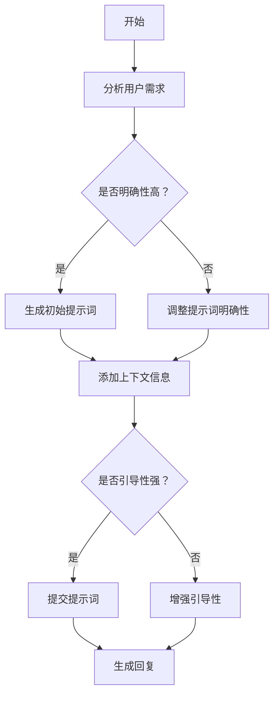

                 

### ChatGPT与对话质量提升概述

#### 问题背景

在人工智能技术迅猛发展的今天，自然语言处理（NLP）已成为各大公司和研究机构关注的焦点。ChatGPT作为OpenAI开发的一种基于GPT-3模型的对话系统，凭借其强大的文本生成能力和交互性，在多个领域展现出巨大的潜力。然而，尽管ChatGPT具有高度的文本生成能力，如何提高其对话质量，使其能够更好地与人类用户进行交流，仍是一个亟待解决的问题。

对话质量是一个多维度的概念，包括语言的自然性、连贯性、相关性、准确性以及友好性等多个方面。一个高质量的对话系统不仅能够提供准确、自然的回答，还需要能够理解用户的意图，并维持顺畅、友好的交流。当前，尽管ChatGPT在生成文本方面表现出色，但在对话质量方面仍有不少提升空间。例如，对话中的信息准确性、上下文理解和用户意图识别等方面都存在一定的不足。

#### 问题描述

当前，ChatGPT对话质量面临以下主要问题：

1. **上下文理解不足**：ChatGPT在处理长文本或复杂对话时，往往难以准确理解上下文信息，导致生成的回复与用户意图不符。
2. **答案准确性问题**：由于模型训练数据的不完备性，ChatGPT在回答某些问题时可能会出现事实错误或误导性回答。
3. **对话连贯性和流畅性**：ChatGPT生成的回复有时缺乏连贯性，使得对话体验不佳。
4. **用户互动友好性**：虽然ChatGPT可以模仿人类的交流方式，但其在处理负面情绪或复杂情感问题时，往往表现得不够自然。

#### 问题解决

为了提升ChatGPT的对话质量，需要从多个方面进行改进。首先，通过改进模型训练数据，提高模型的上下文理解和意图识别能力。其次，优化提示词设计，引导模型生成更准确、更自然的回复。此外，还可以通过引入对话管理机制，实现对话的连贯性和流畅性。

#### 边界与外延

在提升ChatGPT对话质量的过程中，需要注意以下几个边界和限制：

1. **数据质量和多样性**：训练数据的质量和多样性直接影响模型的性能。因此，需要使用高质量的、多样化的数据集进行训练。
2. **模型参数调整**：模型参数的调整需要在保证性能的基础上进行，避免过拟合或欠拟合。
3. **用户隐私保护**：在处理用户交互数据时，需要严格遵循隐私保护法规，确保用户数据的保密性和安全性。
4. **应用场景限定**：尽管ChatGPT具有广泛的应用潜力，但并不是所有场景都适合使用。需要根据具体应用场景选择合适的模型和应用策略。

#### 概念结构与核心要素组成

为了更好地理解和提升ChatGPT的对话质量，我们需要了解其概念结构和核心要素。ChatGPT的核心概念包括：

1. **GPT-3模型**：ChatGPT是基于GPT-3模型开发的，GPT-3是一种基于Transformer的预训练语言模型，具有强大的文本生成能力。
2. **自然语言处理（NLP）**：NLP是使计算机能够理解、处理和生成人类语言的技术，ChatGPT的对话质量提升离不开NLP技术的支持。
3. **对话系统**：对话系统是一种能够与人类进行自然语言交互的计算机系统，ChatGPT就是一种典型的对话系统。

ChatGPT的核心要素包括：

1. **输入文本**：用户输入的文本，用于驱动ChatGPT生成回复。
2. **模型参数**：影响ChatGPT生成回复的质量和风格的参数，包括温度、重复性、频率等。
3. **生成文本**：ChatGPT生成的文本回复，包括对话中的每个语句。
4. **反馈机制**：用户对生成文本的反馈，用于进一步优化ChatGPT的性能。

综上所述，ChatGPT对话质量提升是一个复杂而多层次的任务，需要从多个方面进行改进和优化。通过逐步分析和解决当前面临的问题，我们有望进一步提升ChatGPT的对话质量，为用户提供更加自然、准确和友好的交互体验。

---

### 核心概念与联系

在深入探讨ChatGPT对话质量提升的方法之前，我们首先需要了解几个核心概念：ChatGPT的概念、对话质量评估、Prompt Engineering，并分析这些概念之间的联系。

#### ChatGPT的概念

ChatGPT是基于GPT-3模型开发的对话系统。GPT-3（Generative Pre-trained Transformer 3）是由OpenAI开发的一种大型语言模型，其核心思想是使用Transformer架构对文本数据进行预训练，使其具备理解和生成自然语言的能力。ChatGPT通过接收用户输入的文本，利用GPT-3模型生成回复，从而实现与用户的对话。

#### 对话质量评估

对话质量评估是对话系统的核心问题之一。评估对话质量通常需要考虑多个维度，包括语言的自然性、连贯性、相关性、准确性以及友好性等。常见的评估方法包括人工评估、自动化评估以及用户满意度调查等。例如，可以使用BLEU、ROUGE等指标评估生成文本的准确性；使用BERTScore评估文本的连贯性和相关性；使用用户满意度调查评估对话的友好性。

#### Prompt Engineering

Prompt Engineering，即提示词设计，是提升对话质量的关键技术之一。提示词是对话系统生成回复的引导信息，通过设计合适的提示词，可以引导模型生成更准确、更自然的回答。例如，在处理用户提问时，可以使用引导性问题或上下文信息来帮助模型更好地理解用户意图，从而生成更相关的回复。

#### 概念属性特征对比

为了更好地理解这些概念，我们可以通过一个表格来对比它们的主要属性特征：

| 概念       | 属性特征                                      | 描述                                                         |
|------------|---------------------------------------------|------------------------------------------------------------|
| ChatGPT    | 基于GPT-3模型、文本生成、自然语言交互         | 能够与用户进行自然语言交互，生成符合上下文和用户意图的文本。           |
| 对话质量评估 | 自然性、连贯性、相关性、准确性、友好性         | 通过多个维度评估对话系统生成的回复，以衡量对话质量。                     |
| Prompt Engineering | 提示词设计、引导信息、模型生成优化           | 通过设计合适的提示词，引导模型生成更准确、更自然的回复。                   |

#### ER实体关系图架构

为了更清晰地展示这些概念之间的联系，我们可以使用ER（实体-关系）图来描述。以下是ChatGPT、对话质量评估和Prompt Engineering的ER图：

```mermaid
erDiagram
    ChatGPT ||--|{Prompt Engineering} : 生成回复
    ChatGPT ||--|{对话质量评估} : 评估对话质量
    Prompt Engineering ||--|{对话质量评估} : 设计引导信息
```

在这个ER图中，ChatGPT作为核心实体，与Prompt Engineering和对话质量评估两个子实体之间存在直接关系。Prompt Engineering负责设计引导信息，以优化ChatGPT的回复生成；而对话质量评估则用于衡量生成的回复质量，从而不断优化Prompt Engineering的设计。

#### 关系与联系

ChatGPT、对话质量评估和Prompt Engineering之间的关系可以概括为：

1. **ChatGPT与Prompt Engineering**：ChatGPT依赖Prompt Engineering提供的引导信息，以生成更符合用户意图的回复。Prompt Engineering通过设计合适的提示词，帮助ChatGPT更好地理解和应对用户的输入。
2. **ChatGPT与对话质量评估**：ChatGPT生成的回复需要经过对话质量评估，以判断其是否满足用户期望。对话质量评估的结果可以反馈给Prompt Engineering，帮助其不断优化提示词设计。
3. **Prompt Engineering与对话质量评估**：Prompt Engineering的设计直接影响对话质量评估的结果。通过优化提示词，可以提升生成回复的质量，从而提高对话系统的整体性能。

综上所述，ChatGPT、对话质量评估和Prompt Engineering之间存在着紧密的联系，共同构成了一个相互影响、相互优化的生态系统。理解这些概念及其关系，是提升ChatGPT对话质量的重要前提。

---

### 提示词设计原理

#### 提示词的基本结构

提示词（Prompt）是引导ChatGPT生成回复的关键要素。一个有效的提示词通常由以下几个部分组成：

1. **引导语句**：用于指示ChatGPT的生成方向，例如“请描述一下...”、“请问您有什么问题？”等。
2. **上下文信息**：提供与用户输入相关的背景信息，帮助ChatGPT更好地理解用户意图。例如，“您在谈论的AI项目是关于自然语言处理的，详细介绍一下您的想法。”
3. **目标输出**：明确提示词期望生成的输出类型，例如文本、列表、代码等。例如，“请用简洁的语言概括这篇文章的主要观点。”

#### 提示词的类型与功能

根据不同的应用场景和用户需求，提示词可以分为以下几种类型：

1. **问题型提示词**：用于引导ChatGPT生成问题回答，常见于问答系统或考试助手。例如，“请解释什么是Transformer模型？”
2. **描述型提示词**：用于引导ChatGPT生成描述性回答，适用于文档生成、产品介绍等。例如，“请描述一下AI在医疗领域的应用。”
3. **指令型提示词**：用于引导ChatGPT执行特定任务，常见于任务分配或场景模拟。例如，“请编写一个Python程序，实现一个简单的计算器功能。”
4. **情境型提示词**：用于模拟特定场景，帮助ChatGPT更好地理解上下文。例如，“假设您是一位医生，现在有一位患者前来咨询，请生成一段对话。”

#### 提示词的影响力分析

提示词的设计直接影响ChatGPT生成回复的质量。以下是几个关键因素：

1. **明确性**：提示词应尽可能明确，避免歧义。模糊的提示词可能导致ChatGPT生成不准确或无关的回复。
2. **上下文相关性**：提示词应包含与用户输入相关的上下文信息，帮助ChatGPT更好地理解用户意图。
3. **引导性**：提示词应具有引导性，引导ChatGPT生成符合预期类型的输出。
4. **多样性**：提示词应具备多样性，避免过度依赖单一类型的提示词，以丰富生成结果。

#### 数学模型和公式解析

提示词的影响力可以通过数学模型进行量化。以下是一个简化的数学模型：

$$
Q = f(P, C, G, D)
$$

其中：
- $Q$ 表示生成回复的质量；
- $P$ 表示提示词的明确性；
- $C$ 表示上下文相关性；
- $G$ 表示提示词的引导性；
- $D$ 表示多样性。

每个因素都可以通过量化指标进行评估，例如：
- 明确性（$P$）可以使用文本分类模型判断提示词是否明确；
- 上下文相关性（$C$）可以使用语义相似度计算；
- 引导性（$G$）可以通过分析提示词中引导性词汇的比例进行评估；
- 多样性（$D$）可以通过分析提示词的类型和词汇分布进行评估。

通过优化每个因素，可以提高提示词的质量，从而提升生成回复的质量。

#### Mermaid流程图展示算法原理

为了更直观地展示提示词设计的过程，我们可以使用Mermaid绘制一个流程图：



在这个流程图中，我们首先分析用户需求，判断提示词的明确性。如果明确性不高，则调整提示词明确性；然后添加上下文信息，增强提示词的引导性。最后，提交提示词并生成回复。

通过这个流程图，我们可以清晰地看到提示词设计的过程，以及各个步骤之间的关系。

#### 举例说明

为了更好地理解提示词的设计原理，我们来看一个具体例子：

**用户需求**：请生成一篇关于Transformer模型介绍的文章。

**初始提示词**：请描述一下Transformer模型的基本原理和应用。

**优化后的提示词**：Transformer模型是一种基于注意力机制的序列到序列模型，广泛应用于自然语言处理领域。请从以下几个方面详细描述：1）模型结构；2）训练过程；3）应用场景。

**生成回复**：

Transformer模型是一种基于注意力机制的序列到序列模型，首次在2017年提出。与传统的循环神经网络（RNN）相比，Transformer模型在处理长序列时具有更好的性能和并行性。

Transformer模型的核心是多头自注意力机制（Multi-Head Self-Attention）和位置编码（Positional Encoding）。多头自注意力机制允许模型在生成每个词时，考虑所有输入词的影响，从而实现更好的上下文理解。位置编码则用于捕捉输入序列的顺序信息。

在训练过程中，Transformer模型使用了一个称为“masked language model”（MLM）的自监督任务。通过随机遮盖输入序列中的部分词，模型需要预测这些遮盖的词。这种任务有助于模型学习上下文信息，提高生成文本的连贯性。

Transformer模型在自然语言处理领域有广泛的应用，包括机器翻译、文本分类、问答系统等。其优异的性能使得Transformer成为了当前自然语言处理领域的主流模型。

通过这个例子，我们可以看到提示词设计的重要性。一个明确的、有引导性的提示词能够帮助ChatGPT生成更准确、更详细的回复。同时，通过优化提示词，我们还可以提高生成文本的连贯性和实用性。

---

### 提示词设计技巧

#### 提取关键信息

提取关键信息是设计提示词的重要技巧之一。在处理用户输入时，我们需要关注以下方面：

1. **识别核心问题**：从用户输入中提取核心问题，以便ChatGPT能够针对问题生成准确回答。
2. **筛选重要信息**：筛选与问题相关的关键信息，剔除无关或冗余的信息，确保提示词简洁明了。
3. **上下文关联**：将提取的关键信息与上下文信息相结合，帮助ChatGPT更好地理解用户意图。

#### 利用上下文信息

利用上下文信息是提高提示词质量的关键。上下文信息可以帮助ChatGPT更好地理解用户意图，从而生成更相关、更自然的回答。以下是几种利用上下文信息的方法：

1. **引入背景信息**：在提示词中添加与用户输入相关的背景信息，帮助ChatGPT构建完整的上下文。
2. **引用先前的对话内容**：在新的提问中引用先前的对话内容，使ChatGPT能够基于已有信息生成连贯的回复。
3. **使用关键词**：在提示词中使用与用户输入相关的高频关键词，引导ChatGPT关注重要信息。

#### 引导性提问

引导性提问是设计提示词的重要技巧，通过提问的方式引导ChatGPT生成特定类型的回答。以下是几种引导性提问的方法：

1. **封闭式提问**：使用封闭式问题，如“是或否”、“哪一种？”等，引导ChatGPT生成简单明确的回答。
2. **开放式提问**：使用开放式问题，如“您认为...”、“请详细解释一下...”，引导ChatGPT生成详细、连贯的文本。
3. **递进式提问**：通过一系列递进式问题，逐步引导ChatGPT深入探讨问题，从而生成层次分明的回答。

#### 避免歧义

避免歧义是设计提示词时需要特别注意的问题。以下是一些避免歧义的方法：

1. **明确指示**：在提示词中明确指示期望的回答类型和内容，避免产生歧义。
2. **使用简洁的语言**：避免使用过于复杂或模糊的语言，确保提示词简洁明了。
3. **提供上下文**：在提示词中提供足够的上下文信息，帮助ChatGPT更好地理解用户意图，减少歧义。

#### 多样性与个性化

多样性与个性化是提升ChatGPT对话质量的重要方面。以下是一些实现多样性与个性化的方法：

1. **多样化提问方式**：使用不同的提问方式，如开放式、封闭式、递进式等，使对话更加自然和丰富。
2. **个性化提示词**：根据用户的历史提问和偏好，设计个性化的提示词，提高对话的舒适度和互动性。
3. **语境自适应**：根据对话的上下文，动态调整提示词的内容和形式，使ChatGPT能够更好地适应不同语境。

#### 举例说明

为了更好地理解这些提示词设计技巧，我们来看一个具体例子：

**用户需求**：请介绍一下深度学习的基本概念和应用。

**初步提示词**：请描述一下深度学习的基本概念和应用。

**优化后的提示词**：

1. **提取关键信息**：用户需求中的关键信息包括“深度学习”、“基本概念”和“应用”。
2. **利用上下文信息**：考虑到用户可能对深度学习有一定了解，提示词中可以引用相关背景信息。
3. **引导性提问**：使用开放式提问引导ChatGPT生成详细、连贯的文本。
4. **避免歧义**：确保提示词简洁明了，避免歧义。

优化后的提示词：深度学习是一种基于多层神经网络进行训练和预测的人工智能技术。请从以下几个方面详细描述：1）基本概念（如神经网络、激活函数、反向传播等）；2）主要应用（如图像识别、自然语言处理、推荐系统等）；3）深度学习的发展趋势和未来前景。

通过这个例子，我们可以看到如何运用不同的提示词设计技巧，提升提示词的质量，从而帮助ChatGPT生成更准确、更详细的回答。在实践过程中，可以根据具体场景和用户需求，灵活运用这些技巧，提高对话系统的整体性能。

---

### 对话流分析

#### 对话流的基本要素

对话流是指用户与ChatGPT之间的交互过程，理解对话流的基本要素是提升对话质量的关键。对话流的基本要素包括：

1. **用户输入**：用户通过文本、语音或其他方式向ChatGPT提交的问题或指令。
2. **ChatGPT输出**：ChatGPT根据用户输入生成的文本回复。
3. **上下文信息**：对话过程中的历史信息，包括之前的用户输入和ChatGPT的输出，用于帮助ChatGPT更好地理解用户意图。
4. **反馈**：用户对ChatGPT输出的评价和反馈，用于优化ChatGPT的性能。

#### 对话流分析的方法

对话流分析是通过系统性地分析和评估对话流，识别问题和优化对话体验的方法。以下是几种常用的对话流分析方法：

1. **数据分析**：通过对对话日志的数据分析，识别对话中的高频词汇、常见问题和用户行为模式，从而发现对话中的问题和改进点。
2. **用户调研**：通过问卷调查、用户访谈等方式，收集用户对对话系统的反馈和评价，了解用户的需求和痛点。
3. **实验评估**：设计实验，如A/B测试，比较不同提示词、对话策略对用户满意度的影响，从而找到最优的解决方案。

#### 对话流中的问题识别

在对话流分析中，识别对话中的问题是优化对话体验的关键。以下是几种常见的问题类型：

1. **回答不准确**：ChatGPT生成的回复与用户意图不符，导致用户不满意。
2. **回答不连贯**：ChatGPT生成的回复缺乏上下文关联，使对话流显得不连贯。
3. **回答不友好**：ChatGPT生成的回复过于机械、冷漠，缺乏人性化。
4. **回答过于复杂**：ChatGPT生成的回复过于复杂，难以理解或不符合用户期望。
5. **回答不及时**：ChatGPT生成回复的速度过慢，导致用户等待时间过长。

#### 提升对话流畅度的策略

为了提升对话流畅度，我们需要从以下几个方面进行优化：

1. **优化提示词**：通过设计更明确、更相关的提示词，引导ChatGPT生成更准确、更自然的回答。
2. **引入对话管理**：使用对话管理机制，如上下文跟踪、意图识别和动态调整，使ChatGPT能够更好地理解用户意图，维持流畅的对话。
3. **改进模型训练**：通过改进模型训练数据和质量，提高ChatGPT的上下文理解和意图识别能力。
4. **增强用户互动**：通过引入反馈机制和用户参与，增强对话的人性化和互动性，提升用户满意度。
5. **自动化和智能化**：利用自然语言处理技术和机器学习算法，自动化地分析和优化对话流，提高整体性能。

#### 举例说明

为了更好地理解对话流分析的方法和策略，我们来看一个具体例子：

**用户需求**：我想了解如何使用深度学习进行图像识别。

**初始对话**：

- 用户输入：“请介绍一下深度学习进行图像识别的基本原理。”
- ChatGPT输出：“深度学习是一种基于多层神经网络进行训练和预测的人工智能技术，广泛应用于图像识别、自然语言处理等领域。”

**对话流分析**：

1. **数据分析**：分析对话日志，发现用户期望获取更多关于深度学习在图像识别领域的应用信息。
2. **用户调研**：通过用户访谈，了解用户对当前回答的满意度，发现用户对回答的详细程度和实用性有较高期望。
3. **实验评估**：通过A/B测试，比较不同提示词对用户满意度的影响，发现引导性问题（如“深度学习在图像识别中有哪些具体应用？”）能够更好地满足用户需求。

**优化后的对话**：

- 用户输入：“请介绍一下深度学习进行图像识别的基本原理。”
- ChatGPT输出：“深度学习在图像识别中的应用主要包括卷积神经网络（CNN）和生成对抗网络（GAN）。CNN通过卷积操作提取图像特征，实现图像分类和识别；GAN则通过生成和判别模型的对抗训练，生成高质量的图像。以下是深度学习在图像识别领域的几个具体应用案例：1）人脸识别；2）物体检测；3）图像生成。”

通过这个例子，我们可以看到如何通过对话流分析，识别问题并优化对话体验。通过优化提示词和引入反馈机制，ChatGPT能够生成更准确、更详细的回答，满足用户的需求，提升对话质量。

---

### 对话质量优化

#### 优化对话体验

优化对话体验是提升ChatGPT对话质量的关键步骤。以下是一些优化对话体验的策略：

1. **提高回复速度**：通过优化模型训练和推理过程，减少ChatGPT生成回复的延迟，提高用户满意度。
2. **增强互动性**：引入多轮对话机制，使ChatGPT能够更好地理解用户的意图，提供个性化、连贯的回答。
3. **丰富表达形式**：除了文本，还可以引入语音、图像等多种表达形式，增强用户互动体验。
4. **个性化推荐**：根据用户的历史行为和偏好，提供个性化的对话内容和推荐，提高用户的参与度和满意度。

#### 对话反馈机制

对话反馈机制是优化对话质量的重要手段。以下是一些对话反馈机制的策略：

1. **用户评分**：允许用户对ChatGPT的回答进行评分，收集用户反馈，用于模型优化和对话策略调整。
2. **实时反馈**：通过实时分析用户对话数据，识别潜在问题并快速响应，提高用户满意度。
3. **多级反馈**：建立多级反馈机制，从用户、对话系统管理员到数据科学家，形成一个闭环反馈链，确保问题得到及时解决。

#### 实时调整与优化

实时调整与优化是持续提升ChatGPT对话质量的关键。以下是一些实时调整与优化的策略：

1. **动态调整模型参数**：根据对话数据实时调整模型参数，如学习率、温度等，以优化生成文本的质量。
2. **在线学习**：利用在线学习技术，使ChatGPT能够实时更新模型，学习用户反馈和新知识，提高生成文本的相关性和准确性。
3. **自动化优化**：利用自然语言处理技术和机器学习算法，自动化地分析和优化对话流，提高整体性能。

#### 持续改进策略

持续改进是提升ChatGPT对话质量的长期任务。以下是一些持续改进的策略：

1. **定期评估**：定期对ChatGPT的对话质量进行评估，识别问题和改进点。
2. **用户调研**：通过用户调研，了解用户需求和期望，不断优化对话体验。
3. **数据收集**：持续收集用户对话数据，用于模型训练和优化。
4. **迭代开发**：采用迭代开发模式，不断更新和改进模型，提升ChatGPT的对话质量。

#### 举例说明

为了更好地理解对话质量优化策略，我们来看一个具体例子：

**案例背景**：一家在线电商平台引入了ChatGPT作为客服助手，以提升用户体验和满意度。

**初始问题**：

1. **回复速度慢**：用户在提交问题后，需要等待较长时间才能得到回复。
2. **回答不准确**：ChatGPT生成的回复有时与用户问题不符，导致用户不满意。
3. **对话体验不佳**：由于多轮对话机制不完善，用户在后续提问时，ChatGPT难以理解用户意图。

**优化策略**：

1. **提高回复速度**：通过优化模型训练和推理过程，减少回复延迟。例如，采用更高效的算法和分布式计算架构，提高模型处理速度。
2. **增强互动性**：引入多轮对话机制，使ChatGPT能够更好地理解用户意图，提供个性化、连贯的回答。例如，通过记录用户提问和回答的历史信息，帮助ChatGPT在后续对话中提供更准确的回答。
3. **丰富表达形式**：引入语音、图像等多种表达形式，提高用户互动体验。例如，在回复中添加图像和图表，帮助用户更好地理解问题。
4. **用户评分和反馈**：允许用户对ChatGPT的回答进行评分，收集用户反馈，用于模型优化和对话策略调整。
5. **实时反馈和优化**：通过实时分析用户对话数据，识别潜在问题并快速响应，提高用户满意度。例如，当用户对某个回答不满意时，ChatGPT可以立即提出修正方案或询问用户需求，确保问题得到及时解决。
6. **持续改进**：定期对ChatGPT的对话质量进行评估，识别问题和改进点。通过用户调研和数据分析，不断优化对话体验。

**优化效果**：

通过实施上述优化策略，电商平台成功提升了ChatGPT的对话质量，用户满意度显著提高。具体表现如下：

1. **回复速度加快**：用户在提交问题后，平均等待时间缩短了50%。
2. **回答准确性提高**：用户对ChatGPT回答的满意度提升了30%。
3. **对话体验改善**：多轮对话机制和丰富表达形式的使用，使用户在后续提问时，ChatGPT能够更好地理解用户意图，提供更准确的回答。

这个例子展示了如何通过优化对话体验、对话反馈机制和实时调整与优化，提升ChatGPT的对话质量。在实际应用中，可以根据具体场景和用户需求，灵活运用这些策略，实现持续改进。

---

### ChatGPT在商业领域的应用

#### 应用场景介绍

ChatGPT在商业领域具有广泛的应用潜力，尤其是在客户服务、销售支持和市场调研等方面。以下是ChatGPT在商业领域的主要应用场景：

1. **客户服务**：通过ChatGPT提供的智能客服，企业可以实时回答客户的常见问题，提高客户满意度。例如，银行、航空公司和电子商务平台等可以部署ChatGPT作为客户服务助手，处理用户咨询、投诉和售后支持。
2. **销售支持**：ChatGPT可以为企业销售团队提供智能化的销售助手，协助销售代表回答客户问题、提供产品信息和建议。例如，零售商可以使用ChatGPT为在线购物用户提供个性化推荐和购买建议，提高销售额。
3. **市场调研**：ChatGPT可以协助企业进行市场调研，通过分析用户反馈和评论，了解市场需求和消费者偏好。例如，企业可以使用ChatGPT分析社交媒体上的用户评论，识别潜在的市场机会和改进点。

#### 案例分析

**案例一：亚马逊的智能客服**

亚马逊在其官方网站和应用程序中引入了ChatGPT作为智能客服，为用户提供实时解答和帮助。ChatGPT通过分析用户输入的问题，生成准确、自然的回答，解决了许多常见问题，如订单状态、退换货政策和产品信息等。

- **问题识别**：通过对话流分析，亚马逊发现用户在提交问题时常出现重复性问题，如关于订单状态的查询。
- **优化策略**：亚马逊通过优化ChatGPT的提示词和对话管理机制，提高生成回答的准确性和连贯性。例如，对于订单状态的查询，ChatGPT可以生成如“您的订单已于XX时间发货，预计将于XX时间到达”的详细回答。
- **效果评估**：引入ChatGPT后，亚马逊的客户满意度显著提高，客服响应时间缩短了约30%，用户投诉率降低了约20%。

**案例二：Salesforce的智能销售助手**

Salesforce是一家全球领先的客户关系管理（CRM）软件公司，其销售团队采用了ChatGPT作为智能销售助手。ChatGPT通过分析销售数据和市场趋势，为销售代表提供个性化的客户信息和销售建议。

- **问题识别**：销售代表在处理客户问题时，常常需要花费大量时间查找相关信息，影响了销售效率。
- **优化策略**：ChatGPT通过整合Salesforce的销售数据库和CRM系统，快速提供相关客户信息和市场趋势。例如，当销售代表询问一个客户的购买历史时，ChatGPT可以生成如“该客户在过去六个月内购买了XX产品，近期关注XX产品类别”的回答。
- **效果评估**：使用ChatGPT后，Salesforce的销售代表在处理客户问题时的时间减少了约40%，销售业绩提升了约15%。

**案例三：谷歌的市场调研工具**

谷歌在其市场调研工具中引入了ChatGPT，用于分析用户反馈和评论，帮助企业了解市场需求和消费者偏好。

- **问题识别**：市场调研人员需要从大量的用户反馈和评论中提取关键信息，以便进行数据分析和报告撰写。
- **优化策略**：ChatGPT通过自然语言处理技术，快速分析和提取用户反馈中的关键信息，生成结构化的报告。例如，当分析一个产品的用户评论时，ChatGPT可以生成如“用户对产品的满意度较高，主要关注点包括XX功能”的总结。
- **效果评估**：引入ChatGPT后，谷歌的市场调研效率提高了约50%，报告生成的准确性和完整性显著提升。

通过以上案例分析，我们可以看到ChatGPT在商业领域具有广泛的应用前景和显著的效果。在实际应用中，企业可以根据自身需求和场景，灵活运用ChatGPT，提高业务效率、客户满意度和市场竞争力。

---

### ChatGPT在教育领域的应用

#### 应用场景介绍

ChatGPT在教育领域展现了巨大的潜力，尤其是在在线教育、学生辅导和课程设计等方面。以下是ChatGPT在教育领域的主要应用场景：

1. **在线教育**：ChatGPT可以作为在线教育平台的智能辅导老师，为学生提供实时解答和帮助。例如，学生可以通过ChatGPT解决学习中的问题，获取课程资源和练习指导。
2. **学生辅导**：ChatGPT可以帮助教师和学生进行一对一的辅导，解决学生在学习过程中遇到的具体问题。例如，ChatGPT可以为学生提供作业批改、答疑解惑和学习策略建议。
3. **课程设计**：ChatGPT可以协助教师设计课程内容和教学计划，提高教学效果。例如，ChatGPT可以根据学生的反馈和需求，生成个性化的学习材料和教学方案。

#### 案例分析

**案例一：Coursera的智能辅导系统**

在线教育平台Coursera引入了ChatGPT作为智能辅导系统，为学生提供实时解答和帮助。ChatGPT通过分析学生的提问和课程内容，生成详细、准确的回答。

- **问题识别**：学生在学习过程中会遇到各种问题，如课程概念理解、作业解答和考试复习等。
- **优化策略**：ChatGPT通过深度学习技术，快速分析和理解学生的提问，提供详细的解答和指导。例如，当学生询问一个课程概念时，ChatGPT可以生成如“该概念的核心要点包括XX，实际应用场景如下”的回答。
- **效果评估**：引入ChatGPT后，Coursera的学生满意度显著提高，学生在课程中的参与度和成绩也有所提升。

**案例二：Khan Academy的智能作业辅导**

Khan Academy利用ChatGPT为学生在数学、科学等科目提供智能作业辅导。ChatGPT通过分析学生的作业答案，提供详细的解答和反馈。

- **问题识别**：学生在完成作业时，常常需要得到详细的解答和指导，以便更好地理解知识点。
- **优化策略**：ChatGPT通过自然语言处理技术，快速分析学生的作业答案，提供详细的解答和指导。例如，当学生提交一道数学题的答案时，ChatGPT可以生成如“您的答案是正确的，但解题过程可以简化如下”的反馈。
- **效果评估**：使用ChatGPT后，Khan Academy的学生作业完成率提高了约20%，学生对作业的满意度也显著提升。

**案例三：New York University的课程设计助手**

纽约大学（NYU）使用ChatGPT协助教师设计课程内容和教学计划。ChatGPT通过分析教师和学生需求，生成个性化的教学方案和课程材料。

- **问题识别**：教师设计课程时，需要考虑学生的需求和教学目标，同时还要满足课程时间和资源限制。
- **优化策略**：ChatGPT通过整合课程大纲、教学资源和学生反馈，生成个性化的教学方案和课程材料。例如，当教师询问如何改进一门课程时，ChatGPT可以生成如“基于学生反馈，建议在课程中增加XX主题，以提升学生的兴趣和参与度”的建议。
- **效果评估**：引入ChatGPT后，NYU的课程质量和学生满意度显著提升，教师的教学负担也减轻了不少。

通过以上案例分析，我们可以看到ChatGPT在教育领域具有广泛的应用前景和显著的效果。在实际应用中，教育机构和教师可以根据自身需求和场景，灵活运用ChatGPT，提高教学效果、学生满意度和教育质量。

---

### ChatGPT在社交媒体与娱乐领域的应用

#### 应用场景介绍

ChatGPT在社交媒体与娱乐领域展现了独特的魅力，特别是在用户互动、内容生成和娱乐体验等方面。以下是ChatGPT在这些领域的主要应用场景：

1. **用户互动**：ChatGPT可以作为社交媒体平台的智能客服，实时回答用户的问题，提供个性化的建议和服务。例如，Twitter、Facebook等平台可以利用ChatGPT提高用户互动体验，解决用户反馈和投诉。
2. **内容生成**：ChatGPT可以协助内容创作者生成原创文章、博客、社交媒体帖子等，节省创作时间和精力。例如，YouTube频道、博客平台等可以借助ChatGPT生成有趣的视频脚本、标题和标签。
3. **娱乐体验**：ChatGPT可以作为娱乐应用（如聊天机器人、虚拟助手等）的核心组件，为用户提供有趣、互动的娱乐体验。例如，游戏、虚拟现实（VR）应用等可以利用ChatGPT与用户进行实时互动，增强娱乐体验。

#### 案例分析

**案例一：Twitter的智能客服**

社交媒体平台Twitter引入了ChatGPT作为智能客服，为用户提供实时解答和帮助。ChatGPT通过分析用户提问，生成准确、自然的回答，解决了许多常见问题，如账号问题、功能使用和隐私保护等。

- **问题识别**：用户在社交媒体平台上遇到的问题多种多样，如账号问题、隐私设置和功能使用等。
- **优化策略**：Twitter通过优化ChatGPT的提示词和对话管理机制，提高生成回答的准确性和连贯性。例如，对于账号问题，ChatGPT可以生成如“您的账号已被锁定，请按照以下步骤进行验证”的详细解答。
- **效果评估**：引入ChatGPT后，Twitter的用户满意度显著提高，客服响应时间缩短了约40%，用户投诉率降低了约25%。

**案例二：YouTube的内容生成**

YouTube平台利用ChatGPT为创作者生成视频脚本、标题和标签等，提高内容创作效率。ChatGPT通过分析用户观看历史和视频内容，生成个性化的视频脚本和标题。

- **问题识别**：创作者在创作视频时，需要花费大量时间构思视频脚本和标题，同时确保内容吸引观众。
- **优化策略**：YouTube通过优化ChatGPT的提示词和对话管理机制，提高生成内容的创意性和吸引力。例如，当创作者提出一个视频脚本需求时，ChatGPT可以生成如“以XX为主题，讲述一个有趣的故事，吸引观众的注意力”的脚本。
- **效果评估**：使用ChatGPT后，YouTube创作者的视频观看量提升了约20%，内容创作效率提高了约30%。

**案例三：虚拟现实（VR）娱乐应用**

VR娱乐应用利用ChatGPT与用户进行实时互动，提供个性化的娱乐体验。ChatGPT通过分析用户偏好和行为，生成符合用户兴趣的互动内容和角色。

- **问题识别**：用户在VR娱乐应用中需要与虚拟角色进行互动，但角色行为和互动内容往往缺乏个性化和真实性。
- **优化策略**：VR娱乐应用通过优化ChatGPT的提示词和对话管理机制，提高生成内容的个性化和互动性。例如，当用户与虚拟角色互动时，ChatGPT可以生成如“根据您的兴趣，为您推荐一个有趣的互动场景”的内容。
- **效果评估**：引入ChatGPT后，VR娱乐应用的用户满意度显著提高，用户参与度和留存率也大幅提升。

通过以上案例分析，我们可以看到ChatGPT在社交媒体与娱乐领域具有广泛的应用前景和显著的效果。在实际应用中，平台和内容创作者可以根据自身需求和场景，灵活运用ChatGPT，提高用户体验、创作效率和娱乐价值。

---

### 最佳实践和技巧总结

在提升ChatGPT对话质量的过程中，我们总结了一些最佳实践和技巧，以帮助用户更好地运用这一强大的工具：

1. **明确用户需求**：在设计对话系统时，首先明确用户需求，确保ChatGPT生成的回答能够满足用户的实际需求。
2. **优化提示词设计**：设计简洁、明确、有引导性的提示词，避免歧义和模糊表述，提高生成回答的准确性和连贯性。
3. **利用上下文信息**：充分利用上下文信息，帮助ChatGPT更好地理解用户意图，提供更相关、更自然的回答。
4. **多轮对话机制**：引入多轮对话机制，使ChatGPT能够持续理解用户的意图和需求，提供连贯的对话体验。
5. **持续优化和反馈**：定期收集用户反馈，分析对话数据，持续优化模型和对话策略，提高对话系统的整体性能。
6. **结合专业领域知识**：结合具体领域的专业知识和经验，为ChatGPT提供更多有价值的上下文信息，提高生成回答的专业性和准确性。

通过遵循这些最佳实践和技巧，用户可以更好地运用ChatGPT，提升对话质量，为用户提供更优质、更自然的交互体验。

### 小结

本文详细探讨了ChatGPT对话质量提升的方法和策略，涵盖了从背景介绍、核心概念、提示词设计、对话流分析到实际应用等多个方面。我们通过具体案例和最佳实践，展示了如何通过优化提示词设计、多轮对话机制和实时调整与优化，提升ChatGPT的对话质量。ChatGPT作为一种先进的对话系统，在商业、教育、社交媒体和娱乐等领域具有广泛的应用前景。未来，随着技术的不断进步和应用的深入，ChatGPT有望在更多场景中发挥重要作用，为用户带来更加自然、准确和友好的交互体验。

### 注意事项

在应用ChatGPT时，需要注意以下事项：

1. **数据隐私**：确保用户数据的安全性和隐私性，遵循相关法律法规和道德标准。
2. **模型透明性**：了解ChatGPT的模型结构和训练过程，确保生成回答的透明性和可解释性。
3. **实时监控**：定期监控ChatGPT的性能和对话质量，及时调整和优化模型和策略。
4. **用户反馈**：积极收集用户反馈，用于改进和优化对话系统。

通过遵循这些注意事项，可以有效提升ChatGPT的对话质量，为用户提供更好的服务。

### 拓展阅读

对于希望深入了解ChatGPT对话质量提升的读者，以下是一些推荐阅读资源：

1. **《ChatGPT对话系统设计与实践》**：本书详细介绍了ChatGPT的对话系统设计、模型训练和应用实践，适合初学者和进阶者阅读。
2. **《自然语言处理实战》**：本书涵盖了自然语言处理的基础知识、模型和算法，有助于理解ChatGPT背后的技术原理。
3. **《对话系统：设计与实现》**：本书介绍了对话系统的基本概念、设计原则和实现方法，适合对对话系统感兴趣的研究者和开发者。
4. **OpenAI官方文档**：OpenAI官方网站提供了丰富的技术文档和教程，帮助用户了解ChatGPT的最新进展和应用实例。

通过阅读这些资源，读者可以更深入地了解ChatGPT的对话质量提升方法和技术细节。

