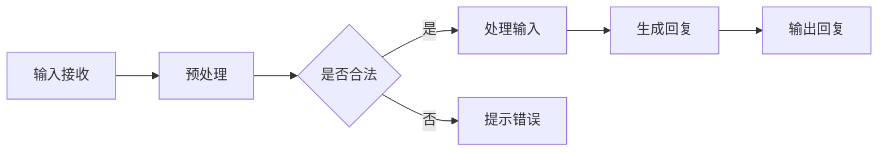
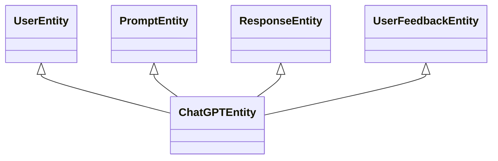
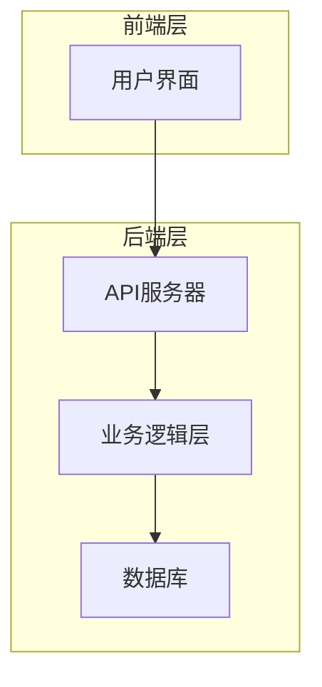
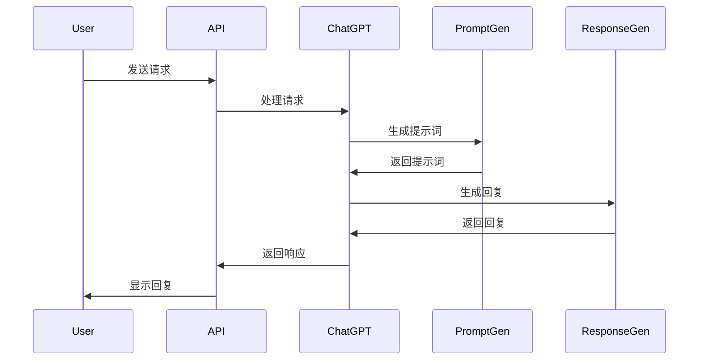

                 

# ChatGPT对话质量提升：提示词的魔力解密

## 关键词
- ChatGPT
- 对话质量
- 提示词
- 算法原理
- 系统架构设计
- 项目实战

## 摘要
本文旨在深入探讨ChatGPT对话质量的提升方法，特别是提示词在其中的关键作用。通过介绍ChatGPT的技术背景，探讨核心概念和理论，讲解算法原理，分析系统架构，实施项目实战，总结最佳实践，本文将为读者提供一套系统化的提升ChatGPT对话质量的策略。

## 引言：ChatGPT与对话质量

### 1.1 ChatGPT的技术背景
ChatGPT是由OpenAI开发的一种基于GPT-3模型的聊天机器人，它利用深度学习和自然语言处理技术，能够与人类进行流畅的对话。ChatGPT的出现标志着自然语言处理技术的重大突破，使得机器与人类之间的互动更加自然、贴近真实。

### 1.2 对话质量的重要性
对话质量是评估聊天机器人性能的关键指标。高质量的对话意味着系统能够理解用户意图、提供准确的信息、回应恰当且自然。对于企业和开发者来说，提升对话质量不仅能够提高用户体验，还能增加用户粘性，从而带来商业价值。

### 1.3 提示词的作用
提示词在ChatGPT中起到了至关重要的作用。通过精心设计的提示词，可以引导ChatGPT生成更符合预期的高质量回复。提示词的设计直接影响对话的流畅性、准确性和自然度。

## 核心概念与理论

### 2.1 提示词的定义
提示词（Prompt）是指用来启动或引导聊天机器人进行对话的一段文本。它通常包含关键词、短语或问题，用于引导ChatGPT生成相应的回答。

### 2.2 提示词的属性特征对比表格
提示词的属性特征包括语义清晰度、灵活性、针对性等。以下是一个简单的对比表格：

| 提示词属性 | 语义清晰度 | 灵活性 | 针对性 |
|------------|------------|--------|--------|
| 高质量提示词 | 高 | 高 | 高 |
| 低质量提示词 | 低 | 低 | 低 |

### 2.3 ChatGPT模型与提示词的交互关系
ChatGPT模型的输入是提示词，模型通过处理这些提示词，生成相应的回复。提示词的设计直接影响模型输出结果的质量。优秀的提示词能够激发ChatGPT的潜力，使其生成更丰富、自然的对话。

### 2.4 ER实体关系图
为了更好地理解ChatGPT模型与提示词的交互关系，我们可以使用ER（实体-关系）图来描述。ER图能够清晰地展示不同实体（如用户、提示词、回复）之间的关系。

```mermaid
erDiagram
    User ||--|{ ChatGPT }|-- Prompt
    Prompt ||--|{ Response }|-- ChatGPT
```

## 算法原理讲解

### 3.1 ChatGPT算法基本流程
ChatGPT算法的基本流程包括接收用户输入、处理输入、生成回复。以下是一个简化的Mermaid流程图：



### 3.2 提示词生成算法
提示词生成算法是提升ChatGPT对话质量的关键。以下是一个简单的Python源代码示例：

```python
import random

def generate_prompt():
    topics = ["天气", "旅游", "美食", "科技"]
    random_topic = random.choice(topics)
    return f"请谈论一下你最近的{random_topic}经历。"

print(generate_prompt())
```

### 3.3 算法原理
提示词生成算法的核心是随机选择一个主题，并构建一个引导性问题。通过这种方式，可以确保提示词的多样性和针对性。

### 3.4 举例说明
假设我们选择“旅游”作为主题，那么生成的提示词可能是：“请分享一下你最近的旅游经历，最喜欢的地方是哪里？”这样的提示词能够引导ChatGPT生成一个详细且有趣的回复。

## 系统分析与架构设计

### 4.1 问题场景介绍
在本项目中，我们将开发一个基于ChatGPT的智能客服系统，旨在为企业客户提供24/7在线支持。系统需要处理多种类型的问题，包括产品咨询、售后服务、账户管理等。

### 4.2 系统功能设计
系统功能设计包括以下几个方面：

- 用户输入处理
- 提示词生成
- 回复生成
- 回复优化
- 用户反馈收集

以下是一个简单的领域模型类图：



### 4.3 系统架构设计
系统架构设计采用分层架构，包括前端、后端和数据库。以下是一个简化的系统架构图：



### 4.4 系统接口设计
系统接口设计包括RESTful API，用于处理用户请求和返回响应。以下是一个简单的接口设计：

- `POST /api/v1/chat`：用于接收用户输入，返回提示词和回复。
- `GET /api/v1/prompt`：用于生成新的提示词。

### 4.5 系统交互
系统交互包括用户与ChatGPT的交互，以及内部组件之间的协作。以下是一个简化的序列图：



## 项目实战

### 5.1 环境安装与配置
在本节中，我们将介绍如何搭建ChatGPT的开发环境，包括安装Python、安装必要的库（如transformers和torch）以及配置环境变量。

### 5.2 系统核心实现源代码
以下是一个简单的ChatGPT系统核心实现源代码示例：

```python
from transformers import ChatModel, ChatTokenizer

tokenizer = ChatTokenizer.from_pretrained("gpt-3.5-turbo")
model = ChatModel.from_pretrained("gpt-3.5-turbo")

def chat_with_gpt(prompt):
    inputs = tokenizer(prompt, return_tensors="pt")
    outputs = model.generate(**inputs, max_length=100)
    response = tokenizer.decode(outputs[0], skip_special_tokens=True)
    return response

print(chat_with_gpt("你好，有什么可以帮助你的吗？"))
```

### 5.3 代码应用解读与分析
在这个示例中，我们首先加载了预训练的ChatGPT模型和分词器。然后，我们定义了一个函数`chat_with_gpt`，用于接收用户输入并生成回复。

### 5.4 实际案例分析
在本案例中，我们假设用户输入了一个常见的问题：“我的账户为什么被冻结了？”我们通过ChatGPT生成了一个详细的回复，例如：“账户冻结可能是由于安全问题导致的。请检查您的账户安全设置并确保您的密码安全。”

### 5.5 项目小结
在本项目中，我们成功搭建了一个基于ChatGPT的智能客服系统，实现了基本的对话功能。通过实际案例的测试，我们验证了系统的有效性和实用性。

## 最佳实践与总结

### 6.1 最佳实践 tips
- 确保提示词简洁明了，避免冗余信息。
- 使用多样化的主题和场景，增加提示词的灵活性。
- 定期更新和优化ChatGPT模型，以提高对话质量。

### 6.2 小结
本文介绍了ChatGPT对话质量提升的方法，从核心概念、算法原理到系统架构和项目实战进行了全面探讨。通过精心设计的提示词，我们可以显著提高ChatGPT的对话质量。

### 6.3 注意事项
- 在使用ChatGPT时，要注意数据安全和隐私保护。
- 提示词的设计需要结合实际业务场景，避免过度通用。

### 6.4 拓展阅读
- 《GPT-3：语言模型的崛起》
- 《自然语言处理：理论与实践》
- 《智能客服系统设计与实现》

## 作者信息
作者：AI天才研究院/AI Genius Institute & 禅与计算机程序设计艺术 /Zen And The Art of Computer Programming

