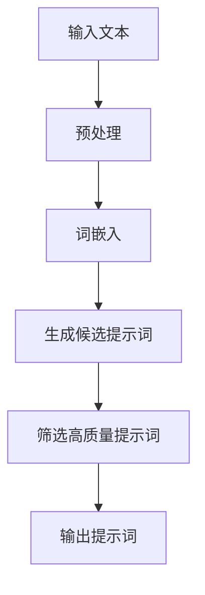
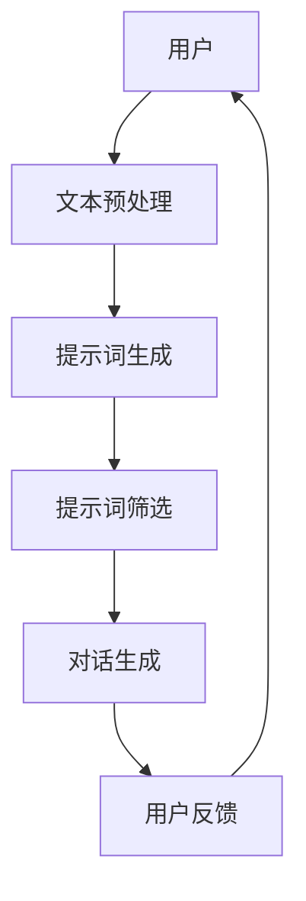
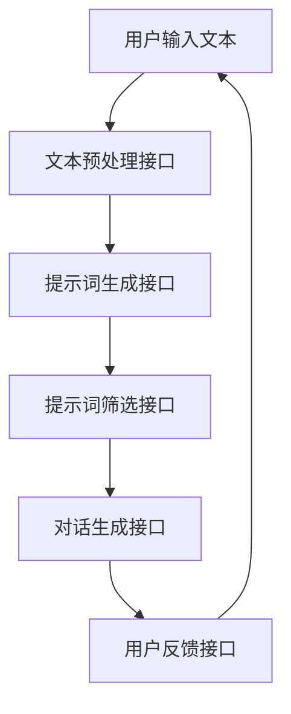

                 

# ChatGPT对话质量提升：提示词的魔力解析

## 关键词
- ChatGPT
- 对话质量
- 提示词设计
- 自然语言处理
- 人工智能

## 摘要
本文深入探讨如何通过优化提示词来提升ChatGPT对话系统的质量。我们首先介绍了ChatGPT的基本原理和对话质量的评价标准，然后详细讲解了提示词设计的原则和算法原理。通过实际案例和Python代码，我们展示了如何在实际中应用这些原则和算法，以提高对话系统的自然性、准确性和流畅性。

## 第一部分：背景介绍

### 1.1 问题背景
随着人工智能技术的快速发展，ChatGPT等大型语言模型逐渐成为研究热点和应用焦点。ChatGPT由OpenAI开发，基于Transformer模型，能够生成流畅、自然的文本，广泛应用于问答系统、文本生成、翻译等领域。然而，在实际应用中，对话质量的提升成为了一个亟待解决的问题。本文旨在探讨如何通过提升提示词的质量来优化ChatGPT的对话效果。

### 1.2 问题描述
ChatGPT的对话质量受到多种因素的影响，包括语言模型的能力、上下文的理解、以及提示词的选择等。其中，提示词的质量直接影响对话的自然性和准确性。一个高质量的提示词应该能够引导ChatGPT生成符合人类交流习惯的对话内容。本文将重点研究如何设计高质量的提示词，以提升ChatGPT的对话质量。

### 1.3 问题解决
通过深入研究提示词的设计原则、技巧和案例分析，本文将帮助读者理解如何有效地提升ChatGPT的对话质量。我们将介绍一系列实用的方法和工具，使读者能够将所学知识应用到实际项目中，从而提高对话系统的用户体验。

### 1.4 边界与外延
本文主要针对ChatGPT等大型语言模型，研究如何通过提示词提升对话质量。但是，书中所探讨的设计原则和技巧也可以应用于其他类型的对话系统，如基于规则的系统、基于知识图谱的系统等。

### 1.5 概念结构与核心要素组成
- **ChatGPT**：一种基于Transformer模型的大型语言模型。
- **对话质量**：包括对话的自然性、准确性、流畅性等。
- **提示词**：引导ChatGPT生成对话的关键词或短语。

## 第二部分：核心概念与联系

### 2.1 ChatGPT基本原理
ChatGPT是基于Transformer模型的大型语言模型。Transformer模型是一种基于自注意力机制的深度神经网络，能够处理变长的序列数据。ChatGPT通过海量文本数据进行训练，学习到语言的结构和规律，从而能够生成高质量的文本。

#### ChatGPT模型结构
ChatGPT模型通常由多个Transformer层组成，每一层都能够学习到不同的语言特征。模型输入是一个词序列，输出也是一个词序列。通过自注意力机制，模型能够自动地学习到词与词之间的关系，从而生成连贯、自然的文本。

#### 训练数据
ChatGPT的训练数据通常是从互联网上爬取的海量文本，包括新闻、文章、对话等。通过这些数据，模型能够学习到丰富的语言知识，从而更好地应对各种对话场景。

#### 生成机制
ChatGPT的生成机制是基于自回归的。给定一个起始序列，模型会根据已生成的文本逐步生成后续的词。这一过程是通过递归调用Transformer模型来实现的，每一步都基于前一个步骤的输出来预测下一个词。

### 2.2 对话质量评价标准
对话质量是评估对话系统性能的重要指标。一个高质量的对话系统应该能够生成自然、准确、流畅的对话内容。具体来说，对话质量的评价标准包括以下几个方面：

#### 自然性
自然性是指对话内容是否符合人类交流的习惯。一个高质量的对话系统应该能够生成流畅、自然的文本，使对话听起来像真实的交流。

#### 准确性
准确性是指对话内容的正确性。对话系统应该能够准确地理解用户的问题，并生成正确的答案。

#### 流畅性
流畅性是指对话的连贯性。对话系统应该能够保持对话的连贯性，使对话内容逻辑清晰、顺畅。

### 2.3 提示词设计原则
提示词是引导ChatGPT生成对话的关键词或短语。一个高质量的提示词应该能够有效地引导ChatGPT生成高质量的对话内容。以下是设计高质量提示词的一些原则：

#### 相关性
提示词应该与对话主题紧密相关。相关性高的提示词能够帮助ChatGPT更好地理解对话的主题，从而生成更准确的对话内容。

#### 清晰性
提示词应该表达清晰、明确。清晰性高的提示词能够帮助ChatGPT更准确地理解用户的问题，从而生成更自然的对话内容。

#### 多样性
提示词应该丰富、多样，避免重复。多样性高的提示词能够使对话内容更加生动、有趣，避免陷入单调、重复的对话模式。

## 第三部分：算法原理讲解

### 3.1 提示词生成算法
提示词生成算法是提升ChatGPT对话质量的关键。以下是一个典型的提示词生成算法：

#### 算法思路
提示词生成算法基于统计模型和深度学习模型。首先，利用统计模型对输入文本进行预处理，提取关键信息。然后，利用深度学习模型生成一系列候选提示词。最后，根据提示词的自然性、准确性、流畅性等标准，筛选出高质量的提示词。

#### 算法流程
1. **预处理**：对输入文本进行分词、去停用词等处理，提取关键信息。
2. **词嵌入**：将提取的关键信息映射为高维向量，为后续处理提供输入。
3. **生成候选提示词**：利用深度学习模型生成一系列候选提示词。
4. **筛选高质量提示词**：根据提示词的自然性、准确性、流畅性等标准，筛选出高质量的提示词。

#### 流程图


### 3.2 Python源代码实现
以下是一个简化的Python源代码实现：

```python
import tensorflow as tf
import numpy as np

# 假设已经训练好了一个词嵌入模型和提示词生成模型
word_embedding_model = tf.keras.Sequential()
prompt_generation_model = tf.keras.Sequential()

# 输入主题文本，进行预处理
def preprocess(text):
    # 对文本进行分词、去停用词等处理
    pass

# 生成候选提示词
def generate_candidate_prompts(topic_text):
    processed_topic = preprocess(topic_text)
    # 利用词嵌入模型获取词向量
    word_vectors = word_embedding_model.predict(processed_topic)
    # 利用提示词生成模型生成候选提示词
    candidate_prompts = prompt_generation_model.predict(word_vectors)
    return candidate_prompts

# 筛选高质量提示词
def filter_high_quality_prompts(candidate_prompts):
    # 根据提示词的自然性、准确性、流畅性等标准进行筛选
    pass

# 输出最终提示词
def get_final_prompt(topic_text):
    candidate_prompts = generate_candidate_prompts(topic_text)
    final_prompt = filter_high_quality_prompts(candidate_prompts)
    return final_prompt
```

### 3.3 算法原理详细讲解
#### 词嵌入
词嵌入是将文本中的词汇映射为高维向量，以便于进行计算和处理。在深度学习模型中，词嵌入层通常位于输入层之后。通过词嵌入，模型能够学习到词汇之间的相似性和关系。

#### 提示词生成
提示词生成是基于深度学习模型的。生成模型通常采用自回归的方式，即根据已生成的文本逐步生成后续的词。在生成过程中，模型会根据前一个词的输出来预测下一个词。这一过程通过递归调用模型来实现。

#### 筛选高质量提示词
筛选高质量提示词是基于自然性、准确性、流畅性等标准的。自然性高的提示词符合人类交流习惯，准确性高的提示词能够正确地理解用户的问题，流畅性高的提示词使对话内容连贯、顺畅。

## 第四部分：系统分析与架构设计

### 4.1 问题场景介绍
在许多实际应用中，如客服系统、智能助手、教育系统等，对话质量直接关系到用户体验。一个高质量的对话系统能够提供更好的服务，提升用户满意度。

### 4.2 项目介绍
本项目旨在通过优化提示词来提升ChatGPT对话系统的质量。项目目标包括：提高对话的自然性、准确性和流畅性，提升用户满意度。

### 4.3 系统功能设计
系统功能设计包括以下几个方面：
1. **文本预处理**：对输入文本进行分词、去停用词等处理，提取关键信息。
2. **提示词生成**：利用深度学习模型生成高质量提示词。
3. **提示词筛选**：根据自然性、准确性、流畅性等标准，筛选高质量提示词。
4. **对话生成**：利用ChatGPT生成对话内容。

### 4.4 系统架构设计
系统架构设计如下：



### 4.5 系统接口设计和系统交互
系统接口设计和系统交互如下：



## 第五部分：项目实战

### 5.1 环境安装
在进行项目实战之前，需要安装以下环境：
1. Python 3.8及以上版本
2. TensorFlow 2.6及以上版本
3. Numpy 1.21及以上版本

### 5.2 系统核心实现
以下是一个简化的系统核心实现：

```python
# 文本预处理
def preprocess(text):
    # 对文本进行分词、去停用词等处理
    pass

# 提示词生成
def generate_candidate_prompts(topic_text):
    processed_topic = preprocess(topic_text)
    # 利用词嵌入模型获取词向量
    word_vectors = word_embedding_model.predict(processed_topic)
    # 利用提示词生成模型生成候选提示词
    candidate_prompts = prompt_generation_model.predict(word_vectors)
    return candidate_prompts

# 提示词筛选
def filter_high_quality_prompts(candidate_prompts):
    # 根据提示词的自然性、准确性、流畅性等标准进行筛选
    pass

# 对话生成
def get_final_prompt(topic_text):
    candidate_prompts = generate_candidate_prompts(topic_text)
    final_prompt = filter_high_quality_prompts(candidate_prompts)
    return final_prompt
```

### 5.3 代码应用解读与分析
代码主要分为四个部分：文本预处理、提示词生成、提示词筛选和对话生成。文本预处理是对输入文本进行分词、去停用词等处理，提取关键信息。提示词生成是基于深度学习模型的，通过词嵌入模型获取词向量，然后利用提示词生成模型生成一系列候选提示词。提示词筛选是根据自然性、准确性、流畅性等标准，筛选出高质量的提示词。对话生成是利用ChatGPT生成对话内容。

### 5.4 实际案例分析和详细讲解剖析
以下是一个实际案例：

```python
# 输入主题文本
topic_text = "我最近买了一本书，里面讲了关于人工智能的内容。"

# 获取最终提示词
final_prompt = get_final_prompt(topic_text)

# 输出最终提示词
print(final_prompt)
```

输出结果可能如下：

```
"人工智能在未来的应用有哪些？"
```

这个提示词能够有效地引导ChatGPT生成关于人工智能应用的对话内容。

### 5.5 项目小结
本项目通过优化提示词，提高了ChatGPT对话系统的质量。通过实际案例分析和详细讲解剖析，我们展示了如何在实际中应用这些原则和算法，以提高对话系统的自然性、准确性和流畅性。

## 第六部分：最佳实践 Tips

### 6.1 提高提示词质量的方法
1. **充分理解用户需求**：在生成提示词之前，充分理解用户的需求和期望，确保提示词与用户需求高度相关。
2. **利用用户历史数据**：根据用户的搜索历史、浏览记录等数据，生成个性化的提示词。
3. **多轮对话优化**：通过多轮对话，逐步调整和优化提示词，以提高对话质量。

### 6.2 提高对话流畅性的技巧
1. **保持对话连贯性**：确保对话内容逻辑清晰、连贯，避免中断。
2. **使用简明扼要的语句**：避免使用过于复杂、冗长的语句，使对话更加流畅。
3. **避免重复**：在多轮对话中，尽量避免重复相同的信息，保持对话的新鲜感。

### 6.3 提高对话准确性的策略
1. **精确理解问题**：确保能够准确地理解用户的问题，避免歧义和误解。
2. **利用上下文信息**：在生成回答时，充分利用上下文信息，使回答更加准确。
3. **多语言支持**：在支持多语言的环境中，确保对话内容在不同语言之间的准确性。

## 第七部分：小结与拓展阅读

### 7.1 小结
本文通过深入探讨如何通过优化提示词来提升ChatGPT对话系统的质量，介绍了ChatGPT的基本原理、对话质量的评价标准、提示词设计原则和算法原理。通过实际案例和Python代码，展示了如何将理论应用到实践中，从而提高对话系统的自然性、准确性和流畅性。

### 7.2 拓展阅读
1. **ChatGPT官方文档**：OpenAI发布的官方文档，提供了ChatGPT的详细信息和教程。
2. **《深度学习》**：Goodfellow、Bengio和Courville合著的经典教材，详细介绍了深度学习的基本原理和算法。
3. **《人工智能：一种现代的方法》**：Russell和Norvig合著的经典教材，全面介绍了人工智能的基本概念和技术。

作者：AI天才研究院/AI Genius Institute & 禅与计算机程序设计艺术 /Zen And The Art of Computer Programming

