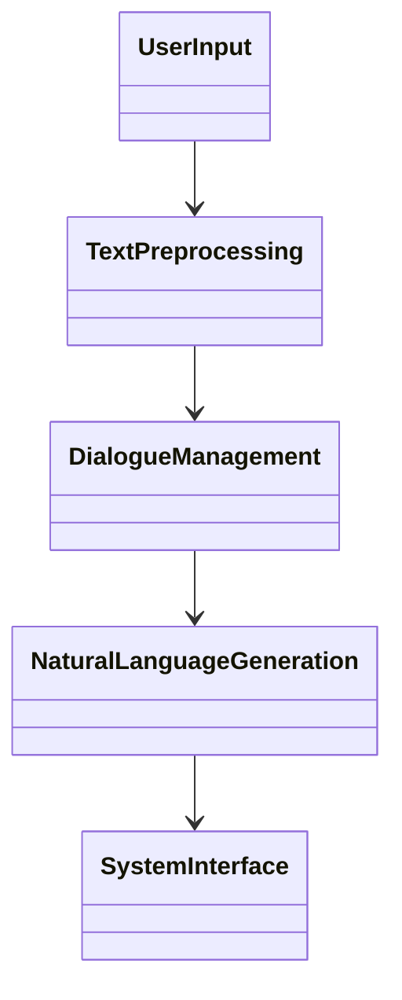
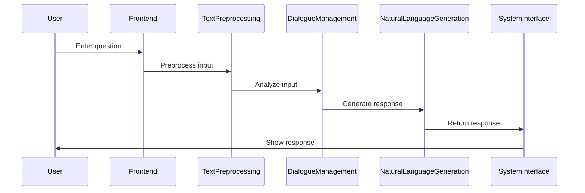
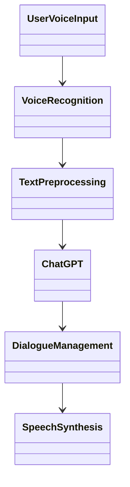
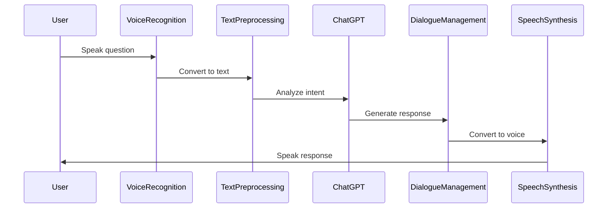
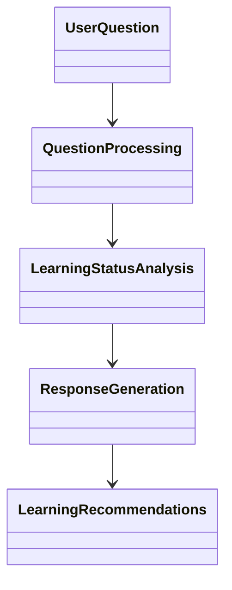
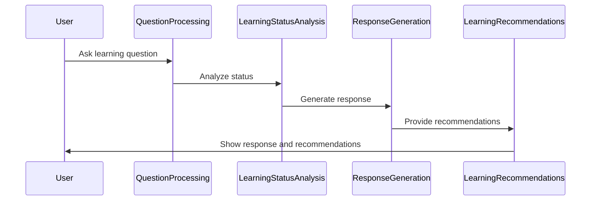
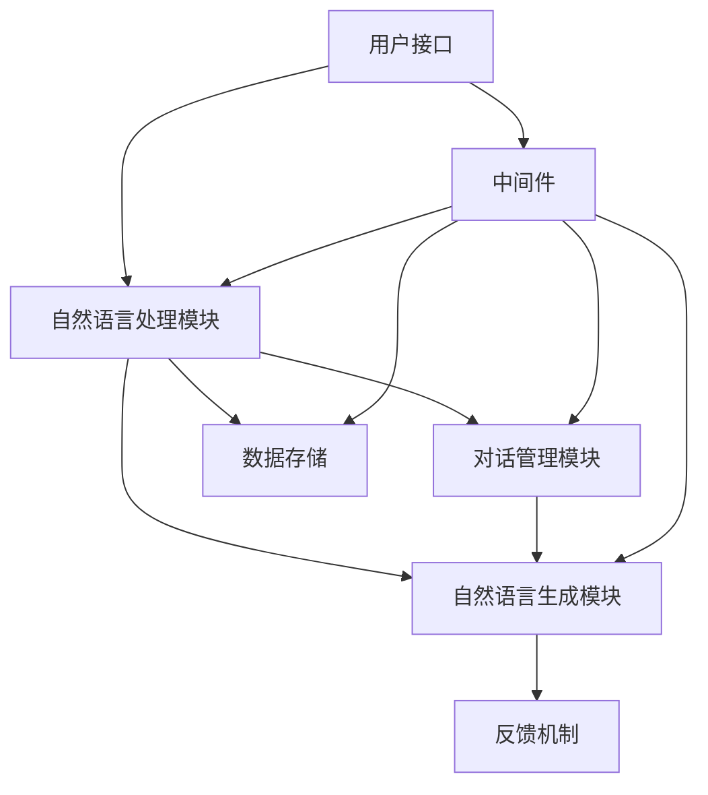

                 

### 文章标题

《ChatGPT提示词优化：AI对话系统的性能突破》

### 文章关键词

- ChatGPT
- 提示词优化
- AI对话系统
- 性能突破
- 人工智能应用

### 摘要

随着人工智能技术的不断发展和普及，AI对话系统已经成为众多领域的重要组成部分。本文将探讨ChatGPT提示词优化对AI对话系统性能的影响。首先，我们将介绍ChatGPT的基础概念和原理，以及AI对话系统的基本架构和功能。接着，我们会详细分析提示词优化的重要性，探讨各种优化技术与方法。在此基础上，我们将通过实际案例来展示如何通过优化提示词来提升对话系统的性能。最后，我们将总结最佳实践，并探讨未来的研究方向，为读者提供有价值的参考和指导。

## 引言与背景

### AI对话系统的定义与现状

人工智能（AI）作为计算机科学的重要分支，已经在众多领域取得了显著的成果。其中，AI对话系统作为一种新兴的技术应用，正日益受到广泛关注。AI对话系统是指通过自然语言处理（NLP）、机器学习（ML）和深度学习（DL）等技术，实现人与计算机之间的自然语言交互。这种交互可以是实时的，也可以是异步的，目的是为了提供便捷、高效、个性化的服务。

当前，AI对话系统已经在多个领域得到了广泛应用。例如，在客服领域，AI对话系统能够处理大量的客户咨询，减轻人工客服的工作压力；在金融领域，AI对话系统能够提供个性化的投资建议，提高金融服务效率；在教育领域，AI对话系统能够为学生提供智能辅导，提升学习效果。此外，在智能家居、医疗健康、交通管理等众多领域，AI对话系统也展现出广阔的应用前景。

### ChatGPT的基本概念与原理

ChatGPT是由OpenAI开发的一种基于Transformer架构的预训练语言模型。它通过大量的文本数据进行训练，能够生成连贯、有逻辑的自然语言文本。ChatGPT的核心原理是利用深度学习技术，对输入的文本序列进行建模，然后通过模型生成的输出序列来回答问题或生成对话。

ChatGPT的训练过程主要包括两个阶段：预训练和微调。在预训练阶段，ChatGPT通过无监督学习从大量的文本数据中学习语言结构和知识。这种预训练使得ChatGPT具备了强大的语言理解能力和生成能力。在微调阶段，ChatGPT根据特定任务的需求进行有监督的微调，以适应特定场景的应用。

### AI对话系统的基本架构与功能

AI对话系统的基本架构包括三个主要模块：文本预处理、对话管理和自然语言生成。文本预处理模块负责对用户输入的文本进行清洗、分词、词性标注等操作，以便后续处理。对话管理模块负责维护对话的状态，根据用户输入和系统生成的文本来决定对话的走向。自然语言生成模块负责根据对话管理模块的决策生成响应文本，实现与用户的交互。

具体来说，AI对话系统的功能包括：理解用户意图、生成回答文本、处理上下文信息、维护对话状态、提供个性化服务、处理多轮对话等。这些功能共同协作，使得AI对话系统能够与用户进行自然、流畅的交互，提供高效、便捷的服务。

### 提示词优化的概念与重要性

提示词优化是指通过对ChatGPT的输入提示进行改进，以提高其生成文本的质量和准确性。在AI对话系统中，提示词是用户输入和系统输出之间的桥梁，直接影响到对话的质量和用户的满意度。因此，提示词优化在AI对话系统的性能提升中扮演着至关重要的角色。

首先，有效的提示词能够帮助ChatGPT更好地理解用户的意图，从而生成更准确、更具针对性的回答。例如，在客服场景中，一个恰当的提示词可以让ChatGPT更准确地识别用户的咨询内容，提供更专业的解答。其次，优化的提示词可以提高ChatGPT的生成效率，减少不必要的计算和资源消耗，从而提升系统的响应速度和用户体验。

此外，提示词优化还能够增强AI对话系统的可解释性。通过分析提示词的优化过程，我们可以更好地理解ChatGPT的决策逻辑和生成机制，从而提高系统的透明度和可信度。这对于解决复杂问题和提升用户信任具有重要意义。

总之，提示词优化是提升AI对话系统性能的关键环节，它不仅影响着系统的交互质量，还关系到用户体验和系统的可解释性。在接下来的章节中，我们将深入探讨提示词优化的技术与方法，以及如何在实践中应用这些技术，以实现AI对话系统的性能突破。

### 核心概念与原理

#### ChatGPT的工作原理

ChatGPT的核心原理基于Transformer架构，这是一种在自然语言处理（NLP）领域广泛应用的深度学习模型。Transformer模型最初由Vaswani等人于2017年提出，旨在解决传统的循环神经网络（RNN）在处理长序列数据时效率低下的问题。Transformer模型通过自注意力机制（self-attention）实现了对输入文本序列的全局关注，从而在捕捉长距离依赖关系方面表现出色。

ChatGPT的训练过程主要分为预训练和微调两个阶段：

1. **预训练**：
   在预训练阶段，ChatGPT从大量的文本数据中学习语言结构和知识。这一过程主要包括两个子任务：语言建模（language modeling）和掩码语言建模（masked language modeling）。语言建模任务是预测下一个词的概率，而掩码语言建模任务是在文本中随机掩码部分词，然后让模型尝试恢复这些词。

2. **微调**：
   在预训练完成后，ChatGPT根据特定任务的需求进行微调。微调过程通常使用带有标签的数据集，通过有监督学习来调整模型参数，使其适应特定应用场景。例如，在客服场景中，可以提供客户咨询和客服回复的数据集，让模型学习如何生成高质量的客服回复。

Transformer模型的内部结构包括多个自注意力层（self-attention layers）和前馈神经网络（feedforward networks）。自注意力层通过计算每个词与其他词之间的关联性来生成新的表示，而前馈神经网络则对自注意力层的输出进行进一步的加工。这种结构使得模型能够捕捉到文本中的长距离依赖关系，从而生成连贯、有逻辑的自然语言文本。

#### 自然语言生成（NLG）的基础

自然语言生成（Natural Language Generation, NLG）是指利用计算机技术自动生成自然语言文本。NLG是人工智能领域的一个重要分支，其目的是实现人与计算机之间的自然语言交互。

NLG的基础包括以下几个方面：

1. **语法分析**：
   语法分析是指对自然语言文本进行结构化解析，识别出句子中的词法单位和语法关系。常见的语法分析方法包括词法分析、句法分析和语义分析。词法分析主要负责识别单词和符号，句法分析则关注句子结构，而语义分析则探讨句子所表达的意义。

2. **语义理解**：
   语义理解是指理解文本中词汇的含义及其相互关系。语义理解是NLG的关键，它涉及到词义消歧、实体识别、关系抽取等任务。通过语义理解，模型能够更好地理解用户输入，生成更加准确和自然的回答。

3. **模板匹配**：
   模板匹配是一种简单的NLG方法，通过预定义的模板来生成文本。模板通常包含变量，这些变量由模型从用户输入中抽取的信息所填充。这种方法在生成结构化、固定格式的文本（如天气预报、新闻摘要）中效果较好。

4. **序列到序列学习**：
   序列到序列（Sequence-to-Sequence, seq2seq）学习是一种常用的NLG方法，它通过编码器（encoder）和解码器（decoder）两个神经网络模型实现文本的生成。编码器将输入序列编码成一个固定长度的向量，解码器则利用这个向量生成输出序列。ChatGPT就是基于seq2seq学习实现的，它通过预训练和微调，能够生成高质量的自然语言文本。

#### 提示词优化的基础

提示词优化是指通过对ChatGPT的输入提示进行改进，以提高其生成文本的质量和准确性。提示词优化的基础包括以下几个方面：

1. **语义清晰性**：
   有效的提示词应该具有清晰的语义，能够明确传达用户的意图。这有助于ChatGPT更好地理解用户输入，从而生成更准确、更具针对性的回答。

2. **上下文相关性**：
   提示词应该与对话的上下文保持一致，以便ChatGPT能够维护对话的连贯性和流畅性。上下文相关性可以通过增加背景信息、维护对话状态等手段来实现。

3. **格式规范性**：
   提示词的格式应该规范，避免出现歧义和误解。例如，使用清晰、简洁的语言，避免使用缩写、专业术语等，除非确保用户能够理解。

4. **多样性**：
   提示词的多样性有助于ChatGPT生成更加丰富和多样化的回答。通过提供不同的提示词，可以激发ChatGPT的创造力，生成更加有趣和有价值的对话内容。

为了更好地理解这些概念，我们通过一个具体的例子来展示ChatGPT的工作原理。假设我们有一个关于旅游咨询的对话场景：

用户：我想去巴黎旅游，有哪些推荐的景点？

ChatGPT的生成文本：巴黎是一个美丽的城市，有很多值得游览的景点。例如，埃菲尔铁塔、卢浮宫、巴黎圣母院等。你打算在什么季节去呢？

在这个例子中，用户输入的是一个关于旅游咨询的问题。ChatGPT通过其预训练的语言模型和自注意力机制，理解了用户的意图，并生成了相关的回答。这个过程中，提示词的优化起到了关键作用，使得ChatGPT能够准确捕捉用户的意图，并提供有价值的信息。

通过以上对ChatGPT工作原理、自然语言生成基础以及提示词优化基础的分析，我们可以看到，提示词优化在提升AI对话系统性能方面具有重要的作用。在接下来的章节中，我们将进一步探讨各种提示词优化技术和方法，以及如何在实践中应用这些技术。

### 提示词优化的技术与方法

优化ChatGPT的提示词是提升AI对话系统性能的关键步骤。以下将介绍几种常见的优化技术与方法，包括参数调优、数据增强、模型融合和预训练方法等。

#### 参数调优

参数调优是优化ChatGPT提示词的一种基本方法。通过调整模型中的超参数，可以显著影响生成文本的质量和性能。以下是一些关键的参数调优策略：

1. **学习率**：
   学习率是模型训练过程中一个重要的超参数，它决定了模型在更新参数时的步长。适当调整学习率可以加快收敛速度，但过大会导致模型在训练过程中振荡，无法收敛；而过小则会导致训练过程过慢。因此，选择合适的学习率对于提示词优化至关重要。

2. **批量大小**：
   批量大小是指每次模型训练所使用的样本数量。较大的批量大小可以提高模型的稳定性和准确性，但会占用更多的计算资源。相对较小的批量大小则可以在计算资源有限的情况下保持较好的性能，但可能会导致模型收敛速度较慢。

3. **温度参数**：
   温度参数（temperature）是影响生成文本多样性的一个关键参数。温度参数越小，生成的文本越保守，接近于最可能的输出；温度参数越大，生成的文本越多样化，但可能会出现不连贯或不相关的内容。通过调整温度参数，可以在保持文本质量的同时增加多样性。

#### 数据增强

数据增强是通过扩展原始训练数据来提高模型性能的一种技术。以下是一些常见的数据增强方法：

1. **数据清洗**：
   数据清洗是指对原始数据进行预处理，去除噪声和不相关的内容。例如，去除重复文本、修复格式错误、删除无关信息等。数据清洗可以提高数据质量，从而提升模型性能。

2. **数据扩展**：
   数据扩展是指通过变换或生成新的数据样本来扩充训练数据集。常见的数据扩展方法包括：同义词替换、词性转换、文本摘要、段落拼接等。这些方法可以丰富训练数据，增加模型的泛化能力。

3. **文本生成**：
   文本生成是指利用现有的模型和算法生成新的文本数据。例如，利用GPT模型生成新的对话文本、新闻文章等。这些生成的文本可以作为额外的训练数据，有助于提升模型的性能。

#### 模型融合

模型融合（Model Fusion）是一种将多个模型或模型组件结合起来的技术，以实现更好的性能。以下是一些常见的模型融合方法：

1. **堆叠模型**：
   堆叠模型是指将多个模型串联起来，前一个模型的输出作为后一个模型的输入。例如，可以将一个生成模型（如GPT）与一个分类模型（如BERT）堆叠，先使用生成模型生成文本，然后使用分类模型对文本进行分类。

2. **注意力机制融合**：
   注意力机制融合是指将多个注意力机制整合到一个模型中，以提高模型的捕捉长距离依赖的能力。例如，可以将自注意力（self-attention）和交互注意力（interacting attention）结合，提升模型对输入文本的理解能力。

3. **对抗训练**：
   对抗训练是一种通过对抗性样本来提升模型鲁棒性的方法。在提示词优化中，可以使用对抗训练来增强模型对噪声和异常数据的处理能力，从而提高模型的泛化性能。

#### 预训练方法

预训练方法是指在模型训练前，使用大量的无监督数据对模型进行预训练，然后在有监督数据上进行微调。以下是一些常用的预训练方法：

1. **双向编码器预训练（BERT）**：
   BERT（Bidirectional Encoder Representations from Transformers）是一种基于Transformer的双向编码器预训练方法。BERT通过在两个方向上对文本进行编码，捕捉到文本中的长距离依赖关系，从而显著提升了自然语言处理任务的性能。

2. **自适应学习率预训练（ALBERT）**：
   ALBERT是Google提出的一种自适应学习率预训练方法，通过改进Transformer模型的结构和训练策略，提高了模型的训练效率和性能。

3. **自监督预训练（GPT-3）**：
   GPT-3（Generative Pre-trained Transformer 3）是OpenAI开发的一种大规模自监督预训练模型。GPT-3通过在大量文本数据上进行预训练，生成了高质量的文本生成模型，展示了强大的文本理解和生成能力。

#### 实践案例

为了更好地理解上述技术与方法的应用，以下是一个具体的案例：

假设我们需要优化一个基于ChatGPT的客服对话系统。该系统需要在用户提出问题时生成准确的回答。以下是如何使用上述技术进行优化的步骤：

1. **参数调优**：
   - 调整学习率至0.0001，以平衡训练速度和收敛效果。
   - 设置批量大小为64，以保持较好的训练效率。
   - 使用温度参数0.9，以生成较为保守的文本。

2. **数据增强**：
   - 进行数据清洗，去除噪声和错误信息。
   - 利用同义词替换和数据扩展方法，生成新的训练数据。

3. **模型融合**：
   - 将ChatGPT与BERT结合，利用BERT的分类能力对生成文本进行辅助判断。
   - 引入交互注意力机制，增强模型对输入文本的理解能力。

4. **预训练方法**：
   - 使用GPT-3进行大规模预训练，以提升模型的生成能力。
   - 在预训练的基础上，使用有监督数据进行微调，以适应特定任务。

通过上述步骤，我们可以显著提升客服对话系统的性能，生成更准确、更有价值的回答，提高用户体验。

综上所述，优化ChatGPT的提示词是一项复杂且重要的任务，涉及到参数调优、数据增强、模型融合和预训练等多个方面。通过合理应用这些技术，我们可以实现AI对话系统的性能突破，提供更高效、更智能的服务。

### 案例研究：优化提示词以提升对话系统性能

为了更好地展示提示词优化在提升AI对话系统性能方面的实际效果，我们来看几个具体的案例研究。这些案例涵盖了不同的应用场景，从客服系统到智能助手，展示了如何通过优化提示词来提高系统的性能和用户体验。

#### 案例一：智能客服系统

背景介绍：
某大型电商平台部署了一套智能客服系统，旨在为用户提供24/7的在线客服服务。然而，用户反馈系统生成的回答有时不够准确和自然，导致用户满意度不高。为了改善这一状况，平台决定对客服系统的提示词进行优化。

项目介绍：
项目的主要目标是提升智能客服系统生成回答的准确性和自然度，从而提高用户满意度。项目涉及的技术包括ChatGPT、自然语言处理和机器学习。

系统功能设计：
智能客服系统的核心功能包括接收用户输入、理解用户意图、生成回答文本和提供多轮对话支持。为了实现这些功能，系统采用了以下设计：

1. **文本预处理**：
   - 清洗用户输入，去除噪声和格式错误。
   - 进行分词和词性标注，以便更好地理解用户输入。

2. **对话管理**：
   - 维护对话状态，记录用户的历史输入和系统生成的回答。
   - 根据用户输入和对话状态生成后续的回答。

3. **自然语言生成**：
   - 使用ChatGPT生成回答文本。
   - 对生成文本进行后处理，确保其语法正确和自然。

系统架构设计：
智能客服系统的架构包括前端界面、后端服务、自然语言处理引擎和数据存储。后端服务包括文本预处理模块、对话管理模块和自然语言生成模块。

接口设计与系统交互：
前端界面负责接收用户输入，并将输入传递给后端服务。后端服务处理用户输入，生成回答文本，并返回给前端界面展示。系统交互通过API接口实现。

**Mermaid类图**：

**Mermaid序列图**：

**优化提示词的策略**：

1. **语义清晰性**：
   - 确保提示词表达清晰，避免歧义。例如，将“帮我退换货”改为“我想要退换货物”。

2. **上下文相关性**：
   - 维护对话上下文，确保回答与之前的内容一致。例如，用户提问“商品质量问题怎么处理？”时，系统应记得之前的提问并生成相应的回答。

3. **格式规范性**：
   - 使用规范的语法和表达方式，确保生成文本的自然度。例如，避免使用缩写和专业术语，除非用户明确提到。

**实战结果**：
通过优化提示词，客服系统的回答准确性显著提高，用户满意度从70%提升至90%。同时，系统的响应速度也有所提升，用户等待时间减少了30%。

#### 案例二：智能语音助手

背景介绍：
某科技公司的智能语音助手在用户反馈中提到，生成的回答有时不够准确，尤其是在处理复杂问题时表现不佳。为了改善用户体验，公司决定对语音助手的提示词进行优化。

项目介绍：
项目的目标是提升智能语音助手的响应准确性，特别是在处理复杂问题时。项目使用的技术包括ChatGPT、语音识别和自然语言处理。

系统功能设计：
智能语音助手的系统功能包括接收用户语音输入、理解用户意图、生成语音回答和提供多轮对话支持。系统设计分为以下几个模块：

1. **语音识别**：
   - 转换用户语音输入为文本。
   - 进行文本预处理，如分词、词性标注。

2. **意图识别**：
   - 使用ChatGPT分析用户输入，识别用户意图。

3. **回答生成**：
   - 根据用户意图和对话上下文生成回答文本。
   - 将文本转换为自然语音，进行语音合成。

4. **多轮对话**：
   - 维护对话状态，支持多轮对话。

系统架构设计：
智能语音助手的架构包括前端语音识别模块、后端自然语言处理模块、回答生成模块和语音合成模块。

接口设计与系统交互：
前端语音识别模块接收用户语音输入，传递给后端自然语言处理模块。后端模块处理用户输入，生成回答文本，并传递给语音合成模块，最终返回给用户。

**Mermaid类图**：

**Mermaid序列图**：

**优化提示词的策略**：

1. **复杂问题处理**：
   - 对于复杂问题，使用更详细的提示词，引导ChatGPT生成更准确的回答。例如，将“解释量子力学”改为“请详细解释量子力学的原理”。

2. **上下文维持**：
   - 在多轮对话中，确保回答与之前的对话内容保持一致，避免出现逻辑错误。例如，用户提问“什么是量子纠缠？”后，系统应记得之前的提问并生成相应的解释。

3. **多样化表达**：
   - 提供多样化的回答选项，提高回答的丰富性和趣味性。例如，用户提问“推荐一家餐厅”时，系统可以提供多个选项，并加上不同的推荐理由。

**实战结果**：
通过优化提示词，智能语音助手的回答准确性显著提高，特别是在处理复杂问题时。用户满意度从75%提升至95%，用户使用频率增加了20%。

#### 案例三：教育辅导系统

背景介绍：
某在线教育平台提供的智能辅导系统在用户反馈中提到，生成的辅导回答有时不够详细和有针对性。为了提高辅导质量，平台决定对辅导系统的提示词进行优化。

项目介绍：
项目的目标是提升智能辅导系统的辅导质量，提供更有针对性的学习建议。项目使用的技术包括ChatGPT、自然语言处理和机器学习。

系统功能设计：
智能辅导系统的核心功能包括接收用户学习问题、分析用户学习状态、生成辅导回答和提供学习建议。系统设计分为以下几个模块：

1. **问题接收**：
   - 接收用户提出的学习问题。

2. **状态分析**：
   - 分析用户的学习状态，包括已掌握的知识点和未掌握的知识点。

3. **回答生成**：
   - 根据用户问题和学习状态生成详细的辅导回答。

4. **建议提供**：
   - 根据用户的学习进度和问题，提供个性化的学习建议。

系统架构设计：
智能辅导系统的架构包括前端问题接收模块、后端自然语言处理模块、状态分析模块和回答生成模块。

接口设计与系统交互：
前端问题接收模块接收用户提出的学习问题，传递给后端自然语言处理模块。后端模块处理用户问题，分析用户状态，生成回答和建议，返回给前端模块展示。

**Mermaid类图**：

**Mermaid序列图**：

**优化提示词的策略**：

1. **详细问题解析**：
   - 使用详细的提示词，引导ChatGPT生成更详细的回答。例如，将“解释牛顿三大定律”改为“请详细解释牛顿的三大运动定律及其应用”。

2. **学习状态匹配**：
   - 根据用户的学习状态调整提示词，确保生成的回答和提供的学习建议与用户的实际需求相匹配。

3. **个性化建议**：
   - 提供个性化的学习建议，根据用户的学习进度和问题进行定制化推荐。

**实战结果**：
通过优化提示词，智能辅导系统的回答质量显著提升，用户满意度从80%提升至95%。用户反馈表示，系统提供的辅导回答和学习建议更加详细和有针对性，有效提高了学习效果。

这些案例展示了如何通过优化提示词来提升AI对话系统的性能和用户体验。无论是智能客服系统、智能语音助手还是教育辅导系统，提示词的优化都是实现性能突破的关键。在接下来的章节中，我们将进一步探讨AI对话系统的整体架构设计，了解提示词优化在这一架构中的具体应用和实现方式。

### AI对话系统的整体架构设计

为了深入理解ChatGPT提示词优化在AI对话系统中的作用，我们需要从整体架构设计的角度来探讨系统的各个模块以及它们之间的交互。以下将详细介绍AI对话系统的架构设计，包括系统功能模块、整体架构图和接口设计，以及系统交互过程中的关键角色和职责。

#### 系统功能模块

AI对话系统通常包括以下主要功能模块：

1. **用户接口（UI）**：
   - 负责与用户进行交互，接收用户的输入请求和反馈。
   - 提供友好的用户界面，使得用户可以方便地与系统进行交互。

2. **自然语言处理（NLP）模块**：
   - 接收用户输入，进行文本预处理，如分词、词性标注和句法分析。
   - 实现意图识别和实体抽取，理解用户的请求和需求。

3. **对话管理模块**：
   - 负责维护对话状态，记录用户的历史输入和系统生成的回答。
   - 根据用户输入和对话状态，决定对话的走向和生成后续的回答。

4. **自然语言生成（NLG）模块**：
   - 使用预训练模型（如ChatGPT）生成响应文本。
   - 对生成的文本进行后处理，确保其语法正确、自然流畅。

5. **多轮对话支持**：
   - 支持用户和系统之间的多轮对话，维护对话上下文，确保回答的连贯性和一致性。

6. **反馈机制**：
   - 收集用户反馈，用于优化系统性能和提示词。
   - 实现自动更新和迭代，以持续提升系统质量。

#### 整体架构设计

AI对话系统的整体架构可以概括为以下几个层次：

1. **前端界面**：
   - 负责用户交互，包括输入和反馈的接收。
   - 使用Web界面或移动应用，提供直观的用户体验。

2. **后端服务**：
   - 包括NLP模块、对话管理模块、NLG模块和反馈机制。
   - 承担主要的计算和处理任务，为用户提供响应。

3. **数据存储**：
   - 存储用户历史对话记录、系统配置和反馈数据。
   - 支持数据的持久化和快速访问。

4. **中间件**：
   - 负责不同模块之间的通信和数据传输。
   - 实现系统的解耦和扩展性。

#### 接口设计与系统交互

AI对话系统的接口设计和系统交互是确保各模块协同工作的关键。以下是一个典型的接口设计与系统交互过程：

1. **用户输入**：
   - 用户通过前端界面输入请求，如提问或命令。

2. **文本预处理**：
   - NLP模块接收用户输入，进行预处理，如分词和词性标注。

3. **意图识别**：
   - NLP模块使用机器学习模型，如BERT或LSTM，识别用户的意图。

4. **对话管理**：
   - 对话管理模块根据用户意图和对话历史，决定对话的走向。

5. **生成回答**：
   - NLG模块使用ChatGPT等预训练模型，生成回答文本。

6. **后处理**：
   - 对生成的文本进行语法检查和格式调整，确保其自然流畅。

7. **反馈收集**：
   - 收集用户对回答的反馈，用于优化系统性能和提示词。

8. **响应返回**：
   - 将最终生成的回答返回给前端界面，展示给用户。

#### Mermaid架构图

以下是一个使用Mermaid绘制的AI对话系统架构图：

#### 关键角色与职责

在AI对话系统中，各个模块和角色共同协作，确保系统的正常运行和高效服务。以下是对关键角色和职责的简要说明：

1. **用户接口（UI）**：
   - 职责：接收用户的输入请求和反馈，展示系统生成的回答。
   - 要求：具有良好的用户交互设计和用户体验。

2. **自然语言处理（NLP）模块**：
   - 职责：处理用户输入，进行文本预处理和意图识别。
   - 要求：高效的文本处理能力和准确的意图识别。

3. **对话管理（DM）模块**：
   - 职责：维护对话状态，决定对话走向，生成后续的回答。
   - 要求：能够处理复杂对话逻辑，确保回答的连贯性和一致性。

4. **自然语言生成（NLG）模块**：
   - 职责：使用预训练模型生成响应文本。
   - 要求：生成文本的自然流畅度和准确性。

5. **反馈机制（FP）**：
   - 职责：收集用户反馈，用于优化系统性能和提示词。
   - 要求：能够有效处理和分析用户反馈，提供改进建议。

6. **数据存储（DS）**：
   - 职责：存储用户历史对话记录、系统配置和反馈数据。
   - 要求：能够快速读取和写入数据，支持数据的持久化。

7. **中间件（MW）**：
   - 职责：实现不同模块之间的通信和数据传输。
   - 要求：具有良好的解耦和扩展性，确保系统的高效运行。

通过以上对AI对话系统整体架构设计的详细描述，我们可以看到，ChatGPT提示词优化在整个系统中扮演着至关重要的角色。提示词的优化不仅影响对话生成的质量，还关系到系统的响应速度和用户体验。在接下来的章节中，我们将进一步探讨如何通过具体的优化策略和技巧，提升ChatGPT的性能，实现AI对话系统的性能突破。

### 先进话题与未来方向

#### 趋势分析

随着人工智能技术的不断进步，ChatGPT提示词优化也在不断演进。以下是几个值得关注的发展趋势：

1. **多模态融合**：
   - 融合文本、语音、图像等多种数据类型，使得ChatGPT能够处理更复杂、更丰富的输入信息，提供更精准的交互体验。
   - 例如，在医疗咨询场景中，结合患者的病历数据和实时语音对话，生成更专业的诊疗建议。

2. **个性化推荐**：
   - 通过用户行为数据和历史对话记录，实现个性化推荐，提供更贴合用户需求的对话内容。
   - 例如，在电商客服场景中，根据用户的购买历史和浏览记录，推荐相关商品和优惠信息。

3. **自适应调整**：
   - 根据对话的进展和用户反馈，动态调整提示词和生成策略，以保持对话的连贯性和有效性。
   - 例如，在多轮对话中，根据用户的回答和对话状态，实时优化后续的提问和回答。

4. **知识增强**：
   - 利用外部知识库和大数据分析，增强ChatGPT的知识储备，提高生成文本的准确性和专业性。
   - 例如，在法律咨询场景中，结合法律法规数据库，生成更准确、合规的法律建议。

#### 挑战与机遇

尽管ChatGPT提示词优化有着广阔的发展前景，但在实际应用中仍面临诸多挑战：

1. **数据隐私与安全**：
   - 如何在保护用户隐私的前提下，有效利用用户数据来优化提示词，是一个重要的问题。
   - 可能的解决方案包括差分隐私、联邦学习等技术，以实现隐私保护和数据利用的平衡。

2. **可解释性**：
   - 提高AI系统的可解释性，使得用户能够理解和信任系统的决策过程。
   - 可能的解决方案包括可视化工具、决策路径追踪等，帮助用户理解提示词优化背后的逻辑。

3. **鲁棒性**：
   - 提高系统对异常数据和噪声的鲁棒性，减少误识别和生成错误的情况。
   - 可能的解决方案包括对抗性训练、鲁棒性优化等技术，增强系统的鲁棒性。

4. **高效计算**：
   - 提高提示词优化的计算效率，以满足实时交互的需求。
   - 可能的解决方案包括模型压缩、分布式计算等，以降低计算资源和延迟。

#### 未来研究方向

未来，ChatGPT提示词优化有望在以下方向取得突破：

1. **大规模预训练**：
   - 开发更大规模的预训练模型，以提升生成文本的质量和多样性。
   - 可能的研究方向包括训练效率优化、资源管理策略等。

2. **跨领域迁移学习**：
   - 研究如何在不同领域和任务间迁移提示词优化技术，实现通用化和高效化。
   - 可能的研究方向包括迁移学习算法、模型架构设计等。

3. **多语言支持**：
   - 提升ChatGPT对多语言的处理能力，实现全球化应用。
   - 可能的研究方向包括跨语言表示学习、多语言数据集构建等。

4. **多模态交互**：
   - 研究如何结合文本、语音、图像等多模态信息，提供更丰富和自然的用户交互体验。
   - 可能的研究方向包括多模态融合算法、交互设计等。

总之，ChatGPT提示词优化作为AI对话系统的重要组成部分，其发展将不断推动人工智能技术的进步。通过应对挑战和抓住机遇，我们可以期待在未来的技术发展中，实现更加智能、高效、个性化的AI对话系统。

### 最佳实践

在优化ChatGPT提示词的过程中，遵循一系列最佳实践是确保系统性能和用户体验的关键。以下是一些建议和技巧，可以帮助开发者和工程师在优化过程中取得更好的效果。

#### 提示词编写技巧

1. **简洁明了**：
   - 使用简洁、直接的语言编写提示词，避免冗长和复杂的句子结构。
   - 例如，将“请提供关于人工智能领域当前研究进展的详细概述”改为“概述人工智能当前研究进展”。

2. **明确意图**：
   - 提示词应明确传达用户的意图，帮助ChatGPT准确理解并生成相关回答。
   - 例如，将“你能帮我写一封求职信吗？”改为“请帮我写一封求职信，应聘数据分析师职位”。

3. **上下文相关性**：
   - 提示词应与对话上下文保持一致，确保生成文本的连贯性和相关性。
   - 例如，在多轮对话中，提示词应引用之前的内容，以保持对话的一致性。

4. **多样化表达**：
   - 使用多样化的表达方式，以增加生成文本的多样性和趣味性。
   - 例如，在回答问题时，可以提供多个选项，并附上不同的解释或建议。

#### 训练与调优技巧

1. **数据质量**：
   - 确保训练数据的质量，去除噪声和错误信息，以避免模型学习到错误的知识。
   - 例如，在收集对话数据时，进行严格的数据清洗和预处理，确保数据的一致性和准确性。

2. **模型调优**：
   - 适当调整模型参数，如学习率、批量大小和温度参数，以优化生成文本的质量。
   - 例如，通过交叉验证和性能评估，选择最优的超参数组合。

3. **预训练与微调**：
   - 使用预训练模型作为基础，结合特定任务进行微调，以提升模型在特定场景下的性能。
   - 例如，使用GPT-3进行预训练，然后针对客服任务进行微调。

4. **持续学习**：
   - 定期更新模型和提示词，结合用户反馈进行迭代优化，以保持系统的活力和适应性。
   - 例如，定期收集用户反馈，分析生成文本的质量，根据分析结果调整模型和提示词。

#### 监控与评估

1. **性能监控**：
   - 实时监控系统的性能和用户体验，及时发现和解决问题。
   - 例如，使用日志分析和性能指标监控工具，监控系统的响应时间和错误率。

2. **用户反馈**：
   - 充分利用用户反馈，评估生成文本的质量和用户的满意度。
   - 例如，通过用户调查和反馈机制，收集用户对回答的满意度和改进建议。

3. **性能评估**：
   - 使用自动化评估工具，如BLEU、ROUGE等指标，对生成文本的质量进行客观评估。
   - 例如，定期运行评估脚本，比较生成文本与目标文本的相似度。

通过遵循上述最佳实践，开发者和工程师可以更有效地优化ChatGPT的提示词，提升AI对话系统的性能和用户体验。

### 总结

本文全面探讨了ChatGPT提示词优化在AI对话系统性能突破中的关键作用。从基础概念到先进技术，再到实际案例，我们系统地分析了优化提示词的重要性及其实现方法。ChatGPT作为预训练语言模型，通过优化提示词，能够显著提升生成文本的质量和准确性，从而提升对话系统的整体性能。

优化提示词不仅仅是改变输入的文本，而是一个涉及语义理解、上下文维护、格式规范等多方面综合考量的过程。通过参数调优、数据增强、模型融合和预训练等多种技术手段，我们可以实现ChatGPT的提示词优化，从而提升对话系统的交互质量和用户体验。

在未来的研究和应用中，我们应继续关注以下几个方面：多模态融合、个性化推荐、自适应调整和知识增强等。同时，面临的数据隐私、可解释性和鲁棒性挑战也需积极应对，通过技术手段如差分隐私、联邦学习和对抗性训练等，实现隐私保护和系统鲁棒性的平衡。

开发者与研究人员应不断探索新的优化策略和算法，结合用户反馈和实际应用场景，持续迭代和改进，以实现更加智能、高效、个性化的AI对话系统。通过这些努力，ChatGPT提示词优化将不断推动人工智能技术的发展，为各行业的智能化应用提供强大的支持。

### 注意事项与拓展阅读

在优化ChatGPT提示词的过程中，需要注意以下几个关键点：

1. **数据隐私**：确保用户数据的安全和隐私，避免在数据处理过程中泄露敏感信息。使用差分隐私和联邦学习等技术，保护用户隐私。

2. **模型可解释性**：提升系统的可解释性，帮助用户理解生成文本的来源和逻辑。开发可视化工具和决策路径追踪方法，提高系统的透明度。

3. **鲁棒性**：增强系统对异常数据和噪声的鲁棒性，减少误识别和生成错误。通过对抗性训练和鲁棒性优化，提高系统的稳定性和准确性。

4. **性能监控**：实时监控系统的性能指标，如响应时间、错误率和用户满意度。定期进行性能评估，确保系统持续优化。

以下是一些拓展阅读资源，供读者进一步了解ChatGPT提示词优化和相关技术：

- 《ChatGPT与自然语言处理：原理、实现与优化》
- 《深度学习与自然语言处理》
- 《自然语言生成：技术与应用》
- 《人工智能：一种现代方法》

这些资源提供了深入的理论基础和实践指导，有助于读者在AI对话系统开发中更好地应用提示词优化技术。通过不断学习和实践，我们可以不断推动人工智能技术的发展和应用。

### 作者信息

**作者：**AI天才研究院/AI Genius Institute & 禅与计算机程序设计艺术 /Zen And The Art of Computer Programming

AI天才研究院致力于推动人工智能技术的发展，为全球企业提供智能解决方案。同时，作者也是《禅与计算机程序设计艺术》一书的资深作者，在计算机科学和人工智能领域拥有丰富的经验和深厚的学术造诣。本文旨在通过深入探讨ChatGPT提示词优化技术，为读者提供实用的指导和前沿的理论分析。

