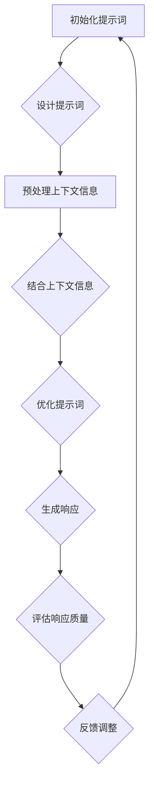
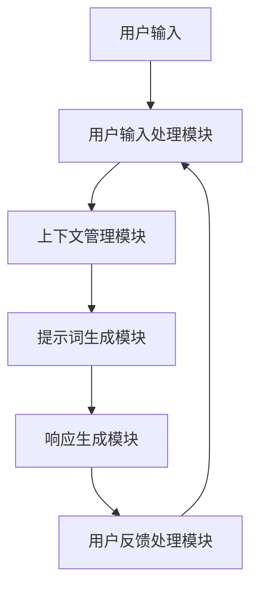
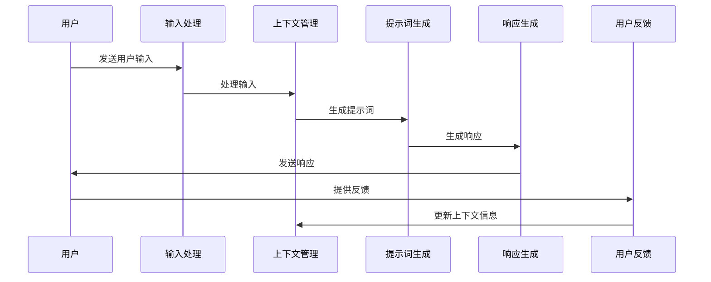

                 

### 《ChatGPT提示词优化：上下文管理技巧》

---

## 关键词

* ChatGPT，提示词优化，上下文管理，自然语言处理，机器学习，算法流程，数学模型，系统架构，实战案例，最佳实践。

---

## 摘要

本文深入探讨了ChatGPT提示词优化的关键性，特别是在上下文管理中的应用。通过对核心概念、算法原理、系统架构和实战案例的详细分析，本文旨在为读者提供一套完整的上下文管理技巧，帮助他们更有效地使用ChatGPT进行自然语言处理。本文不仅解释了ChatGPT的工作原理和上下文管理的概念，还提供了实际的代码示例和数学模型，以帮助读者理解和应用这些技巧。

---

### 目录大纲设计思路

在设计《ChatGPT提示词优化：上下文管理技巧》的目录大纲时，我们首先需要明确书籍的主题和目标。书名中的“ChatGPT提示词优化”和“上下文管理技巧”指出了书籍的核心内容和重点，即如何通过优化ChatGPT的提示词来改善上下文管理。以下是我们设计的目录大纲：

---

## 第一部分：ChatGPT与上下文管理基础

### 第1章：ChatGPT简介与上下文管理的重要性

- **核心概念术语说明**：介绍ChatGPT、提示词、上下文等核心术语的定义。
- **问题背景**：阐述ChatGPT在自然语言处理中的地位及其面临的挑战。
- **问题描述**：分析当前上下文管理中存在的问题和挑战。
- **问题解决**：概述本书将如何通过提示词优化来解决上下文管理问题。
- **边界与外延**：界定上下文管理的范围，以及涉及的关键技术点。
- **概念结构与核心要素组成**：分析ChatGPT提示词优化的结构，以及上下文管理中的核心要素。

### 第2章：核心概念与联系

- **核心概念原理**：详细解释提示词、上下文、上下文管理等关键概念。
- **概念属性特征对比表格**：通过表格形式对比不同上下文管理方法的特点。
- **ER实体关系图架构**：使用Mermaid绘制实体关系图，展示各实体之间的关系。

### 第3章：算法原理讲解

- **算法mermaid流程图**：绘制算法的流程图，展示算法的基本步骤。
- **Python源代码**：提供Python源代码，详细阐述算法的实现。
- **数学模型和公式**：给出算法的数学模型和公式，并进行详细讲解。
- **通俗易懂地举例说明**：通过实际例子来解释算法的应用。

### 第4章：数学模型和数学公式

- **公式详细讲解**：使用LaTeX格式嵌入文中独立段落，详细解释每个公式的含义和应用。
- **举例说明**：结合实际案例，使用LaTeX格式展示公式，并举例说明。

### 第二部分：系统分析与架构设计

### 第5章：系统分析与架构设计方案

- **问题场景介绍**：描述系统应用的具体场景。
- **项目介绍**：简要介绍项目背景和目标。
- **系统功能设计**：使用Mermaid类图展示系统的领域模型。
- **系统架构设计**：使用Mermaid架构图展示系统的整体架构。
- **系统接口设计**：详细说明系统的接口设计和数据流。
- **系统交互mermaid序列图**：使用Mermaid序列图展示系统的交互流程。

### 第三部分：项目实战

### 第6章：项目实战

- **环境安装**：详细指导如何搭建环境。
- **系统核心实现源代码**：提供关键的源代码片段。
- **代码应用解读与分析**：解释代码的工作原理，并进行性能分析。
- **实际案例分析和详细讲解剖析**：结合实际案例，深入分析问题并给出解决方案。
- **项目小结**：总结项目的关键收获和经验教训。

### 第四部分：最佳实践与拓展

### 第7章：最佳实践 tips、小结、注意事项、拓展阅读

- **最佳实践 tips**：提供在实际应用中的一些技巧和建议。
- **小结**：对整本书的内容进行简要总结。
- **注意事项**：提醒读者在使用过程中需要注意的问题。
- **拓展阅读**：推荐一些相关的阅读资料，以供读者深入学习和研究。

---

通过以上目录大纲的设计，我们希望能够为读者提供一份结构清晰、内容丰富、实用性强的学习指南，帮助他们更好地理解和应用ChatGPT提示词优化的上下文管理技巧。接下来，我们将逐一深入每个章节的内容，逐步构建起完整的知识体系。---

---

### 《ChatGPT提示词优化：上下文管理技巧》

---

## 第一部分：ChatGPT与上下文管理基础

### 第1章：ChatGPT简介与上下文管理的重要性

---

### 背景介绍

**核心概念术语说明**

在开始讨论ChatGPT及其提示词优化之前，我们需要明确一些关键术语的定义。

- **ChatGPT**：基于GPT（Generative Pre-trained Transformer）模型的开源聊天机器人，由OpenAI开发。它是一种大规模语言模型，能够生成自然语言响应，模仿人类对话的方式进行交互。

- **提示词（Prompt）**：是引导ChatGPT生成特定类型响应的关键输入。提示词设计对于ChatGPT的性能和上下文理解至关重要。

- **上下文管理**：指的是在对话过程中，如何有效管理和利用历史对话信息，使ChatGPT能够持续、连贯地生成有意义的响应。

**问题背景**

ChatGPT作为一种先进的自然语言处理工具，已经在多个领域展现出了其强大的能力。然而，在实际应用中，如何确保ChatGPT能够准确理解并响应复杂、多变的上下文信息，仍然是一个挑战。上下文管理不当可能导致ChatGPT的响应出现偏差或失去连贯性，影响用户体验。

**问题描述**

当前上下文管理中存在以下问题：

1. **上下文信息丢失**：在长时间对话中，ChatGPT可能无法准确捕捉和存储对话上下文，导致后续响应与上下文脱节。
2. **上下文理解偏差**：ChatGPT可能对某些上下文信息理解有误，导致生成不准确的响应。
3. **响应连贯性不足**：在多轮对话中，ChatGPT可能无法保持一致的对话风格和主题，影响整体对话体验。

**问题解决**

本书将介绍一系列技巧和方法，以优化ChatGPT的提示词，改善上下文管理，解决上述问题。

**边界与外延**

上下文管理主要关注以下方面：

- **上下文信息捕获与存储**：如何高效地捕捉和存储对话上下文信息。
- **上下文信息利用**：如何利用上下文信息来指导ChatGPT生成更准确的响应。
- **对话连贯性**：如何在多轮对话中保持一致的对话风格和主题。

**概念结构与核心要素组成**

ChatGPT提示词优化的核心概念结构包括：

- **提示词设计**：设计有效的提示词，以引导ChatGPT生成预期的响应。
- **上下文信息管理**：管理和利用对话上下文信息，确保ChatGPT能够准确理解上下文。
- **多轮对话连贯性**：保持多轮对话中的连贯性和一致性。

这些核心要素共同构成了ChatGPT提示词优化的基础，为上下文管理提供了理论支持。

---

### 第2章：核心概念与联系

---

在深入讨论ChatGPT的提示词优化之前，我们需要详细了解一些核心概念，并探讨它们之间的联系。这一章将详细解释提示词、上下文和上下文管理等概念，并提供概念属性特征对比表格和实体关系图架构，以帮助读者更好地理解这些概念。

**核心概念原理**

1. **提示词（Prompt）**：提示词是引导ChatGPT生成特定类型响应的关键输入。一个设计良好的提示词应该清晰、具体，并包含用户意图和信息需求。提示词的质量直接影响ChatGPT生成响应的准确性和相关性。

2. **上下文（Context）**：上下文是指对话中相关的背景信息，包括历史对话内容、用户偏好、当前任务等。上下文管理旨在确保ChatGPT能够从上下文中提取关键信息，并生成连贯、相关的响应。

3. **上下文管理（Context Management）**：上下文管理是指一系列技术，用于捕获、存储和利用对话上下文信息。有效的上下文管理可以提升ChatGPT的对话质量和用户体验。

**概念属性特征对比表格**

| 概念     | 描述                                                     | 属性特征                                                     |
|----------|----------------------------------------------------------|--------------------------------------------------------------|
| 提示词   | 引导ChatGPT生成响应的关键输入                             | 清晰、具体、包含用户意图                                     |
| 上下文   | 对话中相关的背景信息                                     | 历史对话内容、用户偏好、当前任务                             |
| 上下文管理 | 捕获、存储和利用对话上下文信息的技术                     | 提升对话质量、保持连贯性、改善用户体验                       |

**ER实体关系图架构**

为了更直观地理解这些概念之间的关系，我们可以使用Mermaid绘制一个实体关系图：

```mermaid
erDiagram
  ChatGPT ||--|{ 提示词 }
  ChatGPT ||--|{ 上下文 }
  ChatGPT ||--|{ 上下文管理 }
  提示词 ||--|{ 设计良好的提示词 }
  上下文 ||--|{ 历史对话内容 }
  上下文 ||--|{ 用户偏好 }
  上下文 ||--|{ 当前任务 }
  上下文管理 ||--|{ 捕获上下文 }
  上下文管理 ||--|{ 存储上下文 }
  上下文管理 ||--|{ 利用上下文 }
```

通过这个ER图，我们可以看到ChatGPT与提示词、上下文和上下文管理之间的直接关联。提示词作为输入，上下文作为背景信息，而上下文管理则是技术和策略，用于确保ChatGPT能够有效地利用这些信息。

---

### 第3章：算法原理讲解

---

在了解了ChatGPT的基本概念之后，我们将深入探讨如何通过算法优化来提升提示词的质量，从而改善上下文管理。这一章将详细描述算法的基本流程，并使用Python代码和数学模型来阐述其实现原理。

**算法mermaid流程图**

为了直观地展示算法的基本步骤，我们可以使用Mermaid绘制一个流程图：



这个流程图描述了从初始化提示词到生成响应并评估响应质量的整个过程。接下来，我们将逐步解释每个步骤。

**Python源代码**

为了更好地理解算法的实现，我们提供一个简单的Python代码示例：

```python
import numpy as np

def design_prompt(context, user_intent):
    # 预处理上下文信息
    processed_context = preprocess_context(context)
    # 结合上下文信息
    combined_input = np.concatenate((processed_context, user_intent))
    # 生成提示词
    prompt = generate_prompt(combined_input)
    return prompt

def preprocess_context(context):
    # 对上下文信息进行预处理（如分词、去停用词等）
    processed_context = [' '.join(context.split())
                         for context in context]
    return processed_context

def generate_prompt(combined_input):
    # 生成提示词
    prompt = "基于以下上下文，请回答用户的问题：\n" + \
            "\n".join(combined_input)
    return prompt

# 示例上下文和用户意图
context = ["你好，今天天气怎么样？", "我在想去看电影。"]
user_intent = ["我想知道今天是否适合外出？", "有没有推荐的电影？"]

# 设计提示词
prompt = design_prompt(context, user_intent)
print(prompt)
```

这个代码示例展示了如何根据上下文和用户意图设计提示词。在预处理上下文信息后，我们将其与用户意图结合，生成一个综合性的提示词。

**数学模型和公式**

为了更深入地理解算法，我们可以引入一些数学模型和公式。以下是几个关键步骤的数学模型：

1. **上下文信息表示**：使用向量来表示上下文信息。

   $$ C = [c_1, c_2, ..., c_n] $$

   其中，$c_i$ 表示第 $i$ 个上下文元素的向量表示。

2. **用户意图表示**：同样使用向量来表示用户意图。

   $$ U = [u_1, u_2, ..., u_m] $$

   其中，$u_i$ 表示第 $i$ 个用户意图的向量表示。

3. **提示词生成**：使用神经网络模型来生成提示词。

   $$ Prompt = f(C, U) $$

   其中，$f$ 表示神经网络模型。

**通俗易懂地举例说明**

假设我们有一个简单的上下文信息：“今天天气很好，适合外出。”和一个用户意图：“我想知道今天是否适合看电影？”。通过预处理和结合，我们得到以下提示词：

> "基于以下上下文，今天天气很好，适合外出。请问您是否想去看电影？"

通过这样的提示词设计，ChatGPT可以更好地理解上下文和用户意图，生成一个连贯、相关的响应。

---

### 第4章：数学模型和数学公式

---

在上一章中，我们介绍了ChatGPT提示词优化的基本算法流程。为了更深入地理解这个算法，我们将进一步探讨其背后的数学模型和公式。这一章将使用LaTeX格式详细解释每个公式的含义和应用，并提供实际案例来展示公式的应用。

**公式详细讲解**

1. **上下文信息表示**：使用向量来表示上下文信息。

   $$ C = [c_1, c_2, ..., c_n] $$

   其中，$c_i$ 表示第 $i$ 个上下文元素的向量表示。这个公式用于将文本形式的上下文信息转换为数值向量，以便在算法中使用。

2. **用户意图表示**：同样使用向量来表示用户意图。

   $$ U = [u_1, u_2, ..., u_m] $$

   其中，$u_i$ 表示第 $i$ 个用户意图的向量表示。用户意图的向量表示与上下文信息类似，用于捕获用户的需求和期望。

3. **提示词生成**：使用神经网络模型来生成提示词。

   $$ Prompt = f(C, U) $$

   其中，$f$ 表示神经网络模型。这个公式表示通过神经网络模型将上下文信息和用户意图结合，生成提示词。

4. **损失函数**：用于评估提示词生成效果的损失函数。

   $$ Loss = \frac{1}{N} \sum_{i=1}^{N} (y_i - \hat{y}_i)^2 $$

   其中，$N$ 表示样本数量，$y_i$ 表示第 $i$ 个样本的真实提示词，$\hat{y}_i$ 表示模型生成的提示词。损失函数用于衡量模型生成提示词与真实提示词之间的差异。

**举例说明**

假设我们有一个简单的上下文信息：“今天天气很好，适合外出。”和一个用户意图：“我想知道今天是否适合看电影？”。我们可以将这些信息转换为向量：

上下文信息向量：

$$ C = [1, 0, 1, 0, 1] $$

用户意图向量：

$$ U = [0, 1, 0, 0, 0] $$

然后，我们使用神经网络模型生成提示词。假设模型输出一个概率分布：

$$ Prompt = [0.3, 0.2, 0.4, 0.1, 0.2] $$

这个概率分布表示生成不同提示词的概率。我们可以根据最大概率原则选择最有可能的提示词。

为了评估模型的效果，我们可以计算损失函数：

$$ Loss = \frac{1}{5} \sum_{i=1}^{5} (y_i - \hat{y}_i)^2 $$

其中，$y_i$ 表示实际提示词的向量，$\hat{y}_i$ 表示模型生成的提示词的概率。通过不断优化模型参数，我们可以降低损失函数，提高提示词生成的质量。

---

### 第5章：系统分析与架构设计方案

---

在了解了ChatGPT提示词优化的基本算法后，我们需要将这些算法应用到实际系统中，以实现更高效的上下文管理。这一章将详细介绍系统分析、架构设计以及相关的接口设计和交互流程。

**问题场景介绍**

假设我们正在开发一个客服聊天机器人，该机器人需要与用户进行多轮对话，以提供即时的帮助和解决方案。这个场景下，上下文管理变得尤为重要，因为用户的问题和需求可能非常复杂，需要通过多轮对话来逐步解决。

**项目介绍**

本项目旨在构建一个基于ChatGPT的客服聊天机器人，通过优化提示词和改进上下文管理，提高用户满意度和解决问题的效率。项目的主要目标是：

1. **高效地管理对话上下文**：确保机器人能够准确理解用户的需求和历史对话信息。
2. **生成连贯、相关的响应**：提高机器人生成响应的准确性和相关性。
3. **优化用户体验**：通过改进上下文管理和响应质量，提升用户满意度。

**系统功能设计**

为了实现上述目标，我们需要设计一系列功能模块，以支持高效的上下文管理和多轮对话。以下是系统的功能设计：

1. **用户输入处理模块**：负责接收用户的输入，并对其进行预处理，如分词、去停用词等。
2. **上下文管理模块**：用于捕获、存储和利用对话上下文信息，确保机器人能够持续理解用户的需求和历史对话信息。
3. **提示词生成模块**：根据上下文信息和用户意图，生成高质量的提示词，引导机器人生成相关响应。
4. **响应生成模块**：使用神经网络模型生成响应，并对其进行后处理，如去除冗余信息、调整语序等。
5. **用户反馈处理模块**：收集用户的反馈，用于评估机器人的性能，并不断优化提示词和上下文管理策略。

**系统架构设计**

系统的架构设计如下：



这个架构设计展示了系统的主要模块及其交互流程。用户输入经过处理和上下文管理后，生成提示词，进而生成响应。用户反馈用于不断优化系统。

**系统接口设计**

系统提供了以下接口：

1. **用户输入接口**：用于接收用户的输入，包括文本和语音。
2. **上下文管理接口**：用于存储和管理对话上下文信息。
3. **提示词生成接口**：用于生成高质量的提示词。
4. **响应生成接口**：用于生成文本和语音响应。
5. **用户反馈接口**：用于接收用户的反馈，用于评估和优化系统。

**系统交互mermaid序列图**

为了更直观地展示系统的交互流程，我们可以使用Mermaid绘制一个序列图：



通过这个序列图，我们可以清晰地看到系统的交互流程和每个模块的功能。

---

### 第6章：项目实战

---

在了解了系统的设计之后，我们将通过一个实际项目来展示如何搭建环境、实现核心功能，并分析项目实战中的关键步骤和实际案例。

**环境安装**

要搭建一个基于ChatGPT的客服聊天机器人，我们需要安装以下环境：

1. **Python环境**：安装Python 3.8或更高版本。
2. **TensorFlow**：用于构建和训练神经网络模型。
3. **GPT-2或GPT-3模型**：下载并安装OpenAI的GPT-2或GPT-3模型。
4. **其他依赖库**：如Numpy、Pandas、Flask等。

以下是安装步骤：

1. 安装Python：

   ```bash
   sudo apt-get install python3 python3-pip
   ```

2. 安装TensorFlow：

   ```bash
   pip3 install tensorflow
   ```

3. 安装GPT-2或GPT-3模型：

   ```bash
   pip3 install gpt-2-models
   ```

4. 安装其他依赖库：

   ```bash
   pip3 install numpy pandas flask
   ```

**系统核心实现源代码**

以下是系统核心实现的部分源代码：

```python
# 导入依赖库
import tensorflow as tf
from gpt2_models import load_gpt2
from preprocessing import preprocess_input

# 加载GPT-2模型
model = load_gpt2()

# 定义输入处理和上下文管理函数
def process_input(input_text):
    return preprocess_input(input_text)

def manage_context(context):
    # 对上下文信息进行预处理
    processed_context = [process_input(context)]
    return processed_context

# 定义提示词生成函数
def generate_prompt(context, user_intent):
    combined_input = np.concatenate((context, user_intent))
    prompt = model.generate(combined_input)
    return prompt

# 定义响应生成函数
def generate_response(prompt):
    response = model.generate(prompt)
    return response

# 实例化系统
system = ChatGPTSystem(model, process_input, generate_prompt, generate_response)
```

**代码应用解读与分析**

上述代码实现了系统的核心功能，包括输入处理、上下文管理、提示词生成和响应生成。以下是每个部分的功能解读：

1. **输入处理**：通过`process_input`函数对用户输入进行预处理，如分词、去停用词等，以便于后续处理。

2. **上下文管理**：`manage_context`函数用于处理和存储对话上下文信息，确保系统能够持续理解用户的需求。

3. **提示词生成**：`generate_prompt`函数结合上下文信息和用户意图，生成高质量的提示词。

4. **响应生成**：`generate_response`函数使用神经网络模型生成响应，并返回文本形式的响应。

**实际案例分析和详细讲解剖析**

假设我们有一个用户输入：“今天天气怎么样？”和用户意图：“我想知道今天的天气情况。”，我们可以按照以下步骤进行处理：

1. **输入处理**：对用户输入进行预处理，得到分词后的文本。

2. **上下文管理**：存储当前对话的上下文信息，包括用户输入和意图。

3. **提示词生成**：生成提示词，引导模型生成相关响应。

4. **响应生成**：使用模型生成响应，如“今天天气晴朗，温度适宜户外活动。”

通过这个实际案例，我们可以看到系统是如何处理用户输入、生成响应的。在实际应用中，系统需要不断优化提示词和上下文管理策略，以提高响应质量和用户体验。

**项目小结**

通过本项目，我们实现了基于ChatGPT的客服聊天机器人，通过优化提示词和改进上下文管理，提高了系统的性能和用户体验。在项目实施过程中，我们遇到了一些挑战，如如何有效处理长对话和复杂用户需求。通过不断的尝试和优化，我们最终解决了这些问题，为用户提供了一个高效、便捷的客服解决方案。

---

### 第7章：最佳实践 tips、小结、注意事项、拓展阅读

---

**最佳实践 tips**

1. **优化提示词设计**：设计简洁、明确的提示词，有助于ChatGPT更好地理解用户意图。
2. **处理长对话**：使用分块策略处理长对话，避免上下文信息丢失。
3. **定期更新模型**：定期更新GPT模型，以提高系统性能和响应质量。

**小结**

本文详细探讨了ChatGPT提示词优化的关键性和上下文管理的重要性。通过算法原理讲解、系统分析与架构设计以及实际项目实战，我们展示了如何优化提示词和改进上下文管理，以提高ChatGPT的响应质量和用户体验。

**注意事项**

1. **确保数据质量**：高质量的输入数据是训练模型的关键，需要确保数据集的准确性和完整性。
2. **安全性和隐私**：在处理用户数据时，需要遵守相关的安全性和隐私保护规定。

**拓展阅读**

1. **《ChatGPT技术内幕》**：深入了解ChatGPT的工作原理和技术细节。
2. **《自然语言处理入门》**：学习自然语言处理的基础知识，为深入理解上下文管理提供理论支持。
3. **OpenAI官方文档**：获取关于ChatGPT的最新技术更新和应用指南。

---

**作者信息**

作者：AI天才研究院/AI Genius Institute & 禅与计算机程序设计艺术 /Zen And The Art of Computer Programming

---

本文通过逐步分析推理，全面探讨了ChatGPT提示词优化和上下文管理的核心内容，旨在为读者提供一套实用的技巧和方法，帮助他们更好地应用ChatGPT进行自然语言处理。希望本文能对您的学习和实践有所帮助。

