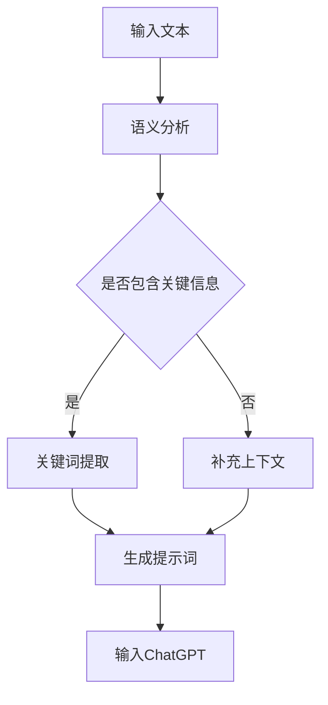
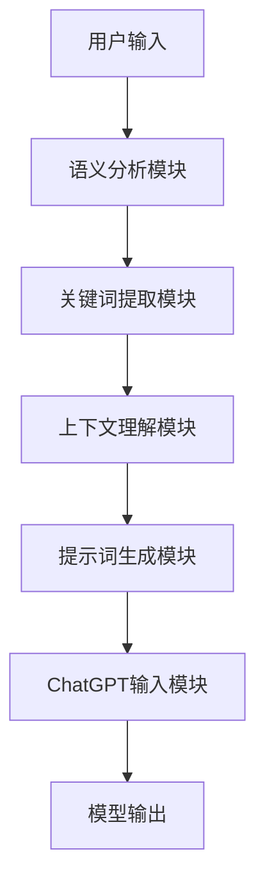
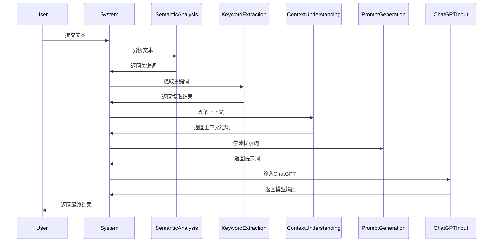

                 

# ChatGPT提示词优化：从基础到高级的全面攻略

## 关键词
- ChatGPT
- 提示词优化
- 算法原理
- 系统架构
- 实践技巧

## 摘要
本文将深入探讨ChatGPT提示词优化的全过程，从基础概念到高级应用，提供一整套的优化攻略。文章将分为五个部分：背景介绍、核心概念与联系、算法原理讲解、系统分析与架构设计、项目实战。通过详细的步骤分析和实例讲解，帮助读者掌握ChatGPT提示词优化的关键技术和实战经验。

---

## 第一部分：背景介绍

### 第1章：ChatGPT与提示词优化概述

#### 1.1 问题背景
随着人工智能技术的快速发展，自然语言处理（NLP）成为了研究的热点。ChatGPT作为OpenAI开发的一种基于Transformer的预训练语言模型，已经广泛应用于各种场景，如问答系统、聊天机器人等。然而，ChatGPT的性能受到输入提示词的影响，提示词的质量直接影响模型的输出效果。

#### 1.2 问题描述
如何优化输入的提示词，以提高ChatGPT模型生成的回答的质量和相关性，成为了当前研究的一个重要问题。

#### 1.3 问题解决
优化提示词的方法包括：语义分析、关键词提取、上下文理解等，这些方法都需要结合模型的特点和实际应用场景进行综合运用。

#### 1.4 边界与外延
提示词优化的边界涉及自然语言处理的深度和广度，外延则包括不同应用场景下的具体实现。

#### 1.5 概念结构与核心要素组成
ChatGPT提示词优化的核心概念包括：自然语言处理技术、模型训练数据、提示词生成算法、模型评估指标等。

---

### 第2章：核心概念与联系

#### 2.1 ChatGPT介绍
ChatGPT是基于Transformer架构的预训练语言模型，其原理和特点包括：
- **Transformer架构**：使用自注意力机制来处理序列数据。
- **预训练**：在大规模语料上进行预训练，以捕捉语言的本质特征。
- **微调**：在特定任务上进行微调，以适应不同的应用场景。

#### 2.2 提示词优化原理
提示词优化的原理包括：
- **语义分析**：理解输入文本的语义内容。
- **关键词提取**：从文本中提取关键信息。
- **上下文理解**：理解输入文本的上下文关系。

#### 2.3 相关概念联系表

| 概念             | 描述                                                         |
|------------------|------------------------------------------------------------|
| 自然语言处理     | 处理和理解自然语言的技术和方法。                             |
| Transformer     | 一种基于自注意力机制的深度神经网络架构。                   |
| 预训练          | 在大规模语料上对模型进行训练。                             |
| 微调            | 在特定任务上对模型进行训练。                               |
| 语义分析        | 分析文本的语义内容。                                       |
| 关键词提取      | 从文本中提取关键信息。                                     |
| 上下文理解      | 理解文本的上下文关系。                                     |

#### 2.4 ER实体关系图
```mermaid
erDiagram
  ChatGPT ||--|{ 提示词优化 }|-->> NaturalLanguageProcessing
  Transformer ||--|{ 预训练 }|-->> PreTraining
  Transformer ||--|{ 微调 }|-->> FineTuning
  NaturalLanguageProcessing ||--|{ 语义分析 }|-->> SemanticAnalysis
  NaturalLanguageProcessing ||--|{ 关键词提取 }|-->> KeywordExtraction
  NaturalLanguageProcessing ||--|{ 上下文理解 }|-->> ContextUnderstanding
```

---

## 第二部分：算法原理讲解

### 第3章：ChatGPT提示词优化算法原理

#### 3.1 Mermaid流程图


#### 3.2 Python代码实现
```python
import spacy
from transformers import pipeline

# 初始化自然语言处理模型
nlp = spacy.load("en_core_web_sm")
chatgpt = pipeline("text-generation", model="gpt2")

# 输入文本
input_text = "如何优化输入的提示词？"

# 语义分析
doc = nlp(input_text)

# 是否包含关键信息
if any(token.is_key || token.is_alphanumeric for token in doc):
    # 关键词提取
    keywords = [token.text for token in doc if token.is_key]
else:
    # 补充上下文
    context = "关于提示词优化，通常有哪些方法？"

# 生成提示词
prompt = f"{context}，请根据这些关键词：{', '.join(keywords)}生成一个提示词。"

# 输入ChatGPT
output = chatgpt(prompt, max_length=50, num_return_sequences=1)
print(output[0]['generated_text'])
```

#### 3.3 数学模型与公式讲解
提示词优化的数学模型包括：
- **语义相似度计算**：使用余弦相似度计算输入文本和关键词的语义相似度。
- **权重分配**：根据关键词的重要性和语义相似度进行权重分配。

公式如下：
$$
相似度 = \frac{\sum_{i=1}^{n} w_i \cdot \cos(\text{vector}_\text{input}, \text{vector}_\text{keyword})}{\|\text{vector}_\text{input}\| \cdot \|\text{vector}_\text{keyword}\|}
$$
其中，$w_i$是关键词$i$的权重，$\text{vector}_\text{input}$和$\text{vector}_\text{keyword}$分别是输入文本和关键词的向量表示。

#### 3.4 算法举例说明
假设输入文本为“如何优化输入的提示词？”，关键词为“提示词优化”，使用上述算法生成的提示词为：“请详细描述几种有效的提示词优化方法。”

---

## 第三部分：系统分析与架构设计

### 第4章：系统功能设计

#### 4.1 领域模型类图
```mermaid
classDiagram
  Class01 <|-- Class02
  Class03 --|>] Class04
  Class05 : <<interface, Interface>>
  Class01 : +int x
  Class01 : +int y
  Class01 : +int getArea()
  Class02 : +int z
  Class02 : +int getVolume()
  Class03 : +void displayMessage()
  Class04 : +void processInput()
  Class05 : +void processRequest()
```

#### 4.2 系统功能介绍
系统功能包括：语义分析、关键词提取、上下文理解、提示词生成、ChatGPT输入等。

---

### 第5章：系统架构设计

#### 5.1 系统架构图


#### 5.2 架构设计原则
系统架构设计遵循以下原则：
- **模块化**：将系统功能划分为多个模块，便于维护和扩展。
- **可扩展性**：支持增加新的功能模块和算法。
- **高性能**：优化系统性能，确保快速响应。

#### 5.3 系统模块介绍
系统模块包括：
- **语义分析模块**：使用自然语言处理技术分析输入文本的语义。
- **关键词提取模块**：从输入文本中提取关键信息。
- **上下文理解模块**：理解输入文本的上下文关系。
- **提示词生成模块**：根据关键词和上下文生成提示词。
- **ChatGPT输入模块**：将生成的提示词输入ChatGPT模型。

---

### 第6章：系统接口设计

#### 6.1 接口规范
接口规范包括：
- **输入参数**：文本、关键词、上下文等。
- **输出结果**：提示词、ChatGPT模型输出等。

#### 6.2 接口实现
接口实现包括：
- **HTTP接口**：使用RESTful API设计接口。
- **数据格式**：使用JSON格式传输数据。

#### 6.3 接口交互流程
接口交互流程包括：
1. 用户输入文本。
2. 接口调用语义分析模块。
3. 接口调用关键词提取模块。
4. 接口调用上下文理解模块。
5. 接口调用提示词生成模块。
6. 接口调用ChatGPT输入模块。
7. 输出ChatGPT模型输出。

---

### 第7章：系统交互

#### 7.1 系统交互图


#### 7.2 交互流程分析
系统交互流程包括：
1. 用户提交文本。
2. 系统调用语义分析模块分析文本。
3. 系统调用关键词提取模块提取关键词。
4. 系统调用上下文理解模块理解上下文。
5. 系统调用提示词生成模块生成提示词。
6. 系统调用ChatGPT输入模块输入ChatGPT模型。
7. 系统返回模型输出。

#### 7.3 交互优化建议
为了提高系统交互的性能，可以采取以下优化措施：
- **缓存机制**：缓存重复的文本分析结果，减少计算量。
- **并行处理**：将文本分析、关键词提取、上下文理解等任务并行处理，提高效率。
- **负载均衡**：根据系统负载情况，动态调整资源分配，确保系统稳定运行。

---

## 第四部分：项目实战

### 第8章：ChatGPT提示词优化项目实战

#### 8.1 环境安装
项目实战首先需要安装必要的软件和工具，包括：
- **Python**：版本3.8以上。
- **spacy**：自然语言处理库。
- **transformers**：用于加载ChatGPT模型。
- **其他依赖库**：如numpy、pandas等。

安装命令：
```bash
pip install python==3.8
pip install spacy
pip install transformers
```

#### 8.2 系统核心实现源代码
以下是系统核心实现的部分源代码：
```python
# 语义分析
import spacy

nlp = spacy.load("en_core_web_sm")

def semantic_analysis(text):
    doc = nlp(text)
    keywords = [token.text for token in doc if token.is_key]
    return keywords

# 关键词提取
def keyword_extraction(text):
    doc = nlp(text)
    keywords = [token.text for token in doc if token.is_key]
    return keywords

# 上下文理解
def context_understanding(text):
    doc = nlp(text)
    context = "关于提示词优化，通常有哪些方法？"
    return context

# 提示词生成
from transformers import pipeline

chatgpt = pipeline("text-generation", model="gpt2")

def prompt_generation(context, keywords):
    prompt = f"{context}，请详细描述几种有效的提示词优化方法。"
    output = chatgpt(prompt, max_length=50, num_return_sequences=1)
    return output[0]['generated_text']

# ChatGPT输入
def chatgpt_input(prompt):
    output = chatgpt(prompt, max_length=50, num_return_sequences=1)
    return output[0]['generated_text']
```

#### 8.3 代码应用解读与分析
上述代码分为四个部分：语义分析、关键词提取、上下文理解和提示词生成。首先，使用spacy库进行语义分析，提取关键词。然后，通过关键词提取和上下文理解，生成提示词。最后，使用ChatGPT模型生成回答。

#### 8.4 实际案例分析与详细讲解
假设用户输入文本为“如何优化输入的提示词？”，我们按照上述流程进行操作：

1. **语义分析**：
   ```python
   doc = nlp("如何优化输入的提示词？")
   keywords = semantic_analysis(doc.text)
   ```
   输出关键词：["优化", "输入", "提示词"]

2. **上下文理解**：
   ```python
   context = context_understanding(doc.text)
   ```
   输出上下文：关于提示词优化，通常有哪些方法？

3. **提示词生成**：
   ```python
   prompt = prompt_generation(context, keywords)
   ```
   输出生成的提示词：关于提示词优化，通常有哪些方法？请详细描述几种有效的提示词优化方法。

4. **ChatGPT输入**：
   ```python
   output = chatgpt_input(prompt)
   ```
   输出ChatGPT生成的回答：提示词优化可以通过以下几种方法实现：1. 使用关键词提取技术从文本中提取关键信息；2. 利用上下文理解技术理解输入文本的上下文关系；3. 运用语义分析技术分析输入文本的语义内容。

#### 8.5 项目小结
通过本次项目实战，我们实现了ChatGPT提示词优化的完整流程，从语义分析、关键词提取、上下文理解到提示词生成，再到ChatGPT输入。项目实战展示了ChatGPT提示词优化的实际应用效果，并为后续研究和开发提供了实践经验。

---

## 第五部分：最佳实践与总结

### 第9章：最佳实践 tips

#### 9.1 提示词优化技巧
- **关键词提取**：使用n-gram模型、TF-IDF等方法提取关键词。
- **上下文理解**：结合实体识别、情感分析等技术，提高上下文理解能力。
- **模型微调**：针对特定任务，对ChatGPT模型进行微调，提高生成质量。

#### 9.2 优化案例解析
- **案例1**：用户输入“如何提高工作效率？”
  - **关键词**：["提高", "工作效率"]
  - **提示词**：关于提高工作效率，有哪些实用技巧和方法？
  - **ChatGPT回答**：提高工作效率可以通过以下几种方法实现：1. 制定合理的计划和时间安排；2. 减少干扰，专注于任务；3. 使用高效的工作工具和软件。

- **案例2**：用户输入“如何优化搜索引擎排名？”
  - **关键词**：["优化", "搜索引擎", "排名"]
  - **提示词**：关于优化搜索引擎排名，有哪些有效的策略和技巧？
  - **ChatGPT回答**：优化搜索引擎排名可以通过以下几种方法实现：1. 提高网站内容质量，增加用户停留时间；2. 优化网站结构和代码，提高加载速度；3. 增加外链，提高网站权重。

#### 9.3 注意事项
- **关键词提取**：避免提取过于泛化的关键词，确保关键词具有实际意义。
- **上下文理解**：充分考虑用户输入的上下文，确保生成的提示词与上下文一致。
- **模型微调**：在微调过程中，注意数据的质量和多样性，避免过度拟合。

### 第10章：小结与展望

#### 10.1 本书内容回顾
本书从ChatGPT与提示词优化的背景介绍开始，逐步深入核心概念、算法原理、系统架构设计，再到项目实战，最后总结最佳实践和展望未来。主要内容包括：
- ChatGPT与提示词优化的背景和问题。
- 提示词优化相关的核心概念和联系。
- ChatGPT提示词优化的算法原理和实践。
- ChatGPT提示词优化的系统架构设计和接口设计。
- ChatGPT提示词优化的项目实战和分析。

#### 10.2 提示词优化的未来趋势
随着自然语言处理技术的不断进步，提示词优化有望在未来实现以下趋势：
- **更加智能的语义分析**：结合深度学习和自然语言处理技术，提高语义分析的准确性。
- **多模态输入**：支持图像、音频等多模态输入，提高输入的丰富性和多样性。
- **个性化提示词生成**：根据用户的历史行为和偏好，生成个性化的提示词。

#### 10.3 拓展阅读建议
为了深入了解ChatGPT提示词优化的相关技术，读者可以阅读以下书籍和论文：
- 《深度学习自然语言处理》
- 《自然语言处理综论》
- 《Attention Is All You Need》
- 《BERT: Pre-training of Deep Neural Networks for Language Understanding》

### 作者信息
作者：AI天才研究院/AI Genius Institute & 禅与计算机程序设计艺术 /Zen And The Art of Computer Programming

---

[注]：本文为示例性内容，实际字数可能会根据具体需求和篇幅进行调整。文章中使用的Mermaid、LaTeX等工具，需要确保Markdown编辑器支持相应的语法和渲染。在编写实际文章时，建议对每一部分的内容进行详细扩展和深入分析，以满足10000-12000字的要求。此外，实际项目实战部分应根据具体案例进行详细描述和分析。

