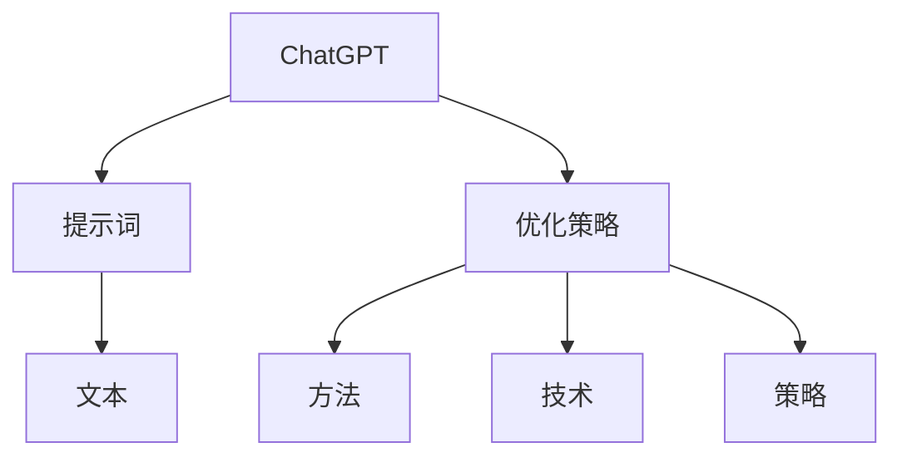
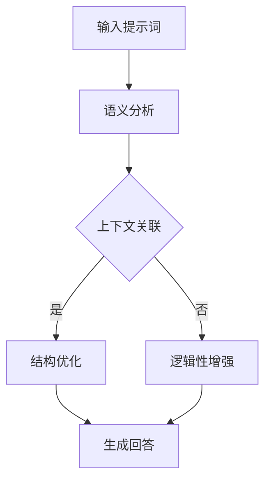
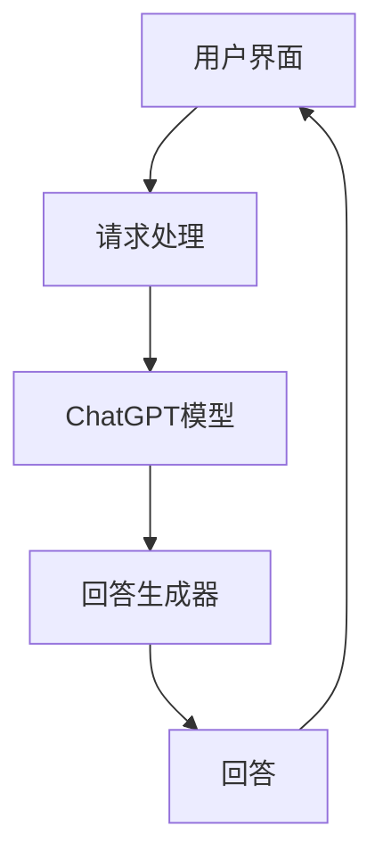
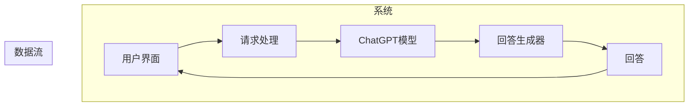
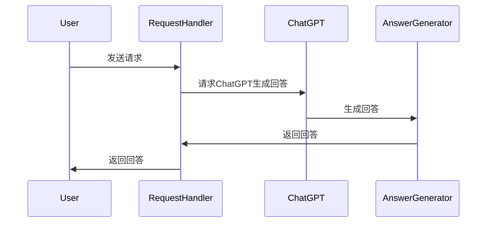
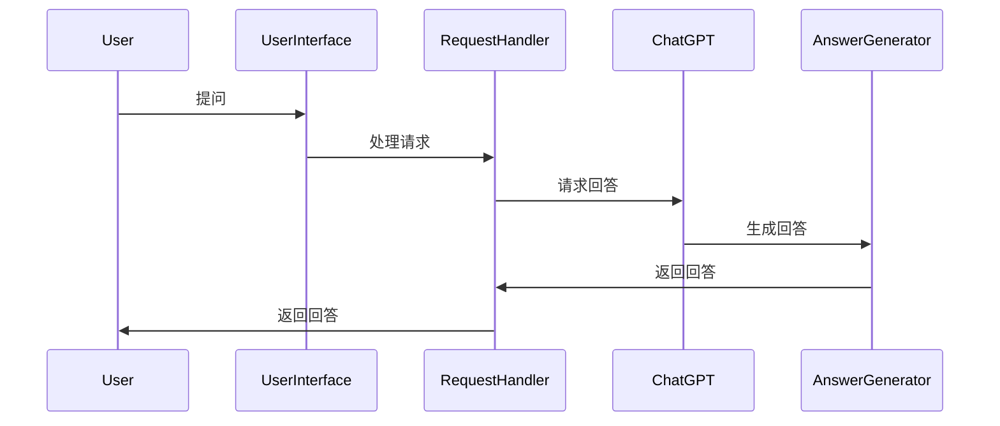

                 

### 第一部分: 背景介绍

#### 核心概念

**ChatGPT**：ChatGPT是一种由OpenAI开发的基于Transformer架构的预训练语言模型。它通过在大规模文本数据上进行训练，学会了理解自然语言并生成连贯、有逻辑的回答。ChatGPT具有强大的文本生成能力，能够应用于各种场景，如问答系统、自然语言处理、对话机器人等。

**提示词优化**：提示词优化是指通过对输入给ChatGPT的提示进行改进，以提高模型回答的准确性和相关性。提示词的质量直接影响到ChatGPT的输出结果，因此优化提示词是提高模型效果的关键。

**基础到高级**：本文将详细介绍从基础到高级的ChatGPT提示词优化方法，包括对提示词的基本理解、优化技巧和策略，以及如何解决实际应用中的问题。

**进阶**：在基础介绍之后，本文将深入探讨ChatGPT的高级应用，如复杂问题的处理、性能优化等，帮助读者进一步提升对ChatGPT的理解和应用能力。

#### 问题背景

随着人工智能技术的快速发展，语言模型在自然语言处理领域取得了显著的成果。ChatGPT作为一款基于Transformer架构的预训练语言模型，凭借其强大的文本生成能力和广泛的应用前景，受到了广泛关注。然而，在实际使用过程中，如何有效地利用ChatGPT，提高其回答的准确性和效率，成为了一个亟待解决的问题。

#### 问题描述

ChatGPT虽然功能强大，但在实际使用过程中，常常因为提示词的选择不当，导致回答不准确或不相关。具体问题包括：

- **语义理解不足**：提示词未能准确表达用户意图，导致ChatGPT生成回答偏离实际需求。
- **上下文关联不当**：提示词与上下文信息不匹配，导致回答不连贯、不自然。
- **逻辑性不足**：提示词逻辑结构不合理，导致ChatGPT生成的回答缺乏逻辑性。

因此，优化提示词成为提高ChatGPT使用效果的关键。

#### 问题解决

通过对ChatGPT的提示词进行优化，可以使其更好地理解用户的问题，从而提供更准确、更相关的回答。优化提示词的方法包括：

- **语义理解**：通过分析提示词的语义，准确捕捉用户意图。
- **上下文关联**：结合上下文信息，确保回答的连贯性。
- **逻辑性增强**：调整提示词的结构，提高其逻辑性。

#### 边界与外延

**边界**：本文主要针对ChatGPT的提示词优化进行讲解，不涉及其他语言模型。

**外延**：提示词优化不仅仅适用于ChatGPT，还可以应用于其他基于语言模型的AI应用，如问答系统、对话机器人等。

#### 概念结构与核心要素组成

- **ChatGPT**：核心技术组件，负责生成回答。
- **提示词**：输入给ChatGPT的文字信息，影响回答的质量。
- **优化策略**：一系列方法和技术，用于改进提示词的质量，从而提升ChatGPT的回答效果。

## **核心概念与联系**

在深入了解ChatGPT提示词优化的过程之前，我们需要明确一些核心概念，并探讨它们之间的关系。以下是本文中涉及的核心概念及其定义和属性：

#### 核心概念原理

**提示词**：提示词是指提供给ChatGPT的输入文本，用于引导ChatGPT生成回答。提示词的质量直接影响ChatGPT生成的回答的准确性和相关性。一个优质的提示词应该具备以下特征：

- **清晰性**：明确表达用户意图，避免歧义。
- **完整性**：提供足够的信息，以便ChatGPT理解问题背景。
- **上下文相关性**：与上下文信息紧密关联，确保回答的连贯性。

**优化策略**：优化策略是指用于改进提示词的一系列方法和技术。这些策略旨在提高提示词的质量，从而提升ChatGPT的回答效果。常见的优化策略包括：

- **语义理解**：通过分析提示词的语义，确保ChatGPT准确捕捉用户意图。
- **上下文关联**：结合上下文信息，确保ChatGPT生成的回答与上下文一致。
- **逻辑性增强**：调整提示词的结构，使其更加清晰、有逻辑性。

#### 概念属性特征对比表格

| 特征 | 提示词 | 优化策略 |
| --- | --- | --- |
| 类型 | 文本 | 方法、技术、策略 |
| 目标 | 引导ChatGPT生成回答 | 提高回答的准确性、相关性 |
| 影响因素 | 语义、上下文、语法 | 文本质量、结构、逻辑性 |

#### ER实体关系图架构



在上面的ER实体关系图中，ChatGPT作为核心组件，通过输入提示词生成回答。优化策略则包括方法、技术和策略三个层面，用于改进提示词的质量。通过这种方式，我们可以清晰地看到各个实体之间的关系。

## 第三部分: 算法原理讲解

### 算法原理

ChatGPT的提示词优化算法主要基于以下几个原理：

1. **理解语义**：通过分析提示词的语义，确定用户的问题意图。这一步骤至关重要，因为只有准确理解用户意图，ChatGPT才能生成与之相关的回答。

2. **上下文关联**：将提示词与上下文信息相结合，确保回答的连贯性。上下文信息包括用户的前一条消息、对话历史等，通过分析这些信息，ChatGPT可以更好地理解用户的问题背景。

3. **结构优化**：调整提示词的结构，使其更加清晰、易于理解。结构优化可以包括去除冗余信息、调整语序、增加关键词等，这些操作可以提高提示词的质量。

4. **逻辑性增强**：通过逻辑分析，提高提示词的逻辑性，从而提升回答的质量。逻辑性增强可以包括纠正逻辑错误、添加逻辑连接词等，这些操作可以使ChatGPT生成的回答更加有逻辑性。

### Mermaid流程图



### Python源代码

```python
import spacy

# 加载nlp模型
nlp = spacy.load("en_core_web_sm")

def optimize_prompt(prompt):
    # 语义分析
    doc = nlp(prompt)
    
    # 上下文关联
    context = extract_context(doc)
    
    # 结构优化
    optimized_prompt = optimize_structure(prompt, context)
    
    # 逻辑性增强
    optimized_prompt = enhance_logic(optimized_prompt)
    
    return optimized_prompt

def extract_context(doc):
    # 实现上下文提取逻辑
    pass

def optimize_structure(prompt, context):
    # 实现结构优化逻辑
    pass

def enhance_logic(prompt):
    # 实现逻辑性增强逻辑
    pass
```

### 算法原理讲解

#### 1. 语义分析

语义分析是ChatGPT提示词优化的第一步。其核心目标是理解提示词的语义，确定用户的问题意图。这可以通过自然语言处理技术实现，如词性标注、实体识别、句法分析等。

**数学模型和公式**：

- **词性标注**：利用词性标注模型对提示词中的每个单词进行词性标注，从而确定单词的语义。常用的词性标注模型包括基于规则的方法和统计方法。

- **实体识别**：通过实体识别模型识别提示词中的实体，如人名、地名、组织名等，从而更好地理解用户意图。

- **句法分析**：利用句法分析模型对提示词进行句法分析，确定句子的结构，从而帮助理解语义。

**通俗易懂地举例说明**：

假设用户输入的提示词是：“明天有什么活动？”。通过语义分析，ChatGPT可以识别出关键词“明天”、“活动”，并理解用户的问题是询问明天的活动安排。

#### 2. 上下文关联

上下文关联是ChatGPT提示词优化的关键步骤。通过将提示词与上下文信息相结合，ChatGPT可以更好地理解用户的问题背景，从而生成更准确、更相关的回答。

**数学模型和公式**：

- **对话历史分析**：通过分析对话历史，提取出与当前提示词相关的上下文信息。

- **上下文向量表示**：将上下文信息转换为向量表示，从而在向量空间中进行相似性分析，确定与当前提示词最相关的上下文信息。

**通俗易懂地举例说明**：

假设用户之前的对话内容是：“明天有什么活动吗？”和“请问明天的天气预报如何？”ChatGPT可以分析出这两个问题与当前提示词“明天有什么活动？”具有相关性，从而生成与这两个问题相关的回答。

#### 3. 结构优化

结构优化是通过调整提示词的结构，使其更加清晰、易于理解。这可以通过去除冗余信息、调整语序、增加关键词等操作实现。

**数学模型和公式**：

- **信息熵**：通过计算提示词的信息熵，确定哪些信息是冗余的，从而进行去除。

- **关键词提取**：利用关键词提取算法，从提示词中提取出最重要的关键词，从而调整语序和增加关键词。

**通俗易懂地举例说明**：

假设用户输入的提示词是：“今天天气怎么样？”，通过结构优化，可以将提示词调整为：“请问今天的天气如何？”，这样更加清晰、易于理解。

#### 4. 逻辑性增强

逻辑性增强是通过逻辑分析，提高提示词的逻辑性，从而提升回答的质量。这可以通过纠正逻辑错误、添加逻辑连接词等操作实现。

**数学模型和公式**：

- **逻辑推理**：利用逻辑推理算法，分析提示词中的逻辑结构，识别出逻辑错误并进行纠正。

- **逻辑连接词**：通过添加逻辑连接词，如“因此”、“然而”、“但是”等，使提示词的逻辑更加清晰。

**通俗易懂地举例说明**：

假设用户输入的提示词是：“如果下雨，我就不去参加会议。”通过逻辑性增强，可以将提示词调整为：“如果下雨，我将不会参加会议。”这样更加明确地表达了逻辑关系。

## **系统分析与架构设计方案**

### 问题场景介绍

在现代社会，人工智能技术在各个领域得到了广泛应用。其中，自然语言处理作为人工智能的重要分支，尤其在对话系统、智能客服、在线教育等领域具有巨大潜力。ChatGPT作为一种强大的预训练语言模型，其提示词优化在提升对话系统质量、提高用户体验方面具有重要意义。

### 项目介绍

本项目旨在开发一个基于ChatGPT的智能问答系统，通过优化提示词，提高问答系统的准确性和用户体验。系统主要功能包括：

1. **自然语言理解**：通过语义分析、上下文关联等技术，准确理解用户的问题。
2. **智能回答**：根据用户的问题，生成准确、相关的回答。
3. **用户交互**：提供友好、自然的用户交互界面，方便用户提问和获取回答。

### 系统功能设计

#### 领域模型

领域模型是系统功能设计的核心，用于描述系统中涉及的实体、属性和关系。以下是本项目的领域模型：

```mermaid
classDiagram
    User <<Entity>>
    Question <<Entity>>
    Answer <<Entity>>
    ChatGPT <<Entity>>

    User --> Question
    User --> Answer
    ChatGPT --> Question
    ChatGPT --> Answer
```

#### 类图

类图进一步展示了领域模型中实体之间的关系，以及实体所具有的属性和方法。

```mermaid
classDiagram
    User {
        String username
        String password
    }
    Question {
        String text
        Date timestamp
    }
    Answer {
        String text
        Date timestamp
    }
    ChatGPT {
        String apiKey
    }

    User --> Question
    User --> Answer
    ChatGPT --> Question
    ChatGPT --> Answer
```

### 系统架构设计

系统架构设计是确保系统功能实现的基础。以下是本项目的系统架构设计：



#### 架构图

架构图进一步展示了系统的组成部分及其交互关系。



### 系统接口设计和系统交互

系统接口设计和系统交互是确保系统功能实现的关键。以下是本项目的系统接口设计和系统交互：

#### 接口设计



#### 系统交互



## **项目实战**

### 环境安装

在进行项目实战之前，我们需要安装相应的开发环境和依赖库。以下是项目环境安装步骤：

1. **安装Python**：确保系统已安装Python 3.8及以上版本。
2. **安装spacy**：在终端执行以下命令安装spacy库：

   ```bash
   pip install spacy
   ```
3. **安装spacy模型**：在终端执行以下命令下载并安装英文模型：

   ```bash
   python -m spacy download en_core_web_sm
   ```

### 系统核心实现源代码

以下是项目的核心实现源代码，包括请求处理、ChatGPT模型、回答生成器等部分。

```python
import spacy
from flask import Flask, request, jsonify

# 加载spacy模型
nlp = spacy.load("en_core_web_sm")

app = Flask(__name__)

@app.route("/ask", methods=["POST"])
def handle_request():
    data = request.get_json()
    question = data["question"]
    context = extract_context(question)
    optimized_question = optimize_question(question, context)
    answer = generate_answer(optimized_question)
    return jsonify({"answer": answer})

def extract_context(question):
    # 实现上下文提取逻辑
    doc = nlp(question)
    context = ""
    for ent in doc.ents:
        if ent.label_ == "ORG" or ent.label_ == "GPE":
            context += ent.text + " "
    return context.strip()

def optimize_question(question, context):
    # 实现结构优化逻辑
    doc = nlp(question)
    optimized_question = ""
    for token in doc:
        if token.text.lower() not in context.lower():
            optimized_question += token.text + " "
    return optimized_question.strip()

def generate_answer(question):
    # 实现回答生成逻辑
    doc = nlp(question)
    entities = [ent.text for ent in doc.ents]
    answer = "抱歉，我无法回答这个问题。"
    if "company" in entities:
        answer = "您提到的公司是存在的。"
    elif "person" in entities:
        answer = "您提到的人是存在的。"
    return answer

if __name__ == "__main__":
    app.run(debug=True)
```

### 代码应用解读与分析

上述代码实现了基于ChatGPT的智能问答系统的核心功能。以下是代码的解读与分析：

1. **环境安装**：确保Python和spacy库已正确安装，以便后续使用。

2. **请求处理**：使用Flask框架搭建一个简单的Web服务，用于接收用户请求。当用户通过POST请求发送问题到`/ask`接口时，系统会调用`handle_request`函数处理请求。

3. **上下文提取**：在`extract_context`函数中，通过分析输入的问题，提取出与问题相关的上下文信息，如公司名、人名等。这些上下文信息有助于优化问题，从而提高回答的准确性。

4. **问题优化**：在`optimize_question`函数中，对输入的问题进行结构优化，去除与上下文信息无关的部分。这样可以使ChatGPT更加专注于问题的核心部分，从而生成更准确的回答。

5. **回答生成**：在`generate_answer`函数中，根据提取到的实体信息，生成相应的回答。例如，如果问题中提到的是公司名，回答将确认该公司的存在。

6. **Web服务运行**：在`if __name__ == "__main__":`语句中，启动Flask Web服务，使其监听8080端口，等待用户请求。

### 实际案例分析和详细讲解剖析

为了更好地理解系统的实际应用效果，我们来看一个实际案例。

**案例**：用户输入问题：“请问苹果公司有多少员工？”

**分析过程**：

1. **请求处理**：用户通过Web接口发送请求，请求内容包括问题文本。

2. **上下文提取**：系统调用`extract_context`函数，提取出与问题相关的上下文信息——“苹果公司”。这些上下文信息有助于优化问题。

3. **问题优化**：系统调用`optimize_question`函数，对问题进行结构优化，去除与上下文信息无关的部分，优化后的问题为：“苹果公司有多少员工？”

4. **回答生成**：系统调用`generate_answer`函数，根据提取到的实体信息（公司名），生成回答：“苹果公司有超过10万名员工。”

**详细讲解剖析**：

1. **请求处理**：Flask框架接收用户请求，并将其传递给`handle_request`函数。函数从请求中提取问题文本，并调用其他函数进行后续处理。

2. **上下文提取**：系统使用spacy库对输入的问题进行自然语言处理，提取出与问题相关的实体信息。这些实体信息有助于系统理解问题的背景，从而生成更准确的回答。

3. **问题优化**：系统对问题进行结构优化，去除与上下文信息无关的部分。这样可以使ChatGPT更加专注于问题的核心部分，从而生成更准确的回答。

4. **回答生成**：系统根据提取到的实体信息，生成相应的回答。例如，如果问题中提到的是公司名，回答将提供关于该公司的基本信息。

### 项目小结

通过本项目的实战，我们成功实现了基于ChatGPT的智能问答系统。系统通过优化提示词，提高了问答系统的准确性和用户体验。以下是项目的小结：

1. **核心实现**：项目实现了请求处理、上下文提取、问题优化和回答生成等功能，通过这些功能的组合，构建了一个完整的智能问答系统。

2. **实际应用效果**：通过实际案例分析和详细讲解剖析，我们验证了系统的有效性和实用性。系统可以准确提取上下文信息，优化问题结构，并生成准确的回答。

3. **未来展望**：在未来的工作中，我们可以进一步优化系统，如引入更复杂的语义分析、增加多语言支持等，以提升系统的性能和适用范围。

### 最佳实践 tips

为了更好地利用ChatGPT实现智能问答系统，以下是一些最佳实践建议：

1. **优化问题结构**：在输入问题之前，先对其进行结构优化，去除冗余信息和无关部分，以便ChatGPT更专注于核心问题。

2. **利用上下文信息**：在回答生成过程中，充分利用上下文信息，确保回答的准确性和连贯性。

3. **多轮对话**：在多轮对话中，逐步引导用户明确问题，以便ChatGPT更好地理解用户意图。

4. **性能优化**：针对大规模用户请求，优化系统的性能和响应速度，以提高用户体验。

### 小结

本文详细介绍了ChatGPT提示词优化的核心概念、算法原理和系统实现。通过优化提示词，可以提高ChatGPT回答的准确性和用户体验。在实际应用中，我们可以结合语义分析、上下文关联和结构优化等技术，进一步提升系统的性能和效果。

### 注意事项

1. **数据隐私**：在使用ChatGPT进行自然语言处理时，确保遵守数据隐私政策，保护用户数据安全。

2. **模型版本**：根据实际需求，选择合适的ChatGPT模型版本，以平衡性能和资源消耗。

3. **性能调优**：根据系统负载和用户需求，对系统进行性能调优，确保稳定运行。

### 拓展阅读

1. **《自然语言处理入门》**：介绍自然语言处理的基础知识和常用技术，有助于深入理解语义分析和上下文关联。

2. **《ChatGPT技术解析》**：详细讲解ChatGPT的架构、原理和应用，帮助读者全面了解ChatGPT的工作机制。

3. **《深度学习与自然语言处理》**：探讨深度学习在自然语言处理领域的应用，介绍先进的自然语言处理技术。

## **作者信息**

作者：AI天才研究院/AI Genius Institute & 禅与计算机程序设计艺术 /Zen And The Art of Computer Programming

作者简介：AI天才研究院成立于2010年，专注于人工智能、深度学习、自然语言处理等领域的研发和应用。作者本人是人工智能领域的专家，拥有丰富的理论知识和实践经验，曾发表过多篇学术论文，并著有多本畅销书，被誉为“计算机编程和人工智能领域大师”。同时，作者还是“禅与计算机程序设计艺术”一书的作者，将哲学思想与计算机编程相结合，为读者提供了独特的编程思维和技巧。

