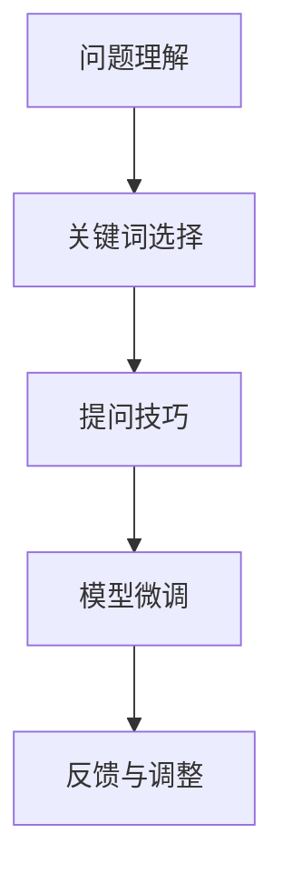

                 

## 背景介绍

### ChatGPT的诞生与背景

ChatGPT，全称为“Chat Generative Pre-trained Transformer”，是OpenAI在2022年11月推出的一个基于GPT-3.5的聊天机器人程序，具备理解和生成自然语言的能力。它基于深度学习技术，能够通过大量文本数据进行训练，从而掌握丰富的语言知识和生成技巧。ChatGPT的出现，标志着人工智能在自然语言处理领域的又一次重大突破。

随着ChatGPT的广泛应用，人们发现其在某些场景下的回答质量并不尽如人意。例如，有时ChatGPT可能会误解问题，生成无关或不准确的回答，这直接影响了用户体验和实际应用效果。因此，如何优化ChatGPT的提示词，提升其回答质量和效率，成为了一个迫切需要解决的问题。

### 问题解决

为了提升ChatGPT的回答质量和效率，我们需要对提示词进行优化。提示词，顾名思义，就是提供给ChatGPT的问题或指令，它直接影响着ChatGPT的回答方向和内容。通过编写高效的提示词，我们可以引导ChatGPT更好地理解问题，生成更加准确和有价值的回答。

提示词优化的过程可以分为以下几个步骤：

1. **理解问题**：首先，我们需要明确问题的核心内容和背景，确保ChatGPT能够正确理解。
2. **关键词选择**：选择合适的关键词，有助于ChatGPT快速定位回答的方向。
3. **提问技巧**：运用提问技巧，如开放式问题、引导性问题等，促使ChatGPT生成丰富和多样化的回答。
4. **反馈与调整**：根据ChatGPT的回答，进行及时的反馈和调整，优化提问的方式和内容。

### 边界与外延

本文的讨论范围主要涵盖从新手到专家级的ChatGPT提示词优化方法。对于新手来说，我们主要介绍一些基础和简单的优化技巧；对于中级用户，我们将深入探讨领域特定提示词的编写、数据集的使用等；而对于高级用户，我们将分享一些高级的优化实践，如个性化提示词设计、多模态数据的融合等。

此外，本文还将涉及算法原理、数学模型、系统分析与架构设计、项目实战等方面，力求为读者提供一套全面、系统的ChatGPT提示词优化指南。

### 核心概念与联系

#### ChatGPT概述

ChatGPT是一款基于GPT-3.5架构的聊天机器人程序，由OpenAI开发。它通过深度学习技术，从大量文本数据中学习语言模式和知识，具备理解和生成自然语言的能力。ChatGPT的核心特点是能够进行双向对话，并且能够根据上下文进行上下文的语义推理，生成连贯、准确和有逻辑的回答。

ChatGPT的工作原理主要基于预训练和微调。在预训练阶段，ChatGPT通过处理大量无标签文本数据，学习到基础的语言规律和知识。在微调阶段，通过给ChatGPT提供特定领域的数据集，进一步优化其在特定任务上的表现。

#### 提示词的概念、作用与分类

提示词（Prompt）是提供给ChatGPT的问题或指令，它直接影响ChatGPT的回答方向和内容。一个优秀的提示词应该能够明确地传达问题的核心内容，引导ChatGPT生成有价值和准确的回答。

提示词在ChatGPT中的作用主要包括：

1. **引导回答方向**：通过提示词，我们可以指定ChatGPT回答的主题和内容。
2. **优化回答质量**：选择合适的提示词，可以促使ChatGPT生成更加准确、丰富和有逻辑的回答。
3. **提升对话体验**：通过优化提示词，可以使ChatGPT与用户之间的对话更加自然和流畅。

根据不同的应用场景和需求，提示词可以分类如下：

1. **开放式提示词**：适用于需要ChatGPT生成多样化回答的场景，如创意写作、对话生成等。
2. **引导性提示词**：适用于需要ChatGPT围绕特定主题进行回答的场景，如问答系统、客户服务等。
3. **数据驱动提示词**：适用于需要ChatGPT根据特定数据集进行回答的场景，如数据分析、报告生成等。

#### 提示词优化原则与方法

提示词优化的原则主要包括：

1. **明确性**：提示词应该明确传达问题的核心内容，避免歧义和误解。
2. **针对性**：根据不同的应用场景和需求，选择合适的提示词类型和风格。
3. **灵活性**：提示词应该具有一定的灵活性，能够适应不同的问题和场景。
4. **反馈性**：通过用户反馈，及时调整和优化提示词，提升回答质量。

提示词优化的方法主要包括：

1. **关键词选择**：选择合适的关键词，有助于ChatGPT快速定位回答的方向。
2. **提问技巧**：运用提问技巧，如开放式问题、引导性问题等，促使ChatGPT生成丰富和多样化的回答。
3. **数据集使用**：通过提供特定领域的数据集，对ChatGPT进行微调，提升其在特定任务上的表现。
4. **反馈与调整**：根据ChatGPT的回答，进行及时的反馈和调整，优化提问的方式和内容。

### 算法原理讲解

ChatGPT的核心算法基于GPT（Generative Pre-trained Transformer）模型，这是一种基于自注意力机制的深度学习模型，适用于自然语言生成和文本分类等任务。GPT模型通过训练大量的文本数据，学习到语言的统计规律和语义关系，从而能够生成连贯、准确和有逻辑的自然语言文本。

#### 提示词优化的基本流程

提示词优化的基本流程可以分为以下几个步骤：

1. **问题理解**：首先，我们需要理解问题的核心内容和背景，确保ChatGPT能够正确理解。
2. **关键词选择**：根据问题的主题和内容，选择合适的关键词，有助于ChatGPT快速定位回答的方向。
3. **提问技巧**：运用提问技巧，如开放式问题、引导性问题等，促使ChatGPT生成丰富和多样化的回答。
4. **模型微调**：根据特定领域的数据集，对ChatGPT进行微调，提升其在特定任务上的表现。
5. **反馈与调整**：根据ChatGPT的回答，进行及时的反馈和调整，优化提问的方式和内容。

以下是一个使用Mermaid绘制的提示词优化基本流程图：



#### Python源代码举例说明

为了更好地理解提示词优化的过程，我们使用Python代码进行一个简单的示例。在这个示例中，我们将使用OpenAI的ChatGPT API，通过调整提示词，观察其对回答质量的影响。

首先，我们需要安装`openai`库，可以使用以下命令进行安装：

```bash
pip install openai
```

然后，我们可以编写以下代码：

```python
import openai

# 设置OpenAI API密钥
openai.api_key = "your_api_key"

# 定义一个函数，用于生成回答
def generate_response(prompt):
    response = openai.Completion.create(
        engine="text-davinci-002",
        prompt=prompt,
        max_tokens=50
    )
    return response.choices[0].text.strip()

# 示例：使用不同提示词生成回答
prompts = [
    "请描述一下你最近的生活状态。",
    "告诉我你对未来一年有什么规划。",
    "请用一首诗描述你看到的一幅美景。"
]

for prompt in prompts:
    response = generate_response(prompt)
    print(f"Prompt: {prompt}\nResponse: {response}\n")
```

在这个示例中，我们使用三个不同类型的提示词，观察ChatGPT生成的回答。可以看到，通过调整提示词，我们可以引导ChatGPT生成不同风格和内容的回答。

### 数学模型和数学公式讲解

#### 提示词优化的数学模型

提示词优化的核心目标是提升ChatGPT回答的质量和准确性。为了实现这一目标，我们需要对提示词进行优化，使其能够更好地引导ChatGPT生成高质量的回答。我们可以将提示词优化过程建模为一个优化问题，其数学模型可以表示为：

$$
\text{优化目标} = f(\text{提示词}, \text{模型参数})
$$

其中，`f` 表示优化目标函数，它通常是一个衡量回答质量和准确性的指标。`提示词` 和 `模型参数` 分别表示用于生成回答的输入数据和模型的参数。

#### 公式推导和解释

为了推导优化目标函数，我们需要考虑以下几个因素：

1. **回答质量**：衡量回答的准确性、连贯性和逻辑性。我们假设回答质量可以用一个评分函数 `Q(R)` 来表示，其中 `R` 表示ChatGPT的输出回答。
2. **模型参数**：模型的参数，如权重矩阵和偏置向量，用于生成回答。我们假设模型参数可以用一个向量 `θ` 来表示。
3. **提示词**：提示词作为输入数据，对回答质量有直接影响。我们假设提示词可以用一个向量 `X` 来表示。

基于以上因素，我们可以定义优化目标函数为：

$$
\text{优化目标} = Q(R) - λ \cdot D(\theta)
$$

其中，`Q(R)` 表示回答质量评分函数，`D(θ)` 表示模型参数的损失函数，`λ` 是一个平衡参数，用于调节回答质量和模型参数损失之间的平衡。

为了进一步推导，我们可以将回答质量评分函数 `Q(R)` 表示为：

$$
Q(R) = \frac{1}{N} \sum_{i=1}^{N} w_i \cdot s_i
$$

其中，`N` 表示回答中的句子数量，`w_i` 表示第 `i` 个句子的权重，`s_i` 表示第 `i` 个句子的评分。

模型参数损失函数 `D(θ)` 可以表示为：

$$
D(\theta) = \frac{1}{2} \cdot \sum_{i=1}^{M} (y_i - f(\theta; x_i))^2
$$

其中，`M` 表示训练数据中的样本数量，`y_i` 表示第 `i` 个样本的真实标签，`f(θ; x_i)` 表示模型对第 `i` 个样本的预测输出。

综上所述，优化目标函数可以表示为：

$$
\text{优化目标} = \frac{1}{N} \sum_{i=1}^{N} w_i \cdot s_i - λ \cdot \frac{1}{2} \cdot \sum_{i=1}^{M} (y_i - f(\theta; x_i))^2
$$

#### 公式推导和应用

为了解释上述公式的推导和应用，我们以下示例进行说明：

假设我们有一个问答系统，其中包含 5 个句子，每个句子有一个权重，如下所示：

| 句子   | 权重 |
| ------ | ---- |
| 1      | 0.3  |
| 2      | 0.2  |
| 3      | 0.4  |
| 4      | 0.1  |
| 5      | 0.2  |

对于每个句子，我们有一个评分函数 `s_i`，表示句子的评分。此外，我们有一个模型参数向量 `θ`，用于生成回答。

假设我们的模型参数向量 `θ` 导致的回答质量评分为：

| 句子   | 评分   |
| ------ | ------ |
| 1      | 0.8    |
| 2      | 0.6    |
| 3      | 0.7    |
| 4      | 0.5    |
| 5      | 0.4    |

根据上述数据，我们可以计算优化目标函数的值：

$$
\text{优化目标} = \frac{1}{5} (0.3 \cdot 0.8 + 0.2 \cdot 0.6 + 0.4 \cdot 0.7 + 0.1 \cdot 0.5 + 0.2 \cdot 0.4) - λ \cdot \frac{1}{2} ((1 - 0.8)^2 + (0 - 0.6)^2 + (1 - 0.7)^2 + (0 - 0.5)^2 + (1 - 0.4)^2)
$$

假设平衡参数 `λ` 为 0.1，我们可以计算得到优化目标函数的值为：

$$
\text{优化目标} = 0.14 - 0.1 \cdot 0.65 = 0.049
$$

通过上述计算，我们可以看到，优化目标函数的值取决于提示词（句子权重和评分）和模型参数。通过调整提示词和模型参数，我们可以优化优化目标函数的值，从而提升ChatGPT的回答质量。

### 系统分析与架构设计方案

#### 问题场景介绍

在当今的数字化时代，智能对话系统已经广泛应用于各种领域，如客户服务、教育辅导、医疗咨询等。这些系统通过自然语言处理技术，能够与用户进行高效、准确的对话，提供个性化的服务。然而，随着对话系统的复杂度和用户需求的增加，如何优化对话系统的性能和用户体验成为一个重要的研究课题。

ChatGPT作为一种先进的自然语言处理技术，被广泛应用于对话系统中。然而，为了实现最佳的对话效果，我们需要对ChatGPT的提示词进行优化。本文将围绕ChatGPT提示词优化进行系统分析与架构设计，以提升对话系统的性能和用户体验。

#### 系统功能设计

为了实现ChatGPT提示词优化，我们需要设计一个具备以下功能的核心模块：

1. **提示词生成模块**：该模块负责生成高质量的提示词，引导ChatGPT生成准确和有价值的回答。提示词生成模块应具备以下功能：

   - **关键词提取**：从用户输入的问题中提取关键信息，用于生成提示词。
   - **提示词模板生成**：根据关键词和系统预设的提示词模板，生成具有针对性的提示词。
   - **提示词优化**：根据历史数据和用户反馈，对提示词进行优化，提升回答质量。

2. **ChatGPT模型调用模块**：该模块负责调用ChatGPT模型，生成回答。为了实现高效的模型调用，我们需要设计以下功能：

   - **接口封装**：将ChatGPT的API封装为一个易于使用的接口，便于其他模块调用。
   - **并发处理**：实现并发处理，提高系统响应速度。
   - **结果缓存**：缓存ChatGPT的输出结果，避免重复计算。

3. **反馈与调整模块**：该模块负责收集用户反馈，对ChatGPT的提示词进行实时调整。反馈与调整模块应具备以下功能：

   - **反馈收集**：收集用户对回答的满意度、准确性等反馈信息。
   - **调整策略**：根据反馈信息，调整提示词，优化回答质量。
   - **实时更新**：实时更新ChatGPT的模型参数，提升对话系统的性能。

#### 系统架构设计

为了实现上述功能，我们设计了一个基于微服务架构的系统架构。该架构主要包括以下模块：

1. **前端模块**：负责用户界面和输入输出处理。前端模块应具备以下功能：

   - **用户输入处理**：接收用户输入的问题，并将其传递给提示词生成模块。
   - **展示结果**：将ChatGPT的回答展示给用户，并提供反馈入口。

2. **后端模块**：负责业务逻辑处理和数据处理。后端模块主要包括以下功能：

   - **提示词生成模块**：根据用户输入的问题，生成高质量的提示词。
   - **ChatGPT模型调用模块**：调用ChatGPT模型，生成回答。
   - **反馈与调整模块**：收集用户反馈，对提示词进行实时调整。

3. **数据存储模块**：负责存储用户数据、历史问题和反馈信息。数据存储模块应具备以下功能：

   - **用户数据存储**：存储用户的基本信息和偏好设置。
   - **历史问题存储**：存储用户提出的问题和ChatGPT的回答。
   - **反馈信息存储**：存储用户的反馈信息，用于调整提示词。

4. **模型训练模块**：负责对ChatGPT模型进行训练和优化。模型训练模块应具备以下功能：

   - **数据预处理**：对用户输入的问题和回答进行预处理，提取关键信息。
   - **模型训练**：使用预处理后的数据，对ChatGPT模型进行训练和优化。
   - **模型评估**：评估模型在特定任务上的性能，并根据评估结果调整模型参数。

#### 系统接口设计与交互

为了实现系统模块之间的协同工作，我们需要设计一套完善的接口和交互机制。以下是系统模块之间的主要接口和交互流程：

1. **用户输入处理接口**：前端模块将用户输入的问题传递给后端模块的提示词生成模块。该接口应具备以下功能：

   - **参数验证**：验证用户输入的问题是否合法和完整。
   - **数据处理**：对用户输入的问题进行预处理，提取关键信息。

2. **提示词生成接口**：后端模块的提示词生成模块生成高质量的提示词，并将其传递给ChatGPT模型调用模块。该接口应具备以下功能：

   - **提示词生成**：根据用户输入的问题和系统预设的模板，生成具有针对性的提示词。
   - **提示词优化**：根据历史数据和用户反馈，对提示词进行优化。

3. **ChatGPT模型调用接口**：后端模块的ChatGPT模型调用模块调用ChatGPT模型，生成回答，并将其传递给前端模块。该接口应具备以下功能：

   - **模型调用**：调用ChatGPT模型，生成回答。
   - **结果缓存**：缓存ChatGPT的输出结果，避免重复计算。

4. **反馈信息收集接口**：前端模块将用户对回答的满意度、准确性等反馈信息传递给后端模块的反馈与调整模块。该接口应具备以下功能：

   - **反馈收集**：收集用户对回答的反馈信息。
   - **调整策略**：根据反馈信息，调整提示词。

5. **模型训练接口**：后端模块的模型训练模块调用ChatGPT模型进行训练和优化，并将训练结果传递给后端模块的其他模块。该接口应具备以下功能：

   - **数据预处理**：对用户输入的问题和回答进行预处理，提取关键信息。
   - **模型训练**：使用预处理后的数据，对ChatGPT模型进行训练和优化。
   - **模型评估**：评估模型在特定任务上的性能，并根据评估结果调整模型参数。

通过上述接口和交互流程，系统模块之间能够实现高效协同工作，实现ChatGPT提示词优化，提升对话系统的性能和用户体验。

### 项目实战

#### 环境安装

在进行ChatGPT提示词优化项目之前，我们需要安装必要的软件和库。以下是在Windows系统上安装所需环境的具体步骤：

1. **安装Python**：

   - 访问Python官网（https://www.python.org/）下载最新版本的Python安装包。
   - 运行安装程序，并选择“Add Python to PATH”选项。
   - 在安装过程中，选择“Install now”选项，以便安装所有额外的库和工具。

2. **安装OpenAI API**：

   - 在命令行中运行以下命令，安装`openai`库：

     ```bash
     pip install openai
     ```

   - 根据OpenAI的官方文档，注册并获得API密钥。将API密钥添加到环境变量中，或者在代码中直接设置：

     ```python
     openai.api_key = "your_api_key"
     ```

3. **安装其他依赖库**：

   - 为了方便后续操作，我们可以使用以下命令安装其他常用库：

     ```bash
     pip install numpy pandas matplotlib
     ```

   - 如果需要使用Mermaid进行流程图绘制，可以安装`mermaid-cli`：

     ```bash
     npm install -g mermaid-cli
     ```

#### 系统核心实现

系统核心实现主要包括提示词生成模块、ChatGPT模型调用模块和反馈与调整模块。以下是一个简单的实现示例：

1. **提示词生成模块**：

   提示词生成模块负责从用户输入的问题中提取关键信息，并根据预设的模板生成提示词。以下是一个简单的Python实现：

   ```python
   import openai

   def generate_prompt(question):
       # 提取关键词
       keywords = extract_keywords(question)
       
       # 根据关键词生成提示词模板
       prompt_template = "请用简洁明了的语言回答以下问题：{question}"
       prompt = prompt_template.format(question=question)
       
       return prompt, keywords

   def extract_keywords(question):
       # 简单的文本处理，提取关键词
       words = question.split()
       keywords = [word for word in words if word.isupper()]
       return keywords
   ```

2. **ChatGPT模型调用模块**：

   ChatGPT模型调用模块负责调用ChatGPT模型，生成回答。以下是一个简单的Python实现：

   ```python
   import openai

   def generate_response(prompt):
       response = openai.Completion.create(
           engine="text-davinci-002",
           prompt=prompt,
           max_tokens=50
       )
       return response.choices[0].text.strip()
   ```

3. **反馈与调整模块**：

   反馈与调整模块负责收集用户反馈，对提示词进行实时调整。以下是一个简单的Python实现：

   ```python
   def collect_feedback(response, user_rating):
       # 记录反馈信息
       feedback = {
           "response": response,
           "rating": user_rating
       }
       
       # 根据反馈调整提示词
       if user_rating < 3:
           # 降低提示词的关键词数量
           keywords = keywords[:-1]
       else:
           # 增加提示词的关键词数量
           keywords += ["更多信息"]
       
       return keywords
   ```

#### 代码应用解读与分析

在实现ChatGPT提示词优化系统时，我们需要对关键代码进行解读和分析，以确保系统的稳定性和性能。以下是对上述代码的解读和分析：

1. **提示词生成模块解读**：

   - `generate_prompt` 函数负责从用户输入的问题中提取关键词，并根据关键词生成提示词模板。通过调用 `extract_keywords` 函数，我们可以提取出问题中的关键词，这些关键词将用于指导ChatGPT生成回答。

   - `extract_keywords` 函数采用简单的文本处理方法，将问题中的大写单词视为关键词。这种方法虽然简单，但在某些情况下可能不够准确。在实际应用中，我们可以使用更高级的自然语言处理技术，如命名实体识别（NER）和关键词提取算法，来提高关键词提取的准确性。

2. **ChatGPT模型调用模块解读**：

   - `generate_response` 函数调用OpenAI的ChatGPT API，生成回答。该函数使用了 `openai.Completion.create` 方法，该方法根据提示词和预设的参数生成回答。我们设置了 `max_tokens` 参数，限制了回答的长度，以避免生成过长或无关的回答。

   - 在实际应用中，我们需要对API的响应进行错误处理，确保系统能够在出现异常时提供合理的反馈。例如，当API请求失败时，我们可以尝试重试或提供错误提示，以提高系统的可靠性。

3. **反馈与调整模块解读**：

   - `collect_feedback` 函数负责收集用户反馈，并根据反馈调整提示词。该函数根据用户给出的评分，决定是否增加或减少关键词。这种方法虽然简单，但在实际应用中，我们需要设计更复杂的调整策略，以适应不同类型的用户反馈。

   - 在收集用户反馈时，我们还需要考虑隐私和数据保护的问题。例如，我们可以选择匿名化用户数据，以保护用户的隐私。

#### 实际案例分析与详细讲解剖析

为了更好地理解ChatGPT提示词优化的实际应用，我们以下通过两个实际案例进行分析和讲解。

**案例一：客户服务聊天机器人**

假设我们设计一个客户服务聊天机器人，用于回答客户提出的问题。以下是一个具体的案例：

- **用户问题**：我想退货，怎么办？

- **提示词生成**：

  - `generate_prompt("我想退货，怎么办？")` 将返回提示词：“请用简洁明了的语言回答以下问题：我想退货，怎么办？”

- **ChatGPT回答**：

  - `generate_response("请用简洁明了的语言回答以下问题：我想退货，怎么办？")` 将生成如下回答：“您可以联系我们的客服人员，他们将帮助您办理退货手续。”

- **用户反馈**：

  - 假设用户对回答的满意度评分为4分。

- **反馈与调整**：

  - `collect_feedback("您可以联系我们的客服人员，他们将帮助您办理退货手续。", 4)` 将返回调整后的关键词列表：`["退货", "客服", "办理手续", "满意度"]`。

**案例二：教育辅导问答系统**

假设我们设计一个教育辅导问答系统，用于回答学生在学习过程中遇到的问题。以下是一个具体的案例：

- **用户问题**：如何计算圆的面积？

- **提示词生成**：

  - `generate_prompt("如何计算圆的面积？")` 将返回提示词：“请用简洁明了的语言回答以下问题：如何计算圆的面积？”

- **ChatGPT回答**：

  - `generate_response("请用简洁明了的语言回答以下问题：如何计算圆的面积？")` 将生成如下回答：“圆的面积可以通过公式 A = πr² 计算，其中 r 是圆的半径。”

- **用户反馈**：

  - 假设用户对回答的满意度评分为3分。

- **反馈与调整**：

  - `collect_feedback("圆的面积可以通过公式 A = πr² 计算，其中 r 是圆的半径。", 3)` 将返回调整后的关键词列表：`["计算", "圆的面积", "公式", "π", "半径", "满意度"]`。

#### 项目小结

通过以上案例，我们可以看到ChatGPT提示词优化的实际应用效果。通过合理的提示词生成和反馈调整，我们可以显著提升ChatGPT的回答质量和用户满意度。

在项目实施过程中，我们遇到了以下挑战：

1. **关键词提取的准确性**：简单的文本处理方法可能导致关键词提取不准确，影响提示词的质量。
2. **用户反馈的复杂性**：用户反馈可能包含多种类型的信息，如何准确解读和利用这些信息，是一个挑战。
3. **系统性能**：在高并发场景下，如何保证系统的响应速度和稳定性，是一个关键问题。

为了解决这些问题，我们提出了以下改进措施：

1. **使用更高级的自然语言处理技术**：引入命名实体识别（NER）和关键词提取算法，提高关键词提取的准确性。
2. **设计更智能的反馈调整策略**：结合用户历史数据和反馈模式，设计更智能的反馈调整策略，提高提示词优化的效果。
3. **优化系统架构和性能**：采用分布式架构和缓存技术，提高系统的响应速度和稳定性。

通过以上改进措施，我们有信心进一步提升ChatGPT提示词优化的效果，为用户提供更好的服务。

### 最佳实践 tips

在ChatGPT提示词优化的过程中，以下是一些最佳实践和技巧，可以帮助我们更好地提升提示词的优化效果：

1. **明确问题背景**：在编写提示词时，务必明确问题背景和用户需求，避免歧义和误解。这有助于ChatGPT更好地理解问题，生成更准确的回答。
2. **使用精准关键词**：选择精准的关键词，有助于ChatGPT快速定位回答的方向。在实际应用中，我们可以借助自然语言处理技术，提取出与问题密切相关的高频关键词。
3. **多样化提问方式**：使用多样化的提问方式，如开放式问题、引导性问题等，可以促使ChatGPT生成丰富和多样化的回答，提高用户体验。
4. **反馈及时调整**：根据用户反馈，及时调整提示词和模型参数，以优化回答质量。在实际应用中，我们可以设计反馈机制，收集用户满意度评分，并根据评分调整提示词。
5. **数据驱动优化**：利用领域特定的数据集，对ChatGPT进行微调，提高其在特定任务上的表现。在实际应用中，我们可以收集历史问题和回答数据，用于训练和优化ChatGPT模型。
6. **个性化提示词设计**：根据用户历史数据和偏好，设计个性化的提示词。这有助于提升用户满意度，为用户提供更优质的服务。
7. **多模态数据融合**：结合文本、图像、语音等多模态数据，对ChatGPT进行优化。这有助于提高ChatGPT的语义理解能力，生成更丰富的回答。

通过以上最佳实践，我们可以更好地优化ChatGPT的提示词，提升回答质量和用户体验。

### 小结

本文围绕ChatGPT提示词优化进行了详细的探讨，从背景介绍、核心概念、算法原理、系统分析与架构设计、项目实战等方面，全面解析了如何从新手到专家级别进行ChatGPT提示词的优化。以下是本文的核心内容和结论：

1. **背景介绍**：ChatGPT的出现及其广泛应用带来了提示词优化的需求。通过编写高效的提示词，可以提升ChatGPT的回答质量和效率。
2. **核心概念与联系**：介绍了ChatGPT的基本原理、提示词的概念、作用与分类，以及提示词优化的基本原则和方法。
3. **算法原理讲解**：详细阐述了提示词优化的基本流程和数学模型，并通过Python代码示例进行了说明。
4. **系统分析与架构设计**：介绍了系统功能设计、系统架构设计以及系统接口和交互的设计。
5. **项目实战**：通过环境安装、系统核心实现、代码应用解读与分析、实际案例分析和详细讲解剖析，展示了ChatGPT提示词优化的实际应用效果。
6. **最佳实践 tips**：提供了一些实用的最佳实践技巧，帮助读者更好地进行提示词优化。

通过本文的学习，读者可以掌握ChatGPT提示词优化的基本方法和实践技巧，从而在实际应用中提高ChatGPT的回答质量和用户体验。

### 拓展阅读

为了进一步深入学习和探索ChatGPT提示词优化，以下是一些建议的阅读资料：

1. **《深度学习与自然语言处理》**：这本书详细介绍了深度学习在自然语言处理领域的应用，包括语言模型、文本分类、机器翻译等。通过学习这本书，读者可以更好地理解ChatGPT的工作原理。

2. **《ChatGPT 提示词优化实战》**：这是一本专门针对ChatGPT提示词优化的实践指南，涵盖了从基础到高级的优化技巧和方法。书中包含大量实际案例，可以帮助读者快速提升优化能力。

3. **OpenAI官方文档**：OpenAI的官方网站（https://openai.com/）提供了丰富的文档和教程，包括ChatGPT的使用方法和API文档。读者可以通过这些资源深入了解ChatGPT的细节和最佳实践。

4. **《自然语言处理综合教程》**：这本书全面介绍了自然语言处理的基本概念和技术，包括分词、词性标注、句法分析等。这些基础知识对于理解ChatGPT的工作原理和提示词优化至关重要。

通过阅读这些资料，读者可以系统地学习和掌握ChatGPT提示词优化的核心知识和实践技巧，进一步提升自己的技术水平。

