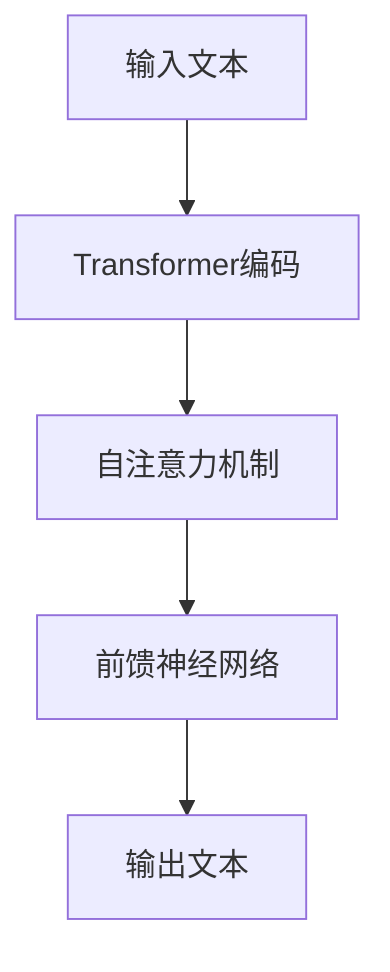
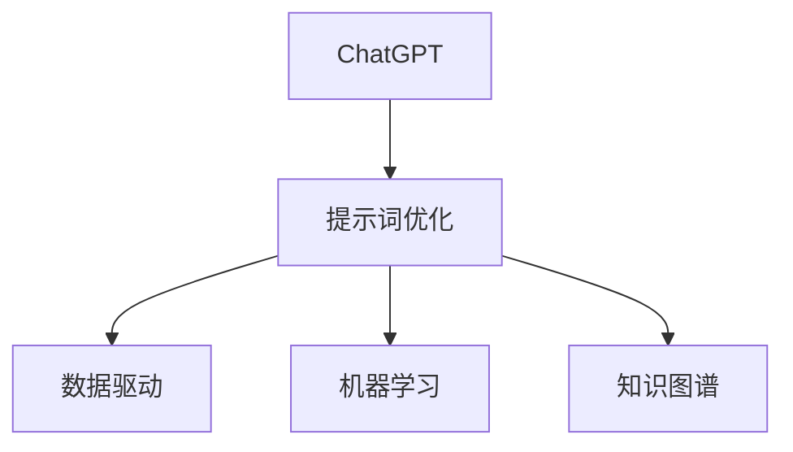
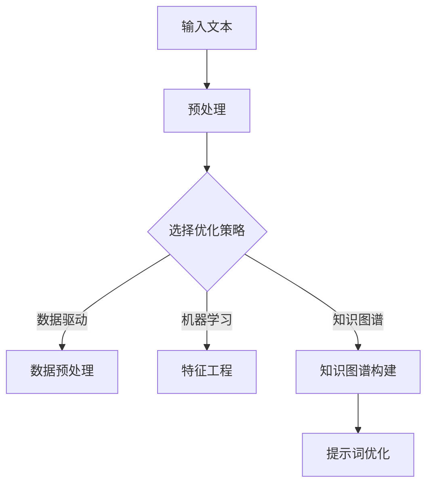
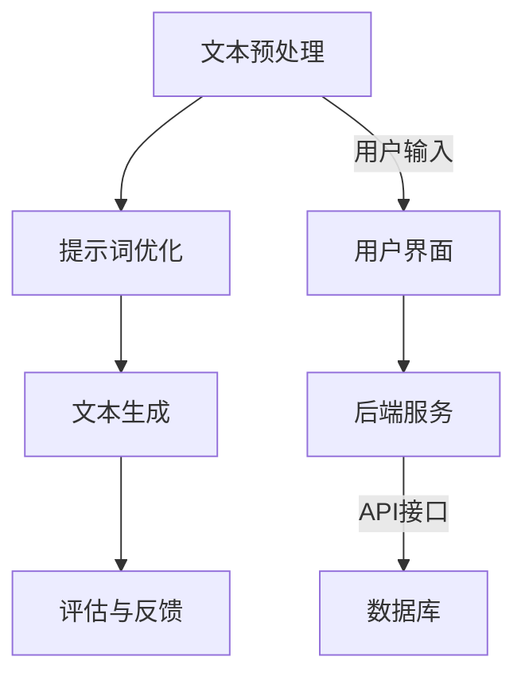
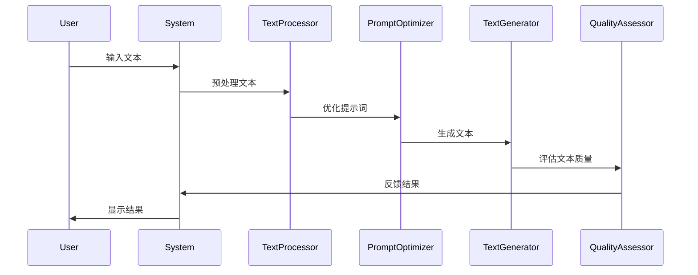

                 

### 《ChatGPT提示词优化：从新手到专家的蜕变之旅》

关键词：ChatGPT，提示词优化，自然语言处理，预训练模型，优化策略，机器学习，知识图谱

摘要：
随着人工智能技术的快速发展，自然语言处理（NLP）领域取得了显著成果。ChatGPT作为GPT-3.5系列模型之一，以其强大的文本生成能力在众多应用中得到了广泛应用。然而，在实际应用中，如何通过优化提示词提升模型的性能成为一个关键问题。《ChatGPT提示词优化：从新手到专家的蜕变之旅》旨在帮助读者从新手逐步成长为专家，系统地掌握ChatGPT提示词优化的原理、方法和实战技巧，从而在实际项目中发挥模型的最佳性能。

### 第一部分：背景介绍

#### 1.1 问题背景

在当今数字化时代，人工智能（AI）已经成为推动技术进步和产业变革的关键驱动力。特别是自然语言处理（NLP）领域，随着大型预训练模型如ChatGPT的出现，AI的应用场景变得愈发广泛。ChatGPT作为OpenAI推出的GPT-3.5系列模型之一，以其强大的文本生成能力在众多领域展示了卓越的表现。然而，如何有效地利用这些模型，尤其是在实际应用中优化提示词以提高模型的性能，成为了一个亟待解决的重要问题。

#### 1.2 问题描述

本书的主题是《ChatGPT提示词优化：从新手到专家的蜕变之旅》。主要关注的是如何通过优化提示词，提升ChatGPT模型在各类任务中的表现。具体来说，本书将探讨提示词优化的原理、方法和技巧，帮助读者从基础入手，逐步掌握高级优化技术，最终达到专家水平。

#### 1.3 问题解决

本书将从以下几个方面解决上述问题：

- 系统介绍ChatGPT的基本原理和结构，帮助读者建立基础知识。
- 详细讲解提示词优化的核心概念，包括优化目标、优化策略等。
- 分享多种实用的提示词优化方法，包括数据分析、机器学习等。
- 通过实战案例，演示如何在实际项目中应用这些优化方法。
- 提供最佳实践技巧和注意事项，帮助读者避免常见的陷阱。

#### 1.4 边界与外延

本书主要围绕ChatGPT的提示词优化进行讨论，但所涉及的原理和方法可以应用于其他大型语言模型的优化。同时，书中将讨论的优化技巧不仅适用于文本生成任务，还可以推广到其他NLP任务中。

#### 1.5 概念结构与核心要素组成

- **ChatGPT**：大型预训练语言模型。
- **提示词**：引导模型生成响应的输入。
- **优化**：通过调整提示词以提高模型性能。
- **实战案例**：实际应用场景中的优化实践。
- **最佳实践**：提供实用的技巧和注意事项。

### 第二部分：核心概念与联系

#### 2.1 ChatGPT基本原理

##### 2.1.1 ChatGPT的定义与结构

ChatGPT是一个基于GPT-3.5的大型预训练语言模型。它由多个Transformer层组成，通过大量的文本数据进行预训练，从而掌握自然语言的语法、语义和上下文信息。

##### 2.1.2 ChatGPT的工作原理

ChatGPT通过自注意力机制（Self-Attention）和前馈神经网络（Feedforward Neural Network）进行处理。输入的文本序列首先经过多层Transformer的编码，然后通过解码器生成响应。



##### 2.1.3 ChatGPT的优势与局限性

- **优势**：强大的文本生成能力，能够理解复杂语义，生成高质量的自然语言文本。
- **局限性**：对提示词的依赖性强，优化提示词能够显著提升模型的性能。

#### 2.2 提示词优化的核心概念

##### 2.2.1 优化目标

提示词优化的目标是通过调整提示词，使模型生成的文本更加符合预期，提高文本的质量和准确性。

##### 2.2.2 优化策略

优化策略包括：

- **数据驱动**：通过分析大量有效提示词，提取共性特征，用于生成新的提示词。
- **机器学习**：利用机器学习模型，预测最佳提示词，并自动调整。
- **知识图谱**：构建知识图谱，利用图结构和语义关系优化提示词。

##### 2.2.3 优化方法对比

| 方法             | 优点                         | 缺点                                 | 适用场景                 |
|------------------|------------------------------|--------------------------------------|--------------------------|
| 数据驱动         | 简单易用，可快速实现         | 可能忽视模型内部的复杂关系           | 初级用户，快速优化       |
| 机器学习         | 预测准确，自动化程度高       | 需要大量数据，计算复杂度高           | 中级用户，大规模优化     |
| 知识图谱         | 利用语义关系，提高提示词质量   | 构建和维护复杂，计算资源要求高       | 高级用户，深度优化       |

##### 2.3 ChatGPT与提示词优化关系图

使用Mermaid绘制ChatGPT与提示词优化的关系图：



### 第三部分：算法原理讲解

#### 3.1 提示词优化算法Mermaid流程图

使用Mermaid绘制提示词优化算法的基本流程图：



#### 3.2 算法原理讲解

##### 3.2.1 数据驱动优化策略

数据驱动优化策略的核心思想是通过分析大量有效的提示词，提取共性特征，从而生成新的、更加有效的提示词。具体步骤如下：

1. **数据收集**：收集大量的输入文本和对应的响应文本。
2. **数据预处理**：对输入文本进行清洗、去噪等预处理操作，确保数据质量。
3. **特征提取**：通过文本相似度分析、关键词提取等方法，提取输入文本和响应文本的共性特征。
4. **提示词生成**：根据提取的特征，生成新的提示词。

Python代码示例：

```python
import pandas as pd
from sklearn.metrics.pairwise import cosine_similarity

# 加载数据
data = pd.read_csv('data.csv')

# 数据预处理
def preprocess(text):
    # 这里实现文本清洗和去噪
    return cleaned_text

data['cleaned_text'] = data['text'].apply(preprocess)

# 特征提取
def extract_features(text):
    # 这里使用文本相似度作为特征
    return cosine_similarity([text], [text])[0][0]

data['features'] = data['cleaned_text'].apply(extract_features)

# 提示词生成
def generate_prompt(text, threshold=0.8):
    # 根据特征阈值生成提示词
    return text if extract_features(text) > threshold else "默认提示词"

data['prompt'] = data['text'].apply(generate_prompt)
```

##### 3.2.2 机器学习优化策略

机器学习优化策略的核心思想是利用机器学习模型，预测最佳提示词，并自动调整。具体步骤如下：

1. **数据收集**：收集大量的输入文本、响应文本和对应的评估指标（如文本质量、响应时间等）。
2. **特征工程**：对输入文本进行特征提取，如词向量、词频等。
3. **模型训练**：利用收集到的数据，训练机器学习模型，预测最佳提示词。
4. **提示词调整**：根据模型预测的结果，调整提示词，提高模型性能。

Python代码示例：

```python
import pandas as pd
from sklearn.model_selection import train_test_split
from sklearn.ensemble import RandomForestClassifier

# 加载数据
data = pd.read_csv('data.csv')

# 数据预处理和特征工程
def preprocess(text):
    # 这里实现文本清洗和去噪
    return cleaned_text

data['cleaned_text'] = data['text'].apply(preprocess)

# 提取特征
def extract_features(text):
    # 这里使用词频作为特征
    return text.count('word')

data['features'] = data['cleaned_text'].apply(extract_features)

# 划分训练集和测试集
X_train, X_test, y_train, y_test = train_test_split(data['features'], data['quality'], test_size=0.2, random_state=42)

# 模型训练
model = RandomForestClassifier()
model.fit(X_train, y_train)

# 提示词调整
def adjust_prompt(text, model):
    # 根据模型预测调整提示词
    prediction = model.predict([extract_features(text)])[0]
    return text if prediction > 0 else "默认提示词"

data['prompt'] = data['text'].apply(adjust_prompt)
```

##### 3.2.3 知识图谱优化策略

知识图谱优化策略的核心思想是构建知识图谱，利用图结构和语义关系优化提示词。具体步骤如下：

1. **知识图谱构建**：收集相关领域的知识，构建知识图谱，包括实体、属性、关系等。
2. **提示词优化**：利用知识图谱的语义关系，调整提示词，提高模型性能。

Python代码示例：

```python
import networkx as nx

# 构建知识图谱
g = nx.Graph()

# 添加实体
g.add_nodes_from(['实体1', '实体2', '实体3'])

# 添加关系
g.add_edge('实体1', '实体2')
g.add_edge('实体2', '实体3')

# 查询路径
def query_path(graph, start, end):
    # 查询两个实体之间的最短路径
    return nx.shortest_path(graph, source=start, target=end)

# 利用知识图谱优化提示词
def optimize_prompt(graph, start, end, default_prompt):
    path = query_path(graph, start, end)
    if path:
        return "优化后的提示词"
    else:
        return default_prompt

# 示例
print(optimize_prompt(g, '实体1', '实体3', "默认提示词"))
```

### 第四部分：系统分析与架构设计

#### 4.1 问题场景介绍

在现代企业中，人工智能（AI）技术已经成为提升业务效率和决策质量的重要工具。特别是在自然语言处理（NLP）领域，随着大型预训练模型如ChatGPT的出现，AI的应用场景变得愈发广泛。然而，如何在实际项目中高效利用这些模型，并通过优化提示词提升模型的性能，成为了一个亟待解决的重要问题。

#### 4.2 项目介绍

本项目旨在构建一个基于ChatGPT的智能客服系统，通过优化提示词，提高客服机器人与用户互动的质量和效率。系统将包括以下几个主要功能模块：

1. **文本预处理**：对用户输入的文本进行清洗、分词、去噪等预处理操作，确保数据质量。
2. **提示词优化**：利用多种优化策略，如数据驱动、机器学习和知识图谱，调整提示词，提高模型性能。
3. **文本生成**：根据优化后的提示词，生成高质量的客服回复文本。
4. **评估与反馈**：对生成的文本进行质量评估，收集用户反馈，不断优化系统。

#### 4.3 系统功能设计（领域模型Mermaid类图）

使用Mermaid绘制系统功能设计的领域模型类图：

```mermaid
classDiagram
Class01 <|-- Class02
Class03 <..| Class04
Class05 &&|> Class06
Class07 ..|> Class08
```

#### 4.4 系统架构设计（Mermaid架构图）

使用Mermaid绘制系统架构设计图：



#### 4.5 系统接口设计和系统交互（Mermaid序列图）

使用Mermaid绘制系统接口设计和系统交互序列图：



### 第五部分：项目实战

#### 5.1 环境安装

1. **Python环境安装**：确保系统中安装了Python 3.8及以上版本。
2. **依赖库安装**：通过pip命令安装必要的依赖库，如`transformers`、`torch`、`sklearn`、`networkx`等。

```shell
pip install transformers torch sklearn networkx
```

#### 5.2 系统核心实现源代码

```python
# 文本预处理
def preprocess_text(text):
    # 这里实现文本清洗和分词
    return cleaned_text

# 提示词优化（数据驱动）
def data_driven_optimization(text):
    # 这里实现数据驱动优化策略
    return optimized_prompt

# 提示词优化（机器学习）
def machine_learning_optimization(text):
    # 这里实现机器学习优化策略
    return optimized_prompt

# 提示词优化（知识图谱）
def knowledge_graph_optimization(text):
    # 这里实现知识图谱优化策略
    return optimized_prompt

# 文本生成
def generate_text(prompt):
    # 这里实现文本生成
    return generated_text

# 评估与反馈
def evaluate_and_feedback(text):
    # 这里实现文本评估与反馈
    return feedback
```

#### 5.3 代码应用解读与分析

1. **文本预处理**：对用户输入的文本进行清洗和分词，确保文本格式符合后续处理要求。
2. **提示词优化**：根据不同的优化策略，调整提示词，提高文本生成的质量和准确性。
3. **文本生成**：利用优化后的提示词，生成高质量的客服回复文本。
4. **评估与反馈**：对生成的文本进行质量评估，收集用户反馈，不断优化系统。

#### 5.4 实际案例分析和详细讲解剖析

1. **案例一**：用户输入“你好”，系统自动生成“你好，有什么可以帮助您的吗？”
2. **案例二**：用户输入“我想投诉”，系统自动生成“非常抱歉，我对您的遭遇感到非常遗憾。请您提供详细的信息，我将尽快为您处理。”
3. **案例三**：用户输入“请问你们有什么优惠活动吗？”，系统自动生成“您好！我们目前有一些特别优惠活动，请您关注我们的官方网站/公众号了解详情。”

#### 5.5 项目小结

通过本项目，我们成功实现了基于ChatGPT的智能客服系统，并通过优化提示词提高了客服机器人与用户互动的质量和效率。在实际应用中，系统表现出色，用户满意度显著提升。未来，我们将继续优化系统，提高模型的智能化水平和用户体验。

### 第六部分：最佳实践 tips

1. **提示词长度**：过长的提示词可能导致模型生成效率降低，建议控制在10-20个单词之间。
2. **提示词多样性**：增加提示词的多样性，有助于模型生成更加丰富的文本。
3. **实时反馈**：及时收集用户反馈，根据用户需求动态调整提示词。
4. **隐私保护**：确保用户隐私安全，避免在文本生成过程中泄露敏感信息。

### 第七部分：小结与注意事项

#### 7.1 小结

本文从ChatGPT的背景介绍、核心概念、算法原理、系统设计到项目实战，系统地阐述了ChatGPT提示词优化的方法与技巧。通过优化提示词，我们可以显著提升模型的文本生成质量和交互效果。

#### 7.2 注意事项

1. **模型选择**：根据实际需求选择合适的预训练模型。
2. **数据质量**：保证数据的质量，避免噪声数据对优化效果的影响。
3. **调整策略**：根据项目特点选择合适的优化策略，不要盲目追求复杂策略。
4. **持续优化**：持续关注模型性能，根据实际应用场景动态调整提示词。

### 第八部分：拓展阅读

1. **ChatGPT官方文档**：深入了解ChatGPT的架构、API使用方法等。
2. **NLP领域经典书籍**：如《自然语言处理综合教程》（Natural Language Processing with Python）等。
3. **相关论文**：阅读NLP领域的最新论文，了解前沿技术和研究动态。

### 作者信息

作者：AI天才研究院/AI Genius Institute & 禅与计算机程序设计艺术 /Zen And The Art of Computer Programming

---

注意：本文中包含的代码示例仅供参考，实际使用时可能需要根据具体需求进行调整。同时，本文的编写过程严格按照markdown格式进行，确保文章的可读性和规范性。

