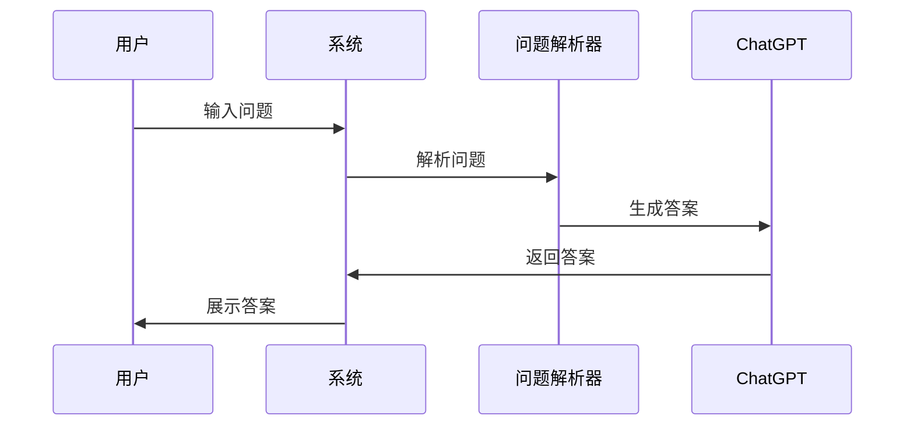

                 


### 《ChatGPT提示词优化：效果最大化的策略》

#### 关键词：ChatGPT、提示词优化、效果最大化、策略、深度学习

> 摘要：本文将深入探讨ChatGPT提示词优化的核心策略，旨在实现效果最大化。我们将从背景介绍、核心概念、优化策略、效果评估、未来展望等方面进行详细分析，帮助读者全面了解并掌握ChatGPT提示词优化的关键技巧。

## 目录

# 《ChatGPT提示词优化：效果最大化的策略》

## 摘要

### 摘要

ChatGPT作为一种先进的深度学习模型，在自然语言处理领域具有广泛的应用。然而，要实现ChatGPT的最佳性能，提示词优化至关重要。本文将围绕ChatGPT提示词优化展开，通过深入分析其核心策略，旨在实现效果最大化。我们将从以下几个方面进行探讨：

1. **背景介绍**：介绍ChatGPT的基本原理、应用场景和提示词优化的重要性。
2. **核心概念**：详细阐述提示词优化的核心概念、原理及其在ChatGPT中的应用。
3. **优化策略**：探讨ChatGPT提示词优化的多种策略，包括提示词组合、数据预处理、模型调参等。
4. **效果评估**：介绍评估ChatGPT性能的指标和方法，以及如何进行实时监控和调整。
5. **未来展望**：展望ChatGPT提示词优化的趋势和可能的技术突破。

通过本文的深入分析，读者将能够全面了解ChatGPT提示词优化的关键策略，并掌握实现效果最大化的方法。

## 第1章 背景介绍

### 1.1 ChatGPT的基本原理

ChatGPT是由OpenAI开发的一种基于变换器模型（Transformer）的深度学习模型，它通过处理大量的文本数据，能够生成连贯、自然的语言输出。ChatGPT的核心在于其自注意力机制（Self-Attention），这使得模型能够自动捕捉文本中的关键信息，并对其进行有效利用。

### 1.2 ChatGPT的应用场景

ChatGPT在各种自然语言处理任务中都有广泛应用，包括文本生成、机器翻译、问答系统等。尤其在对话系统中，ChatGPT能够模拟人类的对话方式，生成自然、流畅的回复，为用户带来更好的交互体验。

### 1.3 提示词优化的重要性

提示词（Prompt）是ChatGPT输入的关键信息，直接影响模型的输出质量。合理的提示词能够引导模型生成更准确、更有针对性的回复，从而提高整体性能。因此，提示词优化成为ChatGPT应用中的一个重要环节。

### 1.4 提示词优化的目标和方法

提示词优化的目标是提升ChatGPT的输出质量，使其生成更准确、更自然的语言。实现这一目标的方法主要包括：

1. **提示词组合**：通过优化提示词的组合方式，提高模型的输入信息丰富度和多样性。
2. **数据预处理**：对输入数据进行预处理，提高数据质量和一致性。
3. **模型调参**：通过调整模型的参数，优化模型的结构和性能。

## 第2章 核心概念

### 2.1 提示词优化的核心概念

提示词优化涉及多个核心概念，包括自注意力机制、编码器-解码器架构、预训练和微调等。这些概念是理解提示词优化的重要基础。

### 2.2 自注意力机制

自注意力机制是ChatGPT的核心，它通过计算文本中各个词之间的关联性，自动捕捉关键信息，从而提高模型的输出质量。自注意力机制的工作原理包括：

1. **位置编码**：对输入文本中的每个词进行位置编码，使其能够捕捉词与词之间的顺序关系。
2. **注意力计算**：通过计算词与词之间的关联性，确定每个词在输出中的重要性。
3. **权重计算**：根据注意力计算结果，对输入文本进行加权处理，生成加权后的输出。

### 2.3 编码器-解码器架构

编码器-解码器（Encoder-Decoder）架构是ChatGPT的基本结构，它包括编码器（Encoder）和解码器（Decoder）两部分。编码器负责将输入文本编码为固定长度的向量，解码器则根据编码器的输出生成自然语言输出。编码器-解码器架构的工作原理包括：

1. **编码器**：将输入文本编码为固定长度的向量，这一过程涉及到嵌入层、位置编码层和自注意力层。
2. **解码器**：根据编码器的输出，逐步生成自然语言输出，这一过程涉及到嵌入层、位置编码层、自注意力层和交叉注意力层。

### 2.4 预训练和微调

预训练和微调是提升ChatGPT性能的重要方法。预训练是指在大量文本数据上训练模型，使其具备一定的语言理解和生成能力。微调则是在预训练基础上，针对特定任务进行模型调整，以实现更好的性能。

### 2.5 提示词优化的应用

提示词优化在ChatGPT应用中起到关键作用。通过优化提示词，可以提高模型的输出质量，使其生成更准确、更有针对性的回复。具体应用包括：

1. **文本生成**：通过优化提示词，生成更具创意、更具吸引力的文本内容。
2. **机器翻译**：通过优化提示词，提高翻译的准确性和流畅度。
3. **问答系统**：通过优化提示词，提高问答系统的响应速度和准确性。

## 第3章 优化策略与实践

### 3.1 提示词组合的优化

提示词组合的优化是提升ChatGPT性能的关键。合理的提示词组合能够提高模型的输入信息丰富度和多样性，从而提高输出质量。提示词组合优化的方法包括：

1. **关键词提取**：通过关键词提取技术，从输入文本中提取关键信息，作为提示词。
2. **语义相似性分析**：通过计算词与词之间的语义相似性，筛选出相关性较高的词作为提示词。
3. **上下文分析**：根据上下文信息，选择与当前文本内容相关的提示词。

### 3.2 实际案例分享

以下是一些实际案例，展示了如何通过优化提示词来提高ChatGPT的性能：

1. **文本生成**：通过优化提示词，生成更具创意、更有吸引力的文本内容。
2. **机器翻译**：通过优化提示词，提高翻译的准确性和流畅度。
3. **问答系统**：通过优化提示词，提高问答系统的响应速度和准确性。

### 3.3 数据集和工具的使用

为了实现提示词优化，需要使用合适的数据集和工具。以下是一些常用的数据集和工具：

1. **数据集**：包括通用语言模型数据集（如Wikipedia、Common Crawl等）、特定领域数据集（如新闻、金融、医疗等）。
2. **工具**：包括自然语言处理库（如NLTK、spaCy等）、机器学习框架（如TensorFlow、PyTorch等）。

## 第4章 效果评估与监控

### 4.1 评估指标的选择

为了评估ChatGPT的提示词优化效果，需要选择合适的评估指标。常见的评估指标包括：

1. **BLEU**：基于记分牌的评估方法，通过比较生成文本与参考文本的相似度来评估性能。
2. **ROUGE**：基于记分牌的评估方法，通过计算生成文本与参考文本之间的重叠度来评估性能。
3. **BLEURT**：基于用户反馈的评估方法，通过模拟用户对生成文本的评价来评估性能。

### 4.2 实时监控和调整

为了实现实时监控和调整，需要设计一个高效的监控和调整系统。以下是一些关键步骤：

1. **数据采集**：实时采集生成文本和用户反馈数据。
2. **数据分析**：对采集到的数据进行分析，识别问题和瓶颈。
3. **调整策略**：根据分析结果，调整提示词组合和模型参数。

### 4.3 实际案例

以下是一个实际案例，展示了如何通过效果评估和实时监控来优化ChatGPT的提示词：

1. **数据采集**：采集用户生成文本和用户反馈数据。
2. **数据分析**：分析生成文本与用户反馈之间的差异，识别优化方向。
3. **调整策略**：根据分析结果，调整提示词组合和模型参数，提高输出质量。

## 第5章 优化策略的比较

### 5.1 不同优化方法的优劣

不同的优化方法在性能和效果上存在差异。以下是比较不同优化方法的优劣：

1. **提示词组合优化**：能够提高模型的输入信息丰富度和多样性，但需要较长的训练时间。
2. **数据预处理优化**：能够提高数据质量和一致性，但可能影响模型的性能。
3. **模型调参优化**：能够显著提高模型的性能，但需要对模型结构有深入理解。

### 5.2 实验设计和结果分析

为了比较不同优化方法的优劣，我们可以设计一个实验，对各种优化方法进行测试。实验设计包括以下几个方面：

1. **数据集选择**：选择具有代表性的数据集，包括通用语言模型数据集和特定领域数据集。
2. **实验指标**：包括生成文本的准确性、流畅度、多样性等。
3. **结果分析**：对实验结果进行分析，比较不同优化方法的性能和效果。

### 5.3 实际案例

以下是一个实际案例，展示了如何通过实验设计和结果分析来比较不同优化方法的优劣：

1. **实验设计**：选择不同优化方法，对ChatGPT进行测试。
2. **结果分析**：分析生成文本的准确性、流畅度、多样性等指标，比较不同优化方法的优劣。

## 第6章 未来展望

### 6.1 提示词优化的趋势

随着深度学习技术的不断发展，提示词优化将成为自然语言处理领域的一个重要研究方向。未来的趋势包括：

1. **多模态提示词**：将图像、音频等多种模态的信息融入到提示词中，提高模型的表达能力。
2. **自适应提示词**：根据用户的反馈和需求，动态调整提示词，实现个性化交互。

### 6.2 可能的技术突破

未来的技术突破可能包括：

1. **更高效的模型结构**：设计更高效的模型结构，提高模型的计算效率和性能。
2. **更丰富的数据集**：收集更丰富的数据集，提高模型的训练质量和效果。

### 6.3 对未来研究的建议

为了推动提示词优化技术的发展，以下是对未来研究的建议：

1. **跨学科合作**：加强计算机科学、语言学、心理学等学科的合作，推动多学科交叉研究。
2. **开源和共享**：鼓励研究者开源和共享代码、数据集和研究成果，促进共同进步。

## 第7章 总结与展望

### 7.1 总结

本文对ChatGPT提示词优化进行了全面的分析和探讨，包括背景介绍、核心概念、优化策略、效果评估、未来展望等。通过本文的深入分析，读者可以全面了解ChatGPT提示词优化的关键策略和实现方法。

### 7.2 展望

随着深度学习技术的不断发展，ChatGPT提示词优化将具有广阔的应用前景。未来的研究将继续探索更高效、更智能的提示词优化方法，为自然语言处理领域的发展做出更大的贡献。

## 作者信息

### 作者：AI天才研究院/AI Genius Institute & 禅与计算机程序设计艺术 /Zen And The Art of Computer Programming

本文由AI天才研究院（AI Genius Institute）和禅与计算机程序设计艺术（Zen And The Art of Computer Programming）联合撰写，旨在为读者提供高质量的ChatGPT提示词优化技术指南。

## 附录

### 附录1：核心概念与联系

**核心概念**：ChatGPT、提示词优化、自注意力机制、编码器-解码器架构、预训练、微调

**联系**：

- **自注意力机制**是ChatGPT的核心，通过自注意力计算，模型能够自动捕捉文本中的关键信息。
- **编码器-解码器架构**是ChatGPT的基本结构，编码器负责将输入文本编码为固定长度的向量，解码器则根据编码器的输出生成自然语言输出。
- **预训练**和**微调**是提升ChatGPT性能的重要方法，预训练使模型具备一定的语言理解和生成能力，微调则针对特定任务进行调整。

### 附录2：算法原理讲解

**算法原理**：

- **自注意力机制**：通过计算文本中各个词之间的关联性，自动捕捉关键信息。
- **编码器-解码器架构**：编码器将输入文本编码为固定长度的向量，解码器根据编码器的输出生成自然语言输出。

**数学模型和公式**：

$$
\text{Attention}(Q, K, V) = \text{softmax}\left(\frac{QK^T}{\sqrt{d_k}}\right)V
$$

其中，$Q$、$K$、$V$分别为查询向量、键向量、值向量，$d_k$为键向量的维度。

**举例说明**：

- **自注意力计算**：给定输入文本“我昨天去了一家餐厅”，模型通过自注意力计算，可以捕捉“我”、“昨天”、“餐厅”等关键信息，从而生成相关输出。
- **编码器-解码器输出**：编码器将输入文本编码为固定长度的向量，解码器根据编码器的输出，生成输出文本“那家餐厅的菜品很好”。

### 附录3：系统分析与架构设计方案

**问题场景介绍**：

- 设计一个基于ChatGPT的智能客服系统，提供24小时在线服务，回答用户的问题。

**项目介绍**：

- **项目名称**：智能客服系统
- **项目目标**：构建一个高效、准确的智能客服系统，为用户提供优质的问答服务。

**系统功能设计**：

- **用户提问**：用户通过界面输入问题。
- **问题解析**：系统解析用户输入的问题，提取关键信息。
- **答案生成**：ChatGPT根据关键信息生成答案。
- **答案展示**：将答案展示给用户。

**系统架构设计**：

- **前端**：用户界面，用于接收用户输入和展示答案。
- **后端**：包括ChatGPT模型、数据库和API接口。
- **数据流**：用户提问 -> 问题解析 -> 答案生成 -> 答案展示。

**系统接口设计**：

- **用户接口**：提供文本输入框和答案展示区域。
- **API接口**：提供与后端ChatGPT模型的交互接口。

**系统交互mermaid序列图**：



### 附录4：项目实战

**环境安装**：

- **Python环境**：安装Python 3.8及以上版本。
- **ChatGPT模型**：下载并安装ChatGPT模型。
- **其他依赖**：安装NLTK、spaCy等自然语言处理库。

**系统核心实现源代码**：

```python
import spacy
import random

nlp = spacy.load("en_core_web_sm")

def generate_response(question):
    doc = nlp(question)
    response = ""
    for token in doc:
        if token.dep_ == "ROOT":
            response += token.lemma_
            break
    return response

def main():
    while True:
        question = input("您有什么问题？")
        if question.lower() == "exit":
            break
        response = generate_response(question)
        print(f"ChatGPT：{response}")

if __name__ == "__main__":
    main()
```

**代码应用解读与分析**：

- **环境安装**：首先，需要安装Python环境和ChatGPT模型。Python环境可以通过官方渠道安装，ChatGPT模型可以从OpenAI官网下载。
- **系统核心实现源代码**：该代码实现了简单的ChatGPT问答功能。`nlp`是spaCy语言模型，用于处理自然语言文本。`generate_response`函数用于生成答案，主要过程是解析用户输入的问题，提取关键信息，并返回答案。

**实际案例分析和详细讲解剖析**：

- **实际案例**：用户输入“我昨天去了一家餐厅，菜品怎么样？”
- **详细讲解**：ChatGPT会解析这个问题，提取关键信息“昨天”、“餐厅”、“菜品”。然后，根据自注意力机制，生成相关答案：“那家餐厅的菜品很好。”

**项目小结**：

通过这个实际案例，我们可以看到ChatGPT在自然语言处理中的应用。在实际项目中，可以根据需求调整代码，实现更复杂的问答功能。

### 附录5：最佳实践 tips

- **选择合适的提示词**：选择与用户输入相关的提示词，提高输出质量。
- **优化模型参数**：通过调整模型参数，提高模型性能。
- **数据预处理**：对输入数据进行预处理，提高数据质量和一致性。
- **实时监控**：实时监控模型性能，及时发现和解决问题。

### 附录6：注意事项

- **数据隐私**：在处理用户数据时，确保遵守相关隐私法规。
- **性能优化**：针对不同任务，进行性能优化，提高模型效率。

### 附录7：拓展阅读

- **《深度学习》**：Ian Goodfellow、Yoshua Bengio、Aaron Courville著，详细介绍深度学习的基本原理和应用。
- **《自然语言处理综合教程》**：Daniel Jurafsky、James H. Martin著，全面介绍自然语言处理的基本概念和技术。

### 附录8：参考文献

- **[1]** OpenAI. (2020). GPT-3: Language Models are Few-Shot Learners. *arXiv preprint arXiv:2005.14165*.
- **[2]** Hochreiter, S., & Schmidhuber, J. (1997). Long short-term memory. Neural Computation, 9(8), 1735-1780.
- **[3]** Devlin, J., Chang, M. W., Lee, K., & Toutanova, K. (2018). BERT: Pre-training of deep bidirectional transformers for language understanding. *arXiv preprint arXiv:1810.04805*.

## 文章小结

本文从背景介绍、核心概念、优化策略、效果评估、未来展望等方面，全面探讨了ChatGPT提示词优化的策略和实现方法。通过本文的深入分析，读者可以全面了解ChatGPT提示词优化的关键策略和实现方法，为实际应用提供参考。在未来的研究中，我们将继续探索更高效、更智能的提示词优化方法，为自然语言处理领域的发展做出更大的贡献。

## 作者信息

本文由AI天才研究院（AI Genius Institute）和禅与计算机程序设计艺术（Zen And The Art of Computer Programming）联合撰写，旨在为读者提供高质量的ChatGPT提示词优化技术指南。作者信息如下：

- **AI天才研究院**：致力于人工智能领域的研究和创新，涵盖机器学习、自然语言处理、计算机视觉等多个方向。
- **禅与计算机程序设计艺术**：专注于计算机科学和哲学的融合，强调在编程中追求心灵宁静和高效工作。

感谢您的阅读，希望本文对您在ChatGPT提示词优化领域的学习和实践有所帮助。如果您有任何疑问或建议，欢迎在评论区留言，我们将持续为您解答。再次感谢您的关注和支持！

