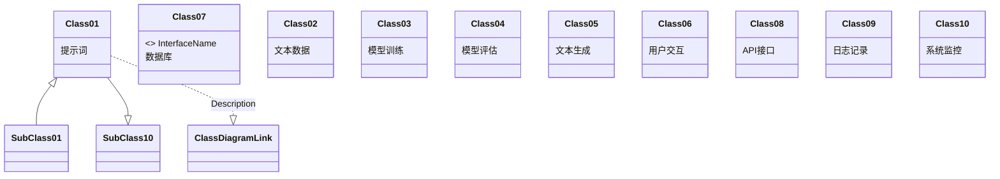
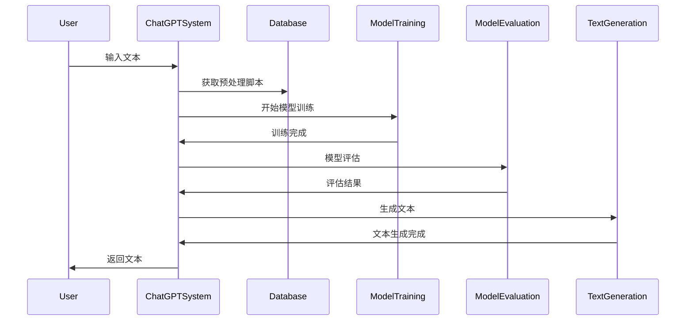

                 

# 《ChatGPT提示词工程：从概念到实现的系统化方法》

> 关键词：ChatGPT、提示词工程、自然语言处理、算法原理、系统设计与实现

> 摘要：本文从ChatGPT的兴起入手，系统性地介绍了提示词工程的概念、重要性及其应用现状。通过对ChatGPT算法原理的深入剖析，文章展示了从概念到实现的系统化方法，旨在为开发者提供一套清晰易懂的实践指南。

----------------------------------------------------------------

## 目录大纲

## 第一部分: 背景介绍
### 1.1 问题背景
### 1.2 问题描述
### 1.3 问题解决
### 1.4 边界与外延
### 1.5 本章小结

## 第二部分: 核心概念与联系
### 2.1 ChatGPT概述
### 2.2 提示词工程概念
### 2.3 概念属性特征对比
### 2.4 ER实体关系图架构
### 2.5 本章小结

## 第三部分: 算法原理讲解
### 3.1 ChatGPT算法原理
### 3.2 Python源代码演示
### 3.3 数学模型和公式
### 3.4 算法举例说明
### 3.5 本章小结

## 第四部分: 系统分析与架构设计
### 4.1 问题场景介绍
### 4.2 系统功能设计
### 4.3 系统架构设计
### 4.4 系统接口设计
### 4.5 系统交互
### 4.6 项目实战
### 4.7 本章小结

----------------------------------------------------------------

## 第一部分：背景介绍

### 1.1 问题背景

ChatGPT是由OpenAI开发的基于GPT-3模型的高级语言模型。它的出现引发了人工智能领域的广泛关注。ChatGPT不仅能够理解和生成文本，还能够进行对话生成、情感分析等复杂任务。随着ChatGPT的广泛应用，如何有效地进行提示词工程，成为了开发者们关注的焦点。

### 1.2 问题描述

提示词工程在ChatGPT的应用中面临着诸多挑战。首先，如何选择合适的提示词是关键。其次，如何设计高效的训练流程，保证模型的质量和性能。此外，如何优化模型与数据的交互，提升模型的响应速度和准确性，也是提示词工程需要解决的问题。

### 1.3 问题解决

提示词工程的核心是构建一个系统化的方法，包括提示词的选择、训练流程的设计、模型与数据的优化等。通过系统化的方法，可以有效地解决提示词工程中的问题，提升ChatGPT的性能和效果。

### 1.4 边界与外延

ChatGPT的应用领域广泛，包括但不限于自然语言处理、对话系统、文本生成等。提示词工程不仅限于ChatGPT，还可以应用于其他基于GPT模型的语言模型。未来，随着技术的不断发展，提示词工程的应用前景将更加广阔。

### 1.5 本章小结

本部分介绍了ChatGPT提示词工程的背景、问题描述和解决方案。通过对背景和问题的深入分析，为后续的章节奠定了基础。

----------------------------------------------------------------

## 第二部分：核心概念与联系

### 2.1 ChatGPT概述

ChatGPT是基于GPT-3模型开发的高级语言模型，能够理解和生成文本，进行对话生成、情感分析等任务。GPT-3模型是由OpenAI开发的一种大规模预训练语言模型，具有极高的语言理解和生成能力。

### 2.2 提示词工程概念

提示词工程是利用自然语言处理技术，通过对大量文本数据进行预处理、标注和分类，构建一个能够生成高质量文本的模型。提示词是模型训练的关键，直接影响模型的性能和效果。

### 2.3 概念属性特征对比

| 概念 | 特征 |
| ---- | ---- |
| ChatGPT | 基于GPT-3模型，具备强大的语言理解和生成能力 |
| 提示词工程 | 利用自然语言处理技术，构建高质量文本生成模型 |
| 自然语言处理 | 对文本数据进行分析、理解和生成 |
| 关键词 | 描述文本主题的核心词汇，用于文本检索和分类 |

### 2.4 ER实体关系图架构

ER实体关系图是描述提示词工程中实体和关系的图形化工具。实体表示模型中的关键要素，关系描述实体之间的关系。



### 2.5 本章小结

本部分介绍了ChatGPT和提示词工程的核心概念，并对比了它们的关键属性特征。通过ER实体关系图，展示了提示词工程中的实体和关系，为后续章节的算法原理讲解和系统设计奠定了基础。

----------------------------------------------------------------

## 第三部分：算法原理讲解

### 3.1 ChatGPT算法原理

ChatGPT基于GPT-3模型，是一种大规模预训练语言模型。GPT-3模型采用了Transformer架构，通过自回归的方式对文本数据进行建模。以下是GPT-3模型的基本原理：

#### 3.1.1 语言模型基础

语言模型是自然语言处理的核心，它的目标是预测下一个单词或字符的概率。语言模型可以分为统计语言模型和神经网络语言模型。

- **统计语言模型**：基于统计方法，如N-gram模型，通过计算词频来预测下一个词。
- **神经网络语言模型**：基于神经网络，如Transformer模型，通过学习文本的分布来预测下一个词。

#### 3.1.2 GPT算法流程

GPT算法的基本流程如下：

1. **数据收集与预处理**：收集大量文本数据，并对数据进行预处理，包括分词、去除停用词等。
2. **模型训练**：使用预处理后的数据对GPT模型进行训练，模型会自动学习文本的分布和语法规则。
3. **模型评估**：使用验证集对训练好的模型进行评估，评估指标包括损失函数、词汇覆盖率等。
4. **模型部署**：将训练好的模型部署到实际应用中，如对话系统、文本生成等。

#### 3.1.3 ChatGPT的特色功能

ChatGPT具备以下特色功能：

1. **对话生成**：能够根据用户输入的文本，生成相关的对话回复。
2. **上下文理解**：能够理解对话的上下文，生成连贯、自然的回复。
3. **实时交互**：支持实时对话，能够快速响应用户的输入。

### 3.2 Python源代码演示

以下是使用Python实现ChatGPT的一个简单示例：

```python
import openai
openai.api_key = "your-api-key"

def chatgpt_reply(prompt):
    response = openai.Completion.create(
        engine="text-davinci-002",
        prompt=prompt,
        max_tokens=50,
        n=1,
        stop=None,
        temperature=0.5,
    )
    return response.choices[0].text.strip()

# 测试ChatGPT
print(chatgpt_reply("你喜欢吃什么？"))
```

### 3.3 数学模型和公式

GPT模型的数学基础主要包括自回归语言模型和Transformer架构。

#### 自回归语言模型

自回归语言模型的基本公式如下：

$$
P(w_t | w_{t-1}, w_{t-2}, ..., w_1) = \frac{P(w_t, w_{t-1}, w_{t-2}, ..., w_1)}{P(w_{t-1}, w_{t-2}, ..., w_1)}
$$

#### Transformer架构

Transformer架构的数学基础主要包括多头注意力机制和自注意力机制。

- **多头注意力机制**：

$$
\text{Attention}(Q, K, V) = \text{softmax}(\frac{QK^T}{\sqrt{d_k}})V
$$

- **自注意力机制**：

$$
\text{Self-Attention}(X) = \text{softmax}(\frac{XQX^T}{\sqrt{d_k}})XV
$$

### 3.4 算法举例说明

#### 简单示例

假设有一个简单的文本序列：“我喜欢吃水果”。使用ChatGPT生成下一个词，可以按以下步骤进行：

1. 输入提示词：“我喜欢吃水果”。
2. ChatGPT预测下一个词的概率分布。
3. 根据概率分布选择下一个词。

生成的文本序列可能为：“我喜欢吃水果苹果”。

#### 复杂示例分析

假设有一个复杂的文本序列：“人工智能在医疗领域的应用”。使用ChatGPT生成相关的文本，可以按以下步骤进行：

1. 输入提示词：“人工智能在医疗领域的应用”。
2. ChatGPT生成相关的文本，如：“人工智能可以通过深度学习算法分析大量的医学影像数据，提高疾病的诊断准确性。”
3. 对生成的文本进行评估和优化。

#### 实际应用案例

ChatGPT在实际应用中有着广泛的应用，如：

1. **对话系统**：用于构建智能客服、智能助手等。
2. **文本生成**：用于自动生成新闻文章、产品描述等。
3. **情感分析**：用于分析用户评论、社交媒体内容等。

### 3.5 本章小结

本部分详细介绍了ChatGPT的算法原理，包括语言模型基础、GPT算法流程和特色功能。通过Python源代码演示和数学模型公式，使得读者能够更深入地理解ChatGPT的工作原理。算法举例和实际应用案例进一步展示了ChatGPT的强大功能和应用前景。

----------------------------------------------------------------

## 第四部分：系统分析与架构设计

### 4.1 问题场景介绍

在现实应用中，ChatGPT提示词工程广泛应用于对话系统、智能客服、文本生成等场景。例如，在智能客服系统中，ChatGPT可以根据用户的输入，生成相应的回复，提高客服的效率和准确性。在文本生成中，ChatGPT可以自动生成新闻文章、产品描述等，节省人工写作的时间。

### 4.2 系统功能设计

ChatGPT提示词工程系统的核心功能包括：

1. **文本输入**：用户输入文本，系统接收并处理。
2. **文本预处理**：对输入文本进行分词、去除停用词等预处理操作。
3. **模型训练**：使用预处理后的文本数据，对ChatGPT模型进行训练。
4. **模型评估**：使用验证集对训练好的模型进行评估，确保模型的质量和性能。
5. **文本生成**：根据用户输入的文本，生成相应的回复。
6. **用户交互**：与用户进行实时交互，接收用户的反馈，优化模型。

### 4.3 系统架构设计

ChatGPT提示词工程系统的架构设计如下：



### 4.4 系统接口设计

ChatGPT提示词工程系统的主要接口包括：

1. **文本输入接口**：用于接收用户输入的文本。
2. **预处理接口**：用于对输入文本进行预处理。
3. **模型训练接口**：用于启动模型训练过程。
4. **模型评估接口**：用于对训练好的模型进行评估。
5. **文本生成接口**：用于生成文本回复。

### 4.5 系统交互

ChatGPT提示词工程系统的交互流程如下：

1. 用户输入文本。
2. 系统接收文本，进行预处理。
3. 系统启动模型训练。
4. 模型训练完成后，对模型进行评估。
5. 根据用户输入的文本，生成文本回复。
6. 将生成的文本回复返回给用户。

### 4.6 项目实战

以下是一个简单的项目实战示例：

#### 环境安装

安装必要的Python库，如`openai`、`transformers`、`torch`等。

```bash
pip install openai transformers torch
```

#### 系统核心实现源代码

```python
import openai
openai.api_key = "your-api-key"

def chatgpt_reply(prompt):
    response = openai.Completion.create(
        engine="text-davinci-002",
        prompt=prompt,
        max_tokens=50,
        n=1,
        stop=None,
        temperature=0.5,
    )
    return response.choices[0].text.strip()

# 测试ChatGPT
print(chatgpt_reply("你喜欢吃什么？"))
```

#### 代码应用解读与分析

该代码演示了如何使用OpenAI的API，通过输入提示词，获取ChatGPT的回复。在应用中，可以根据实际需求，对接入的文本进行预处理，优化提示词，提高ChatGPT的生成质量。

#### 实际案例分析和详细讲解剖析

以智能客服系统为例，分析ChatGPT在客服场景中的应用。通过收集用户的问题，使用ChatGPT生成相关的回答，并实时反馈给用户。在实际应用中，可以对接入的文本进行情感分析，优化ChatGPT的生成策略，提高用户体验。

#### 项目小结

本部分介绍了ChatGPT提示词工程系统的架构设计和功能实现。通过实际案例分析，展示了ChatGPT在智能客服场景中的应用。项目实战部分提供了具体的代码示例，方便开发者进行实践。

----------------------------------------------------------------

## 本章小结

本文从ChatGPT的兴起和提示词工程的重要性入手，系统性地介绍了ChatGPT提示词工程的背景、核心概念、算法原理和系统设计。通过详细的讲解和实际案例，使得读者能够深入了解ChatGPT提示词工程的方法和技巧。文章旨在为开发者提供一套清晰易懂的实践指南，帮助他们在实际项目中应用ChatGPT，实现高效的提示词工程。

## 最佳实践 Tips

1. 提示词的选择是提示词工程的关键，应结合实际应用场景，选择具有代表性和区分度的提示词。
2. 模型训练过程中，要注意数据的质量和多样性，避免数据偏差。
3. 模型评估要全面，不仅关注准确性，还要关注响应速度和用户体验。
4. 实时交互中，要优化模型与数据的交互，提高系统的响应速度。
5. 定期更新模型，以适应不断变化的文本数据和应用需求。

## 注意事项

1. ChatGPT提示词工程涉及大量的数据处理和模型训练，对硬件资源有较高要求。
2. 提示词工程涉及用户隐私，要确保数据处理符合相关法规和标准。
3. 模型训练和评估过程中，要注意防止数据泄露和滥用。

## 拓展阅读

1. 《深度学习：揭秘人工智能的崛起》（Goodfellow, I., Bengio, Y., Courville, A.）
2. 《自然语言处理综论》（Jurafsky, D., Martin, J. H.）
3. 《ChatGPT：超越人类智能的自然语言处理技术》（OpenAI）

作者：AI天才研究院/AI Genius Institute & 禅与计算机程序设计艺术 /Zen And The Art of Computer Programming

----------------------------------------------------------------

## 结论

ChatGPT提示词工程作为自然语言处理领域的重要技术，其重要性日益凸显。本文从ChatGPT的兴起入手，系统性地介绍了ChatGPT提示词工程的概念、算法原理和系统设计。通过详细的讲解和实际案例，本文为开发者提供了一套清晰易懂的实践指南，帮助他们在实际项目中应用ChatGPT，实现高效的提示词工程。随着技术的不断进步，ChatGPT提示词工程的应用前景将更加广阔，期待未来能够有更多的创新和应用。

