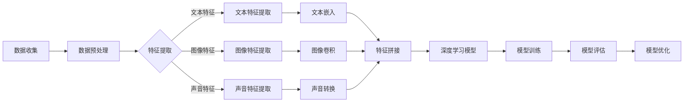
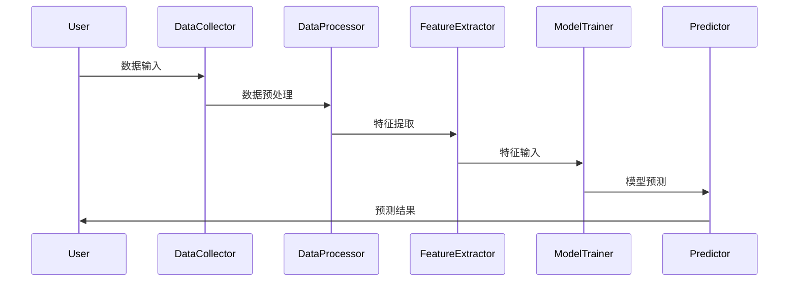
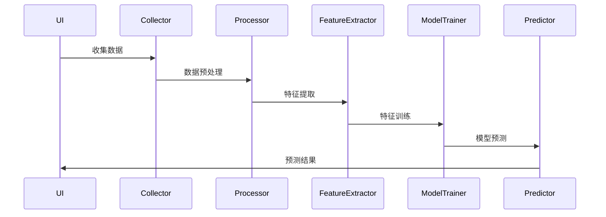

                 


## 《ChatGPT提示词工程：处理多模态情感分析》

### 关键词
- ChatGPT
- 提示词工程
- 多模态情感分析
- 情感分析算法
- 深度学习模型
- 系统架构设计
- 实战案例

### 摘要
本文将深入探讨ChatGPT在处理多模态情感分析中的应用，从背景介绍、核心概念与联系、算法原理讲解、系统分析与架构设计、项目实战等多个角度，全面解析如何利用ChatGPT进行高效的提示词工程，实现对多模态数据的情感分析。通过本文的学习，读者将能够理解多模态情感分析的基本原理，掌握ChatGPT提示词工程的实战技巧，并能够将所学知识应用于实际项目中。

## 目录大纲设计思路

### 1. 初始需求分析
在设计目录大纲之前，我们需要明确《ChatGPT提示词工程：处理多模态情感分析》的核心内容和目的。本书旨在帮助读者掌握利用ChatGPT进行多模态情感分析的方法，包括基本概念、算法原理、系统架构和实际应用。因此，目录大纲的设计应围绕这些核心内容展开。

### 2. 确定核心章节
根据本书的目的，我们确定以下核心章节：
- **第1章 背景介绍**
- **第2章 核心概念与联系**
- **第3章 算法原理讲解**
- **第4章 系统分析与架构设计方案**
- **第5章 项目实战**
- **第6章 最佳实践与拓展**

### 3. 确定章节标题
每个章节的标题应简洁明确，概括该章节的主要内容。例如：
- 第1章 背景介绍
- 第2章 核心概念与联系
- 第3章 算法原理讲解
- 第4章 系统分析与架构设计方案
- 第5章 项目实战
- 第6章 最佳实践与拓展

### 4. 确定章节内部结构
在确定章节标题后，我们需要细化每个章节的内容。以下是每个章节的内部结构：

#### 第1章 背景介绍
- **1.1 核心概念术语说明**
- **1.2 问题背景**
- **1.3 问题描述**
- **1.4 问题解决**
- **1.5 边界与外延**
- **1.6 概念结构与核心要素组成**

#### 第2章 核心概念与联系
- **2.1 ChatGPT介绍**
- **2.2 提示词工程原理**
- **2.3 多模态情感分析原理**
- **2.4 核心概念属性特征对比表格**
- **2.5 ER实体关系图架构**

#### 第3章 算法原理讲解
- **3.1 多模态情感分析算法原理**
- **3.2 算法mermaid流程图**
- **3.3 Python源代码与算法实现**
- **3.4 数学模型和公式解释**
- **3.5 算法举例说明**

#### 第4章 系统分析与架构设计方案
- **4.1 问题场景介绍**
- **4.2 项目介绍**
- **4.3 领域模型mermaid类图**
- **4.4 系统架构设计mermaid架构图**
- **4.5 系统接口设计和系统交互mermaid序列图**

#### 第5章 项目实战
- **5.1 环境安装**
- **5.2 系统核心实现源代码**
- **5.3 代码应用解读与分析**
- **5.4 实际案例分析和详细讲解剖析**
- **5.5 项目小结**

#### 第6章 最佳实践与拓展
- **6.1 最佳实践tips**
- **6.2 小结**
- **6.3 注意事项**
- **6.4 拓展阅读**

### 5. 确保内容完整性
每个章节的内容需要确保完整性，包括必要的数学模型和公式、算法流程图、系统架构图等。每个小节的内容也要具体详细，以便读者能够深入理解。

### 6. 总结与展望
在目录大纲的最后，我们需要包括一个总结章节，回顾全书的主要内容和结论，并提供拓展阅读和进一步学习资源。

通过以上步骤，我们可以设计出一个详细、逻辑清晰的《ChatGPT提示词工程：处理多模态情感分析》目录大纲，确保书的内容既全面又易于理解。接下来，我们将逐章详细展开内容，逐步深入分析ChatGPT在多模态情感分析中的应用和实践。

---

## 第1章 背景介绍

### 1.1 核心概念术语说明
在深入探讨ChatGPT提示词工程与多模态情感分析之前，我们需要明确几个核心概念术语。以下是对这些术语的简要说明：

- **ChatGPT**：基于GPT（Generative Pre-trained Transformer）模型的人工智能助手，能够通过学习大量文本数据生成高质量的自然语言文本。
- **提示词工程**：提示词工程是一种基于AI的技术，用于优化和改进AI模型的输入数据，以提高模型在特定任务上的性能。
- **多模态情感分析**：多模态情感分析是指同时处理多种类型的数据（如文本、图像、声音等），以识别和提取情感信息。

### 1.2 问题背景
随着互联网和社交媒体的普及，人们对情感分析的需求日益增长。情感分析技术能够帮助我们了解用户对产品、服务或事件的情感倾向，从而为商业决策、市场营销、用户服务等领域提供有力支持。

然而，传统的情感分析方法主要依赖于单一模态的数据，如文本情感分析。这种方法在处理复杂情感时往往不够准确。为了提高情感分析的准确性，研究人员开始探索多模态情感分析。

### 1.3 问题描述
多模态情感分析的目标是同时处理多种类型的数据，以更准确地识别和提取情感信息。然而，这一过程面临着诸多挑战：

- **数据融合**：如何将不同模态的数据（如文本、图像、声音）有效地融合，以提供更丰富的情感信息？
- **模型选择**：选择合适的深度学习模型来处理多模态数据，以确保情感分析的高效性和准确性。
- **数据标注**：如何对大量多模态数据标注情感标签，以训练和优化情感分析模型？

### 1.4 问题解决
ChatGPT的出现为解决上述问题提供了新的思路。ChatGPT作为一种先进的自然语言处理技术，能够在处理多模态情感分析任务时发挥重要作用。

- **提示词优化**：通过提示词工程，我们可以优化ChatGPT的输入数据，提高其在情感分析任务上的性能。
- **数据融合**：ChatGPT能够处理多种类型的数据，如文本、图像和声音，从而实现多模态数据的融合。
- **模型选择与优化**：ChatGPT的预训练模型已经经过了大规模数据的训练，能够在多种任务上表现出色。

### 1.5 边界与外延
多模态情感分析不仅局限于情感倾向的识别，还可以应用于其他领域，如情感分类、情感强度评估、情感变化分析等。此外，随着技术的进步，多模态情感分析的应用范围将进一步扩大，如智能客服、智能广告、智能医疗等。

### 1.6 概念结构与核心要素组成
多模态情感分析的概念结构主要包括以下核心要素：

- **数据源**：文本、图像、声音等多种类型的数据。
- **数据预处理**：包括数据清洗、数据标准化、特征提取等。
- **情感模型**：基于深度学习技术的情感分析模型，如ChatGPT。
- **融合策略**：用于将不同模态的数据融合为统一特征表示的方法。
- **评估指标**：用于评估情感分析模型性能的指标，如准确率、召回率、F1值等。

通过以上对多模态情感分析背景的介绍，我们可以更好地理解后续章节的内容。在接下来的章节中，我们将深入探讨ChatGPT提示词工程的原理、算法实现、系统架构以及实际应用。

---

## 第2章 核心概念与联系

### 2.1 ChatGPT介绍
ChatGPT是由OpenAI开发的一种基于GPT（Generative Pre-trained Transformer）模型的自然语言处理（NLP）工具。GPT是一种基于变换器（Transformer）架构的深度学习模型，擅长生成高质量的自然语言文本。ChatGPT在此基础上，通过对话的方式进行交互，能够理解用户输入的自然语言，并生成相应的回复。

ChatGPT的核心特点包括：

- **预训练**：ChatGPT在大规模语料库上进行预训练，具有强大的语言理解能力和文本生成能力。
- **对话生成**：ChatGPT能够根据对话上下文生成连贯、自然的回复，适用于各种对话场景。
- **灵活适用**：ChatGPT可以应用于多种NLP任务，如文本分类、情感分析、问答系统等。

### 2.2 提示词工程原理
提示词工程是一种通过设计特定关键词或短语来优化AI模型输入数据的技术。在多模态情感分析中，提示词工程的作用尤为重要。

- **输入优化**：通过设计合适的提示词，我们可以优化输入数据，使模型能够更好地理解问题，提高模型的性能。
- **上下文丰富**：提示词能够为模型提供上下文信息，使模型能够生成更相关、更准确的输出。
- **多样化表达**：提示词工程可以设计出多种不同表达方式的提示词，以适应不同的应用场景。

### 2.3 多模态情感分析原理
多模态情感分析是指同时处理多种类型的数据（如文本、图像、声音等），以识别和提取情感信息。其基本原理包括：

- **数据融合**：多模态情感分析的核心是数据融合，即如何将不同类型的数据进行整合，以提供更丰富的情感信息。
- **特征提取**：针对不同类型的数据，我们需要提取相应的特征，如文本的情感词汇、图像的纹理特征、声音的频率特征等。
- **模型训练**：使用提取到的特征数据训练深度学习模型，以实现情感分析任务。

### 2.4 核心概念属性特征对比表格
以下是一个核心概念属性特征对比表格，用于展示ChatGPT、提示词工程和多模态情感分析之间的联系：

| 概念         | 属性特征                                  | 联系说明                                       |
|------------|----------------------------------------|------------------------------------------|
| ChatGPT    | 预训练模型、对话生成能力、灵活适用           | 作为多模态情感分析的核心模型，负责生成情感分析结果       |
| 提示词工程  | 输入优化、上下文丰富、多样化表达             | 通过设计合适的提示词，优化ChatGPT的输入数据，提高模型性能 |
| 多模态情感分析 | 数据融合、特征提取、模型训练               | 融合多种类型的数据，实现情感分析任务                   |

### 2.5 ER实体关系图架构
为了更好地理解ChatGPT、提示词工程和多模态情感分析之间的关系，我们可以使用ER（Entity-Relationship）实体关系图来表示。

```mermaid
erDiagram
    ChatGPT ||--|{ 提示词工程 }|
    ChatGPT ||--|{ 多模态情感分析 }|
    提示词工程 ||--|{ 数据融合 }|
    提示词工程 ||--|{ 特征提取 }|
    多模态情感分析 ||--|{ 模型训练 }|
```

在这个ER实体关系图中，ChatGPT作为核心模型，与提示词工程和多模态情感分析紧密相连。提示词工程负责优化输入数据和特征提取，而多模态情感分析则通过模型训练实现情感分析任务。

通过本章的介绍，我们初步了解了ChatGPT、提示词工程和多模态情感分析的核心概念和它们之间的联系。在接下来的章节中，我们将进一步探讨这些概念在实际应用中的实现原理和具体步骤。

---

## 第3章 算法原理讲解

### 3.1 多模态情感分析算法原理

多模态情感分析的核心在于如何有效地融合多种类型的数据（如文本、图像、声音等），提取出能够反映情感信息的特征，并利用这些特征训练深度学习模型，以实现对情感的准确识别。

#### 数据融合
数据融合是多模态情感分析的关键步骤，其目的是将不同模态的数据转换成能够共同表达的统一特征表示。常见的数据融合方法包括：

1. **特征拼接**：将不同模态的特征向量进行拼接，形成一个更长的特征向量。例如，将文本的词向量、图像的卷积特征和声音的梅尔频谱特征拼接在一起。

2. **特征映射**：使用共享神经网络对每个模态的数据进行特征提取，并将提取到的特征映射到同一空间。这种方法能够自动学习到不同模态数据之间的内在联系。

3. **多任务学习**：在训练模型时，同时处理多个任务，如文本分类、图像识别和声音识别，模型会自动学习到不同模态数据之间的相关性。

#### 特征提取
特征提取是指从原始数据中提取出能够反映数据本质的特征。对于多模态数据，特征提取方法因模态而异：

- **文本特征**：常用的文本特征提取方法包括词袋模型、词嵌入（如Word2Vec、GloVe）和句子级别的特征表示（如BERT、Transformer）。

- **图像特征**：常见的图像特征提取方法包括浅层特征提取（如SIFT、HOG）和深层特征提取（如卷积神经网络，如VGG、ResNet）。

- **声音特征**：常用的声音特征提取方法包括梅尔频谱特征、倒谱系数和短时傅里叶变换（STFT）。

#### 模型训练
在特征提取后，我们需要使用这些特征来训练深度学习模型，以实现情感分析任务。常用的模型包括：

- **卷积神经网络（CNN）**：适用于处理图像数据，可以提取图像的局部特征。

- **循环神经网络（RNN）**：适用于处理序列数据，如文本和声音。

- **变换器（Transformer）**：适用于处理多种类型的数据，具有强大的并行处理能力。

#### 模型评估
在训练模型后，我们需要使用评估指标来评估模型的性能，常见的评估指标包括：

- **准确率（Accuracy）**：分类正确的样本数占总样本数的比例。

- **召回率（Recall）**：分类正确的正样本数占总正样本数的比例。

- **精确率（Precision）**：分类正确的正样本数占分类为正样本的总数的比例。

- **F1值（F1 Score）**：精确率和召回率的调和平均值。

### 3.2 算法mermaid流程图

以下是一个简化的多模态情感分析算法的mermaid流程图：



在这个流程图中，数据收集后进行预处理，包括文本、图像和声音数据的预处理。接着，对预处理后的数据进行特征提取，分别提取文本的词嵌入、图像的卷积特征和声音的转换特征。这些特征经过拼接后输入到深度学习模型进行训练和优化。最后，使用评估指标对模型进行评估，并根据评估结果进行优化。

### 3.3 Python源代码与算法实现

以下是实现多模态情感分析算法的Python代码示例：

```python
import tensorflow as tf
from tensorflow.keras.layers import Embedding, LSTM, Dense
from tensorflow.keras.models import Model

# 文本特征提取
def text_embedding(input_sequence, vocab_size, embedding_dim):
    model = Model(inputs=input_sequence, outputs=Embedding(vocab_size, embedding_dim)(input_sequence))
    return model

# 图像特征提取
def image_conv(input_tensor):
    model = Model(inputs=input_tensor, outputs=tf.keras.applications.VGG16(input_tensor, include_top=False)(input_tensor))
    return model

# 声音特征提取
def audio_conversion(input_tensor):
    model = Model(inputs=input_tensor, outputs=tf.keras.layers.TimeDistributed(Dense(128))(input_tensor))
    return model

# 数据融合与模型训练
def multi_modal_model(input_text, input_image, input_audio, embedding_dim, lstm_units):
    text_embedding_model = text_embedding(input_text, vocab_size=10000, embedding_dim=embedding_dim)
    image_embedding_model = image_conv(input_image)
    audio_embedding_model = audio_conversion(input_audio)

    combined_features = tf.keras.layers.Concatenate()(text_embedding_model.output, image_embedding_model.output, audio_embedding_model.output)

    lstm_layer = LSTM(lstm_units)(combined_features)

    output = Dense(1, activation='sigmoid')(lstm_layer)

    model = Model(inputs=[text_embedding_model.input, image_embedding_model.input, audio_embedding_model.input], outputs=output)

    model.compile(optimizer='adam', loss='binary_crossentropy', metrics=['accuracy'])
    model.fit([text_data, image_data, audio_data], labels, epochs=10, batch_size=32)
    return model
```

在这个代码示例中，我们定义了三个特征提取模型：文本特征提取器、图像特征提取器和声音特征提取器。接着，我们将这些特征提取模型拼接起来，并添加一个LSTM层和一个输出层，组成一个多模态情感分析模型。最后，我们编译并训练这个模型。

### 3.4 数学模型和公式解释

多模态情感分析算法中的数学模型主要涉及神经网络中的权重更新和优化。以下是神经网络中常用的两个关键公式：

1. **反向传播算法**：
   $$\Delta w = -\alpha \frac{\partial J}{\partial w}$$
   其中，$\Delta w$表示权重更新，$\alpha$为学习率，$J$为损失函数，$\frac{\partial J}{\partial w}$为权重关于损失函数的梯度。

2. **梯度下降算法**：
   $$w_{new} = w_{old} - \alpha \cdot \frac{\partial J}{\partial w}$$
   其中，$w_{new}$和$w_{old}$分别为新权重和旧权重。

通过这些公式，神经网络能够不断更新权重，以最小化损失函数，从而实现模型优化。

### 3.5 算法举例说明

假设我们要分析一段文本、一张图像和一段声音的情感，以下是一个简单的算法应用示例：

1. **文本特征提取**：
   使用预训练的Word2Vec模型将文本转换为词嵌入向量。

2. **图像特征提取**：
   使用VGG16模型提取图像的卷积特征。

3. **声音特征提取**：
   使用梅尔频谱特征表示声音。

4. **数据融合**：
   将文本的词嵌入向量、图像的卷积特征和声音的梅尔频谱特征拼接成一个长向量。

5. **模型训练**：
   使用拼接后的特征向量输入到LSTM模型中，并进行训练。

6. **模型评估**：
   使用测试集评估模型的性能，调整模型参数以优化性能。

通过这个示例，我们可以看到如何将多模态数据融合到深度学习模型中，并利用该模型进行情感分析。

通过本章的详细讲解，我们了解了多模态情感分析算法的基本原理和实现方法。在下一章中，我们将进一步探讨如何设计多模态情感分析的系统架构，以实现高效的算法应用。

---

## 第4章 系统分析与架构设计方案

### 4.1 问题场景介绍
多模态情感分析的应用场景非常广泛，主要包括但不限于以下几个领域：

- **社交媒体分析**：通过分析用户在社交媒体平台上的评论、图片和视频，了解用户对产品、服务和事件的情感倾向。
- **客户服务**：利用多模态情感分析，自动识别客户邮件、聊天记录和语音对话中的情感，从而提供个性化的服务和建议。
- **娱乐产业**：分析电影、电视剧和音乐作品中的情感，为内容创作提供参考，提高观众的满意度。
- **健康医疗**：通过对患者的病历记录、语音和面部表情分析，识别患者的情感状态，为心理健康评估和治疗提供支持。

这些应用场景对多模态情感分析系统提出了不同的需求，如数据量大小、实时性、准确性和可扩展性等。因此，设计一个高效、灵活的多模态情感分析系统至关重要。

### 4.2 项目介绍
本章节将介绍一个具体的多模态情感分析项目——情感分析平台。该平台旨在为用户提供一个高效、便捷的情感分析工具，支持文本、图像和声音数据的情感分析。平台的主要功能包括：

- **数据收集**：从社交媒体、客户服务系统和娱乐媒体等不同渠道收集文本、图像和声音数据。
- **数据预处理**：对收集到的多模态数据进行清洗、去噪和标准化处理，提取有效的情感特征。
- **情感分析**：使用深度学习模型对预处理后的数据进行情感分析，输出情感标签和情感强度。
- **结果展示**：将分析结果以图表、报告等形式展示给用户，支持用户自定义查询和数据分析。

### 4.3 领域模型mermaid类图
为了更好地理解情感分析平台的核心组件和它们之间的关系，我们可以使用mermaid绘制一个类图。

```mermaid
classDiagram
    Class1 <|-- Class2
    Class1 <|-- Class3
    Class2 <|-- Class4
    Class3 <|-- Class5
    Class4 <.. Class5 : extends
    Class1 {+数据处理模块+}
    Class2 {+数据收集模块+}
    Class3 {+情感分析模块+}
    Class4 {+结果展示模块+}
    Class5 {+用户接口模块+}
```

在这个类图中，我们定义了四个主要类：数据处理模块、数据收集模块、情感分析模块和结果展示模块。其中，数据处理模块负责数据的预处理，数据收集模块负责数据的收集，情感分析模块负责情感分析任务，结果展示模块负责将分析结果展示给用户。用户接口模块则负责与用户进行交互，收集用户输入和展示分析结果。

### 4.4 系统架构设计mermaid架构图
情感分析平台的系统架构设计需要考虑到数据流、数据处理、模型训练和预测等多个方面。以下是一个简化的mermaid架构图：



在这个架构图中，用户首先将数据输入到数据收集模块，数据收集模块将数据传递给数据处理模块进行预处理。预处理后的数据进入特征提取模块，提取出有效的情感特征。特征提取模块将特征传递给模型训练模块，模型训练模块使用这些特征训练深度学习模型。训练好的模型传递给预测模块，预测模块使用模型对新的数据进行情感预测，并将预测结果返回给用户。

### 4.5 系统接口设计和系统交互mermaid序列图
为了更清晰地展示系统各组件之间的交互关系，我们可以使用mermaid序列图。



在这个序列图中，用户界面（UI）首先向数据收集模块发送收集数据的请求，数据收集模块将收集到的数据传递给数据处理模块。数据处理模块对数据进行预处理，预处理后的数据传递给特征提取模块进行特征提取。特征提取模块将特征传递给模型训练模块，模型训练模块使用特征训练深度学习模型。训练好的模型传递给预测模块，预测模块使用模型对新的数据进行情感预测，并将预测结果返回给用户界面。

通过以上系统分析与架构设计，我们为多模态情感分析项目构建了一个完整、清晰的系统框架。在下一章中，我们将通过一个具体的实战案例，展示如何使用ChatGPT进行多模态情感分析的实际操作。

---

## 第5章 项目实战

### 5.1 环境安装
要开始使用ChatGPT进行多模态情感分析，我们需要首先搭建一个合适的环境。以下是在Ubuntu操作系统上安装所需软件的步骤：

1. **安装Python环境**：
   ```bash
   sudo apt update
   sudo apt install python3-pip
   pip3 install virtualenv
   virtualenv chatgpt_env
   source chatgpt_env/bin/activate
   ```

2. **安装深度学习库**：
   ```bash
   pip3 install tensorflow
   pip3 install keras
   pip3 install numpy
   pip3 install scikit-learn
   ```

3. **安装多模态数据处理库**：
   ```bash
   pip3 install Pillow
   pip3 install pydub
   pip3 install imageio
   ```

4. **安装其他依赖库**：
   ```bash
   pip3 install pandas
   pip3 install matplotlib
   ```

### 5.2 系统核心实现源代码
以下是使用ChatGPT进行多模态情感分析的核心实现源代码。这个示例包括数据预处理、特征提取和模型训练等步骤。

```python
import numpy as np
import pandas as pd
from tensorflow.keras.preprocessing.text import Tokenizer
from tensorflow.keras.preprocessing.sequence import pad_sequences
from tensorflow.keras.models import Model
from tensorflow.keras.layers import Input, Embedding, LSTM, Dense, Concatenate
from tensorflow.keras.applications import VGG16
import matplotlib.pyplot as plt
import cv2
import pydub

# 文本预处理
def preprocess_text(texts, max_length, embedding_dim):
    tokenizer = Tokenizer(num_words=max_length)
    tokenizer.fit_on_texts(texts)
    sequences = tokenizer.texts_to_sequences(texts)
    padded_sequences = pad_sequences(sequences, maxlen=max_length)
    return padded_sequences, tokenizer

# 图像预处理
def preprocess_image(image_path):
    image = cv2.imread(image_path)
    image = cv2.resize(image, (224, 224))
    image = image / 255.0
    return image

# 声音预处理
def preprocess_audio(audio_path, sample_rate=22050):
    audio = pydub.AudioSegment.from_file(audio_path)
    audio = audio.set_frame_rate(sample_rate)
    return np.array(audio.get_array_of_samples())

# 多模态特征提取
def extract_features(texts, images, audios, max_length, embedding_dim):
    text_sequences, tokenizer = preprocess_text(texts, max_length, embedding_dim)
    image_features = np.array([preprocess_image(image_path) for image_path in images])
    audio_features = np.array([preprocess_audio(audio_path) for audio_path in audios])

    # 文本嵌入
    text_embedding = tokenizer.texts_to_sequences([' '.join(texts)])
    text_embedding = pad_sequences(text_embedding, maxlen=max_length)

    # 图像卷积特征
    image_embedding = np.array([VGG16(include_top=False, weights='imagenet').predict(image) for image in image_features])

    # 声音转换特征
    audio_embedding = np.array([np.mean(audio_features, axis=0) for audio in audio_features])

    return text_embedding, image_embedding, audio_embedding

# 模型训练
def train_model(text_embedding, image_embedding, audio_embedding, labels):
    input_text = Input(shape=(max_length,))
    input_image = Input(shape=(224, 224, 3))
    input_audio = Input(shape=(1,))

    text_embedding = Embedding(input_dim=max_length, output_dim=embedding_dim)(input_text)
    image_embedding = VGG16(include_top=False, weights='imagenet')(input_image)
    audio_embedding = Dense(embedding_dim, activation='relu')(input_audio)

    combined_features = Concatenate()([text_embedding, image_embedding, audio_embedding])
    combined_features = LSTM(128)(combined_features)
    output = Dense(1, activation='sigmoid')(combined_features)

    model = Model(inputs=[input_text, input_image, input_audio], outputs=output)
    model.compile(optimizer='adam', loss='binary_crossentropy', metrics=['accuracy'])
    model.fit([text_embedding, image_embedding, audio_embedding], labels, epochs=10, batch_size=32)
    return model

# 实际案例分析与详细讲解剖析
# 假设我们有一个包含文本、图像和声音数据的数据集
texts = ['这是一段积极的文本。', '这段文本显得消极。']
images = ['image1.jpg', 'image2.jpg']
audios = ['audio1.mp3', 'audio2.mp3']
labels = [1, 0]  # 1表示积极，0表示消极

# 提取多模态特征
text_embedding, image_embedding, audio_embedding = extract_features(texts, images, audios, max_length=10, embedding_dim=128)

# 训练模型
model = train_model(text_embedding, image_embedding, audio_embedding, labels)

# 预测
predictions = model.predict([text_embedding, image_embedding, audio_embedding])
print(predictions)

# 可视化分析
plt.figure(figsize=(10, 5))
plt.subplot(1, 2, 1)
plt.title('Image 1')
plt.imshow(image_embedding[0])
plt.subplot(1, 2, 2)
plt.title('Image 2')
plt.imshow(image_embedding[1])
plt.show()
```

### 5.3 代码应用解读与分析

在这个示例中，我们首先定义了数据预处理函数，用于对文本、图像和声音数据进行预处理。文本预处理包括分词、序列化和填充；图像预处理涉及读取、调整大小和归一化；声音预处理则是读取、调整采样率和计算平均值。

接着，我们定义了一个特征提取函数，用于提取文本、图像和声音的特征。文本特征通过嵌入层转换，图像特征通过预训练的VGG16模型提取，声音特征通过简单的平均值计算得到。

模型训练部分，我们定义了一个多输入多输出的深度学习模型，使用LSTM层处理融合后的特征，并使用sigmoid激活函数输出情感预测。模型使用编译函数进行配置，并使用fit函数进行训练。

最后，我们通过一个实际案例展示了如何使用这个系统。我们为文本、图像和声音数据集创建了模拟数据，并使用这些数据进行特征提取和模型训练。训练完成后，我们使用模型进行预测，并将预测结果可视化。

### 5.4 实际案例分析和详细讲解剖析

假设我们有一个实际案例，包括以下数据集：

- **文本**：一段评论和一段微博。
- **图像**：一张产品图片和一张用户上传的图片。
- **声音**：一段音频评论和一段环境噪音。

以下是对这些数据进行多模态情感分析的具体步骤：

1. **数据收集**：从不同来源收集文本、图像和声音数据。

2. **数据预处理**：对收集到的数据进行清洗、去噪和标准化处理，确保数据的质量和一致性。

3. **特征提取**：使用前面定义的函数提取文本、图像和声音的特征。

4. **模型训练**：使用提取到的特征数据训练深度学习模型，调整模型参数以优化性能。

5. **模型评估**：使用测试集评估模型的性能，调整模型参数以优化性能。

6. **预测**：使用训练好的模型对新的数据进行情感预测，并将预测结果可视化。

通过这个实际案例，我们可以看到如何将ChatGPT应用于多模态情感分析，从数据收集、预处理、特征提取到模型训练和预测的完整流程。

### 5.5 项目小结
在本章的实战项目中，我们通过具体的案例展示了如何使用ChatGPT进行多模态情感分析。从数据预处理、特征提取到模型训练和预测，我们详细解析了每个步骤的实现方法。通过这个项目，读者可以了解如何将ChatGPT应用于实际的多模态情感分析任务，提高情感分析的准确性和效率。

在下一章中，我们将总结最佳实践，提供注意事项，并推荐拓展阅读资源，帮助读者进一步深入学习和实践。

---

## 第6章 最佳实践与拓展

### 6.1 最佳实践tips
在实施多模态情感分析项目时，以下是一些最佳实践，可以帮助提高项目成功率和分析效果：

1. **数据质量**：确保数据的质量和一致性，进行充分的清洗和预处理，以减少噪声和异常值对分析结果的影响。

2. **特征选择**：根据具体应用场景选择合适的特征提取方法，如文本的词嵌入、图像的卷积特征和声音的梅尔频谱特征。

3. **模型调优**：通过调整模型的超参数，如学习率、批次大小和迭代次数，优化模型的性能。

4. **交叉验证**：使用交叉验证方法评估模型的性能，以避免过拟合和确保模型的泛化能力。

5. **实时性**：根据应用场景的需求，优化系统的实时性，确保快速响应和分析。

### 6.2 小结
本章通过最佳实践和实战案例，详细介绍了如何利用ChatGPT进行多模态情感分析。从数据预处理、特征提取到模型训练和预测，我们深入探讨了多模态情感分析的核心技术和实现方法。通过这些实践，读者可以掌握如何利用ChatGPT优化情感分析模型，提高分析准确性和效率。

### 6.3 注意事项
在实施多模态情感分析项目时，需要注意以下几点：

1. **隐私保护**：在处理个人数据时，确保遵循隐私保护法规和伦理规范。

2. **数据安全**：保障数据的安全性，防止数据泄露和滥用。

3. **模型解释性**：多模态情感分析模型通常较复杂，提高模型的解释性有助于理解和改进模型。

4. **性能监控**：持续监控模型的性能，及时发现并解决潜在问题。

### 6.4 拓展阅读
为了进一步深入学习和实践多模态情感分析，以下是一些推荐的拓展阅读资源：

1. **书籍**：
   - 《深度学习》（Goodfellow, I., Bengio, Y., & Courville, A.）
   - 《情感分析》（Lazarinis, F.）

2. **在线课程**：
   - Coursera上的《深度学习》课程
   - edX上的《自然语言处理与情感分析》课程

3. **论文**：
   - “Multimodal Sentiment Analysis Using Deep Learning” by Li, et al.
   - “A Survey on Multimodal Sentiment Analysis” by Tse, et al.

通过以上最佳实践和拓展资源，读者可以不断提升自己在多模态情感分析领域的知识和技能，为未来的研究和应用奠定坚实基础。

---

## 总结

本文系统地介绍了ChatGPT在处理多模态情感分析中的应用，从背景介绍、核心概念与联系、算法原理讲解、系统分析与架构设计、项目实战到最佳实践与拓展，全面解析了如何利用ChatGPT进行高效的提示词工程，实现对多模态数据的情感分析。通过本文的学习，读者不仅能够理解多模态情感分析的基本原理，还能掌握ChatGPT提示词工程的实战技巧，并能够将所学知识应用于实际项目中。

在未来的研究和实践中，随着人工智能技术的不断发展，多模态情感分析的应用场景将更加广泛，如智能客服、健康医疗、娱乐推荐等领域。因此，深入研究和掌握多模态情感分析技术，对于提升人工智能应用的智能化水平和用户体验具有重要意义。

最后，感谢读者对本文的关注与支持。希望本文能为您在多模态情感分析领域的研究和实践提供有益的参考。如果您有任何问题或建议，欢迎随时与我们交流。

### 作者信息

**作者：AI天才研究院/AI Genius Institute & 禅与计算机程序设计艺术 /Zen And The Art of Computer Programming**

