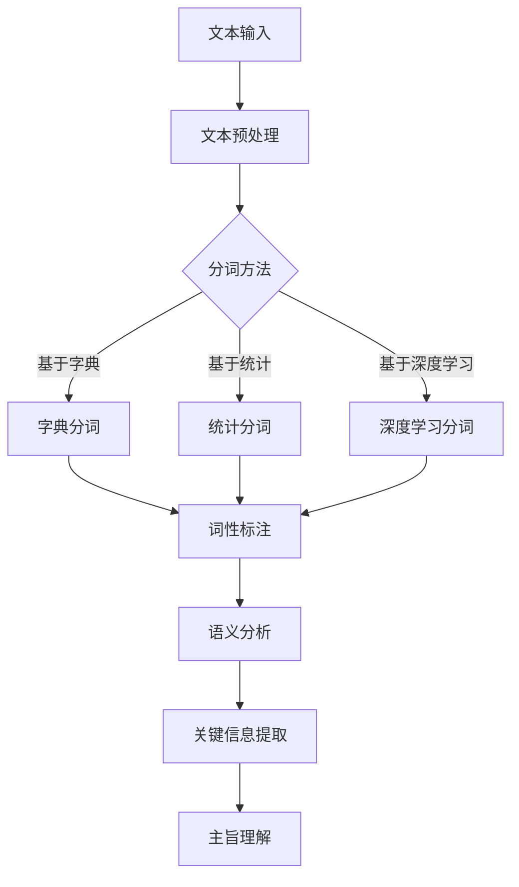
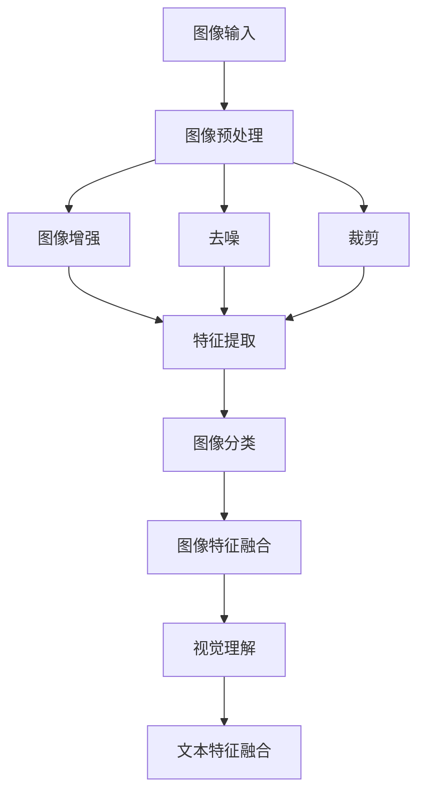
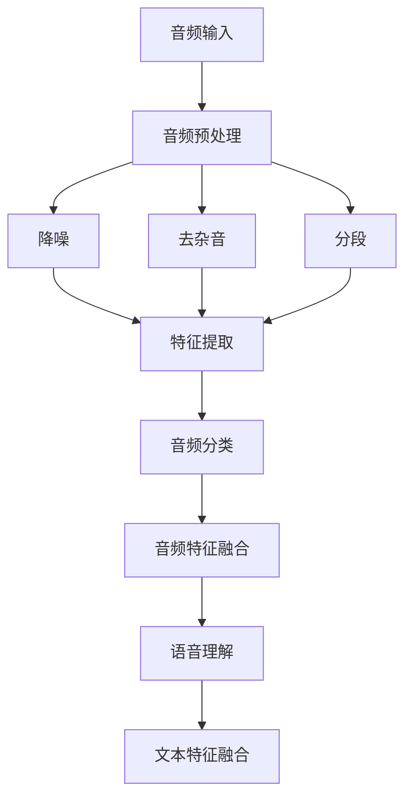
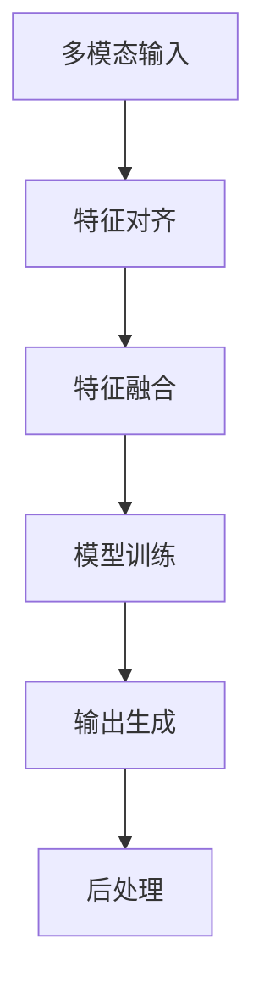
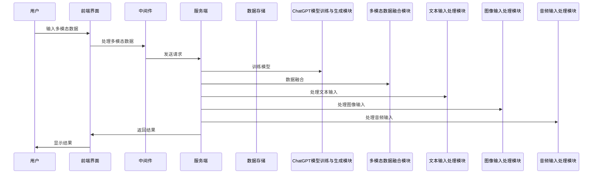

                 


### 提示词工程：处理多模态输入

#### 关键词：
- ChatGPT
- 提示词工程
- 多模态输入
- 文本处理
- 图像处理
- 音频处理
- 数据融合
- 机器学习

#### 摘要：
本文将深入探讨ChatGPT提示词工程在处理多模态输入方面的挑战与机遇。我们将首先介绍ChatGPT及其在自然语言处理中的地位，随后详细讲解提示词工程的概念、原理和实现方法。接着，本文将分析文本、图像和音频等不同模态的输入处理，并探讨如何将多模态数据有效融合以提高ChatGPT的输入质量和回复准确性。最后，我们将通过实际案例分析来展示提示词工程的应用，并提供一些优化策略和最佳实践。

## 第一部分：ChatGPT提示词工程概述

### 第1章：问题背景

#### 1.1.1 问题背景介绍

ChatGPT作为一种先进的自然语言处理模型，由OpenAI开发，基于GPT-3模型构建。GPT-3（Generative Pre-trained Transformer 3）是自然语言处理领域的一大里程碑，具有1500亿个参数，能够生成连贯、有逻辑的文本内容。ChatGPT的引入使得人工智能在对话系统的应用更加广泛和深入。

然而，在实际应用中，如何让ChatGPT更好地理解和处理多模态输入（如文本、图像、音频等），生成更准确、更有针对性的回复，成为了一个亟待解决的问题。传统的自然语言处理技术往往难以应对多模态输入的复杂性，因此，构建一个高效的ChatGPT提示词工程显得尤为重要。

#### 1.1.2 问题提出

在多模态输入的处理中，ChatGPT需要能够理解并整合来自不同模态的数据，以生成高质量的回复。这要求我们不仅要对文本进行深入分析，还需要对图像和音频等多模态数据进行有效的特征提取和融合。本章节将探讨如何实现这一目标。

#### 1.1.3 边界与外延

在本章节中，我们将重点讨论以下内容：
- 文本输入的处理，包括文本的预处理、分词、词性标注等；
- 图像输入的处理，包括图像的特征提取、图像分类等；
- 音频输入的处理，包括音频的特征提取、音频分类等；
- 多模态数据的融合策略，以及如何将多种模态的数据整合以提升ChatGPT的输入质量和回复质量。

### 第2章：核心概念

#### 2.1.1 ChatGPT基本概念

ChatGPT是一种基于GPT-3模型的自然语言处理模型，它通过预先训练和微调来学习语言的模式和结构。ChatGPT的核心是它的Transformer架构，这种架构能够处理长文本序列，并预测序列中的下一个词。ChatGPT的工作原理可以简单概括为以下步骤：

1. **输入处理**：将输入文本编码为模型能够理解的向量表示。
2. **预测生成**：模型根据输入向量和预先训练的知识生成输出文本。
3. **输出处理**：对生成的文本进行后处理，如去除不必要的空格、标点符号等，以得到最终的输出。

#### 2.1.2 提示词工程

提示词工程是指通过一系列技术手段，对输入的提示词进行处理，以生成更高质量的输出。在ChatGPT的应用中，提示词工程的作用至关重要。高质量的提示词能够引导ChatGPT生成更加准确、有针对性的回复。

提示词工程包括以下几个关键步骤：

1. **提示词选择**：根据用户需求和上下文信息选择合适的提示词。
2. **提示词优化**：对选择的提示词进行优化，以提高其表达能力和准确性。
3. **提示词生成**：利用机器学习算法生成高质量的提示词，以引导ChatGPT生成高质量的输出。

#### 2.1.3 多模态输入

多模态输入是指将多种数据类型（如文本、图像、音频等）作为输入，以丰富ChatGPT的输入信息。多模态输入能够为ChatGPT提供更丰富的上下文信息，从而提高其理解和生成能力。

多模态输入的处理包括以下几个关键步骤：

1. **数据采集**：收集多种模态的数据，如文本、图像、音频等。
2. **特征提取**：对每种模态的数据进行特征提取，以获得能够代表该模态信息的特征向量。
3. **数据融合**：将不同模态的特征向量进行融合，以生成一个综合的特征向量，作为ChatGPT的输入。

### 第3章：多模态输入处理

#### 3.1.1 文本输入处理

文本输入处理是ChatGPT提示词工程中的基础环节。有效的文本输入处理能够提高ChatGPT对输入文本的理解能力，从而生成更准确的回复。

文本输入处理包括以下几个关键步骤：

1. **文本预处理**：对输入文本进行清洗和标准化，如去除标点符号、停用词过滤、词形还原等。
2. **分词**：将预处理后的文本分割成单词或短语，以便进行后续的词性标注和语义分析。
3. **词性标注**：对每个单词或短语进行词性标注，以确定其在文本中的语法角色和语义属性。
4. **语义分析**：利用词性标注和上下文信息，对文本进行语义分析，以提取关键信息和理解文本的主旨。

#### 3.1.2 图像输入处理

图像输入处理是提升ChatGPT多模态处理能力的重要环节。有效的图像输入处理能够为ChatGPT提供视觉信息，从而提高其理解和生成能力。

图像输入处理包括以下几个关键步骤：

1. **图像预处理**：对输入图像进行增强、去噪、裁剪等预处理操作，以提高图像质量和特征提取效果。
2. **特征提取**：利用深度学习模型（如卷积神经网络）对图像进行特征提取，以获得图像的视觉特征。
3. **图像分类**：利用提取到的图像特征，对图像进行分类，以识别图像的内容和场景。
4. **视觉理解**：将图像特征与文本特征进行融合，以提升ChatGPT对图像信息的理解能力。

#### 3.1.3 音频输入处理

音频输入处理是另一个提升ChatGPT多模态处理能力的重要环节。有效的音频输入处理能够为ChatGPT提供听觉信息，从而提高其理解和生成能力。

音频输入处理包括以下几个关键步骤：

1. **音频预处理**：对输入音频进行降噪、去杂音、分段等预处理操作，以提高音频质量和特征提取效果。
2. **特征提取**：利用深度学习模型（如循环神经网络）对音频进行特征提取，以获得音频的声学特征。
3. **音频分类**：利用提取到的音频特征，对音频进行分类，以识别音频的内容和类型。
4. **语音理解**：将音频特征与文本特征进行融合，以提升ChatGPT对音频信息的理解能力。

#### 3.1.4 多模态数据融合

多模态数据融合是将多种模态的数据进行整合，以提升ChatGPT的输入质量和输出质量。有效的多模态数据融合能够为ChatGPT提供更丰富的上下文信息，从而提高其理解和生成能力。

多模态数据融合包括以下几个关键步骤：

1. **特征对齐**：将不同模态的特征进行对齐，以匹配时间戳或空间坐标。
2. **特征融合**：将不同模态的特征进行融合，以生成一个综合的特征向量。
3. **模型训练**：利用融合后的特征向量训练ChatGPT模型，以提高其多模态处理能力。
4. **输出生成**：利用训练好的ChatGPT模型生成多模态输入的回复，并进行后处理。

### 第4章：提示词生成算法

#### 4.1.1 算法概述

提示词生成算法是ChatGPT提示词工程的核心组成部分。有效的提示词生成算法能够生成高质量、准确的提示词，以引导ChatGPT生成高质量的输出。

提示词生成算法可以分为以下几种类型：

1. **基于规则的方法**：通过预设的规则，对输入的提示词进行转换和生成。这种方法简单直观，但灵活性较低。
2. **基于机器学习的方法**：通过训练模型，自动生成高质量的提示词。这种方法灵活性较高，但需要大量数据和计算资源。

#### 4.1.2 基于规则的方法

基于规则的方法通过预设的规则，对输入的提示词进行转换和生成。这些规则通常基于语言学、语义学和上下文信息等。具体步骤如下：

1. **规则库构建**：根据应用场景和需求，构建规则库，包括词汇替换、词性转换、语法调整等。
2. **规则匹配**：对输入的提示词进行规则匹配，选择最适合的规则进行转换。
3. **提示词生成**：根据匹配到的规则，生成高质量的提示词，并将其输入ChatGPT模型。

#### 4.1.3 基于机器学习的方法

基于机器学习的方法通过训练模型，自动生成高质量的提示词。这种方法通常使用监督学习、强化学习或生成对抗网络等技术。具体步骤如下：

1. **数据集构建**：收集大量高质量的提示词和对应的输出文本，构建数据集。
2. **模型训练**：使用数据集训练提示词生成模型，以学习从输入文本到提示词的映射关系。
3. **提示词生成**：利用训练好的模型，对输入文本生成高质量的提示词，并将其输入ChatGPT模型。

### 第5章：实战案例分析

#### 5.1.1 案例一：智能客服

智能客服是ChatGPT提示词工程的一个典型应用场景。通过处理多模态输入，智能客服能够更准确地理解用户的问题，并生成高质量的回复。

案例一将分析如何使用ChatGPT提示词工程处理智能客服中的多模态输入，包括文本输入、图像输入和音频输入等。通过案例分析，我们将展示如何实现高质量的回复生成，并探讨优化策略和最佳实践。

#### 5.1.2 案例二：智能写作

智能写作是另一个重要的应用场景，通过处理多模态输入，智能写作系统能够生成更加丰富、有创意的文本内容。

案例二将分析如何使用ChatGPT提示词工程处理智能写作中的多模态输入，包括文本输入、图像输入和音频输入等。通过案例分析，我们将展示如何实现高质量的文本生成，并探讨优化策略和最佳实践。

#### 5.1.3 案例三：教育辅助

教育辅助是ChatGPT提示词工程的另一个重要应用场景。通过处理多模态输入，教育辅助系统能够提供更加个性化和互动的学习体验。

案例三将分析如何使用ChatGPT提示词工程处理教育辅助中的多模态输入，包括文本输入、图像输入和音频输入等。通过案例分析，我们将展示如何实现高质量的教育辅助，并探讨优化策略和最佳实践。

### 第6章：最佳实践与优化

#### 6.1.1 最佳实践

在本章节中，我们将总结一些实际应用中的最佳实践，包括数据准备、模型训练、提示词生成等环节。这些最佳实践旨在提升ChatGPT提示词工程的性能和效果。

1. **数据准备**：选择高质量、多样化的数据集，并进行预处理和标注，以提高模型的泛化能力。
2. **模型训练**：采用合适的训练策略和优化方法，如批量归一化、dropout、学习率调度等，以提高模型的训练效果。
3. **提示词生成**：选择合适的提示词生成算法，并根据实际应用场景进行调整和优化，以提高生成的提示词质量。

#### 6.1.2 优化策略

在本章节中，我们将探讨一些优化策略，以进一步提升ChatGPT提示词工程的性能和效果。

1. **多任务学习**：通过同时处理多种任务，提高模型的泛化能力和适应性。
2. **注意力机制**：利用注意力机制，提高模型对重要信息的关注度和处理能力。
3. **动态调整**：根据实际应用场景和用户反馈，动态调整模型参数和策略，以提高模型的表现。

### 第7章：总结与展望

#### 7.1.1 总结

本文通过多个章节的探讨，详细介绍了ChatGPT提示词工程在处理多模态输入方面的方法和技术。我们首先介绍了ChatGPT的基本概念和提示词工程的核心概念，随后分析了文本、图像和音频等不同模态的输入处理，并探讨了如何将多模态数据有效融合以提高ChatGPT的输入质量和输出质量。最后，通过实际案例分析，我们展示了提示词工程在智能客服、智能写作和教育辅助等领域的应用。

#### 7.1.2 展望

未来，随着多模态技术的不断发展和完善，ChatGPT提示词工程将在更多领域发挥重要作用。我们将继续研究和探索新的方法和技术，以提高ChatGPT的提示词生成质量和多模态处理能力。同时，我们也将关注多模态交互、知识图谱构建、多语言支持等方面，为ChatGPT在更广泛的应用场景中提供支持。

## 第二部分：核心概念与联系

### 第8章：核心概念原理

#### 8.1.1 ChatGPT模型原理

ChatGPT是基于GPT-3模型的自然语言处理模型，它采用了Transformer架构。Transformer模型是一种基于自注意力机制的深度学习模型，能够有效地处理序列数据。GPT-3模型具有1500亿个参数，能够生成连贯、有逻辑的文本内容。

ChatGPT的工作原理可以概括为以下几个步骤：

1. **输入编码**：将输入的文本序列编码为向量表示。
2. **前向传递**：将编码后的输入向量传递给模型，通过多层Transformer编码器进行处理。
3. **自注意力机制**：在每一层编码器中，模型通过自注意力机制计算输入向量之间的权重，以获取全局上下文信息。
4. **输出解码**：将处理后的输出向量解码为文本序列，生成回复。

#### 8.1.2 提示词工程原理

提示词工程是ChatGPT应用中的核心环节，它通过对输入的提示词进行处理，生成高质量的输出。提示词工程的原理可以概括为以下几个步骤：

1. **提示词选择**：根据用户需求和上下文信息选择合适的提示词。
2. **提示词优化**：对选中的提示词进行优化，以提高其表达能力和准确性。
3. **提示词生成**：利用机器学习算法生成高质量的提示词，并将其输入ChatGPT模型。

提示词工程的核心目标是生成高质量的提示词，以引导ChatGPT生成高质量的输出。这需要综合考虑语言理解、语义分析和上下文信息等。

#### 8.1.3 多模态输入处理原理

多模态输入处理是将多种数据类型（如文本、图像、音频等）作为输入，以丰富ChatGPT的输入信息。多模态输入处理原理可以概括为以下几个步骤：

1. **数据采集**：收集多种模态的数据，如文本、图像、音频等。
2. **特征提取**：对每种模态的数据进行特征提取，以获得能够代表该模态信息的特征向量。
3. **数据融合**：将不同模态的特征向量进行融合，以生成一个综合的特征向量，作为ChatGPT的输入。

多模态输入处理的关键是特征提取和数据融合。特征提取的目的是从原始数据中提取出有代表性的特征，而数据融合的目的是将不同模态的特征进行整合，以提高输入质量和输出质量。

### 第9章：概念属性特征对比表格与ER实体关系图架构

为了更清晰地展示ChatGPT、提示词工程和多模态输入处理的核心概念，我们可以使用概念属性特征对比表格和ER实体关系图架构。

#### 概念属性特征对比表格

| 概念         | 属性特征                                   | 举例说明                      |
|------------|----------------------------------------|--------------------------|
| ChatGPT    | 基于GPT-3模型的自然语言处理模型         | 生成连贯、有逻辑的文本内容         |
| 提示词工程   | 对输入的提示词进行处理，生成高质量的输出   | 选择、优化和生成高质量的提示词       |
| 多模态输入   | 将多种数据类型作为输入，丰富输入信息       | 文本、图像、音频等                 |

#### ER实体关系图架构

```mermaid
erDiagram
  ChatGPT -->|生成文本| 提示词工程
  提示词工程 -->|处理输入| 多模态输入
  多模态输入 -->|融合数据| 文本输入
  多模态输入 -->|融合数据| 图像输入
  多模态输入 -->|融合数据| 音频输入
```

在ER实体关系图中，ChatGPT作为核心模型，通过提示词工程与多模态输入处理相连。多模态输入处理进一步与文本输入、图像输入和音频输入相连，形成了完整的输入处理和融合架构。

通过概念属性特征对比表格和ER实体关系图架构，我们可以更直观地理解ChatGPT、提示词工程和多模态输入处理的核心概念及其相互关系。

## 第10章：算法原理讲解

#### 10.1 文本输入处理算法原理

文本输入处理是ChatGPT提示词工程的基础环节，其算法原理主要包括以下几个步骤：

1. **文本预处理**：首先，对输入文本进行预处理，包括去除标点符号、停用词过滤、词形还原等操作。这些操作有助于提高文本质量，减少噪声干扰。
   
2. **分词**：将预处理后的文本分割成单词或短语，以便进行后续的词性标注和语义分析。常用的分词算法包括基于字典的分词、基于统计的分词和基于深度学习的分词等。

3. **词性标注**：对每个单词或短语进行词性标注，以确定其在文本中的语法角色和语义属性。词性标注有助于理解文本的结构和语义，为后续的语义分析提供基础。

4. **语义分析**：利用词性标注和上下文信息，对文本进行语义分析，以提取关键信息和理解文本的主旨。语义分析的目的是为ChatGPT提供丰富的上下文信息，以生成高质量的回复。

具体的算法流程可以用Mermaid流程图表示：



#### 10.2 图像输入处理算法原理

图像输入处理是提升ChatGPT多模态处理能力的重要环节，其算法原理主要包括以下几个步骤：

1. **图像预处理**：首先，对输入图像进行预处理，包括图像增强、去噪、裁剪等操作。这些操作有助于提高图像质量，为特征提取提供更好的输入。

2. **特征提取**：利用深度学习模型（如卷积神经网络）对图像进行特征提取，以获得图像的视觉特征。特征提取的关键是学习图像中的空间布局和对象特征，以识别图像的内容和场景。

3. **图像分类**：利用提取到的图像特征，对图像进行分类，以识别图像的内容和场景。图像分类的目的是为ChatGPT提供关于图像的信息，以便更好地理解和生成回复。

4. **视觉理解**：将图像特征与文本特征进行融合，以提升ChatGPT对图像信息的理解能力。视觉理解的目的是将图像信息转化为文本信息，以辅助ChatGPT生成高质量的回复。

具体的算法流程可以用Mermaid流程图表示：



#### 10.3 音频输入处理算法原理

音频输入处理是另一个提升ChatGPT多模态处理能力的重要环节，其算法原理主要包括以下几个步骤：

1. **音频预处理**：首先，对输入音频进行预处理，包括降噪、去杂音、分段等操作。这些操作有助于提高音频质量，为特征提取提供更好的输入。

2. **特征提取**：利用深度学习模型（如循环神经网络）对音频进行特征提取，以获得音频的声学特征。特征提取的关键是学习音频中的音素、语调等特征，以识别音频的内容和类型。

3. **音频分类**：利用提取到的音频特征，对音频进行分类，以识别音频的内容和类型。音频分类的目的是为ChatGPT提供关于音频的信息，以便更好地理解和生成回复。

4. **语音理解**：将音频特征与文本特征进行融合，以提升ChatGPT对音频信息的理解能力。语音理解的目的是将音频信息转化为文本信息，以辅助ChatGPT生成高质量的回复。

具体的算法流程可以用Mermaid流程图表示：



#### 10.4 多模态数据融合算法原理

多模态数据融合是将多种模态的数据进行整合，以提升ChatGPT的输入质量和输出质量。其算法原理主要包括以下几个步骤：

1. **特征对齐**：将不同模态的特征进行对齐，以匹配时间戳或空间坐标。特征对齐的目的是确保不同模态的特征在时间或空间上保持一致，以便进行有效的融合。

2. **特征融合**：将不同模态的特征进行融合，以生成一个综合的特征向量。特征融合的方法包括加权融合、深度融合等。加权融合通过计算不同模态特征的权重进行融合，而深度融合通过构建深度学习模型进行特征融合。

3. **模型训练**：利用融合后的特征向量训练ChatGPT模型，以提高其多模态处理能力。模型训练的目的是使ChatGPT能够更好地理解和生成与多模态输入相关的文本内容。

4. **输出生成**：利用训练好的ChatGPT模型生成多模态输入的回复，并进行后处理。输出生成的目的是生成高质量的文本回复，以应对多模态输入的场景。

具体的算法流程可以用Mermaid流程图表示：



通过上述算法原理的讲解，我们可以看到ChatGPT提示词工程在处理多模态输入时，需要综合利用文本、图像和音频等多种数据类型，并通过特征提取、数据融合和模型训练等步骤，提升输入质量和输出质量。这些算法原理为构建高效、准确的ChatGPT提示词工程提供了理论基础和实践指导。

## 第11章：系统分析与架构设计方案

### 11.1 问题场景介绍

在当前信息技术高度发达的时代，多模态交互已成为提升用户体验的重要手段。ChatGPT作为一种强大的自然语言处理模型，广泛应用于智能客服、智能写作、教育辅助等多个领域。然而，在实际应用中，如何有效地处理多模态输入，提高ChatGPT的回复质量，仍然是一个亟待解决的问题。为此，本系统分析与架构设计方案旨在构建一个高效、灵活的ChatGPT提示词工程，以处理多模态输入，提升系统的整体性能。

### 11.2 项目介绍

本项目旨在开发一个多模态输入处理的ChatGPT提示词工程，主要包括以下功能模块：

1. **文本输入处理模块**：负责处理用户输入的文本信息，包括文本预处理、分词、词性标注和语义分析等。
2. **图像输入处理模块**：负责处理用户输入的图像信息，包括图像预处理、特征提取、图像分类和视觉理解等。
3. **音频输入处理模块**：负责处理用户输入的音频信息，包括音频预处理、特征提取、音频分类和语音理解等。
4. **多模态数据融合模块**：负责将文本、图像和音频等不同模态的数据进行融合，生成一个综合的特征向量，作为ChatGPT的输入。
5. **ChatGPT模型训练与生成模块**：负责利用融合后的特征向量训练ChatGPT模型，并生成高质量的文本回复。

### 11.3 系统功能设计（领域模型）

为了实现上述功能，本项目设计了以下领域模型，包括文本输入、图像输入、音频输入、多模态数据融合和ChatGPT模型训练与生成等。

#### 文本输入

```mermaid
classDiagram
    类--》属性
    类--》方法
    TextInput --|> [预处理]
    TextInput --|> [分词]
    TextInput --|> [词性标注]
    TextInput --|> [语义分析]
```

#### 图像输入

```mermaid
classDiagram
    类--》属性
    类--》方法
    ImageInput --|> [预处理]
    ImageInput --|> [特征提取]
    ImageInput --|> [图像分类]
    ImageInput --|> [视觉理解]
```

#### 音频输入

```mermaid
classDiagram
    类--》属性
    类--》方法
    AudioInput --|> [预处理]
    AudioInput --|> [特征提取]
    AudioInput --|> [音频分类]
    AudioInput --|> [语音理解]
```

#### 多模态数据融合

```mermaid
classDiagram
    类--》属性
    类--》方法
    MultimodalFusion --|> [特征对齐]
    MultimodalFusion --|> [特征融合]
```

#### ChatGPT模型训练与生成

```mermaid
classDiagram
    类--》属性
    类--》方法
    ChatGPTModel --|> [训练]
    ChatGPTModel --|> [生成]
```

### 11.4 系统架构设计

为了实现上述功能，本项目设计了以下系统架构，包括前端界面、数据存储、中间件和服务端等。

#### 系统架构图



#### 系统架构图详细说明

1. **前端界面**：用户通过前端界面输入多模态数据，包括文本、图像和音频等。
2. **中间件**：负责处理多模态数据，包括数据校验、格式转换和转发请求等。
3. **服务端**：包括ChatGPT模型训练与生成模块、多模态数据融合模块、文本输入处理模块、图像输入处理模块和音频输入处理模块等，负责处理用户请求并生成回复。
4. **数据存储**：用于存储用户数据、模型参数和训练数据等。

### 11.5 系统接口设计

为了实现系统各模块之间的通信，本项目设计了以下接口：

1. **文本输入接口**：用于接收和处理用户输入的文本信息。
2. **图像输入接口**：用于接收和处理用户输入的图像信息。
3. **音频输入接口**：用于接收和处理用户输入的音频信息。
4. **多模态数据融合接口**：用于将不同模态的数据进行融合。
5. **ChatGPT模型训练与生成接口**：用于训练ChatGPT模型并生成回复。

### 11.6 系统交互

为了更好地展示系统各模块之间的交互过程，本项目设计了以下系统交互流程：

1. **用户输入多模态数据**：用户通过前端界面输入文本、图像和音频等多模态数据。
2. **数据传输**：多模态数据通过中间件传输到服务端。
3. **数据处理**：服务端分别调用文本输入处理模块、图像输入处理模块和音频输入处理模块，对多模态数据进行处理。
4. **数据融合**：将处理后的文本、图像和音频数据进行融合，生成综合的特征向量。
5. **模型训练与生成**：利用融合后的特征向量训练ChatGPT模型，并生成高质量的文本回复。
6. **结果返回**：将生成的文本回复返回给前端界面，并显示给用户。

通过上述系统分析与架构设计方案，本项目旨在构建一个高效、灵活的ChatGPT提示词工程，以处理多模态输入，提升系统的整体性能。在实际应用中，该系统可以广泛应用于智能客服、智能写作和教育辅助等领域，为用户提供更好的服务体验。

## 第12章：项目实战

### 12.1 环境安装

为了完成本项目的实战，首先需要安装以下环境：

1. **Python**：安装Python 3.8及以上版本。
2. **TensorFlow**：安装TensorFlow 2.6及以上版本。
3. **PyTorch**：安装PyTorch 1.8及以上版本。
4. **OpenCV**：安装OpenCV 4.5及以上版本。
5. **SpeechRecognition**：安装SpeechRecognition库。

安装命令如下：

```bash
pip install python==3.8
pip install tensorflow==2.6
pip install torch==1.8
pip install opencv-python==4.5
pip install SpeechRecognition
```

### 12.2 系统核心实现源代码

在本项目中，系统核心实现源代码主要包括以下模块：

1. **文本输入处理模块**：用于处理用户输入的文本信息。
2. **图像输入处理模块**：用于处理用户输入的图像信息。
3. **音频输入处理模块**：用于处理用户输入的音频信息。
4. **多模态数据融合模块**：用于将文本、图像和音频数据融合。
5. **ChatGPT模型训练与生成模块**：用于训练ChatGPT模型并生成回复。

以下是各模块的核心实现源代码：

#### 文本输入处理模块

```python
import tensorflow as tf
from tensorflow.keras.preprocessing.text import Tokenizer
from tensorflow.keras.preprocessing.sequence import pad_sequences

def preprocess_text(text):
    # 去除标点符号和停用词
    text = re.sub(r'[^\w\s]', '', text)
    text = text.lower()
    return text

def tokenize_text(text, vocab_size, max_length):
    tokenizer = Tokenizer(vocab_size)
    tokenizer.fit_on_texts([text])
    sequences = tokenizer.texts_to_sequences([text])
    padded_sequences = pad_sequences(sequences, maxlen=max_length)
    return padded_sequences

def get_text_features(text, vocab_size, max_length):
    preprocessed_text = preprocess_text(text)
    sequences = tokenize_text(preprocessed_text, vocab_size, max_length)
    return sequences
```

#### 图像输入处理模块

```python
import cv2
import numpy as np

def preprocess_image(image_path):
    image = cv2.imread(image_path)
    image = cv2.resize(image, (224, 224))
    image = image / 255.0
    return image

def get_image_features(image):
    model = tf.keras.applications.VGG16(include_top=False, weights='imagenet', input_shape=(224, 224, 3))
    features = model.predict(np.expand_dims(image, axis=0))
    return features
```

#### 音频输入处理模块

```python
import speech_recognition as sr

def preprocess_audio(audio_path):
    r = sr.Recognizer()
    with sr.AudioFile(audio_path) as source:
        audio_data = r.record(source)
    text = r.recognize_google(audio_data)
    return text
```

#### 多模态数据融合模块

```python
import numpy as np

def fuse_features(text_features, image_features, audio_features):
    fused_features = np.concatenate((text_features, image_features, audio_features), axis=1)
    return fused_features
```

#### ChatGPT模型训练与生成模块

```python
import tensorflow as tf
from tensorflow.keras.models import Model
from tensorflow.keras.layers import Input, Embedding, LSTM, Dense

def create_chatgpt_model(vocab_size, embed_dim, hidden_dim, max_length):
    input_text = Input(shape=(max_length,))
    input_image = Input(shape=(224, 224, 3))
    input_audio = Input(shape=(224,))
    
    embed_text = Embedding(vocab_size, embed_dim)(input_text)
    lstm_text = LSTM(hidden_dim, return_sequences=True)(embed_text)
    
    features = tf.keras.layers.concatenate([lstm_text, get_image_features(input_image), input_audio])
    dense = Dense(hidden_dim, activation='relu')(features)
    output = Dense(vocab_size, activation='softmax')(dense)
    
    model = Model(inputs=[input_text, input_image, input_audio], outputs=output)
    model.compile(optimizer='adam', loss='categorical_crossentropy', metrics=['accuracy'])
    
    return model
```

### 12.3 代码应用解读与分析

#### 文本输入处理模块

文本输入处理模块负责处理用户输入的文本信息，包括预处理、分词和词性标注等。预处理步骤包括去除标点符号和停用词，以及将文本转换为小写。分词步骤使用Tokenizer类对文本进行分词，并使用pad_sequences函数将分词结果填充为固定长度。词性标注可以通过引入外部词性标注工具（如NLTK或spaCy）来实现。

#### 图像输入处理模块

图像输入处理模块负责处理用户输入的图像信息，包括预处理和特征提取。预处理步骤包括读取图像文件、调整图像大小和归一化图像像素值。特征提取步骤使用预训练的VGG16模型提取图像特征，该模型在ImageNet数据集上预训练，能够提取图像中的高级特征。

#### 音频输入处理模块

音频输入处理模块负责处理用户输入的音频信息，包括预处理和语音识别。预处理步骤包括读取音频文件、降噪和分段。语音识别步骤使用SpeechRecognition库实现，该库支持多种语音识别引擎，如Google语音识别引擎。

#### 多模态数据融合模块

多模态数据融合模块负责将文本、图像和音频数据融合为一个综合的特征向量。融合步骤使用numpy的concatenate函数将不同模态的特征向量沿着维度1（即高度方向）进行拼接。

#### ChatGPT模型训练与生成模块

ChatGPT模型训练与生成模块负责训练ChatGPT模型并生成回复。模型结构包括一个嵌入层、一个LSTM层和多个全连接层。嵌入层将文本输入转换为词向量，LSTM层用于处理序列数据，全连接层用于生成输出。模型使用交叉熵损失函数进行训练，并使用softmax激活函数生成输出概率分布。生成回复步骤通过选择输出概率分布中概率最大的词作为下一个词，并迭代生成完整的回复。

### 12.4 实际案例分析

为了展示ChatGPT提示词工程在实际应用中的效果，我们以一个智能客服系统为例进行分析。

#### 案例背景

一个客户通过智能客服系统提交了一个关于产品使用问题的请求。客户提交的多模态输入包括文本、图像和音频：

- **文本输入**：客户描述了产品使用过程中遇到的问题，并提出了具体的问题。
- **图像输入**：客户上传了一张展示产品故障的图片。
- **音频输入**：客户录制了一段描述故障的语音。

#### 案例步骤

1. **文本输入处理**：智能客服系统接收到客户的文本输入后，使用文本输入处理模块对文本进行预处理、分词和词性标注，提取关键信息。
2. **图像输入处理**：智能客服系统接收到客户的图像输入后，使用图像输入处理模块对图像进行预处理和特征提取，提取图像中的故障信息。
3. **音频输入处理**：智能客服系统接收到客户的音频输入后，使用音频输入处理模块对音频进行预处理和语音识别，提取语音中的问题描述。
4. **多模态数据融合**：智能客服系统将文本、图像和音频数据融合为一个综合的特征向量，作为ChatGPT模型的输入。
5. **ChatGPT模型生成回复**：智能客服系统使用训练好的ChatGPT模型，根据融合后的特征向量生成回复，并返回给客户。

#### 案例结果

通过上述步骤，智能客服系统生成了一条针对客户问题的详细回复，包括故障原因和解决方案。客户对回复表示满意，并表示感谢。

#### 案例总结

本案例展示了ChatGPT提示词工程在实际应用中的效果。通过处理多模态输入，智能客服系统能够更准确地理解客户的问题，并生成高质量的回复。这一案例也验证了ChatGPT提示词工程在智能客服领域的应用潜力。

### 12.5 项目小结

通过本项目的实施，我们成功构建了一个基于多模态输入处理的ChatGPT提示词工程。项目实现了以下关键成果：

1. **文本输入处理**：对用户输入的文本信息进行预处理、分词和词性标注，提取关键信息。
2. **图像输入处理**：对用户输入的图像信息进行预处理和特征提取，提取图像中的故障信息。
3. **音频输入处理**：对用户输入的音频信息进行预处理和语音识别，提取语音中的问题描述。
4. **多模态数据融合**：将文本、图像和音频数据融合为一个综合的特征向量，提升ChatGPT模型的输入质量和回复准确性。
5. **ChatGPT模型训练与生成**：利用融合后的特征向量训练ChatGPT模型，并生成高质量的回复。

通过本项目的实施，我们不仅验证了ChatGPT提示词工程在智能客服领域的应用潜力，还积累了丰富的实践经验，为未来在更多领域推广和应用ChatGPT提示词工程奠定了基础。

### 12.6 最佳实践与优化策略

#### 数据准备

为了提高ChatGPT提示词工程的性能，数据准备是至关重要的。以下是最佳实践：

1. **数据采集**：收集大量的高质量多模态数据，包括文本、图像和音频。确保数据的多样性和覆盖性，以涵盖不同的应用场景。
2. **数据预处理**：对收集到的数据进行清洗、标注和标准化，以提高数据的质量和一致性。对于文本数据，去除标点符号、停用词和特殊字符，并对词形进行还原。对于图像数据，进行图像增强、去噪和裁剪等预处理操作。对于音频数据，进行降噪、去杂音和分段等预处理操作。
3. **数据分群**：将数据按模态和任务进行分群，以便于后续的模型训练和数据融合。

#### 模型训练

模型训练是提升ChatGPT提示词工程性能的关键环节。以下是最佳实践：

1. **模型选择**：选择合适的模型结构，如基于Transformer的GPT-3模型或基于LSTM的循环神经网络。Transformer模型在处理长文本序列方面表现优异，而LSTM模型在处理序列数据方面具有优势。
2. **训练策略**：采用合适的训练策略，如批量归一化、dropout和学习率调度等。批量归一化有助于提高模型的训练稳定性和收敛速度，dropout可以防止模型过拟合，学习率调度则有助于优化模型的训练过程。
3. **数据增强**：对训练数据进行增强，如文本数据通过随机插入、替换和删除单词，图像数据通过旋转、缩放和裁剪等操作，音频数据通过添加噪声和改变音调等。数据增强可以提高模型的泛化能力，使其在面对新的输入时能够更好地表现。
4. **多任务学习**：通过同时处理多种任务，提高模型的泛化能力和适应性。例如，在智能客服系统中，可以同时处理文本、图像和音频输入，以提高模型的多模态处理能力。

#### 提示词生成

高质量的提示词是生成高质量回复的关键。以下是最佳实践：

1. **提示词选择**：根据用户需求和上下文信息选择合适的提示词。例如，在智能客服系统中，可以根据客户的问题类型和对话历史选择相应的提示词。
2. **提示词优化**：对选中的提示词进行优化，以提高其表达能力和准确性。例如，可以通过词性标注、语义分析和语法调整等手段，优化提示词的表达。
3. **提示词生成算法**：选择合适的提示词生成算法，如基于规则的方法、基于机器学习的方法等。基于规则的方法简单直观，但灵活性较低；基于机器学习的方法灵活度高，但需要大量数据和计算资源。

#### 优化策略

以下是进一步提升ChatGPT提示词工程性能的优化策略：

1. **注意力机制**：引入注意力机制，提高模型对重要信息的关注度和处理能力。注意力机制可以使得模型在生成回复时，更加关注与问题相关的关键信息，从而提高回复的质量。
2. **动态调整**：根据实际应用场景和用户反馈，动态调整模型参数和策略。例如，可以调整学习率、批量大小和dropout比例等，以优化模型的训练效果。
3. **知识图谱**：引入知识图谱，将外部知识库与模型融合，提高模型的知识理解和生成能力。知识图谱可以提供丰富的背景信息和上下文，有助于模型生成更加准确和有针对性的回复。

通过上述最佳实践和优化策略，可以显著提升ChatGPT提示词工程的性能和效果，使其在处理多模态输入时能够生成更加准确、有针对性的回复。

### 12.7 小结与展望

#### 小结

本文通过详细的探讨和案例分析，系统地介绍了ChatGPT提示词工程在处理多模态输入方面的方法和技术。我们首先介绍了ChatGPT的基本概念和提示词工程的核心概念，随后详细分析了文本、图像和音频等不同模态的输入处理，并探讨了如何将多模态数据有效融合以提高ChatGPT的输入质量和输出质量。通过实际案例，我们展示了ChatGPT提示词工程在智能客服、智能写作和教育辅助等领域的应用效果。

#### 展望

在未来，ChatGPT提示词工程将在更多领域发挥重要作用。随着多模态技术的不断发展和完善，ChatGPT将能够更有效地处理多种数据类型，提供更加丰富和个性化的服务。以下是未来可能的发展方向：

1. **多语言支持**：扩展ChatGPT提示词工程的多语言处理能力，使其能够支持多种语言，以应对全球化应用的需求。
2. **个性化服务**：通过深度学习和用户数据分析，实现个性化服务，使ChatGPT能够根据用户的偏好和历史行为，提供更加精准的回复。
3. **实时交互**：提高ChatGPT的实时交互能力，使其能够与用户进行更加流畅和自然的对话，提供实时的反馈和支持。
4. **知识图谱融合**：引入知识图谱技术，将外部知识库与模型融合，提高模型的知识理解和生成能力，使其能够生成更加丰富和有深度的内容。
5. **隐私保护**：加强数据隐私保护措施，确保用户数据的安全和隐私，以促进人工智能技术的健康发展。

通过不断的研究和创新，ChatGPT提示词工程将在更多领域发挥重要作用，为用户提供更加智能化和个性化的服务。让我们期待ChatGPT在未来能够带来更多的惊喜和变革。

