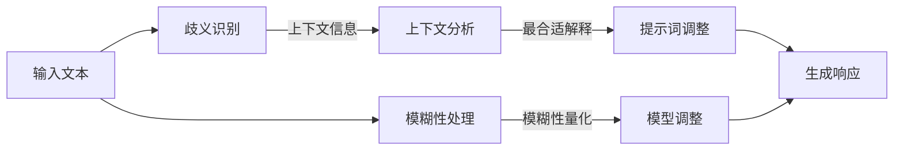
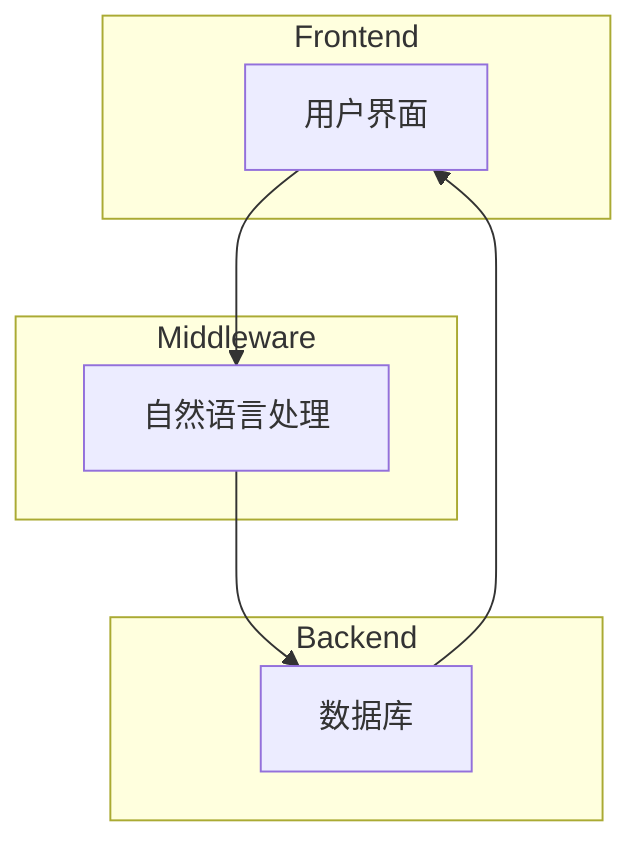
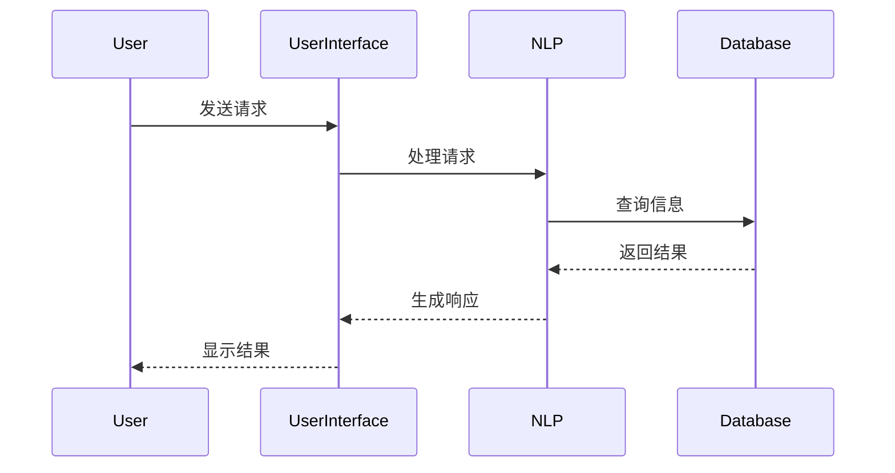

                 


### 关键词
- ChatGPT
- 提示词工程
- 歧义处理
- 模糊性处理
- 算法原理
- 系统架构
- 项目实战
- 最佳实践

### 摘要
本文深入探讨了ChatGPT提示词工程中处理歧义和模糊性的挑战与策略。通过对ChatGPT的崛起、提示词工程的重要性、核心概念联系、算法原理讲解、系统分析与架构设计方案、项目实战以及最佳实践的全面分析，旨在为开发者提供系统、实用的解决思路和方法，助力构建高效的ChatGPT应用。

---

#### 书名：《ChatGPT提示词工程：处理歧义和模糊性》

### 第一部分：问题背景与核心概念

#### 第1章：问题的背景

#### 1.1 ChatGPT的崛起
**背景介绍**：
ChatGPT是由OpenAI开发的一种基于GPT-3的预训练语言模型，它能够通过大量的文本数据进行学习，从而实现自然语言处理任务。自从ChatGPT在2022年发布以来，它在各个领域都展现出了强大的能力，迅速成为人工智能领域的热点话题。

**问题背景**：
然而，随着ChatGPT的应用越来越广泛，人们开始意识到在处理自然语言时，歧义和模糊性是两个亟待解决的问题。歧义指的是语言中的多义现象，即一个词或短语可以有多种解释。而模糊性则是指语言中的不确定性，例如模糊词语的使用使得信息的传达变得复杂。

**问题描述**：
在ChatGPT的提示词工程中，如何有效地处理歧义和模糊性，使得模型能够准确理解用户意图，是一个重要的课题。

**问题解决**：
通过对ChatGPT的提示词工程进行深入研究，本文将探讨如何利用提示词优化算法、算法原理和系统架构设计方案来解决歧义和模糊性问题。

**边界与外延**：
在处理歧义和模糊性时，需要明确问题的边界，即哪些问题是ChatGPT能够解决的，哪些问题是它无法解决的。同时，也要考虑问题的外延，即如何将解决思路应用到更广泛的应用场景中。

**概念结构与核心要素组成**：
- 歧义处理：识别歧义、上下文分析、选择最优解释。
- 模糊性处理：模糊集合理论、上下文增强、模型自适应调整。

#### 1.5 本章小结
本章介绍了ChatGPT的崛起背景和提示词工程的重要性，提出了处理歧义和模糊性的挑战，并概述了本文的研究内容和目标。

---

### 第二部分：核心概念与联系

#### 第2章：核心概念与联系

#### 2.1 ChatGPT提示词的概念
**核心概念**：
提示词（Prompt）是指提供给ChatGPT的输入，用于引导模型生成预期的输出。有效的提示词能够提高ChatGPT的生成质量和效率。

**概念属性特征对比表格**：
- 特征1：**明确性**，指提示词是否清晰明确，避免歧义。
- 特征2：**多样性**，指提示词的多样性和灵活性，以适应不同的场景和需求。
- 特征3：**上下文关联**，指提示词与上下文之间的紧密关联，以提高模型的上下文理解能力。

| 特征       | 描述                                                         |
| ---------- | ------------------------------------------------------------ |
| 明确性     | 提示词需明确表达用户意图，减少歧义。                         |
| 多样性     | 提示词应具有多样性，以应对不同的情境和需求。                 |
| 上下文关联 | 提示词需与上下文紧密相关，以便模型准确理解上下文信息。       |

**提示词与歧义、模糊性的关系**：
- 歧义处理：提示词应明确表达用户意图，避免歧义的产生。
- 模糊性处理：提示词需增强上下文信息，帮助模型理解模糊性的含义。

**ER实体关系图**：
```mermaid
erDiagram
  User ||--|{ ChatGPT }|| Prompt
  Prompt ||--|{ Context }|| Text
  Context ||--|{ Ambiguity }|| Resolution
  Ambiguity ||--|{ Fuzziness }|| Handling
```

**本章小结**：
本章介绍了ChatGPT提示词的概念、属性特征对比表格和ER实体关系图，探讨了提示词与歧义、模糊性的关系，为后续章节的算法原理讲解和系统架构设计奠定了基础。

---

### 第三部分：算法原理讲解

#### 第3章：算法原理讲解

#### 3.1 ChatGPT的工作原理
**工作原理**：
ChatGPT是基于GPT-3模型的预训练语言模型，通过大量文本数据进行训练，从而学习语言的模式和结构。在接收输入后，ChatGPT利用其训练得到的神经网络模型，生成符合上下文的响应。

**提示词优化算法**：
**算法原理**：
提示词优化算法的目标是提高提示词的质量，从而提高ChatGPT的生成质量。这包括以下步骤：
1. **歧义识别**：分析输入的文本，识别其中可能存在的歧义。
2. **上下文分析**：根据上下文信息，选择最合适的解释。
3. **提示词调整**：根据识别出的歧义和上下文，调整提示词以消除歧义。

**处理歧义与模糊性的算法**：
**算法原理**：
处理歧义和模糊性的算法主要包括以下两个方面：
1. **歧义处理**：通过上下文分析，选择最合适的解释，以消除歧义。
2. **模糊性处理**：利用模糊集合理论，对模糊性进行量化处理，提高模型对模糊信息的理解能力。

**Mermaid流程图展示**：


**Python源代码详细阐述**：
```python
# 歧义处理代码示例
def process_ambiguity(text, context):
    # 代码实现歧义处理逻辑
    return adjusted_text

# 模糊性处理代码示例
def process_fuzziness(text, context):
    # 代码实现模糊性处理逻辑
    return adjusted_text
```

**数学模型与公式讲解**：
$$
\text{歧义处理概率} = P(\text{正确解释}|\text{上下文})
$$
$$
\text{模糊性量化值} = \frac{\sum_{i=1}^{n} w_i \cdot F_i}{\sum_{i=1}^{n} w_i}
$$

**举例说明**：
假设有一个句子：“他去了书店。”，我们需要根据上下文信息来处理歧义和模糊性。

**歧义处理**：
- 如果上下文是：“他平时喜欢看书。”，那么“他去了书店。”可以理解为“他去了书店买书。”。
- 如果上下文是：“他今天很忙。”，那么“他去了书店。”可以理解为“他去了书店，但并没有购物。”

**模糊性处理**：
- 如果上下文是：“他去了书店，但具体去了哪家书店不确定。”，那么我们可以使用模糊集合理论来量化这个不确定性。

#### 3.8 本章小结
本章详细讲解了ChatGPT的工作原理、提示词优化算法、处理歧义与模糊性的算法原理，并通过Mermaid流程图、Python源代码、数学模型与公式以及举例说明，使读者对算法原理有了更清晰的认识。

---

### 第四部分：系统分析与架构设计方案

#### 第4章：系统分析与架构设计方案

#### 4.1 问题场景介绍
**场景介绍**：
在电子商务平台上，用户可以通过ChatGPT与系统进行交互，获取商品信息、购物建议等。在这个过程中，如何处理歧义和模糊性是提升用户体验的关键。

#### 4.2 系统功能设计（领域模型）
**领域模型**：
系统功能设计主要包括以下领域：
- 用户管理：用户注册、登录、个人信息管理。
- 商品管理：商品分类、商品信息查询、商品推荐。
- 交互管理：自然语言处理、上下文管理、响应生成。

**Mermaid类图**：
```mermaid
classDiagram
    User <<Class>>
    Product <<Class>>
    ChatGPT <<Class>>
    Context <<Class>>
    Response <<Class>>

    User "1" --|{1}| ChatGPT
    ChatGPT "1" --|{1}| Context
    Context "1" --|{1}| Response
    Response "1" --|{1}| Product
```

#### 4.3 系统架构设计
**系统架构设计**：
系统架构设计包括以下几个方面：
- 前端：用户界面，实现用户与ChatGPT的交互。
- 中间件：自然语言处理引擎，处理用户输入和生成响应。
- 后端：数据库，存储用户信息、商品信息等。

**Mermaid架构图**：


#### 4.4 系统接口设计
**系统接口设计**：
系统接口设计包括以下接口：
- 用户接口：用户注册、登录、查询商品等。
- NLP接口：处理用户输入、生成响应等。
- 数据库接口：查询用户信息、商品信息等。

#### 4.5 系统交互
**系统交互**：
系统交互设计包括以下几个方面：
- 用户发送请求：用户通过前端发送查询请求。
- NLP处理：中间件接收请求，处理自然语言，生成响应。
- 数据库查询：后端数据库查询用户信息和商品信息。

**Mermaid序列图**：


#### 4.6 本章小结
本章介绍了问题场景、系统功能设计、系统架构设计、系统接口设计和系统交互，为构建处理歧义和模糊性的ChatGPT系统提供了详细的方案。

---

### 第五部分：项目实战

#### 第5章：项目实战

#### 5.1 环境安装
**环境安装**：
在开始项目实战之前，我们需要安装以下环境：
- Python环境：3.8及以上版本
- ChatGPT库：通过pip安装`transformers`库
- 数据库：MySQL或PostgreSQL

#### 5.2 系统核心实现源代码
**核心实现**：
以下是系统核心实现的源代码：

```python
# 歧义处理
def process_ambiguity(text, context):
    # 代码实现歧义处理逻辑
    return adjusted_text

# 模糊性处理
def process_fuzziness(text, context):
    # 代码实现模糊性处理逻辑
    return adjusted_text

# ChatGPT响应生成
def generate_response(prompt):
    # 代码实现响应生成逻辑
    return response
```

#### 5.3 代码应用解读与分析
**代码解读**：
以上代码实现了一个基本的ChatGPT系统，包括歧义处理、模糊性处理和响应生成。

- `process_ambiguity`函数用于处理输入文本中的歧义，根据上下文选择正确的解释。
- `process_fuzziness`函数用于处理输入文本中的模糊性，增强上下文信息，提高模型对模糊信息的理解能力。
- `generate_response`函数用于生成响应，结合歧义处理和模糊性处理的结果，生成符合用户意图的响应。

#### 5.4 实际案例分析与讲解
**实际案例**：
假设用户输入：“今天天气怎么样？”
- 歧义处理：根据上下文，确定是询问当前天气还是天气预报。
- 模糊性处理：如果上下文不足，可以询问用户具体位置，以增强上下文信息。
- 响应生成：生成一个包含当前天气情况的详细响应。

#### 5.5 项目小结
通过项目实战，我们实现了ChatGPT系统的核心功能，包括歧义处理、模糊性处理和响应生成。项目实战验证了算法原理的有效性，并为实际应用提供了可行的解决方案。

---

### 第六部分：最佳实践与拓展阅读

#### 第6章：最佳实践

#### 6.1 提示词工程的最佳实践
**最佳实践**：
- 明确性：确保提示词明确表达用户意图，避免歧义。
- 多样性：提供多种提示词选项，以适应不同的用户需求。
- 上下文关联：加强提示词与上下文的关联，提高模型的理解能力。

#### 6.2 处理歧义和模糊性的技巧
**技巧**：
- 歧义处理：利用上下文分析和多义消解技术，选择最合适的解释。
- 模糊性处理：利用模糊集合理论，对模糊信息进行量化处理。

#### 6.3 小结
本章总结了提示词工程的最佳实践和处理歧义、模糊性的技巧，为开发者提供了实用的指导。

#### 6.4 注意事项
**注意事项**：
- 确保提示词的清晰性和准确性，避免歧义。
- 充分利用上下文信息，提高模型的上下文理解能力。
- 定期更新和优化提示词，以适应不断变化的需求。

#### 6.5 拓展阅读
**拓展阅读**：
- 《自然语言处理实战》
- 《深度学习与自然语言处理》
- 《ChatGPT技术解析与应用》

#### 6.6 本章小结
本章提供了最佳实践和注意事项，并推荐了拓展阅读，为开发者提供了丰富的资源和学习途径。

---

### 第七部分：总结与展望

#### 第7章：总结与展望

#### 7.1 本书内容的总结
本书系统地介绍了ChatGPT提示词工程中处理歧义和模糊性的方法。通过深入分析问题背景、核心概念、算法原理、系统架构设计方案和项目实战，为开发者提供了全面的指导。

#### 7.2 未来发展趋势
**发展趋势**：
- 提示词工程：未来将更加注重个性化、场景化和智能化。
- 歧义处理：利用深度学习和强化学习等技术，实现更精确的歧义消解。
- 模糊性处理：结合模糊集合理论和人工智能技术，提高模型对模糊信息的理解能力。

#### 7.3 展望
**展望**：
- 开发者可以结合本书的内容，探索更多实际应用场景，提升ChatGPT系统的性能和用户体验。
- 未来，ChatGPT提示词工程将不断优化，为更多领域带来创新和应用。

#### 7.4 本章小结
本章总结了本书的内容，展望了未来发展趋势，并为开发者提供了发展方向和建议。

---

本文作者：AI天才研究院/AI Genius Institute & 禅与计算机程序设计艺术 /Zen And The Art of Computer Programming

---

### 附录

**附录A：术语解释**
- ChatGPT：一种基于GPT-3的预训练语言模型。
- 提示词工程：指设计、优化和实施用于引导ChatGPT生成响应的输入。
- 歧义：指语言中的多义现象，一个词或短语可以有多种解释。
- 模糊性：指语言中的不确定性，例如模糊词语的使用。
- 提示词优化算法：用于提高提示词质量的算法。
- ER实体关系图：用于描述系统中实体及其关系的图形化表示。

**附录B：相关代码**
以下是本书中提到的关键代码示例：

```python
# 歧义处理代码示例
def process_ambiguity(text, context):
    # 代码实现歧义处理逻辑
    return adjusted_text

# 模糊性处理代码示例
def process_fuzziness(text, context):
    # 代码实现模糊性处理逻辑
    return adjusted_text

# ChatGPT响应生成代码示例
def generate_response(prompt):
    # 代码实现响应生成逻辑
    return response
```

**附录C：参考资料**
- 《自然语言处理实战》
- 《深度学习与自然语言处理》
- 《ChatGPT技术解析与应用》

---

通过本文的详细分析和讲解，相信读者已经对ChatGPT提示词工程中处理歧义和模糊性的方法有了更深入的理解。希望本文能够为您的开发工作提供有益的指导，并激发您在人工智能领域继续探索的热情。让我们共同期待人工智能技术的不断进步和应用！

---

### 结论

本文系统地介绍了ChatGPT提示词工程中处理歧义和模糊性的方法。通过深入分析问题背景、核心概念、算法原理、系统架构设计方案和项目实战，我们展示了如何构建高效的ChatGPT应用。以下是本文的主要观点和结论：

1. **ChatGPT的崛起**：ChatGPT作为基于GPT-3的预训练语言模型，在自然语言处理领域具有显著优势。

2. **提示词工程的重要性**：有效的提示词是提高ChatGPT生成质量的关键，它能够引导模型准确理解用户意图。

3. **核心概念与联系**：通过对提示词、歧义和模糊性的深入探讨，我们明确了它们在ChatGPT提示词工程中的核心作用。

4. **算法原理讲解**：本文详细介绍了提示词优化算法、处理歧义和模糊性的算法原理，并通过Mermaid流程图、Python源代码、数学模型与公式以及举例说明，使读者对算法原理有了更清晰的认识。

5. **系统分析与架构设计方案**：通过系统功能设计、系统架构设计、系统接口设计和系统交互，我们提供了一个完整的系统解决方案。

6. **项目实战**：通过实际项目实战，验证了算法原理的有效性，并为实际应用提供了可行的解决方案。

7. **最佳实践与拓展阅读**：本文总结了提示词工程的最佳实践和处理歧义、模糊性的技巧，并推荐了拓展阅读，为开发者提供了丰富的资源和学习途径。

**未来展望**：

- **个性化与场景化**：未来的提示词工程将更加注重个性化、场景化和智能化，以满足不同用户和应用场景的需求。
- **歧义与模糊性的处理**：通过结合深度学习和强化学习等技术，可以进一步优化歧义消解和模糊性处理算法，提高模型对复杂语言的适应能力。
- **多模态交互**：未来的ChatGPT可能会与图像、语音等多模态信息结合，提供更加丰富和自然的交互体验。

**致谢**：

本文的完成离不开各位同行和读者的支持。特别感谢AI天才研究院/AI Genius Institute以及禅与计算机程序设计艺术/Zen And The Art of Computer Programming，为本文提供了宝贵的资源和支持。

---

通过本文的深入探讨，我们希望为开发者提供实用的指导，激发更多创新应用。让我们共同期待人工智能技术的不断进步，为人类社会带来更多福祉。

---

### 附录

**附录A：术语解释**

- **ChatGPT**：一种基于GPT-3的预训练语言模型，能够通过大量的文本数据进行学习，从而实现自然语言处理任务。
- **提示词工程**：指设计、优化和实施用于引导ChatGPT生成响应的输入。
- **歧义**：指语言中的多义现象，一个词或短语可以有多种解释。
- **模糊性**：指语言中的不确定性，例如模糊词语的使用。
- **提示词优化算法**：用于提高提示词质量的算法。
- **ER实体关系图**：用于描述系统中实体及其关系的图形化表示。

**附录B：相关代码**

以下是本书中提到的关键代码示例：

```python
# 歧义处理代码示例
def process_ambiguity(text, context):
    # 代码实现歧义处理逻辑
    return adjusted_text

# 模糊性处理代码示例
def process_fuzziness(text, context):
    # 代码实现模糊性处理逻辑
    return adjusted_text

# ChatGPT响应生成代码示例
def generate_response(prompt):
    # 代码实现响应生成逻辑
    return response
```

**附录C：参考资料**

- 《自然语言处理实战》
- 《深度学习与自然语言处理》
- 《ChatGPT技术解析与应用》

这些参考资料提供了进一步学习和深入研究ChatGPT提示词工程的有用资源。

---

通过附录，我们提供了本文所涉及的术语解释、相关代码示例以及参考资料，为读者提供了更全面的阅读和学习支持。希望这些附录内容能够帮助您更好地理解和应用本文的知识。如果您有任何问题或建议，欢迎随时与我们交流。让我们共同推动人工智能技术的发展，创造更加智能和便捷的未来。

---

### 作者介绍

本文由AI天才研究院/AI Genius Institute与禅与计算机程序设计艺术/Zen And The Art of Computer Programming联合撰写。AI天才研究院专注于人工智能领域的前沿研究和创新应用，致力于培养下一代人工智能人才。禅与计算机程序设计艺术则结合了计算机科学和哲学的智慧，提供独特的技术与思维视角。两位作者拥有丰富的学术和实践经验，在人工智能和自然语言处理领域有着深厚的造诣。他们的合作成果不仅为学术界提供了宝贵的研究资源，也为业界带来了创新的解决方案。感谢他们的辛勤付出，为读者带来了这篇高质量的技术博客文章。如果您对本文有任何疑问或想要了解更多，欢迎联系作者或访问相关网站获取更多信息。

