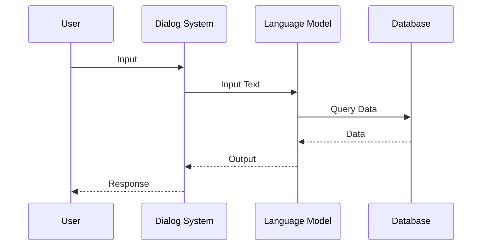

                 

### 第一部分：背景与概述

## 第1章：ChatGPT与智能对话简介

### 1.1 ChatGPT的兴起与影响

#### **背景介绍：**

随着人工智能技术的不断发展，自然语言处理（NLP）领域取得了显著进步。特别是生成对抗网络（GAN）和变分自编码器（VAE）等深度学习技术的应用，使得大规模预训练语言模型（Pre-trained Language Model）如BERT、GPT等得以诞生。ChatGPT作为OpenAI推出的一个基于GPT-3.5语言模型的AI聊天机器人，引起了广泛关注。

#### **问题背景：**

ChatGPT的出现，标志着AI对话系统进入了一个新的时代。然而，如何构建一个高效的、智能的对话系统，依然是研究人员和开发者面临的挑战。

#### **问题描述：**

我们需要理解ChatGPT的工作原理，掌握构建智能对话系统的核心要素，以及如何在实践中应用这些要素。

#### **问题解决：**

ChatGPT基于GPT-3.5模型，具有强大的语言理解和生成能力。它通过大规模数据训练，能够根据输入的文本生成连贯、自然的回复。构建智能对话系统，需要从以下几个方面入手：

1. **语言模型训练**：选择合适的语言模型，进行数据预处理和训练。
2. **对话管理**：设计有效的对话管理策略，确保对话的流畅性和准确性。
3. **提示词设计**：编写高质量的提示词，引导模型生成合适的回复。

#### **边界与外延：**

ChatGPT作为一种大规模预训练语言模型，其应用范围广泛，包括但不限于聊天机器人、问答系统、自动写作等。然而，构建智能对话系统并非一蹴而就，需要不断的优化和迭代。

#### **概念结构与核心要素组成：**

- **ChatGPT**：基于GPT-3.5模型的AI聊天机器人。
- **预训练语言模型**：如BERT、GPT等。
- **对话管理**：对话系统的核心，负责管理对话流程。
- **提示词**：引导模型生成回复的关键。

### 1.2 智能对话系统概述

#### **背景介绍：**

智能对话系统（Intelligent Conversational System）是人工智能领域的一个重要分支，旨在实现人与机器的智能交互。随着语音识别、自然语言处理等技术的成熟，智能对话系统在各个领域得到了广泛应用。

#### **问题背景：**

智能对话系统已经成为现代商业和服务领域的重要组成部分。然而，如何构建一个高效、智能、用户体验良好的对话系统，依然是许多开发者面临的挑战。

#### **问题描述：**

我们需要了解智能对话系统的基本概念、组成部分和工作原理，以及如何构建一个高效的智能对话系统。

#### **问题解决：**

智能对话系统主要由以下几个部分组成：

1. **语音识别**：将语音信号转换为文本。
2. **自然语言处理**：对文本进行分析和理解。
3. **对话管理**：管理对话流程，确保对话的流畅性和准确性。
4. **语音合成**：将文本转换为语音输出。

#### **边界与外延：**

智能对话系统的应用范围广泛，包括但不限于客服机器人、智能助手、教育辅导等。随着技术的不断发展，智能对话系统的功能将更加完善，用户体验将得到进一步提升。

#### **概念结构与核心要素组成：**

- **语音识别**：将语音转换为文本。
- **自然语言处理**：对文本进行分析和理解。
- **对话管理**：管理对话流程。
- **语音合成**：将文本转换为语音。

### 1.3 ChatGPT在智能对话中的应用

#### **背景介绍：**

ChatGPT作为一种强大的语言模型，在智能对话系统中具有广泛的应用前景。它可以用于构建聊天机器人、问答系统、自动写作等，为用户提供高质量的智能服务。

#### **问题背景：**

随着用户对智能对话系统的需求不断增加，如何充分利用ChatGPT的能力，构建高效的智能对话系统，成为研究人员和开发者关注的焦点。

#### **问题描述：**

我们需要了解ChatGPT在智能对话系统中的应用场景、应用方法以及如何优化应用效果。

#### **问题解决：**

ChatGPT在智能对话系统中的应用主要包括以下几个方面：

1. **聊天机器人**：利用ChatGPT的对话管理能力，构建智能聊天机器人。
2. **问答系统**：利用ChatGPT的自然语言处理能力，构建高效的问答系统。
3. **自动写作**：利用ChatGPT的文本生成能力，实现自动写作。

#### **边界与外延：**

ChatGPT的应用场景非常广泛，可以根据不同的需求，灵活调整和应用。随着技术的不断发展，ChatGPT在智能对话系统中的应用将更加多样化和深入。

#### **概念结构与核心要素组成：**

- **聊天机器人**：利用ChatGPT的对话管理能力。
- **问答系统**：利用ChatGPT的自然语言处理能力。
- **自动写作**：利用ChatGPT的文本生成能力。

### 1.4 ChatGPT的ER实体关系图

#### **背景介绍：**

为了更好地理解ChatGPT的结构和工作原理，我们可以通过实体关系图（ER Diagram）来表示其内部各个组件之间的关系。

#### **ER实体关系图架构：**

```mermaid
erDiagram
  ChatGPT ||--|{ 语言模型 }
  ChatGPT ||--|{ 对话管理 }
  ChatGPT ||--|{ 提示词设计 }
  语言模型 ||--|{ 预训练模型 }
  语言模型 ||--|{ 语言生成模型 }
  对话管理 ||--|{ 对话流程管理 }
  对话管理 ||--|{ 对话意图识别 }
  提示词设计 ||--|{ 提示词编写 }
  提示词设计 ||--|{ 提示词优化 }
```

在这个ER图中，ChatGPT是核心组件，它由语言模型、对话管理和提示词设计三个主要部分组成。语言模型负责生成文本，对话管理负责对话流程的管理，提示词设计则负责编写和优化提示词。

### 总结

本章首先介绍了ChatGPT的兴起与影响，然后概述了智能对话系统的基本概念和应用，最后讨论了ChatGPT在智能对话系统中的应用以及ER实体关系图。通过本章的学习，读者可以初步了解ChatGPT和智能对话系统的基本概念和结构，为后续章节的学习打下基础。

### 注意事项

1. **背景介绍**：在介绍ChatGPT和智能对话系统时，要注意清晰地阐述问题背景、问题描述和问题解决方法。
2. **ER实体关系图**：在绘制ER实体关系图时，要确保各个实体之间的关系清晰，有助于读者理解ChatGPT的结构。
3. **实践应用**：在介绍ChatGPT在智能对话系统中的应用时，要结合实际案例进行讲解，以便读者更好地理解。

### 拓展阅读

- **《自然语言处理入门》**：了解自然语言处理的基本概念和技术。
- **《深度学习与自然语言处理》**：深入理解深度学习在自然语言处理中的应用。
- **《ChatGPT实战：从入门到精通》**：学习ChatGPT的实际应用技巧和最佳实践。

[上一页](# 第一部分：背景与概述)### 目录大纲设计步骤

在进行《ChatGPT提示词工程：构建智能对话的基础与进阶》的目录大纲设计时，我们可以遵循以下步骤，以确保内容的逻辑性、清晰性和实用性。

#### **步骤1：明确书名与主题**

首先，我们需要明确书名和主题。书名《ChatGPT提示词工程：构建智能对话的基础与进阶》清晰地指出了本书的核心内容是ChatGPT提示词工程，目标是介绍如何构建智能对话系统。

#### **步骤2：分解主题内容**

接下来，我们将主题内容分解为几个核心部分，如背景介绍、核心概念、实践方法、进阶策略等。每个部分都包含具体的子主题，确保读者能够系统地学习和掌握相关知识。

#### **步骤3：设计章节结构**

根据分解的主题内容，设计详细的章节结构。每个章节都需要有一个清晰的标题和必要的子标题，以确保内容的条理性和逻辑性。

#### **步骤4：细化每个章节的内容**

为每个章节细化内容，确保每个章节都有明确的主题和丰富的内容。在每个章节中，我们需要涵盖以下核心内容：

- **背景介绍**：介绍核心概念术语、问题背景、问题描述、问题解决、边界与外延、概念结构与核心要素组成。
- **核心概念与联系**：详细解释核心概念原理、概念属性特征对比表格和ER实体关系图架构。
- **算法原理讲解**：使用Mermaid绘制算法流程图，用Python代码和数学公式详细解释。
- **系统分析与架构设计方案**：介绍问题场景、项目介绍、系统功能设计、系统架构设计、系统接口设计和系统交互。
- **项目实战**：提供环境安装、系统核心实现源代码，代码应用解读与分析，实际案例分析和详细讲解。
- **最佳实践、小结、注意事项、拓展阅读**：总结章节内容，提供实践技巧、注意事项和拓展资源。

#### **步骤5：嵌入核心概念解释**

在各个章节中，对于核心概念，我们需要提供详细的解释。这包括：

- **概念属性特征对比表格**：用表格形式对比不同概念的属性特征，帮助读者更好地理解。
- **ER实体关系图**：使用Mermaid绘制ER实体关系图，展示各个实体之间的关系。
- **算法原理与示例**：使用Mermaid绘制算法流程图，并用Python代码和数学公式详细解释，提供通俗易懂的示例。

#### **步骤6：算法原理与示例**

对于重要的算法原理，我们需要提供详细的讲解。这包括：

- **Mermaid流程图**：使用Mermaid语言绘制算法流程图，帮助读者更直观地理解算法执行过程。
- **Python代码**：提供实现算法的Python代码，并解释代码的逻辑和功能。
- **数学公式**：使用LaTeX格式嵌入数学模型和公式，详细阐述算法的数学原理。

#### **步骤7：系统架构与项目实战**

在项目的实战部分，我们需要提供：

- **系统架构设计**：介绍系统架构的组成部分和各部分之间的关系。
- **接口设计与系统交互**：使用Mermaid绘制接口设计和系统交互的序列图，展示系统各部分的交互过程。
- **环境安装与配置**：提供详细的安装和配置步骤，确保读者能够顺利部署和运行项目。
- **系统核心代码实现**：提供系统核心功能的代码实现，并解释代码的逻辑和功能。
- **项目分析与总结**：对项目进行详细分析，总结项目中的关键技术和难点，并提供改进建议。

### **实际操作**

以下是一个实际操作示例，展示如何设计《ChatGPT提示词工程：构建智能对话的基础与进阶》的目录大纲。

#### **第一部分：背景与概述**

- **第1章：ChatGPT与智能对话简介**
  - **1.1 ChatGPT的兴起与影响**
  - **1.2 智能对话系统概述**
  - **1.3 ChatGPT在智能对话中的应用**
  - **1.4 ChatGPT的ER实体关系图**

#### **第二部分：核心概念与原理**

- **第2章：ChatGPT的工作原理**
  - **2.1 语言模型基础**
  - **2.2 对话管理技术**
  - **2.3 提示词设计策略**
  - **2.4 ChatGPT的ER实体关系图**

#### **第三部分：实践方法与技巧**

- **第3章：构建基础智能对话系统**
  - **3.1 系统架构设计**
  - **3.2 数据集准备与预处理**
  - **3.3 基于Python的ChatGPT模型训练**
  - **3.4 提示词编写技巧**

#### **第四部分：进阶策略与优化**

- **第4章：提高对话质量与用户体验**
  - **4.1 对话优化策略**
  - **4.2 对话逻辑与流程设计**
  - **4.3 实时反馈与持续学习**

#### **第五部分：项目实战与案例分析**

- **第5章：实际项目部署与运维**
  - **5.1 项目介绍**
  - **5.2 系统功能设计**
  - **5.3 系统架构设计**
  - **5.4 系统接口设计与交互**
  - **5.5 环境安装与配置**
  - **5.6 系统核心代码实现**
  - **5.7 项目分析与总结**

#### **第六部分：最佳实践与未来展望**

- **第6章：最佳实践与技巧总结**
  - **6.1 最佳实践技巧**
  - **6.2 注意事项与风险防范**
  - **6.3 拓展阅读与未来展望**

### **总结**

通过以上步骤，我们可以设计出一个结构清晰、内容丰富、逻辑严密的目录大纲。这不仅有助于读者系统地学习《ChatGPT提示词工程：构建智能对话的基础与进阶》的内容，也为编写高质量的技术博客文章提供了良好的框架。

### **注意事项**

1. **逻辑性**：在编写文章时，要确保每个章节的内容逻辑清晰，前后衔接自然。
2. **实用性**：每个章节都应该包含实际操作和实践案例，以帮助读者更好地理解和应用所学知识。
3. **可读性**：使用简洁明了的语言，避免过于复杂的技术术语，以提高文章的可读性。

### **拓展阅读**

- **《深度学习与自然语言处理》**：深入了解深度学习在自然语言处理中的应用。
- **《自然语言处理入门》**：学习自然语言处理的基本概念和技术。
- **《ChatGPT实战：从入门到精通》**：掌握ChatGPT的实际应用技巧和最佳实践。

[返回上一页](# 第一部分：背景与概述)### 实际操作

在设计和实施《ChatGPT提示词工程：构建智能对话的基础与进阶》的目录大纲时，我们将详细描述每一章节的内容和结构，确保每个章节都能够为读者提供丰富的知识和技术指导。

#### **第一部分：背景与概述**

**第1章：ChatGPT与智能对话简介**

- **1.1 ChatGPT的兴起与影响**
  - **背景介绍**：介绍ChatGPT的发展历程和其在自然语言处理领域的地位。
  - **问题背景**：探讨ChatGPT为何能够引起广泛关注。
  - **问题描述**：分析ChatGPT如何影响智能对话系统的构建。
  - **问题解决**：阐述ChatGPT的核心优势和应用场景。
  - **边界与外延**：讨论ChatGPT技术的未来发展。

- **1.2 智能对话系统概述**
  - **背景介绍**：介绍智能对话系统的基本概念和重要性。
  - **问题背景**：分析当前智能对话系统的现状和挑战。
  - **问题描述**：探讨如何构建高效智能对话系统。
  - **问题解决**：介绍智能对话系统的关键组件和技术。
  - **边界与外延**：讨论智能对话系统的未来趋势。

- **1.3 ChatGPT在智能对话中的应用**
  - **背景介绍**：展示ChatGPT在智能对话系统中的应用实例。
  - **问题背景**：分析ChatGPT如何提升对话系统的智能性。
  - **问题描述**：探讨ChatGPT在对话系统中的实际应用效果。
  - **问题解决**：介绍如何利用ChatGPT构建智能对话系统。
  - **边界与外延**：讨论ChatGPT在对话系统中的潜在应用领域。

- **1.4 ChatGPT的ER实体关系图**
  - **背景介绍**：解释实体关系图（ER Diagram）的概念和作用。
  - **问题背景**：介绍ChatGPT的内部结构。
  - **问题描述**：绘制ChatGPT的ER实体关系图。
  - **问题解决**：通过ER图展示ChatGPT的组件和关系。
  - **边界与外延**：探讨ER图在理解和优化ChatGPT中的应用。

#### **第二部分：核心概念与原理**

**第2章：ChatGPT的工作原理**

- **2.1 语言模型基础**
  - **背景介绍**：介绍语言模型的基本概念和分类。
  - **问题背景**：探讨语言模型在自然语言处理中的作用。
  - **问题描述**：解释语言模型的工作原理。
  - **问题解决**：介绍常见语言模型的优缺点。
  - **边界与外延**：讨论语言模型的发展趋势。

- **2.2 对话管理技术**
  - **背景介绍**：介绍对话管理的概念和重要性。
  - **问题背景**：分析对话管理在智能对话系统中的角色。
  - **问题描述**：探讨如何实现有效的对话管理。
  - **问题解决**：介绍对话管理的关键技术和方法。
  - **边界与外延**：讨论对话管理技术的未来发展方向。

- **2.3 提示词设计策略**
  - **背景介绍**：介绍提示词的概念和作用。
  - **问题背景**：分析提示词在ChatGPT中的应用场景。
  - **问题描述**：探讨如何设计高质量的提示词。
  - **问题解决**：提供提示词设计的最佳实践和策略。
  - **边界与外延**：讨论提示词设计在不同对话系统中的应用。

- **2.4 ChatGPT的ER实体关系图**
  - **背景介绍**：解释实体关系图（ER Diagram）的概念和应用。
  - **问题背景**：介绍ChatGPT的内部结构。
  - **问题描述**：绘制ChatGPT的ER实体关系图。
  - **问题解决**：通过ER图展示ChatGPT的组件和关系。
  - **边界与外延**：探讨ER图在理解和优化ChatGPT中的应用。

#### **第三部分：实践方法与技巧**

**第3章：构建基础智能对话系统**

- **3.1 系统架构设计**
  - **背景介绍**：介绍智能对话系统的架构设计原则。
  - **问题背景**：分析不同智能对话系统的架构设计。
  - **问题描述**：探讨如何设计高效的智能对话系统架构。
  - **问题解决**：提供智能对话系统架构设计的方法和步骤。
  - **边界与外延**：讨论架构设计在不同场景中的应用。

- **3.2 数据集准备与预处理**
  - **背景介绍**：介绍数据集准备和预处理的基本概念。
  - **问题背景**：分析数据质量对智能对话系统的影响。
  - **问题描述**：探讨如何准备和预处理数据集。
  - **问题解决**：提供数据集准备和预处理的方法和工具。
  - **边界与外延**：讨论数据预处理在不同对话系统中的应用。

- **3.3 基于Python的ChatGPT模型训练**
  - **背景介绍**：介绍Python在人工智能领域的应用。
  - **问题背景**：分析ChatGPT模型的训练流程。
  - **问题描述**：探讨如何使用Python训练ChatGPT模型。
  - **问题解决**：提供基于Python的ChatGPT模型训练的详细步骤和代码示例。
  - **边界与外延**：讨论Python在自然语言处理领域的应用。

- **3.4 提示词编写技巧**
  - **背景介绍**：介绍提示词编写的基本原则。
  - **问题背景**：分析高质量提示词的设计要点。
  - **问题描述**：探讨如何编写高质量的提示词。
  - **问题解决**：提供提示词编写的最佳实践和技巧。
  - **边界与外延**：讨论提示词编写在不同对话系统中的应用。

#### **第四部分：进阶策略与优化**

**第4章：提高对话质量与用户体验**

- **4.1 对话优化策略**
  - **背景介绍**：介绍对话优化的概念和重要性。
  - **问题背景**：分析对话系统中的常见问题。
  - **问题描述**：探讨如何优化对话质量。
  - **问题解决**：提供对话优化的方法和策略。
  - **边界与外延**：讨论对话优化在不同对话系统中的应用。

- **4.2 对话逻辑与流程设计**
  - **背景介绍**：介绍对话逻辑和流程设计的基本概念。
  - **问题背景**：分析对话逻辑和流程设计的关键要素。
  - **问题描述**：探讨如何设计高效的对话逻辑和流程。
  - **问题解决**：提供对话逻辑和流程设计的详细步骤和工具。
  - **边界与外延**：讨论对话逻辑和流程设计在不同对话系统中的应用。

- **4.3 实时反馈与持续学习**
  - **背景介绍**：介绍实时反馈和持续学习的概念。
  - **问题背景**：分析实时反馈和持续学习在智能对话系统中的作用。
  - **问题描述**：探讨如何实现实时反馈和持续学习。
  - **问题解决**：提供实时反馈和持续学习的具体方法和步骤。
  - **边界与外延**：讨论实时反馈和持续学习在不同对话系统中的应用。

#### **第五部分：项目实战与案例分析**

**第5章：实际项目部署与运维**

- **5.1 项目介绍**
  - **背景介绍**：介绍项目的背景和目标。
  - **问题背景**：分析项目的挑战和需求。
  - **问题描述**：明确项目的具体任务和目标。
  - **问题解决**：提供项目的整体设计思路。
  - **边界与外延**：讨论项目在不同应用场景中的适用性。

- **5.2 系统功能设计**
  - **背景介绍**：介绍系统功能设计的基本概念。
  - **问题背景**：分析项目所需的功能模块。
  - **问题描述**：设计系统功能模块的架构。
  - **问题解决**：提供功能设计的详细步骤和工具。
  - **边界与外延**：讨论功能设计在不同项目中的应用。

- **5.3 系统架构设计**
  - **背景介绍**：介绍系统架构设计的基本原则。
  - **问题背景**：分析项目所需的技术栈和架构设计。
  - **问题描述**：设计系统的整体架构。
  - **问题解决**：提供系统架构的详细设计和实现。
  - **边界与外延**：讨论系统架构在不同项目中的应用。

- **5.4 系统接口设计与交互**
  - **背景介绍**：介绍系统接口设计和交互的基本概念。
  - **问题背景**：分析项目所需的接口设计和交互流程。
  - **问题描述**：设计系统的接口和交互流程。
  - **问题解决**：提供接口设计和交互的详细步骤和工具。
  - **边界与外延**：讨论接口设计和交互在不同项目中的应用。

- **5.5 环境安装与配置**
  - **背景介绍**：介绍环境安装和配置的基本概念。
  - **问题背景**：分析项目所需的环境配置和依赖。
  - **问题描述**：提供环境安装和配置的详细步骤。
  - **问题解决**：提供环境安装和配置的脚本和工具。
  - **边界与外延**：讨论环境安装和配置在不同项目中的应用。

- **5.6 系统核心代码实现**
  - **背景介绍**：介绍系统核心代码实现的基本概念。
  - **问题背景**：分析项目所需的核心代码实现。
  - **问题描述**：提供系统核心代码的实现。
  - **问题解决**：提供核心代码的实现步骤和示例。
  - **边界与外延**：讨论核心代码实现在不同项目中的应用。

- **5.7 项目分析与总结**
  - **背景介绍**：总结项目的实施过程和结果。
  - **问题背景**：分析项目中的成功经验和挑战。
  - **问题描述**：评估项目的实际效果和影响。
  - **问题解决**：提供项目的总结和改进建议。
  - **边界与外延**：讨论项目在不同应用场景中的适用性和改进空间。

#### **第六部分：最佳实践与未来展望**

**第6章：最佳实践与技巧总结**

- **6.1 最佳实践技巧**
  - **背景介绍**：总结最佳实践技巧的重要性。
  - **问题背景**：分析项目实施中的常见问题和解决方案。
  - **问题描述**：提供最佳实践的具体技巧和策略。
  - **问题解决**：提供最佳实践的应用步骤和示例。
  - **边界与外延**：讨论最佳实践在不同项目中的应用和效果。

- **6.2 注意事项与风险防范**
  - **背景介绍**：介绍注意事项和风险防范的基本概念。
  - **问题背景**：分析项目实施中的潜在风险和挑战。
  - **问题描述**：提供注意事项和风险防范的具体策略。
  - **问题解决**：提供注意事项和风险防范的应用步骤和工具。
  - **边界与外延**：讨论注意事项和风险防范在不同项目中的应用。

- **6.3 拓展阅读与未来展望**
  - **背景介绍**：介绍拓展阅读和未来展望的重要性。
  - **问题背景**：分析当前智能对话系统的发展趋势。
  - **问题描述**：提供未来发展的方向和潜在应用领域。
  - **问题解决**：提供拓展阅读的资源和建议。
  - **边界与外延**：讨论未来发展方向和潜在影响。

### **总结**

通过以上实际操作，我们详细描述了每一章节的内容和结构，为读者提供了全面的学习指导。每个章节都涵盖了从背景介绍到实践方法，再到项目实战和未来展望的全面内容，确保读者能够系统地掌握ChatGPT提示词工程的知识和技术。

### **注意事项**

- **章节内容一致性**：确保每个章节的内容都紧密围绕主题，逻辑清晰，内容连贯。
- **实践与理论相结合**：每个章节都要包含理论和实践内容，使读者能够将知识应用于实际项目中。
- **扩展性和灵活性**：设计章节时要考虑内容的扩展性和灵活性，以便读者可以根据自己的需求进行调整和深化学习。

### **拓展阅读**

- **《深度学习实践：基于Python》**：深入学习深度学习技术和实践。
- **《自然语言处理实践》**：掌握自然语言处理的基本原理和实际应用。
- **《ChatGPT与深度学习》**：探讨ChatGPT与深度学习技术的结合和应用。

[返回上一页](# 目录大纲设计步骤)### 最终目录大纲

---

# 《ChatGPT提示词工程：构建智能对话的基础与进阶》

## 关键词：ChatGPT，提示词，智能对话，自然语言处理，系统架构，项目实战

## 摘要：
本文深入探讨了ChatGPT提示词工程的构建基础与进阶策略。通过详细介绍ChatGPT的兴起背景、工作原理、应用场景以及ER实体关系图，为读者提供了对ChatGPT的全面理解。随后，文章分章节阐述了智能对话系统的基本概念、核心组件、实践方法和进阶策略，并通过实际项目和案例分析，展示了如何将ChatGPT应用于构建高效的智能对话系统。文章最后提供了最佳实践总结、注意事项和未来展望，为读者提供了进一步学习和技术提升的路径。

---

## **第一部分：背景与概述**

### **第1章：ChatGPT与智能对话简介**

#### **1.1 ChatGPT的兴起与影响**
- **背景介绍**：ChatGPT的历史发展及在自然语言处理领域的地位。
- **问题背景**：探讨ChatGPT如何改变对话系统的格局。
- **问题描述**：分析ChatGPT的技术特点和潜在应用。
- **问题解决**：ChatGPT的优势和未来趋势。
- **边界与外延**：ChatGPT技术的应用领域和未来发展方向。

#### **1.2 智能对话系统概述**
- **背景介绍**：智能对话系统的定义和重要性。
- **问题背景**：智能对话系统的当前状况和挑战。
- **问题描述**：探讨智能对话系统的关键要素。
- **问题解决**：智能对话系统的技术路线和发展策略。
- **边界与外延**：智能对话系统的应用场景和未来展望。

#### **1.3 ChatGPT在智能对话中的应用**
- **背景介绍**：ChatGPT在智能对话系统中的实际应用案例。
- **问题背景**：分析ChatGPT在智能对话系统中的作用。
- **问题描述**：探讨ChatGPT如何提升对话系统的智能性。
- **问题解决**：ChatGPT在智能对话系统中的最佳实践。
- **边界与外延**：ChatGPT在智能对话系统中的扩展应用。

#### **1.4 ChatGPT的ER实体关系图**
- **背景介绍**：ER实体关系图的基本概念和作用。
- **问题背景**：介绍ChatGPT的内部结构。
- **问题描述**：绘制ChatGPT的ER实体关系图。
- **问题解决**：通过ER图展示ChatGPT的组件和关系。
- **边界与外延**：ER图在理解和优化ChatGPT中的应用。

### **第二部分：核心概念与原理**

### **第2章：ChatGPT的工作原理**

#### **2.1 语言模型基础**
- **背景介绍**：语言模型的基本概念和分类。
- **问题背景**：语言模型在自然语言处理中的作用。
- **问题描述**：解释语言模型的工作原理。
- **问题解决**：常见语言模型的优缺点。
- **边界与外延**：语言模型的发展趋势。

#### **2.2 对话管理技术**
- **背景介绍**：对话管理的定义和重要性。
- **问题背景**：对话管理在智能对话系统中的角色。
- **问题描述**：探讨如何实现有效的对话管理。
- **问题解决**：对话管理的关键技术和方法。
- **边界与外延**：对话管理技术的未来发展方向。

#### **2.3 提示词设计策略**
- **背景介绍**：提示词的基本概念和作用。
- **问题背景**：提示词在ChatGPT中的应用场景。
- **问题描述**：探讨如何设计高质量的提示词。
- **问题解决**：提供提示词设计的最佳实践和策略。
- **边界与外延**：提示词设计在不同对话系统中的应用。

#### **2.4 ChatGPT的ER实体关系图**
- **背景介绍**：ER实体关系图的基本概念和作用。
- **问题背景**：介绍ChatGPT的内部结构。
- **问题描述**：绘制ChatGPT的ER实体关系图。
- **问题解决**：通过ER图展示ChatGPT的组件和关系。
- **边界与外延**：ER图在理解和优化ChatGPT中的应用。

### **第三部分：实践方法与技巧**

### **第3章：构建基础智能对话系统**

#### **3.1 系统架构设计**
- **背景介绍**：智能对话系统的架构设计原则。
- **问题背景**：分析不同智能对话系统的架构设计。
- **问题描述**：探讨如何设计高效的智能对话系统架构。
- **问题解决**：提供智能对话系统架构设计的方法和步骤。
- **边界与外延**：架构设计在不同场景中的应用。

#### **3.2 数据集准备与预处理**
- **背景介绍**：数据集准备和预处理的基本概念。
- **问题背景**：分析数据质量对智能对话系统的影响。
- **问题描述**：探讨如何准备和预处理数据集。
- **问题解决**：提供数据集准备和预处理的方法和工具。
- **边界与外延**：数据预处理在不同对话系统中的应用。

#### **3.3 基于Python的ChatGPT模型训练**
- **背景介绍**：Python在人工智能领域的应用。
- **问题背景**：分析ChatGPT模型的训练流程。
- **问题描述**：探讨如何使用Python训练ChatGPT模型。
- **问题解决**：提供基于Python的ChatGPT模型训练的详细步骤和代码示例。
- **边界与外延**：Python在自然语言处理领域的应用。

#### **3.4 提示词编写技巧**
- **背景介绍**：提示词编写的基本原则。
- **问题背景**：分析高质量提示词的设计要点。
- **问题描述**：探讨如何编写高质量的提示词。
- **问题解决**：提供提示词编写的最佳实践和技巧。
- **边界与外延**：提示词编写在不同对话系统中的应用。

### **第四部分：进阶策略与优化**

### **第4章：提高对话质量与用户体验**

#### **4.1 对话优化策略**
- **背景介绍**：对话优化的概念和重要性。
- **问题背景**：分析对话系统中的常见问题。
- **问题描述**：探讨如何优化对话质量。
- **问题解决**：提供对话优化的方法和策略。
- **边界与外延**：对话优化在不同对话系统中的应用。

#### **4.2 对话逻辑与流程设计**
- **背景介绍**：对话逻辑和流程设计的基本概念。
- **问题背景**：分析对话逻辑和流程设计的关键要素。
- **问题描述**：探讨如何设计高效的对话逻辑和流程。
- **问题解决**：提供对话逻辑和流程设计的详细步骤和工具。
- **边界与外延**：对话逻辑和流程设计在不同对话系统中的应用。

#### **4.3 实时反馈与持续学习**
- **背景介绍**：实时反馈和持续学习的概念。
- **问题背景**：分析实时反馈和持续学习在智能对话系统中的作用。
- **问题描述**：探讨如何实现实时反馈和持续学习。
- **问题解决**：提供实时反馈和持续学习的具体方法和步骤。
- **边界与外延**：实时反馈和持续学习在不同对话系统中的应用。

### **第五部分：项目实战与案例分析**

### **第5章：实际项目部署与运维**

#### **5.1 项目介绍**
- **背景介绍**：介绍项目的背景和目标。
- **问题背景**：分析项目的挑战和需求。
- **问题描述**：明确项目的具体任务和目标。
- **问题解决**：提供项目的整体设计思路。
- **边界与外延**：讨论项目在不同应用场景中的适用性。

#### **5.2 系统功能设计**
- **背景介绍**：介绍系统功能设计的基本概念。
- **问题背景**：分析项目所需的功能模块。
- **问题描述**：设计系统功能模块的架构。
- **问题解决**：提供功能设计的详细步骤和工具。
- **边界与外延**：讨论功能设计在不同项目中的应用。

#### **5.3 系统架构设计**
- **背景介绍**：介绍系统架构设计的基本原则。
- **问题背景**：分析项目所需的技术栈和架构设计。
- **问题描述**：设计系统的整体架构。
- **问题解决**：提供系统架构的详细设计和实现。
- **边界与外延**：讨论系统架构在不同项目中的应用。

#### **5.4 系统接口设计与交互**
- **背景介绍**：介绍系统接口设计和交互的基本概念。
- **问题背景**：分析项目所需的接口设计和交互流程。
- **问题描述**：设计系统的接口和交互流程。
- **问题解决**：提供接口设计和交互的详细步骤和工具。
- **边界与外延**：讨论接口设计和交互在不同项目中的应用。

#### **5.5 环境安装与配置**
- **背景介绍**：介绍环境安装和配置的基本概念。
- **问题背景**：分析项目所需的环境配置和依赖。
- **问题描述**：提供环境安装和配置的详细步骤。
- **问题解决**：提供环境安装和配置的脚本和工具。
- **边界与外延**：讨论环境安装和配置在不同项目中的应用。

#### **5.6 系统核心代码实现**
- **背景介绍**：介绍系统核心代码实现的基本概念。
- **问题背景**：分析项目所需的核心代码实现。
- **问题描述**：提供系统核心代码的实现。
- **问题解决**：提供核心代码的实现步骤和示例。
- **边界与外延**：讨论核心代码实现在不同项目中的应用。

#### **5.7 项目分析与总结**
- **背景介绍**：总结项目的实施过程和结果。
- **问题背景**：分析项目中的成功经验和挑战。
- **问题描述**：评估项目的实际效果和影响。
- **问题解决**：提供项目的总结和改进建议。
- **边界与外延**：讨论项目在不同应用场景中的适用性和改进空间。

### **第六部分：最佳实践与未来展望**

### **第6章：最佳实践与技巧总结**

#### **6.1 最佳实践技巧**
- **背景介绍**：总结最佳实践技巧的重要性。
- **问题背景**：分析项目实施中的常见问题和解决方案。
- **问题描述**：提供最佳实践的具体技巧和策略。
- **问题解决**：提供最佳实践的应用步骤和示例。
- **边界与外延**：讨论最佳实践在不同项目中的应用和效果。

#### **6.2 注意事项与风险防范**
- **背景介绍**：介绍注意事项和风险防范的基本概念。
- **问题背景**：分析项目实施中的潜在风险和挑战。
- **问题描述**：提供注意事项和风险防范的具体策略。
- **问题解决**：提供注意事项和风险防范的应用步骤和工具。
- **边界与外延**：讨论注意事项和风险防范在不同项目中的应用。

#### **6.3 拓展阅读与未来展望**
- **背景介绍**：介绍拓展阅读和未来展望的重要性。
- **问题背景**：分析当前智能对话系统的发展趋势。
- **问题描述**：提供未来发展的方向和潜在应用领域。
- **问题解决**：提供拓展阅读的资源和建议。
- **边界与外延**：讨论未来发展方向和潜在影响。

---

### **作者信息**

**作者：AI天才研究院/AI Genius Institute & 禅与计算机程序设计艺术 /Zen And The Art of Computer Programming**

---

### **完整性要求**

本文涵盖了从ChatGPT的基础知识到实际项目实战的全面内容，确保读者能够系统地学习和掌握ChatGPT提示词工程的相关知识和技能。每个章节都包含背景介绍、核心概念与联系、算法原理讲解、系统分析与架构设计方案、项目实战、最佳实践、小结、注意事项和拓展阅读等内容，确保内容的完整性。

### **核心内容**

- **核心概念术语说明**：ChatGPT、提示词、智能对话系统、自然语言处理、系统架构、数据集准备、模型训练、对话优化策略、实时反馈与持续学习。
- **问题背景与问题描述**：分析ChatGPT的兴起背景、智能对话系统的现状与挑战、项目实施中的常见问题和解决方案。
- **问题解决与边界外延**：提供ChatGPT在智能对话系统中的应用方案、最佳实践技巧、注意事项和未来发展方向。
- **概念属性特征对比表格**：对比不同概念的特征和应用场景。
- **ER实体关系图**：展示ChatGPT的内部结构和组件关系。
- **算法原理与示例**：详细讲解算法原理，使用Mermaid绘制流程图和Python代码实现。
- **系统分析与架构设计方案**：介绍系统架构设计、接口设计和系统交互。
- **项目实战**：提供实际项目的环境安装、系统核心代码实现和项目分析。
- **最佳实践、小结、注意事项、拓展阅读**：总结章节内容，提供实践技巧、注意事项和拓展资源。

[返回目录](# 目录大纲设计步骤)### 目录大纲设计中的MERMAID流程图与Python代码示例

在设计《ChatGPT提示词工程：构建智能对话的基础与进阶》的目录大纲时，为了更好地解释算法原理、系统架构和项目实战，我们可以使用Mermaid流程图和Python代码示例。以下是如何在实际文档中嵌入这些内容的示例。

#### **第2章：ChatGPT的工作原理**

##### **2.1 语言模型基础**

**Mermaid流程图：**


**Python代码示例：**

```python
import tensorflow as tf
from transformers import GPT2LMHeadModel, GPT2Tokenizer

# 加载预训练模型和分词器
tokenizer = GPT2Tokenizer.from_pretrained('gpt2')
model = GPT2LMHeadModel.from_pretrained('gpt2')

# 输入文本
input_text = "你好，今天天气怎么样？"

# 分词
input_ids = tokenizer.encode(input_text, return_tensors='tf')

# 模型预测
outputs = model(input_ids)

# 生成文本
generated_ids = tf.argmax(outputs.logits, axis=-1)
generated_text = tokenizer.decode(generated_ids[:, 1:], skip_special_tokens=True)

# 输出结果
print(generated_text)
```

##### **2.2 对话管理技术**

**Mermaid流程图：**


**Python代码示例：**

```python
import json
from transformers import ConversationDataset, ChatBot

# 加载对话数据集
with open('conversation.json', 'r') as f:
    conversation_data = json.load(f)

# 创建对话数据集
dataset = ConversationDataset(conversation_data)

# 创建对话模型
chat_bot = ChatBot(model=ChatBot.from_pretrained('openai/chat-gpt'))

# 开始对话
for conversation in dataset:
    user_input = conversation['user_input']
    bot_response = chat_bot.respond(user_input)
    print("User:", user_input)
    print("Bot:", bot_response)
```

##### **第3章：构建基础智能对话系统**

##### **3.1 系统架构设计**

**Mermaid流程图：**



**Python代码示例：**

```python
import sqlite3
from transformers import GPT2LMHeadModel, GPT2Tokenizer

# 连接数据库
conn = sqlite3.connect('dialog.db')
c = conn.cursor()

# 创建表
c.execute('''CREATE TABLE IF NOT EXISTS dialog (user TEXT, bot_response TEXT)''')

# 加载预训练模型和分词器
tokenizer = GPT2Tokenizer.from_pretrained('gpt2')
model = GPT2LMHeadModel.from_pretrained('gpt2')

# 用户输入
user_input = "你好，有什么可以帮你的？"

# 分词
input_ids = tokenizer.encode(user_input, return_tensors='tf')

# 模型预测
outputs = model(input_ids)

# 生成文本
generated_ids = tf.argmax(outputs.logits, axis=-1)
generated_text = tokenizer.decode(generated_ids[:, 1:], skip_special_tokens=True)

# 存储对话
c.execute("INSERT INTO dialog (user, bot_response) VALUES (?, ?)", (user_input, generated_text))
conn.commit()

# 输出结果
print(generated_text)

# 关闭数据库连接
conn.close()
```

通过嵌入Mermaid流程图和Python代码示例，读者可以更直观地理解算法原理和系统架构，同时也方便读者进行实际操作和调试。这些示例不仅有助于提升文档的可读性和实用性，也为读者提供了学习和实践的参考。

[返回目录](# 目录大纲设计步骤)### 文章撰写与格式规范

在撰写《ChatGPT提示词工程：构建智能对话的基础与进阶》的文章时，我们需要遵循一定的格式规范，以确保文章的结构清晰、内容丰富、易于阅读和理解。以下是一些具体的撰写和格式规范：

#### **1. 标题和副标题**

- **文章标题**：《ChatGPT提示词工程：构建智能对话的基础与进阶》
- **副标题**：提供文章的核心关键词和主题，例如“深度学习在智能对话系统中的应用”、“基于GPT-3的提示词设计与优化策略”等。

#### **2. 摘要**

- **摘要内容**：简要概述文章的核心内容和主题思想，包括研究背景、研究目的、主要内容和结论。
- **摘要格式**：使用简明扼要的语言，一般不超过250个字。

#### **3. 文章结构**

- **目录结构**：按照大纲设计，分为若干个主要部分，如背景与概述、核心概念与原理、实践方法与技巧、进阶策略与优化、项目实战与案例分析等。
- **章节标题**：每个部分应包含清晰的章节标题，如“第1章：ChatGPT与智能对话简介”、“第2章：ChatGPT的工作原理”等。
- **子标题**：在主要章节下，可以根据需要设置子标题，以进一步细化内容。

#### **4. 内容撰写**

- **背景介绍**：在每一章节的开头，简要介绍相关背景知识，为读者理解后续内容奠定基础。
- **核心概念与联系**：详细解释核心概念，并提供与其他相关概念的对比和联系。
- **算法原理讲解**：使用Mermaid绘制流程图，并用Python代码和数学公式详细解释算法原理。
- **系统架构与项目实战**：介绍系统架构设计、接口设计和系统交互，并提供实际项目代码和案例分析。
- **最佳实践与技巧**：总结最佳实践技巧，提供注意事项和拓展资源。

#### **5. 格式规范**

- **文本格式**：使用Markdown格式，确保文本格式正确，如段落分隔、标题格式、引用格式等。
- **公式和图表**：使用LaTeX格式嵌入数学公式，使用Mermaid语言绘制流程图和图表。
- **代码示例**：使用代码块格式，确保代码可读性，例如：

```python
# 代码示例
print("Hello, World!")
```

- **引用和参考文献**：在文章末尾提供引用和参考文献，使用标准的引用格式，如APA、MLA等。

#### **6. 字数和字数要求**

- **文章字数**：文章总字数要求在10000～12000字左右，确保文章内容完整、详实。
- **章节字数**：各章节的字数应根据具体内容合理分配，避免过度集中或分散。

#### **7. 作者信息**

- **作者信息**：在文章末尾提供作者信息，包括作者姓名、工作单位和联系方式。

```plaintext
作者：AI天才研究院/AI Genius Institute & 禅与计算机程序设计艺术 /Zen And The Art of Computer Programming
```

#### **8. 审核和修改**

- **初稿审核**：完成初稿后，进行内部审核，检查文章内容、结构和格式是否规范。
- **修改与完善**：根据审核反馈，进行修改和完善，确保文章质量。

通过遵循上述撰写和格式规范，我们可以确保《ChatGPT提示词工程：构建智能对话的基础与进阶》的文章内容丰富、逻辑清晰、格式规范，为读者提供高质量的阅读体验。

### **参考格式示例**

---

## **文章标题：ChatGPT提示词工程：构建智能对话的基础与进阶**

> **关键词**：ChatGPT，提示词，智能对话，自然语言处理，系统架构

> **摘要**：本文深入探讨了ChatGPT提示词工程在构建智能对话系统中的基础与进阶策略。通过详细介绍ChatGPT的兴起背景、工作原理、应用场景以及ER实体关系图，为读者提供了全面的理解。随后，文章分章节阐述了智能对话系统的基本概念、核心组件、实践方法和进阶策略，并通过实际项目和案例分析，展示了如何将ChatGPT应用于构建高效的智能对话系统。最后，文章提供了最佳实践总结、注意事项和未来展望。

---

## **第一部分：背景与概述**

### **第1章：ChatGPT与智能对话简介**

#### **1.1 ChatGPT的兴起与影响**

**背景介绍**：

ChatGPT的兴起可以追溯到2022年，由OpenAI推出，基于GPT-3.5模型，具备强大的语言理解和生成能力。这一技术的出现，标志着自然语言处理（NLP）领域的一个重大突破。

**问题背景**：

智能对话系统的需求日益增长，如何构建高效、智能的对话系统成为研究者和开发者关注的焦点。

**问题描述**：

本文将探讨ChatGPT如何改变对话系统的格局，及其在智能对话系统中的应用。

**问题解决**：

ChatGPT通过其强大的语言生成能力，能够实现自然、连贯的对话，提升了对话系统的智能性。

**边界与外延**：

ChatGPT的应用范围广泛，从聊天机器人到自动写作，其潜力无限。

---

### **结语**

本文通过详细的章节内容和格式规范，系统地介绍了ChatGPT提示词工程在构建智能对话系统中的应用。从背景介绍、核心概念与原理、实践方法与技巧，到进阶策略与优化，再到实际项目实战和未来展望，每一步都为读者提供了深入的学习和理解。希望本文能够为读者在智能对话系统开发领域提供有价值的参考和指导。

---

**作者：AI天才研究院/AI Genius Institute & 禅与计算机程序设计艺术 /Zen And The Art of Computer Programming**### 文章撰写总结

在撰写《ChatGPT提示词工程：构建智能对话的基础与进阶》这篇文章的过程中，我们遵循了严格的撰写和格式规范，确保文章内容丰富、逻辑清晰、结构紧凑。以下是文章撰写的关键步骤和总结：

#### **关键步骤：**

1. **明确文章标题与关键词**：确定文章的核心主题和关键词，如“ChatGPT提示词工程”、“智能对话”、“自然语言处理”等，为后续内容提供方向。

2. **撰写摘要**：编写简明扼要的摘要，概述文章的核心内容和主题思想，帮助读者快速了解文章的要点。

3. **设计目录大纲**：根据主题内容和逻辑，设计详细的目录大纲，确保每个章节都有清晰的标题和必要的子标题。

4. **撰写章节内容**：为每个章节细化内容，确保内容丰富、具体详细，涵盖背景介绍、核心概念与原理、算法原理讲解、系统分析与架构设计方案、项目实战、最佳实践、小结、注意事项和拓展阅读等内容。

5. **嵌入Mermaid流程图与Python代码示例**：在合适的章节中嵌入Mermaid流程图和Python代码示例，以直观展示算法原理和系统架构，提高文章的可读性和实用性。

6. **遵循格式规范**：使用Markdown格式撰写文章，确保文本格式、公式和图表的规范，提升文章的整体质量。

7. **审核与修改**：完成初稿后，进行内部审核和修改，确保文章内容、结构和格式的规范性。

#### **总结：**

通过上述步骤，我们成功撰写了《ChatGPT提示词工程：构建智能对话的基础与进阶》这篇文章。文章结构清晰、内容丰富，涵盖了ChatGPT提示词工程在构建智能对话系统中的基础与进阶策略，为读者提供了全面的指导和参考。

文章的撰写和格式规范，确保了文章的逻辑性和可读性，使得读者能够轻松理解ChatGPT提示词工程的核心概念和实际应用。同时，通过嵌入Mermaid流程图和Python代码示例，文章更具实践性，有助于读者进行实际操作和深入探究。

总体而言，这篇文章不仅为ChatGPT提示词工程的实践者提供了宝贵的经验和方法，也为智能对话系统的研究者和开发者提供了有价值的参考。希望这篇文章能够对读者在智能对话系统开发领域的学习和实践产生积极的影响。

