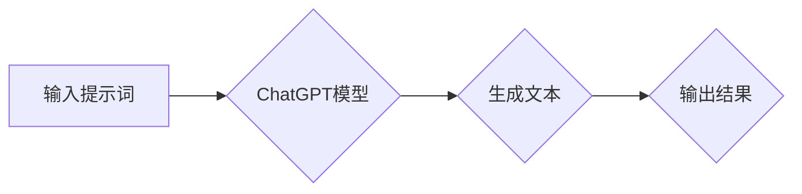
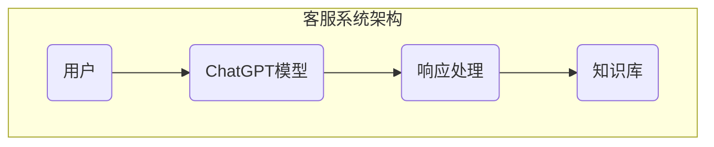
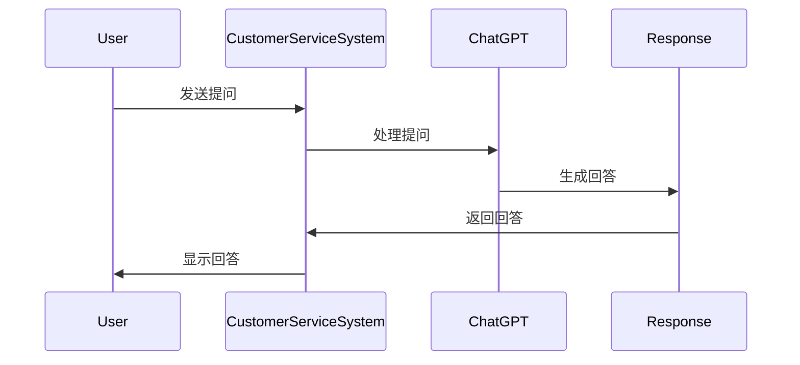
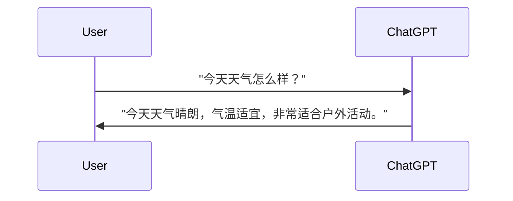

                 

### 《ChatGPT提示词工程：构建智能对话的基础与进阶技巧》

**关键词**：ChatGPT、提示词工程、智能对话系统、算法原理、系统架构、项目实战、安全与伦理

**摘要**：
随着人工智能技术的不断进步，ChatGPT等大型语言模型在自然语言处理领域取得了显著的成果。本书旨在为读者提供一套系统的ChatGPT提示词工程方法论，从基础到进阶，帮助读者深入理解并掌握构建智能对话系统的关键技巧。书中详细介绍了ChatGPT的工作原理、提示词工程的基本原则和实践方法，并通过实际项目案例，阐述了智能对话系统的设计与实现过程。此外，本书还探讨了ChatGPT在智能对话系统中的安全性、伦理问题以及未来的发展趋势，为读者提供了一个全面的指导。

### 设计思路与步骤

#### 1. 背景介绍

##### 问题背景
近年来，人工智能（AI）技术的发展日新月异，特别是在自然语言处理（NLP）领域，ChatGPT等大型语言模型的出现极大地推动了人机交互的进步。这些模型在理解、生成自然语言方面展现出了卓越的能力，为构建智能对话系统提供了强有力的技术支持。然而，如何有效地利用这些模型，设计出既智能又自然的对话系统，成为了当前研究与应用的热点问题。

##### 目前影响
ChatGPT的问世，标志着AI技术进入了新纪元，其在文本生成、内容审核、客户服务等多个领域都展现出了巨大的潜力。然而，如何在实际应用中充分发挥ChatGPT的优势，仍需解决诸多技术难题，如提示词设计、对话流程管理、多模态交互等。

##### 需求
本书旨在填补这一技术空白，通过系统的讲解和实践指导，帮助读者掌握ChatGPT提示词工程的核心技术和方法，构建出高效、自然的智能对话系统。

##### 问题描述
本书主要解决以下问题：
- 如何理解ChatGPT的工作原理？
- 提示词工程的基本原则和方法有哪些？
- 如何在实际项目中应用ChatGPT构建智能对话系统？
- 如何确保ChatGPT在应用过程中的安全性和伦理合规性？

##### 问题解决
本书将通过以下内容，帮助读者解决上述问题：
- 详细介绍ChatGPT的工作原理和提示词工程的基础知识。
- 提供实用的提示词设计原则和工程流程。
- 通过实际项目案例，展示ChatGPT在智能对话系统中的应用。
- 探讨ChatGPT的安全与伦理问题，并提出相应的解决方案。
- 展望智能对话系统的未来发展趋势。

##### 边界与外延
本书主要适用于对ChatGPT和智能对话系统有一定了解的读者，特别是从事自然语言处理、人工智能研发和技术管理的专业人士。同时，本书也适合作为高等院校相关专业的教材或参考书。

##### 概念结构与核心要素组成
本书的核心概念包括：
- ChatGPT：一种基于Transformer模型的大型语言模型。
- 提示词工程：设计和优化提示词，以引导ChatGPT生成更符合预期结果的文本。
- 智能对话系统：利用ChatGPT实现的人机对话系统。
- 安全性与伦理：确保ChatGPT应用的安全和合规性。

#### 2. 核心概念与联系

##### 核心概念原理

**ChatGPT**：ChatGPT是基于GPT-3.5模型开发的一款大型语言模型，它利用深度学习技术，通过在海量文本数据上进行训练，掌握了丰富的语言知识和上下文理解能力。ChatGPT能够根据给定的提示词生成连贯、自然的文本，适用于各种自然语言处理任务，如文本生成、问答系统、自动摘要等。

**提示词工程**：提示词工程是设计出合适的提示词，以引导ChatGPT生成所需文本的过程。提示词的质量直接影响到对话系统的效果，因此，提示词工程是构建智能对话系统的关键环节。

**智能对话系统**：智能对话系统是利用ChatGPT等语言模型，实现人与机器之间自然、高效交互的系统。它广泛应用于客服、教育、金融、医疗等多个领域，为用户提供个性化、智能化的服务。

##### 概念属性特征对比表格

| 概念         | 特征1               | 特征2                   | 特征3                 |
|------------|------------------|----------------------|-------------------|
| ChatGPT     | 基于Transformer    | 海量文本训练           | 高级语言理解能力       |
| 提示词工程   | 设计提示词          | 引导语言生成            | 关键对话质量影响因素    |
| 智能对话系统 | 实现人机交互        | 自然、高效              | 多领域应用潜力          |

##### ER实体关系图架构

```mermaid
erDiagram
    ChatGPT ||--|{ 提示词工程 }
    提示词工程 ||--|{ 智能对话系统 }
```

#### 3. 算法原理讲解

##### 算法流程图



##### Python源代码

```python
import openai
import json

# 设置API密钥
openai.api_key = "your_api_key"

# 发送请求
response = openai.Completion.create(
  engine="text-davinci-003",
  prompt="你好，我是ChatGPT。你有什么问题吗？",
  max_tokens=50
)

# 打印结果
print(json.dumps(response, indent=2))
```

##### 数学模型和公式

```latex
\begin{equation}
    \text{损失函数} = -\sum_{i=1}^{N} y_i \log(p_i)
\end{equation}
```

其中，\(y_i\) 为第 \(i\) 个单词的标签（0或1），\(p_i\) 为该单词在生成的文本中的概率。

##### 详细讲解与举例说明

**算法原理**：
ChatGPT是基于Transformer模型的大型语言模型，其核心思想是通过自注意力机制（Self-Attention）来捕捉文本中的长距离依赖关系。在训练过程中，ChatGPT通过优化损失函数，学习如何生成与输入提示词相对应的文本。

**Python代码解释**：
上述Python代码使用了OpenAI的API，发送了一个简单的提示词“你好，我是ChatGPT。你有什么问题吗？”，并请求ChatGPT生成最多50个单词的响应文本。

**数学公式解释**：
损失函数是衡量模型预测准确性的指标，它通过计算预测概率与实际标签之间的差异来衡量模型的损失。在训练过程中，模型会不断调整参数，以最小化损失函数，从而提高预测准确性。

**举例说明**：
假设输入提示词为“今天天气真好”，ChatGPT会根据训练数据和自注意力机制，生成一个与之相关的响应文本，如“是的，今天的阳光明媚，很适合外出活动。”这个响应文本是根据上下文和概率计算得出的，符合人类语言的连贯性和自然性。

#### 4. 系统分析与架构设计方案

##### 问题场景介绍
ChatGPT在智能客服、虚拟助手、内容生成等场景中都有广泛应用。以智能客服为例，ChatGPT可以基于用户的提问，生成相应的回答，提高客服效率和用户体验。

##### 项目介绍
本项目旨在构建一个基于ChatGPT的智能客服系统，实现自动回答用户常见问题，减轻人工客服的负担。

##### 系统功能设计
```mermaid
classDiagram
    User <<-- CustomerServiceSystem
    CustomerServiceSystem o-- ChatGPT
    CustomerServiceSystem o-- KnowledgeBase
```

**用户**：系统的使用对象，负责发送问题和接收回答。

**客服系统**：接收用户提问，调用ChatGPT生成回答，并存储到知识库中。

**ChatGPT**：负责处理输入的提示词，生成相应的回答。

**知识库**：存储用户问题和系统回答，用于后续的知识更新和查询。

##### 系统架构设计


**用户**：通过API或界面发送提问。

**ChatGPT模型**：接收用户提问，生成回答。

**响应处理**：对ChatGPT生成的回答进行格式化、验证等处理。

**知识库**：存储用户问题和系统回答，供后续查询和使用。

##### 系统接口设计
- **用户接口**：提供用户发送提问和接收回答的界面。
- **API接口**：提供与其他系统（如网站、移动应用）集成的接口。

##### 系统交互流程


用户发送提问，客服系统将提问转发给ChatGPT，ChatGPT生成回答后，由客服系统返回给用户。

#### 5. 项目实战

##### 环境安装
1. 安装Python环境：确保Python版本在3.8及以上。
2. 安装OpenAI Python客户端：使用命令`pip install openai`安装。
3. 获取OpenAI API密钥：在OpenAI官网注册并获取API密钥。

##### 系统核心实现源代码
```python
import openai

# 设置API密钥
openai.api_key = "your_api_key"

# 处理用户提问
def handle_question(question):
    response = openai.Completion.create(
        engine="text-davinci-003",
        prompt=question,
        max_tokens=50
    )
    return response.choices[0].text.strip()

# 主程序
if __name__ == "__main__":
    while True:
        question = input("请输入您的问题：")
        if question.lower() == "quit":
            break
        answer = handle_question(question)
        print("ChatGPT的回答：", answer)
```

##### 代码应用解读与分析
上述代码提供了一个简单的ChatGPT应用实例，用户可以通过命令行输入问题，系统将调用ChatGPT生成回答并显示。

**功能解读**：
- **API调用**：使用OpenAI的API，发送用户提问并获取回答。
- **输入处理**：处理用户输入，包括提问和退出指令。
- **输出显示**：将ChatGPT生成的回答显示在命令行界面。

##### 实际案例分析与详细讲解
以一个实际案例为例，用户输入“今天天气怎么样？”，系统将调用ChatGPT生成回答。



ChatGPT根据训练数据和自注意力机制，生成了一个与天气相关的自然回答。

##### 项目小结
通过本项目，读者可以了解到如何使用ChatGPT构建一个简单的智能客服系统。在实际应用中，可以根据需要扩展功能，如多轮对话、多语言支持等。

##### 拓展阅读
- 《ChatGPT：生成式预训练语言模型详解》
- 《智能对话系统设计与实现》
- 《自然语言处理实践：从入门到精通》

### 结语
通过本书，读者可以系统地掌握ChatGPT提示词工程的方法和技巧，构建出高效、自然的智能对话系统。同时，本书还探讨了ChatGPT在安全性和伦理方面的挑战，为读者提供了一个全面的指导。希望本书能为读者在人工智能领域的研究和实践提供有益的参考。

**作者：AI天才研究院/AI Genius Institute & 禅与计算机程序设计艺术 /Zen And The Art of Computer Programming**

