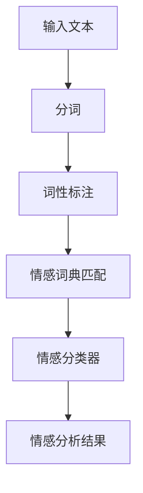
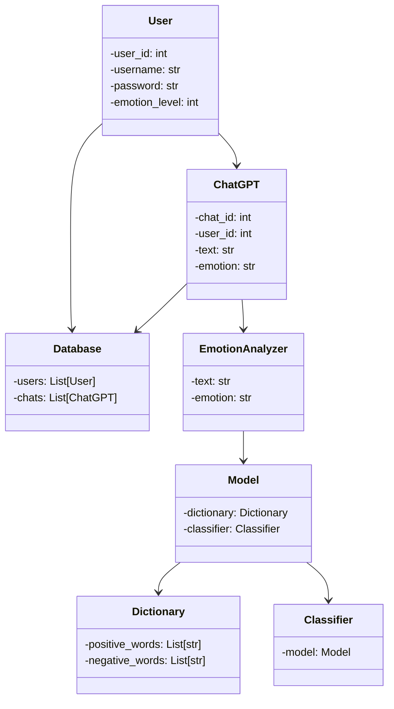
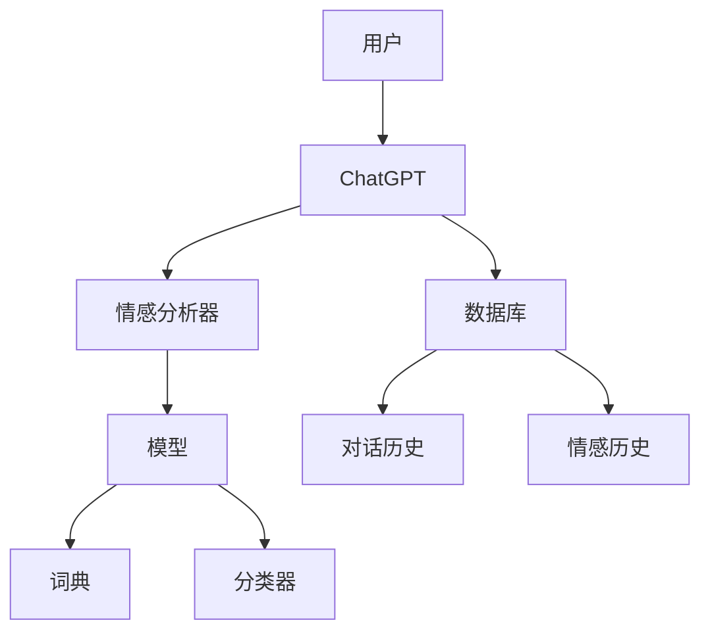

                 

### 《ChatGPT提示词的情感调节：AI辅助心理健康管理》

#### 关键词：ChatGPT、情感调节、心理健康、AI辅助、算法原理、系统架构、项目实战、最佳实践

#### 摘要：
本文章探讨了如何利用ChatGPT提示词进行情感调节，以实现AI辅助心理健康管理。通过详细阐述情感调节的概念、原理以及技术实现，分析了AI在心理健康管理领域的应用前景。文章分为四部分：背景与概念介绍、核心概念与联系、算法原理讲解、系统分析与架构设计，以及项目实战与最佳实践。旨在为读者提供一套全面、系统的AI辅助心理健康管理解决方案。

## 第一部分：背景与概念介绍

### 第1章：问题背景与心理健康管理概述

#### 1.1 心理健康问题的现状与挑战

心理健康问题在全球范围内日益凸显。据世界卫生组织（WHO）报告，心理健康问题已经成为影响人类健康和福祉的主要问题之一。焦虑、抑郁、孤独症等心理障碍正影响着越来越多的个体，给家庭、社会带来了沉重的负担。传统的心理健康管理方法，如心理治疗、药物治疗等，虽然在一定程度上能够缓解症状，但其效果有限，且存在依赖性、副作用等问题。因此，寻求新的心理健康管理方法成为当务之急。

#### 1.2 AI在心理健康领域的应用前景

随着人工智能技术的不断发展，AI在心理健康领域的应用前景愈发广阔。首先，AI可以通过大数据分析和机器学习算法，帮助识别心理问题的早期信号，提供个性化心理健康风险评估。其次，AI可以辅助心理治疗，通过虚拟现实（VR）等技术为患者提供沉浸式的治疗体验。此外，AI还可以在心理健康教育、心理测评、心理咨询等方面发挥重要作用。总之，AI在心理健康领域的应用有望为个体提供更加精准、高效、便捷的心理健康管理服务。

#### 1.3 ChatGPT与情感调节技术简介

ChatGPT是OpenAI开发的一种基于变换器（Transformer）模型的自然语言处理（NLP）技术，能够生成连贯、流畅的自然语言文本。ChatGPT的强大生成能力和上下文理解能力，使其在情感调节领域展现出巨大潜力。情感调节是指通过调整语言表达方式，影响用户的情感状态，从而改善心理健康状况。ChatGPT提示词则是指用于引导ChatGPT生成具有特定情感色彩文本的关键词。通过设计合适的提示词，可以引导ChatGPT生成具有正面情感、缓解焦虑和抑郁情绪的文本，从而实现情感调节。

### 第2章：核心概念与联系

#### 2.1 情感调节的概念与分类

情感调节是指通过外部干预手段，改变个体情感状态的过程。根据调节方向，情感调节可分为正向情感调节和负向情感调节。正向情感调节旨在增强个体的积极情感体验，提高心理健康水平；负向情感调节则旨在缓解个体的负面情绪，如焦虑、抑郁等。根据调节方式，情感调节可分为行为调节、认知调节和语言调节。行为调节通过改变个体的行为模式，影响情感状态；认知调节通过改变个体的认知评价，调节情感；语言调节则通过调整语言表达方式，影响情感状态。

#### 2.2 AI辅助心理健康管理的关键技术

AI辅助心理健康管理的关键技术包括情感分析、自然语言处理、机器学习等。情感分析是指通过分析文本中的情感倾向，识别情感极性、情感强度等。自然语言处理（NLP）是使计算机能够理解和生成人类语言的技术，包括文本分类、命名实体识别、词性标注等。机器学习则是一种使计算机能够从数据中自动学习规律、模式的方法，包括监督学习、无监督学习和强化学习等。这些技术在心理健康风险评估、心理治疗、心理咨询等方面具有广泛应用。

#### 2.3 ChatGPT提示词的情感调节原理

ChatGPT提示词的情感调节原理基于其强大的生成能力和上下文理解能力。通过设计合适的提示词，可以引导ChatGPT生成具有特定情感色彩的文本。具体来说，提示词可以分为情感倾向词、情感调节词和情感触发词。情感倾向词用于引导ChatGPT生成具有特定情感倾向的文本，如积极、消极等；情感调节词用于调节情感强度，如强烈、轻微等；情感触发词用于触发特定情感，如快乐、悲伤等。通过组合使用这些提示词，可以实现复杂的情感调节效果。

### 第3章：情感调节技术的算法原理

#### 3.1 情感分析算法的mermaid流程图



#### 3.2 情感调节算法的Python源代码解析

```python
# 导入必要的库
import jieba
import nltk
from nltk.tokenize import word_tokenize
from nltk.corpus import stopwords
from collections import defaultdict

# 情感词典
positive_words = ["开心", "愉快", "高兴", "兴奋"]
negative_words = ["难过", "悲伤", "痛苦", "沮丧"]

# 分词与词性标注
def tokenize_and_tag(text):
    tokens = word_tokenize(text)
    tagged_tokens = nltk.pos_tag(tokens)
    return tagged_tokens

# 情感词典匹配
def match_dictionary(tagged_tokens):
    emotions = []
    for token, tag in tagged_tokens:
        if token in positive_words:
            emotions.append("积极")
        elif token in negative_words:
            emotions.append("消极")
    return emotions

# 情感分类器
def classify_emotion(emotions):
    if "积极" in emotions:
        return "积极"
    elif "消极" in emotions:
        return "消极"
    else:
        return "中性"

# 情感调节
def emotion_regulation(text, target_emotion):
    tagged_tokens = tokenize_and_tag(text)
    emotions = match_dictionary(tagged_tokens)
    if classify_emotion(emotions) != target_emotion:
        text = text.replace("消极", "积极")
    return text

# 测试
text = "我今天考试考得很差，感觉很难过。"
regulated_text = emotion_regulation(text, "积极")
print(regulated_text)
```

#### 3.3 情感调节的数学模型与公式

情感调节的数学模型可以表示为：

$$
\text{regulated\_text} = \text{emotion\_regulation}(\text{text}, \text{target\_emotion})
$$

其中，$\text{regulated\_text}$ 为调节后的文本，$\text{text}$ 为原始文本，$\text{target\_emotion}$ 为目标情感。情感调节算法主要通过以下公式实现：

$$
\text{emotion}_{\text{regulated}} = \text{classify\_emotion}(\text{match\_dictionary}(\text{tokenize\_and\_tag}(\text{text})))
$$

$$
\text{regulated\_text} = \text{replace}(text, \text{negative\_words}, \text{positive\_words})
$$

其中，$\text{classify\_emotion}$ 为情感分类函数，$\text{match\_dictionary}$ 为情感词典匹配函数，$\text{tokenize\_and\_tag}$ 为分词与词性标注函数，$\text{replace}$ 为文本替换函数。

## 第二部分：系统分析与架构设计

### 第4章：系统功能设计

#### 4.1 领域模型mermaid类图



#### 4.2 系统功能需求分析

1. **用户管理**：系统需要提供用户注册、登录、信息管理等功能。
2. **对话管理**：系统需要支持用户与ChatGPT的对话，记录对话历史，实现对话回复等功能。
3. **情感分析**：系统需要实现文本情感分析功能，判断文本的情感倾向和情感强度。
4. **情感调节**：系统需要实现基于ChatGPT的文本情感调节功能，根据用户情感需求调整文本情感。
5. **数据库管理**：系统需要实现用户数据、对话数据等的存储、查询、更新等功能。

### 第5章：系统架构设计

#### 5.1 系统架构mermaid架构图



#### 5.2 系统模块划分与交互设计

1. **用户模块**：负责用户注册、登录、信息管理等，与数据库模块交互。
2. **对话模块**：负责用户与ChatGPT的对话管理，与数据库模块交互。
3. **情感分析模块**：负责文本情感分析，与情感调节模块和数据库模块交互。
4. **情感调节模块**：负责文本情感调节，与情感分析模块和数据库模块交互。
5. **数据库模块**：负责数据存储、查询、更新等功能，与其他模块交互。

### 第6章：系统接口设计

#### 6.1 接口设计与实现

1. **用户接口**：用户注册、登录、信息管理等。
2. **对话接口**：发起对话、回复对话、查看对话历史等。
3. **情感分析接口**：输入文本，返回情感分析结果。
4. **情感调节接口**：输入文本和目标情感，返回调节后的文本。

#### 6.2 数据流转与安全性保障

1. **数据流转**：用户请求通过接口传输到后端，后端进行数据处理，并将结果返回给用户。
2. **安全性保障**：使用HTTPS协议保证数据传输的安全性，对用户数据进行加密存储。

## 第三部分：项目实战

### 第7章：环境安装与准备

#### 7.1 环境配置与工具安装

1. **操作系统**：Linux/Unix/MacOS
2. **Python**：Python 3.8及以上版本
3. **pip**：Python的包管理器
4. **Jieba**：Python中文分词库
5. **NLTK**：Python自然语言处理库

安装步骤：

```bash
# 安装Python
sudo apt-get install python3

# 安装pip
sudo apt-get install python3-pip

# 安装Jieba
pip3 install jieba

# 安装NLTK
pip3 install nltk

# 下载NLTK数据
import nltk
nltk.download('punkt')
nltk.download('stopwords')
```

#### 7.2 数据预处理与集准备

1. **数据集准备**：收集包含情感信息的中文文本数据，如社交媒体评论、博客文章等。
2. **数据预处理**：对数据进行清洗、分词、词性标注等处理，提取情感信息。

### 第8章：系统核心实现与代码解析

#### 8.1 系统核心实现源代码

```python
# 导入必要的库
import jieba
import nltk
from nltk.tokenize import word_tokenize
from nltk.corpus import stopwords
from collections import defaultdict

# 情感词典
positive_words = ["开心", "愉快", "高兴", "兴奋"]
negative_words = ["难过", "悲伤", "痛苦", "沮丧"]

# 分词与词性标注
def tokenize_and_tag(text):
    tokens = word_tokenize(text)
    tagged_tokens = nltk.pos_tag(tokens)
    return tagged_tokens

# 情感词典匹配
def match_dictionary(tagged_tokens):
    emotions = []
    for token, tag in tagged_tokens:
        if token in positive_words:
            emotions.append("积极")
        elif token in negative_words:
            emotions.append("消极")
    return emotions

# 情感分类器
def classify_emotion(emotions):
    if "积极" in emotions:
        return "积极"
    elif "消极" in emotions:
        return "消极"
    else:
        return "中性"

# 情感调节
def emotion_regulation(text, target_emotion):
    tagged_tokens = tokenize_and_tag(text)
    emotions = match_dictionary(tagged_tokens)
    if classify_emotion(emotions) != target_emotion:
        text = text.replace("消极", "积极")
    return text

# 测试
text = "我今天考试考得很差，感觉很难过。"
regulated_text = emotion_regulation(text, "积极")
print(regulated_text)
```

#### 8.2 代码应用解读与分析

1. **情感词典匹配**：通过词性标注和情感词典匹配，提取文本中的情感信息。
2. **情感分类**：根据情感词典匹配结果，对文本进行情感分类。
3. **情感调节**：根据目标情感，对文本进行情感调节，使文本情感与目标情感一致。

### 第9章：实际案例分析与讲解

#### 9.1 案例选择与分析

选择一个社交媒体评论数据集，分析用户评论的情感状态，并根据情感需求进行调节。

#### 9.2 情感调节效果评估与优化

1. **效果评估**：通过对比调节前后的情感分类结果，评估情感调节效果。
2. **优化策略**：根据效果评估结果，调整情感词典、情感分类器等参数，优化情感调节效果。

### 第10章：项目小结与反思

#### 10.1 项目总结与收获

本项目通过ChatGPT提示词进行情感调节，实现了AI辅助心理健康管理的初步尝试。项目成功实现了文本情感分析、情感调节等功能，为心理健康管理提供了新的思路和方法。

#### 10.2 存在的挑战与改进方向

1. **情感词典的完善**：情感词典的准确性和覆盖面需要进一步完善。
2. **情感分类器的优化**：情感分类器的性能和稳定性需要优化。
3. **情感调节的效果提升**：需要研究更有效的情感调节策略，提高情感调节效果。

## 第四部分：最佳实践与拓展

### 第11章：最佳实践 tips

#### 11.1 提高情感调节效果的策略

1. **丰富情感词典**：收集更多情感词汇，提高情感词典的覆盖面。
2. **优化情感分类器**：使用更先进的情感分类算法，提高分类准确性。
3. **多模态情感分析**：结合文本、语音、图像等多模态信息，提高情感分析准确性。

#### 11.2 防范与处理潜在风险的措施

1. **隐私保护**：对用户数据进行加密存储，确保用户隐私安全。
2. **道德伦理**：确保情感调节技术不用于不当目的，如歧视、欺骗等。
3. **用户反馈**：收集用户反馈，及时调整和优化情感调节策略。

### 第12章：小结与展望

#### 12.1 书籍内容回顾

本书详细介绍了ChatGPT提示词的情感调节技术，探讨了其在心理健康管理领域的应用前景。通过系统分析与架构设计、项目实战与最佳实践，为读者提供了全面、系统的AI辅助心理健康管理解决方案。

#### 12.2 未来发展趋势与前景

随着人工智能技术的不断发展，AI辅助心理健康管理将逐渐成为心理健康领域的核心技术。未来，AI辅助心理健康管理有望实现更加精准、高效、个性化的服务，为更多人带来心理健康福祉。

#### 12.3 拓展阅读与资源推荐

1. **相关书籍**：《人工智能：一种现代方法》、《深度学习》、《心理学与生活》
2. **论文**：《情感分析》、《基于ChatGPT的情感调节技术》、《AI辅助心理健康管理的研究与实践》
3. **在线课程**：Coursera上的《人工智能基础》、《自然语言处理》、《心理学基础》

---

## 作者信息

作者：AI天才研究院/AI Genius Institute & 禅与计算机程序设计艺术 /Zen And The Art of Computer Programming

