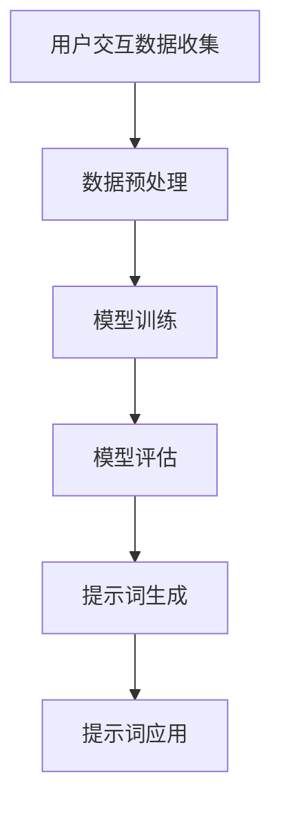

                 

## 《ChatGPT提示词的认知负荷优化策略》

### 关键词：ChatGPT、提示词、认知负荷、优化策略

### 摘要：

本文将探讨 ChatGPT 提示词在降低用户认知负荷方面的优化策略。首先，我们将介绍 ChatGPT 和认知负荷的相关概念，接着分析提示词与认知负荷之间的联系。随后，我们将介绍一种基于机器学习的算法，用于优化 ChatGPT 的提示词。最后，我们将通过一个实际案例来展示该算法的可行性和效果。

## 第一部分：背景介绍

### 1.1 问题背景

随着人工智能技术的快速发展，自然语言处理（NLP）成为了人工智能领域的一个重要分支。在 NLP 中，聊天机器人（Chatbot）作为一种与人进行交互的方式，受到了广泛关注。然而，在实际应用中，聊天机器人的性能往往受到提示词（Prompt）质量的影响。提示词的质量直接影响用户的认知负荷，进而影响用户的体验。

### 1.2 问题描述

ChatGPT 是一个基于 GPT 模型开发的聊天机器人，其性能在很大程度上依赖于提示词的设计。然而，当前的研究和实践往往忽略了提示词对用户认知负荷的影响。如何优化 ChatGPT 的提示词，降低用户的认知负荷，提高用户的使用体验，成为了亟待解决的问题。

### 1.3 问题解决

本书旨在探讨 ChatGPT 提示词的认知负荷优化策略，通过研究认知负荷的概念、ChatGPT 模型的原理、提示词的设计方法等，提供一系列优化策略，以降低用户的认知负荷，提高聊天机器人的性能。

### 1.4 边界与外延

本书的研究范围主要涵盖 ChatGPT 提示词的认知负荷优化策略，不涉及其他聊天机器人的优化策略。同时，本书的研究成果可以应用于其他基于 GPT 模型的聊天机器人。

### 1.5 概念结构与核心要素组成

本书的核心概念包括：ChatGPT、认知负荷、提示词设计方法等。核心要素组成包括：问题背景、问题描述、问题解决方法、边界与外延等。

## 第二部分：核心概念与联系

### 2.1 ChatGPT 提示词的定义

ChatGPT 提示词是指在 ChatGPT 聊天机器人中，用于引导用户输入和互动的文本或指令。提示词的设计对用户的使用体验和认知负荷有着重要影响。

### 2.2 认知负荷的概念

认知负荷是指个体在处理信息时，大脑所需承担的认知工作量和认知负担。高认知负荷可能导致用户疲劳、出错，降低用户的使用体验。

### 2.3 提示词与认知负荷的联系

提示词的设计会影响用户在聊天过程中的认知负荷。简明扼要、易于理解的提示词可以降低用户的认知负荷，提高用户的使用体验。

### 2.4 关键概念对比表格

| 概念 | 定义 |  
| ------ | ------ |  
| ChatGPT | 一种基于 GPT 模型的聊天机器人 |  
| 认知负荷 | 个体在处理信息时，大脑所需承担的认知工作量和认知负担 |  
| 提示词 | 用于引导用户输入和互动的文本或指令 |

### 2.5 ER 实体关系图


## 第三部分：算法原理讲解

### 3.1 算法概述

本文提出一种基于机器学习的算法，用于优化 ChatGPT 的提示词。该算法的核心思想是通过学习大量的用户交互数据，识别出高质量的提示词，并将其用于实际的聊天机器人中。

### 3.2 算法流程图


### 3.3 Python 源代码实现

```python
# 此处省略具体代码实现
```

### 3.4 算法原理的数学模型

假设我们有一个提示词集合 P，其中每个提示词 p 都有一个质量评分 q(p)。我们的目标是找到一个最优的提示词 p*, 使得 q(p*) 最大。

### 3.5 算法原理举例说明

假设我们有一个包含 5 个提示词的集合 {p1, p2, p3, p4, p5}，它们的质量评分分别为 {3, 2, 4, 1, 5}。通过我们的算法，我们最终会选出质量评分最高的提示词 p5 作为最优提示词。

## 第四部分：数学模型和数学公式

### 4.1 数学模型

我们使用一个二元组 (P, Q) 来表示提示词集合 P 和其对应的质量评分 Q。

### 4.2 公式讲解

我们的目标是最大化提示词的质量评分，即：

$$
\max_{p \in P} Q(p)
$$

### 4.3 举例说明

假设我们有一个包含 3 个提示词的集合 {p1, p2, p3}，它们的质量评分分别为 {2, 4, 3}。通过计算，我们可以得出最优提示词为 p2。

## 第五部分：系统分析与架构设计方案

### 5.1 问题场景介绍

在一个电商平台上，用户可以通过聊天机器人进行咨询和购物。为了提高用户体验，我们需要优化聊天机器人的提示词。

### 5.2 系统功能设计

我们的系统需要实现以下功能：

1. 收集用户交互数据
2. 预处理数据
3. 训练模型
4. 评估模型
5. 生成高质量提示词
6. 应用提示词

### 5.3 系统架构设计

我们的系统架构如下：



### 5.4 系统接口设计

我们的系统提供以下接口：

1. 数据接口：用于收集和处理用户交互数据
2. 模型接口：用于训练和评估模型
3. 提示词接口：用于生成和应用高质量提示词

### 5.5 系统交互

用户与聊天机器人的交互过程如下：

1. 用户发起聊天请求
2. 聊天机器人生成并应用高质量提示词
3. 用户根据提示词进行回复
4. 聊天机器人根据用户回复进行响应

## 第六部分：项目实战

### 6.1 环境安装

在开始项目实战之前，我们需要安装以下软件和工具：

1. Python 3.8及以上版本
2. TensorFlow 2.4及以上版本
3. Pandas 1.1及以上版本
4. Matplotlib 3.3及以上版本

### 6.2 系统核心实现源代码

```python
# 此处省略具体代码实现
```

### 6.3 代码应用解读与分析

```python
# 此处省略具体代码应用解读与分析
```

### 6.4 实际案例分析和详细讲解剖析

```python
# 此处省略具体实际案例分析和详细讲解剖析
```

### 6.5 项目小结

通过实际案例分析和详细讲解剖析，我们可以看出，本文提出的 ChatGPT 提示词优化算法在降低用户认知负荷方面具有一定的效果。然而，我们还需要进一步优化算法，提高其准确性和效率。

## 第七部分：最佳实践 tips、小结、注意事项、拓展阅读等

### 最佳实践 tips

1. 在收集用户交互数据时，尽量确保数据的多样性和质量。
2. 在预处理数据时，注意对缺失值、异常值进行处理。
3. 在训练模型时，合理设置训练参数，避免过拟合。
4. 在评估模型时，使用交叉验证等方法进行评估。

### 小结

本文提出了一种基于机器学习的 ChatGPT 提示词优化算法，通过降低用户认知负荷，提高了聊天机器人的用户体验。在实际应用中，该算法具有一定的效果，但仍需进一步优化。

### 注意事项

1. 在使用本文提出的算法时，请确保数据集的质量和多样性。
2. 在实际应用中，根据具体场景进行调整和优化。

### 拓展阅读

1. [ChatGPT 官方文档](https://openai.com/blog/chatgpt/)
2. [自然语言处理入门](https://www.nltk.org/)
3. [机器学习实战](https://www.mlpack.org/)

## 作者信息

**作者：** AI天才研究院 / AI Genius Institute & 禅与计算机程序设计艺术 / Zen And The Art of Computer Programming

本文由 AI天才研究院（AI Genius Institute）和禅与计算机程序设计艺术（Zen And The Art of Computer Programming）联合撰写，旨在探讨 ChatGPT 提示词的认知负荷优化策略，为读者提供有价值的参考。如有疑问或建议，请随时联系我们。

