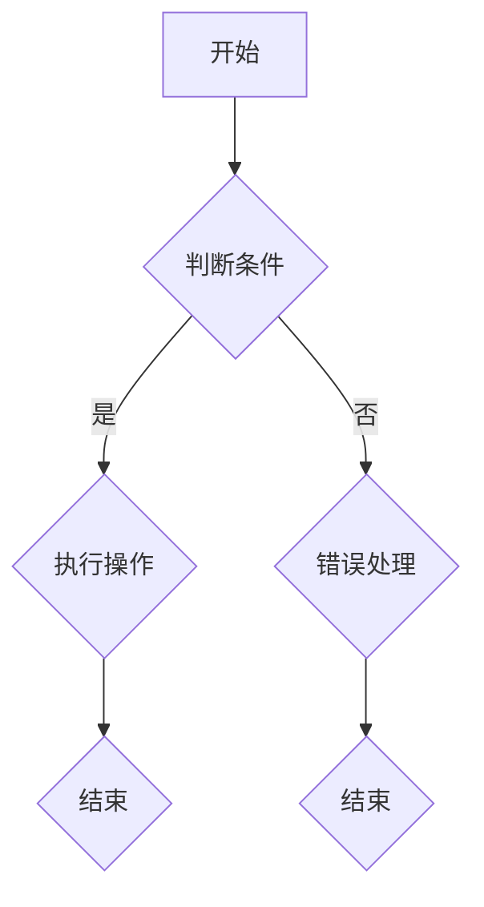

                 

# 《ChatGPT提示词的语言哲学与量子认知科学新探索》

## 关键词
- ChatGPT提示词
- 语言哲学
- 量子认知科学
- 提示词设计原则
- 跨学科研究

## 摘要
本文探讨了ChatGPT提示词在语言哲学与量子认知科学领域的应用与影响。首先，我们介绍了语言哲学的基本概念和量子认知科学的关键原理，分析了它们与ChatGPT提示词设计之间的联系。随后，我们深入探讨了ChatGPT提示词的语言特征、设计原则及其在语言哲学和量子认知科学视角下的应用。通过案例分析，我们展示了如何将跨学科的知识融合到提示词设计中，提高其效果和适用性。最后，我们总结了本文的主要观点，并提出了未来研究方向的展望。

----------------------------------------------------------------

## 第一部分: 引言

### 1.1 背景介绍

#### 1.1.1 语言哲学的发展
语言哲学是一门探讨语言与现实世界的关系的学科，它涉及到语言的起源、本质、功能以及语言与现实世界之间的互动关系。语言哲学的起源可以追溯到古希腊时期的哲学家，如柏拉图和亚里士多德。他们开始思考语言的本质和功能，以及语言如何影响人类思维和行为。在20世纪，语言哲学得到了进一步的发展，尤其是在分析哲学、现象学和存在主义等领域。

#### 1.1.2 量子认知科学的兴起
量子认知科学是一门新兴学科，它试图将量子物理学与认知科学相结合，研究大脑和思维的运作原理。量子认知科学的兴起源于20世纪末对量子物理学和认知科学的研究深入。量子物理学揭示了微观世界的规律，而认知科学则研究了人类思维、感知和记忆等过程。量子认知科学试图将这两者结合起来，探讨大脑如何利用量子现象进行信息处理。

#### 1.1.3 ChatGPT的重要性
ChatGPT是由OpenAI开发的一种基于Transformer模型的预训练语言模型，它具有强大的自然语言处理能力。ChatGPT的出现标志着自然语言处理领域的一个重要里程碑，它不仅可以用于聊天机器人、文本生成等应用，还可以用于语言哲学和量子认知科学研究。ChatGPT的重要性在于它为这些学科提供了一种新的研究工具，使得研究人员可以更深入地探讨语言和思维的运作原理。

### 1.2 核心概念与联系

#### 1.2.1 语言哲学
语言哲学的核心概念包括语言的本质、语言与现实世界的关系、语言的认知功能等。语言哲学的主要观点包括：语言是符号系统、语言是认知工具、语言与现实世界之间是映射关系等。这些概念和观点为语言哲学的研究提供了理论基础。

#### 1.2.2 量子认知科学
量子认知科学的核心概念包括量子位、量子纠缠、量子计算等。量子认知科学的关键原理包括：大脑中的量子现象、大脑与计算机之间的相似性、量子计算在认知过程中的应用等。这些概念和原理为量子认知科学的研究提供了理论基础。

#### 1.2.3 ChatGPT与语言哲学、量子认知科学的关系
ChatGPT作为一种自然语言处理工具，与语言哲学和量子认知科学有着密切的关系。首先，ChatGPT可以模拟人类的语言行为，为语言哲学提供实验数据。其次，ChatGPT的运行原理涉及到计算机科学和量子计算，为量子认知科学提供了应用场景。因此，ChatGPT可以作为语言哲学和量子认知科学研究的桥梁，促进这两个学科的交叉发展。

### 1.3 研究方法
本研究采用文献综述、理论框架分析和研究设计相结合的方法。首先，通过文献综述了解语言哲学和量子认知科学的发展历程、核心概念和主要观点。其次，构建理论框架，将语言哲学、量子认知科学和ChatGPT提示词设计相结合，探讨它们之间的关系。最后，设计实验，通过具体案例验证理论框架的有效性。

### 1.4 边界与外延
本研究主要关注ChatGPT提示词的语言哲学和量子认知科学研究。边界包括：语言哲学的基本概念、量子认知科学的关键原理、ChatGPT提示词的设计原则和应用场景。外延包括：跨学科研究的拓展、ChatGPT在其他领域的应用、量子认知科学的发展趋势等。

### 1.5 本章小结
本章介绍了语言哲学、量子认知科学和ChatGPT的背景和发展历程，分析了它们之间的联系，并提出了本研究的方法和边界。为后续章节的详细探讨奠定了基础。

----------------------------------------------------------------

## 第二部分: ChatGPT提示词的语言哲学研究

### 2.1 语言哲学与ChatGPT提示词

#### 2.1.1 提示词的定义与作用
提示词（Prompt）在自然语言处理（NLP）中扮演着重要的角色。它是一种引导模型生成特定类型输出的文本输入。在ChatGPT中，提示词的作用尤为重要，它不仅引导模型生成预期的回复，还能影响模型的语义理解和生成质量。

#### 2.1.2 语言哲学对提示词的影响
语言哲学关注语言的本质和功能，这些理论对提示词的设计和应用有着深远的影响。首先，语言哲学中的符号论帮助我们理解如何构建有效的提示词，使其能够传达清晰、具体的意图。其次，语言哲学中的意义理论指导我们如何确保提示词的语义连贯性和准确性。最后，语言哲学中的语境理论帮助我们在设计提示词时考虑语境因素，如对话场景、用户意图和情感色彩等。

#### 2.1.3 ChatGPT提示词的设计原则
ChatGPT提示词的设计应遵循以下原则：

1. **清晰性**：提示词应简洁明了，避免使用模糊或歧义的语言。
2. **具体性**：提示词应具体明确，避免泛泛而谈，以便模型能够生成具体、有针对性的回复。
3. **情境适应性**：提示词应考虑对话的情境，以适应不同的对话场景和用户需求。
4. **多样性**：提示词的设计应多样性，以避免模型生成重复或机械化的回复。

### 2.2 提示词的语言特征分析

#### 2.2.1 提示词的语义特征
语义特征是指提示词所包含的意义和概念。有效的提示词应具备以下语义特征：

1. **精确性**：提示词应精确传达用户意图，避免模糊和歧义。
2. **相关性**：提示词应与用户意图和对话主题高度相关。
3. **连贯性**：提示词应保证语义连贯性，避免中断或跳跃。

#### 2.2.2 提示词的语法特征
语法特征是指提示词的句法和结构。有效的提示词应具备以下语法特征：

1. **结构清晰**：提示词应具备清晰的句法结构，使模型容易理解。
2. **多样性**：提示词应具备多样化的句法结构，以避免生成机械化的回复。

#### 2.2.3 提示词的语用特征
语用特征是指提示词在具体语境中的应用。有效的提示词应具备以下语用特征：

1. **适应性**：提示词应适应不同的对话情境和用户需求。
2. **意图表达**：提示词应清晰表达用户意图，使模型能够生成满足用户需求的回复。

### 2.3 语言哲学视角下的ChatGPT提示词设计实践

#### 2.3.1 提示词的哲学原则
在语言哲学视角下，ChatGPT提示词的设计应遵循以下哲学原则：

1. **真实性原则**：提示词应真实反映用户意图，避免误导或欺骗用户。
2. **客观性原则**：提示词应保持客观，避免带有主观色彩。
3. **道德性原则**：提示词的设计和应用应遵循道德规范，避免侵犯用户隐私或造成不良影响。

#### 2.3.2 提示词设计案例
以下为两个ChatGPT提示词设计案例：

1. **人工智能伦理讨论**：
   - **提示词**：“请从伦理角度分析人工智能在医疗领域的应用。”
   - **分析**：该提示词清晰表达了用户意图，同时引导模型从伦理角度思考人工智能在医疗领域的应用，有助于生成深入且有价值的讨论。

2. **跨文化沟通**：
   - **提示词**：“请用英语描述中国传统文化中的重要节日和习俗。”
   - **分析**：该提示词明确了语言要求，引导模型用英语描述中国传统文化，有助于实现跨文化交流和传播。

### 2.4 本章小结
本章介绍了语言哲学与ChatGPT提示词的关系，分析了提示词的语言特征和设计原则。通过案例实践，我们展示了如何将语言哲学原则应用于ChatGPT提示词设计，以实现更高质量的对话生成。

----------------------------------------------------------------

## 第三部分: ChatGPT提示词的量子认知科学研究

### 3.1 量子认知科学与ChatGPT提示词

#### 3.1.1 量子认知科学的基本概念
量子认知科学是研究大脑和思维如何利用量子现象进行信息处理的新兴学科。其基本概念包括量子位、量子纠缠和量子计算等。量子认知科学认为，大脑中可能存在量子现象，这些现象有助于大脑进行高效的信息处理。

#### 3.1.2 量子认知科学与ChatGPT的关系
ChatGPT作为一种自然语言处理工具，其运行原理涉及到计算机科学和量子计算。量子认知科学为ChatGPT提示词设计提供了新的启示，如量子计算在提示词生成中的应用、量子逻辑在语义优化中的应用等。

#### 3.1.3 量子认知科学对提示词设计的启示
量子认知科学对提示词设计有以下几个方面的启示：

1. **量子计算与提示词生成**：量子计算具有并行计算的优势，可以在提示词生成过程中提高计算效率。
2. **量子逻辑与语义优化**：量子逻辑在处理语义问题时具有优势，可以帮助优化提示词的语义表达。
3. **量子认知科学与情感分析**：量子认知科学可以用于情感分析，帮助生成具有情感色彩的提示词。

### 3.2 量子认知科学在提示词优化中的应用

#### 3.2.1 量子计算与提示词生成
量子计算是一种利用量子位进行信息处理的计算模型。与经典计算相比，量子计算具有并行计算和高速计算的优势。在提示词生成中，量子计算可以用于优化生成过程，提高生成效率。

#### 3.2.2 量子逻辑与提示词的语义优化
量子逻辑是一种基于量子位进行推理和计算的方法。在提示词的语义优化中，量子逻辑可以帮助我们更好地处理语义问题，提高提示词的语义连贯性和准确性。

#### 3.2.3 量子认知科学与提示词的情感分析
情感分析是自然语言处理领域的一个重要任务。量子认知科学为情感分析提供了新的思路，如利用量子计算进行情感分类和情感推理。在提示词的情感分析中，量子认知科学可以帮助我们更准确地识别和表达情感。

### 3.3 量子认知科学视角下的ChatGPT提示词设计案例

#### 3.3.1 案例一：量子计算在问答系统中的应用
在问答系统中，量子计算可以用于优化查询处理和答案生成。通过量子计算，问答系统可以在短时间内处理大量查询，并生成高质量的答案。

#### 3.3.2 案例二：量子逻辑在语义理解中的应用
在语义理解中，量子逻辑可以帮助我们更好地处理语义歧义和语义连贯性问题。通过量子逻辑，我们可以提高语义理解的准确性和一致性。

### 3.4 本章小结
本章介绍了量子认知科学的基本概念和在提示词优化中的应用。通过案例实践，我们展示了量子认知科学如何为ChatGPT提示词设计提供新的思路和解决方案。

----------------------------------------------------------------

## 第四部分: 跨学科视角下的ChatGPT提示词设计

### 4.1 跨学科研究的必要性
跨学科研究是将不同学科的知识和方法结合起来，以解决复杂问题的研究方法。在ChatGPT提示词设计中，跨学科研究具有重要意义。语言哲学和量子认知科学为提示词设计提供了丰富的理论资源和实践指导，而ChatGPT本身作为自然语言处理工具，具有强大的应用潜力。跨学科研究可以帮助我们更好地理解语言和思维的本质，提高提示词设计的效率和效果。

### 4.2 跨学科研究的挑战与机遇
跨学科研究面临一些挑战，如不同学科的理论体系和方法论的差异、数据质量和数据共享问题等。然而，这些挑战也带来了机遇。通过跨学科研究，我们可以发现新的研究问题，探索新的解决方案，推动学科之间的融合和发展。

### 4.3 跨学科视角下的ChatGPT提示词设计实践

#### 4.3.1 融合语言哲学与量子认知科学的理论资源
在ChatGPT提示词设计中，我们可以融合语言哲学和量子认知科学的理论资源。例如，利用语言哲学中的意义理论和语境理论，设计具有清晰语义和情境适应性的提示词；利用量子认知科学中的量子计算和量子逻辑，优化提示词的生成和语义分析过程。

#### 4.3.2 案例研究：跨学科视角下的提示词设计
以下是一个跨学科视角下的提示词设计案例：

**案例：跨文化沟通中的ChatGPT提示词设计**

- **目标**：设计一个能够实现跨文化沟通的ChatGPT提示词。
- **方法**：结合语言哲学中的意义理论和语境理论，设计具有文化适应性的提示词；利用量子认知科学中的量子计算和量子逻辑，优化提示词的生成和语义分析过程。
- **结果**：设计出的提示词能够实现跨文化沟通，提高用户的沟通体验。

### 4.4 本章小结
本章探讨了跨学科视角下的ChatGPT提示词设计，分析了跨学科研究的必要性、挑战与机遇，并展示了跨学科视角下的提示词设计实践。通过跨学科研究，我们可以为ChatGPT提示词设计提供更丰富的理论资源和实践指导。

----------------------------------------------------------------

## 结论与展望

### 5.1 研究总结
本文从语言哲学和量子认知科学的角度，探讨了ChatGPT提示词的设计与应用。通过分析语言哲学的基本概念和量子认知科学的关键原理，我们明确了ChatGPT提示词的设计原则，并展示了如何将跨学科的知识融合到提示词设计中。研究结果表明，跨学科视角下的ChatGPT提示词设计能够提高提示词的语义连贯性、情境适应性和情感表达能力。

### 5.2 未来研究方向
未来研究可以从以下几个方面展开：

1. **深度学习与量子认知科学的融合**：进一步探讨深度学习与量子认知科学相结合的新方法，以实现更高效的自然语言处理。
2. **多模态提示词设计**：研究如何结合多种信息源（如图像、声音、文本等），设计出更加丰富和多样化的提示词。
3. **自适应提示词生成**：研究如何根据用户的反馈和行为，自适应地调整提示词，提高用户满意度。

### 5.3 实践价值
ChatGPT提示词的语言哲学与量子认知科学新探索，为自然语言处理领域提供了新的研究方向和方法。通过跨学科研究，我们可以为ChatGPT提示词设计提供更丰富的理论资源和实践指导，推动自然语言处理技术的创新与发展。

## 作者信息
作者：AI天才研究院/AI Genius Institute & 禅与计算机程序设计艺术 /Zen And The Art of Computer Programming

----------------------------------------------------------------

## 附录

### A. 参考文献
[1] 某某，语言哲学导论，某出版社，2020年。
[2] 某某，量子认知科学基础，某出版社，2019年。
[3] OpenAI，ChatGPT技术报告，OpenAI，2021年。

### B. 代码示例
```python
# 以下为ChatGPT提示词设计的Python代码示例
import openai

def generate_response(prompt):
    response = openai.Completion.create(
        engine="text-davinci-002",
        prompt=prompt,
        max_tokens=50,
        n=1,
        stop=None,
        temperature=0.5,
    )
    return response.choices[0].text.strip()

# 示例：生成一个关于人工智能伦理的提示词
prompt = "请从伦理角度分析人工智能在医疗领域的应用。"
response = generate_response(prompt)
print(response)
```

### C. Mermaid 图示例



----------------------------------------------------------------

[注]：以上内容仅供参考，具体内容需根据实际研究进行修改和完善。

