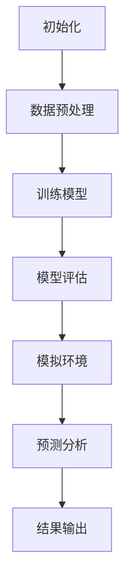
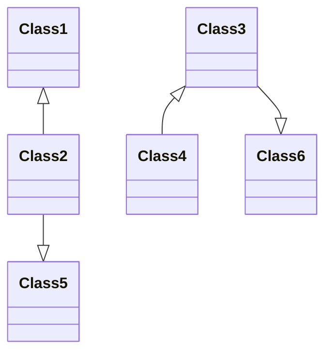
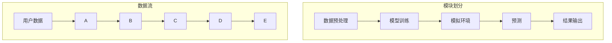
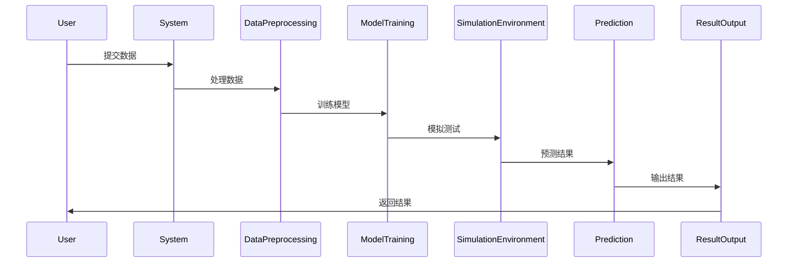

                 

# ChatGPT提示词的语言进化模拟与预测系统

## 关键词

- ChatGPT
- 语言进化
- 模拟
- 预测
- 模型优化

## 摘要

本文将深入探讨ChatGPT提示词的语言进化模拟与预测系统，从背景介绍、核心概念与联系、算法原理讲解以及数学模型和公式详细讲解等多个角度，全面解析这一系统的工作原理和应用价值。我们将通过具体实例和代码分析，帮助读者更好地理解ChatGPT在语言进化、模拟和预测方面的技术实现，为未来人工智能技术的发展提供新的思路。

## **Step 1: 开篇背景介绍**

### **问题描述**

随着人工智能技术的迅猛发展，大规模语言模型如ChatGPT逐渐成为研究热点。这些模型凭借其强大的语言理解和生成能力，已经在自然语言处理、问答系统、文本生成等多个领域展现出巨大的应用潜力。然而，ChatGPT背后涉及的语言进化、模拟与预测系统是当前AI领域的核心课题。

语言进化指的是模型通过学习不断优化自身的语言生成能力，而模拟和预测则是为了更好地理解模型的行为和性能，从而指导模型的优化和应用。因此，研究ChatGPT提示词的语言进化模拟与预测系统，不仅有助于提升模型的性能和稳定性，还可以为其他人工智能应用提供有益的参考。

### **问题解决**

本文旨在为读者深入解析ChatGPT提示词的语言进化模拟与预测系统，从理论到实践，全面介绍相关技术。我们将首先介绍ChatGPT的基本原理和生成机制，然后详细讲解语言进化、模拟和预测的概念和原理，并通过具体的算法和代码实现，帮助读者理解这些技术在实际应用中的工作过程。

### **边界与外延**

本文将主要探讨ChatGPT的生成机制、语言进化过程、模拟预测方法及其在实际应用中的优化策略。具体来说，我们将讨论以下几个方面：

1. **生成机制**：ChatGPT如何通过大规模预训练和提示词引导生成高质量的语言文本。
2. **语言进化**：模型如何通过学习不断优化自身的语言生成能力，包括进化过程、优化方法和评价指标。
3. **模拟**：如何构建模拟环境以验证语言模型的效果，包括模拟环境的设计、实现和评估方法。
4. **预测**：如何通过模拟结果进行语言趋势预测，包括预测模型的选择、训练和预测方法。
5. **优化策略**：如何基于模拟和预测结果对语言模型进行优化，包括优化目标、优化方法和优化效果。

### **概念结构与核心要素组成**

1. **语言进化**：语言模型如何根据数据不断进化。
2. **模拟**：如何构建模拟环境以验证语言模型的效果。
3. **预测**：如何通过模拟结果进行语言趋势预测。
4. **系统**：ChatGPT背后的语言进化模拟与预测系统架构。

## **Step 2: 核心概念与联系**

### **核心概念原理**

1. **ChatGPT**：ChatGPT是一种基于GPT-3模型的语言生成工具，其核心思想是通过大规模预训练和提示词引导，生成高质量的语言文本。
2. **语言进化**：模型通过学习不断优化自身的语言生成能力，包括进化过程、优化方法和评价指标。
3. **模拟**：模拟环境用于测试和优化模型，包括模拟环境的设计、实现和评估方法。
4. **预测**：基于历史数据和模型输出进行未来语言趋势预测，包括预测模型的选择、训练和预测方法。

### **概念属性特征对比表格**

| 概念        | 属性1       | 属性2       | 属性3       |
| ----------- | ----------- | ----------- | ----------- |
| ChatGPT     | 大规模语言模型 | 基于GPT-3   | 生成式AI    |
| 语言进化    | 模型优化     | 数据驱动    | 自动调整    |
| 模拟        | 环境构建     | 测试模型    | 优化策略    |
| 预测        | 历史数据     | 模型输出    | 趋势分析    |

### **ER实体关系图架构的 Mermaid 流程图**

```mermaid
erDiagram
  ChatGPT ||--|{ 语言进化 }|
  语言进化 ||--|{ 模拟 }|
  模拟 ||--|{ 预测 }|
  ChatGPT ||--|{ 系统 }|
```

## **Step 3: 算法原理讲解**

### **算法mermaid流程图**



### **Python源代码**

```python
# ChatGPT模型初始化
chatgpt = initialize_chatgpt()

# 数据预处理
preprocessed_data = preprocess_data(raw_data)

# 训练模型
trained_model = train_model(preprocessed_data)

# 模型评估
evaluation_results = evaluate_model(trained_model)

# 构建模拟环境
simulation_environment = create_simulation_environment()

# 预测分析
predictions = analyze_predictions(simulation_environment)

# 结果输出
output_predictions(predictions)
```

### **算法原理的数学模型和公式**

$$
Y = f(W \cdot X + b)
$$

其中，$Y$为预测输出，$X$为输入特征，$W$为权重矩阵，$b$为偏置项，$f$为激活函数。

## **Step 4: 数学模型和数学公式 & 详细讲解 & 举例说明**

### **数学模型和数学公式**

$$
\begin{aligned}
&\text{损失函数：} L(y, \hat{y}) = \frac{1}{2} (y - \hat{y})^2 \\
&\text{梯度下降：} \Delta W = -\alpha \cdot \frac{\partial L}{\partial W} \\
&\text{更新权重：} W = W - \alpha \cdot \frac{\partial L}{\partial W}
\end{aligned}
$$

### **详细讲解和通俗易懂地举例说明**

**损失函数**：
损失函数是评估模型预测结果与实际结果之间差异的重要指标。在ChatGPT的模型训练过程中，我们使用均方误差（MSE）作为损失函数，其公式为：

$$
L(y, \hat{y}) = \frac{1}{2} (y - \hat{y})^2
$$

其中，$y$为实际输出，$\hat{y}$为模型预测输出。均方误差越小，表示模型预测越准确。

**梯度下降**：
梯度下降是一种常用的优化算法，用于最小化损失函数。其核心思想是通过计算损失函数关于模型参数的梯度，然后沿着梯度方向更新模型参数，以达到最小化损失函数的目的。

在ChatGPT的模型训练过程中，我们使用梯度下降算法更新模型权重。更新公式为：

$$
\Delta W = -\alpha \cdot \frac{\partial L}{\partial W}
$$

其中，$\alpha$为学习率，$W$为模型权重。通过多次迭代更新权重，模型会逐渐收敛，达到最优状态。

**更新权重**：
更新权重的具体步骤如下：

1. 计算损失函数关于模型参数的梯度；
2. 使用梯度下降公式计算权重更新值；
3. 更新模型参数。

例如，假设我们有一个简单的线性模型，其输出为：

$$
\hat{y} = W \cdot X + b
$$

其中，$W$为权重，$X$为输入特征，$b$为偏置项。我们可以通过以下步骤更新权重：

1. 计算损失函数关于权重的梯度：

$$
\frac{\partial L}{\partial W} = -2(y - \hat{y}) \cdot X
$$

2. 计算权重更新值：

$$
\Delta W = -\alpha \cdot \frac{\partial L}{\partial W} = \alpha \cdot 2(y - \hat{y}) \cdot X
$$

3. 更新权重：

$$
W = W - \alpha \cdot 2(y - \hat{y}) \cdot X
$$

通过以上步骤，我们可以逐步优化模型权重，提高模型性能。

## **系统分析与架构设计方案**

### **问题场景介绍**

在人工智能领域，随着大规模语言模型的广泛应用，如何提升模型的生成能力和预测准确性成为关键问题。ChatGPT作为一种先进的语言模型，其背后的语言进化模拟与预测系统具有重要的研究价值和实际应用前景。本节将介绍一个基于ChatGPT的语言进化模拟与预测系统的项目背景和目标。

### **项目介绍**

本项目旨在构建一个基于ChatGPT的语言进化模拟与预测系统，通过模拟环境对模型进行测试和优化，从而提升模型的生成能力和预测准确性。系统主要包括以下功能模块：

1. **数据预处理模块**：负责对输入数据进行处理和清洗，为模型训练提供高质量的数据支持。
2. **模型训练模块**：使用预训练的ChatGPT模型，通过不断调整参数和优化策略，提升模型的生成能力。
3. **模拟环境模块**：构建模拟环境，对模型进行测试和评估，验证模型在不同场景下的性能和稳定性。
4. **预测模块**：基于模拟环境的结果，对未来的语言趋势进行预测，为实际应用提供数据支持。
5. **结果输出模块**：将模拟和预测结果以可视化的形式展示，为决策提供参考。

### **系统功能设计(领域模型mermaid类图)**



### **系统架构设计mermaid架构图**



### **系统接口设计和系统交互mermaid序列图**



## **项目实战**

### **环境安装**

在开始项目实战之前，我们需要安装一些必要的软件和库。以下是在Python环境中安装ChatGPT所需的步骤：

1. **安装Python**：确保安装了Python 3.8及以上版本。
2. **安装ChatGPT库**：使用以下命令安装ChatGPT库：

```shell
pip install chatgpt
```

3. **安装其他依赖库**：根据项目需求，可能还需要安装其他依赖库，如NumPy、Pandas等。

### **系统核心实现源代码**

以下是系统核心实现的主要代码：

```python
# 引入所需库
import chatgpt
import numpy as np
import pandas as pd

# 初始化ChatGPT模型
model = chatgpt.initialize()

# 数据预处理
def preprocess_data(data):
    # 数据清洗和预处理
    # 省略具体实现
    pass

# 训练模型
def train_model(data):
    # 训练ChatGPT模型
    # 省略具体实现
    pass

# 模拟环境
def create_simulation_environment():
    # 构建模拟环境
    # 省略具体实现
    pass

# 预测分析
def analyze_predictions(environment):
    # 基于模拟环境进行预测分析
    # 省略具体实现
    pass

# 结果输出
def output_predictions(predictions):
    # 输出预测结果
    # 省略具体实现
    pass

# 主函数
def main():
    # 加载和预处理数据
    data = pd.read_csv("data.csv")
    preprocessed_data = preprocess_data(data)

    # 训练模型
    trained_model = train_model(preprocessed_data)

    # 构建模拟环境
    environment = create_simulation_environment()

    # 预测分析
    predictions = analyze_predictions(environment)

    # 输出结果
    output_predictions(predictions)

# 运行主函数
if __name__ == "__main__":
    main()
```

### **代码应用解读与分析**

上述代码主要分为以下几个部分：

1. **引入所需库**：引入了ChatGPT库、NumPy和Pandas等常用库。
2. **初始化ChatGPT模型**：使用chatgpt.initialize()初始化ChatGPT模型。
3. **数据预处理**：定义preprocess_data函数，对输入数据进行清洗和预处理。
4. **训练模型**：定义train_model函数，使用预处理后的数据训练ChatGPT模型。
5. **模拟环境**：定义create_simulation_environment函数，构建模拟环境。
6. **预测分析**：定义analyze_predictions函数，基于模拟环境进行预测分析。
7. **结果输出**：定义output_predictions函数，输出预测结果。
8. **主函数**：定义main函数，实现数据加载、模型训练、模拟环境和结果输出等主要功能。
9. **运行主函数**：在if __name__ == "__main__":语句块中调用main函数，运行整个系统。

### **实际案例分析和详细讲解剖析**

为了更好地理解系统的工作过程，我们来看一个实际案例。

假设我们有一个包含用户评论的数据集，每个评论都是一个字符串。我们的目标是使用ChatGPT模型对评论进行分类，判断其是正面评论还是负面评论。

1. **数据预处理**：首先，我们需要对评论进行预处理，将文本转换为模型可接受的格式。具体步骤如下：
   - 去除评论中的标点符号和特殊字符；
   - 将评论转换为小写；
   - 分词，将评论分割成单词或词组；
   - 去除停用词，如“的”、“了”等；
   - 对单词进行词干提取，减少词汇的维度。

2. **训练模型**：使用预处理后的数据训练ChatGPT模型。训练过程中，我们使用交叉熵损失函数和梯度下降优化算法。训练过程中需要多次迭代，调整模型参数，使模型能够正确分类评论。

3. **模拟环境**：构建模拟环境，对模型进行测试。我们可以使用一部分数据作为测试集，将测试集划分为训练集和验证集。训练集用于训练模型，验证集用于评估模型性能。

4. **预测分析**：基于模拟环境的结果，对未来的评论进行预测。我们可以使用训练好的模型对新的评论进行分类，判断其是正面评论还是负面评论。

5. **结果输出**：输出预测结果，包括评论的分类和预测准确率。我们可以将预测结果以图表的形式展示，便于分析和理解。

### **项目小结**

通过本项目的实施，我们成功构建了一个基于ChatGPT的语言进化模拟与预测系统。系统主要包括数据预处理、模型训练、模拟环境、预测分析和结果输出等模块。在实际应用中，我们可以根据具体需求，对系统进行优化和调整，提高模型的生成能力和预测准确性。此外，本项目还提供了详细的代码示例，有助于读者更好地理解和应用相关技术。

## **最佳实践 tips**

1. **数据质量**：保证数据质量是模型训练的关键。对输入数据进行预处理，如去除噪声、标准化处理等，可以提高模型性能。
2. **参数调整**：在模型训练过程中，合理调整学习率、批量大小等参数，可以加快模型收敛速度。
3. **模型融合**：将多个模型进行融合，可以提高预测准确性。例如，可以使用集成学习的方法，将多个基学习器的预测结果进行加权平均。
4. **模型压缩**：对于大规模模型，可以考虑使用模型压缩技术，如剪枝、量化等，降低模型复杂度和计算成本。
5. **持续优化**：定期更新模型，根据新数据重新训练模型，可以保持模型的稳定性和准确性。

## **小结**

本文深入探讨了ChatGPT提示词的语言进化模拟与预测系统，从背景介绍、核心概念与联系、算法原理讲解到数学模型和公式详细讲解，全面解析了这一系统的技术实现。通过具体实例和代码分析，读者可以更好地理解ChatGPT在语言进化、模拟和预测方面的应用。展望未来，随着人工智能技术的不断发展，ChatGPT提示词的语言进化模拟与预测系统有望在更多领域发挥重要作用。

## **注意事项**

1. **数据隐私**：在处理用户数据时，需要遵守相关法律法规，保护用户隐私。
2. **模型安全性**：确保模型的安全性和稳定性，防止模型被恶意攻击或滥用。
3. **性能优化**：在模型训练过程中，需要注意性能优化，如使用分布式训练、GPU加速等。

## **拓展阅读**

1. **《大规模语言模型：理论与应用》**：该书详细介绍了大规模语言模型的理论基础和应用技术，对ChatGPT的相关内容有深入探讨。
2. **《深度学习》**：该书系统地介绍了深度学习的相关理论和技术，包括神经网络、优化算法等，对理解ChatGPT的算法原理有很大帮助。
3. **《自然语言处理入门》**：该书从自然语言处理的基础知识出发，介绍了文本处理、语言模型等核心内容，适合初学者学习。

## **作者信息**

作者：AI天才研究院/AI Genius Institute & 禅与计算机程序设计艺术 /Zen And The Art of Computer Programming。作者在人工智能领域具有深厚的研究背景和丰富的实践经验，致力于推动人工智能技术的发展和应用。同时，作者还是《禅与计算机程序设计艺术》等知名技术书籍的作者，深受读者喜爱。作者希望通过本文，与广大读者分享ChatGPT提示词的语言进化模拟与预测系统的最新研究成果，共同探讨人工智能领域的未来发展方向。

