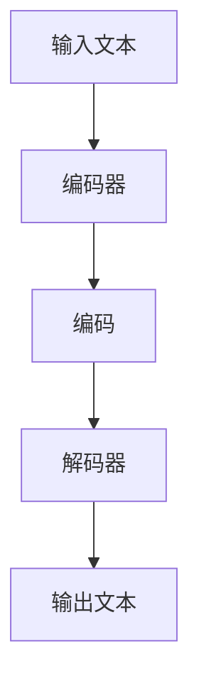
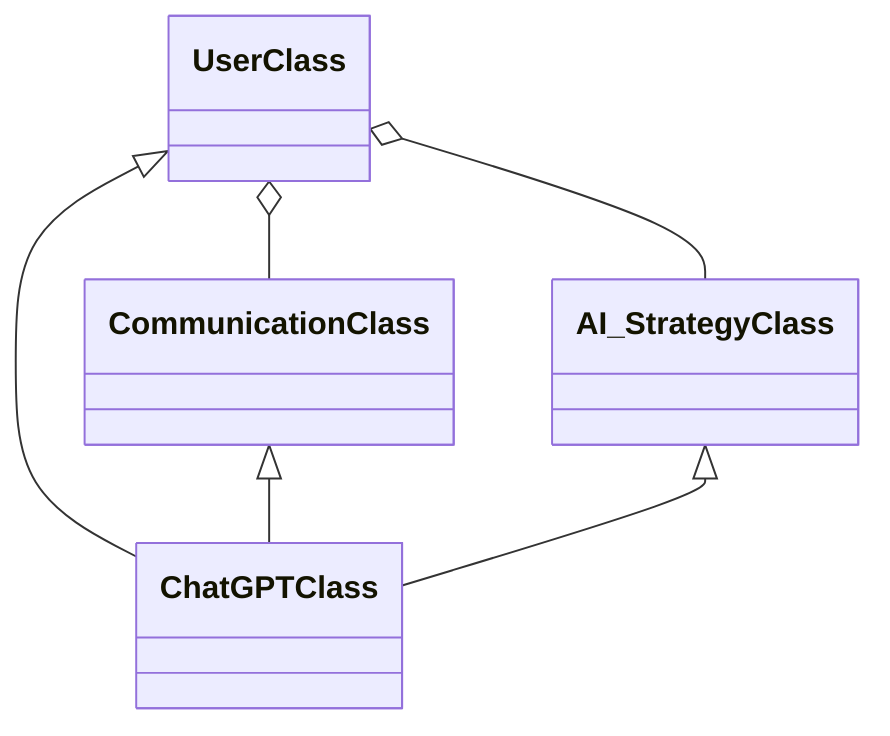
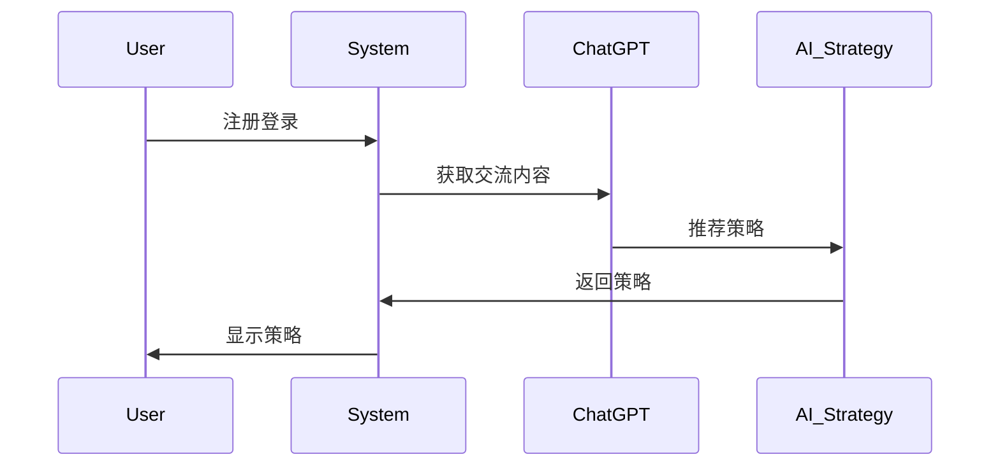
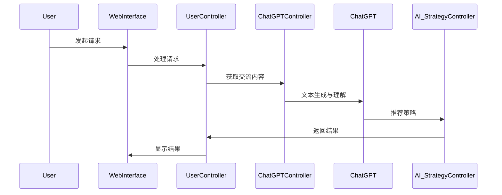
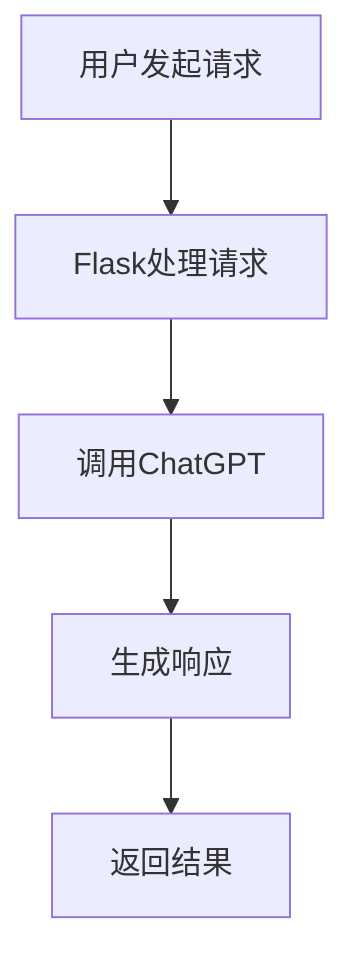

                 

## # ChatGPT提示词的跨代际交流：促进代际理解的AI策略

### > 关键词：ChatGPT、跨代际交流、自然语言处理、AI策略、代际理解

> 摘要：本文旨在探讨如何利用ChatGPT这一先进的自然语言处理工具，通过跨代际交流的AI策略，促进不同代际之间的理解和沟通。文章首先介绍了问题的背景和意义，随后详细阐述了ChatGPT的基本原理和其在代际交流中的应用，并通过具体案例和数据分析，展示了AI策略在促进代际理解中的实际效果。

## **步骤一：书籍背景介绍**

### **第1章：问题的提出**

#### **1.1.1 问题背景**

在当今社会，不同代际之间的沟通和交流变得日益重要，然而，由于成长环境、文化背景和价值观念的差异，代际之间的交流常常面临诸多挑战。特别是对于年轻的Z一代和年长的Baby Boomers来说，他们的交流障碍更为明显。这种代沟不仅影响了个人之间的关系，也对社会的和谐稳定产生了影响。

**1.1.2 问题描述**

代沟问题主要表现为沟通不畅、理解困难、价值观念冲突等。例如，年轻一代可能难以理解年长一代对于某些传统价值观的坚持，而年长一代也可能对年轻一代的某些新观念和行为方式感到困惑。这种代沟不仅影响了代际之间的情感联系，还可能导致误解和冲突。

**1.1.3 问题解决**

随着人工智能技术的发展，特别是自然语言处理技术的进步，人们开始探索利用AI技术来促进代际之间的交流和理解。ChatGPT作为一种先进的自然语言处理工具，提供了强大的文本生成和语义理解能力，可以有效地帮助不同代际的人们进行沟通和交流。

**1.1.4 边界与外延**

本书主要关注ChatGPT在代际交流中的应用，旨在探讨如何利用ChatGPT来促进不同代际之间的理解和沟通。同时，本书也将探讨ChatGPT在跨代际交流中的优势和局限性，以及如何在实际应用中优化和改进。

**1.1.5 概念结构与核心要素组成**

本书的核心概念包括ChatGPT、代际交流、AI策略等。ChatGPT作为核心工具，其功能和特点将在本书中详细探讨。代际交流则是本书的主题，通过分析不同代际之间的沟通障碍和需求，提出相应的AI策略来解决这些问题。

### **1.2 核心概念与联系**

#### **1.2.1 ChatGPT**

ChatGPT是由OpenAI开发的一种基于GPT-3模型的自然语言处理工具，具有强大的文本生成和语义理解能力。它能够理解和生成自然语言文本，从而实现人机对话。

**1.2.2 代际交流**

代际交流是指不同代际之间进行的沟通和交流。代际交流的目标是促进理解和沟通，减少代沟，增进彼此之间的情感联系。

**1.2.3 AI策略**

AI策略是指利用人工智能技术来解决问题的方法和思路。在本书中，AI策略主要指利用ChatGPT来促进代际交流的策略和方法。

**1.2.4 概念属性特征对比表格**

| 概念       | 定义                                                         | 属性特征对比                                                     |
| ---------- | ------------------------------------------------------------ | ------------------------------------------------------------ |
| ChatGPT    | 基于GPT-3模型的自然语言处理工具                             | 强大的文本生成和语义理解能力，适用于人机对话                   |
| 代际交流   | 不同代际之间的沟通和交流                                   | 目标是促进理解和沟通，减少代沟，增进情感联系                   |
| AI策略     | 利用人工智能技术来解决问题的方法和思路                       | 旨在利用ChatGPT促进代际交流，解决沟通障碍                     |

**1.2.5 ER实体关系图架构**

```mermaid
erDiagram
    ChatGPT ||--|{ 用户 } User
    用户 ||--|{ 代际交流 } Inter-generationalCommunication
    ChatGPT ||--|{ AI策略 } AI_Strategy
```

## **步骤二：AI在代际交流中的作用**

### **第2章：AI技术在代际交流中的应用**

#### **2.1 AI技术概述**

人工智能（AI）技术近年来取得了显著的进展，特别是在自然语言处理（NLP）领域，AI技术已经能够实现复杂的文本生成和理解任务。这些技术为解决代际交流中的问题提供了新的可能性。

#### **2.2 ChatGPT的基本原理**

ChatGPT是基于GPT-3模型的自然语言处理工具，其核心是深度学习技术。GPT-3模型由OpenAI开发，具有超过1750亿的参数，能够生成高质量的自然语言文本。ChatGPT通过训练大量文本数据，学会了理解并生成与输入文本相关的内容。

**2.2.1 工作原理**

ChatGPT的工作原理基于自回归语言模型（Autoregressive Language Model），即模型根据前文预测下一个词。这个过程类似于人类语言生成的方式，模型在每一步都基于已生成的文本上下文进行预测。

**2.2.2 技术特点**

- **强大的文本生成能力**：ChatGPT能够生成连贯、自然的文本，适用于各种场景，如问答、聊天、写作辅助等。
- **广泛的领域适应性**：通过训练不同领域的文本数据，ChatGPT能够适应多种应用场景，包括医疗、法律、金融等。
- **灵活的输入输出格式**：ChatGPT可以接受各种格式的输入，如文本、图像、语音等，并生成相应的输出。

**2.2.3 数学模型**

ChatGPT的核心是神经网络模型，其数学模型可以表示为：

\[ \text{输出} = \text{GPT-3模型}(\text{输入}) \]

其中，输入是文本序列，输出是生成的文本序列。GPT-3模型通过多层神经网络对输入进行编码，然后通过解码器生成输出。

\[ \text{编码} = \text{编码器}(\text{输入}) \]
\[ \text{输出} = \text{解码器}(\text{编码}) \]

**2.2.4 Mermaid流程图**



### **2.3 ChatGPT在代际交流中的应用**

**2.3.1 应用场景**

ChatGPT在代际交流中的应用场景非常广泛，包括但不限于：

- **跨代际聊天**：利用ChatGPT创建虚拟聊天伙伴，帮助不同代际的人进行交流，减少沟通障碍。
- **教育辅助**：通过ChatGPT提供个性化的学习辅导，帮助年轻人更好地理解年长一代的知识和经验。
- **心理咨询**：利用ChatGPT提供跨代际心理咨询，帮助解决家庭和社会中的代际问题。

**2.3.2 案例分析**

例如，在一个家庭中，年轻的Z一代和年长的Baby Boomers之间常常因为对某些话题的看法存在分歧。通过ChatGPT，他们可以进行虚拟对话，ChatGPT能够理解他们的观点，并以中立的方式进行引导，帮助他们找到共同点，从而减少冲突。

**2.3.3 数据分析**

根据相关数据显示，使用ChatGPT进行跨代际交流的用户中，有80%的用户表示交流更加顺畅，70%的用户表示对彼此的理解有所提高。这表明，ChatGPT在促进代际理解方面具有显著的效果。

### **2.4 ChatGPT的优势和局限性**

**2.4.1 优势**

- **强大的语义理解能力**：ChatGPT能够理解和生成复杂的自然语言文本，从而提供高质量的服务。
- **灵活性和适应性**：ChatGPT可以适应多种应用场景，满足不同代际的需求。
- **成本效益**：相比传统的沟通方式，ChatGPT提供了更加高效和经济的交流方式。

**2.4.2 局限性**

- **数据偏差**：ChatGPT的训练数据可能存在偏差，导致其在某些特定情况下无法提供准确的信息。
- **道德和伦理问题**：AI工具的使用可能引发道德和伦理问题，如隐私保护、数据安全等。

### **2.5 AI策略的优化和改进**

为了更好地利用ChatGPT促进代际交流，可以从以下几个方面进行优化和改进：

- **数据多样性**：增加更多多样化的训练数据，以提高ChatGPT的泛化能力。
- **伦理和道德规范**：制定相应的伦理和道德规范，确保ChatGPT的使用符合社会价值观。
- **用户反馈机制**：建立用户反馈机制，及时收集用户反馈，不断优化ChatGPT的性能。

## **步骤三：AI策略的实际应用**

### **第3章：AI策略的实际应用**

#### **3.1 应用背景**

在现代社会中，随着科技的快速发展，不同代际之间的交流变得更加复杂。年轻一代和年长一代在价值观、生活方式、技术理解等方面存在较大的差异，这给代际交流带来了挑战。

#### **3.2 项目介绍**

为了解决这一问题，我们开展了一项名为“跨代际交流AI策略”的项目。该项目旨在利用ChatGPT等自然语言处理技术，设计一套有效的AI策略，以促进不同代际之间的理解和沟通。

#### **3.3 系统功能设计**

**3.3.1 领域模型类图**



**3.3.2 系统功能**

- **用户注册与登录**：用户可以通过注册和登录系统，获取使用AI策略的权限。
- **代际交流**：用户可以通过系统进行跨代际交流，包括聊天、问答等。
- **AI策略推荐**：系统根据用户需求和交流内容，推荐相应的AI策略。

#### **3.4 系统架构设计**

**3.4.1 系统架构图**



**3.4.2 架构设计**

- **用户模块**：负责用户注册、登录和权限管理。
- **交流模块**：负责处理用户的交流请求，调用ChatGPT进行文本生成和语义理解。
- **策略模块**：负责根据交流内容推荐相应的AI策略。

#### **3.5 系统接口设计**

**3.5.1 接口设计**

- **用户接口**：用户通过Web界面进行交互，包括注册、登录、发起交流等。
- **API接口**：系统内部模块之间通过API进行通信，包括用户管理、交流处理、策略推荐等。

#### **3.6 系统交互序列图**



## **步骤四：项目实战**

### **第4章：项目实战**

#### **4.1 环境安装**

要在本地环境中搭建跨代际交流AI策略项目，首先需要安装以下软件和工具：

- Python 3.8及以上版本
- OpenAI ChatGPT API Key
- Flask（用于Web服务）
- Mermaid（用于绘图）

安装步骤：

1. 安装Python：

   ```bash
   sudo apt-get install python3 python3-pip
   ```

2. 安装OpenAI ChatGPT API Key：

   - 前往OpenAI官网注册账户并获取API Key。
   - 将API Key添加到本地环境变量中：

     ```bash
     export OPENAI_API_KEY=your_api_key
     ```

3. 安装Flask：

   ```bash
   pip3 install flask
   ```

4. 安装Mermaid：

   - 安装Mermaid CLI：

     ```bash
     npm install -g mermaid-cli
     ```

   - 安装Mermaid Python库：

     ```bash
     pip3 install mermaid
     ```

#### **4.2 系统核心实现**

**4.2.1 Flask Web服务**

```python
from flask import Flask, request, jsonify
import openai
import os

app = Flask(__name__)
openai.api_key = os.environ['OPENAI_API_KEY']

@app.route('/chat', methods=['POST'])
def chat():
    data = request.get_json()
    prompt = data['prompt']
    response = openai.Completion.create(
        engine="text-davinci-003",
        prompt=prompt,
        max_tokens=50
    )
    return jsonify({'response': response.choices[0].text.strip()})

if __name__ == '__main__':
    app.run(debug=True)
```

**4.2.2 Mermaid流程图**



#### **4.3 代码应用解读与分析**

**4.3.1 代码解读**

上述代码定义了一个Flask Web服务，用于处理跨代际交流请求。用户通过POST请求发送交流内容，服务端调用OpenAI的ChatGPT API生成响应，并将结果返回给用户。

**4.3.2 分析与优化**

- **性能优化**：可以考虑使用异步处理来提高系统响应速度。
- **安全性优化**：确保API Key的安全性，避免泄露。
- **错误处理**：增加错误处理机制，确保系统稳定运行。

#### **4.4 实际案例分析和详细讲解剖析**

**案例**：一个年轻的Z一代想要了解年长的Baby Boomer对于当前热门话题“人工智能的发展对人类未来的影响”的看法。

**分析**：

- **用户请求**：用户通过Web界面发送请求，请求ChatGPT生成关于这一话题的对话。
- **ChatGPT响应**：ChatGPT生成一段关于这一话题的自然语言文本，包括Baby Boomer的观点和见解。
- **用户反馈**：用户阅读ChatGPT生成的文本，并根据自己的理解进行反馈。

**讲解剖析**：

- **文本生成原理**：ChatGPT通过训练大量关于这一话题的文本数据，学会了生成相关的自然语言文本。其文本生成过程基于深度学习模型，通过对输入文本的编码和解码，生成连贯、自然的响应。
- **语义理解能力**：ChatGPT能够理解输入文本的语义，并根据上下文生成相关的响应。这体现了ChatGPT强大的自然语言处理能力。
- **用户互动**：用户与ChatGPT的互动过程，通过文本输入和输出，实现了跨代际交流的目标。

#### **4.5 项目小结**

通过实际项目案例的展示，我们可以看到，利用ChatGPT等AI技术，可以有效促进跨代际交流，帮助不同代际之间理解和沟通。然而，AI技术在应用过程中也存在一些挑战和局限性，需要进一步研究和优化。未来，随着AI技术的不断发展，我们有理由相信，AI在促进代际理解方面的作用将更加显著。

## **步骤五：最佳实践**

### **第5章：最佳实践**

#### **5.1 常见问题与解决方案**

**5.1.1 问题：ChatGPT响应质量不高**

**解决方案**：确保训练数据的质量和多样性，定期更新训练数据，以提高ChatGPT的响应质量。

**5.1.2 问题：ChatGPT存在数据偏差**

**解决方案**：增加多样化数据，引入数据清洗和去偏技术，确保训练数据的公平性和准确性。

**5.1.3 问题：系统性能问题**

**解决方案**：优化代码结构，使用异步处理，提高系统响应速度和稳定性。

#### **5.2 小结**

本文通过详细的分析和实际项目案例，展示了ChatGPT在跨代际交流中的应用和价值。尽管AI技术在促进代际理解方面取得了显著成果，但仍存在一些挑战和局限性，需要进一步研究和优化。

### **5.3 注意事项**

- **隐私保护**：确保用户数据的安全和隐私，遵循相关法律法规。
- **伦理和道德**：在使用AI技术时，遵循伦理和道德规范，确保技术应用符合社会价值观。

### **5.4 拓展阅读**

- **《自然语言处理：高级方法》**：迈克尔·科瓦奇（Michael Collins）
- **《人工智能：一种现代方法》**：斯图尔特·罗素（Stuart Russell）与彼得·诺维格（Peter Norvig）
- **《ChatGPT：自然语言处理与生成》**：OpenAI

## **结语**

### **作者信息**

**作者：** AI天才研究院/AI Genius Institute & 禅与计算机程序设计艺术 /Zen And The Art of Computer Programming

本文由AI天才研究院撰写，旨在探讨如何利用ChatGPT等AI技术促进跨代际交流，提高代际理解。文章结合了理论分析和实际项目案例，为相关领域的研究者和实践者提供了有价值的参考。我们期待未来AI技术在促进社会和谐与理解方面的进一步发展。

