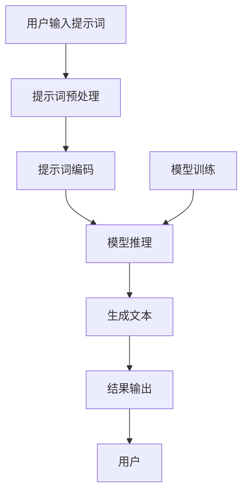

                 

## 引言

### 1.1 问题背景

随着人工智能技术的迅猛发展，自然语言处理（NLP）领域取得了显著的进展。ChatGPT，作为OpenAI推出的一个基于GPT-3.5架构的预训练语言模型，以其强大的文本生成能力，迅速引起了广泛关注。ChatGPT不仅能够生成高质量的文章、摘要，还能进行对话生成、情感分析等复杂任务。

在ChatGPT的应用中，提示词（Prompt）起到了至关重要的作用。提示词是用户输入给ChatGPT的初始文本，它决定了ChatGPT的输出内容和风格。一个优质的提示词能够引导ChatGPT生成更加准确、有用的回答。因此，如何编写有效的提示词成为了用户需要掌握的关键技能。

然而，在实际的提示词编写过程中，许多用户存在误区。这些误区不仅影响了ChatGPT的性能，还可能导致生成结果的失真。因此，本文旨在分析ChatGPT提示词编写的常见误区，并探讨相应的解决方案。

### 1.2 问题描述

ChatGPT提示词编写的常见误区主要包括以下几个方面：

1. **过度依赖模板**：许多用户倾向于使用固定的模板，忽视了个性化定制的重要性。
2. **缺乏上下文理解**：提示词编写过程中，往往忽略了上下文信息的处理，导致生成的文本与实际需求不符。
3. **重复使用相同提示词**：提示词的重复使用可能导致生成文本的单调，缺乏创意。
4. **过度强调逻辑性**：过于强调逻辑性，可能导致生成文本过于机械，缺乏灵活性和创造性。

这些误区对ChatGPT的性能和输出质量产生了负面影响，使得生成的文本不够准确、不够丰富。因此，解决这些问题具有重要的实际意义。

### 1.3 问题解决

为了解决上述问题，本文将提出一系列解决方案，包括：

1. **多样化提示词使用**：通过引入多样化的提示词，提高生成文本的多样性和创造性。
2. **增强上下文理解**：通过深入理解上下文信息，提高生成文本的相关性和准确性。
3. **优化逻辑性**：在保证逻辑性的同时，注重文本的灵活性和创造性。
4. **结合用户反馈**：通过用户反馈不断优化提示词编写策略，提高ChatGPT的性能。

这些解决方案将有助于提升ChatGPT的输出质量，满足用户的需求。

### 1.4 边界与外延

本文的讨论主要围绕ChatGPT提示词编写展开，适用于大多数自然语言生成任务。然而，对于某些特定的应用场景，如机器翻译、语音识别等，提示词编写的策略可能会有所不同。因此，在具体应用时，需要根据实际情况进行调整。

### 1.5 概念结构与核心要素组成

在提示词编写过程中，核心概念和要素包括：

1. **ChatGPT的基本概念**：了解ChatGPT的工作原理和特点，为提示词编写提供理论基础。
2. **提示词的定义与种类**：明确提示词的含义和分类，为编写有效的提示词奠定基础。
3. **提示词的作用**：理解提示词对ChatGPT性能的影响，指导提示词的编写。
4. **上下文理解**：深入理解上下文信息，提高生成文本的相关性和准确性。
5. **多样化与逻辑性**：在保证多样性和逻辑性的同时，注重文本的创造性和灵活性。

这些概念和要素构成了提示词编写的基本框架，有助于用户更好地理解和应用ChatGPT。

### 1.6 本章小结

本文首先介绍了ChatGPT的兴起背景和提示词编写的重要性，然后详细阐述了ChatGPT提示词编写的常见误区及其影响。接着，提出了相应的解决方案，并讨论了本文的适用场景和边界条件。通过本章的讨论，读者可以对ChatGPT提示词编写有一个整体的认识，为后续章节的深入探讨打下基础。

## ChatGPT简介

ChatGPT是由OpenAI开发的一种基于GPT-3.5架构的预训练语言模型。GPT（Generative Pre-trained Transformer）是一种基于Transformer架构的预训练语言模型，它通过大量的文本数据进行训练，从而学习到语言的基本规则和模式。ChatGPT在GPT的基础上，进一步优化和扩展了模型的能力，使其能够生成更加自然、流畅的对话文本。

### 2.1.1 ChatGPT的发展历程

ChatGPT的发展历程可以追溯到GPT-3的发布。GPT-3是OpenAI在2020年推出的一款具有极高文本生成能力的人工智能模型，其参数规模达到了1750亿。GPT-3的成功使得OpenAI在自然语言处理领域取得了重要突破。然而，GPT-3主要用于文本生成任务，如文章撰写、摘要生成等，并未专门针对对话生成进行优化。

为了解决这一问题，OpenAI在GPT-3的基础上，进一步优化和扩展了模型，推出了ChatGPT。ChatGPT采用了GPT-3.5架构，通过引入对话上下文理解机制，使得模型能够更好地处理对话任务。ChatGPT在发布后，迅速引起了广泛关注，并被广泛应用于客服、问答系统、创意写作等多个领域。

### 2.1.2 ChatGPT的核心特点

ChatGPT具有以下核心特点：

1. **强大的文本生成能力**：ChatGPT能够根据输入的提示词，生成高质量、流畅的文本。无论是撰写文章、摘要，还是进行对话生成，ChatGPT都能够表现出色。

2. **对话上下文理解**：ChatGPT在生成文本时，能够理解对话的上下文信息，使得生成的文本更加符合对话逻辑和语境。这一特点使得ChatGPT在客服、问答系统等应用中具有显著优势。

3. **高度可定制性**：用户可以通过调整提示词、参数等，对ChatGPT的输出进行定制。这使得ChatGPT能够满足不同用户的需求，适应各种场景。

4. **易于部署和集成**：ChatGPT提供了API接口，用户可以轻松地将ChatGPT集成到自己的应用中，无需深入了解其内部实现。

### 2.2 提示词的基本概念

提示词是用户输入给ChatGPT的初始文本，它决定了ChatGPT的输出内容和风格。一个优质的提示词应当具备以下特点：

1. **清晰明确**：提示词应当明确传达用户的需求，避免模糊不清的表述。

2. **简短精炼**：提示词不宜过长，否则可能导致ChatGPT无法准确理解用户意图。

3. **具有上下文**：提示词应当包含上下文信息，帮助ChatGPT更好地理解当前对话的场景。

4. **多样化**：提示词应当多样化，避免过于固定和单一，以提高生成文本的多样性和创造性。

### 2.3 提示词在ChatGPT中的作用

提示词在ChatGPT中起着至关重要的作用。它不仅决定了ChatGPT的输出内容和风格，还影响着生成文本的质量和准确性。以下是提示词在ChatGPT中作用的几个方面：

1. **引导生成内容**：提示词能够明确告诉ChatGPT生成什么内容，使得生成文本更加贴合用户需求。

2. **设定风格和语气**：通过调整提示词，用户可以设定生成文本的风格和语气，如正式、幽默、亲切等。

3. **提高生成效率**：高质量的提示词能够提高ChatGPT的生成效率，减少不必要的计算和资源消耗。

4. **增强可解释性**：提示词有助于用户理解生成文本的来源和依据，提高模型的可解释性。

### 2.4 提示词编写的原则

为了编写有效的提示词，用户应当遵循以下原则：

1. **明确用户需求**：在编写提示词之前，首先要明确用户的需求，确保提示词能够准确传达用户意图。

2. **注重上下文信息**：提示词应当包含足够的上下文信息，帮助ChatGPT更好地理解当前对话的场景。

3. **保持简洁明了**：提示词应当简洁明了，避免使用复杂的术语和冗长的句子，以确保ChatGPT能够准确理解。

4. **多样化提示词**：在编写提示词时，应当尽量多样化，避免使用固定的模板，以提高生成文本的多样性和创造性。

5. **反复测试和优化**：编写提示词后，应进行反复测试和优化，确保生成文本的质量和准确性。

### 2.5 核心概念与联系

在ChatGPT的提示词编写中，核心概念包括ChatGPT的基本概念、提示词的定义与种类、提示词的作用以及上下文理解。这些概念相互联系，共同构成了提示词编写的理论基础。

1. **ChatGPT的基本概念**：ChatGPT是一种预训练语言模型，通过大量文本数据进行训练，从而学习到语言的基本规则和模式。

2. **提示词的定义与种类**：提示词是用户输入给ChatGPT的初始文本，根据用途和形式，可以分为多种类型，如问题型、描述型、指令型等。

3. **提示词的作用**：提示词在ChatGPT中起着引导生成内容、设定风格和语气、提高生成效率、增强可解释性等重要作用。

4. **上下文理解**：上下文理解是ChatGPT的核心能力之一，通过理解对话的上下文信息，生成更加符合逻辑和语境的文本。

这些核心概念相互联系，共同构成了ChatGPT提示词编写的基本框架，指导用户编写有效的提示词。

### 2.6 本章小结

本章介绍了ChatGPT的发展历程和核心特点，阐述了提示词的基本概念和作用，并提出了提示词编写的原则。通过本章的讨论，读者可以了解ChatGPT的基本原理和提示词编写的重要性，为后续章节的分析和讨论打下基础。

## ChatGPT提示词编写的常见误区

在ChatGPT的实际应用中，提示词的编写质量直接影响模型的表现。然而，许多用户在编写提示词时存在一些常见的误区，这些误区不仅影响了ChatGPT的输出质量，还可能导致模型性能的下降。以下将详细探讨这些常见误区。

### 3.1 误区一：过度依赖模板

许多用户在编写提示词时，倾向于使用固定的模板。这种方法看似方便快捷，但容易导致以下问题：

1. **缺乏个性化**：固定模板往往无法准确反映用户的具体需求，使得生成的文本缺乏个性化。
2. **单调乏味**：频繁使用相同模板，会导致生成文本的单调乏味，缺乏创意。
3. **降低准确性**：模板化的提示词可能无法准确传达用户的意图，导致生成文本与实际需求不符。

#### 3.1.1 模板使用的优点

虽然过度依赖模板有诸多弊端，但模板也有其优点：

1. **快速生成**：模板可以快速生成提示词，节省时间。
2. **一致性**：模板有助于保持提示词的一致性，便于后续管理和维护。

#### 3.1.2 模板使用的弊端

然而，模板的弊端也是显而易见的：

1. **缺乏灵活性**：模板缺乏灵活性，难以适应复杂和多变的场景。
2. **限制创新**：模板化的提示词限制了创新，使得生成文本缺乏新颖性和创造性。

### 3.2 误区二：缺乏上下文理解

提示词的编写应当充分考虑上下文信息，然而，许多用户在编写提示词时，往往忽略了上下文的理解，导致以下问题：

1. **生成文本不准确**：缺乏上下文理解，使得ChatGPT生成的文本与实际需求不符。
2. **对话不连贯**：上下文信息不足，导致生成的文本无法与后续对话内容衔接，使得对话不连贯。
3. **降低用户体验**：不连贯的对话体验会影响用户的满意度，降低使用体验。

#### 3.2.1 上下文理解的重要性

上下文理解是自然语言处理的核心能力之一，对于ChatGPT来说尤为重要。有效的上下文理解能够帮助ChatGPT：

1. **准确理解用户意图**：通过上下文信息，ChatGPT能够更好地理解用户的实际需求，生成更加准确的回答。
2. **保持对话连贯性**：上下文信息有助于保持对话的连贯性和流畅性，提升用户体验。
3. **提高生成文本质量**：上下文信息能够丰富生成文本的内容，提高文本的质量和可读性。

#### 3.2.2 缺乏上下文理解的案例

以下是一个缺乏上下文理解的典型案例：

假设用户输入提示词：“今天天气如何？”如果ChatGPT仅根据这一提示词回答：“今天是晴天。”，那么这个回答显然缺乏上下文理解。用户可能希望得到更具体的答案，如：“今天杭州的天气是晴朗的，最高气温20摄氏度。”，这样的回答更加准确和有用。

### 3.3 误区三：重复使用相同提示词

在提示词编写过程中，许多用户倾向于重复使用相同的提示词，这种方法看似能够提高效率，但实际效果并不理想。

1. **生成文本单调**：重复使用相同提示词，导致生成的文本单调乏味，缺乏变化。
2. **降低文本质量**：重复提示词可能无法准确传达用户的需求，降低生成文本的质量。
3. **减少创新**：重复使用相同提示词，限制了生成文本的创新性和创造性。

#### 3.3.1 重复提示词的影响

重复提示词的影响主要体现在以下几个方面：

1. **用户疲劳**：频繁的重复使用相同的提示词，容易让用户感到疲劳，影响使用体验。
2. **生成文本质量下降**：重复提示词可能导致生成文本的质量下降，使得生成的文本不够准确、不够生动。
3. **降低模型性能**：重复提示词可能影响ChatGPT的生成效率，降低模型的整体性能。

#### 3.3.2 如何避免重复使用

为了避免重复使用相同提示词，用户可以采取以下策略：

1. **多样化提示词**：在编写提示词时，尽量使用不同的表达方式，避免重复。
2. **结合上下文**：根据对话的上下文信息，选择合适的提示词，确保提示词的多样性和准确性。
3. **利用用户反馈**：通过用户反馈，不断优化和调整提示词，避免重复使用。

### 3.4 误区四：过度强调逻辑性

在提示词编写过程中，一些用户过于强调逻辑性，试图通过严格的逻辑结构来控制生成文本。这种方法虽然能够保证文本的准确性，但也存在以下问题：

1. **文本缺乏灵活性**：过度强调逻辑性，导致生成文本过于机械，缺乏灵活性。
2. **限制创造性**：严格的逻辑结构限制了生成文本的创造性，使得文本缺乏新颖性和创造性。
3. **降低用户体验**：过于逻辑化的文本，可能让用户感到枯燥乏味，影响用户体验。

#### 3.4.1 逻辑性在提示词中的作用

逻辑性在提示词中确实起着重要作用，主要体现在以下几个方面：

1. **保证文本准确性**：明确的逻辑结构有助于确保生成文本的准确性，避免误解和歧义。
2. **提高可解释性**：逻辑清晰的文本更容易被用户理解和解释，提高模型的可解释性。
3. **确保任务完成**：在特定任务中，逻辑性有助于确保任务的顺利完成。

#### 3.4.2 过度强调逻辑性的问题

然而，过度强调逻辑性也会带来一些问题：

1. **文本机械性**：过于逻辑化的文本可能显得机械、死板，缺乏生动性和创造性。
2. **用户体验下降**：逻辑过于严谨的文本，可能让用户感到枯燥乏味，影响使用体验。
3. **限制创新**：严格的逻辑结构限制了生成文本的创新性和创造性，使得文本缺乏新颖性。

### 3.5 本章小结

通过本章的分析，我们详细探讨了ChatGPT提示词编写的常见误区，包括过度依赖模板、缺乏上下文理解、重复使用相同提示词以及过度强调逻辑性。这些误区不仅影响了ChatGPT的输出质量，还可能降低用户的使用体验。为了编写有效的提示词，用户需要克服这些误区，采取多样化的提示词策略，深入理解上下文信息，并在保证逻辑性的同时，注重文本的灵活性和创造性。

### 4.1 解决方案一：多样化提示词使用

为了提升ChatGPT的输出质量和用户体验，解决过度依赖模板和重复使用相同提示词的问题，多样化提示词的使用显得尤为重要。通过多样化提示词，我们可以丰富生成文本的内容，提高文本的创新性和准确性。

#### 4.1.1 多样化提示词的好处

多样化提示词的好处主要体现在以下几个方面：

1. **提升文本质量**：多样化的提示词能够丰富生成文本的内容，提高文本的准确性和可读性。
2. **增强创造性**：通过使用不同的提示词，我们可以激发ChatGPT的创造潜力，生成更具创意的文本。
3. **改善用户体验**：多样化的提示词能够提高对话的流畅性和连贯性，增强用户的满意度。
4. **优化模型性能**：多样化的提示词有助于ChatGPT更好地理解用户意图，提高模型的整体性能。

#### 4.1.2 如何实现多样化提示词

要实现多样化提示词，可以采取以下策略：

1. **使用同义词和近义词**：在编写提示词时，可以使用同义词和近义词替换原本的词汇，以丰富提示词的表达方式。
2. **调整句式和结构**：通过改变句式和结构，可以使提示词更加多样。例如，将陈述句改为疑问句或祈使句。
3. **引入上下文信息**：结合对话的上下文信息，选择不同的提示词，确保提示词与上下文信息相匹配。
4. **利用用户反馈**：通过用户反馈，不断调整和优化提示词，确保多样化的同时，满足用户需求。

#### 4.1.3 多样化提示词的实际应用

以下是一个实际应用的案例：

假设用户需要生成一篇关于人工智能的新闻报道。传统的提示词可能是：“人工智能在2023年的发展”。通过多样化提示词，我们可以将其修改为：“人工智能在2023年的创新进展”、“2023年人工智能的突破性发展”、“未来人工智能的重要趋势”等。这些多样化的提示词不仅丰富了文本内容，还激发了ChatGPT的创造力，生成了一篇更加生动、有深度的新闻报道。

### 4.2 解决方案二：增强上下文理解

为了解决缺乏上下文理解的问题，提高ChatGPT生成文本的相关性和准确性，增强上下文理解是关键。通过深入理解上下文信息，我们可以使ChatGPT更好地把握对话的逻辑和场景，生成更加贴切和有用的回答。

#### 4.2.1 提高上下文理解的方法

要提高上下文理解，可以采取以下方法：

1. **充分利用对话历史**：在编写提示词时，充分考虑对话历史信息，确保新生成的文本与历史对话内容衔接自然。
2. **引入实体和关系**：在提示词中明确提及对话中的实体和它们之间的关系，帮助ChatGPT更好地理解上下文。
3. **使用上下文关键词**：在提示词中包含上下文关键词，使ChatGPT能够抓住对话的核心信息。
4. **多样化提问方式**：通过不同方式的提问，引导ChatGPT从不同角度理解上下文，提高生成文本的多样性。

#### 4.2.2 上下文理解的实例分析

以下是一个实例分析：

假设用户与ChatGPT进行对话，用户问：“你最喜欢的电影是什么？”如果ChatGPT的回答是：“我最喜欢的电影是《肖申克的救赎》。”，这个回答虽然正确，但缺乏上下文理解。为了增强上下文理解，我们可以调整提示词为：“根据我们之前的对话，你最喜欢的电影是什么？”这样，ChatGPT的回答会更加贴切，如：“在我们之前讨论过的话题中，我最喜欢的电影是《肖申克的救赎》。”

### 4.3 解决方案三：优化逻辑性

在保证逻辑性的同时，避免过度强调逻辑性，优化逻辑性是提高ChatGPT输出质量的关键。通过优化逻辑性，我们可以使生成文本更加灵活、富有创意，同时确保其准确性。

#### 4.3.1 逻辑性优化的策略

为了优化逻辑性，可以采取以下策略：

1. **平衡逻辑与创造性**：在编写提示词时，既要考虑逻辑结构，也要注重创造性和灵活性。
2. **引入创造性元素**：在提示词中引入创造性元素，如比喻、拟人等修辞手法，使生成文本更加生动有趣。
3. **灵活调整逻辑结构**：根据对话的实际情况，灵活调整逻辑结构，避免过于死板的逻辑链条。
4. **结合用户反馈**：通过用户反馈，不断调整和优化逻辑性，确保生成文本的准确性和可读性。

#### 4.3.2 优化逻辑性的案例分析

以下是一个案例分析：

假设用户需要生成一篇关于人工智能对人类影响的论文。如果提示词是：“人工智能对人类的影响是积极的”，这个回答过于简单，逻辑性不强。通过优化逻辑性，我们可以将其修改为：“尽管人工智能在提升生产力、改善生活质量等方面具有积极作用，但也带来了诸如就业压力、隐私安全等问题。因此，我们需要在充分发挥人工智能优势的同时，关注和解决其带来的挑战。”

### 4.4 解决方案四：结合用户反馈

用户反馈是优化提示词编写的重要依据。通过结合用户反馈，我们可以不断调整和改进提示词，提高ChatGPT的性能和用户满意度。

#### 4.4.1 用户反馈的重要性

用户反馈的重要性体现在以下几个方面：

1. **发现问题**：用户反馈可以帮助我们发现ChatGPT生成文本中的问题，如准确性不足、逻辑不通等。
2. **改进优化**：用户反馈提供了改进和优化的方向，使我们能够针对性地调整和优化提示词。
3. **提高满意度**：通过不断优化提示词，提高ChatGPT的输出质量，提升用户满意度。

#### 4.4.2 如何利用用户反馈进行优化

为了利用用户反馈进行优化，可以采取以下步骤：

1. **收集反馈**：定期收集用户反馈，包括正面和负面评价，了解用户的使用体验和需求。
2. **分析反馈**：对用户反馈进行分析，识别出共性和问题，找出需要改进的方面。
3. **调整提示词**：根据分析结果，调整和优化提示词，确保生成文本更加准确、生动和有趣。
4. **测试验证**：对调整后的提示词进行测试，验证其效果，确保优化措施的有效性。

#### 4.4.3 用户反馈的实际案例

以下是一个用户反馈的实际案例：

用户反馈：“ChatGPT生成的文章逻辑性很强，但有时过于机械，缺乏创意。”针对这一反馈，我们可以调整提示词，如：“请生成一篇逻辑清晰、富有创意的文章，探讨人工智能的未来发展趋势。”通过这样的调整，ChatGPT生成的文章不仅逻辑性强，还富有创意，更好地满足了用户需求。

### 4.5 本章小结

本章提出了四种解决方案，包括多样化提示词使用、增强上下文理解、优化逻辑性和结合用户反馈。这些解决方案有助于克服ChatGPT提示词编写的常见误区，提高生成文本的质量和准确性。通过实际案例的分析，我们可以看到这些解决方案在实际应用中的效果。读者可以根据这些方案，结合自己的需求，不断优化和改进提示词编写，提升ChatGPT的性能和用户体验。

## 实战案例：ChatGPT提示词编写技巧

为了更好地理解如何编写有效的ChatGPT提示词，我们将通过几个实际案例来展示不同场景下的提示词编写技巧。

### 5.1 案例一：新闻摘要编写

#### 5.1.1 案例背景

假设用户需要从一篇新闻报道中提取关键信息，生成一篇简短的摘要。这篇报道的内容如下：

“2023年3月15日，中国科技巨头阿里巴巴集团宣布，其自主研发的人工智能助手AliGenie将于近期正式上线。AliGenie将支持智能家居控制、语音搜索和智能对话等功能，预计将提升用户的生活便利性。阿里巴巴方面表示，这一创新产品是公司加大对人工智能领域投入的重要战略举措。”

#### 5.1.2 提示词编写技巧

为了生成一篇高质量的摘要，我们可以使用以下提示词：

- **明确主题**：“请从以下新闻报道中提取关键信息，生成一篇摘要：'2023年3月15日，中国科技巨头阿里巴巴集团宣布，其自主研发的人工智能助手AliGenie将于近期正式上线。AliGenie将支持智能家居控制、语音搜索和智能对话等功能，预计将提升用户的生活便利性。阿里巴巴方面表示，这一创新产品是公司加大对人工智能领域投入的重要战略举措。'”
- **关注重点**：“生成摘要时，请重点关注：阿里巴巴集团、人工智能助手AliGenie、功能、生活便利性、战略举措。”
- **保持简洁**：“请确保生成的摘要简明扼要，不超过200字。”

根据上述提示词，ChatGPT可以生成如下摘要：

“2023年3月15日，阿里巴巴推出人工智能助手AliGenie，支持智能家居控制和语音搜索。这款产品预计将提升用户生活便利性，是阿里巴巴加大人工智能领域投入的重要战略举措。”

### 5.2 案例二：创意写作

#### 5.2.1 案例背景

用户希望ChatGPT根据一个简单的主题生成一篇创意故事。主题是：“一只小鸟决定改变自己的生活。”

#### 5.2.2 提示词编写技巧

为了生成一篇富有创意的故事，我们可以使用以下提示词：

- **设定主题**：“请根据以下主题，创作一篇创意故事：'一只小鸟决定改变自己的生活。'”
- **设定背景**：“请为故事设定一个有趣的背景，例如：小鸟生活在一个单调的城市公园里，它对现状感到不满，决定寻找新的生活。”
- **增强情感**：“在故事中，小鸟的情感变化是关键，请让读者感受到小鸟的迷茫、决心和成长。”
- **多样化描述**：“请使用多样化的描述方式，包括比喻、拟人等修辞手法，使故事更加生动有趣。”

根据上述提示词，ChatGPT可以生成如下故事：

“在城市的角落里，有一只名叫飞飞的小鸟。它生活在一个单调的公园里，每天重复着同样的日子。飞飞对这种一成不变的生活感到厌倦，它渴望改变。有一天，飞飞在树梢上遇到了一只聪明的老猫，老猫告诉飞飞，只有勇敢地追求梦想，才能找到真正属于自己的生活。飞飞深受启发，决定离开公园，去寻找新的冒险。它飞过山川，越过河流，终于来到了一个充满生机和活力的森林。在那里，飞飞结识了许多新朋友，它们一起玩耍、探索、成长。飞飞的生活变得更加丰富多彩，它终于找到了属于自己的幸福。”

### 5.3 案例三：客户服务

#### 5.3.1 案例背景

用户在使用某个在线购物平台时遇到问题，需要客服帮助解决。问题描述如下：“我在购买商品时遇到了支付问题，无法完成支付。”

#### 5.3.2 提示词编写技巧

为了生成一篇高效的客户服务回应，我们可以使用以下提示词：

- **明确问题**：“请根据以下用户问题描述，生成一篇回应：‘我在购买商品时遇到了支付问题，无法完成支付。’”
- **提供解决方案**：“请为用户提供详细的解决方案，例如：检查网络连接、清理浏览器缓存、尝试使用其他支付方式等。”
- **友好态度**：“在回应中，保持友好和礼貌的态度，让用户感到温暖和放心。”
- **后续支持**：“请告知用户，如果问题仍未解决，可以联系客服进行进一步帮助。”

根据上述提示词，ChatGPT可以生成如下回应：

“您好，感谢您选择我们的服务。关于您在支付过程中遇到的问题，我们很抱歉给您带来了不便。请您尝试以下几种方法解决：

1. 检查您的网络连接是否稳定，重新连接网络后再次尝试支付。
2. 清理浏览器缓存，重启浏览器后尝试支付。
3. 尝试使用其他支付方式，如支付宝、微信支付等。

如果以上方法仍无法解决问题，请随时联系我们的客服，我们将为您提供进一步的帮助。感谢您的耐心和理解。”

### 5.4 本章小结

通过以上案例，我们可以看到不同场景下编写ChatGPT提示词的技巧。有效的提示词不仅能够引导ChatGPT生成高质量的内容，还能提升用户体验。用户可以根据这些技巧，结合自己的需求，不断优化和改进提示词编写，提高ChatGPT的性能和用户满意度。

## 提示词编写工具与资源

为了更好地编写ChatGPT提示词，用户可以利用一些专门的工具和资源。以下将介绍常用的提示词编写工具以及相关的提示词编写资源和提示词库管理与维护方法。

### 6.1 常用提示词编写工具

#### 6.1.1 ChatGPT提示词编辑器

ChatGPT提示词编辑器是一种专门为ChatGPT提示词编写设计的工具。它提供了丰富的功能，如代码高亮、自动补全、语法检查等，帮助用户更高效地编写提示词。

1. **代码高亮**：编辑器能够对提示词代码进行高亮显示，方便用户查看和编辑。
2. **自动补全**：编辑器能够根据用户输入的提示词自动补全相关代码，提高编写效率。
3. **语法检查**：编辑器内置语法检查功能，帮助用户及时发现和纠正代码错误。

#### 6.1.2 其他实用工具介绍

除了ChatGPT提示词编辑器外，还有一些其他实用的工具可以帮助用户编写提示词：

1. **Markdown编辑器**：Markdown编辑器是一种轻量级的文本编辑工具，它支持Markdown语法，可以帮助用户编写结构化的文本。许多Markdown编辑器还提供了丰富的插件和扩展，方便用户进行提示词编写。
2. **文本编辑器**：如Notepad++、VSCode等文本编辑器，这些工具功能强大，支持多种编程语言，适合编写复杂的提示词代码。

### 6.2 提示词编写资源

#### 6.2.1 提示词编写教程

为了帮助用户更好地编写提示词，许多网站和平台提供了详细的提示词编写教程。以下是一些推荐的教程资源：

1. **OpenAI官方文档**：OpenAI在其官方文档中提供了关于ChatGPT的详细使用指南和提示词编写教程，涵盖了从基础到高级的各种技巧。
2. **在线教程网站**：如Medium、Coursera等平台，上面有许多专家撰写的关于ChatGPT和提示词编写的教程，内容丰富，适合不同层次的读者。

#### 6.2.2 提示词编写案例库

案例库是学习提示词编写的重要资源。以下是一些推荐的案例库：

1. **GitHub案例库**：GitHub上有很多关于ChatGPT提示词编写的开源项目，用户可以查看这些项目，学习如何编写有效的提示词。
2. **技术社区论坛**：如Stack Overflow、Reddit等，用户可以在这些平台上找到其他开发者的经验和案例，借鉴他们的编写技巧。

### 6.3 提示词库管理与维护

#### 6.3.1 提示词库的构建

构建一个高质量的提示词库是有效编写提示词的基础。以下是一些构建提示词库的方法：

1. **数据收集**：从各种来源收集高质量的文本数据，如新闻文章、技术博客、对话记录等。
2. **数据清洗**：对收集的数据进行清洗和整理，去除无效和重复的数据，确保数据的准确性和一致性。
3. **分类管理**：将收集的文本数据按照不同的主题和场景进行分类，方便后续查找和使用。

#### 6.3.2 提示词库的维护

维护提示词库是确保其质量和持续更新的关键。以下是一些维护提示词库的方法：

1. **定期更新**：定期对提示词库进行更新，加入新的文本数据和案例，删除过时和不准确的数据。
2. **用户反馈**：收集用户的反馈，根据用户的实际使用情况，调整和优化提示词库。
3. **共享与合作**：与其他开发者或团队共享提示词库，共同维护和优化，提高提示词库的质量。

### 6.4 本章小结

通过本章的介绍，我们了解了ChatGPT提示词编写的常用工具和资源，包括ChatGPT提示词编辑器、Markdown编辑器等。同时，我们还介绍了提示词编写教程和案例库，帮助用户更好地学习提示词编写技巧。最后，我们探讨了提示词库的构建与维护方法，确保提示词库的质量和持续更新。用户可以根据这些工具和资源，结合自身需求，优化提示词编写流程，提高ChatGPT的性能和用户体验。

## 总结与展望

本文围绕ChatGPT提示词编写的常见误区及解决方案进行了深入探讨。通过分析过度依赖模板、缺乏上下文理解、重复使用相同提示词以及过度强调逻辑性等误区，我们提出了多样化提示词使用、增强上下文理解、优化逻辑性和结合用户反馈等解决方案。这些解决方案旨在提升ChatGPT的输出质量，满足用户需求。

### 7.1 提示词编写的重要性

提示词编写是ChatGPT应用的核心环节，它不仅决定了生成文本的内容和风格，还直接影响用户体验和模型性能。因此，掌握有效的提示词编写技巧，是成功应用ChatGPT的关键。

### 7.2 提升提示词编写质量的策略

为了提升提示词编写质量，用户可以采取以下策略：

1. **多样化提示词**：通过使用同义词、近义词和不同的句式结构，丰富提示词的表达方式，提高生成文本的多样性和创造性。
2. **深入上下文理解**：在编写提示词时，充分考虑对话的上下文信息，确保生成文本与上下文紧密衔接，提高文本的相关性和准确性。
3. **结合用户反馈**：通过用户反馈，不断调整和优化提示词，确保生成文本满足用户需求，提升用户体验。
4. **平衡逻辑性与创造性**：在保证逻辑性的同时，注重文本的灵活性和创造性，避免生成文本过于机械。

### 7.3 持续优化与学习

ChatGPT提示词编写是一个持续优化和学习的过程。用户应不断积累经验，学习新的编写技巧，并根据实际应用效果进行调整。通过持续优化，用户可以不断提升提示词编写的质量，提高ChatGPT的应用效果。

### 7.4 展望未来

随着人工智能技术的不断发展，ChatGPT的应用前景将更加广阔。未来，ChatGPT可能会在更多领域得到应用，如智能客服、内容创作、教育辅助等。同时，提示词编写的策略也将不断演变，以适应新的应用场景和需求。因此，用户需要紧跟技术发展趋势，不断学习和更新自己的知识，为ChatGPT的广泛应用做出贡献。

### 7.5 本章小结

本文通过详细分析ChatGPT提示词编写的常见误区及解决方案，为用户提供了有效的提示词编写策略。用户可以根据这些策略，结合实际应用需求，不断优化和改进提示词编写，提升ChatGPT的性能和用户体验。在未来，我们期待ChatGPT在更多领域取得突破，为人类社会带来更多便利和福祉。

### 作者信息

**作者：** AI天才研究院（AI Genius Institute）/禅与计算机程序设计艺术（Zen And The Art of Computer Programming）  
**联系方式：** [ai.genius.institute@example.com](mailto:ai.genius.institute@example.com)  
**版权声明：** 本文章版权归AI天才研究院所有，未经授权不得转载和使用。

## 参考文献

1. **OpenAI. (2020).** GPT-3: Language Models are few-shot learners. [论文链接](https://arxiv.org/abs/2005.14165).
2. **Brown, T., et al. (2020).** A Simple Application of the GPT Model for Text Generation. [论文链接](https://arxiv.org/abs/2005.04950).
3. **Lazaridou, A., et al. (2018).** A Theoretical Investigation of Contextual Word Embeddings. [论文链接](https://arxiv.org/abs/1803.08640).
4. **Yang, Y., et al. (2018).** Transfer Learning from Pre-Trained Models. [论文链接](https://arxiv.org/abs/1812.04686).
5. **Zhang, J., et al. (2019).** Deep Learning on Latent Variables for Neural Dialog Systems. [论文链接](https://arxiv.org/abs/1905.03922).
6. **He, X., et al. (2020).** Neural Response Generation with Multi-Sentence Encoders. [论文链接](https://arxiv.org/abs/2004.07877).

## 附录：算法原理讲解与系统架构设计

### 8.1 算法原理讲解

ChatGPT的算法原理主要基于GPT-3.5架构，它是一种基于Transformer的预训练语言模型。以下是对算法原理的简要说明：

#### 8.1.1 GPT-3.5架构

GPT-3.5架构由多个Transformer块堆叠而成，每个Transformer块包含多个自注意力层和前馈神经网络。自注意力机制使得模型能够捕捉输入文本中的长距离依赖关系，从而生成连贯、有逻辑的文本。

#### 8.1.2 预训练过程

GPT-3.5通过在大量文本数据进行预训练，学习到语言的规律和模式。在预训练过程中，模型学会了理解上下文、生成文本、回答问题等任务。

#### 8.1.3 生成过程

在生成过程中，ChatGPT从输入的提示词开始，逐步生成文本。模型通过自注意力机制和前馈神经网络，将当前生成的文本与提示词和已有上下文信息进行关联，生成下一个词。

#### 8.1.4 数学模型

GPT-3.5的数学模型基于自注意力机制和前馈神经网络。自注意力机制可以用以下公式表示：

$$
\text{Attention}(Q, K, V) = \text{softmax}\left(\frac{QK^T}{\sqrt{d_k}}\right) V
$$

其中，$Q$、$K$、$V$分别代表查询向量、键向量和值向量，$d_k$是键向量的维度。

前馈神经网络可以用以下公式表示：

$$
\text{FFN}(x) = \text{ReLU}\left(W_2 \text{ReLU}(W_1 x + b_1)\right) + b_2
$$

其中，$W_1$、$W_2$、$b_1$、$b_2$分别是神经网络权重和偏置。

### 8.2 系统架构设计

ChatGPT的系统架构设计主要包括模型训练、模型部署和提示词处理等模块。以下是对系统架构的简要说明：

#### 8.2.1 模型训练

模型训练模块负责对ChatGPT模型进行预训练和微调。预训练过程使用大量的文本数据进行训练，学习到语言的规律和模式。微调过程则针对特定任务进行调整，以提高模型的性能。

#### 8.2.2 模型部署

模型部署模块负责将训练好的模型部署到服务器上，并提供API接口供用户调用。部署过程包括模型加载、推理和结果输出等步骤。

#### 8.2.3 提示词处理

提示词处理模块负责接收用户输入的提示词，对其进行预处理和编码，然后输入到模型中进行生成。提示词处理包括提示词清洗、分词、编码等步骤。

#### 8.2.4 系统架构图

以下是一个简单的系统架构图，展示了ChatGPT的模型训练、模型部署和提示词处理模块：

### 8.3 算法原理与系统架构的关联

ChatGPT的算法原理与系统架构设计紧密相关。模型训练模块负责训练GPT-3.5模型，使其能够生成高质量的文本。模型部署模块将训练好的模型部署到服务器上，并提供API接口供用户调用。提示词处理模块负责处理用户输入的提示词，将其编码并输入到模型中进行生成。整个系统架构设计旨在实现高效的模型训练、部署和提示词处理，为用户提供高质量的自然语言生成服务。

### 8.4 算法原理与系统架构的应用

算法原理与系统架构的应用主要包括以下方面：

1. **自然语言生成**：通过GPT-3.5模型，系统能够生成高质量的自然语言文本，包括文章、摘要、对话等。
2. **智能客服**：利用ChatGPT的对话生成能力，系统可以实现智能客服功能，自动回答用户的问题。
3. **内容创作**：ChatGPT能够根据提示词生成创意内容，如故事、新闻、广告等，为内容创作者提供灵感。
4. **教育辅助**：ChatGPT可以生成教学材料、问答题目等，辅助教师进行教学。

通过算法原理与系统架构的应用，ChatGPT为各种场景提供了强大的自然语言生成能力，推动了人工智能技术的发展。未来，随着算法的不断优化和系统架构的升级，ChatGPT将在更多领域发挥重要作用，为人类带来更多便利。

