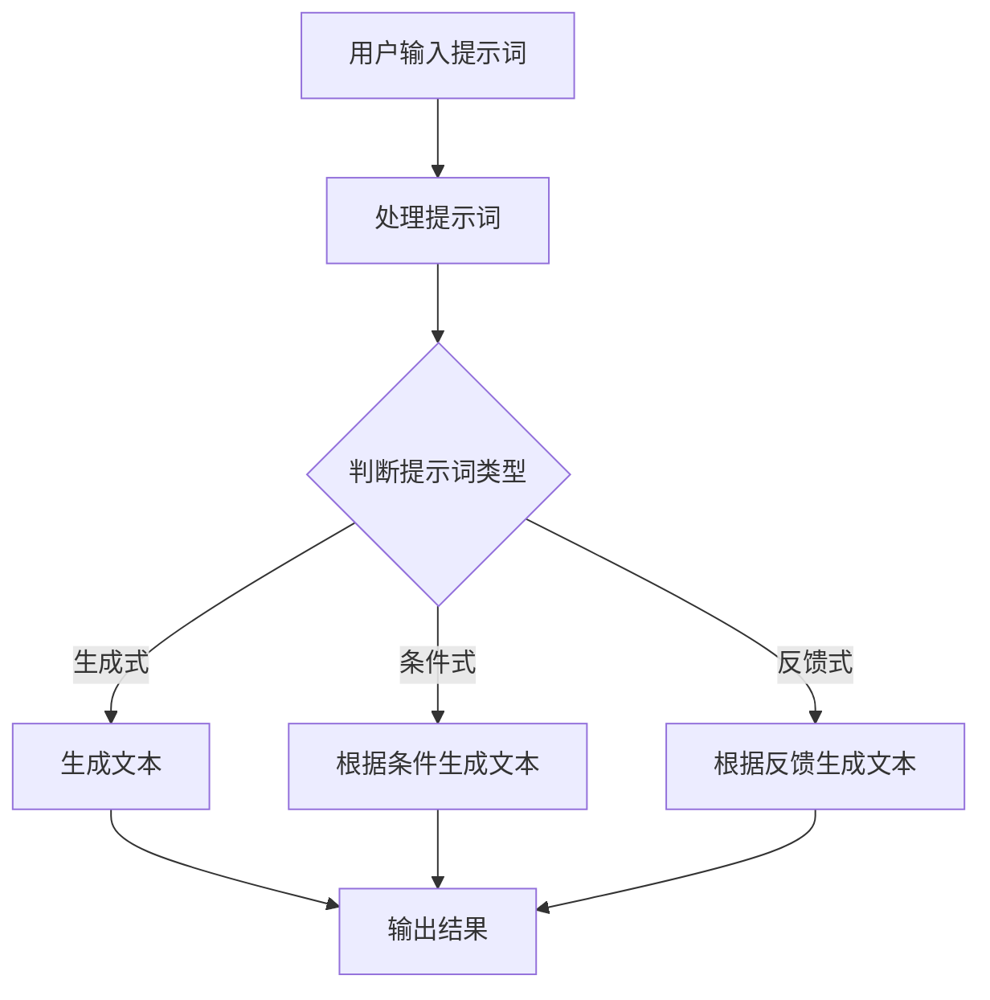
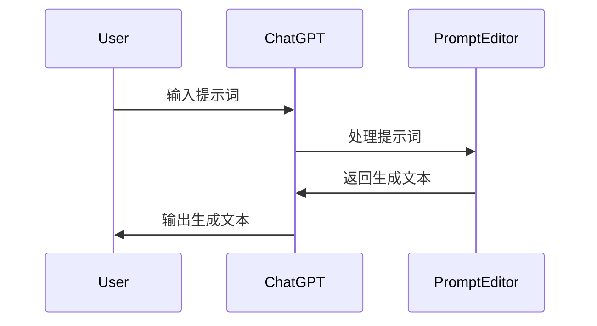

                 


# ChatGPT提示词编写：从入门到精通

关键词：ChatGPT、提示词、自然语言处理、人工智能、优化策略、应用实战

摘要：本文旨在深入探讨ChatGPT提示词编写的全过程，从基础概念到高级技巧，涵盖优化、调试和应用等多个方面，帮助读者从入门到精通，全面掌握ChatGPT提示词编写技能。

## 第1章: ChatGPT提示词编写基础

### 1.1.1. ChatGPT是什么

ChatGPT是OpenAI开发的一款基于GPT-3.5的聊天机器人，它能够通过学习和理解人类语言来进行对话，回答问题，甚至可以参与任务执行。ChatGPT的核心在于其强大的自然语言处理能力和生成能力，这得益于其背后的Transformer模型架构。

### 1.1.2. ChatGPT提示词的作用

提示词（Prompts）是引导ChatGPT产生预期输出的重要工具。它们可以帮助定义对话的方向，引导模型生成符合要求的文本，从而提高聊天机器人的交互质量和效率。

### 1.1.3. ChatGPT的发展历程与未来趋势

ChatGPT的诞生标志着自然语言处理技术的新里程碑。从GPT-1到GPT-3，再到GPT-3.5，OpenAI不断突破技术极限，提升模型的性能和应用范围。未来，ChatGPT将继续在语言理解和生成领域发挥重要作用，甚至可能影响人类生活和工作的方方面面。

## 第2章: 提示词编写技巧

### 2.1.1. 提示词编写的基本原则

编写提示词时，应遵循清晰、简洁、具体、明确等基本原则。一个优秀的提示词能够引导ChatGPT生成高质量的输出，减少冗余和误导。

### 2.1.2. 生成式提示词编写方法

生成式提示词旨在引导模型生成特定的文本内容。编写这类提示词时，可以采用以下方法：

- **目标明确**：明确要求模型生成的文本类型和内容。
- **上下文丰富**：提供充分的上下文信息，帮助模型理解问题背景。
- **结构清晰**：使用明确的段落和句子结构，方便模型理解。

### 2.1.3. 条件式提示词编写方法

条件式提示词则关注于根据特定条件生成文本。这类提示词的关键在于准确设定条件，并确保模型能够正确理解和应用这些条件。

- **条件描述**：详细描述条件，确保无歧义。
- **条件关联**：明确条件之间的逻辑关系，避免混淆。

### 2.1.4. 反馈式提示词编写方法

反馈式提示词用于引导模型根据用户反馈调整输出。编写这类提示词时，应注意：

- **反馈清晰**：提供明确的反馈信息，帮助模型改进输出。
- **迭代循环**：鼓励模型不断迭代，生成更符合要求的文本。

## 第3章: 提示词的优化与调试

### 3.1.1. 提示词优化的重要性

优化提示词能够显著提升ChatGPT的生成效果，减少错误和偏差，提高模型的可解释性。

### 3.1.2. 提示词优化策略

优化策略包括：

- **多样化输入**：提供多种类型的输入，丰富模型训练数据。
- **精细调整**：根据实际需求，对提示词进行精细调整。
- **交叉验证**：使用不同的提示词进行交叉验证，选择最优方案。

### 3.1.3. 提示词调试技巧

调试技巧包括：

- **代码调试**：使用代码调试工具，定位和修复提示词编写中的错误。
- **日志分析**：分析模型日志，了解模型对提示词的响应和生成过程。

## 第4章: ChatGPT提示词应用实战

### 4.1.1. 文本生成应用

文本生成是ChatGPT的主要应用场景之一。通过编写合适的提示词，可以实现：

- **内容创作**：生成文章、博客、小说等。
- **对话模拟**：模拟人与机器人的对话场景。

### 4.1.2. 对话生成应用

对话生成应用包括：

- **客服机器人**：提供24/7的在线客服支持。
- **聊天机器人**：用于社交平台、即时通讯等。

### 4.1.3. 实际案例分析

本文将通过实际案例，详细解析如何编写高质量的ChatGPT提示词，并展示其在不同场景下的应用。

## 第5章: 高级提示词编写技术

### 5.1.1. 对话管理技巧

对话管理技巧包括：

- **语境保持**：确保对话内容连贯，避免上下文跳转。
- **用户意图识别**：准确识别用户意图，提高响应速度。

### 5.1.2. 多模态提示词编写

多模态提示词结合了文本、图像、声音等多种信息，能够显著提升ChatGPT的交互体验。

- **文本与图像结合**：生成描述性文本，同时展示相关图像。
- **文本与声音结合**：生成语音响应，提高交互的自然度。

### 5.1.3. 提示词安全性与隐私保护

在编写提示词时，应关注安全性和隐私保护：

- **数据加密**：确保输入数据和生成文本的安全性。
- **隐私保护策略**：避免泄露用户隐私信息。

## 第6章: ChatGPT提示词编写工具与平台

### 6.1.1. 常用提示词编写工具介绍

常用工具包括：

- **ChatGPT API**：OpenAI提供的官方API，用于与ChatGPT进行交互。
- **OpenAI Playground**：OpenAI提供的在线平台，方便用户编写和测试提示词。

### 6.1.2. 提示词编写平台选择

选择平台时，应考虑以下因素：

- **功能丰富度**：平台是否提供丰富的提示词编写和调试功能。
- **易用性**：平台的操作是否简单易用。
- **社区支持**：平台是否有活跃的社区，提供帮助和支持。

### 6.1.3. 提示词库管理与维护

提示词库的管理和维护包括：

- **分类存储**：将提示词分类存储，便于查找和使用。
- **持续更新**：定期更新提示词库，引入新的编写技巧和应用场景。

## 第7章: 未来展望与趋势分析

### 7.1.1. ChatGPT提示词编写的未来发展

未来，ChatGPT提示词编写将继续向多模态、智能化方向发展，满足更广泛的应用需求。

### 7.1.2. 提示词编写行业趋势

随着人工智能技术的不断发展，提示词编写将在多个领域得到广泛应用，成为自然语言处理领域的重要组成部分。

### 7.1.3. 技术挑战与解决方案

技术挑战包括：

- **模型解释性**：提高模型的解释性，使其生成过程更加透明。
- **性能优化**：提升模型性能，降低计算成本。

解决方案包括：

- **模型压缩**：通过模型压缩技术，降低模型大小，提高部署效率。
- **多模态融合**：结合多模态数据，提高模型的感知能力和生成质量。

### 作者

作者：AI天才研究院/AI Genius Institute & 禅与计算机程序设计艺术 /Zen And The Art of Computer Programming

## 完整性要求

在本文中，我们将详细讨论以下核心概念和内容：

### 核心概念与联系

**ChatGPT**：
- **概念原理**：基于GPT-3.5的聊天机器人。
- **属性特征**：
  - **生成能力**：强大的自然语言生成能力。
  - **交互性**：能够与用户进行对话。

**提示词**：
- **概念原理**：引导ChatGPT生成预期输出的文字。
- **属性特征**：
  - **清晰性**：明确指示模型生成目标。
  - **简洁性**：避免冗余和误导。

### 算法原理讲解

**ChatGPT模型**：
- **算法流程**：输入提示词 -> 模型处理 -> 输出生成文本。
- **数学模型**：基于Transformer模型，使用自注意力机制。

**提示词优化策略**：
- **优化目标**：提升生成文本质量。
- **优化方法**：
  - **多样化输入**：提供多种类型的数据。
  - **交叉验证**：不同提示词进行测试。

### 系统分析与架构设计方案

**问题场景**：编写高质量的ChatGPT提示词。

**项目介绍**：本文旨在提供ChatGPT提示词编写的全面指南。

**系统功能设计**：
- **基础功能**：介绍ChatGPT和提示词的基本概念。
- **高级功能**：探讨优化策略和应用实战。

**系统架构设计**：


**系统接口设计和系统交互**：


### 项目实战

**环境安装**：
- 安装OpenAI的ChatGPT API。
- 配置环境变量。

**系统核心实现源代码**：
```python
# 示例：生成式提示词编写
import openai

openai.api_key = "your_api_key"

def generate_text(prompt):
    response = openai.Completion.create(
        engine="text-davinci-003",
        prompt=prompt,
        max_tokens=50,
        n=1,
        stop=None,
        temperature=0.5,
    )
    return response.choices[0].text.strip()

# 使用示例
prompt = "请写一段关于人工智能的介绍。"
print(generate_text(prompt))
```

**代码应用解读与分析**：
- 代码解析：调用OpenAI API，输入提示词，生成文本。
- 分析：代码展示了如何使用ChatGPT API进行提示词编写，并生成了指定格式的文本。

**实际案例分析和详细讲解剖析**：
- 案例分析：通过实际编写提示词，生成文本，展示其效果。
- 讲解剖析：详细解析提示词编写的过程和结果，分析其优势和不足。

**项目小结**：
- 提示词编写对于ChatGPT的性能至关重要。
- 实际案例展示了提示词编写的实用性和效果。

### 最佳实践 tips

- **明确目标**：在编写提示词时，确保目标明确，避免模糊。
- **简洁明了**：使用简洁明了的语言，提高提示词的可读性。
- **多样化输入**：提供多样化的输入数据，提高模型的泛化能力。

### 小结

本文全面介绍了ChatGPT提示词编写的全过程，从基础到高级，涵盖优化、调试和应用等多个方面。通过本文的讲解，读者可以系统地掌握ChatGPT提示词编写的技能，并在实际项目中应用。

### 注意事项

- 在编写提示词时，注意保护用户隐私，避免泄露敏感信息。
- 在使用ChatGPT API时，遵循OpenAI的使用政策。

### 拓展阅读

- [OpenAI官方文档](https://openai.com/docs/)
- [自然语言处理入门](https://www.nltk.org/)

### 总结

ChatGPT提示词编写是自然语言处理领域的一项重要技能。通过本文的讲解，读者可以深入了解提示词编写的全过程，掌握从基础到高级的编写技巧。希望本文能够为您的学习之路提供有力支持。作者：AI天才研究院/AI Genius Institute & 禅与计算机程序设计艺术 /Zen And The Art of Computer Programming。|</sop>

