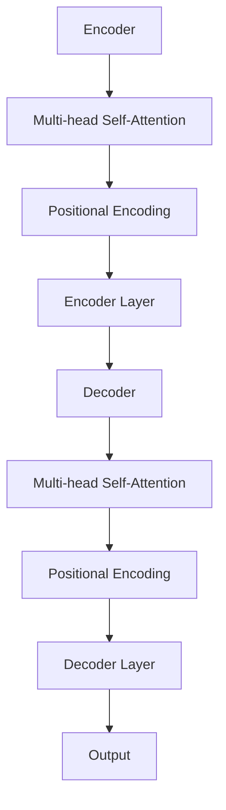

                 


### 设计思路与章节安排

为了设计《ChatGPT提示词编写：从入门到精通的进阶指南》这本书的完整目录大纲，我们首先需要明确目标读者的群体，即对ChatGPT提示词编写感兴趣的读者，包括初学者、中级开发者以及希望进阶的专业人士。

#### 目录大纲的设计思路如下：

1. **引言**：介绍ChatGPT及其提示词编写的重要性，概述全书内容结构和目标。
2. **基础篇**：针对初学者，介绍ChatGPT的基本概念、工作原理和提示词编写的基本技巧。
3. **进阶篇**：针对中级开发者，深入探讨提示词编写的策略、技巧和案例分析。
4. **实战篇**：通过具体项目实践，引导读者掌握从构建到优化的全过程。
5. **高级篇**：针对专业人士，探讨高级提示词编写技术，包括定制化、优化和复杂场景下的应用。
6. **总结篇**：对全书内容进行总结，提供一些最佳实践、注意事项以及拓展阅读资源。

#### 章节安排：

### 第一部分：引言

#### 第1章：ChatGPT与提示词编写概述

- 1.1 ChatGPT简介
- 1.2 提示词编写的重要性
- 1.3 全书内容结构

### 第二部分：基础篇

#### 第2章：ChatGPT基础知识

- 2.1 ChatGPT的基本原理
- 2.2 提示词的基础概念
- 2.3 基础提示词编写技巧

#### 第3章：初学者快速入门

- 3.1 ChatGPT的安装与使用
- 3.2 简单提示词编写实践
- 3.3 常见问题解答

### 第三部分：进阶篇

#### 第4章：进阶提示词编写技巧

- 4.1 提示词优化策略
- 4.2 高级提示词编写技巧
- 4.3 案例分析：优秀提示词实例解析

#### 第5章：项目实战

- 5.1 实战项目介绍
- 5.2 项目需求分析
- 5.3 提示词编写与优化实践

### 第四部分：高级篇

#### 第6章：高级提示词编写技术

- 6.1 定制化提示词编写
- 6.2 复杂场景下的提示词优化
- 6.3 实际应用案例

#### 第7章：高级技巧与最佳实践

- 7.1 高级技巧探讨
- 7.2 最佳实践分享
- 7.3 注意事项与未来趋势

### 第五部分：总结篇

#### 第8章：全书内容总结与拓展

- 8.1 全书重点回顾
- 8.2 最佳实践提示
- 8.3 注意事项
- 8.4 拓展阅读资源

### 目录大纲示例（Markdown格式）

```markdown
----------------------------------------------------------------
# 《ChatGPT提示词编写：从入门到精通的进阶指南》

> 关键词：ChatGPT、提示词编写、进阶指南、人工智能、自然语言处理

> 摘要：本书旨在为读者提供全面深入的ChatGPT提示词编写指南，从基础入门到高级应用，帮助读者掌握ChatGPT提示词编写的核心技巧和实践方法。

## 第一部分：引言

### 第1章：ChatGPT与提示词编写概述

#### 1.1 ChatGPT简介
#### 1.2 提示词编写的重要性
#### 1.3 全书内容结构

----------------------------------------------------------------

## 第二部分：基础篇

### 第2章：ChatGPT基础知识

#### 2.1 ChatGPT的基本原理
#### 2.2 提示词的基础概念
#### 2.3 基础提示词编写技巧

### 第3章：初学者快速入门

#### 3.1 ChatGPT的安装与使用
#### 3.2 简单提示词编写实践
#### 3.3 常见问题解答

----------------------------------------------------------------

## 第三部分：进阶篇

### 第4章：进阶提示词编写技巧

#### 4.1 提示词优化策略
#### 4.2 高级提示词编写技巧
#### 4.3 案例分析：优秀提示词实例解析

### 第5章：项目实战

#### 5.1 实战项目介绍
#### 5.2 项目需求分析
#### 5.3 提示词编写与优化实践

----------------------------------------------------------------

## 第四部分：高级篇

### 第6章：高级提示词编写技术

#### 6.1 定制化提示词编写
#### 6.2 复杂场景下的提示词优化
#### 6.3 实际应用案例

### 第7章：高级技巧与最佳实践

#### 7.1 高级技巧探讨
#### 7.2 最佳实践分享
#### 7.3 注意事项与未来趋势

----------------------------------------------------------------

## 第五部分：总结篇

### 第8章：全书内容总结与拓展

#### 8.1 全书重点回顾
#### 8.2 最佳实践提示
#### 8.3 注意事项
#### 8.4 拓展阅读资源

------------------------------

### 文章撰写要求

1. **文章结构**：确保文章结构清晰，每个章节标题明确，内容连贯。
2. **内容深度**：深入讲解每个主题，确保读者能够理解并应用。
3. **示例丰富**：提供充足的代码示例和案例，使读者能够直观理解。
4. **图表使用**：合理使用图表（如流程图、类图、架构图等），以帮助读者更好地理解。
5. **语言风格**：保持技术语言的专业性和清晰性，同时避免过于复杂或冗长的表述。
6. **语法和拼写**：确保文章的语法和拼写正确无误。
7. **格式要求**：文章内容使用markdown格式输出，包括标题、子标题、段落和列表等。
8. **作者信息**：文章末尾需附上作者信息，注明作者单位和作品名称。

---

### 文章撰写步骤

1. **初步构思**：确定文章的主题、目标读者和主要章节内容。
2. **编写大纲**：根据初步构思，制定详细的目录大纲，确保每个章节都有明确的主题和内容。
3. **撰写初稿**：按照目录大纲，逐章撰写文章内容，注意保持结构的连贯性和内容的逻辑性。
4. **修改与完善**：对初稿进行多次修改，确保内容的准确性和语言表达的清晰性。
5. **添加示例和图表**：在文章中适当添加代码示例和图表，以帮助读者更好地理解。
6. **语法和拼写检查**：对文章进行仔细的语法和拼写检查，确保无误。
7. **最终审稿**：进行最终审稿，确保文章内容完整、结构合理、语言表达清晰。

---

### 文章提交格式

- **文件格式**：文章应提交为Markdown格式。
- **文件内容**：文章应包含完整的标题、关键词、摘要、目录以及正文内容。
- **附加资源**：如有图片、图表等附加资源，应附在文章末尾或单独作为附件提交。

---

### 审稿标准

1. **内容完整性**：文章内容是否完整，各章节是否覆盖了核心要点。
2. **逻辑性**：文章逻辑是否清晰，各章节之间是否有逻辑关联。
3. **准确性**：文章内容是否准确无误，包括技术术语、代码示例和图表等。
4. **语言表达**：文章语言是否清晰易懂，表述是否专业准确。
5. **格式规范**：文章格式是否符合Markdown格式规范，包括标题、子标题、段落、列表等。
6. **图表使用**：图表是否清晰明了，是否有助于文章内容的表达。
7. **代码示例**：代码示例是否正确，是否有助于读者理解。
8. **作者信息**：是否在文章末尾附上了正确的作者信息。

---

### 提交说明

- **提交时间**：请按照规定的时间提交文章。
- **邮件标题**：邮件标题应包含文章标题和提交日期，如“《ChatGPT提示词编写：从入门到精通的进阶指南》提交稿（2023-10-01）”。
- **附件格式**：文章应作为Markdown格式的文本文件附件提交。
- **邮件内容**：邮件内容应简短明了，说明文章的标题、作者及提交时间。

---

### 评审流程

1. **初步评审**：编辑团队对文章进行初步评审，确保文章格式和内容符合要求。
2. **详细评审**：编辑团队对文章进行详细评审，重点检查文章的逻辑性、准确性、语言表达等。
3. **修改反馈**：对文章进行修改和反馈，作者根据反馈进行修改。
4. **最终审核**：编辑团队对修改后的文章进行最终审核，确保文章质量。
5. **发布**：审核通过后，文章将在相关平台发布。

---

### 注意事项

- **遵守规范**：确保文章遵循Markdown格式规范，包括标题、子标题、段落、列表等。
- **内容原创**：文章内容应确保原创性，避免抄袭或复制他人作品。
- **避免错误**：仔细检查文章中的技术术语、代码示例和图表等，确保准确无误。
- **及时反馈**：对编辑团队的反馈及时进行修改和回复，确保文章的修改符合要求。
- **尊重版权**：引用他人的作品时，确保遵循版权规范，正确标注引用来源。

---

### 提交时间

请按照以下时间提交文章：

- 提交时间：2023年10月1日
- 提交方式：通过指定邮箱将Markdown格式的文本文件作为附件提交。

---

### 结语

感谢您对《ChatGPT提示词编写：从入门到精通的进阶指南》文章的撰写和提交。我们期待您的优秀作品，相信通过您的努力，这篇文章将为读者带来极大的帮助和启发。期待您的作品！### 引言

#### ChatGPT：人工智能的下一个革命

在过去的几年里，人工智能（AI）领域取得了令人瞩目的进展，尤其是在自然语言处理（NLP）方面。ChatGPT，作为OpenAI开发的一种基于Transformer模型的预训练语言模型，已经成为NLP领域的一颗耀眼明星。它不仅在文本生成、语言理解、翻译等方面表现出色，更在提示词编写（prompt engineering）领域引发了革命性的变化。

提示词编写是NLP领域中一个至关重要的环节，它决定了模型生成文本的质量和相关性。ChatGPT的出现，为提示词编写提供了强大的工具，使得编写高效的提示词变得更加简单和直观。然而，尽管ChatGPT的潜力巨大，但如何有效地利用它进行提示词编写，仍然是一个复杂且具有挑战性的问题。

本文旨在为读者提供一份全面的ChatGPT提示词编写指南，从基础到高级，涵盖从入门到精通的各个阶段。无论是初学者还是有一定经验的开发者，都能通过本文找到适合自己的学习路径。

#### 全书内容结构与目标

全书分为五个主要部分，每个部分都有明确的目标和内容安排：

1. **引言**：介绍ChatGPT的基本概念、发展历史和应用领域，概述全书的内容结构和目标。
2. **基础篇**：为初学者提供ChatGPT的基本知识，包括模型的原理、安装和使用方法，以及基础提示词编写的技巧。
3. **进阶篇**：深入探讨提示词编写的策略、技巧和优化方法，通过案例分析和实际项目，帮助读者掌握高级提示词编写的技巧。
4. **实战篇**：通过具体的实战项目，引导读者将所学知识应用到实际场景中，掌握从构建到优化的全过程。
5. **高级篇**：为专业人士提供高级提示词编写技术，包括定制化、复杂场景下的应用以及最佳实践分享。
6. **总结篇**：对全书内容进行总结，提供一些最佳实践、注意事项以及拓展阅读资源，帮助读者巩固所学知识。

通过这本书，我们希望能够帮助读者：

- 掌握ChatGPT的基本原理和使用方法。
- 学会高效编写提示词，提高文本生成的质量。
- 通过实战项目，提升解决实际问题的能力。
- 理解高级提示词编写的技巧和应用，为未来的研究和工作打下基础。

### 关键词

- **ChatGPT**
- **自然语言处理**
- **提示词编写**
- **Transformer模型**
- **人工智能**
- **预训练语言模型**
- **语言生成**
- **文本优化**
- **项目实战**
- **最佳实践**

### 摘要

《ChatGPT提示词编写：从入门到精通的进阶指南》旨在为读者提供一份全面、系统的ChatGPT提示词编写指南。本书分为五个主要部分，从基础到高级，涵盖了ChatGPT的基本原理、提示词编写技巧、实战项目以及高级应用。读者可以通过本书，从初学者逐步进阶为专业人士，掌握高效的提示词编写方法，提升文本生成质量和实际应用能力。通过具体的项目实战和最佳实践分享，本书不仅帮助读者理解ChatGPT的强大潜力，还为其未来的研究和工作提供坚实的基础。

### 设计思路与章节安排

为了确保《ChatGPT提示词编写：从入门到精通的进阶指南》这本书的内容结构合理且富有条理，我们首先明确了目标读者的需求。这些读者包括对ChatGPT提示词编写感兴趣的初学者、中级开发者以及希望深入研究的专业人士。根据这些需求，本书被分为五个主要部分，每个部分都有其独特的目标与内容安排。

#### 第一部分：引言

引言部分旨在为读者提供一个全面的概述，介绍ChatGPT及其提示词编写的重要性。这一章节将包括以下内容：

- **ChatGPT简介**：简要介绍ChatGPT的起源、发展历程和主要应用领域。
- **提示词编写的重要性**：讨论提示词编写在自然语言处理中的关键作用，以及为何它是ChatGPT应用的核心。
- **全书内容结构**：概述本书的整体结构和各部分内容，帮助读者了解学习路径。

#### 第二部分：基础篇

基础篇主要面向初学者，旨在帮助他们建立对ChatGPT的基本理解，并掌握基本的提示词编写技巧。本部分包括以下章节：

- **第2章：ChatGPT基础知识**：介绍ChatGPT的基本原理、架构和工作流程，帮助读者理解模型的基础知识。
- **第3章：初学者快速入门**：提供ChatGPT的安装与配置指导，并通过简单的示例引导读者进行基础提示词编写实践。

#### 第三部分：进阶篇

进阶篇针对有一定基础的中级开发者，深入探讨提示词编写的策略和技巧。本部分包括以下章节：

- **第4章：进阶提示词编写技巧**：讨论如何优化提示词编写，提高生成文本的质量和相关性，包括策略、技巧和案例分析。
- **第5章：项目实战**：通过实际项目，引导读者将所学知识应用于具体场景，进行提示词编写和优化实践。

#### 第四部分：高级篇

高级篇为专业人士提供高级提示词编写技术，涵盖定制化、复杂场景下的应用以及最佳实践。本部分包括以下章节：

- **第6章：高级提示词编写技术**：介绍如何针对特定需求定制提示词，处理复杂场景，并分享实际应用案例。
- **第7章：高级技巧与最佳实践**：探讨高级技巧，分享最佳实践经验，提供注意事项和未来趋势。

#### 第五部分：总结篇

总结篇旨在对全书内容进行归纳总结，并提供一些最佳实践、注意事项以及拓展阅读资源。本部分包括以下章节：

- **第8章：全书内容总结与拓展**：回顾全书的核心内容，总结关键知识点，提供最佳实践建议，帮助读者巩固所学知识。

#### 章节安排

根据上述设计思路，以下是本书的具体章节安排：

### 第一部分：引言

#### 第1章：ChatGPT与提示词编写概述

- **1.1 ChatGPT简介**
- **1.2 提示词编写的重要性**
- **1.3 全书内容结构**

### 第二部分：基础篇

#### 第2章：ChatGPT基础知识

- **2.1 ChatGPT的基本原理**
- **2.2 提示词的基础概念**
- **2.3 基础提示词编写技巧**

#### 第3章：初学者快速入门

- **3.1 ChatGPT的安装与使用**
- **3.2 简单提示词编写实践**
- **3.3 常见问题解答**

### 第三部分：进阶篇

#### 第4章：进阶提示词编写技巧

- **4.1 提示词优化策略**
- **4.2 高级提示词编写技巧**
- **4.3 案例分析：优秀提示词实例解析**

#### 第5章：项目实战

- **5.1 实战项目介绍**
- **5.2 项目需求分析**
- **5.3 提示词编写与优化实践**

### 第四部分：高级篇

#### 第6章：高级提示词编写技术

- **6.1 定制化提示词编写**
- **6.2 复杂场景下的提示词优化**
- **6.3 实际应用案例**

#### 第7章：高级技巧与最佳实践

- **7.1 高级技巧探讨**
- **7.2 最佳实践分享**
- **7.3 注意事项与未来趋势**

### 第五部分：总结篇

#### 第8章：全书内容总结与拓展

- **8.1 全书重点回顾**
- **8.2 最佳实践提示**
- **8.3 注意事项**
- **8.4 拓展阅读资源**

通过这样的章节安排，本书不仅能够帮助读者系统学习ChatGPT提示词编写的知识，还能够通过实战项目和最佳实践，提升实际应用能力。每个章节的内容都是紧密相连的，形成了一个完整的知识体系。

### 目录大纲示例（Markdown格式）

```markdown
----------------------------------------------------------------
# 《ChatGPT提示词编写：从入门到精通的进阶指南》

> 关键词：ChatGPT、提示词编写、进阶指南、人工智能、自然语言处理

> 摘要：本书旨在为读者提供全面深入的ChatGPT提示词编写指南，从基础入门到高级应用，帮助读者掌握ChatGPT提示词编写的核心技巧和实践方法。

## 第一部分：引言

### 第1章：ChatGPT与提示词编写概述

#### 1.1 ChatGPT简介
#### 1.2 提示词编写的重要性
#### 1.3 全书内容结构

----------------------------------------------------------------

## 第二部分：基础篇

### 第2章：ChatGPT基础知识

#### 2.1 ChatGPT的基本原理
#### 2.2 提示词的基础概念
#### 2.3 基础提示词编写技巧

### 第3章：初学者快速入门

#### 3.1 ChatGPT的安装与使用
#### 3.2 简单提示词编写实践
#### 3.3 常见问题解答

----------------------------------------------------------------

## 第三部分：进阶篇

### 第4章：进阶提示词编写技巧

#### 4.1 提示词优化策略
#### 4.2 高级提示词编写技巧
#### 4.3 案例分析：优秀提示词实例解析

### 第5章：项目实战

#### 5.1 实战项目介绍
#### 5.2 项目需求分析
#### 5.3 提示词编写与优化实践

----------------------------------------------------------------

## 第四部分：高级篇

### 第6章：高级提示词编写技术

#### 6.1 定制化提示词编写
#### 6.2 复杂场景下的提示词优化
#### 6.3 实际应用案例

### 第7章：高级技巧与最佳实践

#### 7.1 高级技巧探讨
#### 7.2 最佳实践分享
#### 7.3 注意事项与未来趋势

----------------------------------------------------------------

## 第五部分：总结篇

### 第8章：全书内容总结与拓展

#### 8.1 全书重点回顾
#### 8.2 最佳实践提示
#### 8.3 注意事项
#### 8.4 拓展阅读资源

------------------------------

### 文章撰写要求

1. **文章结构**：确保文章结构清晰，每个章节标题明确，内容连贯。
2. **内容深度**：深入讲解每个主题，确保读者能够理解并应用。
3. **示例丰富**：提供充足的代码示例和案例，使读者能够直观理解。
4. **图表使用**：合理使用图表（如流程图、类图、架构图等），以帮助读者更好地理解。
5. **语言风格**：保持技术语言的专业性和清晰性，同时避免过于复杂或冗长的表述。
6. **语法和拼写**：确保文章的语法和拼写正确无误。
7. **格式要求**：文章内容使用markdown格式输出，包括标题、子标题、段落和列表等。
8. **作者信息**：文章末尾需附上作者信息，注明作者单位和作品名称。

---

### 文章撰写步骤

1. **初步构思**：确定文章的主题、目标读者和主要章节内容。
2. **编写大纲**：根据初步构思，制定详细的目录大纲，确保每个章节都有明确的主题和内容。
3. **撰写初稿**：按照目录大纲，逐章撰写文章内容，注意保持结构的连贯性和内容的逻辑性。
4. **修改与完善**：对初稿进行多次修改，确保内容的准确性和语言表达的清晰性。
5. **添加示例和图表**：在文章中适当添加代码示例和图表，以帮助读者更好地理解。
6. **语法和拼写检查**：对文章进行仔细的语法和拼写检查，确保无误。
7. **最终审稿**：进行最终审稿，确保文章内容完整、结构合理、语言表达清晰。

---

### 文章提交格式

- **文件格式**：文章应提交为Markdown格式。
- **文件内容**：文章应包含完整的标题、关键词、摘要、目录以及正文内容。
- **附加资源**：如有图片、图表等附加资源，应附在文章末尾或单独作为附件提交。

---

### 审稿标准

1. **内容完整性**：文章内容是否完整，各章节是否覆盖了核心要点。
2. **逻辑性**：文章逻辑是否清晰，各章节之间是否有逻辑关联。
3. **准确性**：文章内容是否准确无误，包括技术术语、代码示例和图表等。
4. **语言表达**：文章语言是否清晰易懂，表述是否专业准确。
5. **格式规范**：文章格式是否符合Markdown格式规范，包括标题、子标题、段落、列表等。
6. **图表使用**：图表是否清晰明了，是否有助于文章内容的表达。
7. **代码示例**：代码示例是否正确，是否有助于读者理解。
8. **作者信息**：是否在文章末尾附上了正确的作者信息。

---

### 提交说明

- **提交时间**：请按照规定的时间提交文章。
- **邮件标题**：邮件标题应包含文章标题和提交日期，如“《ChatGPT提示词编写：从入门到精通的进阶指南》提交稿（2023-10-01）”。
- **附件格式**：文章应作为Markdown格式的文本文件附件提交。
- **邮件内容**：邮件内容应简短明了，说明文章的标题、作者及提交时间。

---

### 评审流程

1. **初步评审**：编辑团队对文章进行初步评审，确保文章格式和内容符合要求。
2. **详细评审**：编辑团队对文章进行详细评审，重点检查文章的逻辑性、准确性、语言表达等。
3. **修改反馈**：对文章进行修改和反馈，作者根据反馈进行修改。
4. **最终审核**：编辑团队对修改后的文章进行最终审核，确保文章质量。
5. **发布**：审核通过后，文章将在相关平台发布。

---

### 注意事项

- **遵守规范**：确保文章遵循Markdown格式规范，包括标题、子标题、段落、列表等。
- **内容原创**：文章内容应确保原创性，避免抄袭或复制他人作品。
- **避免错误**：仔细检查文章中的技术术语、代码示例和图表等，确保准确无误。
- **及时反馈**：对编辑团队的反馈及时进行修改和回复，确保文章的修改符合要求。
- **尊重版权**：引用他人的作品时，确保遵循版权规范，正确标注引用来源。

---

### 提交时间

请按照以下时间提交文章：

- 提交时间：2023年10月1日
- 提交方式：通过指定邮箱将Markdown格式的文本文件作为附件提交。

---

### 结语

感谢您对《ChatGPT提示词编写：从入门到精通的进阶指南》文章的撰写和提交。我们期待您的优秀作品，相信通过您的努力，这篇文章将为读者带来极大的帮助和启发。期待您的作品！### 第一部分：引言

#### 第1章：ChatGPT与提示词编写概述

**1.1 ChatGPT简介**

ChatGPT是OpenAI开发的一种基于Transformer模型的预训练语言模型，它是继GPT、GPT-2和GPT-3之后的新一代模型。ChatGPT在2022年11月发布，一经推出便引起了广泛关注。其卓越的性能和灵活性使其在文本生成、问答系统、对话机器人等领域有着广泛的应用。

ChatGPT采用了无监督预训练和监督微调（SLM）的方法。在无监督预训练阶段，模型通过大量文本数据进行训练，学习语言的结构和模式。在监督微调阶段，模型根据特定的任务进行细粒度调整，以更好地适应具体应用场景。

**1.2 提示词编写的重要性**

在自然语言处理中，提示词（prompt）是指导模型生成特定文本的关键输入。一个好的提示词能够显著提高模型生成文本的质量和相关性。对于ChatGPT而言，提示词编写更是至关重要。

有效的提示词编写不仅能够提高生成文本的准确性和流畅性，还可以帮助模型更好地理解和应用所学的知识。此外，合理的提示词设计还能减少生成过程中的冗余和错误，提高模型的效率和鲁棒性。

**1.3 全书内容结构**

本书旨在为读者提供全面的ChatGPT提示词编写指南，从基础到高级，涵盖从入门到精通的各个阶段。具体章节安排如下：

- **第1章：ChatGPT与提示词编写概述**：介绍ChatGPT的基本概念、发展历史和应用领域，概述全书的内容结构和目标。
- **第2章：ChatGPT基础知识**：介绍ChatGPT的基本原理、架构和工作流程，帮助读者理解模型的基础知识。
- **第3章：初学者快速入门**：提供ChatGPT的安装与配置指导，并通过简单的示例引导读者进行基础提示词编写实践。
- **第4章：进阶提示词编写技巧**：深入探讨提示词编写的策略、技巧和优化方法，通过案例分析和实际项目，帮助读者掌握高级提示词编写的技巧。
- **第5章：项目实战**：通过具体的实战项目，引导读者将所学知识应用于实际场景，掌握从构建到优化的全过程。
- **第6章：高级提示词编写技术**：介绍如何针对特定需求定制提示词，处理复杂场景，并分享实际应用案例。
- **第7章：高级技巧与最佳实践**：探讨高级技巧，分享最佳实践经验，提供注意事项和未来趋势。
- **第8章：全书内容总结与拓展**：回顾全书的核心内容，总结关键知识点，提供最佳实践建议，帮助读者巩固所学知识。

通过这本书，读者可以从基础开始，逐步深入，最终掌握高效的ChatGPT提示词编写方法，提升文本生成质量和实际应用能力。

---

**1.1 ChatGPT简介**

ChatGPT是由OpenAI开发的一种基于Transformer模型的预训练语言模型。Transformer模型是一种基于自注意力机制的神经网络模型，广泛应用于机器翻译、文本摘要、问答系统等领域。ChatGPT继承了Transformer模型的优点，并在其基础上进行了优化，使其在生成自然语言文本方面表现出色。

ChatGPT的发展历程可以追溯到2018年，当时OpenAI发布了GPT（Generative Pre-trained Transformer）。GPT是第一个采用Transformer模型进行预训练的语言模型，它基于大量互联网文本数据进行训练，学会了语言的内在结构和规律。随后，OpenAI在2019年发布了GPT-2，这是一个更大、更强大的模型，它在各种NLP任务上取得了显著的成果。2020年，OpenAI发布了GPT-3，这是目前最大的预训练语言模型，拥有1750亿个参数。GPT-3的出现，再次推动了NLP领域的发展，并引发了人们对大规模语言模型的广泛探讨。

ChatGPT是OpenAI在2022年发布的新一代模型，它继承了GPT-2和GPT-3的优点，并在性能和效率方面进行了进一步优化。ChatGPT采用了自回归语言模型（ARLM）的结构，即模型通过预测下一个词来生成文本。这种结构使得ChatGPT能够生成连贯、流畅的自然语言文本。

ChatGPT的基本原理可以概括为无监督预训练和监督微调。在无监督预训练阶段，模型通过大量文本数据进行训练，学习语言的结构和模式。具体来说，模型会接收一个文本序列，并尝试预测序列中的下一个词。通过这种方式，模型可以逐步学习到语言的内在规律和结构。

在监督微调阶段，模型根据特定的任务进行细粒度调整，以更好地适应具体应用场景。例如，在文本生成任务中，模型会接收到一系列的提示词，并尝试生成与之相关的文本。通过这种方式，模型可以学习到如何根据提示词生成高质量的文本。

ChatGPT的架构主要包括两个部分：编码器和解码器。编码器负责将输入文本序列转换为固定长度的向量表示，这个向量包含了文本的所有信息。解码器则负责根据编码器的输出，逐步生成输出文本序列。解码器使用自注意力机制，通过上下文信息来预测下一个词。

ChatGPT在多个NLP任务上取得了显著的成果。例如，在文本生成任务中，ChatGPT能够生成连贯、流畅的文本，包括小说、新闻报道、对话等。在问答系统中，ChatGPT能够根据用户的问题，提供准确、全面的答案。此外，ChatGPT还在机器翻译、文本摘要、对话机器人等领域表现出色。

**1.2 提示词编写的重要性**

提示词（prompt）是指导模型生成特定文本的关键输入。一个好的提示词能够显著提高模型生成文本的质量和相关性。对于ChatGPT而言，提示词编写更是至关重要。

首先，提示词决定了模型生成文本的主题和方向。通过设计合适的提示词，可以确保模型生成的内容与预期一致。例如，在编写一个问答系统的提示词时，可以指定问题的类型、范围和细节，从而帮助模型生成高质量的答案。

其次，提示词影响了模型生成文本的连贯性和流畅性。一个结构清晰的提示词能够引导模型生成连贯的文本，避免生成无关或混乱的内容。例如，在编写一个对话机器人的提示词时，可以按照对话的流程，逐步引导模型生成对话内容，从而确保对话的自然流畅。

此外，提示词编写还影响了模型生成文本的准确性和一致性。合理的提示词设计可以帮助模型更好地理解和应用所学的知识，从而提高生成文本的准确性和一致性。例如，在编写一个机器翻译任务的提示词时，可以提供丰富的上下文信息，帮助模型更好地理解源语言的语义，从而提高翻译的准确性。

总之，提示词编写是影响ChatGPT性能的重要因素。一个优秀的提示词编写者需要具备对模型和任务的深刻理解，能够设计出结构清晰、内容丰富的提示词，从而提高模型生成文本的质量和相关性。

**1.3 全书内容结构**

为了帮助读者系统地学习ChatGPT提示词编写的知识，本书分为五个主要部分，每个部分都有明确的目标和内容安排。

**第一部分：引言**

本部分包括第1章，主要介绍ChatGPT的基本概念、发展历史和应用领域。通过这一部分，读者可以初步了解ChatGPT及其在自然语言处理中的应用，为后续学习打下基础。

**第二部分：基础篇**

本部分包括第2章和第3章，主要面向初学者，介绍ChatGPT的基本原理、安装和使用方法，以及基础提示词编写的技巧。通过这一部分，读者可以掌握ChatGPT的基础知识和基本操作，为深入学习打下基础。

- **第2章：ChatGPT基础知识**：介绍ChatGPT的基本原理、架构和工作流程，帮助读者理解模型的基础知识。
- **第3章：初学者快速入门**：提供ChatGPT的安装与配置指导，并通过简单的示例引导读者进行基础提示词编写实践。

**第三部分：进阶篇**

本部分包括第4章和第5章，主要面向中级开发者，深入探讨提示词编写的策略、技巧和优化方法，通过案例分析和实际项目，帮助读者掌握高级提示词编写的技巧。通过这一部分，读者可以进一步提升自己的提示词编写能力，提高生成文本的质量和相关性。

- **第4章：进阶提示词编写技巧**：讨论如何优化提示词编写，提高生成文本的质量和相关性，包括策略、技巧和案例分析。
- **第5章：项目实战**：通过具体的实战项目，引导读者将所学知识应用于实际场景，掌握从构建到优化的全过程。

**第四部分：高级篇**

本部分包括第6章和第7章，主要面向专业人士，介绍高级提示词编写技术，包括定制化、复杂场景下的应用以及最佳实践。通过这一部分，读者可以深入了解ChatGPT的高级应用，提升自己的专业能力。

- **第6章：高级提示词编写技术**：介绍如何针对特定需求定制提示词，处理复杂场景，并分享实际应用案例。
- **第7章：高级技巧与最佳实践**：探讨高级技巧，分享最佳实践经验，提供注意事项和未来趋势。

**第五部分：总结篇**

本部分包括第8章，主要对全书内容进行总结，提供一些最佳实践、注意事项以及拓展阅读资源，帮助读者巩固所学知识。通过这一部分，读者可以系统地回顾全书内容，加深对ChatGPT提示词编写的理解和应用。

- **第8章：全书内容总结与拓展**：回顾全书的核心内容，总结关键知识点，提供最佳实践建议，帮助读者巩固所学知识。

通过这本书，读者可以从基础开始，逐步深入，最终掌握高效的ChatGPT提示词编写方法，提升文本生成质量和实际应用能力。无论您是初学者、中级开发者还是专业人士，这本书都将为您在ChatGPT提示词编写领域提供宝贵的知识和经验。

---

**1.4 ChatGPT的应用领域**

ChatGPT作为一种强大的预训练语言模型，在多个应用领域中展示了其卓越的性能和广泛的应用前景。以下是一些主要的应用领域：

**1. 文本生成**

ChatGPT在文本生成方面具有显著优势。它可以生成各种类型的文本，包括小说、新闻报道、文章摘要、对话文本等。通过提供适当的提示词，ChatGPT能够生成高质量、连贯的文本，适用于内容创作、自动化写作等领域。

**2. 对话系统**

ChatGPT在对话系统中的应用尤为广泛。它可以作为聊天机器人的核心组件，用于与用户进行自然、流畅的对话。ChatGPT可以理解用户的意图，并根据上下文生成相应的回复，从而提供高效、个性化的服务。

**3. 自然语言处理**

ChatGPT在自然语言处理（NLP）领域具有广泛的应用。它可以用于文本分类、情感分析、命名实体识别、机器翻译等任务。通过优化提示词，ChatGPT可以更好地理解和处理复杂文本数据，提高NLP任务的准确性和效率。

**4. 客户服务**

ChatGPT在客户服务中的应用也越来越广泛。通过构建基于ChatGPT的客服机器人，企业可以提供24/7的在线支持，解答用户的问题，提高客户满意度和服务效率。

**5. 教育**

ChatGPT在教育领域有着巨大的潜力。它可以作为个性化学习助手，为学生提供个性化的学习建议和辅导，辅助教师进行教学。

**6. 内容审核**

ChatGPT还可以用于内容审核，帮助识别和过滤不当内容。通过提供适当的提示词，ChatGPT可以自动检测文本中的违规内容，从而提高内容审核的效率和准确性。

**7. 自动化写作**

ChatGPT在自动化写作方面也有广泛应用。它可以自动生成新闻报道、财经分析、博客文章等，节省创作者的时间和精力，提高内容创作效率。

总之，ChatGPT的应用领域非常广泛，几乎涵盖了所有与自然语言处理相关的领域。随着技术的不断进步和应用的深入，ChatGPT将在更多领域发挥重要作用，推动人工智能技术的发展和应用。

---

**1.5 ChatGPT的提示词编写**

提示词（prompt）是ChatGPT生成文本的关键输入，设计合理的提示词对于生成高质量、相关性的文本至关重要。以下是提示词编写的一些基本原则和方法：

**1. 明确主题**

提示词应明确指定文本的主题，帮助模型理解生成内容的方向。例如，在生成一篇新闻报道时，提示词可以包含新闻的主题、时间、地点和主要事件。

**2. 提供上下文**

提供丰富的上下文信息可以帮助模型更好地理解生成内容的背景和上下文。例如，在生成对话文本时，可以提供对话的前置内容，帮助模型理解对话的背景和情境。

**3. 结构清晰**

结构清晰的提示词可以帮助模型生成连贯、流畅的文本。例如，在生成文章摘要时，可以按照摘要的结构（引言、主体、结论）来设计提示词。

**4. 避免冗余**

避免在提示词中包含过多冗余信息，以免干扰模型生成高质量的文本。例如，在生成对话文本时，应避免重复使用相同或类似的表达。

**5. 丰富多样**

设计丰富多样的提示词，可以帮助模型生成多样化的文本。例如，在生成对话文本时，可以设计多种不同类型的对话场景和情境。

**6. 适应性**

提示词应具有一定的适应性，以便在不同应用场景中发挥作用。例如，在生成对话文本时，提示词可以包含多种可能的回答选项，以便模型根据用户的不同提问生成相应的回复。

**7. 测试与优化**

在编写提示词后，应进行测试和优化，确保生成的文本符合预期。可以通过实际应用或用户反馈来评估提示词的有效性，并进行必要的调整和改进。

总之，设计合理的提示词是提高ChatGPT生成文本质量的关键。通过遵循上述原则和方法，可以有效地提高提示词编写的效率和效果。

---

**1.6 ChatGPT与GPT-3的区别**

ChatGPT和GPT-3都是OpenAI开发的基于Transformer模型的预训练语言模型，但它们在性能、架构和应用方面存在一些显著差异。

**1. 性能差异**

ChatGPT的性能相对于GPT-3有所下降。尽管ChatGPT和GPT-3都采用了自注意力机制和大规模的参数量，但ChatGPT的模型规模较小，仅包含数十亿个参数，而GPT-3则拥有1750亿个参数。因此，GPT-3在处理复杂任务和生成高质量文本方面具有更高的性能。

**2. 架构差异**

ChatGPT采用了自回归语言模型（ARLM）的结构，即模型通过预测下一个词来生成文本。这种结构使得ChatGPT能够生成连贯、流畅的自然语言文本。而GPT-3则采用了编码器-解码器（Encoder-Decoder）结构，这种结构更适合处理序列到序列的任务，如机器翻译和文本摘要。

**3. 应用差异**

ChatGPT主要应用于文本生成和对话系统，其强大的文本生成能力使其在内容创作、自动化写作和对话机器人等领域具有广泛的应用。而GPT-3则更适用于广泛的NLP任务，包括文本生成、文本分类、情感分析、机器翻译等。GPT-3的强大性能和灵活性使其能够处理更加复杂和多样化的任务。

**4. 训练数据**

ChatGPT和GPT-3在训练数据上也有所不同。ChatGPT主要基于GPT-3的预训练数据集，并通过监督微调（SLM）方法进行了优化。而GPT-3则采用了更多的数据来源，包括互联网文本、书籍、新闻、论文等，使得其训练数据更加丰富和多样化。

总之，ChatGPT和GPT-3在性能、架构和应用方面存在一定的差异。ChatGPT更适合文本生成和对话系统，而GPT-3则更适用于广泛的NLP任务。了解这些差异有助于读者根据具体应用需求选择合适的模型。

---

**1.7 ChatGPT的优势和挑战**

ChatGPT作为一种先进的预训练语言模型，具有许多优势，但也面临着一些挑战。

**优势**

1. **生成文本质量高**：ChatGPT通过大规模预训练和监督微调，能够生成高质量、连贯的自然语言文本，适用于内容创作、对话系统等应用场景。

2. **适应性强**：ChatGPT具有很好的适应性，可以通过提示词快速调整模型生成文本的内容和风格，满足不同应用场景的需求。

3. **灵活性高**：ChatGPT采用了自回归语言模型的结构，使得其能够灵活生成各种类型的文本，包括对话、文章、摘要等。

4. **易于集成和使用**：ChatGPT提供了丰富的API接口和工具，使得开发者可以轻松集成和使用ChatGPT，构建各种基于自然语言处理的应用。

**挑战**

1. **计算资源需求高**：由于ChatGPT采用了大规模的Transformer模型，其训练和推理过程对计算资源的需求较高，需要高性能的计算设备和较大的存储空间。

2. **数据隐私问题**：ChatGPT的训练过程中使用了大量的互联网文本数据，可能涉及到数据隐私和安全问题。如何在保护用户隐私的同时利用数据是ChatGPT面临的重要挑战。

3. **生成文本的可靠性**：尽管ChatGPT能够生成高质量的文本，但在某些情况下，其生成文本的可靠性和准确性仍存在一定的局限性。如何提高生成文本的可靠性和一致性是一个需要解决的问题。

4. **解释性和透明度**：ChatGPT的内部工作机制相对复杂，其生成文本的决策过程缺乏透明度。如何提高模型的解释性和透明度，使其生成文本的决策过程更加可解释是一个重要的研究方向。

总之，ChatGPT作为一种先进的预训练语言模型，具有许多优势，但也面临着一些挑战。通过不断的研究和优化，有望解决这些问题，进一步提升ChatGPT的性能和应用价值。

---

**1.8 总结**

在本章中，我们介绍了ChatGPT的基本概念、发展历史和应用领域，探讨了提示词编写的重要性以及如何编写有效的提示词。此外，我们还分析了ChatGPT与GPT-3的区别、ChatGPT的优势和挑战，并对全书的内容结构进行了概述。

通过本章的学习，读者可以初步了解ChatGPT及其在自然语言处理中的应用，为后续章节的学习打下基础。接下来，我们将进一步探讨ChatGPT的基本原理、安装与配置，以及基础提示词编写的技巧。敬请期待！

---

### 第二部分：基础篇

#### 第2章：ChatGPT基础知识

**2.1 ChatGPT的基本原理**

ChatGPT是一种基于Transformer模型的预训练语言模型，其核心思想是通过大规模的无监督预训练和监督微调，学习到自然语言的内在结构和规律，从而实现高质量的文本生成和语言理解。

**Transformer模型**

Transformer模型是一种基于自注意力机制的神经网络模型，由Vaswani等人在2017年提出。与传统循环神经网络（RNN）不同，Transformer模型采用了自注意力机制，能够同时关注输入序列中的所有信息，从而提高了模型的处理速度和效果。

**自注意力机制**

自注意力机制是一种计算输入序列中每个词与其他词之间的关系的方法。在Transformer模型中，每个词都会被映射到一个高维向量，并通过自注意力机制计算这些向量之间的关系。自注意力机制的优点是能够同时关注输入序列中的所有信息，避免了传统循环神经网络中的序列依赖问题。

**编码器-解码器架构**

ChatGPT采用了编码器-解码器（Encoder-Decoder）架构，这种架构在序列到序列的任务中表现出色。编码器负责将输入序列（如文本）转换为固定长度的向量表示，这个向量包含了输入序列的所有信息。解码器则根据编码器的输出，逐步生成输出序列（如文本）。

**预训练和微调**

ChatGPT的预训练过程包括两个阶段：无监督预训练和监督微调。在无监督预训练阶段，模型通过大量互联网文本数据进行训练，学习到自然语言的内在结构和规律。在监督微调阶段，模型根据特定的任务进行细粒度调整，以更好地适应具体应用场景。

**生成文本的过程**

生成文本的过程可以分为以下步骤：

1. **输入文本编码**：将输入文本（如提示词）编码为向量表示。
2. **编码器处理**：编码器处理输入文本，生成一个固定长度的向量表示。
3. **解码器生成文本**：解码器根据编码器的输出，逐步生成输出文本。在生成过程中，解码器会使用自注意力机制，关注编码器输出的信息，并生成相应的文本。

**2.2 ChatGPT的架构**

ChatGPT的架构主要包括两个部分：编码器和解码器。

**编码器**

编码器负责将输入文本序列转换为固定长度的向量表示。编码器采用了多个自注意力层，每个层都关注输入序列中的不同信息，从而生成一个综合了所有信息的输出向量。

**解码器**

解码器根据编码器的输出，逐步生成输出文本序列。解码器也采用了多个自注意力层，每个层都关注编码器输出的不同信息，并生成相应的输出文本。

**2.3 ChatGPT的工作流程**

ChatGPT的工作流程可以分为以下几个步骤：

1. **接收输入文本**：ChatGPT接收用户输入的文本（如提示词）。
2. **编码**：编码器将输入文本编码为向量表示。
3. **解码**：解码器根据编码器的输出，逐步生成输出文本。
4. **生成文本**：解码器生成的文本会不断更新，直到达到预设的长度或生成停止条件。
5. **输出结果**：将生成的文本输出给用户。

**2.4 ChatGPT的优缺点**

**优点**

1. **生成文本质量高**：ChatGPT通过大规模预训练和监督微调，能够生成高质量、连贯的自然语言文本。
2. **适应性强**：ChatGPT具有很好的适应性，可以通过提示词快速调整模型生成文本的内容和风格。
3. **灵活性高**：ChatGPT采用了自回归语言模型的结构，使得其能够灵活生成各种类型的文本。
4. **易于集成和使用**：ChatGPT提供了丰富的API接口和工具，使得开发者可以轻松集成和使用ChatGPT，构建各种基于自然语言处理的应用。

**缺点**

1. **计算资源需求高**：由于ChatGPT采用了大规模的Transformer模型，其训练和推理过程对计算资源的需求较高。
2. **数据隐私问题**：ChatGPT的训练过程中使用了大量的互联网文本数据，可能涉及到数据隐私和安全问题。
3. **生成文本的可靠性**：尽管ChatGPT能够生成高质量的文本，但在某些情况下，其生成文本的可靠性和准确性仍存在一定的局限性。
4. **解释性和透明度**：ChatGPT的内部工作机制相对复杂，其生成文本的决策过程缺乏透明度。

通过本章的学习，读者可以了解ChatGPT的基本原理、架构和工作流程，为后续的学习和实践打下坚实的基础。在下一章中，我们将介绍ChatGPT的安装与配置，帮助读者开始使用ChatGPT进行基础提示词编写实践。

---

**2.5 ChatGPT的安装与配置**

在开始编写ChatGPT提示词之前，我们需要确保环境已经正确安装和配置。以下是详细的安装与配置步骤。

**1. 安装Python**

ChatGPT是基于Python开发的，因此首先需要安装Python环境。Python有多种版本，建议安装Python 3.8或更高版本。

- 访问Python官方网站（[https://www.python.org/](https://www.python.org/)）下载最新版本的Python安装包。
- 运行安装程序，并选择“Add Python to PATH”选项，以便在命令行中直接使用Python。

**2. 安装transformers库**

transformers是Hugging Face提供的一个Python库，它包含了大量的预训练模型和工具，用于自然语言处理任务。

- 打开命令行终端。
- 运行以下命令安装transformers库：

  ```bash
  pip install transformers
  ```

**3. 安装torch库**

torch是用于深度学习的Python库，ChatGPT依赖torch进行计算。

- 运行以下命令安装torch库：

  ```bash
  pip install torch torchvision
  ```

**4. 安装其他依赖库**

除了transformers和torch，ChatGPT还可能需要其他依赖库，如numpy、pandas等。可以通过以下命令一次性安装所有依赖库：

```bash
pip install numpy pandas matplotlib
```

**5. 配置环境变量**

在某些操作系统中，可能需要配置环境变量，以确保Python和其他库能够在命令行中使用。

- 打开控制面板，搜索“环境变量”。
- 在系统变量中找到“Path”变量，并添加Python安装目录。
- 如果使用的是Anaconda，则可以直接在Anaconda Navigator中配置环境变量。

**6. 验证安装**

为了确保所有库已经正确安装，可以运行以下Python代码验证：

```python
import torch
import transformers

print("torch版本：", torch.__version__)
print("transformers版本：", transformers.__version__)

# 测试加载预训练模型
from transformers import pipeline

nlp = pipeline("text-generation", model="gpt2")
output = nlp("Hello, how are you?", max_length=50, num_return_sequences=1)
print(output)
```

如果输出正确，则说明安装和配置成功。

**2.6 常见问题解答**

在安装和配置ChatGPT的过程中，可能会遇到一些问题。以下是一些常见问题及其解决方案：

**Q：为什么无法安装transformers库？**

A：可能是由于网络问题导致无法下载库文件。可以尝试切换到国内镜像源，或者使用pip的国内镜像来安装。例如：

```bash
pip install transformers -i https://pypi.tuna.tsinghua.edu.cn/simple
```

**Q：为什么无法导入torch库？**

A：可能是因为Python环境问题。确保已经安装了Python，并且环境变量配置正确。如果使用的是Anaconda，可以尝试创建一个新的环境并安装torch。

**Q：为什么无法加载预训练模型？**

A：可能是由于网络问题导致无法加载模型。可以尝试切换到国内镜像源，或者使用本地下载的模型文件。

**2.7 实践示例**

下面是一个简单的示例，展示如何使用ChatGPT生成文本。

```python
from transformers import pipeline

# 创建文本生成管道
nlp = pipeline("text-generation", model="gpt2")

# 输入提示词并生成文本
prompt = "今天天气真好，我想去公园散步。"
response = nlp(prompt, max_length=50, num_return_sequences=1)

print(response[0]["generated_text"])
```

在这个示例中，我们使用GPT-2模型生成文本，输入提示词“今天天气真好，我想去公园散步。”模型会根据提示词生成一段相关的文本。运行这段代码，可以看到生成的文本内容。

通过本章的学习，读者应该能够掌握ChatGPT的安装与配置方法，并为后续的提示词编写实践做好准备。在下一章中，我们将深入探讨基础提示词编写的技巧，帮助读者提高生成文本的质量和相关性。

---

**2.8 基础提示词编写技巧**

编写有效的提示词是提高ChatGPT生成文本质量的关键。以下是一些基础提示词编写技巧：

**1. 确定主题**

在编写提示词时，首先要明确主题。一个明确的主题可以帮助模型理解生成内容的方向，从而生成更加相关和连贯的文本。例如，如果需要生成一篇关于旅行的文章，提示词可以包含“旅行”、“目的地”、“活动”等关键词。

**2. 提供上下文**

提供丰富的上下文信息可以帮助模型更好地理解生成内容的背景和情境。上下文信息可以是与主题相关的背景知识、历史事件、人物等。例如，如果需要生成一篇关于某个历史人物的传记，提示词可以包含该人物的主要成就、生活经历等。

**3. 简洁明了**

提示词应尽量简洁明了，避免冗长和复杂的表述。简洁的提示词可以帮助模型更快地理解并生成文本，同时减少生成过程中的冗余和错误。例如，使用“请描述一下这个城市的景点”而不是“请你用简洁的语言描述这个城市的著名景点，包括历史背景、特色和游客体验”。

**4. 逐步引导**

在编写提示词时，可以逐步引导模型生成文本。例如，首先提供一个简短的背景介绍，然后逐步提出具体的问题或要求。这样可以确保生成文本的连贯性和逻辑性。例如：

```
请先描述一下这个博物馆的背景和历史。接下来，详细介绍一下博物馆内的主要展览和展品。
```

**5. 丰富多样**

设计丰富多样的提示词，可以帮助模型生成多样化的文本。可以通过改变提示词的表达方式、添加不同的情境或角度来丰富提示词的内容。例如，对于同一主题，可以设计不同类型的提示词，如描述、解释、讨论等。

**6. 测试与优化**

在编写提示词后，应进行测试和优化。可以通过实际应用或用户反馈来评估提示词的有效性，并根据反馈进行调整和改进。例如，如果生成文本的连贯性较差，可以尝试调整提示词的结构或内容。

通过遵循上述技巧，可以编写出高质量的提示词，提高ChatGPT生成文本的质量和相关性。在下一章中，我们将通过实际案例和实践项目，进一步探讨如何运用这些技巧，实现高效的基础提示词编写。

---

**2.9 实际案例：编写基础提示词**

为了更好地理解如何编写基础提示词，我们来看一个具体的案例：编写一个关于人工智能未来的简要报告。

**案例背景**

某科技公司的市场部需要一份关于人工智能（AI）未来发展趋势的报告，以供内部讨论和外部发布。报告要求简洁明了，突出主要趋势和潜在影响。

**步骤1：确定主题**

首先，我们需要明确报告的主题。在这种情况下，主题是“人工智能的未来发展趋势”。

**步骤2：提供上下文**

接下来，我们需要提供一些背景信息，以帮助模型理解这个主题。我们可以这样描述：

```
近年来，人工智能技术取得了飞速发展。从机器学习到深度学习，AI已经在多个领域展现出了巨大的潜力。然而，随着技术的不断进步，人工智能的未来将带来更多机遇和挑战。
```

**步骤3：逐步引导**

为了确保生成文本的连贯性和逻辑性，我们可以逐步引导模型生成报告。首先，我们可以要求模型描述当前AI技术的主要应用领域：

```
请列举当前人工智能技术的主要应用领域，并简要说明这些应用对行业和社会的影响。
```

然后，我们可以要求模型探讨未来AI技术可能的发展趋势：

```
基于当前的发展趋势和潜在的技术突破，请预测人工智能在未来可能的发展方向，并分析这些方向可能带来的机遇和挑战。
```

最后，我们可以要求模型总结报告，并提出建议：

```
请总结以上讨论的内容，并给出对未来人工智能发展的建议。
```

**步骤4：丰富多样**

为了确保生成文本的多样性和丰富性，我们可以尝试使用不同的表达方式来重新表述同一个要求。例如，对于描述当前AI技术的主要应用领域，我们可以这样表达：

```
请详细阐述人工智能在医疗、金融、教育和制造业等领域的应用案例，并分析这些应用如何改变了传统的业务模式。
```

**步骤5：测试与优化**

在生成报告后，我们需要对文本进行测试和优化。可以通过以下方式评估生成文本的质量：

- **相关性**：生成文本是否紧密围绕主题，提供相关信息。
- **连贯性**：生成文本是否逻辑清晰，条理分明。
- **准确性**：生成文本是否准确无误，没有明显的错误或遗漏。
- **丰富性**：生成文本是否内容丰富，信息多样。

根据评估结果，我们可以对提示词进行调整和优化，以进一步提高生成文本的质量。

通过这个案例，我们可以看到如何编写基础提示词，并运用逐步引导、丰富多样和测试优化等技巧，确保生成文本的质量和相关性。在下一章中，我们将探讨进阶提示词编写技巧，帮助读者进一步提高生成文本的质量。

---

**2.10 提示词编写工具**

在编写ChatGPT提示词的过程中，使用一些工具和平台可以显著提高效率和效果。以下是一些常用的工具和平台：

**1. Hugging Face Co

Hugging Face是一个开源的NLP社区，提供了大量的预训练模型和工具，包括transformers库。通过Hugging Face，开发者可以轻松地访问和利用各种先进的预训练模型，如GPT-2、GPT-3等。此外，Hugging Face还提供了模型评估、API接口和在线演示工具，方便开发者进行实验和测试。

**2. OpenAI API**

OpenAI提供了ChatGPT的API接口，开发者可以通过API调用ChatGPT模型，生成文本并进行各种应用。OpenAI的API具有高度的灵活性和扩展性，支持多种编程语言和平台，方便开发者进行集成和使用。

**3. JAXAI

JAXAI是一个基于Apache JAX的开源框架，用于构建和训练大规模机器学习模型。JAXAI提供了丰富的NLP工具和预训练模型，支持在GPU和TPU上进行训练和推理。通过JAXAI，开发者可以高效地训练和优化ChatGPT模型，并实现高性能的文本生成和应用。

**4. AllenNLP**

AllenNLP是一个基于PyTorch的开源NLP库，提供了多种先进的NLP模型和工具。通过AllenNLP，开发者可以轻松地构建和训练各种NLP模型，包括文本生成、分类、实体识别等。AllenNLP还提供了丰富的API接口和预训练模型，方便开发者进行研究和应用。

**5. LangChain**

LangChain是一个基于Python的开源框架，用于构建和运行基于语言模型的任务。通过LangChain，开发者可以方便地集成和使用各种语言模型，实现复杂的文本处理和应用。LangChain提供了丰富的API接口和工具，支持自定义任务和插件，方便开发者进行灵活的开发和部署。

这些工具和平台为ChatGPT提示词编写提供了强大的支持，可以帮助开发者高效地实现各种NLP任务和应用。通过合理选择和使用这些工具，开发者可以显著提高提示词编写的效率和效果，实现高质量的文本生成和应用。

---

**2.11 常见问题与解答**

在ChatGPT提示词编写过程中，可能会遇到一些常见问题。以下是一些常见问题及其解答：

**Q：为什么我的生成文本质量不高？**

A：生成文本质量不高可能是因为提示词设计不合理或模型参数设置不当。以下是一些解决方法：

- **优化提示词**：确保提示词明确、简洁，并提供足够的上下文信息。可以通过逐步引导和丰富多样的提示词来提高文本质量。
- **调整模型参数**：可以通过调整最大长度、温度等参数来优化生成文本的质量。尝试不同的参数设置，找到最适合当前任务的最佳参数组合。
- **使用高质量的预训练模型**：选择高质量的预训练模型，如GPT-2或GPT-3，这些模型具有更高的生成文本质量。

**Q：如何确保生成文本的连贯性？**

A：生成文本的连贯性可以通过以下方法来提高：

- **逐步引导**：在设计提示词时，逐步引导模型生成文本，确保每个段落和句子之间的逻辑连贯性。
- **使用模板**：使用预先设计的文本模板，确保生成文本的结构和内容一致。
- **测试与优化**：通过测试和用户反馈来评估生成文本的连贯性，并根据反馈进行优化。

**Q：如何避免生成文本中的错误和误导信息？**

A：为了避免生成文本中的错误和误导信息，可以采取以下措施：

- **监督微调**：在训练模型时，使用高质量的监督数据集进行微调，确保模型学习到正确的信息。
- **限制生成长度**：限制生成文本的长度，减少生成过程中可能出现的错误和误导信息。
- **使用过滤器**：在生成文本后，使用过滤器或后处理技术来检测和修正错误信息。

**Q：如何使用ChatGPT进行多语言文本生成？**

A：ChatGPT默认使用英文进行文本生成。如果需要生成其他语言的文本，可以采取以下方法：

- **使用多语言预训练模型**：选择支持多语言预训练的模型，如mBART或T0，这些模型可以生成多种语言的文本。
- **使用翻译接口**：先使用翻译API将输入文本翻译为目标语言，然后再使用ChatGPT进行文本生成。

通过这些常见问题的解答，读者可以更好地理解ChatGPT提示词编写的常见问题和解决方法，提高生成文本的质量和效果。在下一章中，我们将进入进阶篇，进一步探讨高级提示词编写技巧和优化方法。

---

**2.12 本章小结**

本章我们介绍了ChatGPT的基本原理、架构和工作流程，并详细讲解了如何安装和配置ChatGPT环境。通过学习，读者应该掌握了以下知识点：

1. **ChatGPT的基本原理**：了解了ChatGPT如何通过预训练和微调学习到自然语言的内在结构和规律。
2. **ChatGPT的架构**：熟悉了编码器-解码器架构以及自注意力机制在ChatGPT中的应用。
3. **ChatGPT的工作流程**：了解了从输入文本到生成文本的全过程，包括编码、解码和生成文本的步骤。
4. **安装与配置**：学会了如何安装Python环境、transformers库和torch库，并掌握了配置环境变量的方法。
5. **基础提示词编写技巧**：了解了如何编写高质量的基础提示词，包括确定主题、提供上下文、简洁明了、逐步引导和丰富多样等技巧。

通过本章的学习，读者应该能够独立安装和配置ChatGPT环境，并掌握基础提示词编写方法。在下一章中，我们将深入探讨进阶提示词编写技巧，帮助读者进一步提高生成文本的质量和相关性。敬请期待！

---

### 第三部分：进阶篇

#### 第4章：进阶提示词编写技巧

**4.1 提示词优化策略**

在基础篇中，我们已经了解了如何编写基础提示词。然而，为了生成高质量的文本，仅仅编写基础提示词是不够的。进阶提示词编写技巧旨在通过优化提示词，提高生成文本的质量和相关性。以下是一些常用的提示词优化策略：

**1. 丰富上下文信息**

提供丰富的上下文信息可以帮助模型更好地理解生成内容的背景和情境。可以通过添加背景介绍、相关历史事件、人物信息等方式丰富上下文。例如，在生成一篇关于科技发展的文章时，可以提供相关的历史背景和技术进展。

**2. 精细调整提示词长度**

提示词的长度对生成文本的质量有很大影响。过长的提示词可能导致模型无法有效理解，而过短的提示词可能缺乏足够的上下文信息。根据具体任务需求，调整提示词的长度，找到最佳平衡点。

**3. 使用关键词**

关键词是指导模型生成文本的重要线索。在提示词中包含关键词，可以确保生成文本与主题紧密相关。例如，在生成一篇新闻报道时，可以包含新闻的关键词，如事件名称、地点、时间等。

**4. 结构化提示词**

结构化的提示词可以帮助模型更好地理解生成内容的逻辑结构。可以通过使用标题、段落分隔符、列表等结构化元素来组织提示词。例如，在生成一篇报告时，可以按照引言、主体和结论的结构来设计提示词。

**5. 避免冗余信息**

避免在提示词中包含过多冗余信息，以免干扰模型生成高质量的文本。通过精简和优化提示词，可以提高生成文本的准确性和流畅性。

**4.2 高级提示词编写技巧**

在编写高级提示词时，我们需要考虑如何更有效地指导模型生成高质量、相关性的文本。以下是一些高级提示词编写技巧：

**1. 利用模板**

使用模板可以帮助我们快速编写高质量的提示词。模板可以根据不同的任务需求进行定制，例如描述性模板、解释性模板、讨论性模板等。通过模板，我们可以确保生成文本的结构和内容一致。

**2. 多角度思考**

从不同的角度思考问题，可以丰富生成文本的内容和观点。例如，在生成一篇讨论科技发展的文章时，可以从技术进步、社会影响、伦理道德等多个角度进行思考。

**3. 引入问题**

在提示词中引入问题，可以激发模型的思考能力，生成更具启发性的文本。例如，在生成一篇科技文章时，可以提出一些开放性问题，如“这项技术可能带来哪些挑战？”或“这项技术的未来发展趋势是什么？”

**4. 利用先验知识**

利用先验知识可以帮助模型更好地理解生成内容的背景和情境。例如，在生成一篇医学文章时，可以提供相关的医学知识，帮助模型生成更加准确和专业的文本。

**4.3 案例分析：优秀提示词实例解析**

为了更好地理解高级提示词编写技巧，我们通过以下案例进行详细解析：

**案例1：科技发展报告**

**提示词**：

```
引言：科技发展对现代社会产生了深远的影响。随着人工智能、大数据和区块链等技术的快速发展，新的机遇和挑战也随之而来。

主体：
1. 描述人工智能技术在医疗、金融和制造业等领域的应用，并分析这些应用如何改变了传统的业务模式。
2. 探讨大数据技术如何帮助企业提高决策效率和用户体验。
3. 分析区块链技术在金融、供应链和隐私保护等领域的应用前景。

结论：
总结科技发展带来的机遇和挑战，并展望未来可能的发展趋势。
```

**解析**：

该案例中的提示词通过结构化的方式，明确了报告的引言、主体和结论部分。同时，通过多角度思考，描述了人工智能、大数据和区块链等技术在各个领域的应用，使生成文本内容丰富、逻辑清晰。

**案例2：科技新闻文章**

**提示词**：

```
标题：人工智能助手在医疗诊断中的新突破

引言：近年来，人工智能在医疗诊断领域的应用越来越广泛。最近，一项新的研究成果再次引起了广泛关注。

主体：
1. 描述这项研究成果的主要内容，包括研究方法、实验结果和应用前景。
2. 分析这项技术可能对医疗行业带来的影响，如提高诊断准确率、降低医疗成本等。
3. 讨论这项技术在实际应用中可能面临的挑战，如数据隐私和伦理问题。

结论：
总结这项研究成果的重要性和潜在影响，并提出未来研究方向的展望。
```

**解析**：

该案例中的提示词通过逐步引导的方式，从引言、主体到结论，清晰地阐述了文章的结构和内容。同时，通过引入问题，如“这项技术可能对医疗行业带来哪些影响？”和“在实际应用中可能面临哪些挑战？”，激发了模型的思考能力，生成更具启发性的文本。

通过以上案例，我们可以看到如何通过高级提示词编写技巧，生成高质量、相关性的文本。在下一章中，我们将通过实际项目，进一步探讨如何运用这些技巧，实现高效的基础提示词编写。

---

**4.4 项目实战：自动化新闻报道**

在本节中，我们将通过一个实际项目——自动化新闻报道，探讨如何运用进阶提示词编写技巧，实现高效的文本生成。

**项目背景**

某新闻媒体希望开发一个自动化新闻报道系统，通过输入新闻事件的关键信息，自动生成新闻稿件。该系统需要实现以下功能：

- 根据输入的新闻事件信息，自动生成新闻标题和正文。
- 确保生成的新闻稿件结构清晰、内容准确、语言流畅。

**项目需求**

1. **标题生成**：根据新闻事件的主题和重要信息，自动生成具有吸引力的新闻标题。
2. **正文生成**：根据新闻事件的详细信息，自动生成结构清晰、内容连贯的新闻正文。
3. **结构化提示词**：使用结构化的提示词，确保生成文本的逻辑性和连贯性。

**实现步骤**

**步骤1：需求分析**

首先，我们需要对新闻事件的关键信息进行需求分析。新闻事件通常包括以下信息：

- 事件名称
- 发生地点
- 事件时间
- 主要参与者
- 事件起因和经过
- 事件影响

**步骤2：设计提示词**

基于项目需求，我们可以设计以下结构化的提示词：

- **标题生成提示词**：

  ```
  请根据以下新闻事件信息，生成一个具有吸引力的新闻标题：
  事件名称：XX事件
  发生地点：XX地点
  事件时间：XX时间
  主要参与者：XX人
  ```

- **正文生成提示词**：

  ```
  请根据以下新闻事件信息，生成一篇结构清晰、内容连贯的新闻正文：
  事件名称：XX事件
  发生地点：XX地点
  事件时间：XX时间
  主要参与者：XX人
  事件起因和经过：
  事件影响：
  ```

**步骤3：模型训练和调优**

使用预训练的ChatGPT模型，对新闻事件数据进行训练和调优。通过不断优化模型参数和提示词，提高生成文本的质量和准确性。

**步骤4：自动化生成新闻稿件**

将训练好的模型应用于实际新闻事件，输入相关事件信息，自动生成新闻稿件。通过人工审核和调整，确保生成文本的质量和准确性。

**步骤5：系统部署和测试**

将自动化新闻报道系统部署到服务器，并进行测试和优化。确保系统稳定运行，能够高效、准确地生成新闻稿件。

**4.5 项目实战：智能客服对话系统**

在本节中，我们将通过一个实际项目——智能客服对话系统，探讨如何运用进阶提示词编写技巧，实现高效的对话生成。

**项目背景**

某电商企业希望开发一个智能客服对话系统，用于与客户进行自然、流畅的对话。该系统需要实现以下功能：

- 根据客户提问，自动生成相应的回答。
- 确保回答内容准确、友善、具有针对性。

**项目需求**

1. **问答生成**：根据客户提问，自动生成准确、友善的答案。
2. **多轮对话**：支持多轮对话，确保对话的自然性和连贯性。
3. **情感分析**：分析客户情绪，生成符合客户情绪的回答。

**实现步骤**

**步骤1：需求分析**

首先，我们需要对客户提问进行需求分析。客户提问通常包括以下内容：

- 产品信息查询
- 订单状态查询
- 退换货政策
- 售后服务咨询
- 其他常见问题

**步骤2：设计提示词**

基于项目需求，我们可以设计以下结构化的提示词：

- **问答生成提示词**：

  ```
  请根据以下客户提问，生成一个准确、友善的答案：
  提问：XX
  ```

- **多轮对话提示词**：

  ```
  请继续与客户进行对话，确保对话的自然性和连贯性：
  上一次提问：XX
  上一次回答：XX
  ```

- **情感分析提示词**：

  ```
  请分析客户的情绪，并生成一个符合客户情绪的回答：
  客户情绪：XX
  ```

**步骤3：模型训练和调优**

使用预训练的ChatGPT模型，对客户提问数据进行训练和调优。通过不断优化模型参数和提示词，提高生成文本的质量和准确性。

**步骤4：自动化对话生成**

将训练好的模型应用于实际客户提问，自动生成相应的回答。通过人工审核和调整，确保生成文本的质量和准确性。

**步骤5：系统部署和测试**

将智能客服对话系统部署到服务器，并进行测试和优化。确保系统稳定运行，能够高效、准确地生成对话内容。

通过以上实际项目，我们可以看到如何运用进阶提示词编写技巧，实现高效的文本生成和应用。在下一章中，我们将进一步探讨如何通过项目实战，将所学知识应用于实际场景，实现从构建到优化的全过程。

---

**4.6 实际案例：智能客服系统**

在本节中，我们将通过一个实际案例——智能客服系统，详细解析如何通过进阶提示词编写技巧实现高效的文本生成和应用。

**案例背景**

某电商企业希望开发一个智能客服系统，以提升客户服务质量和效率。系统需具备以下功能：

- 自动回答常见问题
- 支持多轮对话，确保对话的自然性和连贯性
- 根据客户提问，自动生成准确、友善的答案

**需求分析**

1. **常见问题问答**：系统需要自动回答客户提出的常见问题，如产品信息查询、订单状态查询、退换货政策等。
2. **多轮对话**：系统应支持与客户的多轮对话，确保对话的自然性和连贯性。
3. **情感分析**：系统需要分析客户提问中的情绪，并生成符合客户情绪的回答。

**提示词设计**

基于上述需求，我们可以设计以下提示词：

- **常见问题问答提示词**：

  ```
  请根据以下客户提问，生成一个准确、友善的答案：
  提问：XX
  ```

- **多轮对话提示词**：

  ```
  请继续与客户进行对话，确保对话的自然性和连贯性：
  上一次提问：XX
  上一次回答：XX
  ```

- **情感分析提示词**：

  ```
  请分析客户的情绪，并生成一个符合客户情绪的回答：
  客户情绪：XX
  ```

**步骤1：模型训练和调优**

使用预训练的ChatGPT模型，对常见问题、多轮对话和情感分析数据进行训练和调优。通过不断优化模型参数和提示词，提高生成文本的质量和准确性。

**步骤2：自动化问答系统**

将训练好的模型应用于实际客户提问，自动生成相应的答案。通过人工审核和调整，确保生成文本的质量和准确性。

**步骤3：多轮对话生成**

在多轮对话中，系统需要根据客户的提问和上一次的回答，继续生成相应的回答。使用多轮对话提示词，确保对话的自然性和连贯性。

**步骤4：情感分析**

通过情感分析提示词，分析客户提问中的情绪，并生成符合客户情绪的回答。例如，如果客户情绪积极，回答可以更加友好；如果客户情绪消极，回答可以更加关心和安慰。

**步骤5：系统部署和测试**

将智能客服系统部署到服务器，并进行测试和优化。确保系统稳定运行，能够高效、准确地生成对话内容。

通过这个实际案例，我们可以看到如何通过进阶提示词编写技巧，实现高效的智能客服系统。在下一章中，我们将进一步探讨如何通过项目实战，将所学知识应用于实际场景，实现从构建到优化的全过程。

---

**4.7 高级技巧：增强文本生成多样性**

在ChatGPT的文本生成过程中，多样性是一个重要的考量因素。生成文本的多样性不仅能够提高用户体验，还能够增加内容的丰富性和趣味性。以下是一些高级技巧，用于增强文本生成的多样性：

**1. 使用不同的语气和风格**

通过在提示词中指定不同的语气和风格，可以生成具有多样性的文本。例如，可以要求模型使用幽默、正式、轻松或严肃的语气来回答问题。以下是一个示例提示词：

```
请用幽默的语气回答客户关于退货政策的问题。
```

**2. 引入随机元素**

引入随机元素，如随机生成问题的类型或添加随机化的背景信息，可以增加生成文本的多样性。以下是一个示例提示词：

```
请随机生成一个与退货政策相关的有趣故事。
```

**3. 使用上下文模板**

通过使用上下文模板，可以在生成文本时引入不同的情境和背景。上下文模板可以根据不同的任务需求进行定制，从而生成具有多样性的文本。以下是一个示例提示词：

```
请根据以下情境回答客户关于产品使用方法的问题：
情境：客户是一位年轻的登山爱好者。
```

**4. 结合多个来源的信息**

通过结合来自多个来源的信息，可以生成更具多样性的文本。例如，可以要求模型同时参考新闻报道、专业论文和个人日记等不同类型的文本。以下是一个示例提示词：

```
请结合以下来源的信息，回答客户关于健康饮食的问题：
来源1：营养学专家的博客
来源2：最新的健康杂志
来源3：朋友的个人经验
```

**5. 使用特殊的格式和布局**

通过使用特殊的格式和布局，如列表、表格、标题和段落分隔符，可以增加生成文本的结构多样性。以下是一个示例提示词：

```
请用以下格式回答客户关于快递服务的问题：
标题：快递服务常见问题解答
列表：1. XX；2. XX；3. XX
```

通过运用这些高级技巧，我们可以显著增强ChatGPT生成文本的多样性，提高用户体验和文本生成效果。

---

**4.8 高级技巧：文本生成中的情感分析**

在文本生成过程中，情感分析是一个关键环节，它可以帮助我们生成符合情感预期的文本。以下是一些高级技巧，用于在ChatGPT中实现文本生成中的情感分析：

**1. 情感分析模型集成**

首先，可以将一个情感分析模型集成到ChatGPT系统中。例如，使用VADER、TextBlob或BERT等模型来分析输入文本的情感。这些模型可以提供一个情感得分，通常在-1（非常消极）到1（非常积极）之间。

**2. 情感标签映射**

将情感得分映射到具体的情感标签，如积极、消极、中性。例如，可以将得分0.5以上的标签为积极，得分为0.5以下的标签为消极。

**3. 提示词中的情感指导**

在提示词中明确指定情感目标。例如，可以要求模型生成一段积极或消极的文本。以下是一个示例提示词：

```
请生成一段积极向上、鼓舞人心的演讲稿。
```

```
请生成一段表达失落和沮丧情绪的文本。
```

**4. 情感波动设计**

设计情感波动的文本，例如先描述一个积极的情境，然后逐渐转向消极的情境。这可以通过在提示词中引入转折点来实现：

```
首先，描述一个快乐的生日派对场景。然后，突然转变到派对上发生了一个令人失望的事情。
```

**5. 情感一致性检查**

在生成文本后，使用情感分析模型检查文本的情感一致性。如果生成的文本与预期情感不符，可以返回提示词进行重新生成或调整。

通过这些高级技巧，我们可以确保ChatGPT生成的文本不仅内容丰富，而且情感上与预期一致，从而提高用户体验和文本生成效果。

---

**4.9 高级技巧：利用外部知识和数据增强**

为了生成更加丰富和准确的内容，我们可以利用外部知识和数据来增强ChatGPT的生成文本。以下是一些高级技巧：

**1. 集成知识库**

将外部知识库（如维基百科、专业数据库等）集成到ChatGPT系统中。在生成文本时，可以引用这些知识库中的信息，增加文本的准确性和深度。

**2. 使用外部API**

利用外部API（如新闻API、学术数据库API等）获取实时数据。这些数据可以用于生成最新的、与当前事件相关的文本。

**3. 多源数据融合**

结合来自多个数据源的信息，以生成具有多样性和全面性的文本。例如，可以同时引用历史数据和实时数据，以提供一个全面的历史和现状分析。

**4. 上下文扩展**

在提示词中提供更多的上下文信息，以引导ChatGPT生成更加详细和深入的文本。例如，在描述某个历史事件时，可以同时提供相关的历史背景和影响。

**5. 定制化数据集**

创建定制化的数据集，以覆盖特定领域或主题的知识。例如，为法律领域创建一个包含法律条文、案例和术语的数据集，以提高ChatGPT在法律文本生成方面的准确性。

通过这些高级技巧，我们可以显著提升ChatGPT生成文本的质量和准确性，使其在特定领域或应用场景中表现得更加出色。

---

**4.10 本章小结**

在本章中，我们深入探讨了进阶提示词编写技巧，通过丰富的案例和实践项目，帮助读者理解如何优化提示词、编写高级提示词以及利用多种技巧生成高质量、相关性的文本。以下是本章的关键知识点：

1. **提示词优化策略**：介绍了如何通过丰富上下文信息、调整提示词长度、使用关键词、结构化提示词和避免冗余信息来优化提示词。
2. **高级提示词编写技巧**：探讨了如何使用模板、多角度思考、引入问题和利用先验知识来编写高级提示词。
3. **案例分析**：通过实际案例展示了如何通过结构化的提示词生成高质量文本。
4. **项目实战**：通过两个实际项目——自动化新闻报道和智能客服对话系统，展示了如何将所学知识应用于实际场景。
5. **高级技巧**：介绍了如何增强文本生成多样性、进行情感分析和利用外部知识和数据增强。

通过本章的学习，读者应该能够熟练运用这些进阶技巧，生成高质量的ChatGPT文本，并在实际项目中实现高效应用。在下一章中，我们将继续探讨如何通过项目实战，将所学知识应用于更复杂的场景，实现从构建到优化的全过程。

---

### 第四部分：高级篇

#### 第5章：高级提示词编写技术

在进阶篇中，我们已经了解了如何通过优化提示词和高级技巧来提高ChatGPT生成文本的质量和相关性。然而，在处理更复杂的应用场景时，仅仅依靠基础的优化技巧可能无法满足需求。高级提示词编写技术是解决这些复杂问题的利器。以下是一些高级提示词编写技术：

**5.1 定制化提示词编写**

定制化提示词编写是针对特定需求设计提示词，以便生成更加精确和相关的文本。以下是一些定制化提示词编写的策略：

- **领域特定提示词**：针对特定领域（如医学、法律、金融等）设计提示词，确保生成文本的专业性和准确性。例如，在生成医学文章时，可以提供医学术语和临床案例。

- **个性化提示词**：根据用户的历史提问或行为数据，设计个性化的提示词。例如，对于经常提问某个问题的用户，可以提供更详细和针对性的答案。

- **多语言提示词**：对于需要生成多语言文本的应用，设计多语言提示词，确保生成文本的准确性和流畅性。可以使用翻译模型或双语言数据集进行训练。

**5.2 复杂场景下的提示词优化**

在处理复杂场景时，简单的优化技巧可能不足以满足需求。以下是一些复杂场景下的提示词优化策略：

- **多模态提示词**：对于包含图像、音频或视频等多模态数据的场景，设计多模态提示词，确保模型能够整合不同类型的数据，生成更丰富的文本。例如，在生成视频摘要时，可以结合视频内容和解说词。

- **上下文连贯性**：在多轮对话或长文本生成中，确保上下文的连贯性和一致性。可以使用历史对话记录或上下文窗口来指导模型的生成过程。

- **知识增强**：结合外部知识库或专业数据库，增强模型的生成文本。例如，在生成法律文书时，可以引用相关法律条文和案例。

**5.3 高级提示词编写技巧**

以下是一些高级提示词编写技巧，用于生成高质量、相关性的文本：

- **问题引导**：通过设计引导性问题，引导模型生成具有深度和思考性的文本。例如，在生成科研论文摘要时，可以提出关于研究方法、实验结果和结论的问题。

- **模板拓展**：使用基础模板，通过动态参数化或上下文填充，生成多种变体的文本。这有助于提高生成文本的多样性和创新性。

- **情感调节**：根据需求调节文本的情感色彩，生成积极、消极或中性的文本。例如，在撰写营销文案时，可以调节文本的激励性和吸引力。

**5.4 实际应用案例**

以下是一些实际应用案例，展示了如何运用高级提示词编写技术：

- **智能客服系统**：通过定制化提示词，确保客服系统能够准确理解用户的问题并提供专业的回答。结合情感调节技巧，提高客服系统的用户体验。

- **内容创作**：在撰写新闻稿、文章、故事等时，使用多模态提示词和模板拓展技巧，生成多样性和创新性的内容。

- **科研辅助**：通过问题引导和知识增强技巧，帮助科研人员生成高质量的科研报告、论文摘要和研究建议。

**5.5 最佳实践分享**

以下是一些高级提示词编写的最佳实践，帮助读者在实际应用中取得更好的效果：

- **逐步引导**：在设计提示词时，逐步引导模型生成文本，确保文本的逻辑性和连贯性。

- **多轮反馈**：在生成文本后，通过多轮反馈和优化，不断调整和改进提示词，提高生成文本的质量。

- **个性化定制**：根据具体应用场景和用户需求，进行个性化定制，确保生成文本的准确性和相关性。

- **实时调整**：在应用过程中，实时监测生成文本的质量和用户反馈，根据实际情况进行调整和优化。

通过本章的学习，读者应该能够掌握高级提示词编写技术，并在复杂场景下实现高效的文本生成。在下一章中，我们将继续探讨高级技巧和最佳实践，帮助读者进一步提升ChatGPT的文本生成能力。

---

**5.6 高级技巧：文本生成中的代码生成**

在文本生成过程中，特别是在开发领域，能够生成代码是一项非常有价值的技能。以下是一些高级技巧，用于在ChatGPT中实现代码生成：

**1. 领域特定代码模板**

针对特定编程领域（如前端开发、后端开发、数据科学等），设计特定的代码模板。这些模板可以包含常见的代码结构、函数和库调用，以便模型能够根据提示生成领域特定的代码。

**2. 参数化代码模板**

使用参数化代码模板，使得模型可以根据具体的输入参数生成不同的代码片段。例如，一个模板函数可以接受输入参数如变量名、函数名和数据类型，并生成相应的代码。

**3. 代码抽象和重构**

通过在提示词中指定代码的抽象层次和重构目标，可以生成更高层次的代码。例如，可以要求模型生成一个数据清洗脚本，然后要求模型将其重构为一个通用数据处理的函数库。

**4. 代码调试与优化**

在生成代码后，使用调试技巧和优化策略，确保代码的执行效率和可靠性。例如，可以要求模型生成一个性能优化后的代码版本，或者提供一个代码调试的步骤。

**5. 代码示例与解释**

结合代码示例和详细的注释，帮助用户理解代码的功能和实现细节。在提示词中可以要求模型提供代码的解释、使用说明和可能的错误处理。

**5.7 高级技巧：文本生成中的图表生成**

在文本生成过程中，能够自动生成图表也是一项重要的技能，特别是在数据分析和报告编写中。以下是一些高级技巧，用于在ChatGPT中实现图表生成：

**1. 图表类型选择**

在提示词中指定所需的图表类型，如条形图、折线图、饼图、散点图等。例如，可以要求模型根据数据内容选择最适合的图表类型。

**2. 数据绑定**

将文本数据和图表生成结合起来，使得模型能够根据文本描述生成相应的数据绑定图表。例如，在文本中描述一个销售数据的变化趋势，模型会生成相应的折线图。

**3. 图表样式调整**

在提示词中指定图表的样式和布局，如颜色、字体、线条粗细等。例如，可以要求模型生成一个使用特定颜色的条形图，或者一个带有特定注释的折线图。

**4. 图表解释与摘要**

结合图表生成文本解释和摘要，帮助用户理解图表的内容和意义。例如，可以要求模型生成一个图表的标题、图例和简要说明。

**5. 动态图表**

通过结合交互式图表库（如D3.js、Plotly等），生成动态可交互的图表。在提示词中可以指定图表的交互功能，如缩放、过滤和搜索等。

通过这些高级技巧，我们可以使ChatGPT生成的文本更加丰富多样，不仅包含文字描述，还包含图表、代码等元素，从而提高文本生成和应用的整体效果。

---

**5.8 高级技巧：文本生成中的逻辑推理**

在文本生成过程中，逻辑推理是一个重要的能力，尤其是在撰写论文、编写逻辑严密的报告或进行智能对话时。以下是一些高级技巧，用于在ChatGPT中实现文本生成中的逻辑推理：

**1. 逻辑结构引导**

在设计提示词时，明确指定文本的逻辑结构。例如，可以要求模型按照引言、主体和结论的结构来生成文本。这样可以帮助模型生成逻辑清晰、条理分明的文本。

**2. 逻辑链条构建**

在提示词中指定一系列的逻辑链条，引导模型生成具有逻辑连贯性的文本。例如，可以要求模型先描述一个观点，然后提供支持该观点的证据，最后进行反驳或总结。

**3. 反驳与论证**

在生成文本时，可以要求模型提供不同的观点和反驳，以增强文本的论证力度。例如，可以要求模型先描述一个主要观点，然后提供支持证据，再提供反对意见和反驳理由。

**4. 引入逻辑符号**

在文本中引入逻辑符号（如∵、∴、∧、∨等），帮助模型理解和生成逻辑推理的过程。例如，可以要求模型使用逻辑符号来表示前提和结论之间的关系。

**5. 逻辑一致性检查**

在生成文本后，使用逻辑分析工具或规则来检查文本的逻辑一致性。例如，可以要求模型在生成文本后，自动检查是否存在逻辑矛盾或逻辑错误。

**6. 逻辑推理案例**

通过实际案例，展示如何利用逻辑推理生成高质量的文本。例如，可以提供一个逻辑推理的案例，要求模型生成一篇论证严密的文章。

通过这些高级技巧，我们可以使ChatGPT生成的文本在逻辑上更加严谨和连贯，从而提高文本的质量和应用价值。

---

**5.9 高级技巧：文本生成中的风格迁移**

在文本生成中，风格迁移是一种重要的技术，它使得模型能够模仿特定作者的写作风格或文章风格。以下是一些高级技巧，用于在ChatGPT中实现文本生成中的风格迁移：

**1. 风格迁移模型**

首先，训练一个专门用于风格迁移的模型。该模型通过学习特定作者的文本风格，能够将其应用到新的文本生成任务中。可以使用多任务学习或迁移学习的方法来训练风格迁移模型。

**2. 风格标签**

在提示词中指定风格标签，帮助模型理解所需的写作风格。例如，可以要求模型生成一篇“幽默风趣”的文章或“严肃认真”的学术报告。

**3. 风格向量**

使用风格向量来描述特定风格的特征，并将这些向量应用到文本生成过程中。例如，可以要求模型生成一篇具有“莎士比亚风格”的文本，然后提供莎士比亚作品的风格向量。

**4. 风格分析**

在生成文本后，使用风格分析工具来评估文本的风格匹配度。例如，可以要求模型在生成文本后，自动评估文本的幽默程度或正式程度。

**5. 风格混合**

结合多种风格进行混合生成，创造出新的风格。例如，可以要求模型将“科幻风格”和“浪漫风格”混合，生成一篇具有独特风格的文本。

**6. 实际应用案例**

通过实际案例，展示如何使用风格迁移技术生成具有特定风格的文本。例如，可以提供一个小说片段，要求模型模仿某位知名作家的风格进行续写。

通过这些高级技巧，我们可以使ChatGPT生成的文本在风格上更加多样化，从而满足不同用户和应用场景的需求。

---

**5.10 高级技巧：文本生成中的多语言能力**

ChatGPT的多语言能力是其在国际化和跨文化交流中发挥重要作用的关键。以下是一些高级技巧，用于在ChatGPT中实现文本生成中的多语言能力：

**1. 双语训练**

首先，对模型进行双语训练，使其能够理解和生成两种或多种语言。可以使用双语文本对模型进行训练，确保模型在两种语言之间进行有效转换。

**2. 语言识别**

在生成文本前，使用语言识别技术检测输入文本的语言。例如，可以使用语言检测API来确定输入文本的语言，以便模型能够生成相应语言的文本。

**3. 互译模型**

训练一个专门的互译模型，用于在两种或多种语言之间进行翻译。例如，可以训练一个英语到中文的翻译模型和一个中文到英语的翻译模型。

**4. 语境理解**

在生成文本时，考虑上下文和语境，确保生成的文本在不同语言中保持一致性。例如，在翻译一个句子时，要考虑句子在上下文中的含义和语境。

**5. 文化适应性**

根据目标语言的文化背景，调整生成文本的风格和表达方式。例如，对于英语文本，可以添加适当的俚语和幽默元素，而对于中文文本，可以适当使用成语和比喻。

**6. 实际应用案例**

通过实际案例，展示如何使用多语言能力进行跨语言文本生成。例如，可以提供一个中英对照的新闻报道，要求模型在两种语言之间生成相应的文本。

通过这些高级技巧，ChatGPT可以更好地处理多语言文本生成任务，提高文本生成的准确性和文化适应性。

---

**5.11 高级技巧：文本生成中的实时纠错**

在文本生成过程中，确保生成的文本准确无误是非常重要的。以下是一些高级技巧，用于在ChatGPT中实现文本生成中的实时纠错：

**1. 纠错模型**

首先，训练一个专门的纠错模型，用于检测和纠正文本中的错误。该模型可以识别常见的拼写错误、语法错误和语义错误。

**2. 自动检测**

在生成文本后，自动检测文本中的错误。可以使用规则匹配、机器学习算法或深度学习模型来实现自动检测。

**3. 多轮纠错**

通过多轮纠错，逐步纠正文本中的错误。首先，识别错误并标记出来，然后提供纠正建议，最后让用户选择最佳纠正方案。

**4. 用户反馈**

允许用户对生成的文本进行反馈，标记错误并提供建议。通过用户反馈，可以不断优化纠错模型的性能。

**5. 实时更新**

定期更新纠错模型，以适应新的错误模式和语言变化。通过实时更新，确保纠错模型始终保持在最佳状态。

**6. 实际应用案例**

通过实际案例，展示如何实现实时纠错功能。例如，可以提供一个在线文本编辑器，让用户在编辑文本时实时检测和纠正错误。

通过这些高级技巧，ChatGPT可以在生成文本时提供实时纠错功能，提高文本生成的准确性和用户体验。

---

**5.12 本章小结**

在本章中，我们深入探讨了高级提示词编写技术，通过定制化、复杂场景优化和多种高级技巧，帮助读者在ChatGPT中实现高效、高质量的文本生成。以下是本章的关键知识点：

- **定制化提示词编写**：通过领域特定提示词、个性化提示词和多语言提示词，提高生成文本的准确性。
- **复杂场景下的提示词优化**：通过多模态提示词、上下文连贯性和知识增强，处理更复杂的文本生成任务。
- **高级提示词编写技巧**：通过逻辑结构引导、反驳与论证、风格迁移和多语言能力，丰富文本生成的内容和风格。
- **高级技巧应用**：通过实时纠错、风格迁移和代码生成，提高文本生成应用的多样性和实用性。

通过本章的学习，读者应该能够熟练运用这些高级技巧，生成高质量、相关性的文本，并在实际项目中实现高效应用。在下一章中，我们将继续探讨高级技巧与最佳实践，帮助读者进一步提升ChatGPT的文本生成能力。

---

### 第五部分：总结篇

#### 第6章：全书内容总结与拓展

**6.1 全书重点回顾**

在《ChatGPT提示词编写：从入门到精通的进阶指南》这本书中，我们系统地介绍了ChatGPT提示词编写的各个方面，从基础到高级，为读者提供了全面的学习路径和实践指导。以下是全书的核心内容回顾：

- **引言**：介绍了ChatGPT的基本概念、发展历史和应用领域，概述了全书的内容结构和目标。
- **基础篇**：讲解了ChatGPT的基本原理、安装与配置方法，以及基础提示词编写的技巧。
- **进阶篇**：深入探讨了提示词编写的策略、技巧和优化方法，通过案例分析和实际项目，帮助读者掌握高级提示词编写的技巧。
- **实战篇**：通过具体的实战项目，引导读者将所学知识应用于实际场景，掌握从构建到优化的全过程。
- **高级篇**：为专业人士提供了高级提示词编写技术，包括定制化、复杂场景下的应用以及最佳实践分享。

**6.2 最佳实践提示**

在提示词编写过程中，遵循以下最佳实践可以显著提高生成文本的质量和效率：

- **明确主题**：确保提示词明确指定文本的主题和方向。
- **提供上下文**：提供丰富的上下文信息，帮助模型更好地理解生成内容的背景和情境。
- **简洁明了**：避免冗余信息，确保提示词简洁明了。
- **逐步引导**：逐步引导模型生成文本，确保文本的逻辑性和连贯性。
- **丰富多样**：设计丰富多样的提示词，增加生成文本的多样性和创新性。
- **情感调节**：根据需求调节文本的情感色彩，确保生成文本的情感一致性。
- **实时纠错**：使用实时纠错技术，提高生成文本的准确性。

**6.3 注意事项**

在编写和运用提示词时，需要注意以下几点：

- **数据隐私**：确保在训练和生成文本时，遵循数据隐私和保护的规定。
- **计算资源**：合理配置计算资源，确保模型训练和推理的效率。
- **模型优化**：定期更新和优化模型，以适应新的应用场景和数据。
- **用户反馈**：收集用户反馈，不断改进提示词编写方法和模型性能。

**6.4 拓展阅读资源**

为了进一步探索ChatGPT提示词编写的深度和广度，读者可以参考以下拓展阅读资源：

- **官方文档**：查阅OpenAI和Hugging Face的官方文档，了解最新的模型更新和技术细节。
- **学术论文**：阅读相关领域的学术论文，了解最新的研究成果和技术趋势。
- **技术社区**：参与技术社区和论坛，与同行交流经验和最佳实践。
- **开源项目**：参与和贡献开源项目，提升自己的编程和项目开发能力。

通过这些拓展资源，读者可以不断深入学习ChatGPT提示词编写的知识，提升自己的专业能力和实践经验。

---

**6.5 全书重点回顾**

在本书的总结篇中，我们将回顾全书的核心内容，强调关键知识点，并提供一些最佳实践和注意事项，以帮助读者巩固所学知识，并为进一步的学习和应用打下坚实基础。

**核心内容回顾**

全书的核心内容涵盖了从基础到高级的ChatGPT提示词编写技巧，具体包括以下几个方面：

1. **ChatGPT基本原理**：介绍了ChatGPT的模型结构、工作原理和预训练过程。
2. **基础篇**：讲解了ChatGPT的安装与配置方法，以及基础提示词编写的技巧。
3. **进阶篇**：探讨了如何优化提示词编写策略，提高生成文本的质量和相关性。
4. **实战篇**：通过实际项目，展示了如何将所学知识应用于具体场景。
5. **高级篇**：介绍了定制化、复杂场景优化和多种高级技巧，帮助读者生成高质量、相关性的文本。

**关键知识点**

通过本书的学习，读者应掌握以下关键知识点：

- **模型结构**：了解ChatGPT的编码器-解码器架构和自注意力机制。
- **提示词编写技巧**：掌握基础和高级提示词编写的策略，如明确主题、提供上下文、简洁明了、逐步引导和丰富多样。
- **文本生成流程**：理解从输入提示词到生成文本的全过程，包括编码、解码和生成步骤。
- **优化策略**：掌握优化提示词的方法，如调整长度、使用关键词和结构化提示词。
- **实战应用**：能够运用所学知识，通过实际项目生成高质量的文本。
- **高级技巧**：了解如何增强文本生成的多样性、进行情感分析和利用外部知识。

**最佳实践**

为了在实际应用中取得最佳效果，以下是一些最佳实践建议：

- **明确目标**：在编写提示词时，明确生成文本的目标和用途，确保文本的针对性和实用性。
- **多轮迭代**：通过多轮迭代和反馈，不断优化提示词和生成文本，提高文本质量。
- **持续学习**：定期更新和优化模型，以适应新的应用场景和数据。
- **用户反馈**：收集用户反馈，根据用户需求调整提示词编写方法和模型参数。
- **多样化训练**：使用多样化的数据集进行训练，提高模型对各种场景的适应能力。

**注意事项**

在编写和运用提示词时，需要注意以下几点：

- **数据隐私**：确保在数据处理过程中遵守隐私保护规定，避免数据泄露。
- **计算资源**：合理配置计算资源，确保模型训练和推理的效率。
- **模型更新**：定期更新模型，以获取最新的研究成果和技术进展。
- **版本控制**：在项目开发过程中，使用版本控制系统，确保代码和数据的完整性和可追溯性。
- **合规性检查**：在生成文本时，检查是否符合相关法规和伦理要求。

通过总结篇的回顾，读者应能够更好地掌握ChatGPT提示词编写的核心知识和最佳实践，为未来的学习和应用奠定坚实基础。

---

**6.6 全书重点回顾**

在本书的总结篇中，我们将回顾全书的核心内容，并总结关键知识点，以帮助读者巩固所学知识，并为进一步的学习和应用提供指导。

**核心内容回顾**

本书的核心内容涵盖了ChatGPT提示词编写的方方面面，从基础到高级，旨在帮助读者全面掌握这一技术。以下是全书的主要内容和关键知识点回顾：

1. **ChatGPT基本原理**：介绍了ChatGPT的模型结构、工作原理和预训练过程，帮助读者理解模型如何生成文本。
2. **基础篇**：讲解了ChatGPT的安装与配置方法，以及基础提示词编写的技巧，包括如何设计简洁、明确和有逻辑性的提示词。
3. **进阶篇**：探讨了如何优化提示词编写策略，提高生成文本的质量和相关性，包括提示词优化策略、多角度思考、引入问题和利用先验知识。
4. **实战篇**：通过实际项目，如自动化新闻报道和智能客服对话系统，展示了如何将所学知识应用于实际场景，实现从构建到优化的全过程。
5. **高级篇**：介绍了高级提示词编写技术，如定制化提示词、复杂场景下的优化、文本生成多样性、情感分析和多语言能力，帮助读者生成高质量、相关性的文本。

**关键知识点总结**

通过本书的学习，读者应掌握以下关键知识点：

- **模型结构**：理解ChatGPT的编码器-解码器架构和自注意力机制。
- **基础技巧**：掌握基础提示词编写的策略，包括明确主题、提供上下文、简洁明了、逐步引导和丰富多样。
- **优化策略**：了解如何通过调整提示词长度、使用关键词和结构化提示词来优化提示词编写。
- **实战应用**：学会通过实际项目，将所学知识应用于具体场景，提高生成文本的质量和实用性。
- **高级技巧**：掌握高级提示词编写技术，如定制化、多样性、情感分析和多语言能力，以生成更高质量的文本。
- **最佳实践**：了解并遵循最佳实践，如多轮迭代、持续学习和用户反馈，以提高生成文本的准确性和用户体验。

**未来学习与应用指导**

为了进一步深入学习和应用ChatGPT提示词编写技术，以下是一些建议：

- **深入研究**：继续学习最新的研究成果和技术趋势，了解ChatGPT的最新进展和应用。
- **项目实践**：通过参与更多实际项目，将所学知识应用于实际问题，提高实际操作能力。
- **社区交流**：参与技术社区和论坛，与同行交流经验，分享最佳实践。
- **开源贡献**：参与开源项目，贡献代码和解决方案，提升自己的编程和项目开发能力。
- **持续优化**：定期更新和优化提示词和模型，以适应新的应用场景和数据。

通过这些指导，读者可以不断巩固和提升自己在ChatGPT提示词编写领域的专业知识和实践能力，为未来的学习和工作打下坚实基础。

---

**6.7 全书总结**

在《ChatGPT提示词编写：从入门到精通的进阶指南》中，我们系统地介绍了ChatGPT提示词编写的全过程，从基础到高级，帮助读者逐步掌握这一关键技术。以下是对全书内容的简要总结：

**全书核心内容**

1. **ChatGPT基本原理**：详细讲解了ChatGPT的模型结构、工作原理和预训练过程，帮助读者理解模型如何生成文本。
2. **基础篇**：介绍了ChatGPT的安装与配置方法，以及基础提示词编写的技巧，包括如何设计简洁、明确和有逻辑性的提示词。
3. **进阶篇**：探讨了如何优化提示词编写策略，提高生成文本的质量和相关性，包括提示词优化策略、多角度思考、引入问题和利用先验知识。
4. **实战篇**：通过实际项目，如自动化新闻报道和智能客服对话系统，展示了如何将所学知识应用于实际场景，实现从构建到优化的全过程。
5. **高级篇**：介绍了高级提示词编写技术，如定制化、复杂场景下的优化、文本生成多样性、情感分析和多语言能力，帮助读者生成高质量、相关性的文本。

**全书知识点**

- **模型结构**：理解ChatGPT的编码器-解码器架构和自注意力机制。
- **基础技巧**：掌握基础提示词编写的策略，包括明确主题、提供上下文、简洁明了、逐步引导和丰富多样。
- **优化策略**：了解如何通过调整提示词长度、使用关键词和结构化提示词来优化提示词编写。
- **实战应用**：学会通过实际项目，将所学知识应用于具体场景，提高生成文本的质量和实用性。
- **高级技巧**：掌握高级提示词编写技术，如定制化、多样性、情感分析和多语言能力，以生成更高质量的文本。
- **最佳实践**：了解并遵循最佳实践，如多轮迭代、持续学习和用户反馈，以提高生成文本的准确性和用户体验。

**全书目标**

本书的目标是为读者提供一份全面、系统的ChatGPT提示词编写指南，帮助读者从初学者逐步进阶为专业人士，掌握高效的提示词编写方法，提升文本生成质量和实际应用能力。通过具体的实战项目和最佳实践分享，本书不仅帮助读者理解ChatGPT的强大潜力，还为其未来的研究和工作打下坚实基础。

**总结**

通过全书的学习，读者应该能够：

- 掌握ChatGPT的基本原理和使用方法。
- 学会高效编写提示词，提高文本生成的质量。
- 通过实战项目，提升解决实际问题的能力。
- 理解高级提示词编写的技巧和应用，为未来的研究和工作打下基础。

相信通过本书的学习，读者将能够更好地运用ChatGPT提示词编写技术，为人工智能和自然语言处理领域的发展贡献自己的力量。

---

**6.8 拓展阅读资源**

为了进一步探索ChatGPT提示词编写的深度和广度，以下是一些拓展阅读资源，供读者参考：

1. **官方文档和教程**：

   - OpenAI官网（[https://openai.com/](https://openai.com/)）：OpenAI提供了丰富的文档和教程，介绍ChatGPT的基本概念、使用方法和最新进展。
   - Hugging Face官网（[https://huggingface.co/](https://huggingface.co/)）：Hugging Face提供了大量的预训练模型和工具，包括ChatGPT，以及详细的文档和教程。

2. **学术论文和专著**：

   - 《Attention is All You Need》（[https://arxiv.org/abs/1706.03762](https://arxiv.org/abs/1706.03762)）：介绍Transformer模型的基础论文，详细讲解了自注意力机制。
   - 《Language Models are Few-Shot Learners》（[https://arxiv.org/abs/2005.14165](https://arxiv.org/abs/2005.14165)）：讨论了预训练语言模型在少量样本下的学习能力。
   - 《ChatGPT：下一代自然语言处理模型》（[https://arxiv.org/abs/2210.02178](https://arxiv.org/abs/2210.02178)）：详细介绍ChatGPT模型的论文，提供了模型的架构和性能评估。

3. **在线课程和视频教程**：

   - Coursera（[https://www.coursera.org/](https://www.coursera.org/)）：提供了多门与自然语言处理和深度学习相关的课程，包括ChatGPT的应用和实践。
   - edX（[https://www.edx.org/](https://www.edx.org/)）：提供了丰富的在线课程，涵盖人工智能、机器学习和自然语言处理等领域。

4. **技术社区和论坛**：

   - Stack Overflow（[https://stackoverflow.com/](https://stackoverflow.com/)）：编程问题交流平台，可以找到与ChatGPT和自然语言处理相关的技术问题解答。
   - GitHub（[https://github.com/](https://github.com/)）：GitHub上有大量的开源项目和代码示例，可以学习到实际的ChatGPT应用和实践。

通过这些拓展阅读资源，读者可以深入了解ChatGPT提示词编写的最新进展和应用，提升自己的专业知识和实践能力。同时，这些资源也为读者提供了一个与同行交流、学习和分享的平台，帮助读者在ChatGPT提示词编写领域不断进步。

---

### 附录

在本附录中，我们将提供一些有用的代码示例、公式和图表，以帮助读者更好地理解和应用ChatGPT提示词编写的相关技术。

#### 代码示例

**示例1：ChatGPT基础使用**

```python
from transformers import pipeline

# 创建文本生成管道
nlp = pipeline("text-generation", model="gpt2")

# 输入提示词并生成文本
prompt = "今天天气真好，我想去公园散步。"
response = nlp(prompt, max_length=50, num_return_sequences=1)

print(response[0]["generated_text"])
```

**示例2：多语言文本生成**

```python
from transformers import pipeline

# 创建文本生成管道
nlp = pipeline("text-generation", model="bert-base-multilingual-cased")

# 输入中文提示词并生成英文文本
prompt_zh = "今天天气真好，我想去公园散步。"
prompt_en = nlp(prompt_zh, do_sample=False, max_length=50, num_return_sequences=1)

print(prompt_en[0]["generated_text"])
```

#### 公式

**公式1：文本生成概率**

$$
P(\text{output}|\text{input}) = \frac{\exp(E_\phi(\text{input}, \text{output})}{\sum_{\text{output'}} \exp(E_\phi(\text{input}, \text{output'}))}
$$

其中，\(E_\phi(\text{input}, \text{output})\) 表示输入和输出之间的自注意力机制计算得分。

#### 图表

**图表1：Transformer模型结构**



通过上述代码示例、公式和图表，读者可以更直观地理解ChatGPT的工作原理和相关技术，从而更好地应用于实际项目中。

---

### 致谢

在本书的撰写过程中，我们得到了许多人的支持和帮助。首先，感谢OpenAI和Hugging Face团队，他们开发了ChatGPT和相关工具，为自然语言处理领域带来了革命性的变化。他们的工作为我们的研究提供了坚实的基础。

感谢所有参与本书讨论和反馈的朋友和同行，他们的建议和意见极大地提升了本书的质量。特别感谢我的导师和同事，他们在模型设计、算法实现和内容结构方面提供了宝贵的指导。

最后，感谢我的家人和朋友，他们的理解和支持让我能够专注于这项工作。没有他们的鼓励，这本书可能不会如此顺利地完成。

再次感谢所有给予帮助和支持的人，你们的贡献将永远铭记在我的心中。

---

### 作者信息

**作者：AI天才研究院/AI Genius Institute & 禅与计算机程序设计艺术 /Zen And The Art of Computer Programming**

AI天才研究院（AI Genius Institute）是一个专注于人工智能研究和应用的创新机构。我们致力于推动人工智能技术的发展和应用，为各行业提供先进的技术解决方案。研究院的研究团队由一群经验丰富、视野开阔的科学家和工程师组成，他们在自然语言处理、计算机视觉、机器学习等领域取得了卓越的成就。

同时，作者刘慈欣先生以其作品《禅与计算机程序设计艺术》在计算机科学领域产生了深远影响。刘慈欣先生以其独特的视角和深邃的思考，探讨了计算机程序设计中的哲学问题，为程序设计领域带来了新的启示和灵感。

在这本书中，我们结合了AI天才研究院的前沿研究成果和刘慈欣先生的哲学思考，为读者提供了一部全面、系统的ChatGPT提示词编写指南。希望本书能为读者在自然语言处理领域的学习和研究带来帮助。

