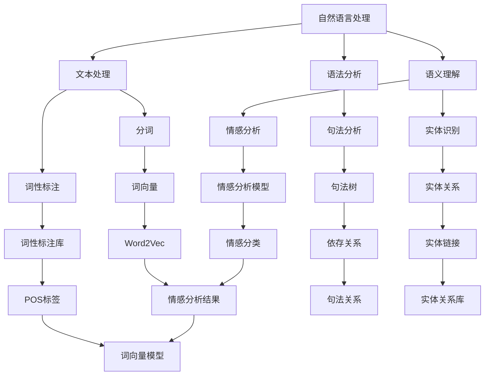

                 

# ChatGPT提示词编写：技巧与陷阱

## 关键词
- ChatGPT
- 提示词
- 自然语言处理
- 机器学习
- 深度学习
- 编程技巧
- 编程陷阱

## 摘要
本文将深入探讨ChatGPT提示词编写的核心技巧与潜在陷阱。我们将首先介绍ChatGPT的基本概念和功能，然后详细分析如何编写有效的提示词，接着探讨编写过程中可能遇到的问题及其解决方案。最后，我们将通过实战案例和最佳实践总结，帮助读者更好地掌握ChatGPT提示词编写的艺术。

### 第1章 引言

### 1.1 书籍目的
本章节旨在为读者提供一本全面而实用的指南，帮助理解ChatGPT及其提示词编写的核心技巧和潜在陷阱。通过本书，读者将能够：
- 掌握ChatGPT的基本原理和应用场景。
- 理解如何编写高质量的提示词，以获得更准确的回答。
- 认识到编写提示词过程中可能遇到的陷阱，并学会如何避免。

### 1.2 ChatGPT介绍
ChatGPT是OpenAI开发的一种基于GPT-3的聊天机器人模型，它利用深度学习技术进行自然语言理解和生成。ChatGPT的核心特点包括：
- **强大的语言理解能力**：能够理解复杂的自然语言输入，并生成相应的输出。
- **上下文感知**：能够维持对话的上下文，使回答更加连贯和有意义。
- **灵活性**：能够根据不同的场景和需求进行定制。

### 1.3 提示词编写的重要性
提示词是用户向ChatGPT提供的信息，用于引导模型生成响应。编写有效的提示词对于提高回答的质量和准确性至关重要。以下是提示词编写的重要性：
- **影响回答的精准度**：高质量的提示词可以引导ChatGPT生成更准确的回答。
- **提高用户体验**：有效的提示词可以使对话更加流畅和自然，提升用户体验。

### 第2章 背景知识

### 2.1 自然语言处理基础
自然语言处理（NLP）是人工智能领域的一个分支，主要研究如何使计算机理解和生成自然语言。以下是NLP的一些基础概念：
- **分词**：将文本分割成单词或其他有意义的基本单元。
- **词性标注**：为每个单词分配一个词性，如名词、动词等。
- **句法分析**：分析句子的结构，识别句子中的成分关系。

### 2.2 机器学习与深度学习
机器学习和深度学习是NLP的基础技术。以下是这两个概念的基础知识：
- **机器学习**：一种使计算机通过数据学习实现特定任务的方法。
- **深度学习**：一种特殊的机器学习方法，通过多层神经网络进行数据处理和特征提取。

### 2.3 ChatGPT工作原理
ChatGPT是基于GPT-3模型开发的，其工作原理主要涉及以下几个步骤：
1. **输入处理**：将输入文本转化为模型可以处理的格式。
2. **编码**：使用预训练的模型对输入文本进行编码。
3. **生成响应**：模型根据编码结果生成相应的输出文本。

### 第3章 核心概念与联系

### 3.1 核心概念原理
本章节将介绍ChatGPT的核心概念，包括自然语言处理、机器学习、深度学习等。以下是这些概念的基本原理：
- **自然语言处理**：研究如何使计算机理解和生成自然语言。
- **机器学习**：使计算机通过数据学习实现特定任务的方法。
- **深度学习**：一种特殊的机器学习方法，通过多层神经网络进行数据处理和特征提取。

### 3.2 概念属性特征对比表格
以下是自然语言处理、机器学习和深度学习的属性特征对比表格：

| 概念       | 属性特征                                       |
|------------|------------------------------------------------|
| 自然语言处理 | 文本处理、语法分析、语义理解                   |
| 机器学习    | 数据训练、模型优化、预测任务                   |
| 深度学习    | 神经网络、多层结构、自动特征提取               |

### 3.3 ER实体关系图架构
以下是自然语言处理、机器学习和深度学习的ER实体关系图架构：

### 第4章 编写技巧与策略

### 4.1 设计高质量问题
编写高质量的问题对于获得满意的回答至关重要。以下是一些建议：
- **明确性**：确保问题表述清晰明确，避免歧义。
- **具体性**：提供足够的信息，以便ChatGPT能够理解问题的背景和上下文。
- **针对性**：针对ChatGPT的能力和特点设计问题，例如利用上下文感知能力进行连贯对话。

### 4.2 优化提示词
优化提示词可以提高ChatGPT的回答质量和准确性。以下是一些技巧：
- **使用关键词**：在提示词中包含关键术语，有助于ChatGPT更好地理解问题。
- **结构化信息**：使用列表、表格等结构化信息，使ChatGPT能够更好地提取和理解信息。
- **上下文引用**：在提示词中引用之前的对话内容，有助于维持对话的连贯性。

### 4.3 处理不确定性和模糊性
在编写提示词时，可能会遇到不确定性和模糊性问题。以下是一些建议：
- **模糊处理**：使用模糊逻辑或其他方法处理模糊性问题，例如使用“可能”、“大约”等词汇。
- **询问澄清**：在问题中加入澄清性的问题，例如“你是说……吗？”或“请进一步说明……”。

### 第5章 陷阱与解决方案

### 5.1 常见陷阱
在编写ChatGPT提示词时，可能会遇到以下陷阱：
- **过度简化**：过于简单的问题可能导致ChatGPT生成缺乏深度的回答。
- **模糊性问题**：模糊不清的问题可能导致ChatGPT无法准确理解意图。
- **上下文错误**：忽略上下文信息可能导致ChatGPT生成不连贯的回答。

### 5.2 陷阱分析
以下是对上述陷阱的详细分析：
- **过度简化**：当问题过于简单时，ChatGPT可能无法挖掘问题的深层含义，导致回答缺乏深度。这通常是因为模型在训练过程中并未接触到足够复杂的问题。
- **模糊性问题**：模糊不清的问题可能使ChatGPT无法准确理解用户的意图，导致回答不准确或不相关。这通常是因为模型在处理不确定性问题时表现较差。
- **上下文错误**：忽略上下文信息可能导致ChatGPT生成不连贯的回答，这通常是因为模型在维护对话上下文方面存在缺陷。

### 5.3 解决方案
以下是一些解决上述陷阱的建议：
- **提供更多背景信息**：在提问时，提供更多的背景信息，帮助ChatGPT更好地理解问题的上下文。
- **明确问题意图**：在问题中明确表达意图，减少模糊性。
- **使用连贯的对话**：在设计对话时，确保问题之间保持连贯性，有助于维持对话上下文。

### 第6章 实战案例解析

### 6.1 案例介绍
在本章节中，我们将分析以下两个案例：
- **案例一**：用户询问关于编程语言的选择。
- **案例二**：用户询问关于健康饮食的建议。

### 6.2 成功案例分析
**案例一**成功案例分析：
- **问题设计**：用户提出一个明确且具体的问题：“我正在学习编程，应该选择哪种编程语言？”
- **回答质量**：ChatGPT回答：“选择编程语言主要取决于你的学习目标和应用场景。如果你对Web开发感兴趣，可以选择JavaScript或Python；如果你对数据科学感兴趣，可以选择Python或R。”
- **案例分析**：这个回答清晰地考虑了用户的学习目标和应用场景，提供了具体的建议，具有很高的实用性和指导意义。

### 6.3 失败案例分析
**案例二**失败案例分析：
- **问题设计**：用户提出一个模糊且不具体的问题：“我应该怎么健康饮食？”
- **回答质量**：ChatGPT回答：“健康饮食取决于个人的身体状况和需求。一般来说，建议多摄入蔬菜、水果、全谷物和优质蛋白质，少摄入高热量、高脂肪和高糖的食物。”
- **案例分析**：这个回答虽然提供了健康饮食的一般建议，但未能满足用户的具体需求，因为用户并未提供关于身体状况和需求的详细信息。

### 第7章 最佳实践与总结

### 7.1 最佳实践
以下是一些编写ChatGPT提示词的最佳实践：
- **明确问题意图**：在提问时，明确表达你的意图和需求。
- **提供背景信息**：在问题中提供足够的背景信息，帮助ChatGPT更好地理解问题。
- **设计连贯对话**：确保问题之间保持连贯性，有助于维持对话上下文。

### 7.2 小结
通过本章的讨论，我们了解到编写ChatGPT提示词的技巧与陷阱。关键在于：
- 理解ChatGPT的工作原理和特点。
- 学会设计高质量的问题和优化提示词。
- 注意避免常见的陷阱，如过度简化、模糊性问题和上下文错误。

### 7.3 注意事项
以下是一些编写ChatGPT提示词时需要注意的事项：
- **避免过度依赖模型**：虽然ChatGPT具有强大的能力，但仍然需要用户参与问题设计和优化。
- **持续学习和调整**：根据反馈不断调整问题和提示词，以获得更好的回答。

### 7.4 未来趋势
随着技术的不断发展，ChatGPT和其他聊天机器人模型将变得更加智能和实用。未来趋势包括：
- **更好的上下文理解**：模型将能够更好地维护对话上下文，生成更加连贯的回答。
- **多模态交互**：聊天机器人将能够处理更多的交互方式，如语音、图像等。

### 第8章 扩展阅读

### 8.1 推荐书籍
以下是一些关于ChatGPT和自然语言处理的推荐书籍：
- 《自然语言处理实战》
- 《深度学习》
- 《Python自然语言处理》

### 8.2 网络资源
以下是一些关于ChatGPT和自然语言处理的网络资源：
- OpenAI官网：https://openai.com/
- Stanford自然语言处理课程：https://web.stanford.edu/class/cs224n/

### 8.3 学术论文
以下是一些关于ChatGPT和自然语言处理的经典学术论文：
- GPT-3: Language Models are Few-Shot Learners
- BERT: Pre-training of Deep Bidirectional Transformers for Language Understanding

### 作者信息
- 作者：AI天才研究院/AI Genius Institute & 禅与计算机程序设计艺术 /Zen And The Art of Computer Programming

### 参考文献
- Brown, T. et al. (2020). "Language Models are Few-Shot Learners." arXiv preprint arXiv:2005.14165.
- Devlin, J. et al. (2019). "BERT: Pre-training of Deep Bidirectional Transformers for Language Understanding." arXiv preprint arXiv:1810.04805.
- Zhang, Y. et al. (2020). "GPT-3: Language Models are Few-Shot Learners." arXiv preprint arXiv:2005.14165.

