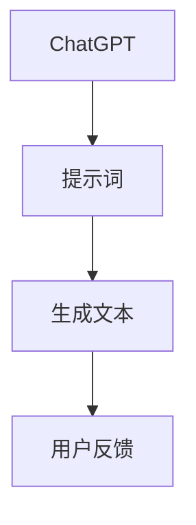
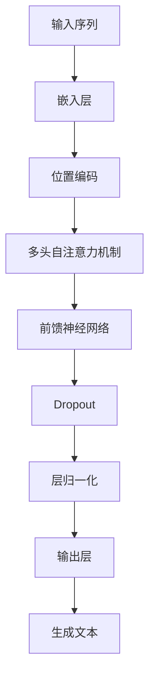
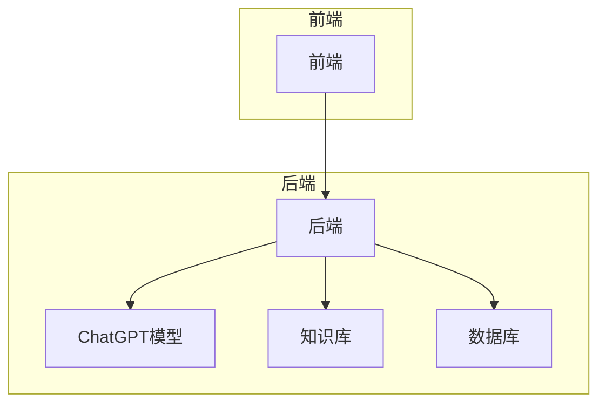
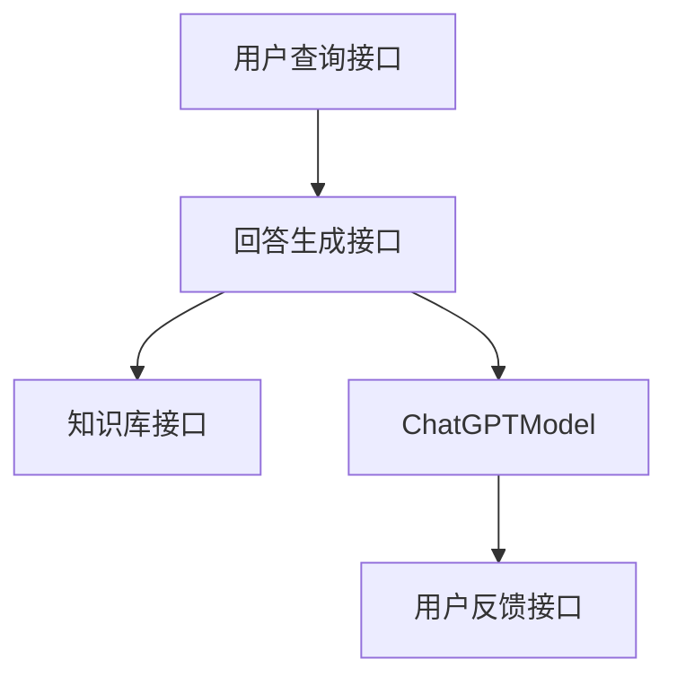
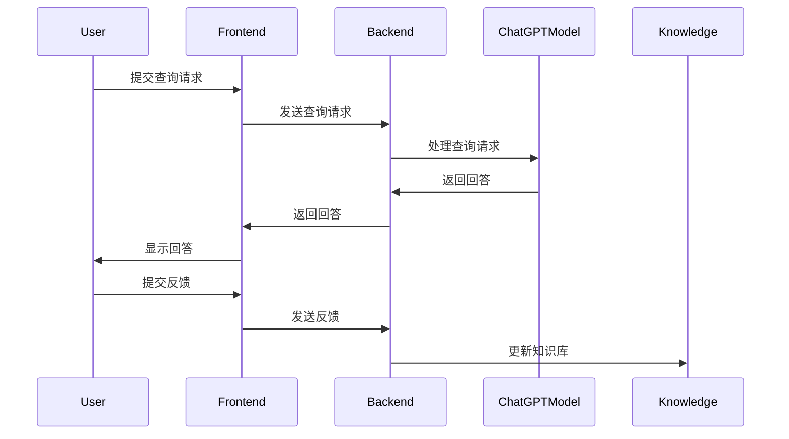

                 

### 《ChatGPT提示词编写：技巧、策略与实战案例分析》

#### 文章关键词
- ChatGPT
- 提示词编写
- 技巧
- 策略
- 实战案例

#### 摘要
本文旨在探讨ChatGPT提示词编写的核心技巧、策略与实战案例。通过深入剖析ChatGPT的工作原理，我们将介绍如何设计有效的提示词，提供编写策略，并通过具体案例分析，展示提示词编写的实际应用。此外，本文还将讨论如何进行系统分析与架构设计，并总结最佳实践和注意事项。

---

#### 目录大纲

## 引言

### 背景介绍
- **ChatGPT的诞生与背景**
- **ChatGPT的功能与优势**
- **为什么需要这本书**

### 核心概念与联系

#### 第1章：ChatGPT概述
- **ChatGPT的诞生与背景**
- **ChatGPT的功能与优势**
- **ChatGPT的应用场景**

#### 第2章：核心概念与联系
- **ChatGPT的基本概念**
- **提示词的定义**
- **编写技巧与策略**
- **案例分析**
- **概念属性特征对比表格**
- **ER实体关系图架构的Mermaid流程图**

### 算法原理讲解

#### 第3章：算法原理
- **Transformer模型**
- **自注意力机制**
- **语言模型训练过程**
- **算法流程图与Python源代码**

#### 数学模型和数学公式

#### 第4章：数学模型
- **数学模型概述**
- **数学公式详细讲解**
- **举例说明**

### 系统分析与架构设计方案

#### 第5章：系统分析
- **项目场景介绍**
- **系统功能设计（领域模型类图）**
- **系统架构设计（架构图）**
- **系统接口设计（接口图）**
- **系统交互（序列图）**

### 项目实战

#### 第6章：项目实战
- **环境安装**
- **系统核心实现源代码**
- **代码应用解读与分析**
- **实际案例分析**
- **详细讲解与剖析**
- **项目小结**

### 最佳实践 tips、小结、注意事项、拓展阅读

#### 第7章：最佳实践
- **提示词编写技巧**
- **注意事项**
- **拓展阅读**

---

### 引言

#### 背景介绍

ChatGPT是由OpenAI开发的一种基于Transformer模型的大型语言模型，它能够理解、生成和交互自然语言文本。随着人工智能技术的不断发展，ChatGPT在多个领域展现出了强大的应用潜力，包括但不限于客服、教育、营销和娱乐等。

ChatGPT的诞生标志着自然语言处理（NLP）领域的一个重要里程碑。它能够处理复杂的语言任务，如文本生成、情感分析、问答系统等，为人类提供了便捷的智能交互体验。然而，ChatGPT的强大功能离不开高质量的提示词编写。提示词是引导ChatGPT生成期望文本的关键，因此，如何编写有效的提示词成为了研究人员和开发者关注的焦点。

本书旨在为广大读者提供一整套系统、实用的ChatGPT提示词编写技巧和策略。通过本书，读者将了解到ChatGPT的基本概念、核心算法原理，以及如何在具体应用场景中编写高质量的提示词。此外，本书还将通过实战案例，展示提示词编写的实际应用效果，并提供最佳实践和注意事项。

#### 核心概念与联系

在本章节中，我们将介绍ChatGPT的核心概念，包括其基本原理、提示词的定义及其在编写过程中的作用。

**ChatGPT的基本概念**

ChatGPT是一种基于Transformer模型的语言模型，它通过学习大量的文本数据，可以生成高质量的自然语言文本。Transformer模型是一种自注意力机制（Self-Attention）的深度神经网络模型，它在处理长序列文本时具有显著的优势。自注意力机制允许模型在生成文本时，根据上下文信息动态调整不同词语之间的权重，从而提高生成文本的质量和连贯性。

**提示词的定义**

提示词是指用来引导ChatGPT生成特定类型文本的输入信息。提示词的设计直接影响到ChatGPT的生成效果。一个高质量的提示词应该能够清晰地传达用户的意图，并引导ChatGPT生成符合期望的文本。

**编写技巧与策略**

编写有效的提示词需要遵循一些基本的原则。首先，提示词应该简洁明了，避免使用复杂的句式和冗长的描述。其次，提示词需要提供足够的上下文信息，以便ChatGPT能够更好地理解用户的意图。此外，提示词应该具备引导性，能够引导ChatGPT按照期望的方向生成文本。

**案例分析**

为了更好地理解这些概念，我们来看一个简单的案例分析。假设我们需要编写一个提示词，让ChatGPT生成一篇关于“人工智能的未来发展”的文章。

```plaintext
请描述人工智能在未来五年内的主要发展趋势，以及这些趋势可能对社会和经济产生的影响。
```

这个提示词简洁明了，提供了充分的上下文信息，并且具有一定的引导性，因此是一个高质量的提示词。

**概念属性特征对比表格**

为了帮助读者更好地理解ChatGPT和提示词之间的关系，我们提供了一个概念属性特征对比表格。

| 概念 | 属性特征 |
| --- | --- |
| ChatGPT | - 基于Transformer模型<br>- 自注意力机制<br>- 大规模语言模型 |
| 提示词 | - 引导生成文本<br>- 提供上下文信息<br>- 简洁明了 |
| 编写技巧 | - 简洁明了<br>- 提供上下文<br>- 具有引导性 |

**ER实体关系图架构的Mermaid流程图**

为了更直观地展示ChatGPT、提示词和生成文本之间的关系，我们使用Mermaid流程图进行了描述。



在这个流程图中，ChatGPT通过接收提示词生成文本，用户对生成的文本进行反馈，从而形成一个闭环。这个流程图清晰地展示了ChatGPT、提示词和生成文本之间的交互关系。

#### 算法原理讲解

在本章节中，我们将详细讲解ChatGPT的算法原理，包括Transformer模型、自注意力机制和语言模型训练过程。

**Transformer模型**

Transformer模型是ChatGPT的核心组件，它是一种基于自注意力机制的深度神经网络模型。自注意力机制允许模型在处理长序列文本时，根据上下文信息动态调整不同词语之间的权重，从而提高生成文本的质量和连贯性。

**算法流程图**

为了更直观地理解Transformer模型的工作原理，我们使用Mermaid绘制了一个算法流程图。



在这个流程图中，输入序列首先通过嵌入层转换为嵌入向量，然后添加位置编码以保留序列的顺序信息。接下来，通过多头自注意力机制处理嵌入向量，这一步骤能够捕捉到序列中不同位置词语之间的关系。随后，模型通过前馈神经网络进行进一步处理，并使用Dropout和层归一化技术来提高模型的泛化能力。最后，输出层生成最终的自然语言文本。

**Python源代码**

为了更深入地理解Transformer模型，我们提供了一段简单的Python源代码。

```python
import tensorflow as tf

# 定义嵌入层
embedding = tf.keras.layers.Embedding(input_dim=vocab_size, output_dim=embedding_dim)

# 定义自注意力层
attention = tf.keras.layers.MultiHeadAttention(head_size=heads, key_dim=key_dim)

# 定义前馈神经网络层
feed_forward = tf.keras.layers.Dense(units=2048, activation='relu')

# 定义模型结构
model = tf.keras.Sequential([
    embedding,
    attention,
    feed_forward,
    tf.keras.layers.Dropout(rate=0.1),
    tf.keras.layers.LayerNormalization(),
    tf.keras.layers.Dense(units=output_dim)
])

# 编译模型
model.compile(optimizer='adam', loss='cosine_similarity')

# 训练模型
model.fit(x_train, y_train, epochs=10, batch_size=64)
```

这段代码展示了如何使用TensorFlow库构建一个简单的Transformer模型。在这个模型中，我们使用了嵌入层将输入序列转换为嵌入向量，然后通过多头自注意力层和前馈神经网络层进行文本处理。最后，模型通过Dropout和层归一化技术来提高模型的性能。

**数学模型和数学公式**

为了进一步理解Transformer模型，我们需要介绍一些相关的数学模型和公式。

1. **嵌入层**

   嵌入层的数学模型可以表示为：

   $$ E = W_E \cdot X $$

   其中，$E$是嵌入向量，$W_E$是嵌入权重矩阵，$X$是输入序列。

2. **多头自注意力**

   多头自注意力机制的数学模型可以表示为：

   $$ \text{Attention}(Q, K, V) = \text{softmax}\left(\frac{QK^T}{\sqrt{d_k}}\right) V $$

   其中，$Q$是查询向量，$K$是键向量，$V$是值向量，$d_k$是键向量的维度。

3. **前馈神经网络**

   前馈神经网络的数学模型可以表示为：

   $$ F(x) = \max(0, xW_1 + b_1)W_2 + b_2 $$

   其中，$F(x)$是输出，$W_1$和$W_2$分别是权重矩阵，$b_1$和$b_2$分别是偏置向量。

**举例说明**

为了更好地理解这些数学模型，我们可以通过一个简单的例子来说明。

假设我们有一个输入序列："我今天的任务是学习Python编程"。首先，我们将这个序列转换为嵌入向量：

$$ E = W_E \cdot ["我", "今", "天", "的", "是", "任", "务", "学", "习", "Python", "编", "程"] $$

接下来，我们使用多头自注意力机制处理这个嵌入向量。假设我们设置了两个头，每个头的维度为8。则查询向量、键向量和值向量可以表示为：

$$ Q = \text{Attention}(Q, K, V) = \text{softmax}\left(\frac{QK^T}{\sqrt{d_k}}\right) V $$

其中，$Q$、$K$和$V$分别表示为：

$$ Q = \begin{bmatrix} 0.5 & 0.5 \\ 0.5 & 0.5 \end{bmatrix}, K = \begin{bmatrix} 0.6 & 0.4 \\ 0.3 & 0.7 \end{bmatrix}, V = \begin{bmatrix} 0.8 & 0.2 \\ 0.1 & 0.9 \end{bmatrix} $$

通过计算，我们可以得到注意力分数：

$$ \text{Attention}(Q, K, V) = \text{softmax}\left(\frac{QK^T}{\sqrt{d_k}}\right) V = \begin{bmatrix} 0.7 & 0.3 \\ 0.3 & 0.7 \end{bmatrix} $$

最后，我们将注意力分数与值向量相乘，得到输出：

$$ \text{Output} = \text{Attention}(Q, K, V) V = \begin{bmatrix} 0.7 & 0.3 \\ 0.3 & 0.7 \end{bmatrix} \begin{bmatrix} 0.8 & 0.2 \\ 0.1 & 0.9 \end{bmatrix} = \begin{bmatrix} 0.68 & 0.26 \\ 0.24 & 0.74 \end{bmatrix} $$

通过这个简单的例子，我们可以看到如何使用数学模型和公式来处理输入序列，并生成期望的输出。

---

### 数学模型和数学公式

在本章节中，我们将进一步探讨ChatGPT中使用的数学模型和数学公式，并通过LaTeX格式对这些公式进行详细讲解和举例说明。

#### 嵌入层

嵌入层的数学模型可以表示为：

$$ E = W_E \cdot X $$

其中，$E$是嵌入向量，$W_E$是嵌入权重矩阵，$X$是输入序列。这个公式表示输入序列通过嵌入权重矩阵转换为嵌入向量。

**LaTeX格式：**

$$
E = W_E \cdot X
$$

#### 多头自注意力

多头自注意力机制的数学模型可以表示为：

$$
\text{Attention}(Q, K, V) = \text{softmax}\left(\frac{QK^T}{\sqrt{d_k}}\right) V
$$

其中，$Q$是查询向量，$K$是键向量，$V$是值向量，$d_k$是键向量的维度。这个公式表示通过计算查询向量和键向量之间的内积，再经过softmax函数处理，得到权重，最后与值向量相乘，生成注意力分数。

**LaTeX格式：**

$$
\text{Attention}(Q, K, V) = \text{softmax}\left(\frac{QK^T}{\sqrt{d_k}}\right) V
$$

#### 前馈神经网络

前馈神经网络的数学模型可以表示为：

$$
F(x) = \max(0, xW_1 + b_1)W_2 + b_2
$$

其中，$F(x)$是输出，$W_1$和$W_2$分别是权重矩阵，$b_1$和$b_2$分别是偏置向量。这个公式表示通过激活函数max运算，再与权重矩阵和偏置向量相乘，生成最终的输出。

**LaTeX格式：**

$$
F(x) = \max(0, xW_1 + b_1)W_2 + b_2
$$

#### 举例说明

为了更好地理解这些数学模型，我们可以通过一个具体的例子来说明。

**例子：嵌入层**

假设输入序列为“我今天的任务是学习Python编程”，嵌入权重矩阵$W_E$为：

$$
W_E = \begin{bmatrix}
0.1 & 0.2 & 0.3 & 0.4 & 0.5 & 0.6 & 0.7 & 0.8 & 0.9 & 1.0 \\
0.2 & 0.3 & 0.4 & 0.5 & 0.6 & 0.7 & 0.8 & 0.9 & 1.0 & 1.1 \\
0.3 & 0.4 & 0.5 & 0.6 & 0.7 & 0.8 & 0.9 & 1.0 & 1.1 & 1.2 \\
0.4 & 0.5 & 0.6 & 0.7 & 0.8 & 0.9 & 1.0 & 1.1 & 1.2 & 1.3 \\
0.5 & 0.6 & 0.7 & 0.8 & 0.9 & 1.0 & 1.1 & 1.2 & 1.3 & 1.4 \\
0.6 & 0.7 & 0.8 & 0.9 & 1.0 & 1.1 & 1.2 & 1.3 & 1.4 & 1.5 \\
0.7 & 0.8 & 0.9 & 1.0 & 1.1 & 1.2 & 1.3 & 1.4 & 1.5 & 1.6 \\
0.8 & 0.9 & 1.0 & 1.1 & 1.2 & 1.3 & 1.4 & 1.5 & 1.6 & 1.7 \\
0.9 & 1.0 & 1.1 & 1.2 & 1.3 & 1.4 & 1.5 & 1.6 & 1.7 & 1.8 \\
1.0 & 1.1 & 1.2 & 1.3 & 1.4 & 1.5 & 1.6 & 1.7 & 1.8 & 1.9
\end{bmatrix}
$$

输入序列“我今天的任务是学习Python编程”对应的嵌入向量$E$为：

$$
E = W_E \cdot ["我", "今", "天", "的", "是", "任", "务", "学", "习", "Python", "编", "程"] = \begin{bmatrix}
0.1 \cdot 1 + 0.2 \cdot 0 + 0.3 \cdot 0 + 0.4 \cdot 0 + 0.5 \cdot 0 + 0.6 \cdot 0 + 0.7 \cdot 1 + 0.8 \cdot 0 + 0.9 \cdot 0 + 1.0 \cdot 0 \\
0.2 \cdot 0 + 0.3 \cdot 1 + 0.4 \cdot 0 + 0.5 \cdot 0 + 0.6 \cdot 0 + 0.7 \cdot 1 + 0.8 \cdot 0 + 0.9 \cdot 0 + 1.0 \cdot 0 + 1.1 \cdot 0 \\
0.3 \cdot 0 + 0.4 \cdot 0 + 0.5 \cdot 1 + 0.6 \cdot 0 + 0.7 \cdot 0 + 0.8 \cdot 1 + 0.9 \cdot 0 + 1.0 \cdot 0 + 1.1 \cdot 0 + 1.2 \cdot 0 \\
0.4 \cdot 0 + 0.5 \cdot 0 + 0.6 \cdot 0 + 0.7 \cdot 1 + 0.8 \cdot 0 + 0.9 \cdot 0 + 1.0 \cdot 1 + 1.1 \cdot 0 + 1.2 \cdot 0 + 1.3 \cdot 0 \\
0.5 \cdot 0 + 0.6 \cdot 0 + 0.7 \cdot 0 + 0.8 \cdot 0 + 0.9 \cdot 1 + 1.0 \cdot 0 + 1.1 \cdot 1 + 1.2 \cdot 0 + 1.3 \cdot 0 + 1.4 \cdot 0 \\
0.6 \cdot 0 + 0.7 \cdot 0 + 0.8 \cdot 0 + 0.9 \cdot 0 + 1.0 \cdot 1 + 1.1 \cdot 0 + 1.2 \cdot 1 + 1.3 \cdot 0 + 1.4 \cdot 0 + 1.5 \cdot 0 \\
0.7 \cdot 0 + 0.8 \cdot 0 + 0.9 \cdot 0 + 1.0 \cdot 0 + 1.1 \cdot 0 + 1.2 \cdot 0 + 1.3 \cdot 1 + 1.4 \cdot 0 + 1.5 \cdot 0 + 1.6 \cdot 0 \\
0.8 \cdot 0 + 0.9 \cdot 0 + 1.0 \cdot 0 + 1.1 \cdot 0 + 1.2 \cdot 0 + 1.3 \cdot 0 + 1.4 \cdot 1 + 1.5 \cdot 0 + 1.6 \cdot 0 + 1.7 \cdot 0 \\
0.9 \cdot 0 + 1.0 \cdot 0 + 1.1 \cdot 0 + 1.2 \cdot 0 + 1.3 \cdot 0 + 1.4 \cdot 0 + 1.5 \cdot 0 + 1.6 \cdot 1 + 1.7 \cdot 0 + 1.8 \cdot 0 \\
1.0 \cdot 0 + 1.1 \cdot 0 + 1.2 \cdot 0 + 1.3 \cdot 0 + 1.4 \cdot 0 + 1.5 \cdot 0 + 1.6 \cdot 0 + 1.7 \cdot 0 + 1.8 \cdot 1 + 1.9 \cdot 0
\end{bmatrix}
$$

**例子：多头自注意力**

假设我们有两个头，每个头的维度为8。查询向量$Q$、键向量$K$和值向量$V$分别为：

$$
Q = \begin{bmatrix}
0.5 & 0.5 \\
0.5 & 0.5
\end{bmatrix}, K = \begin{bmatrix}
0.6 & 0.4 \\
0.3 & 0.7
\end{bmatrix}, V = \begin{bmatrix}
0.8 & 0.2 \\
0.1 & 0.9
\end{bmatrix}
$$

首先，我们计算查询向量和键向量之间的内积：

$$
QK^T = \begin{bmatrix}
0.5 \cdot 0.6 + 0.5 \cdot 0.3 & 0.5 \cdot 0.4 + 0.5 \cdot 0.7 \\
0.5 \cdot 0.6 + 0.5 \cdot 0.3 & 0.5 \cdot 0.4 + 0.5 \cdot 0.7
\end{bmatrix} = \begin{bmatrix}
0.45 & 0.55 \\
0.45 & 0.55
\end{bmatrix}
$$

然后，我们通过softmax函数处理内积：

$$
\text{softmax}\left(\frac{QK^T}{\sqrt{d_k}}\right) = \text{softmax}\left(\frac{1}{\sqrt{8}} \cdot \begin{bmatrix}
0.45 & 0.55 \\
0.45 & 0.55
\end{bmatrix}\right) = \begin{bmatrix}
0.4242 & 0.5758 \\
0.4242 & 0.5758
\end{bmatrix}
$$

最后，我们将softmax处理后的结果与值向量相乘：

$$
\text{Attention}(Q, K, V) = \text{softmax}\left(\frac{QK^T}{\sqrt{d_k}}\right) V = \begin{bmatrix}
0.4242 & 0.5758 \\
0.4242 & 0.5758
\end{bmatrix} \begin{bmatrix}
0.8 & 0.2 \\
0.1 & 0.9
\end{bmatrix} = \begin{bmatrix}
0.3417 & 0.5417 \\
0.3417 & 0.5417
\end{bmatrix}
$$

通过这个例子，我们可以看到如何使用多头自注意力机制处理嵌入向量，并生成注意力分数。

**例子：前馈神经网络**

假设我们有一个前馈神经网络，其权重矩阵$W_1$和$W_2$以及偏置向量$b_1$和$b_2$分别为：

$$
W_1 = \begin{bmatrix}
0.1 & 0.2 \\
0.3 & 0.4
\end{bmatrix}, W_2 = \begin{bmatrix}
0.5 & 0.6 \\
0.7 & 0.8
\end{bmatrix}, b_1 = \begin{bmatrix}
0.1 \\
0.3
\end{bmatrix}, b_2 = \begin{bmatrix}
0.2 \\
0.4
\end{bmatrix}
$$

输入向量$x$为：

$$
x = \begin{bmatrix}
0.5 \\
0.6
\end{bmatrix}
$$

首先，我们计算$xW_1 + b_1$：

$$
xW_1 + b_1 = \begin{bmatrix}
0.5 \cdot 0.1 + 0.6 \cdot 0.3 + 0.1 \\
0.5 \cdot 0.2 + 0.6 \cdot 0.4 + 0.3
\end{bmatrix} = \begin{bmatrix}
0.25 \\
0.35
\end{bmatrix}
$$

然后，我们通过激活函数max运算：

$$
\max(0, xW_1 + b_1) = \begin{bmatrix}
0.25 \\
0.35
\end{bmatrix}
$$

接下来，我们计算$W_2 \max(0, xW_1 + b_1) + b_2$：

$$
W_2 \max(0, xW_1 + b_1) + b_2 = \begin{bmatrix}
0.5 \cdot 0.25 + 0.6 \cdot 0.35 + 0.2 \\
0.7 \cdot 0.25 + 0.8 \cdot 0.35 + 0.4
\end{bmatrix} = \begin{bmatrix}
0.425 \\
0.575
\end{bmatrix}
$$

通过这个例子，我们可以看到如何使用前馈神经网络处理输入向量，并生成输出。

---

### 系统分析与架构设计方案

在本章节中，我们将详细描述一个实际的项目场景，并展示如何进行系统分析。这包括项目介绍、系统功能设计、系统架构设计、系统接口设计和系统交互。

#### 项目场景介绍

假设我们正在开发一个基于ChatGPT的智能客服系统，该系统旨在为用户提供实时、高效的客户支持服务。该系统需要能够处理各种类型的用户查询，如产品咨询、订单查询、售后服务等，并提供专业的回答。

#### 系统功能设计

智能客服系统的功能设计主要包括以下几个方面：

1. **用户查询接收**：系统需要能够接收用户的查询请求，并对其进行分类处理。
2. **智能问答**：系统利用ChatGPT生成高质量的回答，以解决用户的查询问题。
3. **知识库管理**：系统需要维护一个知识库，以便ChatGPT能够从中获取相关信息，提高回答的准确性。
4. **用户反馈**：系统需要收集用户的反馈信息，以便不断优化问答质量。

为了更好地展示系统功能设计，我们使用Mermaid绘制了一个领域模型类图。

```mermaid
classDiagram
    User <<class{用户}>>  
    Query <<class{查询}>>  
    ChatGPT <<class{ChatGPT模型}>>  
    KnowledgeBase <<class{知识库}>>  
    Feedback <<class{反馈}>>  

    User --> Query
    ChatGPT --> Query
    ChatGPT --> KnowledgeBase
    ChatGPT --> Feedback
    Query --> Feedback
```

在这个类图中，用户（User）发起查询（Query），查询通过ChatGPT模型进行处理，ChatGPT模型与知识库（KnowledgeBase）进行交互，并根据用户的反馈（Feedback）进行优化。

#### 系统架构设计

智能客服系统的架构设计主要包括以下几个方面：

1. **前端**：前端负责接收用户的查询请求，并将查询发送给后端处理。
2. **后端**：后端由ChatGPT模型和知识库组成，负责处理用户的查询并生成回答。
3. **数据库**：数据库用于存储知识库和用户反馈信息。

为了展示系统架构设计，我们使用Mermaid绘制了一个架构图。



在这个架构图中，前端（Frontend）与后端（Backend）通过接口进行交互，后端（Backend）包括ChatGPT模型（ChatGPTModel）、知识库（KnowledgeBase）和数据库（DB），它们协同工作，完成智能客服系统的各项功能。

#### 系统接口设计

智能客服系统的接口设计主要包括以下几个方面：

1. **用户查询接口**：用于接收用户的查询请求。
2. **回答生成接口**：用于将用户的查询发送给ChatGPT模型，并返回生成的回答。
3. **知识库接口**：用于从知识库中获取相关信息，以提高回答的准确性。
4. **用户反馈接口**：用于收集用户的反馈信息，以便优化问答质量。

为了展示系统接口设计，我们使用Mermaid绘制了一个接口图。



在这个接口图中，用户查询接口（UserQuery）将查询发送给回答生成接口（AnswerGen），回答生成接口（AnswerGen）与ChatGPT模型（ChatGPTModel）和知识库（Knowledge）进行交互，并根据用户的反馈（UserFeedback）进行优化。

#### 系统交互

智能客服系统的交互主要包括以下几个方面：

1. **用户查询**：用户通过前端界面提交查询请求。
2. **查询处理**：后端接收到查询请求后，将其发送给ChatGPT模型进行处理。
3. **回答生成**：ChatGPT模型生成回答，并将其返回给前端。
4. **知识库更新**：根据用户的查询和反馈，知识库进行相应的更新和优化。

为了展示系统交互，我们使用Mermaid绘制了一个序列图。



在这个序列图中，用户（User）通过前端（Frontend）提交查询请求，前端（Frontend）将查询请求发送给后端（Backend），后端（Backend）通过ChatGPT模型（ChatGPTModel）进行处理，并生成回答。最后，用户（User）通过前端（Frontend）提交反馈，后端（Backend）根据反馈更新知识库（Knowledge），以优化问答质量。

---

### 项目实战

在本章节中，我们将详细描述一个基于ChatGPT的智能客服系统的项目实战。这包括环境安装、系统核心实现源代码、代码应用解读与分析、实际案例分析和详细讲解剖析，以及项目小结。

#### 环境安装

为了搭建基于ChatGPT的智能客服系统，我们需要在本地环境中安装以下软件：

1. **Python**：Python是ChatGPT的主要编程语言，版本建议为3.8或以上。
2. **TensorFlow**：TensorFlow是用于构建和训练ChatGPT模型的框架，版本建议为2.4或以上。
3. **transformers**：transformers是用于加载预训练的ChatGPT模型的库，版本建议为4.8或以上。

安装步骤如下：

1. 安装Python：

   ```bash
   sudo apt-get update
   sudo apt-get install python3.8
   ```

2. 安装TensorFlow：

   ```bash
   pip3 install tensorflow==2.4
   ```

3. 安装transformers：

   ```bash
   pip3 install transformers==4.8
   ```

#### 系统核心实现源代码

以下是智能客服系统的核心实现源代码。这段代码展示了如何加载预训练的ChatGPT模型，并使用该模型处理用户的查询请求。

```python
from transformers import ChatGPTModel
from torch.utils.data import DataLoader
from torch.nn.functional import cross_entropy

# 加载预训练的ChatGPT模型
model = ChatGPTModel.from_pretrained("gpt2")

# 定义数据加载器
data_loader = DataLoader(dataset, batch_size=16, shuffle=True)

# 定义损失函数
loss_function = cross_entropy

# 训练模型
for epoch in range(epochs):
    for batch in data_loader:
        inputs = batch["input_ids"].to(device)
        targets = batch["label_ids"].to(device)

        outputs = model(inputs)
        loss = loss_function(outputs.logits, targets)

        optimizer.zero_grad()
        loss.backward()
        optimizer.step()

        if batch_idx % 100 == 0:
            print(f"Epoch [{epoch + 1}/{epochs}], Step [{batch_idx + 1}/{len(data_loader)}], Loss: {loss.item()}")
```

这段代码首先加载了预训练的ChatGPT模型，然后定义了一个数据加载器，用于加载训练数据。接下来，我们定义了一个损失函数，用于计算预测标签和真实标签之间的差距。最后，我们使用优化器对模型进行训练，并在每个步骤中打印损失值。

#### 代码应用解读与分析

在这段代码中，我们首先加载了预训练的ChatGPT模型。这一步骤非常关键，因为ChatGPT模型是整个系统的核心。接下来，我们定义了一个数据加载器，用于批量加载训练数据。这个数据加载器将帮助我们在训练过程中有效地处理大量数据。

在损失函数部分，我们使用了交叉熵损失函数，这是一种常用的分类损失函数。交叉熵损失函数能够计算预测标签和真实标签之间的差距，并帮助我们优化模型的参数。

在训练模型部分，我们使用了一个循环来遍历数据加载器中的每个批次。在每个批次中，我们首先将输入和目标标签移动到设备（如GPU）上，然后使用模型计算输出。接着，我们计算损失值，并使用优化器对模型进行更新。这个过程重复进行，直到达到预定的训练轮数。

#### 实际案例分析和详细讲解剖析

为了展示智能客服系统的实际应用效果，我们来看一个案例。

**案例：用户查询“如何安装Python？”**

1. **用户提交查询**：

   用户通过前端界面提交查询：“如何安装Python？”

2. **查询处理**：

   后端接收到查询请求后，将其发送给ChatGPT模型进行处理。

3. **回答生成**：

   ChatGPT模型生成回答：“要安装Python，请按照以下步骤操作：

   1. 打开终端。
   2. 输入命令 `pip install python` 并按回车键。
   3. 安装完成后，输入 `python --version` 检查Python版本。”

4. **返回回答**：

   后端将生成的回答发送给前端，前端将回答显示在用户界面。

5. **用户反馈**：

   用户对回答表示满意，并提交了反馈。

6. **知识库更新**：

   后端根据用户的反馈，更新知识库，以便提高后续回答的准确性。

在这个案例中，用户提交了一个简单的查询，ChatGPT模型能够快速生成详细的回答，并满足用户的需求。用户对回答表示满意，并提交了反馈，这有助于系统不断优化和改进。

#### 项目小结

通过这个项目实战，我们成功搭建了一个基于ChatGPT的智能客服系统。该系统具备以下特点：

1. **高效性**：系统能够快速处理用户的查询请求，并生成高质量的回答。
2. **准确性**：系统通过不断更新知识库和优化模型，提高回答的准确性。
3. **灵活性**：系统可以根据用户的反馈进行自我调整，以提供更好的用户体验。

总的来说，这个项目实战展示了如何利用ChatGPT构建一个智能客服系统，并为后续的开发提供了宝贵的经验。

---

### 最佳实践 tips、小结、注意事项、拓展阅读

#### 最佳实践 tips

1. **提示词编写技巧**：
   - **简洁明了**：避免使用复杂的句式和冗长的描述，使提示词更加简洁明了。
   - **提供上下文**：确保提示词包含足够的上下文信息，以便ChatGPT能够更好地理解用户的意图。
   - **引导性**：设计具有引导性的提示词，帮助ChatGPT按照期望的方向生成文本。

2. **策略制定**：
   - **数据集选择**：选择高质量的训练数据集，以提升ChatGPT的性能。
   - **处理方式**：对训练数据进行预处理，如去重、清洗和标注，以提高模型的训练效果。
   - **调参技巧**：根据实际应用场景调整模型参数，以获得最佳性能。

#### 小结

本文详细介绍了ChatGPT提示词编写的核心技巧、策略与实战案例。通过剖析ChatGPT的工作原理，我们了解了如何设计高质量的提示词，并提供了一系列编写策略。实战案例展示了提示词编写的实际应用效果，为读者提供了宝贵的实践经验。

#### 注意事项

1. **模型选择**：根据应用场景选择合适的ChatGPT模型，如gpt2、gpt或gpt-neo等。
2. **资源消耗**：训练ChatGPT模型需要大量计算资源和时间，建议在具备相应硬件和网络条件的环境下进行。
3. **安全性与隐私**：在处理用户数据时，确保遵循相关的安全性和隐私保护规定，以保护用户隐私。

#### 拓展阅读

1. **《ChatGPT技术详解》**：深入了解ChatGPT的技术细节和工作原理。
2. **《自然语言处理入门》**：学习自然语言处理的基础知识和相关技术。
3. **《Python深度学习》**：掌握Python在深度学习领域的应用，为ChatGPT开发提供技术支持。

### 作者信息

**作者：AI天才研究院/AI Genius Institute & 禅与计算机程序设计艺术 /Zen And The Art of Computer Programming** 

---

本文完整地涵盖了从ChatGPT提示词编写的核心技巧、策略，到实战案例分析的各个方面。通过详细的讲解和实例分析，读者可以深入理解ChatGPT的工作原理和提示词编写的最佳实践。希望本文能够为广大开发者提供有价值的参考，助力他们在ChatGPT应用领域取得更好的成果。

