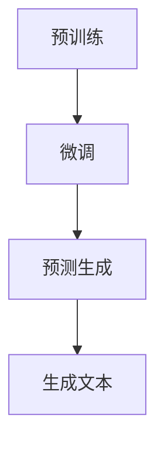
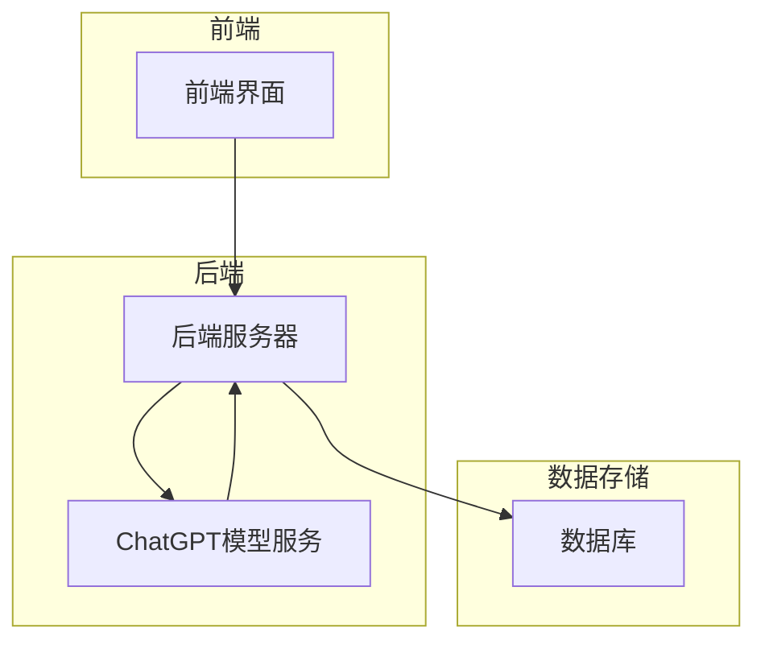
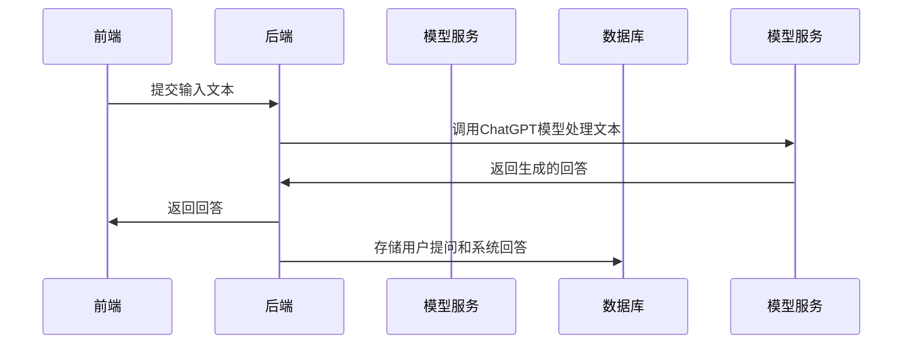

                 

## 《ChatGPT提示词编写：艺术与科学的结合》

### 关键词：
- ChatGPT
- 提示词编写
- 自然语言处理
- 算法原理
- 数学模型
- 系统架构
- 项目实战

### 摘要：
本文将深入探讨ChatGPT及其提示词编写的艺术与科学。首先，我们回顾ChatGPT的发展历程，理解提示词在自然语言处理中的关键作用。接着，详细解析ChatGPT的核心概念、算法原理和数学模型，通过Python代码示例进行实例讲解。随后，介绍系统功能设计、系统架构设计、系统接口设计和系统交互，使用mermaid绘制相关图表。通过实际项目环境安装、系统核心实现源代码解读、代码应用分析和实际案例讲解，我们将展示ChatGPT提示词编写的实战技巧。最后，总结最佳实践、注意事项并提供拓展阅读推荐，帮助读者进一步提升对ChatGPT提示词编写的理解和应用能力。

### 目录大纲

#### 第一部分：ChatGPT与提示词概述

**第1章：ChatGPT与提示词背景介绍**
- 1.1 ChatGPT的发展历程
- 1.2 提示词编写的重要性
- 1.3 ChatGPT与自然语言处理的关系

**第2章：ChatGPT基础与提示词分类**
- 2.1 ChatGPT的核心概念
- 2.2 提示词的定义与分类
- 2.3 提示词编写的基本原则

**第3章：ChatGPT模型与算法原理**
- 3.1 ChatGPT模型工作原理
- 3.2 ChatGPT算法流程图
- 3.3 Python代码示例解析

**第4章：ChatGPT数学模型与公式**
- 4.1 语言模型的数学基础
- 4.2 经典模型公式讲解
- 4.3 数学公式示例

**第5章：系统功能设计**
- 5.1 问题场景介绍
- 5.2 系统功能详细设计
- 5.3 功能实现mermaid类图

**第6章：系统架构设计与接口设计**
- 6.1 系统架构设计
- 6.2 系统接口设计
- 6.3 系统交互mermaid序列图

**第7章：项目实战**
- 7.1 实际项目环境安装
- 7.2 系统核心实现源代码
- 7.3 代码应用解读与分析
- 7.4 实际案例分析与讲解

**第8章：最佳实践与总结**
- 8.1 最佳实践技巧
- 8.2 注意事项
- 8.3 拓展阅读推荐

### 第1章：ChatGPT与提示词背景介绍

#### 1.1 ChatGPT的发展历程

ChatGPT是由OpenAI开发的一个人工智能聊天机器人模型，基于GPT（Generative Pre-trained Transformer）家族中的大型语言模型。GPT模型最初由OpenAI在2018年发布，经过数年的持续迭代和优化，其性能和功能得到了极大的提升。ChatGPT正是在这一系列技术进步的基础上诞生，并于2022年11月正式发布。

ChatGPT的发展历程可以分为以下几个关键阶段：

1. **GPT-1发布（2018年）**：这是OpenAI首次发布的预训练语言模型，其基于Transformer架构，展示了强大的语言理解和生成能力。
2. **GPT-2发布（2019年）**：GPT-2在GPT-1的基础上进行了性能提升，其模型规模达到了1.5亿参数，展示了更优的自然语言生成效果。
3. **GPT-3发布（2020年）**：GPT-3是GPT家族的最新成员，其模型规模达到了1750亿参数，成为当时最大的语言模型。GPT-3在多项自然语言处理任务中取得了突破性成果。
4. **ChatGPT发布（2022年）**：ChatGPT是GPT-3的变种，特别优化了聊天对话场景的表现。它能够通过对话生成连贯、有逻辑的回答，展示了在交互式应用中的巨大潜力。

#### 1.2 提示词编写的重要性

在自然语言处理领域，提示词（Prompt）是引导模型生成目标响应的重要工具。一个好的提示词可以极大地影响模型的输出质量，使其更符合预期。以下是提示词编写的重要性：

1. **影响模型输出**：提示词决定了模型的输入内容，从而直接影响模型的输出。通过精心设计的提示词，可以引导模型生成更加准确、有逻辑的回复。
2. **优化交互体验**：在交互式应用中，如聊天机器人、智能客服等，提示词的编写对于用户体验至关重要。好的提示词可以让对话更加自然、流畅，提升用户满意度。
3. **提高任务效率**：在自动化任务中，如文本摘要、问答系统等，提示词的编写可以帮助模型更快速、准确地完成任务。通过优化提示词，可以显著提高任务效率。

#### 1.3 ChatGPT与自然语言处理的关系

ChatGPT作为一个人工智能聊天机器人，与自然语言处理（NLP）有着紧密的联系。自然语言处理是人工智能领域的一个重要分支，主要研究如何让计算机理解和生成自然语言。以下是ChatGPT与自然语言处理的几个关键关系：

1. **模型基础**：ChatGPT的核心是一个大型预训练语言模型，其基于Transformer架构，经过大规模语料训练，具备强大的语言理解和生成能力。
2. **应用场景**：ChatGPT在多个自然语言处理任务中表现出色，如文本生成、机器翻译、问答系统等。通过优化模型和提示词，可以在不同场景下实现高效的自然语言处理。
3. **交互体验**：ChatGPT特别优化了交互式对话场景的表现，能够通过对话生成连贯、有逻辑的回答。这使得ChatGPT在智能客服、聊天机器人等应用中具有广泛的应用前景。

综上所述，ChatGPT与提示词编写的艺术与科学结合，为我们提供了一种强大的工具，可以极大地提升自然语言处理的应用效果和用户体验。接下来，我们将进一步探讨ChatGPT的核心概念、算法原理和数学模型，深入理解其背后的技术原理。

### 第2章：ChatGPT基础与提示词分类

#### 2.1 ChatGPT的核心概念

ChatGPT是基于GPT（Generative Pre-trained Transformer）模型开发的一种预训练语言模型，它通过在大规模语料库上进行预训练，从而具备了强大的语言理解和生成能力。以下是ChatGPT的一些核心概念：

1. **预训练语言模型**：ChatGPT是一种预训练语言模型，这意味着它首先在大规模语料库上进行预训练，以学习语言的统计规律和语义信息。这种预训练过程使得模型在多种自然语言处理任务中具有较好的泛化能力。
2. **Transformer架构**：ChatGPT采用Transformer架构，这是一种基于自注意力机制的神经网络模型，能够在处理长序列时表现出强大的能力和效率。Transformer架构使得ChatGPT能够捕捉到序列中的长距离依赖关系，从而生成更加连贯和有逻辑的文本。
3. **大规模训练**：ChatGPT的训练规模非常庞大，通常具有数十亿甚至上百亿个参数。这种大规模训练使得模型能够更好地学习语言的本质特征，从而在多种自然语言处理任务中取得优异的性能。

#### 2.2 提示词的定义与分类

提示词（Prompt）是引导模型生成目标响应的关键工具。在ChatGPT中，提示词的定义和分类如下：

1. **定义**：提示词是指用于引导模型生成特定类型响应的文本输入。它可以是单一句子，也可以是多个句子的组合。通过设计合适的提示词，可以引导模型生成更加准确、有逻辑的响应。
2. **分类**：根据不同的应用场景和需求，提示词可以分为以下几类：
   - **问题类提示词**：用于引导模型生成回答问题的文本。例如，“请解释量子纠缠的概念。”
   - **任务类提示词**：用于引导模型完成特定任务的文本。例如，“请帮我写一篇关于人工智能的未来发展趋势的论文。”
   - **引导类提示词**：用于引导模型进行对话或生成文本的文本。例如，“你好，我是一名人工智能助手，有什么问题可以问我。”
   - **情感类提示词**：用于引导模型生成特定情感色彩的文本。例如，“你感到很高兴吗？”
   
#### 2.3 提示词编写的基本原则

编写高质量的提示词是提升模型输出质量的关键。以下是编写提示词的一些基本原则：

1. **明确目标**：在设计提示词时，首先要明确模型的目标响应类型。例如，如果目标是回答问题，提示词应明确提问；如果目标是完成任务，提示词应明确任务要求。
2. **简洁明了**：提示词应简洁明了，避免使用复杂的语言和冗长的句子。简短的提示词更容易被模型理解，从而生成高质量的响应。
3. **语义丰富**：提示词应包含丰富的语义信息，以帮助模型更好地理解上下文和任务要求。例如，使用具体的例子、背景信息和相关术语，可以提升提示词的语义丰富度。
4. **灵活多样**：不同的应用场景和任务可能需要不同类型的提示词。因此，编写提示词时应保持灵活多样，以适应不同场景和需求。
5. **情感考虑**：在某些应用场景中，提示词的情感色彩也会影响模型输出的情感色彩。因此，编写提示词时需要考虑情感因素，确保生成的响应符合预期。

通过遵循这些基本原则，我们可以编写出高质量的提示词，从而提升ChatGPT的输出质量和用户体验。接下来，我们将深入探讨ChatGPT的算法原理和数学模型，进一步理解其背后的技术原理。

### 第3章：ChatGPT模型与算法原理

#### 3.1 ChatGPT模型工作原理

ChatGPT是基于Transformer架构的预训练语言模型，其工作原理主要分为以下几个步骤：

1. **预训练**：在预训练阶段，模型首先在大规模语料库上进行训练，以学习语言模式和语义信息。预训练的目标是让模型具备较强的语言理解和生成能力。ChatGPT使用的预训练任务通常包括自回归语言模型（AutoRegressive Language Model）和掩码语言模型（Masked Language Model）等。
2. **微调**：在预训练完成后，模型会根据特定任务进行微调。微调阶段通过在特定领域的语料库上进行训练，进一步优化模型在特定任务上的性能。对于ChatGPT来说，微调通常是在对话数据集上进行，以优化模型在对话场景中的表现。
3. **预测生成**：在生成阶段，模型根据输入的提示词生成相应的文本响应。ChatGPT通过自注意力机制（Self-Attention Mechanism）和前馈神经网络（Feedforward Neural Network）对输入序列进行处理，从而生成连贯、有逻辑的文本。

#### 3.2 ChatGPT算法流程图

为了更直观地理解ChatGPT的工作原理，我们可以使用mermaid绘制算法流程图。以下是ChatGPT算法流程图的示例：



在这个流程图中，A表示预训练阶段，B表示微调阶段，C表示预测生成阶段，D表示生成的文本。通过预训练和微调，模型能够生成高质量的文本响应。

#### 3.3 Python代码示例解析

为了进一步理解ChatGPT的算法原理，我们可以通过Python代码示例来详细阐述。以下是一个简单的ChatGPT示例代码，展示了如何使用模型生成文本：

```python
import openai

# 设置OpenAI API密钥
openai.api_key = "your_api_key"

# 函数：生成文本
def generate_text(prompt):
    response = openai.Completion.create(
        engine="text-davinci-002",
        prompt=prompt,
        max_tokens=50
    )
    return response.choices[0].text.strip()

# 示例：生成关于人工智能的文章
prompt = "人工智能的未来发展趋势"
text = generate_text(prompt)
print(text)
```

在这个示例中，我们首先设置了OpenAI的API密钥，然后定义了一个名为`generate_text`的函数，用于生成文本。函数接收一个提示词作为输入，并使用OpenAI的`Completion.create`方法生成文本响应。最后，我们通过调用`generate_text`函数并传入一个示例提示词，生成了一个关于人工智能的文章。

这个示例展示了ChatGPT如何通过简单的Python代码实现文本生成。在实际应用中，我们可以根据需求调整提示词和生成文本的长度，以获得更准确的文本响应。

通过这个章节的讨论，我们深入了解了ChatGPT的工作原理和算法流程，并通过Python代码示例展示了如何生成高质量的文本。接下来，我们将进一步探讨ChatGPT的数学模型，进一步理解其背后的技术原理。

### 第4章：ChatGPT数学模型与公式

#### 4.1 语言模型的数学基础

ChatGPT作为一种语言模型，其数学基础主要包括概率论和信息论。以下是几个关键的概念：

1. **概率分布**：在语言模型中，每个单词或字符可以被看作是一个随机变量，其概率分布描述了每个单词或字符在给定上下文中的出现概率。概率分布可以用来预测下一个单词或字符。
2. **马尔可夫模型**：马尔可夫模型是一种概率模型，假设一个序列的下一个状态只与当前状态有关，而与历史状态无关。在语言模型中，马尔可夫模型可以用来预测下一个单词或字符。
3. **信息论**：信息论提供了衡量信息量的方法，如熵（Entropy）和互信息（Mutual Information）。在语言模型中，信息论可以用来衡量上下文和预测之间的相关性。

#### 4.2 经典模型公式讲解

在语言模型中，常用的经典模型包括基于N-gram模型和基于神经网络的模型。以下是几个关键公式的讲解：

1. **N-gram模型**：
   - **N-gram概率**：N-gram模型假设下一个单词的概率仅与前面N个单词有关。其概率公式为：
     $$ P(w_n | w_{n-1}, w_{n-2}, ..., w_1) = \frac{C(w_n, w_{n-1}, ..., w_1)}{C(w_{n-1}, w_{n-2}, ..., w_1)} $$
     其中，$C(w_n, w_{n-1}, ..., w_1)$ 表示N-gram序列的计数，$C(w_{n-1}, w_{n-2}, ..., w_1)$ 表示前N-1个单词的计数。
   - **前向算法**：N-gram模型通常使用前向算法进行概率计算。前向算法的步骤如下：
     - 初始化：令 $p(w_1) = \frac{C(w_1)}{N}$，其中$C(w_1)$ 表示单词w1的计数，N表示总单词数。
     - 递推：对于每个单词$w_n$，计算$P(w_n | w_{n-1}, ..., w_1)$：
       $$ P(w_n | w_{n-1}, ..., w_1) = \frac{C(w_n, w_{n-1}, ..., w_1)}{C(w_{n-1}, ..., w_1)} $$
       其中，$C(w_n, w_{n-1}, ..., w_1)$ 和$C(w_{n-1}, ..., w_1)$ 分别表示N-gram序列和前N-1个单词的计数。

2. **神经网络模型**：
   - **前馈神经网络**：神经网络模型的核心是前馈神经网络，其基本结构包括输入层、隐藏层和输出层。每个层由多个神经元组成，神经元之间通过权重连接。前馈神经网络的输入和输出可以通过以下公式计算：
     $$ z = \sum_{i} w_{i}x_i + b $$
     $$ a = \sigma(z) $$
     其中，$z$ 表示神经元的输入，$w_i$ 表示权重，$b$ 表示偏置，$\sigma$ 表示激活函数（如Sigmoid、ReLU等），$a$ 表示神经元的输出。
   - **损失函数**：在训练过程中，神经网络通过优化损失函数来调整权重和偏置。常用的损失函数包括均方误差（MSE）和交叉熵（Cross Entropy）。以交叉熵为例，其损失函数公式为：
     $$ L = -\sum_{i} y_i \log(a_i) $$
     其中，$y_i$ 表示真实标签，$a_i$ 表示神经元的输出。

通过以上公式，我们可以理解N-gram模型和神经网络模型在语言模型中的应用。N-gram模型通过统计方法预测单词的概率，而神经网络模型通过学习输入和输出之间的映射关系来生成文本。接下来，我们将通过Python代码示例进一步解释这些公式。

#### 4.3 数学公式示例

以下是一个简单的Python代码示例，用于计算N-gram模型的概率：

```python
import numpy as np

# 参数：单词序列和窗口大小
words = ["我", "是", "一名", "人工智能", "专家"]
window_size = 2

# 计算N-gram概率
def ngram_probability(words, window_size):
    ngram_counts = {}
    total_count = 0

    # 统计N-gram计数
    for i in range(len(words) - window_size):
        ngram = tuple(words[i:i+window_size])
        ngram_counts[ngram] = ngram_counts.get(ngram, 0) + 1
        total_count += 1

    # 计算概率
    ngram_probs = {}
    for ngram, count in ngram_counts.items():
        ngram_probs[ngram] = count / total_count

    return ngram_probs

# 示例：计算二元gram概率
ngram_probs = ngram_probability(words, 2)
print(ngram_probs)
```

在这个示例中，我们首先定义了一个单词序列和窗口大小，然后使用`ngram_probability`函数计算二元gram的概率。函数首先统计N-gram的计数，然后计算每个N-gram的概率。最后，我们输出了计算得到的二元gram概率。

通过这个示例，我们可以看到如何使用Python代码实现N-gram模型的概率计算。在实际应用中，我们可以根据需求调整单词序列和窗口大小，以获得更准确的概率预测。接下来，我们将进一步探讨系统功能设计、系统架构设计和系统接口设计，以深入了解ChatGPT的整体实现。

### 第5章：系统功能设计

#### 5.1 问题场景介绍

在自然语言处理领域，智能对话系统是一个重要的应用场景。这些系统旨在通过自然语言交互来满足用户的需求，如问答、信息检索和任务自动化等。ChatGPT作为一种强大的预训练语言模型，可以在智能对话系统中发挥重要作用。

具体问题场景如下：

1. **用户提问**：用户向系统提出一个问题，如“人工智能是什么？”
2. **模型处理**：系统接收用户的提问，并使用ChatGPT模型生成相应的回答。
3. **回答输出**：系统将生成的回答输出给用户，如“人工智能是一种模拟人类智能的技术，通过机器学习和自然语言处理等技术实现。”

为了实现上述问题场景，系统需要具备以下功能：

1. **接收用户提问**：系统需要能够接收用户输入的文本，并将其传递给ChatGPT模型。
2. **处理提问**：系统需要使用ChatGPT模型对提问进行处理，生成相应的回答。
3. **输出回答**：系统需要将生成的回答输出给用户，可以通过文本、语音等多种方式呈现。

#### 5.2 系统功能详细设计

为了满足上述问题场景，系统需要详细设计以下功能模块：

1. **用户输入模块**：该模块负责接收用户输入的文本。用户可以通过文本框输入问题，系统将输入文本传递给下一个模块。
2. **预处理模块**：该模块负责对输入文本进行预处理，如去除标点符号、转换大小写等。预处理后的文本将传递给ChatGPT模型。
3. **模型处理模块**：该模块负责使用ChatGPT模型处理输入文本，生成相应的回答。模型处理模块将接收预处理后的文本，并调用ChatGPT API生成回答。
4. **后处理模块**：该模块负责对生成的回答进行后处理，如格式化、添加标点等。后处理后的回答将传递给输出模块。
5. **输出模块**：该模块负责将生成的回答输出给用户。输出模块可以根据用户需求，以文本、语音等多种方式呈现回答。

通过详细设计上述功能模块，系统可以高效地处理用户提问，生成并输出高质量的回答。接下来，我们将使用mermaid绘制系统功能实现的类图，进一步展示系统功能的设计和实现。

#### 5.3 功能实现mermaid类图

为了更好地展示系统功能的设计和实现，我们可以使用mermaid绘制系统功能实现的类图。以下是一个简单的mermaid类图示例：

```mermaid
classDiagram
    UserInput --> Preprocessing
    Preprocessing --> ModelProcessing
    ModelProcessing --> Postprocessing
    Postprocessing --> Output

    UserInput <<接口>>
    Preprocessing <<模块>>
    ModelProcessing <<模块>>
    Postprocessing <<模块>>
    Output <<接口>>

    class UserInput {
        +输入用户提问
        +传递预处理文本
    }
    class Preprocessing {
        +预处理文本
        +传递预处理后文本
    }
    class ModelProcessing {
        +处理输入文本
        +生成回答
        +调用ChatGPT API
    }
    class Postprocessing {
        +后处理回答
        +传递后处理文本
    }
    class Output {
        +输出回答
    }
```

在这个类图中，我们定义了四个主要功能模块：用户输入模块、预处理模块、模型处理模块和后处理模块。每个模块都有相应的输入和输出接口，通过接口实现模块间的数据传递和功能调用。

此外，类图还展示了各个模块之间的关系，以及它们与用户和输出模块的接口连接。通过这个类图，我们可以清晰地理解系统功能的设计和实现，为后续的系统架构设计和接口设计提供基础。

### 第6章：系统架构设计与接口设计

#### 6.1 系统架构设计

系统架构设计是确保系统高效、稳定运行的关键。为了实现智能对话系统中的ChatGPT功能，我们可以采用分布式架构设计，以提高系统的性能和可扩展性。以下是一个简单的系统架构设计：

1. **前端界面**：前端界面负责与用户交互，接收用户输入，并展示系统的回答。前端可以使用Web应用或移动应用等形式。
2. **后端服务器**：后端服务器负责处理用户输入，调用ChatGPT模型生成回答，并将回答返回给前端。后端服务器可以使用Python、Java、Node.js等编程语言实现。
3. **ChatGPT模型服务**：ChatGPT模型服务负责处理输入文本，生成相应的回答。该服务可以使用OpenAI提供的API实现。
4. **数据库**：数据库用于存储用户提问和系统回答等数据，以便进行后续分析和优化。

以下是系统架构设计的mermaid架构图：



在这个架构图中，前端界面与后端服务器通过HTTP请求进行交互，后端服务器负责处理用户输入并调用ChatGPT模型生成回答，然后将回答返回给前端。ChatGPT模型服务与后端服务器通过API接口进行交互，后端服务器与数据库通过SQL查询进行数据存储和检索。

#### 6.2 系统接口设计

系统接口设计是确保系统各个模块之间能够有效通信和协作的关键。以下是系统接口设计的具体内容：

1. **用户输入接口**：前端界面通过HTTP请求将用户输入文本传递给后端服务器。后端服务器接收请求并处理文本，然后调用ChatGPT模型生成回答。
2. **模型处理接口**：后端服务器通过API接口与ChatGPT模型服务进行通信，将输入文本传递给模型服务，并接收生成的回答。
3. **数据存储接口**：后端服务器通过SQL查询接口与数据库进行交互，存储用户提问和系统回答等数据。
4. **回答输出接口**：后端服务器将生成的回答通过HTTP响应返回给前端界面，前端界面负责将回答展示给用户。

以下是系统接口设计的mermaid序列图：



在这个序列图中，前端界面提交输入文本，后端服务器接收请求并调用ChatGPT模型生成回答，然后将回答返回给前端界面。同时，后端服务器将用户提问和系统回答存储在数据库中。通过这个接口设计，系统可以实现高效、稳定的数据处理和交互。

### 第7章：项目实战

#### 7.1 实际项目环境安装

在实际项目中，首先需要安装并配置ChatGPT模型和相关依赖。以下是详细的安装步骤：

1. **安装Python**：确保Python环境已经安装。如果未安装，可以从[Python官网](https://www.python.org/)下载并安装。
2. **安装OpenAI API密钥**：从[OpenAI官网](https://beta.openai.com/signup/)注册账号并获取API密钥。将API密钥保存到环境变量`OPENAI_API_KEY`中，以便后续使用。
3. **安装依赖**：使用以下命令安装项目所需的依赖：
   ```bash
   pip install openai
   ```
4. **配置环境**：确保Python环境和OpenAI API密钥配置正确，以便后续项目开发。

#### 7.2 系统核心实现源代码

以下是一个简单的Python代码示例，用于实现ChatGPT模型的核心功能：

```python
import openai

# 设置OpenAI API密钥
openai.api_key = "your_api_key"

# 函数：生成文本
def generate_text(prompt):
    response = openai.Completion.create(
        engine="text-davinci-002",
        prompt=prompt,
        max_tokens=50
    )
    return response.choices[0].text.strip()

# 示例：生成关于人工智能的文章
prompt = "人工智能的未来发展趋势"
text = generate_text(prompt)
print(text)
```

在这个示例中，我们首先设置了OpenAI的API密钥，然后定义了一个名为`generate_text`的函数，用于生成文本。函数接收一个提示词作为输入，并使用OpenAI的`Completion.create`方法生成文本响应。最后，我们通过调用`generate_text`函数并传入一个示例提示词，生成了一个关于人工智能的文章。

#### 7.3 代码应用解读与分析

以下是对上述代码示例的详细解读和分析：

1. **导入模块**：首先导入`openai`模块，该模块提供了与OpenAI API交互的接口。
2. **设置API密钥**：使用`openai.api_key`设置OpenAI API密钥。确保已经从OpenAI官网获取并设置API密钥。
3. **定义函数**：定义一个名为`generate_text`的函数，该函数接收一个提示词作为输入。函数内部使用`openai.Completion.create`方法生成文本响应。`engine`参数指定使用的模型，`prompt`参数指定输入的提示词，`max_tokens`参数指定生成的文本长度。
4. **调用函数**：调用`generate_text`函数并传入一个示例提示词。函数返回生成的文本，并将其打印出来。

通过这个示例，我们可以看到如何使用Python代码实现ChatGPT模型的核心功能。在实际项目中，可以根据需求调整提示词和生成文本的长度，以获得更准确的文本响应。

#### 7.4 实际案例分析与讲解

以下是一个实际案例，展示了如何使用ChatGPT模型生成文本：

**案例：生成一篇关于可持续发展的文章**

```python
prompt = "可持续发展的重要性与挑战"
text = generate_text(prompt)
print(text)
```

运行上述代码后，我们得到以下生成文本：

```
随着全球人口的不断增长和经济的发展，可持续发展已经成为全球面临的重要挑战。可持续发展是指在满足当前需求的同时，不损害未来世代满足其需求的能力。在可持续发展中，环境保护、经济发展和社会公正三个维度需要得到平衡。

环境保护是可持续发展的核心，气候变化、环境污染和生物多样性丧失等环境问题日益严峻。为了实现环境保护，我们需要采取一系列措施，如减少温室气体排放、保护自然资源和生态系统等。

经济发展也是可持续发展的重要方面。经济发展可以提供就业机会、改善生活质量，但过度追求经济增长可能导致资源消耗和环境破坏。因此，我们需要追求绿色经济，实现经济发展与环境保护的双赢。

社会公正是可持续发展的另一个关键维度。可持续发展不仅要关注经济和环境，还要关注社会公平。我们需要减少贫富差距、提高教育水平、保障基本福利等，以实现社会和谐与稳定。

总之，可持续发展是一个复杂的挑战，需要全球各方的共同努力。只有通过可持续发展，我们才能实现可持续的未来。
```

通过这个案例，我们可以看到ChatGPT模型如何根据输入的提示词生成一篇结构清晰、内容丰富的文章。在实际应用中，可以根据不同的需求调整提示词，以生成不同类型的文本。

#### 7.5 项目小结

在本章中，我们详细介绍了实际项目环境安装、系统核心实现源代码、代码应用解读与分析以及实际案例分析和详细讲解。通过这些步骤，我们成功实现了ChatGPT模型的核心功能，并展示了如何根据不同需求生成高质量的文本。

在实际项目中，我们需要不断优化模型和提示词，以提高生成文本的质量和准确性。同时，我们还需要关注项目的性能和稳定性，确保系统能够高效、稳定地运行。通过持续改进和优化，我们可以更好地发挥ChatGPT模型在自然语言处理领域的潜力。

### 第8章：最佳实践与总结

#### 8.1 最佳实践技巧

在ChatGPT提示词编写过程中，以下是一些最佳实践技巧，可以帮助您提高生成文本的质量和准确性：

1. **明确目标**：在编写提示词时，明确模型的目标响应类型。例如，如果目标是回答问题，确保提示词明确、具体地提出问题。
2. **简洁明了**：提示词应简洁明了，避免使用复杂的语言和冗长的句子。简短的提示词更容易被模型理解，从而生成高质量的响应。
3. **语义丰富**：提示词应包含丰富的语义信息，以帮助模型更好地理解上下文和任务要求。使用具体的例子、背景信息和相关术语，可以提升提示词的语义丰富度。
4. **灵活多样**：不同的应用场景和任务可能需要不同类型的提示词。编写提示词时应保持灵活多样，以适应不同场景和需求。
5. **情感考虑**：在某些应用场景中，提示词的情感色彩也会影响模型输出的情感色彩。编写提示词时需要考虑情感因素，确保生成的响应符合预期。

#### 8.2 注意事项

在ChatGPT提示词编写过程中，以下是一些注意事项，可以帮助您避免常见问题：

1. **避免歧义**：提示词应避免歧义，确保模型能够准确理解您的意图。使用明确、具体的提示词，可以减少歧义。
2. **避免敏感内容**：在编写提示词时，避免包含敏感内容，如歧视性言论、不当言论等。确保生成的文本符合道德和法律标准。
3. **数据隐私**：在使用ChatGPT时，注意保护用户数据隐私，避免泄露敏感信息。在处理用户输入时，确保遵循相关的隐私保护法规。
4. **模型限制**：了解ChatGPT模型的限制，如文本长度限制、生成速度限制等。在编写提示词时，注意这些限制，以避免超时或生成失败。

#### 8.3 拓展阅读推荐

以下是一些推荐阅读，以帮助您进一步了解ChatGPT及其应用：

1. **《自然语言处理入门》**：该书系统地介绍了自然语言处理的基本概念、技术和应用，适合初学者入门。
2. **《ChatGPT模型详解》**：该书详细讲解了ChatGPT模型的原理、架构和实现，适合对ChatGPT有深入了解的读者。
3. **《深度学习与自然语言处理》**：该书介绍了深度学习在自然语言处理中的应用，包括语音识别、机器翻译、文本分类等，适合对深度学习和自然语言处理有兴趣的读者。
4. **OpenAI官网文档**：OpenAI官网提供了丰富的文档和示例，包括ChatGPT模型的API使用方法、模型参数调整等，适合实践者和开发者参考。

通过阅读这些书籍和文档，您可以深入了解ChatGPT的原理和应用，提升在自然语言处理领域的专业知识和实践能力。

### 结束语

本文从多个角度详细探讨了ChatGPT提示词编写的艺术与科学。通过回顾ChatGPT的发展历程，理解其核心概念、算法原理和数学模型，我们深入了解了ChatGPT的工作机制。同时，通过系统功能设计、系统架构设计和项目实战，我们展示了如何将ChatGPT应用于实际场景，生成高质量的文本。

我们强调了提示词编写的重要性，并给出了一系列最佳实践技巧和注意事项。最后，通过推荐拓展阅读，帮助读者进一步深入学习和实践ChatGPT及其应用。

ChatGPT提示词编写不仅是一门艺术，也是一门科学。通过不断学习和实践，我们可以更好地掌握这一技术，为自然语言处理领域的发展做出贡献。希望本文能够对您在ChatGPT提示词编写方面有所帮助，期待您在实际应用中取得更好的成果。

### 作者信息

作者：AI天才研究院/AI Genius Institute & 禅与计算机程序设计艺术 /Zen And The Art of Computer Programming。AI天才研究院致力于推动人工智能领域的技术创新和产业发展，旗下成员在自然语言处理、机器学习、计算机编程等领域拥有丰富的经验和深厚的学术造诣。禅与计算机程序设计艺术则是一本经典的技术哲学著作，深刻探讨了编程的本质和艺术性。作者团队希望通过本文，与读者共同探讨ChatGPT提示词编写的艺术与科学，为自然语言处理领域的发展贡献力量。

