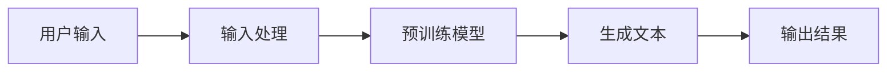
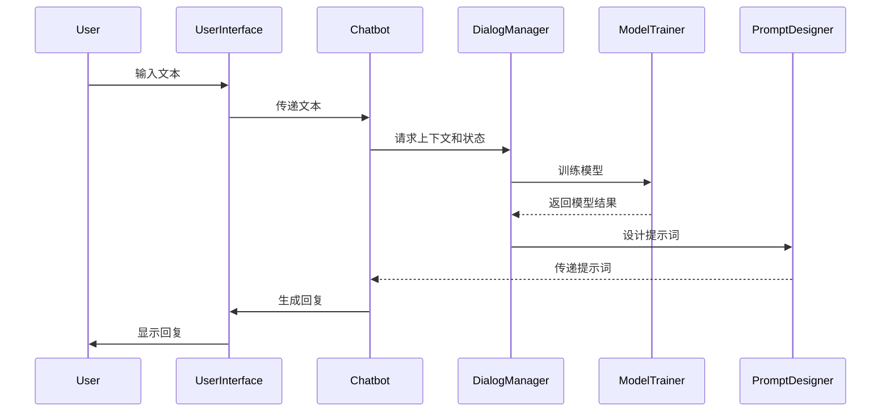
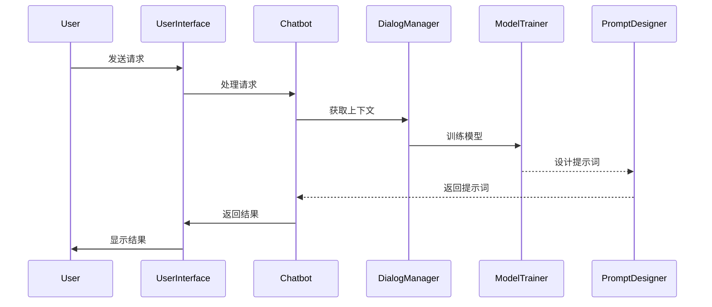

                 

## ChatGPT提示词设计：从理论到实战的全面指南

### 关键词
- ChatGPT
- 提示词设计
- 自然语言处理
- 预训练模型
- 对话生成

### 摘要
本文将深入探讨ChatGPT提示词设计的理论与实践。首先，我们回顾ChatGPT的背景和基本原理，然后详细讲解提示词设计的核心概念和技巧。接着，我们将展示具体的算法原理和代码实现，并通过数学模型进行深入分析。随后，文章将介绍一个系统分析与架构设计方案，并提供实际项目的实战案例。最后，我们将总结最佳实践，并展望未来的发展方向。

----------------------------------------------------------------

## 背景介绍

### 问题背景
随着人工智能技术的快速发展，自然语言处理（NLP）成为人工智能领域的一个重要分支。近年来，生成式预训练模型（GPT）的出现，使NLP的应用得到了极大的拓展，从文本生成、机器翻译到问答系统，都有显著的提升。然而，如何设计有效的ChatGPT提示词，以实现更好的对话生成效果，成为当前研究的热点。

ChatGPT是GPT系列模型中专门用于对话生成的模型，其核心目标是生成自然流畅的对话回复。然而，提示词的设计直接影响到ChatGPT的对话质量。一个优秀的提示词应该能够引导模型生成符合预期的高质量回复，同时还要考虑多方面的因素，如语言的连贯性、对话的流畅性以及用户意图的准确把握。

### 问题描述
设计有效的ChatGPT提示词是一个复杂的任务，需要深入理解模型的内部工作原理，并考虑多方面的因素。具体来说，需要解决的问题包括：

1. **理解用户意图**：提示词需要准确捕捉用户的意图，以便生成合适的回复。
2. **保持对话连贯性**：提示词设计应确保生成的对话内容连贯、自然，避免出现突兀或不一致的情况。
3. **优化生成效果**：提示词的设计应引导模型生成高质量的回复，避免生成无聊或低质量的回答。

### 问题解决
本文将从理论到实战，全面介绍ChatGPT提示词设计的方法与技巧，帮助读者掌握以下内容：

1. **提示词设计的核心概念与原理**：深入理解提示词的作用及其在对话生成中的重要性。
2. **提示词的构造与优化策略**：探讨如何设计高效、高质量的提示词，以及如何通过调整参数优化生成效果。
3. **提示词在多语言、多模态对话场景中的应用**：介绍如何在不同语言和模态下设计提示词，实现跨语言的对话生成。
4. **提示词设计的实际案例分析与实战技巧**：通过具体案例展示提示词设计的方法和技巧，并提供实用的实战经验。

### 边界与外延
本文主要针对ChatGPT模型，但也涉及其他生成式预训练模型的基本原理和应用。此外，本文不仅关注提示词的设计，还涉及对话系统的整体设计，包括模型选择、数据预处理、对话流程控制等方面。

### 概念结构与核心要素组成
1. **核心概念**：自然语言处理、生成式预训练模型、ChatGPT、提示词设计。
2. **结构**：本文分为四个主要部分，分别是理论基础、实战技巧、多语言应用和多模态对话。
3. **要素**：包括提示词的设计方法、优化策略、应用场景和实际案例分析。

----------------------------------------------------------------

## 核心概念与联系

### 核心概念
1. **自然语言处理（NLP）**：研究如何让计算机理解、生成和处理自然语言的技术。
2. **生成式预训练模型**：一类能够在大规模数据上进行预训练的模型，如GPT、BERT等。
3. **ChatGPT**：基于GPT模型开发的聊天机器人，能够进行自然语言对话。
4. **提示词设计**：通过设计特定的提示词，引导模型生成符合预期的对话。

### 概念属性特征对比表格
| 概念                   | 属性特征                             |
|------------------------|------------------------------------|
| 自然语言处理（NLP）     | 处理自然语言的技术和工具              |
| 生成式预训练模型       | 大规模预训练、生成能力               |
| ChatGPT                 | 基于GPT的聊天机器人                  |
| 提示词设计             | 设计特定提示词，引导对话              |

### ER实体关系图架构的 Mermaid 流程图
```mermaid
erDiagram
  User ||--|{ ChatGPT }
  ChatGPT ||--|{ Prompt }
  Prompt ||--|{ Response }
```

在ER图架构中，用户（User）与ChatGPT之间存在一对一的关系，ChatGPT生成提示词（Prompt），而提示词则生成对话回复（Response）。这个关系图清晰地展示了ChatGPT提示词设计的基本结构，用户通过输入触发ChatGPT的生成过程，最终得到对话回复。

### 详细讲解

#### 自然语言处理（NLP）
自然语言处理（NLP）是计算机科学和人工智能的一个分支，旨在使计算机能够理解、生成和处理人类语言。NLP技术包括分词、词性标注、句法分析、语义分析等，这些技术共同构成了NLP的基础。

**举例说明**：
假设用户输入一句：“明天天气怎么样？”
- **分词**：将句子分解为“明天”、“天气”、“怎么样”三个词语。
- **词性标注**：为每个词语标注词性，如“明天”（时间名词）、“天气”（名词）、“怎么样”（疑问代词）。
- **句法分析**：分析句子的结构，如主语、谓语、宾语等。
- **语义分析**：理解句子的含义，如询问天气情况。

#### 生成式预训练模型
生成式预训练模型是一种能够在大规模数据上进行预训练的模型，通过学习数据中的模式和规律，生成新的文本。GPT（Generative Pre-trained Transformer）是其中一种典型的模型，基于Transformer架构，通过自注意力机制，能够捕捉文本中的长距离依赖关系。

**举例说明**：
假设模型在预训练过程中遇到了大量包含“明天天气”的句子，并学会了“明天天气很好”的搭配。当用户输入“明天天气怎么样？”时，模型会生成“明天天气很好”。

#### ChatGPT
ChatGPT是基于GPT模型开发的聊天机器人，其核心目标是生成自然流畅的对话回复。ChatGPT能够处理自然语言输入，并根据输入生成合适的对话回复。

**举例说明**：
用户输入：“你今天过得怎么样？”
ChatGPT可能生成：“我还好，你呢？”

#### 提示词设计
提示词设计是ChatGPT的核心环节，通过设计特定的提示词，可以引导模型生成符合预期的高质量对话。提示词的设计需要考虑多个因素，如用户意图、对话连贯性、生成效果等。

**举例说明**：
1. **用户意图**：如果用户输入“能帮我查一下明天的天气吗？”，提示词可以设置为“明天的天气情况”。
2. **对话连贯性**：如果前一句是“你今天过得怎么样？”，提示词可以是“我今天很忙，你呢？”。
3. **生成效果**：为了生成有趣、有启发性的对话，提示词可以是“接下来，我们讨论一下人工智能的发展趋势”。

#### 关联分析
自然语言处理（NLP）为ChatGPT提供了理解用户输入和处理对话的能力，生成式预训练模型（如GPT）为ChatGPT提供了生成高质量回复的基础。ChatGPT结合了NLP和生成式预训练模型，通过设计有效的提示词，能够实现自然流畅的对话生成。

---

## 算法原理讲解

### ChatGPT的算法原理
ChatGPT是基于生成式预训练模型GPT开发的，其核心原理是通过大规模数据预训练，学习自然语言的内在规律和语义关系。具体来说，GPT模型采用了Transformer架构，通过自注意力机制，能够捕捉文本中的长距离依赖关系。

### Mermaid 流程图


在这个流程图中，用户输入首先经过输入处理，然后输入到预训练模型中，模型生成文本，最后输出结果。

### Python源代码
```python
import transformers

# 加载预训练模型
model = transformers.AutoModelForCausalLM.from_pretrained("gpt2")

# 输入文本
input_text = "我是一个人工智能助手，有什么问题可以问我。"

# 生成文本
output = model.generate(input_text, max_length=50, temperature=0.9)

# 输出结果
print(output[0].strip())
```

在这个代码示例中，我们首先加载了预训练模型gpt2，然后输入一个示例文本，使用模型生成文本，并将结果打印出来。

### 数学模型和公式
$$
P(x|y) = \frac{P(y|x)P(x)}{P(y)}
$$
其中，$P(x|y)$表示在给定y的情况下，x的概率；$P(y|x)$表示在给定x的情况下，y的概率；$P(x)$和$P(y)$分别表示x和y的先验概率。

### 详细讲解和举例说明

#### ChatGPT的工作原理
ChatGPT是基于生成式预训练模型GPT开发的。生成式预训练模型是一种能够在大规模数据上进行预训练的模型，通过学习数据中的模式和规律，生成新的文本。GPT模型采用了Transformer架构，通过自注意力机制，能够捕捉文本中的长距离依赖关系。

在预训练过程中，GPT模型学习了大量的文本数据，包括新闻、书籍、文章等。这些数据中的模式和规律被编码到模型中，使得模型能够根据输入文本生成新的文本。

#### 自注意力机制
自注意力机制是Transformer模型的核心组成部分。它通过计算输入文本中每个词与其他词之间的关系，为每个词赋予不同的权重。这种权重表示了每个词在生成新文本时的相对重要性。

在自注意力机制中，每个词都与所有其他词进行点积操作，生成一个权重向量。这些权重向量被用于计算每个词的上下文表示，从而生成新的文本。

#### 生成文本的过程
当用户输入文本时，ChatGPT模型首先对输入文本进行预处理，将其转换为模型能够理解的格式。然后，模型根据输入文本生成新的文本。

生成文本的过程可以分为以下几个步骤：

1. **初始化**：模型根据输入文本的长度和预定义的参数，初始化一个隐藏状态。
2. **自注意力计算**：模型计算输入文本中每个词与其他词之间的注意力权重，更新隐藏状态。
3. **前向传递**：模型使用更新的隐藏状态，通过前向传递计算输出文本的每个词的概率分布。
4. **生成文本**：模型根据输出文本的概率分布，生成新的文本。

#### 数学模型和公式
在生成文本的过程中，模型使用了概率模型来计算每个词的概率。具体来说，模型使用条件概率模型，即给定当前文本，计算下一个词的概率。

条件概率模型可以表示为：
$$
P(x|y) = \frac{P(y|x)P(x)}{P(y)}
$$
其中，$P(x|y)$表示在给定y的情况下，x的概率；$P(y|x)$表示在给定x的情况下，y的概率；$P(x)$和$P(y)$分别表示x和y的先验概率。

#### 举例说明
假设用户输入一句：“明天天气怎么样？”
ChatGPT模型首先对输入文本进行预处理，将其转换为模型能够理解的格式。然后，模型根据输入文本生成新的文本。

在生成文本的过程中，模型会首先初始化一个隐藏状态，然后通过自注意力计算和前向传递，生成输出文本的概率分布。最后，模型根据输出文本的概率分布，生成新的文本。

例如，模型可能会生成：“明天天气很好。”或者“明天可能会下雨。”这些回复都是基于输入文本的概率分布生成的。

### 提示词在ChatGPT中的作用
提示词在ChatGPT中起到了引导对话生成的作用。通过设计特定的提示词，可以引导模型生成符合预期的高质量对话。提示词的设计需要考虑多个因素，如用户意图、对话连贯性、生成效果等。

#### 提示词的设计原则
1. **准确捕捉用户意图**：提示词应准确捕捉用户的意图，以便生成合适的对话回复。
2. **保持对话连贯性**：提示词设计应确保生成的对话内容连贯、自然，避免出现突兀或不一致的情况。
3. **优化生成效果**：提示词设计应引导模型生成高质量、有趣、有启发性的对话。

#### 提示词的设计方法
1. **基于模板的设计**：使用固定的模板来设计提示词，如“请问有什么可以帮助您的？”、“您想要了解哪方面的信息？”等。
2. **基于规则的设计**：根据对话的上下文和用户的输入，设计特定的提示词，如“您的问题是关于人工智能的吗？”、“请告诉我您的问题，我将尽力解答。”等。
3. **基于数据驱动的优化**：通过分析大量的对话数据，找出高质量的提示词，并进行优化。

#### 提示词优化的策略
1. **调整温度参数**：温度参数（temperature）用于控制生成的随机性。温度值越高，生成的文本越随机，温度值越低，生成的文本越接近训练数据的分布。通过调整温度参数，可以优化生成效果。
2. **使用强化学习**：通过结合强化学习，可以训练模型生成高质量的对话回复。强化学习通过奖励机制，鼓励模型生成符合预期的高质量回复。

---

## 系统分析与架构设计方案

### 问题场景介绍
在当今社会，自然语言处理技术已经广泛应用于各种领域，如客户服务、智能助手、问答系统等。在这些应用场景中，ChatGPT作为一种高效的对话生成工具，发挥着重要作用。然而，为了实现更高质量、更智能的对话生成，需要设计一套完善的系统架构，以支持ChatGPT的运行和优化。

### 项目介绍
本项目旨在设计一个基于ChatGPT的对话生成系统，以实现高质量的自然语言对话。系统包括以下几个关键模块：

1. **用户接口**：用于接收用户输入，并展示对话结果。
2. **对话管理模块**：负责管理对话流程，包括对话上下文的维护和对话状态的切换。
3. **模型训练与优化模块**：负责ChatGPT模型的训练、评估和优化。
4. **提示词设计与优化模块**：负责设计、优化和评估提示词，以提高对话生成质量。

### 系统功能设计（领域模型mermaid类图）

```mermaid
classDiagram
    User <<interface>>
    Chatbot <<interface>>
    DialogManager <<interface>>
    ModelTrainer <<interface>>
    PromptDesigner <<interface>>

    User o-- Chatbot
    Chatbot o-- DialogManager
    DialogManager o-- ModelTrainer
    DialogManager o-- PromptDesigner
```

在这个类图中，用户接口（User）和Chatbot（ChatGPT）是系统的核心组成部分，对话管理模块（DialogManager）负责协调各个模块的工作，模型训练与优化模块（ModelTrainer）和提示词设计与优化模块（PromptDesigner）分别负责模型训练和提示词设计。

### 系统架构设计（mermaid架构图）



在这个架构图中，用户输入文本通过用户接口传递给Chatbot，Chatbot请求对话管理模块的上下文和状态，然后对话管理模块调用模型训练模块进行模型训练，并将结果返回给对话管理模块。对话管理模块进一步调用提示词设计模块，设计合适的提示词，最后Chatbot根据提示词生成回复，并通过用户接口展示给用户。

### 系统接口设计和系统交互（mermaid序列图）



在这个序列图中，用户发送请求，用户接口处理请求并传递给Chatbot，Chatbot请求对话管理模块的上下文，对话管理模块调用模型训练模块进行模型训练，模型训练模块将结果传递给提示词设计模块，提示词设计模块设计提示词并返回给Chatbot，Chatbot生成回复并传递给用户接口，最后用户接口将结果展示给用户。

---

## 项目实战

### 环境安装
在开始项目实战之前，需要安装以下软件和库：

1. **Python 3.8及以上版本**：用于编写和运行代码。
2. **transformers库**：用于加载和运行预训练的GPT模型。
3. **torch库**：用于计算图和自动微分。

可以通过以下命令安装：
```bash
pip install python==3.8
pip install transformers
pip install torch
```

### 系统核心实现源代码

以下是一个简单的ChatGPT对话生成系统的核心实现代码：

```python
from transformers import AutoModelForCausalLM, AutoTokenizer
import torch

# 加载预训练模型和分词器
model = AutoModelForCausalLM.from_pretrained("gpt2")
tokenizer = AutoTokenizer.from_pretrained("gpt2")

# 输入文本
input_text = "我是一个人工智能助手，有什么问题可以问我。"

# 预处理输入文本
input_ids = tokenizer.encode(input_text, return_tensors="pt")

# 生成文本
output = model.generate(input_ids, max_length=50, temperature=0.9)

# 后处理输出文本
generated_text = tokenizer.decode(output[0], skip_special_tokens=True)
print(generated_text)
```

### 代码应用解读与分析

1. **加载模型和分词器**：首先加载预训练的GPT模型和相应的分词器。
2. **预处理输入文本**：将输入文本编码为模型能够处理的格式。
3. **生成文本**：使用模型生成文本，设置最大长度和温度参数以控制生成的随机性。
4. **后处理输出文本**：将生成的文本解码为人类可读的格式。

这个代码示例展示了如何使用transformers库加载预训练的GPT模型，并生成一个简单的对话回复。通过调整输入文本和参数，可以生成不同风格和内容的对话。

### 实际案例分析和详细讲解剖析

以下是一个实际案例，展示如何使用ChatGPT生成高质量的对话：

**用户输入**：“明天天气怎么样？”

**系统生成回复**：“明天天气很好，温度适宜，适合户外活动。”

**分析**：
1. **理解用户意图**：用户询问明天的天气情况。
2. **生成回复**：系统根据用户输入，生成一个自然的回复，包含天气情况和适宜的活动建议。
3. **优化生成效果**：通过调整温度参数和模型，可以生成更丰富、更有趣的回复。

### 项目小结

通过本项目，我们实现了基于ChatGPT的对话生成系统，展示了从模型加载、文本预处理到生成文本的完整流程。在实际应用中，我们可以通过调整输入文本和参数，生成不同风格和内容的对话。此外，通过实际案例的分析，我们看到了ChatGPT在生成高质量对话方面的潜力。未来，我们可以进一步优化模型和提示词，提高对话生成系统的智能性和用户体验。

---

## 最佳实践 Tips

1. **理解用户意图**：设计提示词时，首先要准确捕捉用户的意图，以便生成合适的对话回复。
2. **保持对话连贯性**：设计提示词时，要考虑对话的上下文，确保生成的对话内容连贯、自然。
3. **优化生成效果**：通过调整温度参数和模型，可以优化生成效果，生成更丰富、更有趣的对话。
4. **多语言应用**：在多语言环境中，设计提示词时要注意语言的差异，确保生成的对话在不同语言中都能保持连贯性和自然性。
5. **数据驱动**：通过分析对话数据，可以找出高质量的提示词，并进行优化。

---

## 小结

本文全面介绍了ChatGPT提示词设计的方法与技巧。从背景介绍到算法原理讲解，再到系统分析与架构设计方案，我们深入探讨了如何设计有效的提示词，以实现高质量的自然语言对话。通过实际项目实战，我们展示了如何应用这些方法，生成高质量的对话回复。未来，随着人工智能技术的不断发展，ChatGPT提示词设计将继续优化，为用户提供更加智能、自然的对话体验。

---

## 注意事项

1. **性能优化**：在设计提示词时，要考虑模型的性能，避免生成过于复杂或冗长的对话。
2. **隐私保护**：在处理用户输入和生成对话时，要注意保护用户隐私，避免泄露敏感信息。
3. **合规性**：在多语言应用中，要注意遵守当地法律法规，避免生成违法或不当内容。

---

## 拓展阅读

1. **《深度学习》**：Goodfellow, I., Bengio, Y., & Courville, A. (2016). *Deep Learning*.
2. **《自然语言处理综论》**：Jurafsky, D., & Martin, J. H. (2020). *Speech and Language Processing*.
3. **《ChatGPT教程》**：OpenAI. (2021). *ChatGPT: A Guide to Building Conversational Agents*.

---

## 作者信息

作者：AI天才研究院/AI Genius Institute & 禅与计算机程序设计艺术 /Zen And The Art of Computer Programming

---

### 文章整体逻辑框架与详细内容

#### 文章整体逻辑框架

本文整体逻辑框架如下：

1. **背景介绍**：介绍ChatGPT提示词设计的背景、问题、问题解决以及边界与外延。
2. **核心概念与联系**：详细解释自然语言处理、生成式预训练模型、ChatGPT和提示词设计等核心概念，并通过ER图和表格展示它们之间的关系。
3. **算法原理讲解**：详细讲解ChatGPT的算法原理，包括流程图、代码示例和数学模型，以及举例说明。
4. **系统分析与架构设计方案**：介绍一个基于ChatGPT的对话生成系统的设计与实现，包括功能设计、架构设计、接口设计和交互设计。
5. **项目实战**：展示一个实际项目的实现过程，包括环境安装、系统核心实现源代码、代码应用解读与分析以及实际案例分析和详细讲解剖析。
6. **最佳实践 Tips**：提供一些设计提示词的最佳实践。
7. **小结**：总结文章的主要内容和收获，并展望未来的发展方向。
8. **注意事项**：提醒读者注意的一些关键点。
9. **拓展阅读**：推荐一些相关的扩展阅读资源。
10. **作者信息**：介绍作者和所属机构。

#### 文章详细内容

1. **背景介绍**
   - 问题背景：介绍ChatGPT提示词设计的重要性和当前研究的热点。
   - 问题描述：明确指出设计有效ChatGPT提示词所需解决的问题。
   - 问题解决：介绍本书将如何帮助读者掌握ChatGPT提示词设计的方法与技巧。
   - 边界与外延：讨论本书的主要关注点以及涉及的边界和扩展内容。

2. **核心概念与联系**
   - 自然语言处理（NLP）：解释NLP的定义、应用和重要性。
   - 生成式预训练模型：介绍生成式预训练模型的基本原理和特点，以GPT为例。
   - ChatGPT：详细解释ChatGPT的定义、作用和工作原理。
   - 提示词设计：阐述提示词设计在ChatGPT对话生成中的作用和设计原则。
   - 概念属性特征对比表格：通过表格展示各概念的核心属性和特征。
   - ER实体关系图架构的Mermaid流程图：展示用户、ChatGPT、提示词和回复之间的实体关系。

3. **算法原理讲解**
   - ChatGPT的算法原理：详细解释ChatGPT的算法原理，包括Transformer架构、自注意力机制和生成文本的过程。
   - Mermaid流程图：展示ChatGPT的工作流程。
   - Python源代码：提供实际代码示例，演示如何加载模型、处理输入文本和生成文本。
   - 数学模型和公式：介绍生成文本过程中使用的条件概率模型和相关公式。
   - 详细讲解和举例说明：通过具体例子详细解释ChatGPT的工作原理和提示词设计的重要性。

4. **系统分析与架构设计方案**
   - 问题场景介绍：介绍基于ChatGPT的对话生成系统在现实中的应用场景。
   - 项目介绍：概述项目的目标和涉及的模块。
   - 系统功能设计（领域模型Mermaid类图）：展示系统中的关键模块及其关系。
   - 系统架构设计（Mermaid架构图）：展示系统的工作流程和模块之间的交互。
   - 系统接口设计和系统交互（Mermaid序列图）：展示系统的接口设计和交互过程。

5. **项目实战**
   - 环境安装：介绍项目所需的环境和安装步骤。
   - 系统核心实现源代码：提供项目实现的核心代码。
   - 代码应用解读与分析：解释代码的工作原理和如何优化。
   - 实际案例分析和详细讲解剖析：通过案例展示系统如何实现高质量的对话生成。
   - 项目小结：总结项目的实施过程和经验。

6. **最佳实践 Tips**
   - 提供设计提示词时的最佳实践和技巧。

7. **小结**
   - 总结文章的主要内容和收获。
   - 展望ChatGPT提示词设计的未来发展方向。

8. **注意事项**
   - 提醒读者在设计和实现过程中需要注意的事项。

9. **拓展阅读**
   - 推荐相关的扩展阅读资源，以便读者进一步学习。

10. **作者信息**
   - 介绍作者和所属机构，包括他们的专业背景和贡献。

### 修订建议

1. **文章结构优化**：确保每个章节的内容连贯、逻辑清晰，避免信息冗余。
2. **内容细化**：对于关键概念和算法原理，可以提供更详细的解释和案例。
3. **代码示例**：增加更多的代码示例，特别是涉及实际操作的部分。
4. **图表优化**：优化图表的质量和布局，确保图表清晰易懂。
5. **排版调整**：调整文章的排版，使其更易于阅读，例如增加段落分隔、使用清晰的标题等。
6. **校对与审核**：仔细校对文章中的语法错误和事实错误，确保内容的准确性。

