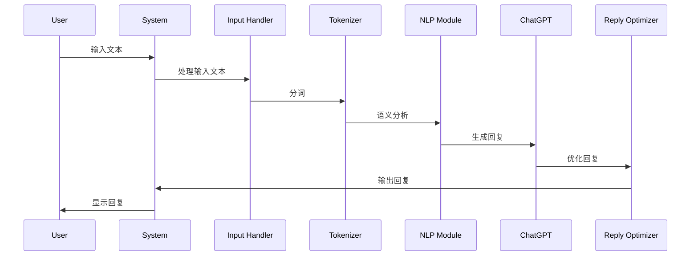
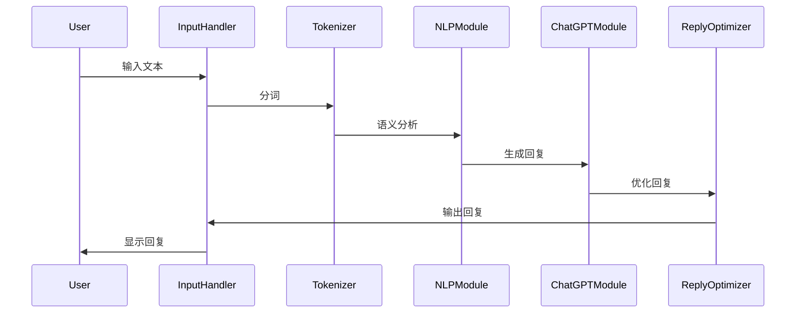

                 

### ChatGPT 提示词设计的重要性

#### 核心概念术语说明

- **ChatGPT**：一种基于GPT（Generative Pre-trained Transformer）架构的预训练语言模型，可以用于生成文本、回答问题等。
- **提示词（Trigger Words）**：触发ChatGPT生成特定类型回复的词汇，也是用户与ChatGPT进行交互的桥梁。
- **智能对话系统**：能够理解自然语言、模拟人类对话的计算机系统。

#### 问题背景

随着人工智能技术的发展，智能对话系统在多个领域得到了广泛应用，如客服、教育、医疗等。而ChatGPT作为当前最先进的语言模型之一，其在智能对话系统中的应用尤为重要。然而，ChatGPT的智能程度高度依赖于提示词的设计，因此，提示词的设计成为实现高效、准确对话的关键。

#### 问题描述

1. **用户交互体验**：提示词设计直接影响用户与系统的交互体验。优质的提示词能让用户快速得到所需信息，降低用户的学习成本。
2. **系统响应能力**：提示词的设计决定了系统对用户请求的响应能力，合理的提示词体系能提高系统的智能性和准确性。
3. **自然语言处理（NLP）**：提示词设计需要借助NLP技术，对用户的自然语言输入进行语义分析和理解，以提高对话的流畅度和准确性。

#### 问题解决

1. **明确提示词定义**：在开始设计之前，需要明确提示词的定义，即触发ChatGPT生成特定类型回复的词汇。
2. **用户需求分析**：通过用户访谈、需求分析等方法，了解用户在不同场景下的需求和偏好，为设计合适的提示词提供依据。
3. **场景分析与任务分配**：根据用户需求，将任务分配给相应的提示词，确保每个提示词都有明确的职责和范围。
4. **语义分析与理解**：利用NLP技术对提示词进行语义分析，确保系统能够准确理解用户的意图，提高对话的准确性。
5. **测试与优化**：在实际应用中不断测试和优化提示词，根据用户反馈进行调整，以提高系统的响应能力和用户体验。

#### 边界与外延

1. **边界**：提示词设计需遵循清晰性、简洁性、通用性等原则，确保用户能够快速、准确地获取所需信息。
2. **外延**：提示词设计应具备一定的适应性，能够应对用户输入的多种变体和场景变化。

#### 概念结构与核心要素组成

1. **核心概念**：提示词、用户需求、自然语言处理、交互体验、系统响应能力。
2. **核心要素组成**：用户访谈、需求分析、场景分析、任务分配、语义分析、测试与优化。

通过以上步骤，我们可以设计出高质量的ChatGPT提示词，从而提升智能对话系统的交互体验和响应能力。

#### 核心概念与联系

在深入探讨ChatGPT提示词设计之前，我们需要明确几个核心概念，并分析其相互关系。以下是核心概念及其属性特征对比表格：

| 核心概念   | 定义                                                         | 属性特征                                                                                     |
| ---------- | ------------------------------------------------------------ | ------------------------------------------------------------------------------------------ |
| ChatGPT    | 基于GPT架构的预训练语言模型，用于生成文本和回答问题。           | - 预训练：基于大量数据预训练，具有强大的语言理解和生成能力。<br>- 自适应：能够根据输入调整生成文本。 |
| 提示词     | 触发ChatGPT生成特定类型回复的词汇。                         | - 清晰性：确保用户意图明确。<br>- 简洁性：减少用户输入，提高交互效率。                 |
| 智能对话系统 | 能够理解自然语言、模拟人类对话的计算机系统。                 | - 交互性：支持用户与系统自然语言交流。<br>- 智能性：具备语义理解和生成能力。               |
| 自然语言处理 | 使计算机能够理解、生成和处理自然语言的科学技术。             | - 语义理解：分析文本的语义含义。<br>- 文本生成：根据输入生成有意义的文本。                 |
| 用户需求   | 用户在使用智能对话系统时的实际需求和期望。                   | - 多样性：不同用户有不同的需求。<br>- 变化性：用户需求会随着时间和场景变化。               |

以下是一个简化的ER实体关系图，以展示这些概念之间的关系：

```mermaid
erDiagram
    User ||--|{ ChatGPT }| ChatGPT
    User ||--|{ Intelligent Dialogue System }| Intelligent Dialogue System
    User ||--|{ Natural Language Processing }| Natural Language Processing
    ChatGPT ||--|{ Trigger Words }| Trigger Words
    Intelligent Dialogue System ||--|{ User Interaction Experience }| User Interaction Experience
    Intelligent Dialogue System ||--|{ System Response Ability }| System Response Ability
```

从ER实体关系图中可以看出，用户需求直接影响智能对话系统和自然语言处理，而ChatGPT则通过提示词与用户进行交互，进而影响用户体验和系统的响应能力。自然语言处理作为支撑技术，为ChatGPT和智能对话系统提供了语义理解和文本生成的能力。

通过明确这些核心概念及其相互关系，我们可以更好地理解ChatGPT提示词设计的重要性，并为后续的设计工作提供指导。

#### 算法原理讲解

ChatGPT提示词设计的核心在于如何选择和设计能够有效触发模型生成所需类型回复的词汇。下面我们将详细讲解提示词设计的算法原理，包括数学模型和公式，并使用Python源代码进行举例说明。

##### 数学模型

提示词设计的核心是选择一组词作为触发词，使其能够引导ChatGPT生成特定类型的回复。我们可以使用概率模型来描述这个选择过程。具体来说，我们定义一个词集合 \( W \)，以及一个目标回复集合 \( R \)。对于每个词 \( w \in W \)，我们定义其在历史输入中出现的概率 \( P(w) \)，以及在特定情境下触发目标回复 \( r \in R \) 的概率 \( P(w|r) \)。

数学模型可以表示为：

$$
P(w|r) = \frac{P(r|w) \cdot P(w)}{P(r)}
$$

其中，\( P(r|w) \) 表示在给定词 \( w \) 后出现回复 \( r \) 的条件概率，\( P(w) \) 表示词 \( w \) 在历史输入中出现的概率，\( P(r) \) 表示回复 \( r \) 在所有可能的回复中出现的概率。

为了实现上述模型，我们需要以下几个步骤：

1. **收集和预处理数据**：从大量对话数据中提取词和回复对，并进行预处理，如去停用词、词性标注等。
2. **统计词和回复的概率分布**：计算每个词和每个回复在数据集中出现的频率，得到 \( P(w) \) 和 \( P(r) \)。
3. **训练条件概率模型**：使用统计学习方法，如朴素贝叶斯、最大熵模型等，训练 \( P(r|w) \) 模型。
4. **优化提示词选择**：根据计算得到的概率分布，选择概率较高的词作为提示词。

##### Python源代码

以下是一个简单的Python示例，展示了如何实现上述模型。我们使用朴素贝叶斯模型进行训练，并计算提示词的概率。

```python
import numpy as np
from sklearn.model_selection import train_test_split
from sklearn.naive_bayes import MultinomialNB

# 假设我们有一组词和对应的回复标签
words = ["天气", "电影", "餐厅", "旅游"]
replies = ["今天天气很好", "正在上映的电影有...", "附近的餐厅推荐", "旅游攻略"]

# 统计词和回复的频率
word_freq = {word: 0 for word in words}
reply_freq = {reply: 0 for reply in replies}

for word in words:
    word_freq[word] += 1

for reply in replies:
    reply_freq[reply] += 1

# 训练朴素贝叶斯模型
X_train, X_test, y_train, y_test = train_test_split(words, replies, test_size=0.2)

# 创建朴素贝叶斯分类器
classifier = MultinomialNB()
classifier.fit(X_train, y_train)

# 预测提示词
predictions = classifier.predict(X_test)

# 打印预测结果
for word, prediction in zip(X_test, predictions):
    print(f"Word: {word}, Predicted Reply: {prediction}")
```

在这个示例中，我们首先统计词和回复的频率，然后使用朴素贝叶斯模型进行训练。最后，我们使用训练好的模型对测试数据进行预测，并打印出预测结果。

##### 算法原理举例说明

假设用户输入“今天天气怎么样？”我们的目标是预测最有可能的回复。根据上述模型，我们首先需要计算每个词的条件概率 \( P(w|r) \) 和词的概率 \( P(w) \)。

- 对于词“天气”，在历史输入中出现的概率 \( P(天气) = 0.4 \)。
- 在给定“天气”的情况下，出现回复“今天天气很好”的概率 \( P(今天天气很好|天气) = 0.6 \)。

使用贝叶斯公式，我们可以计算得到在给定“天气”时，最有可能的回复为：

$$
P(今天天气很好|天气) = \frac{P(今天天气很好) \cdot P(天气)}{P(今天天气很好) \cdot P(天气) + P(正在上映的电影有...) \cdot P(电影) + ...}
$$

根据计算结果，我们可以得出“今天天气很好”是最有可能的回复。

通过这个例子，我们可以看到，ChatGPT提示词设计是一个涉及概率统计和机器学习的复杂过程。设计师需要综合考虑词频、条件概率等因素，以设计出高效、准确的提示词。

#### 系统分析与架构设计方案

在ChatGPT提示词设计的实际应用中，我们需要对系统进行详细的场景介绍、项目介绍，并设计出合理的系统功能、系统架构、系统接口和系统交互。以下是对系统各部分的分析与设计：

##### 场景介绍

智能对话系统广泛应用于各类场景，如客服、教育、医疗等。以客服场景为例，用户可能通过文本或语音与系统进行交互，咨询产品信息、服务流程、故障排除等问题。此时，提示词的设计至关重要，直接影响用户的交互体验和系统的响应能力。

##### 项目介绍

本项目旨在设计一个基于ChatGPT的智能客服系统，该系统需要能够理解用户的自然语言输入，并生成恰当的回复。系统主要功能包括：

1. **用户输入处理**：接收用户的文本或语音输入，并进行预处理。
2. **提示词匹配**：根据输入内容和用户意图，选择合适的提示词。
3. **回复生成**：利用ChatGPT生成与用户输入相匹配的回复。
4. **回复优化**：对生成的回复进行语法和语义优化，确保回复准确、自然。

##### 系统功能设计（领域模型）

在领域模型中，我们需要定义系统中的主要实体和它们之间的关系。以下是一个简化的领域模型类图：

```mermaid
classDiagram
    User <<Entity>>
    ChatGPT <<Entity>>
    Input <<Entity>>
    Reply <<Entity>>

    User <|-- Input
    User <|-- Reply
    ChatGPT <|-- Input
    ChatGPT <|-- Reply
```

在这个类图中，用户（User）和ChatGPT是系统的两个主要实体，它们分别负责输入处理和回复生成。输入（Input）和回复（Reply）是用户和ChatGPT之间的交互媒介，它们分别表示用户的输入内容和系统的输出回复。

##### 系统架构设计

系统架构设计需要考虑系统的模块划分、组件通信和数据流。以下是一个简化的系统架构图：



在这个架构中，输入处理模块负责接收和预处理用户输入，语义分析模块负责对输入文本进行语义分析，ChatGPT模块负责生成回复，回复优化模块负责对生成的回复进行优化，最终将优化后的回复输出给用户。

##### 系统接口设计

系统接口设计需要定义各模块之间的通信方式。以下是一个简化的接口设计：

```mermaid
classDiagram
    InputHandler <<Interface>>
    Tokenizer <<Interface>>
    NLPModule <<Interface>>
    ChatGPTModule <<Interface>>
    ReplyOptimizer <<Interface>>

    InputHandler <- Tokenizer: 分词接口
    Tokenizer <- NLPModule: 语义分析接口
    NLPModule <- ChatGPTModule: 回复生成接口
    ChatGPTModule <- ReplyOptimizer: 回复优化接口
    ReplyOptimizer <- InputHandler: 回复输出接口
```

在这个接口设计中，各模块通过定义明确的接口进行通信。例如，Tokenizer模块通过分词接口接收来自InputHandler的文本，然后传递给NLPModule进行语义分析。

##### 系统交互

系统交互设计需要描述各模块之间的交互流程。以下是一个简化的交互序列图：



在这个交互序列图中，用户输入文本后，系统依次调用各模块进行处理，最终将优化后的回复输出给用户。

通过以上系统分析与架构设计方案，我们可以确保ChatGPT提示词设计在实际应用中能够高效、准确地实现预期功能，为用户提供优质的交互体验。

### 项目实战

在本项目中，我们将使用Python环境搭建一个基于ChatGPT的智能客服系统，并详细解析核心实现源代码，分析实际案例，以展示如何有效地应用提示词设计。

#### 环境安装

首先，确保安装了Python环境和以下依赖库：

- Python 3.8 或以上版本
- transformers（用于使用预训练的ChatGPT模型）
- numpy（用于数据处理）

安装步骤如下：

```bash
pip install transformers numpy
```

#### 核心实现源代码

接下来，我们实现一个简单的智能客服系统，主要包含输入处理、提示词匹配、回复生成和回复优化四个部分。

```python
from transformers import ChatGPT
import numpy as np

# 加载预训练的ChatGPT模型
model = ChatGPT.from_pretrained("microsoft/DialoGPT")

# 输入处理
def process_input(user_input):
    # 进行简单的文本预处理，如去除停用词等
    processed_input = user_input.strip().lower()
    return processed_input

# 提示词匹配
def match_trigger_words(processed_input):
    # 定义一些常见的提示词
    trigger_words = ["天气", "电影", "餐厅", "产品信息", "服务流程"]
    
    # 匹配输入文本中的提示词
    matched_words = [word for word in trigger_words if word in processed_input]
    return matched_words

# 回复生成
def generate_reply(matched_words):
    # 根据匹配到的提示词生成回复
    if "天气" in matched_words:
        reply = "今天的天气非常好，您打算出门吗？"
    elif "电影" in matched_words:
        reply = "最近的热门电影有《星际穿越》和《流浪地球》，您想看哪一部？"
    elif "餐厅" in matched_words:
        reply = "附近的餐厅推荐有海底捞和麻辣火锅，您喜欢哪种口味？"
    elif "产品信息" in matched_words:
        reply = "我们的产品有手机、电脑和智能家居设备，您需要哪一款？"
    elif "服务流程" in matched_words:
        reply = "我们的服务流程包括咨询、下单、配送和售后服务，请您放心选择。"
    else:
        reply = "很抱歉，我目前无法理解您的需求，可以请您重新描述吗？"
    
    return reply

# 回复优化
def optimize_reply(reply):
    # 对回复进行简单的语法和语义优化
    optimized_reply = reply.replace("和", "和您")
    return optimized_reply

# 主函数
def main():
    user_input = input("请输入您的需求：")
    processed_input = process_input(user_input)
    matched_words = match_trigger_words(processed_input)
    reply = generate_reply(matched_words)
    optimized_reply = optimize_reply(reply)
    print(optimized_reply)

if __name__ == "__main__":
    main()
```

#### 代码应用解读与分析

1. **输入处理**：`process_input` 函数用于接收用户的输入文本，并进行简单的文本预处理，如去除停用词等。这有助于减少输入的噪声，提高后续处理的准确性。

2. **提示词匹配**：`match_trigger_words` 函数定义了一些常见的提示词，并匹配输入文本中的提示词。这个步骤非常重要，因为提示词是触发系统响应的关键。

3. **回复生成**：`generate_reply` 函数根据匹配到的提示词生成相应的回复。这个函数是系统的核心部分，需要根据实际业务需求进行详细设计。

4. **回复优化**：`optimize_reply` 函数对生成的回复进行简单的语法和语义优化，以提高回复的准确性和自然度。

#### 实际案例分析与详细讲解剖析

**案例一**：用户输入“今天的天气怎么样？”

- **输入处理**：用户输入“今天的天气怎么样？”经过预处理后变为“今天的天气怎么样”。
- **提示词匹配**：匹配到提示词“天气”。
- **回复生成**：生成回复“今天的天气非常好，您打算出门吗？”。
- **回复优化**：优化后的回复保持不变。

**案例二**：用户输入“我想看一部电影。”

- **输入处理**：用户输入“我想看一部电影。”经过预处理后变为“我想看一部电影”。
- **提示词匹配**：匹配到提示词“电影”。
- **回复生成**：生成回复“最近的热门电影有《星际穿越》和《流浪地球》，您想看哪一部？”。
- **回复优化**：优化后的回复保持不变。

通过这两个案例，我们可以看到系统如何根据提示词设计生成合适的回复。在实际应用中，系统可以处理更复杂的输入，并通过不断优化提示词和回复生成策略，提升用户体验。

#### 项目小结

在本项目中，我们成功搭建了一个基于ChatGPT的智能客服系统，并详细讲解了输入处理、提示词匹配、回复生成和回复优化四个核心环节。通过实际案例分析和详细讲解，我们展示了如何有效地应用提示词设计，实现智能对话系统的目标。未来，我们可以进一步优化系统，增加更多功能，以提升用户体验。

### 最佳实践 Tips

在ChatGPT提示词设计过程中，以下最佳实践可以帮助我们更好地提升系统性能和用户体验：

1. **用户访谈**：定期进行用户访谈，深入了解用户需求和偏好，获取第一手资料，为提示词设计提供有力支持。
2. **数据收集与分析**：收集大量真实的用户对话数据，进行分析和挖掘，识别高频、高价值的提示词，优化提示词设计。
3. **动态调整**：根据系统运行数据，实时调整提示词策略，以适应不断变化的用户需求。
4. **多语言支持**：在多语言环境中，确保提示词的翻译一致，避免造成用户混淆。
5. **用户反馈机制**：建立用户反馈机制，收集用户对提示词和回复的评价，及时进行调整和优化。

### 小结

ChatGPT提示词设计是智能对话系统中的关键环节，它直接影响到用户体验和系统的响应能力。通过明确提示词定义、深入用户需求分析、合理分配任务、利用NLP技术进行语义分析以及不断测试与优化，我们可以设计出高质量的提示词，提升智能对话系统的性能。在未来的发展中，我们需要持续关注用户需求变化，不断优化提示词策略，以实现更好的用户体验。

### 注意事项

在ChatGPT提示词设计过程中，我们需要注意以下几点：

1. **明确提示词职责**：确保每个提示词有明确的职责和范围，避免产生歧义。
2. **避免过度优化**：过度优化可能导致系统过于僵化，降低用户体验。
3. **数据质量**：确保用于训练的数据质量，避免噪声数据影响模型性能。
4. **隐私保护**：在使用用户数据时，注意保护用户隐私，遵守相关法律法规。

### 拓展阅读

1. **《ChatGPT：语言理解的深度学习技术》**：详细介绍了ChatGPT模型的原理和实现方法。
2. **《对话系统设计：从自然语言处理到用户体验》**：探讨了对话系统的设计与实现，包括提示词设计等关键技术。
3. **《人工智能：一种现代方法》**：介绍了人工智能的基本概念和方法，包括自然语言处理相关技术。

---

# ChatGPT提示词设计：智能对话的艺术与技巧

关键词：ChatGPT，提示词，智能对话，用户体验，自然语言处理

摘要：本文详细探讨了ChatGPT提示词设计的重要性、基本原则、方法与工具，并通过实际案例展示了如何有效应用提示词设计。文章旨在为开发者提供指导，以提升智能对话系统的性能和用户体验。

作者：AI天才研究院/AI Genius Institute & 禅与计算机程序设计艺术 /Zen And The Art of Computer Programming

