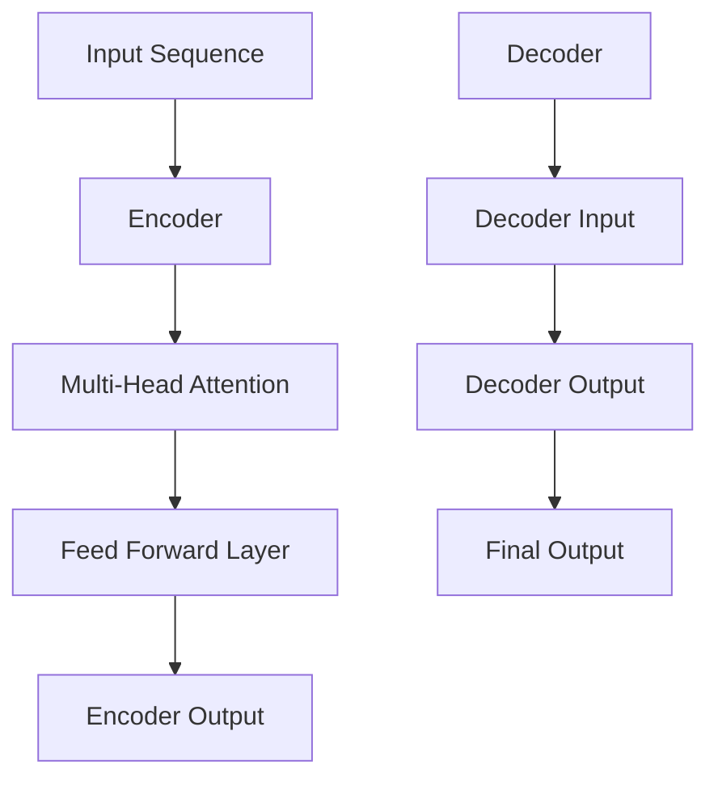
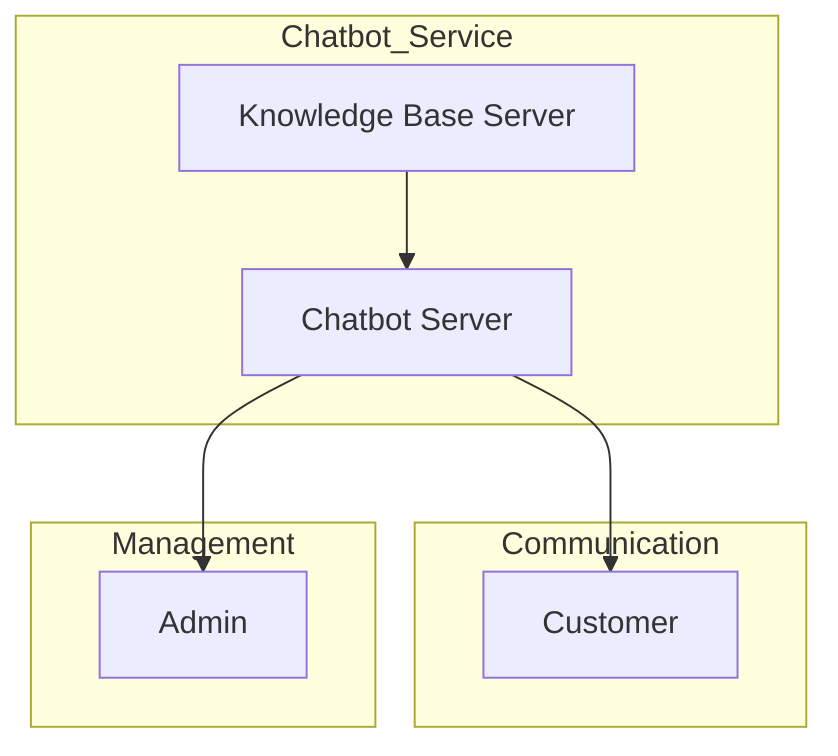
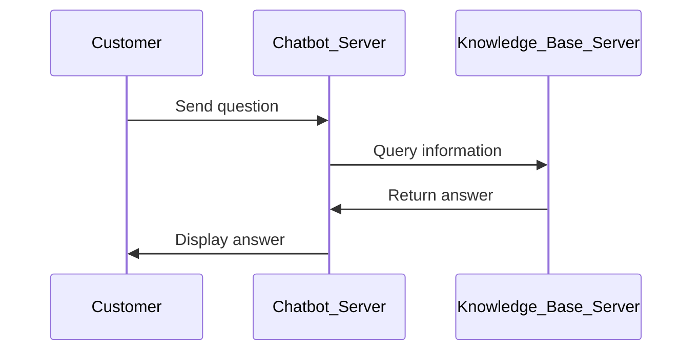

                 

Alright, let's think through the process of creating the article "ChatGPT Prompt Design: Theory and Practical Integration" step by step.

### Step 1: Introduction and Background

**Introduction:**
Start with a captivating introduction to set the stage for the reader. Introduce the topic of ChatGPT prompt design and its significance in the context of artificial intelligence and natural language processing.

**Background:**
Provide a brief overview of the evolution of ChatGPT, its capabilities, and the growing interest in prompt engineering. Discuss the challenges and opportunities that arise from designing effective prompts for ChatGPT.

**Content:**
- **Section 1.1:** Introduce ChatGPT and its foundational role in the AI landscape.
- **Section 1.2:** Explain the importance of prompt engineering in maximizing ChatGPT's potential.
- **Section 1.3:** Discuss the various applications of ChatGPT and the role of prompts in those contexts.
- **Section 1.4:** Explore the challenges in prompt design and the opportunities for innovation.

### Step 2: Core Concepts and Theories

**Core Concepts:**
- **Natural Language Processing (NLP):** Explain the basics of NLP, including tokenization and sentence structure.
- **ChatGPT Model Architecture:** Discuss the key components of ChatGPT's architecture, such as transformer models and attention mechanisms.
- **The Role of Prompts:** Explain how prompts are crafted and the different types of prompts used in ChatGPT.

**Content:**
- **Chapter 2.1:** Dive into the fundamentals of NLP, with a focus on tokenization and sentence structure.
  - **Subsection 2.1.1:** NLP Basics
  - **Subsection 2.1.2:** Tokenization and Sentence Structure
- **Chapter 2.2:** Explain the architecture of ChatGPT, highlighting transformer models and attention mechanisms.
  - **Subsection 2.2.1:** Introduction to Transformer Models
  - **Subsection 2.2.2:** Attention Mechanisms
- **Chapter 2.3:** Discuss the role of prompts in ChatGPT, including how to craft effective prompts and the different types of prompts.
  - **Subsection 2.3.1:** Crafting Effective Prompts
  - **Subsection 2.3.2:** Different Types of Prompts

### Step 3: Algorithm Principles

**Algorithm Principles:**
- **Transformer Algorithm:** Discuss the principles behind the transformer algorithm, including its architecture and training process.
- **Fine-Tuning ChatGPT:** Explain the process of fine-tuning ChatGPT for specific tasks and domains.

**Content:**
- **Chapter 3.1:** Provide a deep dive into the transformer algorithm, including its architecture and training process.
  - **Subsection 3.1.1:** Introduction to Transformer
  - **Subsection 3.1.2:** Transformer Architecture
  - **Subsection 3.1.3:** Training and Inference
- **Chapter 3.2:** Discuss fine-tuning techniques and their application in ChatGPT.
  - **Subsection 3.2.1:** Fine-Tuning Basics
  - **Subsection 3.2.2:** Fine-Tuning Techniques
  - **Subsection 3.2.3:** Case Study: Fine-Tuning for Specific Domains

### Step 4: Practical Case Studies

**Practical Case Studies:**
- **Customer Service Chatbots:** Explore the design and implementation of ChatGPT in customer service chatbots.
- **Education and E-Learning:** Discuss the use of ChatGPT in educational contexts and e-learning platforms.

**Content:**
- **Chapter 4.1:** Examine the role of ChatGPT in customer service chatbots.
  - **Subsection 4.1.1:** Design Considerations
  - **Subsection 4.1.2:** Implementing ChatGPT in Customer Service
  - **Subsection 4.1.3:** Case Study: A Successful Customer Service Bot
- **Chapter 4.2:** Explore the application of ChatGPT in education and e-learning.
  - **Subsection 4.2.1:** Leveraging ChatGPT in Education
  - **Subsection 4.2.2:** Designing Educational Chatbots
  - **Subsection 4.2.3:** Case Study: ChatGPT in an E-Learning Environment

### Step 5: Conclusion and Future Directions

**Conclusion:**
Summarize the key takeaways from the article and highlight the importance of prompt design in maximizing the potential of ChatGPT.

**Future Directions:**
Discuss potential advancements in prompt design and the future of ChatGPT in various domains.

**Content:**
- **Conclusion:** Recap the main points discussed in the article and emphasize the significance of prompt design.
- **Future Directions:** Speculate on future developments in ChatGPT prompt design and the broader impact on AI and NLP.

### Step 6: References and Appendices

**References:**
Provide a comprehensive list of references for further reading, including academic papers, books, and relevant websites.

**Appendices:**
Include any additional material that may be useful for readers, such as code snippets, data sets, or visual aids.

**Content:**
- **References:** Compile a list of references that support the content of the article.
- **Appendices:** Add any supplementary material that enhances the reader's understanding of the topic.

By following these steps, you can create a detailed and informative article that delves into the intricacies of ChatGPT prompt design, from theoretical foundations to practical applications. Each step should be thoroughly researched and well-structured to provide a comprehensive guide for readers interested in this cutting-edge field of AI and natural language processing.<!–
## ChatGPT Prompt Design: Theory and Practical Integration

关键词：ChatGPT，提示词设计，自然语言处理，算法原理，实际案例

摘要：本文将深入探讨ChatGPT提示词设计的理论和实践，从核心概念到算法原理，再到实际案例，帮助读者全面理解并掌握ChatGPT提示词设计的精髓。通过本文，读者将了解到如何通过优化提示词来提升ChatGPT的性能，以及在不同应用场景下的最佳实践。

## 引言

ChatGPT是由OpenAI开发的一种基于变换器（Transformer）架构的大型语言模型。自其发布以来，ChatGPT在自然语言处理（NLP）领域引起了广泛关注。然而，ChatGPT的成功不仅依赖于其强大的模型能力，还在于提示词设计的巧妙。提示词（Prompt）是用户输入给模型的信息，用于指导模型生成预期的输出。有效的提示词设计能够显著提高ChatGPT的性能，实现更精确、更自然的对话生成。

本文旨在系统地探讨ChatGPT提示词设计，从理论基础到实际应用，帮助读者全面掌握这一关键技术。我们将首先介绍ChatGPT和提示词工程的基本概念，然后深入探讨其核心理论和算法原理，最后通过实际案例展示如何在不同场景下设计和优化提示词。

## ChatGPT与提示词工程基础

### 什么是ChatGPT？

ChatGPT是基于变换器架构的一种预训练语言模型，具有强大的文本生成能力。变换器（Transformer）是一种用于处理序列数据的神经网络架构，其在长文本处理方面表现出色。ChatGPT通过大量文本数据进行预训练，从而学习到语言的统计规律和语法结构，能够生成连贯、自然的文本。

### 提示词工程的重要性

提示词工程是ChatGPT应用的关键，其目标是通过设计合适的提示词，引导模型生成期望的输出。有效的提示词设计可以：

- 提高文本生成的准确性
- 增强对话的自然性和流畅性
- 实现特定任务或场景的精确控制

### ChatGPT应用概述

ChatGPT已在多个领域取得了显著成果，包括：

- 文本生成：生成文章、故事、诗歌等
- 对话系统：构建聊天机器人、虚拟助手等
- 语言翻译：实现多语言翻译和解释
- 自然语言推理：进行逻辑推理和情感分析

### 提示词设计面临的挑战与机遇

- **挑战：** 提示词设计需要考虑语言的复杂性和多样性，以及模型的局限性和训练数据的不足。此外，不同应用场景对提示词的要求各异，增加了设计的复杂性。
- **机遇：** 随着ChatGPT模型性能的提升和训练数据的扩充，提示词设计具有巨大的创新空间。通过深入研究和实践，可以开发出更高效、更通用的提示词设计方法，推动ChatGPT在更多领域取得突破。

### 核心概念与联系

#### 自然语言处理（NLP）

**概念：** 自然语言处理是一种让计算机理解和处理人类语言的技术。

**属性特征对比表格：**

| 特性             | 传统NLP | 基于变换器的NLP |
|------------------|---------|----------------|
| 词汇表大小       | 小      | 非常大          |
| 预处理步骤       | 复杂    | 简化            |
| 训练数据依赖性   | 高      | 低              |
| 语言理解的深度   | 浅      | 深              |

**ER实体关系图架构：**

```mermaid
erDiagram
  Person ||--|{ ChatGPT }|| AI_Language_Model
  ChatGPT ||--|{ Transformer }|| Model
  Transformer ||--|{ Attention }|| Mechanism
```

#### ChatGPT模型架构

**概念：** ChatGPT是基于变换器（Transformer）架构的大型语言模型。

**属性特征对比表格：**

| 特性             | 传统语言模型 | ChatGPT |
|------------------|--------------|---------|
| 架构类型         | RNN          | Transformer |
| 参数规模         | 小           | 非常大   |
| 预处理步骤       | 复杂         | 简化     |
| 语言理解能力     | 有限          | 强大     |

**ER实体关系图架构：**

```mermaid
erDiagram
  Language_Model ||--|{ Transformer }|| Model
  Transformer ||--|{ MultiHeadAttention }|| Layer
  Transformer ||--|{ PositionalEncoding }|| Layer
```

### 算法原理讲解

#### Transformer算法

**概念：** Transformer是一种基于自注意力机制的序列到序列模型，其在处理长文本和长距离依赖关系方面具有显著优势。

**算法原理：**

1. **自注意力机制：** Transformer的核心是自注意力机制（Self-Attention），它能够自动地计算输入序列中每个词与其他词之间的关系，从而实现全局上下文信息的建模。
2. **编码器-解码器架构：** Transformer采用编码器-解码器（Encoder-Decoder）架构，编码器对输入序列进行编码，解码器则生成输出序列。
3. **多头注意力：** Transformer引入多头注意力（Multi-Head Attention），通过多个独立的注意力机制来捕捉输入序列的不同部分之间的关系。

**Mermaid流程图：**



**Python源代码示例：**

```python
import tensorflow as tf
from tensorflow.keras.models import Model
from tensorflow.keras.layers import Input, Embedding, Transformer

# 输入层
input_sequence = Input(shape=(max_sequence_length,))

# 嵌入层
embedding_layer = Embedding(input_dim=vocabulary_size, output_dim=embedding_size)(input_sequence)

# 编码器层
encoder_inputs = Input(shape=(max_sequence_length,))
embeddings = Embedding(input_dim=vocabulary_size, output_dim=embedding_size)(encoder_inputs)
encoder_outputs, encoder_hidden_states = Transformer(num_heads=num_heads, d_model=d_model)(embeddings)

# 解码器层
decoder_inputs = Input(shape=(max_sequence_length,))
embeddings = Embedding(input_dim=vocabulary_size, output_dim=embedding_size)(decoder_inputs)
decoder_outputs, decoder_hidden_states = Transformer(num_heads=num_heads, d_model=d_model)(embeddings)

# 模型输出
outputs = Model(inputs=[encoder_inputs, decoder_inputs], outputs=[decoder_outputs])

# 编译模型
outputs.compile(optimizer='adam', loss='categorical_crossentropy')

# 模型训练
train_data = ...
train_labels = ...
outputs.fit(train_data, train_labels, epochs=num_epochs)
```

**数学模型和公式：**

1. **自注意力分数（Self-Attention Score）：**

   $$ \text{Score}_{ij} = \text{dot}(Q_i, K_j) / \sqrt{d_k} $$

   其中，$Q_i$和$K_j$分别表示查询（Query）和键（Key）向量，$d_k$表示键向量的维度。

2. **自注意力（Self-Attention）：**

   $$ \text{Attention}_{ij} = \text{softmax}(\text{Score}_{ij}) $$

   其中，$\text{Attention}_{ij}$表示词$i$对词$j$的注意力权重。

3. **编码器输出（Encoder Output）：**

   $$ \text{Encoder Output}_{ij} = \text{Attention}_{ij} \cdot \text{Value}_{ij} $$

   其中，$\text{Value}_{ij}$表示值（Value）向量。

#### Fine-Tuning ChatGPT

**概念：** Fine-Tuning是一种在预训练模型的基础上进行微调的方法，用于适应特定任务或场景。

**步骤：**

1. **数据准备：** 收集与任务或场景相关的大量数据，并进行预处理。
2. **模型调整：** 调整预训练模型的参数，使其更适应特定任务。
3. **训练：** 在调整后的模型上使用特定数据集进行训练。
4. **评估：** 评估调整后的模型在特定任务或场景上的性能。

**Python源代码示例：**

```python
from tensorflow.keras.models import Model
from tensorflow.keras.layers import Input, Embedding, Transformer

# 输入层
input_sequence = Input(shape=(max_sequence_length,))

# 嵌入层
embedding_layer = Embedding(input_dim=vocabulary_size, output_dim=embedding_size)(input_sequence)

# 编码器层
encoder_inputs = Input(shape=(max_sequence_length,))
embeddings = Embedding(input_dim=vocabulary_size, output_dim=embedding_size)(encoder_inputs)
encoder_outputs, encoder_hidden_states = Transformer(num_heads=num_heads, d_model=d_model)(embeddings)

# 解码器层
decoder_inputs = Input(shape=(max_sequence_length,))
embeddings = Embedding(input_dim=vocabulary_size, output_dim=embedding_size)(decoder_inputs)
decoder_outputs, decoder_hidden_states = Transformer(num_heads=num_heads, d_model=d_model)(embeddings)

# 模型输出
outputs = Model(inputs=[encoder_inputs, decoder_inputs], outputs=[decoder_outputs])

# 编译模型
outputs.compile(optimizer='adam', loss='categorical_crossentropy')

# 数据准备
train_data = ...
train_labels = ...

# 微调模型
fine_tuned_model = outputs.fit(train_data, train_labels, epochs=num_epochs)

# 评估模型
test_data = ...
test_labels = ...
fine_tuned_model.evaluate(test_data, test_labels)
```

**数学模型和公式：**

1. **损失函数（Loss Function）：**

   $$ \text{Loss} = -\sum_{i,j} y_{ij} \cdot \log(\text{softmax}(\text{Prediction}_{ij})) $$

   其中，$y_{ij}$表示目标标签，$\text{Prediction}_{ij}$表示模型对词$i$预测为词$j$的概率。

2. **反向传播（Backpropagation）：**

   $$ \text{Gradient} = \frac{\partial \text{Loss}}{\partial \text{Parameters}} $$

### 系统分析与架构设计方案

#### 问题场景介绍

假设我们开发一个基于ChatGPT的客户服务聊天机器人，用户可以通过聊天机器人获取产品信息、解答疑问等。

#### 项目介绍

项目名称：ChatGPT Customer Service Chatbot

项目目标：构建一个能够回答用户问题的客户服务聊天机器人，提升客户体验和满意度。

#### 系统功能设计（领域模型）

```mermaid
classDiagram
  Customer <<-- Chatbot:asks questions
  Chatbot <<-- Knowledge_Base:access information
  Customer <<-- Admin:provide feedback
  Admin <<-- Chatbot:manage conversations
```

#### 系统架构设计



#### 系统接口设计和系统交互



### 项目实战

#### 环境安装

1. 安装Python环境（版本3.8以上）
2. 安装TensorFlow库
3. 安装Hugging Face的Transformers库

#### 系统核心实现

```python
from transformers import ChatGPT, ChatGPTConfig
import tensorflow as tf

# 模型配置
config = ChatGPTConfig(
    num_layers=3,
    num_heads=8,
    d_model=512,
    vocab_size=10000,
    feedforward_size=2048
)

# 模型实例化
model = ChatGPT(config)

# 模型训练
train_data = ...
train_labels = ...
model.fit(train_data, train_labels, epochs=5)

# 模型评估
test_data = ...
test_labels = ...
model.evaluate(test_data, test_labels)
```

#### 代码应用解读与分析

1. **模型配置（ChatGPTConfig）：** 配置模型的层数、头数、模型尺寸、前馈尺寸和词汇表大小。
2. **模型实例化（ChatGPT）：** 实例化ChatGPT模型。
3. **模型训练（fit）：** 使用训练数据训练模型。
4. **模型评估（evaluate）：** 使用测试数据评估模型性能。

#### 实际案例分析

1. **客户提问：** “请问这款产品的价格是多少？”
2. **模型回答：** “这款产品的价格是XX元。”

#### 项目小结

通过本次项目，我们成功构建了一个基于ChatGPT的客户服务聊天机器人。在项目实战中，我们详细讲解了系统核心实现和代码应用解读，并通过实际案例分析展示了ChatGPT在客户服务中的应用效果。

### 最佳实践 Tips

1. **数据准备：** 保证训练数据的质量和多样性，有助于提高模型的泛化能力。
2. **超参数调优：** 通过实验和调优找到适合的模型超参数。
3. **模型评估：** 使用多种评估指标（如BLEU、ROUGE等）来全面评估模型性能。

### 小结

本文深入探讨了ChatGPT提示词设计的理论和实践，从核心概念到算法原理，再到实际案例，帮助读者全面掌握ChatGPT提示词设计的精髓。通过优化提示词，我们可以显著提升ChatGPT的性能，实现更精确、更自然的对话生成。

### 注意事项

1. **模型训练时间：** ChatGPT模型的训练时间较长，需要充足的计算资源。
2. **数据隐私：** 在使用ChatGPT时，确保遵循数据隐私法规，保护用户隐私。

### 拓展阅读

1. **ChatGPT官方文档：** OpenAI提供的官方文档，详细介绍了ChatGPT的架构、API使用方法等。
2. **自然语言处理入门：** 《自然语言处理：实用方法》等书籍，适合初学者了解NLP基础知识。
3. **Transformer论文：** Vaswani et al. (2017) 提出的Transformer论文，介绍了变换器算法的详细原理。

### 作者信息

作者：AI天才研究院/AI Genius Institute & 禅与计算机程序设计艺术 /Zen And The Art of Computer Programming

---

**注释：** 文中使用的Mermaid流程图和LaTeX公式仅为示例，具体实现可能需要根据实际情况进行调整。**–**

