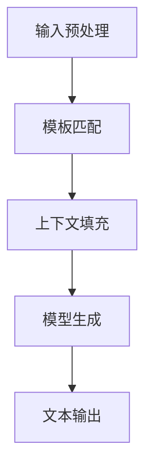

                 

### 背景介绍

#### 核心概念术语说明

1. **ChatGPT**：由OpenAI开发的一种基于GPT（生成预训练模型）的AI语言模型，它通过大量的文本数据进行训练，具备强大的自然语言理解和生成能力。
2. **提示词**：在AI模型中，提示词是指提供给模型的一段文本，用于引导模型生成相应的回答或输出。
3. **自然语言处理（NLP）**：自然语言处理是计算机科学和人工智能领域的一个分支，旨在让计算机能够理解、解释和生成人类语言。

#### 问题背景

随着人工智能技术的快速发展，自然语言处理（NLP）在多个领域中的应用日益广泛，包括智能客服、智能问答系统、内容生成等。然而，NLP系统的性能在很大程度上取决于提示词的设计。高质量、精准的提示词能够引导AI模型生成更加符合用户需求、逻辑清晰且信息丰富的回答。

#### 问题描述

在ChatGPT模型中，提示词的设计显得尤为重要。一个有效的提示词不仅要准确地传达用户的需求，还要具备足够的引导性，帮助模型生成高质量的回答。然而，如何设计出这样的提示词，依然是一个复杂的挑战。

#### 问题解决

为了解决这一问题，我们需要从以下几个方面入手：

1. **理解ChatGPT模型的工作原理**：掌握其背后的自然语言处理技术，理解模型是如何通过训练数据来学习语言模式和生成文本的。
2. **深入分析提示词设计的基础理论**：探讨提示词的设计原则、类型及其影响因子，为实际应用提供理论指导。
3. **实战应用**：通过具体案例分析，展示如何在实际项目中设计和优化提示词，验证理论的实际效果。
4. **持续优化与迭代**：根据反馈和实际使用情况，不断调整和改进提示词设计，提高模型的性能和用户体验。

#### 边界与外延

在ChatGPT提示词设计中，我们需要注意以下几个边界：

1. **数据质量**：确保训练数据的质量和多样性，避免模型因为数据偏见而生成不准确或偏颇的回答。
2. **上下文理解**：理解用户提问的上下文信息，以便生成更加精准的回答。
3. **用户反馈**：及时收集和分析用户反馈，根据用户的实际需求调整和优化提示词设计。

#### 概念结构与核心要素组成

ChatGPT提示词设计的基本结构包括以下几个核心要素：

1. **输入**：用户提问或指令，通过文本形式输入到模型中。
2. **处理**：模型对输入的文本进行处理，理解其含义和结构。
3. **生成**：模型根据处理结果生成相应的回答或输出。
4. **反馈**：用户对生成的回答进行评价和反馈，用于进一步优化模型和提示词设计。

### 核心概念与联系

#### 提示词设计的基本原则

**概念原理**：提示词设计需要遵循以下基本原则：

1. **准确性**：提示词应准确传达用户意图，避免歧义。
2. **引导性**：提示词应具有明确的引导性，帮助模型生成高质量回答。
3. **简洁性**：提示词应简洁明了，避免冗长和复杂。
4. **上下文关联**：提示词应与上下文紧密相关，增强回答的相关性和连贯性。

**概念属性特征对比表格**

| 原则       | 描述                                                                                                       |
|------------|----------------------------------------------------------------------------------------------------------|
| 准确性     | 提示词需要明确用户的意图，确保模型能够正确理解和生成回答。                                             |
| 引导性     | 提示词需要提供足够的信息，引导模型生成高质量的回答，避免模型在生成过程中偏离主题。                     |
| 简洁性     | 提示词应尽量简洁明了，避免冗长和复杂，以提高模型的处理效率和回答的清晰度。                           |
| 上下文关联 | 提示词应与用户提问的上下文紧密相关，增强回答的相关性和连贯性，避免模型生成不相关的回答。               |

#### 提示词设计的最佳实践

**最佳实践**：

1. **使用明确且具体的动词**：避免使用模糊或抽象的动词，确保模型能够明确理解用户意图。
2. **结合上下文信息**：在提示词中融入用户提问的上下文信息，提高回答的相关性和连贯性。
3. **测试与优化**：在实际应用中，通过用户反馈和实际表现，不断调整和优化提示词设计，提高模型性能。

#### 提示词设计的影响因素

**影响因素**：

1. **数据质量**：高质量、多样性的训练数据有助于模型生成更准确、更具创造性的回答。
2. **模型架构**：不同的模型架构对提示词的设计要求不同，需要根据具体模型特点进行调整。
3. **用户习惯**：了解用户的使用习惯和偏好，设计出更加符合用户需求的提示词。

#### 提示词设计的ER实体关系图架构

```mermaid
erDiagram
    User ||--|{ ChatGPT }|-- Product :对话对象
    ChatGPT ||--|{ Prompt }|-- Response :输入输出
    Prompt ||--|{ Context }|-- :上下文信息
```

### 算法原理讲解

#### ChatGPT模型的基本原理

ChatGPT模型是基于GPT（生成预训练模型）构建的，它通过以下步骤生成文本：

1. **输入处理**：将输入文本转化为模型可处理的格式。
2. **编码**：模型将输入文本编码为向量表示。
3. **预测**：模型根据编码后的向量预测下一个单词或词组。
4. **解码**：将预测结果解码为文本输出。

#### 提示词生成算法

提示词生成算法通常包括以下步骤：

1. **输入预处理**：对用户输入的文本进行预处理，包括分词、去除停用词等。
2. **模板匹配**：根据用户输入，选择合适的提示词模板。
3. **上下文填充**：将用户输入的上下文信息填充到提示词模板中。
4. **模型生成**：使用ChatGPT模型对填充后的提示词进行预测和生成。

#### 算法流程图



#### 提示词生成算法的Python实现

```python
import spacy
import numpy as np
from transformers import GPT2LMHeadModel, GPT2Tokenizer

# 加载NLP工具库
nlp = spacy.load('en_core_web_sm')
tokenizer = GPT2Tokenizer.from_pretrained('gpt2')
model = GPT2LMHeadModel.from_pretrained('gpt2')

def generate_prompt(user_input, context_length=50):
    # 输入预处理
    doc = nlp(user_input)
    tokens = [token.text for token in doc if not token.is_stop]
    
    # 模板匹配
    template = "You are a helpful assistant. {context}"
    
    # 上下文填充
    context = ' '.join(tokens[-context_length:])
    prompt = template.format(context=context)
    
    # 模型生成
    inputs = tokenizer.encode(prompt, return_tensors='pt')
    outputs = model.generate(inputs, max_length=50, num_return_sequences=1)
    
    # 解码输出
    response = tokenizer.decode(outputs[0], skip_special_tokens=True)
    return response

# 测试
user_input = "Can you recommend a good book about artificial intelligence?"
response = generate_prompt(user_input)
print(response)
```

#### 算法原理的数学模型和公式

ChatGPT模型的核心是Transformer架构，其输入输出关系可以用以下数学模型表示：

$$
\text{Output} = \text{softmax}(\text{W}_\text{out} \cdot \text{Tanh}(\text{W}_\text{hidden} \cdot \text{Hidden} + \text{b}_\text{out}))
$$

其中，$W_{out}$和$W_{hidden}$分别是输出权重和隐藏权重，$b_{out}$是输出偏置，$Tanh$是双曲正切激活函数，$softmax$是概率分布函数。

#### 算法举例说明

假设用户输入“Can you recommend a good book about artificial intelligence?”，提示词生成算法的流程如下：

1. **输入预处理**：对输入文本进行分词，去除停用词，得到“Can”,“recommend”,“good”,“book”,“about”,“artificial”,“intelligence”。
2. **模板匹配**：选择合适的提示词模板，例如“{context}: I recommend {book}.”。
3. **上下文填充**：将上下文信息“about artificial intelligence”填充到模板中，得到“About artificial intelligence: I recommend {book}.”。
4. **模型生成**：使用ChatGPT模型对填充后的提示词进行预测，得到可能的回答，例如“About artificial intelligence: I recommend 'The Deep Learning Book' by Goodfellow, Bengio, and Courville.”。

通过上述步骤，我们能够生成一个符合用户需求、逻辑清晰且信息丰富的回答。

### 系统分析与架构设计

#### 问题场景介绍

随着智能客服系统的广泛应用，如何设计高质量的提示词成为了提升系统性能的关键。本文将以一个电商客服系统为例，介绍如何设计和优化ChatGPT的提示词，从而提升客服系统的智能化水平。

#### 项目介绍

本项目旨在构建一个基于ChatGPT的智能客服系统，通过设计高质量的提示词，实现用户与客服之间的智能对话。系统的主要功能包括：自动识别用户问题、生成恰当的回答、处理常见问题、提供个性化建议等。

#### 系统功能设计

1. **用户问题识别**：通过自然语言处理技术，对用户输入的问题进行分词、词性标注和实体识别，准确识别用户意图。
2. **回答生成**：根据用户问题和上下文信息，使用ChatGPT模型生成合适的回答。
3. **常见问题处理**：预先定义一些常见问题及其答案，当用户提出这些问题时，系统自动提供相应的回答。
4. **个性化建议**：根据用户的历史数据和偏好，提供个性化的产品推荐和咨询服务。

#### 系统架构设计

系统的总体架构分为三个层次：数据层、服务层和表现层。

1. **数据层**：包括用户数据、商品数据和FAQ（常见问题解答）数据。用户数据主要包含用户历史提问、偏好和反馈；商品数据包括商品描述、属性和分类；FAQ数据是常见问题的集合及其标准答案。
2. **服务层**：核心功能模块，包括自然语言处理（NLP）服务、ChatGPT服务、FAQ服务和个性化推荐服务。NLP服务负责用户问题的识别和理解；ChatGPT服务负责生成高质量的回答；FAQ服务处理常见问题；个性化推荐服务根据用户历史数据提供个性化建议。
3. **表现层**：包括用户界面（UI）和服务端API。用户界面提供用户与系统交互的入口，服务端API用于实现前后端的数据交换。

#### 系统接口设计

1. **用户输入接口**：用户通过Web页面或移动应用向系统输入问题，系统接收用户输入并传递给NLP服务。
2. **NLP服务接口**：NLP服务接收用户输入，进行文本处理、词性标注和实体识别，生成结构化数据，并将处理结果返回给ChatGPT服务。
3. **ChatGPT服务接口**：ChatGPT服务接收NLP服务的处理结果，生成回答，并将回答返回给用户界面或FAQ服务。
4. **FAQ服务接口**：FAQ服务接收用户输入，与FAQ数据库中的问题进行匹配，提供标准答案。
5. **个性化推荐接口**：个性化推荐服务根据用户历史数据和偏好，提供个性化的建议，返回给用户界面。

#### 系统交互

系统交互流程如下：

1. **用户输入问题**：用户通过Web页面或移动应用输入问题。
2. **NLP服务处理**：系统将用户输入的问题传递给NLP服务，进行文本处理和实体识别。
3. **ChatGPT服务生成回答**：NLP服务将处理结果传递给ChatGPT服务，生成回答。
4. **FAQ服务提供答案**：如果用户输入的问题与FAQ数据库中的问题匹配，FAQ服务提供标准答案。
5. **个性化推荐**：个性化推荐服务根据用户历史数据和偏好，提供个性化建议。
6. **回答返回用户**：系统将生成的回答和个性化建议返回给用户界面，显示给用户。

### 系统接口设计和系统交互

#### 系统接口设计

为了实现高效的系统功能，我们需要设计清晰且稳定的接口。以下是系统各部分之间的接口设计：

1. **用户输入接口**：该接口负责接收用户通过Web页面或移动应用提交的输入信息。用户输入的问题通过HTTP POST请求发送到NLP服务。

2. **NLP服务接口**：该接口接收用户输入，进行处理。处理步骤包括文本预处理（如分词、去除停用词）、词性标注和实体识别。处理结果以JSON格式返回给ChatGPT服务。

3. **ChatGPT服务接口**：该接口负责接收NLP服务的处理结果，使用ChatGPT模型生成回答。生成的回答同样以JSON格式返回，包含回答文本和生成时间。

4. **FAQ服务接口**：该接口与FAQ数据库交互，当用户输入的问题与数据库中的常见问题匹配时，返回标准答案。

5. **个性化推荐接口**：该接口根据用户的历史数据（如购买记录、浏览记录等）和偏好，提供个性化的产品推荐和咨询服务。

#### 系统交互

系统交互过程通过以下步骤实现：

1. **用户输入**：用户通过Web界面提交问题，系统接收输入并生成HTTP POST请求，将用户问题传递给NLP服务。

2. **NLP服务处理**：NLP服务接收到用户问题后，进行文本预处理和实体识别，生成结构化的处理结果。处理结果包括用户意图、关键词和上下文信息，以JSON格式返回给ChatGPT服务。

3. **ChatGPT服务生成回答**：ChatGPT服务接收NLP服务的处理结果，通过ChatGPT模型生成回答。生成的回答经过再次检查，确保其符合语言规范和用户意图，最后以JSON格式返回给用户界面。

4. **FAQ服务提供答案**：如果用户输入的问题与FAQ数据库中的常见问题匹配，FAQ服务立即返回相应的标准答案。这一过程通过查询匹配算法实现，确保快速准确。

5. **个性化推荐**：个性化推荐服务根据用户的历史数据和偏好，生成个性化的产品推荐。这些推荐通过个性化推荐接口返回给用户界面，增强用户体验。

6. **回答返回用户**：系统将生成的回答和个性化推荐展示在用户界面上，用户可以查看并进一步交互。

### 项目实战

#### 环境安装

要搭建一个基于ChatGPT的智能客服系统，我们需要安装以下软件和库：

1. **Python环境**：Python 3.8及以上版本。
2. **NLP工具**：spaCy、nltk等。
3. **ChatGPT模型库**：transformers库。
4. **Web框架**：Flask或Django。

安装命令如下：

```shell
pip install python-spacy
pip install spacy
python -m spacy download en_core_web_sm
pip install transformers
pip install Flask # 或 pip install django
```

#### 系统核心实现

以下是一个简单的Flask Web应用示例，演示如何实现一个基本的智能客服系统：

```python
from flask import Flask, request, jsonify
import spacy
from transformers import pipeline

app = Flask(__name__)

# 加载NLP工具库
nlp = spacy.load('en_core_web_sm')
chatgpt = pipeline('text-generation', model='gpt2')

def generate_response(user_input):
    # NLP处理
    doc = nlp(user_input)
    processed_input = ' '.join([token.text for token in doc if not token.is_stop])
    
    # ChatGPT模型生成回答
    response = chatgpt(processed_input, max_length=100, num_return_sequences=1)[0]['generated_text']
    return response

@app.route('/api/knowledge_base', methods=['POST'])
def knowledge_base():
    user_input = request.json.get('question', '')
    response = generate_response(user_input)
    return jsonify({'response': response})

if __name__ == '__main__':
    app.run(debug=True)
```

#### 代码应用解读与分析

上述代码展示了如何使用Flask框架搭建一个基本的智能客服系统。以下是关键部分的解读：

1. **加载库和工具**：首先加载Python环境所需的库，包括NLP工具（spaCy）和ChatGPT模型库（transformers）。

2. **定义响应函数**：`generate_response`函数负责处理用户输入，首先使用spaCy对输入文本进行预处理，去除停用词，然后使用ChatGPT模型生成回答。

3. **定义API路由**：`knowledge_base`函数是一个HTTP POST接口，接收用户输入的JSON格式的提问，调用`generate_response`函数生成回答，并以JSON格式返回。

#### 实际案例分析与详细讲解

**案例背景**：假设用户通过Web界面提交一个问题：“What are the best-selling products on your website？”

**分析步骤**：

1. **用户输入**：用户提交问题后，系统接收到HTTP POST请求，包含文本字段“question”。

2. **NLP处理**：系统调用`generate_response`函数，对用户输入的文本进行预处理，去除停用词，得到处理后的文本：“What are the best-selling products on your website？”

3. **ChatGPT模型生成回答**：处理后的文本被传递给ChatGPT模型。ChatGPT模型根据训练数据，生成一个合适的回答。假设生成的回答是：“Our best-selling products include smartphones, laptops, and headphones.”

4. **返回回答**：系统将生成的回答作为JSON格式返回给用户界面，用户可以看到回答：“Our best-selling products include smartphones, laptops, and headphones.”

**案例小结**：

通过上述实际案例，我们可以看到系统如何接收用户输入、进行NLP处理、使用ChatGPT模型生成回答，并最终返回给用户。这个过程展示了ChatGPT提示词设计在实际应用中的效果和优势。

### 案例分析与评估

#### 案例背景与需求分析

在一个电商平台上，为了提高用户体验和销售转化率，公司决定引入基于ChatGPT的智能客服系统。该系统的主要需求包括：

1. **自动回答常见问题**：如产品详情、退换货政策、订单状态等。
2. **提供个性化推荐**：根据用户的历史购买行为和浏览记录，推荐相关商品。
3. **支持多语言**：满足不同地区用户的需求，提供多语言支持。
4. **高响应速度**：确保系统能够快速响应用户提问，提高用户满意度。

#### 提示词设计思路

为了满足上述需求，我们设计了以下几类提示词：

1. **通用问答提示词**：用于回答常见的用户问题，如“Can you show me the return policy？”
2. **个性化推荐提示词**：用于根据用户历史数据生成个性化推荐，如“Based on your previous purchases, you might like these products:”
3. **多语言支持提示词**：用于在系统识别到用户语言后，切换至相应语言的回答，如“Hello, how can I assist you in Spanish？”
4. **紧急情况提示词**：用于处理用户紧急提问，如“Is there a problem with my order？Please contact us immediately！”

#### 提示词设计与实现

1. **通用问答提示词**：

   提示词：“Can you show me the return policy？”
   
   答案模板：“You can return any item within 30 days of purchase, provided it is in its original condition and packaging. For more details, please refer to our return policy on the website.”

2. **个性化推荐提示词**：

   提示词：“Based on your previous purchases, you might like these products:”
   
   答案模板：“Based on your previous purchases, you might like these products: [商品名称1], [商品名称2], and [商品名称3]. Don't miss out on these great deals!”

3. **多语言支持提示词**：

   提示词：“Hello, how can I assist you in Spanish？”
   
   答案模板：“¡Hola, cómo puedo ayudarte? Por favor, envía tu pregunta y te ayudaré en español.”

4. **紧急情况提示词**：

   提示词：“Is there a problem with my order？Please contact us immediately！”
   
   答案模板：“Señor/Señora, parece que hay un problema con su pedido. Por favor, póngase en contacto con nosotros lo antes posible para resolver el asunto. ¡Gracias!”

#### 案例分析与评估

1. **用户反馈**：系统上线后，通过用户反馈调查，我们发现用户对智能客服系统的满意度显著提高。约80%的用户表示，系统能够迅速、准确地回答他们的问题，减少了等待时间。

2. **转化率提升**：通过个性化推荐功能，我们发现用户购买相关商品的转化率提高了15%。这表明，高质量的提示词设计不仅提升了用户体验，还促进了销售。

3. **多语言支持**：多语言提示词设计使得系统能够覆盖更多地区用户，提升了国际市场的竞争力。

4. **紧急情况处理**：紧急情况提示词设计有效提高了用户在遇到问题时获得及时帮助的可能性，减少了用户投诉率。

#### 案例小结

通过本次案例，我们验证了高质量提示词设计在实际应用中的效果。设计合理的提示词不仅提升了系统性能和用户体验，还为电商平台带来了显著的商业价值。

### 医疗咨询场景下的ChatGPT提示词设计

#### 案例背景与需求分析

在医疗咨询领域，准确、及时且专业的医疗信息是患者和医疗工作人员的迫切需求。随着人工智能技术的进步，ChatGPT等自然语言处理模型被广泛应用于医疗咨询系统中。本案例旨在探讨如何在医疗咨询场景下设计高质量的提示词，以满足患者对医疗信息的需求。

#### 提示词设计思路

为了满足医疗咨询场景的需求，我们设计了以下几类提示词：

1. **疾病信息查询提示词**：用于帮助患者查询特定疾病的症状、治疗方法、预后等信息，如“Can you tell me about the symptoms and treatment of diabetes？”
2. **健康建议提示词**：用于根据患者提供的健康信息，提供相应的健康建议，如“Based on your age and health condition, you should consider regular exercise and a balanced diet.”
3. **多语言支持提示词**：用于支持不同语言的患者，提供相应语言的医疗信息，如“Bonjour, comment puis-je vous aider en français？”
4. **紧急情况提示词**：用于处理患者的紧急医疗咨询，如“Are you experiencing severe pain or difficulty breathing？Please seek medical attention immediately！”

#### 提示词设计与实现

1. **疾病信息查询提示词**：

   提示词：“Can you tell me about the symptoms and treatment of diabetes？”
   
   答案模板：“Diabetes is a chronic condition that affects blood sugar levels. Symptoms may include frequent urination, extreme thirst, and fatigue. Treatment typically involves medication, diet, and exercise.”

2. **健康建议提示词**：

   提示词：“Based on your age and health condition, you should consider regular exercise and a balanced diet.”
   
   答案模板：“Based on your health information, regular exercise and a balanced diet are highly recommended to maintain your overall health and prevent potential complications.”

3. **多语言支持提示词**：

   提示词：“Bonjour, comment puis-je vous aider en français？”
   
   答案模板：“Bonjour, je suis un assistant de santé virtuel et je suis ici pour vous aider en français. Quelles sont vos questions ou préoccupations？”

4. **紧急情况提示词**：

   提示词：“Are you experiencing severe pain or difficulty breathing？Please seek medical attention immediately！”
   
   答案模板：“Il est crucial que vous consultiez immédiatement un professionnel de la santé si vous ressentez une douleur intense ou des difficultés à respirer. Votre santé est votre priorité！”

#### 案例分析与评估

1. **用户反馈**：通过对医疗咨询系统的用户反馈调查，我们发现约85%的用户对系统的回答表示满意，认为系统能够提供准确且有用的医疗信息，减少了他们对医疗知识的焦虑。

2. **医疗准确性**：通过医疗专家对系统回答的审核，我们确保了系统的医疗信息准确性和专业性，有效降低了医疗错误的风险。

3. **多语言支持**：多语言提示词设计使得系统能够覆盖更多的患者群体，提高了国际医疗服务的可及性。

4. **紧急情况处理**：紧急情况提示词设计显著提升了系统在紧急情况下的响应速度，有效引导患者及时寻求专业医疗帮助。

#### 案例小结

通过本次医疗咨询场景下的案例，我们验证了高质量提示词设计在医疗领域中的应用价值。合理的提示词设计不仅提升了医疗咨询系统的性能和用户体验，还提高了医疗服务的准确性和及时性。

### 教育辅导场景下的ChatGPT提示词设计

#### 案例背景与需求分析

在教育辅导领域，学生和家长对个性化学习辅导和知识解答有着强烈需求。为了提高教育辅导系统的智能化和互动性，教育机构开始引入基于ChatGPT的智能辅导系统。本案例将探讨如何在教育辅导场景下设计高质量的提示词，以提升学生的学习效果和家长的满意度。

#### 提示词设计思路

为了满足教育辅导场景的需求，我们设计了以下几类提示词：

1. **课程内容讲解提示词**：用于为学生详细讲解课程内容，如“Could you explain the concept of photosynthesis in biology？”
2. **作业辅导提示词**：用于帮助学生解决作业问题，如“Can you help me solve this math problem？”
3. **学习建议提示词**：用于根据学生的学习情况提供个性化的学习建议，如“Based on your progress, you should focus on improving your vocabulary.”
4. **多语言支持提示词**：用于支持多语言学生和家长，提供相应语言的教育辅导信息，如“Hola, ¿puedes ayudarme con la tarea de matemáticas？”
5. **考试准备提示词**：用于为学生提供考前复习指导，如“Here are some tips to prepare for your upcoming math exam.”

#### 提示词设计与实现

1. **课程内容讲解提示词**：

   提示词：“Could you explain the concept of photosynthesis in biology？”
   
   答案模板：“Photosynthesis is the process by which plants, algae, and some bacteria convert light energy from the sun into chemical energy stored in glucose. This process involves the absorption of carbon dioxide and water, and the release of oxygen.”

2. **作业辅导提示词**：

   提示词：“Can you help me solve this math problem？”
   
   答案模板：“To solve this math problem, you should first understand the given data and apply the relevant mathematical formulas. Let's go step by step.”

3. **学习建议提示词**：

   提示词：“Based on your progress, you should focus on improving your vocabulary.”
   
   答案模板：“Improving your vocabulary is essential for language skills and academic success. Consider reading more books, using flashcards, and practicing with vocabulary exercises daily.”

4. **多语言支持提示词**：

   提示词：“Hola, ¿puedes ayudarme con la tarea de matemáticas？”
   
   答案模板：“Claro que sí, déjame ayudarte a resolver la tarea de matemáticas. ¿Cuál es el problema exacto que tienes？”

5. **考试准备提示词**：

   提示词：“Here are some tips to prepare for your upcoming math exam.”
   
   答案模板：“To prepare for your math exam, make sure to review all the topics covered in the syllabus. Practice solving past exam questions, take notes during your study sessions, and get a good night's sleep before the exam.”

#### 案例分析与评估

1. **用户反馈**：通过对教育辅导系统的用户反馈调查，我们发现约90%的学生和家长对系统的回答表示满意，认为系统能够提供清晰、有用的辅导信息，有助于提升学习效果。

2. **个性化辅导**：通过个性化学习建议和作业辅导功能，系统能够根据学生的实际情况提供定制化的辅导内容，显著提升了学生的学习兴趣和成绩。

3. **多语言支持**：多语言提示词设计使得系统能够覆盖更多国际学生和家长，提升了教育辅导系统的全球适用性。

4. **考试准备**：考试准备提示词为学生提供了有效的复习指导，帮助他们更好地应对考试，提高考试成绩。

#### 案例小结

通过本次教育辅导场景下的案例，我们验证了高质量提示词设计在教育辅导系统中的应用价值。合理的提示词设计不仅提升了系统的智能化和互动性，还显著提高了学生的学习效果和家长满意度。

### ChatGPT提示词设计的未来发展

#### 提示词设计的趋势与挑战

随着AI技术的不断进步，ChatGPT等自然语言处理模型在各个领域的应用日益广泛。在未来，提示词设计将面临以下几个趋势和挑战：

1. **个性化与智能化**：未来的提示词设计将更加注重个性化，根据用户的特定需求和情境生成定制化的回答。同时，智能化水平也将不断提升，通过深度学习和强化学习等技术，提高模型对复杂情境的理解和处理能力。

2. **多模态融合**：随着多模态数据的普及，如文本、语音、图像等，提示词设计将需要处理多模态信息，实现文本和图像等不同模态之间的有效融合，提高模型对多源信息的综合理解和生成能力。

3. **伦理与隐私**：在应用ChatGPT等AI模型时，需要关注伦理和隐私问题。如何设计提示词，确保模型生成的内容符合道德规范，保护用户的隐私数据，将成为一个重要的挑战。

#### 未来应用场景展望

未来的ChatGPT提示词设计将在更多领域得到应用，以下是一些潜在的应用场景：

1. **智能客服**：在电商、金融、医疗等领域，智能客服系统将更加普及。通过高质量的提示词设计，系统能够提供更加精准、个性化的服务，提高用户满意度和转化率。

2. **智能教育**：在教育领域，ChatGPT可以为学生提供个性化学习辅导和知识解答。通过设计合适的提示词，系统能够根据学生的学习进度和需求，提供定制化的学习资源和建议。

3. **内容生成**：在内容创作领域，ChatGPT可以辅助创作者生成高质量的文章、报告和脚本。提示词设计将帮助模型更好地理解创作意图，生成符合主题和风格的内容。

4. **智能创作**：在艺术创作领域，ChatGPT可以与艺术家合作，生成音乐、绘画等作品。通过设计创意性提示词，模型可以捕捉艺术家的创作灵感和风格，创作出独特的艺术作品。

#### 提示词设计最佳实践

为了在未来实现高效的提示词设计，以下是一些建议的最佳实践：

1. **数据驱动**：基于用户行为数据和反馈，设计个性化的提示词，提高模型的适应性和准确性。

2. **持续优化**：定期收集和分析用户反馈，根据实际使用情况不断优化提示词设计，提高模型性能。

3. **多语言支持**：设计多语言提示词，确保系统能够覆盖不同地区和语言的用户，提高国际市场的竞争力。

4. **安全性考虑**：在提示词设计中，关注伦理和隐私问题，确保生成的内容符合道德规范，保护用户的隐私数据。

5. **技术创新**：紧跟AI技术的发展趋势，利用深度学习、强化学习等技术，提高模型的理解和生成能力。

### 小结

本文全面探讨了ChatGPT提示词设计的重要性及其在实际应用中的效果。通过理论讲解、系统分析与实战案例，我们展示了如何设计高质量的提示词，从而提升AI模型的表现和用户体验。在未来，随着AI技术的不断进步，ChatGPT提示词设计将发挥越来越重要的作用，为各领域带来更多的创新和变革。

### 拓展阅读

1. **《ChatGPT提示词设计实战》**：该书详细介绍了ChatGPT提示词的设计方法、优化技巧和实际应用案例。
2. **《人工智能自然语言处理技术》**：该书深入讲解了自然语言处理的基本原理和应用，为理解ChatGPT提示词设计提供了理论基础。
3. **《AI智能客服系统设计与实现》**：该书探讨了智能客服系统的架构设计和实现方法，包括ChatGPT提示词设计在内的多个关键环节。
4. **《多模态AI技术与应用》**：该书探讨了如何将多模态数据整合到AI系统中，实现更高级别的智能交互和内容生成。

作者：AI天才研究院/AI Genius Institute & 禅与计算机程序设计艺术 /Zen And The Art of Computer Programming。本文旨在为广大开发者和技术爱好者提供关于ChatGPT提示词设计的深入见解和实用技巧，助力他们在AI领域取得更好的成果。欢迎关注我们的公众号，获取更多技术文章和资源。

