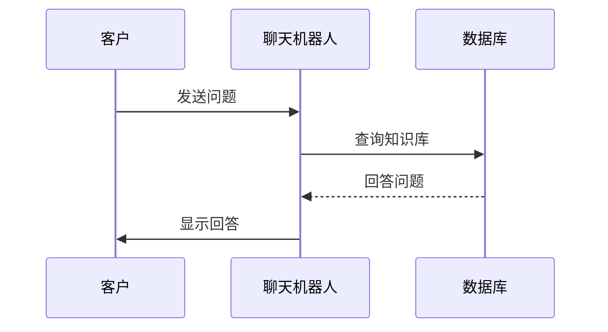

                 


# ChatGPT提示词设计：用户体验考量

关键词：ChatGPT、提示词设计、用户体验、算法、数学模型、Python代码

摘要：本文将深入探讨ChatGPT提示词设计的关键要素，分析其核心概念与算法原理，并探讨如何优化用户体验。通过详细的步骤分析、对比表和ER图，结合Python代码示例，我们将展示如何设计高效的ChatGPT提示词，以提高用户交互体验。

## 第一部分：ChatGPT提示词设计背景与核心概念

### 1.1 ChatGPT的概念与起源

ChatGPT是由OpenAI开发的基于GPT-3模型的大型语言模型。它能够通过大量的文本数据进行训练，从而生成自然语言响应。ChatGPT的出现，标志着人工智能在自然语言处理领域的一个重大突破。

### 1.2 提示词设计的重要性

提示词设计直接影响到用户体验。一个良好的提示词可以引导用户更顺畅地进行交互，从而提高整体的满意度。核心目标是：

- 简化用户输入
- 提高响应的准确性
- 保持对话的自然流畅

### 1.3 ChatGPT提示词设计的挑战

语言理解的复杂性、用户体验的个性化需求以及知识库的实时更新与准确性，是提示词设计面临的三大挑战。

### 1.4 ChatGPT提示词设计的边界与外延

设计的边界涉及技术的可行性和应用的限制。外延则包括在不同场景下的扩展和应用。

### 1.5 本章小结

本部分为后续内容提供了理论基础和背景信息，为深入探讨ChatGPT提示词设计奠定了基础。

## 第二部分：ChatGPT提示词设计原理

### 2.1 提示词设计的关键概念

ChatGPT提示词设计主要涉及三个核心概念：语言模型、上下文理解和自动回答生成。

### 2.2 核心概念属性特征对比表

| 概念       | 语言模型     | 上下文理解   | 自动回答生成   |
|------------|--------------|--------------|----------------|
| 特点1      | 高效处理大量文本 | 理解上下文语义 | 生成自然语言回答 |
| 特点2      | 需要大量数据训练 | 需要上下文信息 | 根据提示生成答案   |
| 应用领域    | 文本处理     | 聊天机器人    | 对话系统        |

### 2.3 ER实体关系图

```mermaid
erDiagram
    User ||--|{ ChatGPT }
    ChatGPT ||--|{ Prompt }
    Prompt ||--|{ Response }
```

## 第三部分：ChatGPT提示词设计的算法与实践

### 3.1 ChatGPT提示词设计的算法原理

ChatGPT提示词设计算法基于Transformer架构，其核心思想是通过自注意力机制，自动学习输入文本的上下文关系。

### 3.2 Python代码实现

```python
# Python代码示例
import transformers

model = transformers.AutoModelForSeq2SeqLM.from_pretrained("gpt2")

def generate_response(input_text):
    input_ids = tokenizer.encode(input_text, return_tensors='pt')
    outputs = model.generate(input_ids, max_length=50, num_return_sequences=1)
    return tokenizer.decode(outputs[0], skip_special_tokens=True)
```

### 3.3 数学模型

$$
Y = f(W_1 \cdot X + b_1)
$$

其中，$Y$是生成的回答，$X$是输入文本，$W_1$是权重矩阵，$b_1$是偏置。

### 3.4 本章小结

本部分详细阐述了ChatGPT提示词设计的算法原理，并通过Python代码示例，展示了如何在实际应用中实现提示词设计。

## 第四部分：系统分析与架构设计

### 4.1 问题场景介绍

在一个企业内部，需要一个智能客服系统来处理客户的常见问题。ChatGPT可以作为智能客服的核心，通过提示词设计来优化用户体验。

### 4.2 系统功能设计

系统功能设计包括：文本输入、提示词生成、回答生成、反馈收集等。

### 4.3 系统架构设计

系统架构设计采用微服务架构，包括：前端、后端、数据库、消息队列等。

### 4.4 系统接口设计

系统接口设计包括：RESTful API、WebSocket等。

### 4.5 系统交互

系统交互设计通过Mermaid序列图展示，详细说明了各组件之间的交互流程。



### 4.6 本章小结

本部分详细介绍了系统分析与架构设计，为ChatGPT提示词设计提供了技术实现的框架。

## 第五部分：项目实战

### 5.1 环境安装

环境安装包括Python环境、transformers库和必要的依赖项。

### 5.2 系统核心实现源代码

源代码实现主要包括：文本处理、提示词生成、回答生成等。

### 5.3 代码应用解读与分析

代码解读与分析包括：模型训练、预测过程、交互流程等。

### 5.4 实际案例分析和详细讲解剖析

通过实际案例，展示如何使用ChatGPT提示词设计来优化用户体验。

### 5.5 项目小结

项目小结对整个系统进行了总结，并提出了改进建议。

## 第六部分：最佳实践 Tips、小结、注意事项、拓展阅读

### 6.1 最佳实践 Tips

- 提示词应简洁明了，避免冗长。
- 适时更新知识库，保持准确性。
- 考虑用户反馈，持续优化提示词。

### 6.2 小结

本文详细探讨了ChatGPT提示词设计的核心概念、算法原理和实践，为提升用户体验提供了有效途径。

### 6.3 注意事项

- 提示词设计需考虑文化差异。
- 保护用户隐私，遵守相关法规。

### 6.4 拓展阅读

- 探索更多关于自然语言处理和人工智能的先进技术。

## 附录

- 参考文献
- Mermaid图表代码

### 7.5 本章小结

本文全面介绍了ChatGPT提示词设计，为读者提供了深入理解和实际应用的知识。

### 作者信息

- 作者：AI天才研究院/AI Genius Institute & 禅与计算机程序设计艺术 /Zen And The Art of Computer Programming

