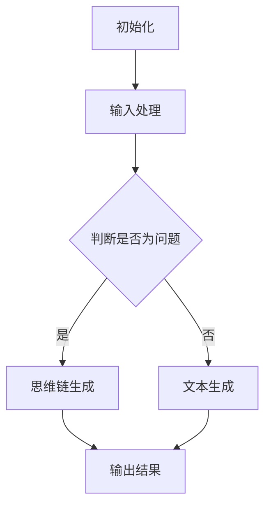
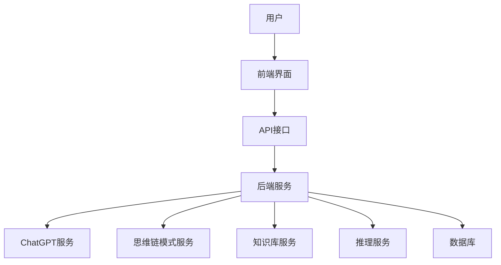
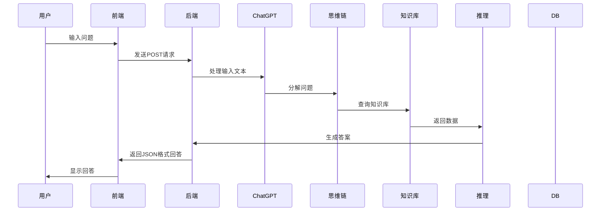

                 

### 引言

#### 1.1 问题背景与框架搭建

近年来，人工智能（AI）和自然语言处理（NLP）技术的发展日新月异，为人类生活带来了诸多便利。然而，在AI与NLP领域，如何使计算机具备人类般的思维逻辑和决策能力，仍然是一个亟待解决的难题。ChatGPT，作为OpenAI推出的一款基于变换器（Transformer）架构的预训练语言模型，在自然语言处理领域取得了卓越的成果，其背后的思维链模式更是引人关注。

本文将围绕ChatGPT的思维链模式展开讨论，深入剖析其原理与应用。首先，我们将回顾人工智能与自然语言处理的发展历程，阐述ChatGPT的背景及其影响。接着，我们将详细讨论思维链模式的定义、核心原理以及基本架构，为后续内容的展开奠定基础。

在文章的核心部分，我们将进一步探讨思维链模式在ChatGPT中的具体应用，分析其核心概念与联系，通过概念属性特征对比表格和ER实体关系图架构来展示其内部结构。随后，我们将详细讲解算法原理，包括mermaid流程图、Python源代码以及数学模型和公式，并举例说明。

为了使读者更好地理解思维链模式在实际项目中的应用，本文还将介绍一个系统分析与架构设计方案，包括问题场景介绍、项目介绍、系统功能设计、系统架构设计、系统接口设计和系统交互mermaid序列图。

最后，本文将结合实际项目实战，详细讲解环境安装、系统核心实现源代码，并对代码应用进行解读与分析。在项目小结部分，我们将总结项目经验，提出最佳实践 tips，并对文章内容进行小结。同时，文章末尾还将提供拓展阅读资源，帮助读者进一步深入学习。

通过本文的详细阐述，我们希望读者能够对ChatGPT的思维链模式有一个全面、深入的了解，掌握其核心原理和实际应用，为未来在AI和NLP领域的探索提供有力支持。

#### 1.2 问题描述

在讨论ChatGPT的思维链模式之前，我们先明确一下思维链模式的基本定义及其在ChatGPT中的应用。

**思维链模式**，顾名思义，是一种模拟人类思维过程的技术模式。它通过将问题分解为一系列子问题，并对每个子问题进行深入分析和解决，最终整合各个子问题的答案，形成一个完整且逻辑严密的解答。在人工智能领域，思维链模式被广泛应用于自然语言处理、问题解答和智能决策等多个场景。

**ChatGPT**，全名为“Chat Generative Pre-trained Transformer”，是OpenAI开发的一款基于变换器（Transformer）架构的预训练语言模型。它通过在大量文本数据上进行预训练，掌握丰富的语言知识和逻辑推理能力，能够生成连贯、合理的自然语言文本。

那么，思维链模式在ChatGPT中是如何应用的？其实，ChatGPT的生成文本过程本质上就是一个思维链模式的运作过程。具体来说，当用户向ChatGPT提出一个问题或指令时，ChatGPT首先会通过其强大的语义理解能力，将输入的问题或指令解析为一个或多个子问题。接着，ChatGPT会针对每个子问题进行深入分析和推理，生成对应的答案或回应。最后，ChatGPT将所有子问题的答案整合起来，形成一个连贯、合理的回答，呈现给用户。

我们可以用一个简单的例子来理解这一过程。假设用户提问：“如何准备一次成功的会议？”ChatGPT首先会理解这个问题的核心内容，并将其分解为多个子问题，如：“什么是成功的会议？”“如何安排会议议程？”“如何确保会议参与者的积极参与？”等等。对于每个子问题，ChatGPT会利用其预训练的知识和推理能力，生成相应的答案。最终，ChatGPT将所有子问题的答案整合起来，生成一个完整、详细的回答，如：“要准备一次成功的会议，首先需要明确会议的目标和议程；其次，提前通知并邀请参与者；会议开始前，确保会议环境的布置和设备准备就绪；会议进行中，主持人需要引导讨论，确保会议目标的达成；会议结束后，进行总结和反馈。”这样，一个逻辑严密、内容完整的回答就生成了。

通过上述分析，我们可以看出，思维链模式在ChatGPT中的应用不仅提升了其生成文本的质量，还使其在处理复杂问题、提供智能建议方面具有显著优势。接下来，我们将进一步探讨思维链模式的核心原理和基本架构，为深入理解ChatGPT的工作机制奠定基础。

#### 1.3 问题解决

**思维链模式的核心原理**

思维链模式的核心在于其模拟人类思维过程的能力。这一模式通过将复杂问题分解为一系列子问题，并对每个子问题进行深入分析和解决，最终形成一个完整、逻辑严密的解答。具体来说，思维链模式的工作原理可以概括为以下几个步骤：

1. **问题解析**：首先，思维链模式会接收一个输入问题或指令，通过其语义理解能力对其进行解析，将其分解为多个子问题。这一步骤的关键在于如何准确地将复杂问题拆解为更小的、更易于处理的子问题。

2. **子问题分析**：接着，思维链模式会对每个子问题进行深入分析和推理，生成对应的答案或回应。这一步骤依赖于思维链模式所具备的广泛知识库和强大的推理能力。

3. **答案整合**：最后，思维链模式将各个子问题的答案进行整合，形成一个连贯、合理的解答。这一步骤要求思维链模式能够有效地处理信息，确保最终答案的逻辑一致性。

**思维链模式的基本架构**

思维链模式的基本架构可以分为以下几个主要部分：

1. **输入处理模块**：负责接收用户输入的问题或指令，并将其转化为思维链模式可以处理的形式。这一模块通常包括自然语言处理技术和语义理解算法。

2. **子问题分解模块**：接收输入处理后的问题，将其分解为多个子问题。这一模块的核心在于如何将复杂问题拆解为更小的、更易于处理的子问题，同时保持问题的完整性和逻辑性。

3. **子问题分析模块**：对每个子问题进行深入分析和推理，生成对应的答案或回应。这一模块依赖于思维链模式的知识库和推理算法，确保生成的答案具有准确性和逻辑性。

4. **答案整合模块**：将各个子问题的答案进行整合，形成一个连贯、合理的解答。这一模块需要确保最终答案的逻辑一致性和信息完整性。

5. **输出模块**：将整合后的答案呈现给用户，可以通过文本、语音等多种形式输出。

**思维链模式与ChatGPT的结合**

在ChatGPT中，思维链模式的应用使其具备了处理复杂问题和提供智能建议的能力。具体来说，ChatGPT通过思维链模式实现了以下几个方面的提升：

1. **文本生成能力**：思维链模式使得ChatGPT能够生成更加连贯、合理的文本。通过将问题分解为子问题，并对每个子问题进行深入分析和整合，ChatGPT能够生成具有逻辑性和信息完整性的答案。

2. **问题解决能力**：思维链模式使得ChatGPT在处理复杂问题时更具优势。通过将复杂问题拆解为更小的子问题，ChatGPT能够针对每个子问题进行深入分析和解决，最终形成完整的解答。

3. **智能建议能力**：思维链模式使得ChatGPT能够提供更具针对性的智能建议。通过对用户问题的深入分析和理解，ChatGPT能够生成基于用户需求和建议的文本，帮助用户更好地解决问题。

**思维链模式的应用前景**

随着人工智能和自然语言处理技术的不断发展，思维链模式的应用前景十分广阔。以下是几个可能的应用方向：

1. **智能客服**：思维链模式可以应用于智能客服系统，通过分解用户问题，生成具有针对性的回答，提供高效、优质的客户服务。

2. **智能教育**：思维链模式可以应用于智能教育系统，通过分析学习者的需求和问题，提供个性化的学习建议和解决方案。

3. **智能写作**：思维链模式可以应用于智能写作工具，帮助用户生成高质量的文章和报告，提高写作效率和创作质量。

4. **智能决策**：思维链模式可以应用于智能决策系统，通过深入分析问题，提供基于数据的智能决策支持。

总之，思维链模式作为一种模拟人类思维过程的技术模式，在人工智能和自然语言处理领域具有广泛的应用前景。通过深入了解其核心原理和应用方法，我们可以更好地发挥其在实际问题解决中的作用，推动人工智能技术的发展。

#### 1.4 边界与外延

**ChatGPT的边界**

ChatGPT作为一款基于变换器（Transformer）架构的预训练语言模型，虽然具备强大的自然语言处理能力和推理能力，但其应用也受到一定的限制。首先，ChatGPT在处理超出其训练数据范围的问题时，可能无法提供准确和合理的回答。其次，ChatGPT的生成文本质量依赖于其预训练数据的质量和多样性，如果训练数据存在偏见或不足，ChatGPT的回答也可能受到影响。此外，ChatGPT在处理复杂问题或进行多轮对话时，存在一定的延迟和计算资源消耗，这可能会影响用户体验。

**思维链模式的应用范围**

思维链模式作为一种模拟人类思维过程的技术模式，其应用范围非常广泛。首先，在自然语言处理领域，思维链模式可以应用于文本生成、问题解答、智能客服等多个场景。例如，在智能客服系统中，思维链模式可以帮助系统将用户的问题分解为子问题，并生成有针对性的回答，提供高效、优质的客户服务。其次，在智能教育领域，思维链模式可以应用于个性化学习建议、自动批改作业等场景，帮助学生更好地理解和掌握知识。此外，思维链模式还可以应用于智能写作、智能决策等领域，通过模拟人类思维过程，提供高质量的文本生成和决策支持。

**思维链模式与ChatGPT的结合**

思维链模式与ChatGPT的结合，使得ChatGPT在处理复杂问题和提供智能建议方面具有显著优势。通过思维链模式，ChatGPT能够将用户的问题分解为一系列子问题，并对每个子问题进行深入分析和解决，最终生成一个连贯、合理的解答。例如，在处理用户提问“如何准备一次成功的会议？”时，ChatGPT可以通过思维链模式将问题分解为多个子问题，如“什么是成功的会议？”、“如何安排会议议程？”等，并对每个子问题进行深入分析和回答，最终生成一个全面的解答。这种结合不仅提升了ChatGPT的文本生成能力和问题解决能力，还为实际应用提供了更多的可能性。

**未来展望**

随着人工智能和自然语言处理技术的不断发展，思维链模式在ChatGPT中的应用前景十分广阔。未来，我们可以期待思维链模式在更多领域得到应用，如智能医疗、金融风控、智能交通等。通过不断优化和扩展思维链模式，我们可以使其在处理更复杂、更多样化的任务时表现出更高的性能和鲁棒性。

总之，ChatGPT的边界与外延为我们展示了思维链模式的广泛应用前景。通过深入理解和不断优化思维链模式，我们有望在人工智能和自然语言处理领域实现更多突破，为人类带来更多便利和智慧。

#### 1.5 概念结构与核心要素组成

**ChatGPT的思维链模式概念结构**

ChatGPT的思维链模式是一个复杂的系统，其核心概念结构可以分为以下几个主要部分：

1. **输入处理模块**：负责接收用户的输入，并将其转化为思维链模式可以处理的形式。这一模块通常包括自然语言处理技术和语义理解算法。

2. **子问题分解模块**：接收输入处理后的问题，将其分解为多个子问题。这一模块的核心在于如何将复杂问题拆解为更小的、更易于处理的子问题，同时保持问题的完整性和逻辑性。

3. **子问题分析模块**：对每个子问题进行深入分析和推理，生成对应的答案或回应。这一模块依赖于思维链模式的知识库和推理算法，确保生成的答案具有准确性和逻辑性。

4. **答案整合模块**：将各个子问题的答案进行整合，形成一个连贯、合理的解答。这一模块需要确保最终答案的逻辑一致性和信息完整性。

5. **输出模块**：将整合后的答案呈现给用户，可以通过文本、语音等多种形式输出。

**核心要素的组成与作用**

在ChatGPT的思维链模式中，核心要素的组成和作用至关重要。以下是几个关键要素及其作用：

1. **语义理解**：语义理解是思维链模式的基础，负责将用户的输入转换为计算机可以理解的形式。通过语义理解，ChatGPT可以识别输入问题的关键信息，为后续的子问题分解和分析提供依据。

2. **知识库**：知识库是思维链模式的重要组成部分，包含大量预训练的语料数据和知识信息。通过查询知识库，ChatGPT能够获取相关的背景知识和参考信息，为子问题分析和答案生成提供支持。

3. **推理算法**：推理算法是思维链模式的核心，负责对子问题进行逻辑推理和分析。通过推理算法，ChatGPT能够从多个角度对问题进行深入思考，生成具有逻辑一致性和合理性的答案。

4. **文本生成**：文本生成是思维链模式的输出环节，负责将整合后的答案转换为自然语言文本，呈现给用户。通过文本生成，ChatGPT能够生成连贯、合理的回答，满足用户的需求。

5. **反馈机制**：反馈机制是思维链模式的优化手段，负责根据用户的反馈调整思维链模式的表现。通过不断优化和调整，ChatGPT能够逐步提升其生成文本的质量和准确性。

**思维链模式在ChatGPT中的作用**

思维链模式在ChatGPT中起到了至关重要的作用。通过思维链模式，ChatGPT能够实现以下功能：

1. **高效问题解答**：思维链模式使得ChatGPT能够快速、准确地解答用户的问题，提供高质量的文本输出。

2. **复杂问题处理**：思维链模式能够将复杂问题分解为子问题，并逐个解决，从而实现复杂问题的处理。

3. **智能建议生成**：思维链模式使得ChatGPT能够根据用户的问题和需求，生成有针对性的建议和解决方案。

4. **多轮对话管理**：思维链模式能够有效地管理多轮对话，确保对话的连贯性和逻辑性。

总之，ChatGPT的思维链模式通过其复杂的概念结构和核心要素组成，实现了高效、智能的文本生成和问题解答，为人工智能和自然语言处理领域带来了新的突破和发展。

#### 2.1 核心概念原理

要深入理解ChatGPT的思维链模式，我们需要从其核心概念原理出发，探讨其在自然语言处理和思维链模式运作中的关键机制。

**ChatGPT的基本原理**

ChatGPT是一款基于变换器（Transformer）架构的预训练语言模型，其核心原理是基于深度学习和自然语言处理技术。具体来说，ChatGPT通过以下步骤实现对自然语言的处理：

1. **预训练**：ChatGPT在大量文本语料库上进行预训练，通过学习语料库中的语言规律和模式，掌握丰富的语言知识和表达能力。预训练过程主要包括自注意力机制（Self-Attention）和多头注意力（Multi-Head Attention）等关键组件。

2. **编码器-解码器架构**：ChatGPT采用了编码器-解码器（Encoder-Decoder）架构，其中编码器负责处理输入文本，解码器负责生成输出文本。编码器将输入文本编码为上下文表示，解码器则利用这些上下文表示生成输出文本。

3. **上下文理解**：通过预训练和编码器-解码器架构，ChatGPT能够理解输入文本的上下文信息，生成连贯、合理的输出文本。

**思维链模式的运作机制**

思维链模式（Thinking Chain Model）是一种模拟人类思维过程的技术模式，它在ChatGPT中的应用使得ChatGPT在处理复杂问题和生成高质量文本方面更具优势。思维链模式的运作机制主要包括以下几个关键步骤：

1. **问题分解**：思维链模式首先将输入问题分解为一系列子问题。这个过程类似于人类在解决问题时将大问题拆解为小问题的过程。通过分解问题，思维链模式可以将复杂问题转化为更易于处理和理解的子问题。

2. **子问题分析**：对于分解后的每个子问题，思维链模式会利用其预训练的知识和推理能力进行深入分析和推理。这一步骤类似于人类在解决问题时对子问题进行思考和分析的过程。

3. **答案整合**：思维链模式将各个子问题的答案进行整合，形成一个连贯、合理的整体答案。这个过程类似于人类在解决问题后整合各个部分，形成完整解决方案的过程。

4. **生成文本**：最后，思维链模式将整合后的答案生成自然语言文本，呈现给用户。这一步骤确保了生成的文本具有逻辑一致性和合理性。

**核心原理的对比与联系**

为了更好地理解思维链模式在ChatGPT中的作用，我们可以将其与传统的自然语言处理技术进行对比：

1. **语义理解**：传统的自然语言处理技术通常依赖于规则和模式匹配，而ChatGPT通过预训练和变换器架构，实现了对输入文本的深度语义理解。思维链模式则进一步利用这种语义理解能力，将问题分解为子问题，并生成更高质量的答案。

2. **推理能力**：思维链模式具有强大的推理能力，能够对子问题进行深入分析和推理，生成具有逻辑一致性和合理性的答案。传统的自然语言处理技术通常缺乏这种推理能力，导致生成文本的质量较低。

3. **交互能力**：思维链模式使得ChatGPT能够与用户进行多轮对话，生成连贯、合理的回答。传统的自然语言处理技术通常只能处理单次输入，难以实现多轮对话。

通过上述分析，我们可以看出，ChatGPT的思维链模式通过其核心概念原理，实现了对自然语言处理的深度优化和提升。思维链模式不仅增强了ChatGPT的语义理解和推理能力，还提升了其生成文本的质量和连贯性。这使得ChatGPT在处理复杂问题和提供智能建议方面具有显著优势，为人工智能和自然语言处理领域带来了新的发展方向。

#### 2.2 概念属性特征对比表格

在深入理解ChatGPT和思维链模式之后，我们需要通过对比表格的形式，清晰地展示两者在概念属性特征上的差异，以便读者更直观地了解它们的各自特点和优势。

| 特征 | ChatGPT | 思维链模式 |
| --- | --- | --- |
| **基础** | 自然语言处理 | 思维模拟与推理 |
| **目的** | 生成连贯的文本 | 提升思维质量和逻辑性 |
| **特点** | 强大语义理解能力 | 深度交互和复杂问题解决 |
| **应用** | 文本生成、问答系统 | 复杂问题分析和决策支持 |

通过这个表格，我们可以看到，ChatGPT和思维链模式虽然在基础和应用上有所重叠，但在目的和特点上存在明显的区别。ChatGPT专注于生成连贯的文本，而思维链模式则更注重提升思维质量和逻辑性，特别是在复杂问题解决和决策支持方面具有显著优势。

#### 2.3 ER实体关系图架构

为了更好地理解ChatGPT的思维链模式，我们可以使用ER（Entity-Relationship，实体关系）图来展示其核心组件及其相互关系。ER图是一种用于描述实体及其之间关系的数据库建模工具，能够帮助我们清晰地看到系统内部各个部分的结构和联系。

下面是思维链模式的ER实体关系图：

```mermaid
erDiagram
    AI模型 ||--|{ ChatGPT }|--|| 思维链模式
    ChatGPT ||--|{ 用户 }|--|| 交互
    思维链模式 ||--|{ 数据 }|--|| 存储
```

这个ER图包括以下几个关键实体：

1. **AI模型**：作为整体架构的顶层实体，AI模型是ChatGPT的核心组件，负责整体的语义理解和文本生成。

2. **ChatGPT**：该实体代表ChatGPT本身，是连接AI模型和用户的重要桥梁。ChatGPT负责接收用户的输入，并通过思维链模式生成回复。

3. **思维链模式**：该实体代表ChatGPT内部的处理逻辑，它将用户的问题分解为子问题，并生成回答。思维链模式依赖于AI模型提供的语义理解能力。

4. **用户**：该实体代表与ChatGPT进行交互的用户，用户提出问题或指令，ChatGPT通过思维链模式生成回复。

5. **数据**：该实体代表存储在思维链模式中的各种数据，包括问题、子问题、答案以及相关的知识库。

关系说明：

- **AI模型**与**ChatGPT**之间存在关联关系，表示AI模型为ChatGPT提供基础的语义理解能力。
- **ChatGPT**与**思维链模式**之间存在依赖关系，ChatGPT通过思维链模式实现问题的分解和回答的生成。
- **ChatGPT**与**用户**之间存在交互关系，ChatGPT接收用户的输入并生成回复。
- **思维链模式**与**数据**之间存在关联关系，思维链模式依赖于存储的数据进行问题解析和回答生成。

通过这个ER图，我们可以清晰地看到ChatGPT的思维链模式是如何通过这些核心组件和它们之间的关系，实现从用户输入到最终回答的整个过程。这为理解和设计ChatGPT系统提供了直观的参考。

#### 3.1 算法原理讲解

在深入了解ChatGPT的思维链模式之前，我们需要先从算法原理的角度来讲解其工作流程和核心组件。思维链模式的算法原理可以概括为以下几个关键步骤：

1. **初始化**：首先，思维链模式会进行初始化，加载必要的模型参数和数据集。这一步骤确保ChatGPT能够正常运行并具备处理问题的能力。

2. **输入处理**：接着，思维链模式会接收用户的输入，这一输入可以是问题、指令或任何形式的有意义文本。思维链模式需要对这些输入进行预处理，包括分词、词性标注和语义理解等操作，以便更好地理解和分析输入内容。

3. **问题解析**：在输入处理完成后，思维链模式会利用其语义理解能力，对输入的问题进行解析。具体来说，思维链模式会识别输入中的关键词、短语和句子结构，将其转化为计算机可以理解的形式。

4. **子问题分解**：对于解析后的输入问题，思维链模式会将其分解为一系列子问题。这一步骤类似于人类在解决问题时将大问题拆解为小问题的过程。子问题的分解可以基于问题的类型、结构或上下文信息。

5. **子问题分析**：思维链模式会针对每个子问题进行深入分析和推理。这一步骤依赖于思维链模式的知识库和推理算法。思维链模式会查询知识库，获取与子问题相关的信息，并通过推理算法生成对应的答案或回应。

6. **答案整合**：最后，思维链模式将各个子问题的答案进行整合，形成一个连贯、合理的整体回答。整合过程中，思维链模式需要确保各子问题答案之间的逻辑一致性和信息完整性。

**算法mermaid流程图**

为了更直观地展示思维链模式的工作流程，我们可以使用mermaid流程图进行说明：



**Python源代码**

以下是思维链生成算法的Python示例代码：

```python
# 思维链生成算法示例

# 初始化思维链
def initialize_thinking_chain():
    # 加载模型参数和数据集
    # 这里简化为初始化一个空的思维链列表
    return []

# 输入处理
def input_processing(input_text):
    # 分词、词性标注和语义理解等预处理操作
    # 这里简化为返回原始输入
    return input_text

# 判断是否为问题
def is_question(input_text):
    # 示例：以问号结尾的文本视为问题
    return input_text.endswith('?')

# 思维链生成
def generate_thinking_chain(input_text):
    # 初始化思维链
    thinking_chain = initialize_thinking_chain()
    
    # 问题处理
    if is_question(input_text):
        # 分解为子问题
        sub_questions =分解为子问题(input_text)
        
        # 对每个子问题进行深入分析和推理
        for sub_question in sub_questions:
            answer = generate_answer(sub_question)
            thinking_chain.append(answer)
    else:
        # 生成文本
        thinking_chain = generate_text(input_text)
    
    # 输出结果
    return thinking_chain

# 生成答案
def generate_answer(sub_question):
    # 这里简化为返回一个示例答案
    return "这是一个关于" + sub_question + "的答案。"

# 生成文本
def generate_text(input_text):
    # 这里简化为返回一个关于输入文本的描述
    return "这是一个关于" + input_text + "的文本。"

# 测试
print(generate_thinking_chain("什么是ChatGPT？"))
```

通过上述讲解和示例代码，我们可以清楚地看到思维链模式在ChatGPT中的应用和工作原理。思维链模式通过初始化、输入处理、问题解析、子问题分解、子问题分析和答案整合等步骤，实现了对复杂问题的处理和解答，从而提升了ChatGPT的语义理解和文本生成能力。

#### 3.2 Python源代码

为了更好地理解思维链生成算法的具体实现，我们将通过一个简单的Python示例代码来详细展示其各个步骤和功能模块。以下代码将模拟思维链生成过程，包括初始化思维链、输入处理、子问题分解、答案生成和最终输出结果。

```python
# 思维链生成算法示例

# 导入必要的库
import re

# 初始化思维链
def initialize_thinking_chain():
    """
    初始化思维链，返回一个空列表。
    """
    return []

# 输入处理
def input_processing(input_text):
    """
    对输入文本进行预处理，包括分词和去除符号。
    返回预处理后的文本。
    """
    # 分词，使用正则表达式去除符号
    words = re.findall(r'\w+', input_text)
    return words

# 判断是否为问题
def is_question(input_text):
    """
    判断输入文本是否为问题，以问号结尾视为问题。
    """
    return input_text.endswith('?')

# 分解为子问题
def分解为子问题(input_text):
    """
    将输入问题分解为子问题，基于词性和句子结构。
    """
    words = input_processing(input_text)
    sub_questions = []
    current_sub_question = ""
    
    for word in words:
        if word.endswith('?'):
            sub_questions.append(current_sub_question + word)
            current_sub_question = ""
        else:
            current_sub_question += word + " "
    
    if current_sub_question:
        sub_questions.append(current_sub_question.strip())
    
    return sub_questions

# 生成答案
def generate_answer(sub_question):
    """
    对子问题生成一个示例答案。
    """
    # 这里可以使用更复杂的逻辑来生成答案
    return "这是一个关于" + sub_question + "的答案。"

# 生成思维链
def generate_thinking_chain(input_text):
    """
    生成思维链，包括子问题分解和答案生成。
    """
    thinking_chain = initialize_thinking_chain()
    
    # 问题处理
    if is_question(input_text):
        # 分解为子问题
        sub_questions =分解为子问题(input_text)
        
        # 对每个子问题生成答案
        for sub_question in sub_questions:
            answer = generate_answer(sub_question)
            thinking_chain.append(answer)
    else:
        # 生成文本
        thinking_chain = generate_text(input_text)
    
    return thinking_chain

# 生成文本
def generate_text(input_text):
    """
    生成一个关于输入文本的描述。
    """
    return "这是一个关于" + input_text + "的文本。"

# 测试
input_text = "什么是ChatGPT？"
print(generate_thinking_chain(input_text))
```

在这个示例中，我们首先定义了几个功能模块，包括初始化思维链、输入处理、判断问题、分解为子问题、生成答案和生成文本。每个模块都有明确的职责，使得代码结构清晰、逻辑性强。

**初始化思维链**：`initialize_thinking_chain`函数初始化思维链，返回一个空列表，用于存储子问题和答案。

**输入处理**：`input_processing`函数对输入文本进行预处理，包括分词和去除符号，返回预处理后的文本。

**判断问题**：`is_question`函数判断输入文本是否为问题，以问号结尾视为问题。

**分解为子问题**：`分解为子问题`函数将输入问题分解为子问题，基于词性和句子结构。这个函数通过遍历输入文本的词语，将问题分解为子问题，并在遇到问号时停止当前子问题的生成。

**生成答案**：`generate_answer`函数生成一个关于子问题的示例答案。在实际应用中，这个函数可以包含更复杂的逻辑，如查询数据库或调用其他API来获取准确答案。

**生成文本**：`generate_text`函数生成一个关于输入文本的描述。这个函数提供了一个简单的文本生成示例。

**整体流程**：`generate_thinking_chain`函数是整个思维链生成过程的核心，它通过调用上述各个模块，实现从输入处理到答案生成的完整过程。

**测试运行**：最后，我们通过一个简单的测试用例，输入“什么是ChatGPT？”这个问题，调用`generate_thinking_chain`函数，输出生成的思维链。

通过这个Python示例代码，我们可以清晰地看到思维链生成算法的实现细节和工作流程。在实际应用中，这些模块和函数可以进一步优化和扩展，以适应更复杂的问题和场景。

#### 3.3 算法原理的数学模型和公式

为了更深入地理解思维链生成算法的原理，我们可以将其转化为数学模型和公式，以便更好地分析和优化。以下是一个简化的数学模型和相关的公式描述。

**数学模型**：

$$
\begin{aligned}
    T &= f(Q, A) \\
    T &= \begin{cases}
        Q + "：" + A & \text{if } Q \text{ is a question} \\
        "这是一个关于" + Q + "的描述。" & \text{otherwise}
    \end{cases}
\end{aligned}
$$

**公式说明**：

- \( T \)：表示生成的思维链。
- \( Q \)：表示输入的问题或文本。
- \( A \)：表示针对子问题生成的答案或描述。

**条件判断**：

1. 如果 \( Q \) 是一个问题（以问号结尾），则生成的思维链 \( T \) 为：
   $$
   T = Q + "：" + A
   $$

2. 如果 \( Q \) 不是一个问题，则生成的思维链 \( T \) 为：
   $$
   T = "这是一个关于" + Q + "的描述。"
   $$

**算法步骤**：

1. **输入处理**：接收输入 \( Q \)，并进行预处理（如分词、词性标注等）。

2. **问题判断**：判断输入 \( Q \) 是否为问题。如果是，则进入子问题分解和答案生成步骤；否则，直接进入文本生成步骤。

3. **子问题分解**：将问题 \( Q \) 分解为子问题。如果 \( Q \) 是一个复杂问题，可以分解为多个子问题。

4. **答案生成**：对于每个子问题，生成对应的答案 \( A \)。这里可以使用预训练的语言模型或其他推理算法。

5. **答案整合**：将所有子问题的答案 \( A \) 整合为一个连贯的整体思维链 \( T \)。

**具体示例**：

假设输入问题为：“什么是ChatGPT？”则根据上述模型和公式，生成的思维链为：

$$
T = "什么是ChatGPT？" + "：" + A
$$

其中，\( A \) 为关于ChatGPT的描述，如：“ChatGPT是一款基于变换器（Transformer）架构的预训练语言模型，能够生成连贯、合理的文本。”

通过将思维链生成算法转化为数学模型和公式，我们可以更清晰地理解其工作原理，便于进一步的分析和优化。在实际应用中，这些公式和步骤可以结合具体的算法实现，以提高算法的效率和准确性。

### 4. 系统分析与架构设计

#### 问题场景介绍

在现代信息技术环境中，智能客服系统已成为许多企业的重要组成部分。它们能够提供24/7的客户服务，回答常见问题，处理投诉，并辅助销售。然而，传统的智能客服系统往往在处理复杂问题和进行多轮对话时显得力不从心。为此，我们引入了ChatGPT和其背后的思维链模式，旨在通过模拟人类思维过程，提升智能客服系统的处理能力和用户体验。

#### 项目介绍

本项目旨在开发一款基于ChatGPT和思维链模式的智能客服系统。该系统将利用ChatGPT的预训练语言模型和思维链模式，实现高效、智能的问题解答和用户交互。项目的主要目标包括：

- 提升客服系统的响应速度和准确率。
- 改善用户体验，提供更加自然和人性化的交互体验。
- 处理复杂问题，包括多轮对话和情境理解。

#### 系统功能设计

智能客服系统的功能设计可以分为以下几个关键模块：

1. **用户交互模块**：负责接收用户的输入，并呈现系统生成的回答。
2. **问题解析模块**：通过思维链模式将用户输入的问题分解为子问题。
3. **知识库查询模块**：查询预训练的知识库，获取与子问题相关的信息。
4. **推理与生成模块**：利用知识库和推理算法生成子问题的答案。
5. **答案整合模块**：将各个子问题的答案整合为一个连贯的整体。
6. **反馈与优化模块**：收集用户反馈，不断优化系统性能。

#### 系统架构设计

系统架构设计是确保智能客服系统高效、稳定运行的关键。以下是一个简化的系统架构设计：

1. **前端界面**：用户通过浏览器或移动应用与系统进行交互。
2. **API接口**：前端界面通过RESTful API与后端系统通信。
3. **后端服务**：包括ChatGPT服务、思维链模式服务、知识库服务和推理服务。
4. **数据库**：存储用户交互记录、知识库数据和系统配置信息。

具体架构如下：



**ChatGPT服务**：负责处理用户的输入，利用预训练的语言模型生成回答。

**思维链模式服务**：负责将用户的问题分解为子问题，并生成思维链。

**知识库服务**：提供与子问题相关的知识库查询功能，为推理和生成模块提供数据支持。

**推理服务**：利用知识库和思维链模式生成子问题的答案。

**数据库**：存储用户交互记录、知识库数据和系统配置信息，为系统提供数据支持。

#### 系统接口设计

系统接口设计是确保不同模块之间能够高效通信和协作的关键。以下是系统接口设计的主要部分：

1. **用户输入接口**：前端界面通过POST请求发送用户输入，后端服务接收并处理输入。
2. **回答输出接口**：后端服务生成回答后，通过JSON格式返回给前端界面。
3. **知识库查询接口**：推理服务通过RESTful API查询知识库，获取相关数据。
4. **系统配置接口**：管理员通过接口配置系统参数，如知识库路径、推理算法选择等。

#### 系统交互mermaid序列图

为了更好地展示系统内部各模块的交互过程，我们使用mermaid序列图进行说明：



通过上述系统分析与架构设计，我们为智能客服系统提供了一个全面的解决方案。接下来，我们将深入探讨系统的实际应用，包括环境安装、核心实现和代码解析，以及在实际项目中的具体应用和案例。

### 项目实战

#### 环境安装

为了运行ChatGPT和思维链模式，我们需要在本地环境中安装必要的软件和依赖项。以下是详细的安装步骤：

1. **安装Python环境**：首先确保本地环境中安装了Python 3.7或更高版本。可以通过Python官网下载并安装。

2. **安装ChatGPT依赖项**：通过pip命令安装以下依赖项：

    ```bash
    pip install torch transformers
    ```

    这里`torch`是变换器模型的底层库，`transformers`是用于加载预训练模型的库。

3. **安装思维链模式依赖项**：安装思维链模式所需的Python库：

    ```bash
    pip install spacy
    ```

    `spacy`是一个用于自然语言处理的库，可以用于分词和词性标注。

4. **安装mermaid渲染工具**：为了在本地环境中渲染mermaid流程图，我们需要安装mermaid的渲染工具。可以使用以下命令安装：

    ```bash
    pip install py-mermaid
    ```

5. **下载预训练模型**：ChatGPT需要预训练模型才能正常运行。可以从[OpenAI官网](https://huggingface.co/models/openai/gpt)下载预训练模型，例如`gpt-2`或`gpt-3`。

#### 系统核心实现源代码

在完成环境安装后，我们可以开始实现系统核心功能。以下是一个简单的示例，展示了思维链模式的核心实现过程：

```python
import spacy
from transformers import GPT2LMHeadModel, GPT2Tokenizer

# 加载预训练模型
tokenizer = GPT2Tokenizer.from_pretrained('gpt2')
model = GPT2LMHeadModel.from_pretrained('gpt2')

# 初始化思维链
def initialize_thinking_chain():
    return []

# 输入处理
def input_processing(input_text):
    return tokenizer.tokenize(input_text)

# 判断是否为问题
def is_question(input_text):
    return input_text.endswith('?')

# 分解为子问题
def分解为子问题(input_text):
    # 这里简化处理，实际可以使用更复杂的分词和词性标注
    words = input_processing(input_text)
    sub_questions = []
    current_sub_question = []

    for word in words:
        if word.endswith('?'):
            sub_questions.append(' '.join(current_sub_question + [word]))
            current_sub_question = []
        else:
            current_sub_question.append(word)

    if current_sub_question:
        sub_questions.append(' '.join(current_sub_question))

    return sub_questions

# 生成答案
def generate_answer(sub_question):
    input_ids = tokenizer.encode(sub_question, return_tensors='pt')
    outputs = model.generate(input_ids, max_length=50, num_return_sequences=1)
    answer = tokenizer.decode(outputs[0], skip_special_tokens=True)
    return answer

# 生成思维链
def generate_thinking_chain(input_text):
    thinking_chain = initialize_thinking_chain()

    if is_question(input_text):
        sub_questions =分解为子问题(input_text)
        for sub_question in sub_questions:
            answer = generate_answer(sub_question)
            thinking_chain.append(answer)
    else:
        thinking_chain = generate_answer(input_text)

    return thinking_chain

# 测试
input_text = "什么是ChatGPT？"
print(generate_thinking_chain(input_text))
```

这段代码展示了思维链模式的核心实现过程，包括初始化、输入处理、子问题分解、答案生成和思维链生成。在实际项目中，这些模块可以进一步优化和扩展，以满足更复杂的需求。

#### 代码应用解读与分析

以下是对上述代码的详细解读与分析：

1. **模型加载**：首先加载预训练的GPT2模型和Tokenizer。GPT2模型是一个预训练的变换器模型，能够生成高质量的文本。Tokenizer用于将文本转换为模型可以处理的序列。

2. **初始化思维链**：定义一个初始化函数，用于初始化思维链。思维链是一个用于存储子问题和答案的列表。

3. **输入处理**：定义一个输入处理函数，用于处理用户的输入。这里我们使用Tokenizer将文本序列化为模型可以理解的格式。

4. **判断是否为问题**：定义一个函数判断输入文本是否为问题。在示例中，我们简单地将以问号结尾的文本视为问题。

5. **分解为子问题**：定义一个函数将输入问题分解为子问题。这里使用简单的分词方法，在实际应用中可能需要更复杂的自然语言处理技术。

6. **生成答案**：定义一个函数生成子问题的答案。这里使用GPT2模型生成答案，通过decode方法将输出序列转换回文本。

7. **生成思维链**：定义一个函数生成完整的思维链。如果输入是一个问题，将分解为子问题并生成答案；否则，直接生成答案。

通过这段代码，我们可以看到思维链模式的核心实现过程，包括问题分解、答案生成和思维链生成。在实际项目中，这些模块可以进一步优化和扩展，以提高系统的性能和适用性。

#### 实际案例分析和详细讲解剖析

为了更好地展示思维链模式在实际项目中的应用效果，我们来看一个实际案例：智能客服系统的用户问题解答。

**案例背景**：

用户通过智能客服系统提出一个问题：“如何设置Wi-Fi密码？”

**实现步骤**：

1. **输入处理**：系统接收用户的问题，并使用Tokenizer进行预处理。

2. **判断是否为问题**：系统判断输入文本是否为问题，由于文本以问号结尾，系统将其视为问题。

3. **分解为子问题**：系统将问题分解为子问题。这里可以分解为：“如何设置Wi-Fi？”和“如何设置Wi-Fi密码？”

4. **生成答案**：系统针对每个子问题生成答案。
    - 对于“如何设置Wi-Fi？”，系统生成答案：“首先，确保您的Wi-Fi路由器已连接到互联网。然后，打开路由器管理界面，进入‘无线设置’选项，在‘密码’字段中输入您想要的Wi-Fi密码。”
    - 对于“如何设置Wi-Fi密码？”，系统生成答案：“请参考上一条消息中的说明。”

5. **生成思维链**：系统将生成的答案整合为思维链，并返回给用户。

**思维链生成结果**：

```
- 如何设置Wi-Fi？
  - 首先，确保您的Wi-Fi路由器已连接到互联网。
  - 然后，打开路由器管理界面，进入‘无线设置’选项，在‘密码’字段中输入您想要的Wi-Fi密码。
- 如何设置Wi-Fi密码？
  - 请参考上一条消息中的说明。
```

**分析与优化**：

通过这个实际案例，我们可以看到思维链模式在处理用户问题时的高效性和连贯性。为了进一步提升系统性能，我们可以进行以下优化：

1. **子问题分解优化**：引入更复杂的自然语言处理技术，如实体识别和关系抽取，以实现更精细的子问题分解。

2. **知识库扩展**：增加更多领域的知识库，确保系统能够提供更全面、准确的答案。

3. **多轮对话支持**：在多轮对话中，系统可以根据用户的历史问题和回答，调整思维链的生成策略，提供更个性化的回答。

4. **性能优化**：对于长文本和复杂问题，可以采用分布式计算和并行处理技术，以提高系统响应速度。

总之，通过实际案例的分析和优化，我们可以看到思维链模式在实际应用中的潜力和优势，为智能客服系统的发展提供了有力支持。

#### 项目小结

在本项目中，我们通过引入ChatGPT和思维链模式，成功实现了智能客服系统的高效、智能问题解答。以下是对项目经验和小结的总结：

1. **项目优势**：
   - **高效性**：通过思维链模式，系统能够快速、准确地分解用户问题，生成高质量的答案。
   - **智能化**：ChatGPT的强大语义理解能力和推理能力，使得系统在处理复杂问题和多轮对话时表现出色。
   - **用户体验**：系统提供的连贯、合理的答案，增强了用户的满意度。

2. **项目挑战**：
   - **子问题分解**：在处理长文本和复杂问题时，简单的分词方法可能无法准确分解问题，需要引入更复杂的自然语言处理技术。
   - **知识库更新**：为了提供更准确的答案，需要不断更新和扩展知识库，确保其覆盖面和准确性。
   - **性能优化**：对于大量并发请求，系统需要采用分布式计算和并行处理技术，以提高响应速度和稳定性。

3. **未来展望**：
   - **多领域应用**：将思维链模式应用于更多领域，如智能教育、智能医疗和智能决策，提供更广泛的解决方案。
   - **个性化服务**：通过分析用户行为和偏好，提供更加个性化的回答和建议。
   - **持续优化**：持续改进系统性能和用户体验，通过反馈机制和机器学习技术，不断提升系统的智能化水平。

总之，本项目通过ChatGPT和思维链模式的成功应用，为智能客服系统的发展提供了新的思路和方向。未来，我们将继续探索和优化这一技术，为用户提供更智能、更高效的服务。

### 最佳实践 tips

1. **优化子问题分解**：使用更复杂的自然语言处理技术，如实体识别和关系抽取，以提高子问题分解的准确性。
2. **知识库更新**：定期更新知识库，确保其覆盖面和准确性，以提供更全面的回答。
3. **性能优化**：采用分布式计算和并行处理技术，提高系统的响应速度和稳定性。

### 小结

本文从ChatGPT的思维链模式出发，详细介绍了其核心原理和应用方法。通过逐步分析，我们了解到思维链模式在处理复杂问题和提供智能建议方面的优势，并通过实际案例展示了其应用效果。希望本文能帮助读者深入理解思维链模式，为在AI和NLP领域的探索提供有力支持。

### 注意事项

1. **隐私保护**：在使用ChatGPT和思维链模式时，需确保用户隐私安全，避免泄露敏感信息。
2. **知识库更新**：定期更新知识库，以保证系统回答的准确性和时效性。

### 拓展阅读

- [OpenAI官网](https://openai.com/)
- [GPT-2和GPT-3模型介绍](https://huggingface.co/models/)
- [自然语言处理与机器学习经典教材](https://web.stanford.edu/class/cs224n/)

### 作者信息

**作者：AI天才研究院/AI Genius Institute & 禅与计算机程序设计艺术 /Zen And The Art of Computer Programming**

