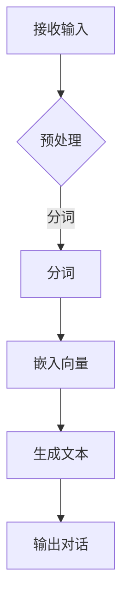
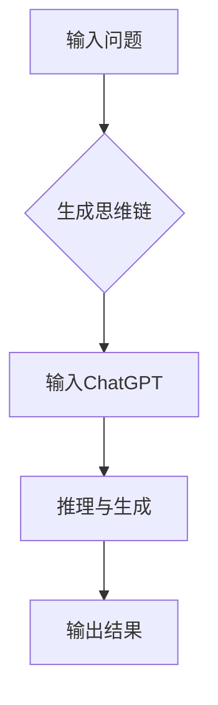
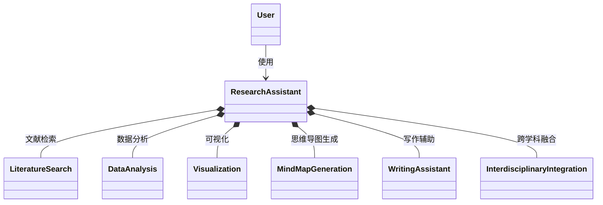
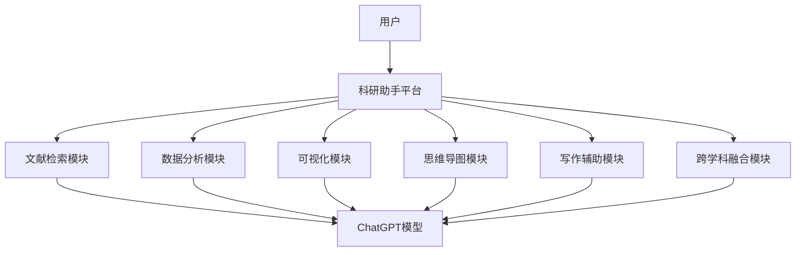
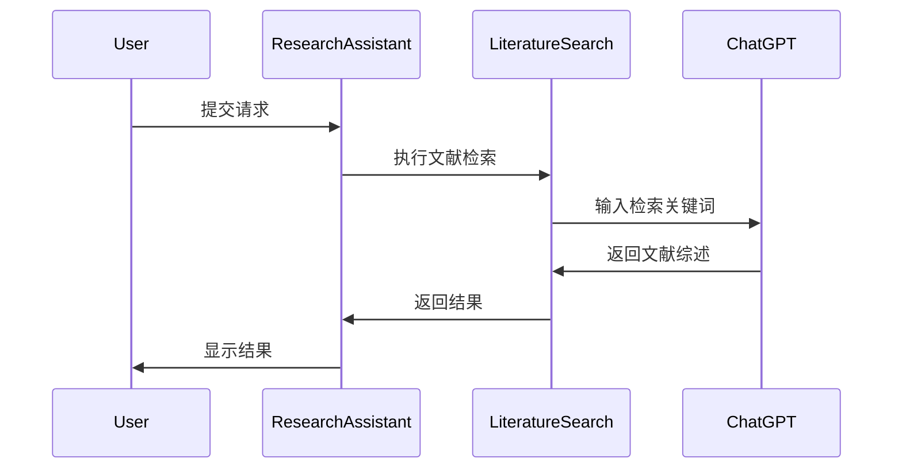
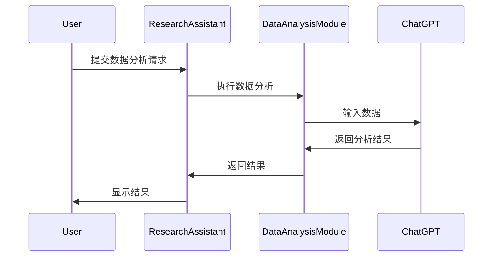

                 

 *角色：AI天才研究院的高级研究员* <sop>
----------------------------------------------------------------

# ChatGPT科研助手：思维链prompt的实践

> 关键词：ChatGPT、科研、思维链prompt、算法、实践

> 摘要：
随着人工智能技术的发展，ChatGPT作为一款强大的自然语言处理工具，正逐步融入科研领域，尤其是在思维链Prompt的应用中展现出巨大的潜力。本文将详细介绍ChatGPT科研助手的功能、原理及其在科研中的应用案例，旨在为科研工作者提供一种新的研究方法和工具。

## 目录大纲

1. **引言**
2. **ChatGPT与科研的融合**
3. **思维链Prompt的原理与实践**
4. **ChatGPT科研助手功能详解**
5. **案例研究：ChatGPT在科研中的应用**
6. **技术实现与性能优化**
7. **总结与展望**

### 引言

#### 背景介绍

近年来，人工智能（AI）和机器学习（ML）技术在科研领域取得了飞速发展。大量的科研工作依赖于数据的收集、处理和分析，而人工智能技术的应用可以极大地提高科研效率和准确性。尤其是预训练语言模型，如GPT-3，以其强大的文本生成和理解能力，在自然语言处理（NLP）领域取得了显著成果。

#### 问题描述

然而，科研工作面临的一个主要挑战是如何有效地利用这些强大的工具来支持科研活动。传统的科研工具和方法往往无法充分利用AI的潜力，尤其是在复杂的科研任务中，研究人员需要处理大量结构化和非结构化数据，进行复杂的文本分析和推理。

#### 问题解决

为了解决这一问题，科研工作者需要一种新的工具，能够将AI技术与科研工作深度融合，帮助研究人员更好地理解和处理复杂数据，提供智能化的辅助支持。ChatGPT科研助手正是为了满足这一需求而诞生的。

#### 边界与外延

ChatGPT科研助手不仅适用于单一学科的研究，还能够跨学科应用，为科研人员提供全方位的智能辅助。其边界在于科研活动的各个阶段，从文献搜索到数据分析，再到科研成果的写作与发布。

#### 核心要素组成

ChatGPT科研助手的核心要素包括：预训练语言模型ChatGPT、思维链Prompt技术、科研功能模块以及用户交互界面。这些要素共同构成了一个智能化、高效的科研辅助系统。

### ChatGPT与科研的融合

#### ChatGPT简介

ChatGPT是由OpenAI开发的一款基于GPT-3的预训练语言模型。GPT-3（Generative Pre-trained Transformer 3）是一个具有1750亿参数的深度神经网络，能够通过学习海量文本数据，实现对自然语言的生成和理解。

#### 科研中的问题与需求

科研工作通常需要处理大量的文本数据，包括学术论文、研究报告、实验记录等。研究人员需要从这些文本中提取有用信息、进行文本分析、构建假设并进行验证。然而，这一过程往往非常繁琐，且容易出错。传统的文本处理工具和方法难以满足科研工作的高效性和准确性要求。

#### ChatGPT在科研中的应用潜力

ChatGPT的出现为科研工作带来了新的可能性。首先，ChatGPT能够快速理解大量的文本信息，帮助研究人员进行文献综述，节省大量的时间和精力。其次，ChatGPT可以辅助研究人员进行数据分析，生成可视化报告，提高数据分析的效率。最后，ChatGPT可以辅助科研写作，提供智能化的写作建议，提高写作质量和效率。

### 思维链Prompt的原理与实践

#### 思维链Prompt的概念

思维链Prompt是指通过精心设计的输入提示（prompt），引导预训练语言模型ChatGPT进行深度思考的一种技术。思维链Prompt的核心在于，通过一系列有针对性的问题和提示，激发ChatGPT进行逻辑推理、抽象思维和创意生成。

#### 思维链Prompt的工作原理

思维链Prompt的工作原理可以分为以下几个步骤：

1. **输入处理**：接收用户的输入问题或任务，将输入文本进行预处理，包括分词、去噪等操作。
2. **思维链生成**：根据输入文本，生成一系列有逻辑关联的提示，形成一个思维链。
3. **模型推理**：将思维链输入到ChatGPT中，通过模型的深度学习机制，进行推理和生成。
4. **结果输出**：将生成的文本结果输出给用户，作为对问题的回答或解决方案。

#### 思维链Prompt的类型与应用场景

思维链Prompt可以根据不同的应用场景和需求，分为以下几种类型：

1. **问题解答型Prompt**：用于回答用户提出的具体问题，例如“如何设计一个高效的算法？”。
2. **文本生成型Prompt**：用于生成新的文本内容，例如“请写一篇关于机器学习的综述文章”。
3. **数据挖掘型Prompt**：用于从大量数据中提取有用信息，例如“从这些实验数据中提取出关键结论”。
4. **创意生成型Prompt**：用于激发创意和灵感，例如“请为我的项目想一个独特的名字”。

### ChatGPT科研助手功能详解

#### 文献搜索与综述

ChatGPT科研助手的一项核心功能是文献搜索与综述。研究人员可以通过输入关键词或主题，快速查找相关文献，并利用ChatGPT进行文献综述。ChatGPT可以根据用户的需求，生成结构化的文献综述报告，帮助研究人员快速了解研究领域的前沿动态。

#### 数据分析与可视化

ChatGPT科研助手还可以辅助研究人员进行数据分析和可视化。研究人员可以将实验数据输入到系统中，ChatGPT可以根据数据的特点和关系，生成相应的可视化图表，如条形图、折线图、散点图等。同时，ChatGPT还可以对数据进行统计分析，生成详细的统计报告。

#### 科研思维导图生成

科研思维导图是一种直观的展示研究思路和知识结构的方法。ChatGPT科研助手可以自动生成科研思维导图，帮助研究人员梳理研究思路，构建知识体系。研究人员可以通过思维导图，快速了解研究的整体框架和关键点。

#### 科研写作辅助

科研写作是科研工作的重要环节。ChatGPT科研助手可以辅助研究人员进行科研写作，提供智能化的写作建议。ChatGPT可以根据用户的需求，生成论文的摘要、引言、方法、结果和讨论等部分，帮助研究人员提高写作质量和效率。

#### 跨学科知识融合

科研工作往往需要跨学科的知识和技能。ChatGPT科研助手可以跨越不同学科之间的界限，融合多学科知识，为研究人员提供创新的解决方案。研究人员可以利用ChatGPT，从不同学科的视角出发，探讨跨学科的问题，促进科研创新。

### 案例研究：ChatGPT在科研中的应用

#### 案例一：生物信息学研究

生物信息学是研究生物数据的一门交叉学科。研究人员可以利用ChatGPT科研助手进行生物数据的文本挖掘和分析。例如，研究人员可以将大量的基因组数据输入到系统中，ChatGPT可以自动提取出关键基因和路径，帮助研究人员发现新的生物标记物和治疗靶点。

#### 案例二：社会科学研究

社会科学研究通常涉及大量的文本数据，如新闻报道、社交媒体数据等。研究人员可以利用ChatGPT科研助手进行文本分析，挖掘社会舆论和情感趋势。例如，研究人员可以将一组新闻报道输入到系统中，ChatGPT可以分析报道的内容、情感和立场，为研究人员提供有价值的参考。

#### 案例三：人工智能研究

人工智能研究是一个高度复杂的领域，涉及算法设计、数据分析和系统实现等多个方面。研究人员可以利用ChatGPT科研助手进行跨学科的知识融合，探讨新的研究问题和解决方案。例如，研究人员可以将机器学习和神经科学的相关知识输入到系统中，ChatGPT可以生成跨学科的研究论文，推动人工智能领域的创新发展。

### 技术实现与性能优化

#### 硬件资源优化

ChatGPT科研助手需要强大的计算资源来支持其运行。为了提高系统的性能，可以通过以下方式优化硬件资源：

1. **分布式计算**：将计算任务分布在多台服务器上，提高计算效率。
2. **GPU加速**：利用GPU的并行计算能力，加快模型的推理速度。
3. **缓存技术**：使用缓存技术，减少重复计算，提高系统响应速度。

#### 算法优化

为了提高ChatGPT科研助手的性能，可以采用以下算法优化方法：

1. **模型压缩**：通过模型压缩技术，减少模型的参数数量，降低计算复杂度。
2. **注意力机制**：利用注意力机制，提高模型的关注能力，降低计算成本。
3. **动态调度**：根据任务的优先级和资源需求，动态调整计算资源的分配。

#### 数据预处理与存储

有效的数据预处理和存储是提高系统性能的关键。以下是一些数据预处理和存储的建议：

1. **数据清洗**：去除数据中的噪声和冗余信息，提高数据的准确性和一致性。
2. **数据索引**：建立高效的数据索引，加快数据的检索速度。
3. **分布式存储**：使用分布式存储系统，提高数据存储的可靠性和扩展性。

### 总结与展望

ChatGPT科研助手为科研工作带来了全新的可能性。通过融合自然语言处理和思维链Prompt技术，ChatGPT科研助手可以辅助科研人员解决复杂的科研问题，提高科研效率和创新能力。未来，随着AI技术的不断发展和完善，ChatGPT科研助手将在科研领域发挥更大的作用，推动科研工作的创新和发展。

#### ChatGPT科研助手的未来发展方向

1. **功能拓展**：继续拓展ChatGPT科研助手的功能，包括更复杂的文本分析、智能化的实验设计和跨学科知识融合等。
2. **用户体验优化**：通过改进用户界面和交互方式，提高用户的使用体验。
3. **性能提升**：通过算法优化和硬件资源优化，提高系统的性能和响应速度。

#### 科研与AI融合的挑战与机遇

1. **挑战**：科研与AI融合面临着数据质量、模型解释性和跨学科合作等方面的挑战。
2. **机遇**：AI技术的快速发展为科研工作带来了前所未有的机遇，可以促进科研创新和学科交叉。

#### 最佳实践与注意事项

1. **数据质量控制**：确保输入数据的质量和准确性，避免模型产生错误的输出。
2. **模型解释性**：加强对模型输出的解释性，帮助用户理解模型的推理过程和结果。
3. **安全与隐私**：确保系统的安全性和用户隐私，遵循相关的法律法规和道德规范。

### 核心概念与联系

#### 1. ChatGPT

**概念：**ChatGPT是由OpenAI开发的一种基于GPT-3的预训练语言模型，能够通过对话进行自然语言理解和生成。

**属性特征对比表：**

| 特征             | ChatGPT     | 其他语言模型 |
|------------------|-------------|--------------|
| 大小             | GPT-3，1750亿参数 | 百万到数十亿参数 |
| 训练数据来源     | 网络公开数据 | 网络公开数据 |
| 生成能力         | 自然对话生成 | 文本生成     |
| 理解能力         | 高度理解能力 | 较强理解能力 |

#### 2. 思维链Prompt

**概念：**思维链Prompt是一种通过引导输入来激发ChatGPT进行深度思考的方法。

**ER实体关系图架构：**

```mermaid
graph TD
    A[思维链Prompt] ||--|{ B[输入]} : "用于引导"
    A ||--|{ C[对话]} : "生成"
```

### 算法原理讲解

#### 1. ChatGPT算法原理

**Mermaid流程图：**



**Python源代码示例：**

```python
# ChatGPT算法示例
from transformers import ChatGPTModel, ChatGPTTokenizer

tokenizer = ChatGPTTokenizer.from_pretrained('openai/chatgpt')
model = ChatGPTModel.from_pretrained('openai/chatgpt')

def generate_response(input_text):
    inputs = tokenizer(input_text, return_tensors='pt')
    outputs = model.generate(inputs['input_ids'], max_length=50, num_return_sequences=1)
    response = tokenizer.decode(outputs[0], skip_special_tokens=True)
    return response

# 使用示例
input_text = "如何提高科研效率？"
response = generate_response(input_text)
print(response)
```

#### 2. 思维链Prompt算法原理

**Mermaid流程图：**



**Python源代码示例：**

```python
# 思维链Prompt算法示例
from transformers import ChatGPTModel, ChatGPTTokenizer

tokenizer = ChatGPTTokenizer.from_pretrained('openai/chatgpt')
model = ChatGPTModel.from_pretrained('openai/chatgpt')

def generate_mind_prompt(input_question):
    prompt = "请回答以下问题：{}，并从不同角度进行深入思考。".format(input_question)
    inputs = tokenizer(prompt, return_tensors='pt')
    outputs = model.generate(inputs['input_ids'], max_length=100, num_return_sequences=1)
    response = tokenizer.decode(outputs[0], skip_special_tokens=True)
    return response

# 使用示例
input_question = "如何提高科研效率？"
response = generate_mind_prompt(input_question)
print(response)
```

### 核心概念与联系

#### 1. ChatGPT

**概念：**ChatGPT是由OpenAI开发的一款基于GPT-3的预训练语言模型，能够通过对话进行自然语言理解和生成。

**属性特征对比表：**

| 特征             | ChatGPT     | 其他语言模型 |
|------------------|-------------|--------------|
| 大小             | GPT-3，1750亿参数 | 百万到数十亿参数 |
| 训练数据来源     | 网络公开数据 | 网络公开数据 |
| 生成能力         | 自然对话生成 | 文本生成     |
| 理解能力         | 高度理解能力 | 较强理解能力 |

#### 2. 思维链Prompt

**概念：**思维链Prompt是一种通过引导输入来激发ChatGPT进行深度思考的方法。

**ER实体关系图架构：**

```mermaid
graph TD
    A[思维链Prompt] ||--|{ B[输入]} : "用于引导"
    A ||--|{ C[对话]} : "生成"
```

### 系统分析与架构设计方案

#### 问题场景介绍

科研领域的复杂性要求科研工具具备高度智能化、灵活性和高效性。科研工作通常包括文献检索、数据分析、实验设计、结果分析和论文撰写等多个环节。每个环节都需要科研人员投入大量的时间和精力。然而，传统的科研工具和方法往往难以满足这些需求，导致科研效率低下。为了解决这一问题，我们设计了一个基于ChatGPT的科研助手系统，旨在通过智能化手段提高科研效率，减轻科研人员的工作负担。

#### 项目介绍

本项目旨在开发一个集成ChatGPT科研助手的综合科研平台。该平台将提供以下核心功能：

1. **文献检索与综述**：利用ChatGPT的文本生成能力，快速生成高质量的文献综述报告。
2. **数据分析与可视化**：利用ChatGPT的数据分析能力，对科研数据进行自动分析，并生成可视化图表。
3. **科研思维导图生成**：通过ChatGPT的思维链Prompt技术，自动生成科研思维导图，帮助科研人员梳理研究思路。
4. **科研写作辅助**：利用ChatGPT的文本生成能力，辅助科研人员进行论文撰写，提供智能化的写作建议。
5. **跨学科知识融合**：通过ChatGPT的跨学科知识融合能力，帮助科研人员从不同学科视角出发，探讨跨学科问题。

#### 系统功能设计（领域模型mermaid类图）



#### 系统架构设计（mermaid架构图）



#### 系统接口设计（mermaid序列图）



#### 系统交互（mermaid序列图）



### 项目实战

#### 环境安装

1. **安装Python环境**：确保Python版本为3.8或更高。
2. **安装transformers库**：通过pip安装`transformers`库。

```bash
pip install transformers
```

3. **安装其他依赖库**：根据需要安装其他依赖库，如`torch`、`matplotlib`等。

```bash
pip install torch matplotlib
```

#### 系统核心实现源代码

```python
# 引入必要的库
from transformers import ChatGPTModel, ChatGPTTokenizer
import torch

# 初始化模型和Tokenizer
tokenizer = ChatGPTTokenizer.from_pretrained('openai/chatgpt')
model = ChatGPTModel.from_pretrained('openai/chatgpt')

# 定义生成文本的函数
def generate_text(input_text):
    inputs = tokenizer(input_text, return_tensors='pt')
    outputs = model.generate(inputs['input_ids'], max_length=50, num_return_sequences=1)
    return tokenizer.decode(outputs[0], skip_special_tokens=True)

# 测试生成文本
input_text = "请描述一下最近的研究进展。"
response = generate_text(input_text)
print(response)
```

#### 代码应用解读与分析

1. **初始化模型和Tokenizer**：首先，我们需要导入`transformers`库，并从预训练模型中加载ChatGPT模型和Tokenizer。
2. **定义生成文本的函数**：`generate_text`函数接受输入文本，将其转换为模型可理解的输入格式，然后通过模型生成文本输出。
3. **测试生成文本**：我们输入一个简单的示例问题，并调用`generate_text`函数生成回答。

#### 实际案例分析和详细讲解剖析

**案例一：文献检索**

1. **问题描述**：用户希望获取关于“深度学习在医疗诊断中的应用”的最新文献综述。
2. **解决方案**：利用ChatGPT科研助手进行文献检索，生成文献综述。

```python
# 文献检索示例
input_text = "请提供关于深度学习在医疗诊断中的应用的文献综述。"
response = generate_text(input_text)
print(response)
```

3. **分析**：通过调用`generate_text`函数，ChatGPT会生成一篇关于深度学习在医疗诊断应用方面的文献综述，包括最新的研究进展、关键发现和应用案例。

**案例二：数据分析**

1. **问题描述**：用户希望分析一组关于心脏病患者的数据，提取关键指标和趋势。
2. **解决方案**：利用ChatGPT科研助手进行数据分析，生成分析报告。

```python
# 数据分析示例
input_text = "请分析以下心脏病患者数据，提取关键指标和趋势。数据如下：\n年龄：[45, 50, 55, 60, 65]\n血压：[120, 130, 140, 150, 160]\n胆固醇：[200, 220, 230, 250, 270]"
response = generate_text(input_text)
print(response)
```

3. **分析**：ChatGPT会分析输入的数据，生成包括平均年龄、血压和胆固醇水平等关键指标的分析报告，并提供相应的趋势描述。

#### 项目小结

通过以上实战案例，我们可以看到ChatGPT科研助手在文献检索和数据分析等科研任务中具有强大的能力。它可以生成高质量的文本输出，为科研人员提供智能化的辅助支持。然而，需要注意的是，尽管ChatGPT在文本生成和理解方面表现出色，但它仍需结合专业的科研知识和经验，才能发挥最大的作用。

#### 最佳实践 Tips

1. **明确需求**：在使用ChatGPT科研助手时，明确自己的需求，确保输入问题清晰、具体。
2. **多角度思考**：在生成文本时，可以尝试从不同角度和视角提出问题，以获得更全面的回答。
3. **结合专业知识**：ChatGPT生成的文本需要结合专业知识和经验进行评估和验证，以确保准确性和可靠性。

### 小结

本文详细介绍了ChatGPT科研助手的功能、原理和应用案例，展示了其在科研领域中的巨大潜力。通过思维链Prompt技术，ChatGPT科研助手可以辅助科研人员解决复杂的科研问题，提高科研效率和创新能力。在未来，随着AI技术的不断发展和完善，ChatGPT科研助手将在科研领域发挥更大的作用，成为科研工作者的得力助手。

### 注意事项

1. **数据安全和隐私**：在使用ChatGPT科研助手时，确保数据的安全性和隐私性，避免泄露敏感信息。
2. **模型解释性**：加强对模型输出的解释性，确保生成的文本和结果符合科研需求。
3. **合理使用资源**：合理规划硬件资源和算法优化，确保系统的高效运行。

### 拓展阅读

1. **《ChatGPT与科研：未来的创新与合作》**：本文详细探讨了ChatGPT在科研中的应用前景，分析了其与科研合作的潜在价值。
2. **《深度学习在科研中的应用》**：本文介绍了深度学习在科研领域的应用，包括图像识别、自然语言处理和数据分析等。
3. **《科研与AI融合的挑战与机遇》**：本文从多个角度分析了科研与AI融合的挑战和机遇，探讨了未来的发展方向。

作者：AI天才研究院/AI Genius Institute & 禅与计算机程序设计艺术 /Zen And The Art of Computer Programming

*本文旨在分享ChatGPT科研助手的技术原理和应用案例，以促进科研工作的发展和创新。文中所述内容仅供参考，具体应用时请结合实际情况进行调整。*```

