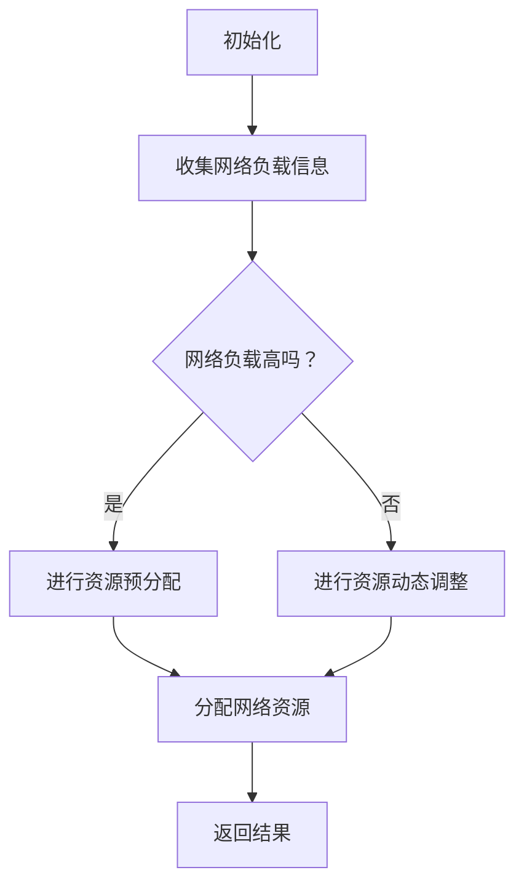

                 

# 5G网络切片技术及其商业应用

关键词：5G，网络切片，技术原理，商业应用，实现与优化

摘要：5G网络切片技术是5G网络的重要组成部分，它为不同类型的应用场景提供了定制化的网络资源和服务质量。本文将详细探讨5G网络切片技术的概念、原理、系统架构、关键算法、商业应用场景以及未来发展趋势，旨在为读者提供一个全面而深入的理解。

## 引言

随着移动互联网的迅猛发展，人们对通信网络的性能要求越来越高。5G网络作为下一代通信技术，旨在提供更高的速度、更低的延迟和更大的连接容量。5G网络切片技术作为5G网络的特色功能之一，能够根据不同用户和场景的需求，灵活地分配网络资源，从而实现更高效的网络利用和服务质量保障。本文将围绕5G网络切片技术展开讨论，包括其背景、原理、实现和应用。

## 5G网络切片技术概述

### 1.1 问题背景

在4G网络时代，网络资源分配相对固定，难以满足多种应用场景的需求。例如，高清视频流和物联网设备在带宽和时延方面有着截然不同的需求。5G网络切片技术正是为了解决这一问题而诞生。

### 1.2 技术定义与特点

5G网络切片技术是一种虚拟化网络技术，通过在网络中创建多个虚拟网络切片，为不同类型的应用场景提供定制化的网络资源和服务质量。其主要特点包括：

- **灵活性**：可以根据不同应用场景的需求，灵活配置网络资源。
- **高效性**：通过虚拟化技术，提高网络资源利用效率。
- **服务质量保障**：为不同应用场景提供不同的服务质量保障。

### 1.3 边界与外延

5G网络切片技术的边界涉及网络切片的创建、管理、配置和监控。其外延则包括5G网络的各个层面，如无线接入网、核心网和传输网。

### 1.4 核心要素组成

5G网络切片技术由以下核心要素组成：

- **网络功能虚拟化（NFV）**：通过虚拟化技术，将网络功能从物理设备上转移到虚拟化环境中。
- **服务功能 chaining（SFC）**：实现网络功能之间的动态编排和调用。
- **网络切片管理（NSM）**：负责网络切片的创建、管理、配置和监控。

## 5G网络切片技术原理

### 2.1 基本原理

5G网络切片技术基于虚拟化和网络功能编排（NFV）技术，通过创建多个虚拟网络切片，为不同应用场景提供定制化的网络资源和服务质量。

### 2.2 工作机制

5G网络切片技术的工作机制主要包括以下几个步骤：

1. **网络切片规划**：根据不同应用场景的需求，规划网络切片的数量、类型和资源配置。
2. **网络切片创建**：在网络中创建虚拟网络切片，并进行配置和管理。
3. **网络切片接入**：用户设备接入网络切片，并使用对应的网络资源和服务质量。
4. **网络切片管理**：对网络切片进行实时监控和优化，确保其正常运行和高效利用。

### 2.3 核心概念

5G网络切片技术的核心概念包括：

- **网络切片（Network Slice）**：为特定应用场景提供的虚拟网络资源。
- **服务等级协议（SLA）**：定义网络切片的服务质量要求。
- **切片管理（Slice Management）**：负责网络切片的创建、配置、监控和优化。

### 2.4 技术框架

5G网络切片技术框架主要包括以下层次：

- **基础设施层**：包括无线接入网、核心网和传输网等物理基础设施。
- **虚拟化层**：包括网络功能虚拟化（NFV）和网络功能编排（NFC）等虚拟化技术。
- **控制层**：包括网络切片管理（NSM）和切片管理（Slice Management）等功能。
- **应用层**：包括不同应用场景的网络服务，如物联网、工业互联网、车联网等。

## 5G网络切片技术的系统架构设计

### 3.1 系统功能设计

5G网络切片技术的系统功能设计主要包括：

- **网络切片创建与配置**：根据需求创建和配置网络切片。
- **网络资源管理**：动态管理网络资源，确保高效利用。
- **服务质量保障**：根据SLA要求，保障网络服务质量。
- **网络监控与优化**：实时监控网络状态，进行优化调整。

### 3.2 系统架构设计

5G网络切片技术的系统架构设计主要包括以下模块：

- **网络功能虚拟化模块**：实现网络功能的虚拟化和动态编排。
- **网络切片管理模块**：负责网络切片的创建、管理和监控。
- **服务功能 chaining 模块**：实现网络功能之间的动态编排和调用。
- **网络资源管理模块**：动态管理网络资源，确保高效利用。

### 3.3 系统接口设计

5G网络切片技术的系统接口设计主要包括以下接口：

- **用户接口**：用户设备接入网络切片的接口。
- **网络接口**：网络切片与其他网络模块之间的接口。
- **管理接口**：网络切片管理模块与其他模块之间的接口。

### 3.4 系统交互设计

5G网络切片技术的系统交互设计主要包括以下交互：

- **网络切片创建与配置交互**：网络切片管理模块与网络功能虚拟化模块之间的交互。
- **网络资源管理交互**：网络资源管理模块与其他模块之间的交互。
- **服务质量保障交互**：网络切片管理模块与网络资源管理模块之间的交互。
- **网络监控与优化交互**：网络监控与优化模块与其他模块之间的交互。

## 5G网络切片技术的关键算法原理

### 4.1 算法原理讲解

5G网络切片技术的关键算法主要包括：

- **资源分配算法**：根据网络负载和用户需求，动态分配网络资源。
- **切片管理算法**：根据网络状态和用户需求，创建、配置和优化网络切片。
- **服务质量保障算法**：根据SLA要求，保障网络服务质量。

### 4.2 算法mermaid流程图

下面是一个资源分配算法的mermaid流程图示例：



### 4.3 Python源代码详述

下面是一个简单的资源分配算法的Python源代码示例：

```python
def allocate_resources(network_load, user_demand):
    if network_load > user_demand:
        # 进行资源预分配
        allocated_resources = pre_allocate_resources(user_demand)
    else:
        # 进行资源动态调整
        allocated_resources = dynamic_allocate_resources(network_load, user_demand)
    return allocated_resources

def pre_allocate_resources(demand):
    # 进行资源预分配
    return demand

def dynamic_allocate_resources(load, demand):
    # 进行资源动态调整
    if load < demand:
        return load
    else:
        return demand
```

### 4.4 数学模型和公式讲解

5G网络切片技术的数学模型主要包括：

- **资源需求模型**：描述用户对网络资源的需求。
- **资源分配模型**：描述网络资源如何根据需求进行分配。
- **服务质量模型**：描述网络服务质量如何满足用户需求。

下面是一个简单的资源需求模型的数学公式：

$$
R_d = f(N, T)
$$

其中，\( R_d \) 表示资源需求，\( N \) 表示网络负载，\( T \) 表示用户需求。

### 4.5 举例说明

假设一个5G网络切片场景，网络负载为100Mbps，用户需求为80Mbps。根据资源需求模型，资源需求为：

$$
R_d = f(100, 80) = 80Mbps
$$

根据资源分配算法，可以分配80Mbps的资源给用户。

## 5G网络切片技术的商业应用场景

### 5.1 商业应用场景分析

5G网络切片技术在多个行业有着广泛的应用前景，包括：

- **物联网（IoT）**：为大规模物联网设备提供定制化的网络资源和服务质量。
- **工业互联网**：为工业自动化和智能制造提供稳定、高效的网络连接。
- **车联网（V2X）**：为智能驾驶、车与车、车与基础设施之间提供低延迟、高可靠的网络通信。
- **远程医疗**：为远程医疗服务提供高质量、低延迟的网络连接。

### 5.2 不同行业应用案例

以下是5G网络切片技术在不同行业的应用案例：

- **物联网（IoT）**：智能农场通过5G网络切片技术，实现对农作物生长环境的实时监测和智能控制。
- **工业互联网**：智能制造工厂通过5G网络切片技术，实现生产设备的实时监控和远程维护。
- **车联网（V2X）**：智能交通系统通过5G网络切片技术，实现车与车、车与基础设施之间的实时通信和协同控制。

### 5.3 商业模式创新

5G网络切片技术为商业模式创新提供了新的可能性，包括：

- **按需付费**：根据用户实际需求和使用情况，提供灵活的收费模式。
- **服务等级协议（SLA）**：为不同等级的用户提供不同的服务质量保障，实现差异化服务。
- **合作共赢**：与传统行业合作，共同开发和应用5G网络切片技术，实现共赢。

## 5G网络切片技术的实现与优化

### 6.1 环境安装

为了实现5G网络切片技术，需要搭建一个合适的实验环境。以下是环境安装的步骤：

1. 安装虚拟化软件，如KVM或VMware。
2. 配置虚拟化环境，创建虚拟机。
3. 安装网络功能虚拟化（NFV）平台，如OpenVNF或ONAP。
4. 配置网络功能编排（NFC）工具，如TOSCA或YAML。

### 6.2 系统核心实现

5G网络切片技术的核心实现主要包括以下几个步骤：

1. **网络功能虚拟化（NFV）**：将网络功能从物理设备上转移到虚拟化环境中。
2. **服务功能 chaining（SFC）**：实现网络功能之间的动态编排和调用。
3. **网络切片管理（NSM）**：创建和管理网络切片。

### 6.3 代码应用解读

以下是一个简单的5G网络切片管理（NSM）的Python代码示例：

```python
class NetworkSliceManager:
    def __init__(self):
        self.slices = {}

    def create_slice(self, slice_name, slice_config):
        self.slices[slice_name] = slice_config
        print(f"Created slice: {slice_name}")

    def delete_slice(self, slice_name):
        if slice_name in self.slices:
            del self.slices[slice_name]
            print(f"Deleted slice: {slice_name}")
        else:
            print(f"Slice {slice_name} not found")

    def list_slices(self):
        for slice_name, slice_config in self.slices.items():
            print(f"Slice: {slice_name}, Config: {slice_config}")
```

### 6.4 实际案例剖析

以下是一个5G网络切片技术在智能交通系统中的应用案例：

1. **问题背景**：城市交通拥堵严重，需要实时监测和调控交通流量。
2. **解决方案**：利用5G网络切片技术，为智能交通系统提供低延迟、高可靠的网络连接，实现实时监测和调控。
3. **实现过程**：
   - **网络切片规划**：根据智能交通系统的需求，规划网络切片的数量和资源配置。
   - **网络切片创建**：创建网络切片，并进行配置和管理。
   - **网络切片接入**：智能交通系统设备接入网络切片，使用对应的网络资源和服务质量。
   - **网络切片管理**：对网络切片进行实时监控和优化，确保其正常运行和高效利用。

## 5G网络切片技术的未来发展趋势与挑战

### 7.1 未来发展趋势预测

随着5G技术的不断成熟和商业化应用，5G网络切片技术将朝着以下方向发展：

- **更加智能化**：利用人工智能技术，实现网络切片的自动规划、配置和优化。
- **更加多样化**：随着5G应用的拓展，网络切片将涵盖更多类型的场景和需求。
- **更加开放和灵活**：推动网络切片技术的标准化和开放化，促进产业链的协同发展。

### 7.2 技术挑战与应对策略

5G网络切片技术面临的挑战包括：

- **性能优化**：如何提高网络切片的性能和稳定性。
- **安全性**：如何确保网络切片的安全性和数据隐私。
- **标准化**：如何推动网络切片技术的标准化进程。

应对策略包括：

- **技术创新**：通过技术创新，提高网络切片的性能和稳定性。
- **合作共赢**：加强产业链各方的合作，共同推进网络切片技术的发展。
- **政策支持**：争取政策支持，推动网络切片技术的商业化应用。

### 7.3 商业应用前景展望

随着5G网络切片技术的不断成熟和商业化应用，其商业前景将非常广阔。预计未来几年，5G网络切片技术将在物联网、工业互联网、车联网等领域实现大规模应用，为各行各业带来新的发展机遇。

## 总结与最佳实践

### 8.1 小结

本文从5G网络切片技术的概念、原理、实现和应用等方面进行了详细探讨，旨在为读者提供一个全面而深入的理解。5G网络切片技术作为5G网络的核心技术之一，具有广阔的应用前景和巨大的商业价值。

### 8.2 注意事项

在实际应用5G网络切片技术时，需要注意以下几点：

- **需求分析**：明确应用场景的需求，为网络切片规划提供依据。
- **性能优化**：持续优化网络切片的性能和稳定性。
- **安全性**：加强网络切片的安全防护，确保数据安全。

### 8.3 拓展阅读

对于对5G网络切片技术感兴趣的读者，以下是一些推荐的拓展阅读：

- **《5G网络切片技术详解》**：详细介绍了5G网络切片技术的原理、架构和应用。
- **《5G网络切片与边缘计算》**：探讨了5G网络切片技术与边缘计算的结合，为未来网络发展提供了新思路。
- **《5G网络切片技术标准化研究报告》**：分析了5G网络切片技术的标准化进程和未来发展趋势。

## 作者信息

作者：AI天才研究院/AI Genius Institute & 禅与计算机程序设计艺术 /Zen And The Art of Computer Programming

---

本文通过逐步分析5G网络切片技术的背景、原理、实现和应用，旨在为读者提供一个全面而深入的理解。5G网络切片技术作为5G网络的核心技术之一，具有巨大的商业价值和应用前景。希望本文能为读者在5G网络切片技术的学习和应用中提供有益的参考。

