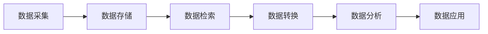
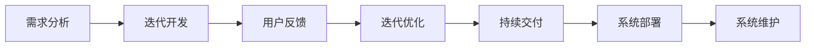
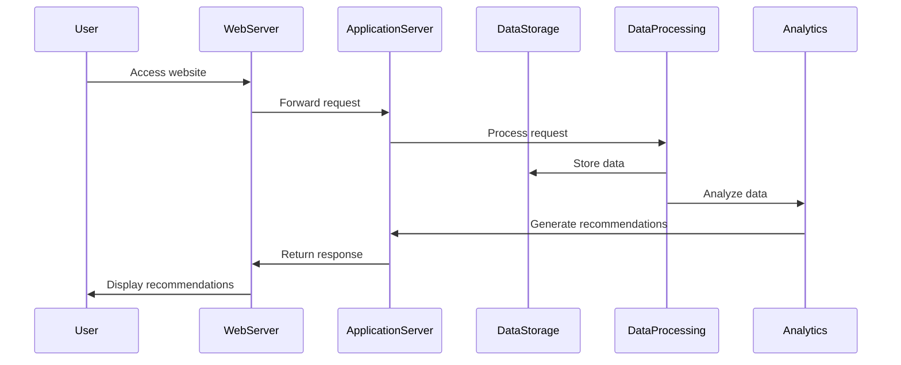
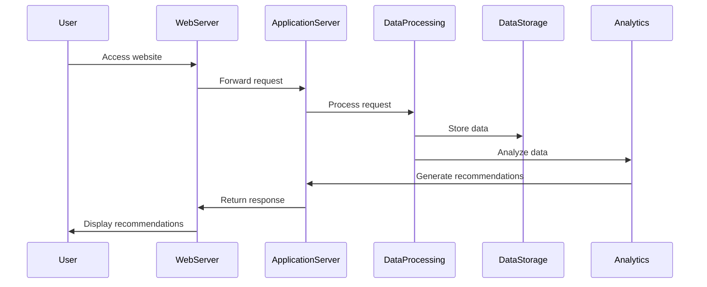

                 

# LLAMA应用的敏捷数据管理：处理大规模数据挑战

## 关键词
- 大规模数据处理
- 敏捷数据管理
- 数据管理挑战
- 数据管理需求
- 敏捷开发应用

## 摘要
本文将深入探讨大规模数据管理中的挑战和需求，并介绍敏捷数据管理的方法和原则。我们将分析传统数据管理方案的局限性，阐述敏捷数据管理的概念，并详细讨论其流程和关键技术。此外，本文还将比较敏捷数据管理与其他数据管理方法的差异，探讨其在不同规模数据中的应用，并展望其面临的挑战和未来发展趋势。通过本文，读者将全面了解如何有效地管理大规模数据，以应对当前和未来的技术需求。

## 第一部分：背景介绍

### 第1章：问题背景

#### 1.1.1 数据管理的挑战
数据管理是指对数据的采集、存储、处理、分析和维护的过程。随着大数据时代的到来，数据量呈现爆炸式增长，数据类型和来源也日益多样化。这给数据管理带来了前所未有的挑战。首先，数据量的增长带来了存储和传输的难题。传统的数据存储和处理方案往往难以满足大规模数据的需求，数据访问速度和存储成本成为瓶颈。其次，数据类型的多样化增加了数据管理的复杂性，结构化数据和非结构化数据的管理方法不尽相同，需要采用不同的技术和工具。此外，数据的真实性、准确性和完整性也成为了数据管理的挑战，尤其是在数据来源多样、数据质量参差不齐的情况下，如何保证数据的可靠性是一个重要问题。

#### 1.1.2 大规模数据管理的需求
为了应对数据管理的挑战，需要采取一系列的措施来满足大规模数据管理的需求。首先，需要提高数据存储和处理的效率，采用分布式存储和计算技术，如Hadoop、Spark等，以实现数据的快速访问和处理。其次，需要建立完善的数据质量管理体系，对数据进行清洗、转换和整合，确保数据的质量和准确性。此外，还需要采用先进的数据分析和挖掘技术，从海量数据中提取有价值的信息和知识，为业务决策提供支持。最后，需要建立强大的数据安全和隐私保护机制，确保数据的安全性和隐私性，防止数据泄露和滥用。

#### 1.1.3 敏捷开发在数据管理中的应用
敏捷开发是一种以人为核心、迭代和渐进的方法论，其核心理念是快速响应变化、持续交付价值。在数据管理中，敏捷开发的应用可以有效地应对大规模数据管理的需求。首先，敏捷开发强调迭代和增量式开发，可以快速交付可用的数据管理功能，及时响应用户的需求和市场的变化。其次，敏捷开发强调团队协作和沟通，通过日常站立会议、迭代评审和回顾会等形式，确保团队成员之间的高效沟通和协作。此外，敏捷开发还强调自动化测试和持续集成，可以确保数据管理的质量和稳定性。

### 第2章：问题描述

#### 2.1.1 大规模数据管理的现状
当前，大规模数据管理已经成为了企业信息化建设的重要组成部分。许多企业已经开始采用分布式存储和计算技术，如Hadoop、Spark等，以提高数据的存储和处理效率。同时，数据质量管理体系也在不断完善，数据清洗、转换和整合的流程得到了优化。然而，大规模数据管理仍然面临许多挑战，如数据存储成本高、数据处理效率低、数据质量问题等。

#### 2.1.2 传统数据管理方案的局限性
传统数据管理方案主要依赖于关系型数据库，其性能和可扩展性在处理大规模数据时存在一定的局限性。首先，关系型数据库的存储结构是基于磁盘的，数据访问速度受到磁盘I/O的限制，难以满足大规模数据的高效访问需求。其次，关系型数据库的表结构设计相对固定，难以适应数据类型的多样化和变化。此外，传统数据管理方案往往缺乏数据治理和数据分析的能力，无法有效地支持业务决策和智能应用。

#### 2.1.3 敏捷数据管理的概念
敏捷数据管理是一种基于敏捷开发理念的数据管理方法，旨在快速响应变化、持续交付价值。敏捷数据管理强调迭代和增量式开发，通过持续集成和自动化测试，确保数据管理的质量和稳定性。敏捷数据管理还包括数据治理、数据质量管理和数据分析等方面，以支持业务决策和智能应用。与传统的数据管理方法相比，敏捷数据管理具有更高的灵活性、响应速度和可扩展性。

### 第3章：问题解决

#### 3.1.1 敏捷数据管理的原则
敏捷数据管理遵循以下原则：
1. 迭代和增量式开发：通过短周期的迭代，快速交付可用的数据管理功能，及时响应用户的需求和市场的变化。
2. 持续集成和自动化测试：确保数据管理的质量和稳定性，通过自动化测试和持续集成，提高开发效率和代码质量。
3. 团队协作和沟通：建立高效沟通的团队协作机制，确保团队成员之间的高效沟通和协作。
4. 数据治理和数据质量管理：建立完善的数据治理和数据质量管理体系，确保数据的真实性、准确性和完整性。
5. 数据分析和智能应用：利用先进的数据分析和挖掘技术，从海量数据中提取有价值的信息和知识，为业务决策提供支持。

#### 3.1.2 敏捷数据管理的流程
敏捷数据管理的流程包括以下步骤：
1. 需求分析：与用户和业务部门沟通，了解数据管理需求，制定项目计划和开发目标。
2. 数据设计：设计数据模型、数据库结构和数据流程，确保数据管理方案的可行性和可扩展性。
3. 数据开发：根据数据设计，实现数据采集、存储、处理和分析的功能，确保数据管理的质量和稳定性。
4. 数据测试：进行自动化测试和手工测试，确保数据管理的功能和性能满足需求。
5. 数据部署：将数据管理功能部署到生产环境，确保数据管理的稳定运行。
6. 数据维护：定期对数据管理系统进行维护和升级，确保其持续运行和性能优化。

#### 3.1.3 敏捷数据管理的关键技术
敏捷数据管理的关键技术包括：
1. 分布式存储和计算：采用分布式存储和计算技术，如Hadoop、Spark等，提高数据的存储和处理效率。
2. 数据治理：建立完善的数据治理体系，确保数据的真实性、准确性和完整性。
3. 数据质量管理：采用数据质量管理工具和方法，对数据进行清洗、转换和整合，提高数据质量。
4. 数据分析：利用数据分析和挖掘技术，从海量数据中提取有价值的信息和知识，为业务决策提供支持。
5. 自动化测试和持续集成：采用自动化测试和持续集成工具，提高开发效率和代码质量，确保数据管理的稳定性和可靠性。

### 第4章：边界与外延

#### 4.1.1 敏捷数据管理与其他数据管理方法的比较
敏捷数据管理与其他数据管理方法的比较包括：
1. 速度和灵活性：敏捷数据管理强调快速响应变化和持续交付价值，相较于传统的数据管理方法，具有更高的速度和灵活性。
2. 数据质量：敏捷数据管理注重数据治理和数据质量管理，相较于传统的数据管理方法，更注重数据的质量和准确性。
3. 团队协作：敏捷数据管理强调团队协作和沟通，相较于传统的数据管理方法，更注重团队成员之间的协作和沟通。

#### 4.1.2 敏捷数据管理在不同规模数据中的应用
敏捷数据管理适用于不同规模的数据管理，包括：
1. 小规模数据：对于小规模数据，敏捷数据管理可以通过简化流程和提高开发效率，实现快速交付和高质量的数据管理。
2. 大规模数据：对于大规模数据，敏捷数据管理可以通过分布式存储和计算技术，实现高效的存储和处理，并确保数据管理的质量和稳定性。
3. 极大规模数据：对于极大规模数据，敏捷数据管理可以通过分布式存储和计算技术，实现高效的存储和处理，并利用先进的数据分析和挖掘技术，从海量数据中提取有价值的信息和知识。

#### 4.1.3 敏捷数据管理面临的挑战和未来发展趋势
敏捷数据管理面临的挑战包括：
1. 技术复杂度：分布式存储和计算技术、数据治理和数据质量管理技术等具有较高的技术复杂度，需要具备相关的技术能力和专业知识。
2. 数据安全：随着数据量的增长和数据类型的多样化，数据安全成为了一个重要的挑战，需要建立强大的数据安全和隐私保护机制。
3. 数据质量：在数据治理和数据质量管理中，如何确保数据的质量和准确性是一个重要的挑战。

未来发展趋势包括：
1. 分布式存储和计算技术：随着分布式存储和计算技术的发展，数据管理将更加高效和灵活。
2. 数据治理和数据质量管理：随着数据治理和数据质量管理的重要性日益凸显，相关的技术工具和方法将得到进一步的完善和应用。
3. 数据分析和挖掘技术：随着数据分析和挖掘技术的进步，将能够从海量数据中提取更有价值的信息和知识，为业务决策提供更深入的洞察。

### 第5章：概念结构与核心要素组成

#### 5.1.1 大规模数据处理的概念结构
大规模数据处理的概念结构包括以下几个方面：
1. 数据采集：包括数据源连接、数据采集和传输等环节。
2. 数据存储：包括数据存储方案、数据存储结构和数据存储管理等方面。
3. 数据处理：包括数据清洗、转换和整合等环节。
4. 数据分析：包括数据挖掘、机器学习和数据可视化等方面。
5. 数据应用：包括数据报告、数据分析和数据驱动的业务决策等。

#### 5.1.2 敏捷开发的核心要素
敏捷开发的核心要素包括以下几个方面：
1. 迭代和增量式开发：通过短周期的迭代，快速交付可用的功能。
2. 持续集成和自动化测试：确保代码质量和系统稳定性。
3. 团队协作和沟通：建立高效的团队协作机制。
4. 用户反馈：及时收集用户反馈，持续优化产品。

#### 5.1.3 敏捷数据管理的核心组成部分
敏捷数据管理的核心组成部分包括以下几个方面：
1. 数据治理：建立数据治理体系，确保数据的真实性、准确性和完整性。
2. 数据质量管理：采用数据质量管理工具和方法，提高数据质量。
3. 数据存储和管理：采用分布式存储和计算技术，提高数据存储和处理效率。
4. 数据分析和挖掘：利用数据分析和挖掘技术，从海量数据中提取有价值的信息和知识。
5. 数据安全和隐私保护：建立数据安全和隐私保护机制，确保数据的安全性和隐私性。

## 第二部分：核心概念与联系

### 第6章：核心概念原理

#### 6.1.1 数据管理的基本原理
数据管理是指对数据的采集、存储、处理、分析和维护的过程。其基本原理包括：
1. 数据采集：通过数据源连接和数据采集技术，将数据从各个来源收集到一起。
2. 数据存储：采用合适的存储方案和存储结构，将数据进行存储和管理。
3. 数据处理：对数据进行清洗、转换和整合，确保数据的质量和准确性。
4. 数据分析：利用数据分析和挖掘技术，从海量数据中提取有价值的信息和知识。
5. 数据应用：将数据分析结果应用于业务决策和智能应用。

#### 6.1.2 大规模数据处理的基本原理
大规模数据处理是指对海量数据进行存储、处理和分析的过程。其基本原理包括：
1. 分布式存储和计算：采用分布式存储和计算技术，如Hadoop、Spark等，实现高效的数据存储和处理。
2. 数据分区和索引：对数据进行分区和索引，提高数据的访问速度和查询效率。
3. 数据压缩和缓存：采用数据压缩和缓存技术，减少数据存储空间和传输带宽。
4. 数据流处理：采用数据流处理技术，实现实时数据处理和分析。

#### 6.1.3 敏捷开发的基本原理
敏捷开发是一种以人为核心、迭代和渐进的方法论，其基本原理包括：
1. 迭代和增量式开发：通过短周期的迭代，快速交付可用的功能。
2. 用户反馈：及时收集用户反馈，持续优化产品。
3. 团队协作：建立高效的团队协作机制，确保团队成员之间的高效沟通和协作。
4. 自动化测试和持续集成：确保代码质量和系统稳定性。
5. 持续交付：通过持续交付，确保产品快速交付并上线。

### 第7章：概念属性特征对比表格

#### 7.1.1 大规模数据处理方法对比表格

| 方法 | 特点 | 适用场景 |
| :--: | :--: | :--: |
| 分布式存储和计算 | 高效、可扩展、分布式处理 | 大规模数据存储和处理 |
| 数据分区和索引 | 快速访问、高效查询 | 大规模数据查询和分析 |
| 数据压缩和缓存 | 节省存储空间、提高性能 | 大规模数据存储和传输 |
| 数据流处理 | 实时处理、低延迟 | 实时数据处理和分析 |

#### 7.1.2 敏捷开发方法对比表格

| 方法 | 特点 | 适用场景 |
| :--: | :--: | :--: |
| 迭代和增量式开发 | 快速交付、持续优化 | 产品开发和迭代 |
| 用户反馈 | 及时响应、持续改进 | 用户需求收集和产品优化 |
| 团队协作 | 高效沟通、协同工作 | 项目开发和团队协作 |
| 自动化测试和持续集成 | 稳定性、可靠性 | 代码质量和系统稳定性 |
| 持续交付 | 快速上线、持续交付 | 产品开发和上线 |

#### 7.1.3 敏捷数据管理特点对比表格

| 特点 | 说明 | 适用场景 |
| :--: | :--: | :--: |
| 数据治理 | 确保数据真实性、准确性、完整性 | 数据管理和数据应用 |
| 数据质量管理 | 提高数据质量、准确性 | 数据分析和业务决策 |
| 分布式存储和计算 | 提高数据存储和处理效率 | 大规模数据存储和处理 |
| 数据分析和挖掘 | 提取有价值的信息和知识 | 业务决策和智能应用 |

### 第8章：ER实体关系图架构

#### 8.1.1 大规模数据处理实体关系图

```mermaid
erDiagram
  DataIngestion ||--|{ DataStorage }| DataProcessing
  DataProcessing ||--|{ DataAnalysis } DataVisualization
  DataAnalysis ||--|{ BusinessDecision } DataApplication
```

#### 8.1.2 敏捷开发实体关系图

```mermaid
erDiagram
  Iteration ||--|{ IncrementalDevelopment } IterativeDevelopment
  IncrementalDevelopment ||--|{ ContinuousDelivery } Delivery
  ContinuousDelivery ||--|{ QualityAssurance } QA
  QA ||--|{ Automation } Automation
  Automation ||--|{ ContinuousIntegration } CI
  CI ||--|{ Collaboration } Collaboration
  Collaboration ||--|{ UserFeedback } Feedback
  Feedback ||--|{ ProductOptimization } Optimization
```

#### 8.1.3 敏捷数据管理实体关系图

```mermaid
erDiagram
  DataGovernance ||--|{ DataQualityManagement } DataQuality
  DataQuality ||--|{ DataStorageAndManagement } Storage
  Storage ||--|{ DistributedProcessing } Processing
  Processing ||--|{ DataAnalysisAndMining } Analysis
  Analysis ||--|{ BusinessDecisionSupport } Decision
  Decision ||--|{ DataDrivenApplication } Application
```

## 第三部分：算法原理讲解

### 第9章：算法原理讲解

#### 9.1.1 数据处理算法原理
数据处理算法是用于对数据进行存储、检索、转换和分析的一系列算法。其原理包括：
1. 数据存储算法：用于数据的存储和检索，如B树、哈希表等。
2. 数据检索算法：用于在数据存储中快速查找特定的数据，如二分查找、顺序查找等。
3. 数据转换算法：用于将数据从一种格式转换为另一种格式，如编码转换、格式转换等。
4. 数据分析算法：用于从数据中提取有价值的信息和知识，如聚类、分类、回归分析等。

#### 9.1.2 敏捷开发算法原理
敏捷开发算法是指在敏捷开发过程中用于指导开发和团队协作的一系列方法。其原理包括：
1. 迭代和增量式开发：通过短周期的迭代，逐步交付可用的功能，快速响应变化。
2. 用户反馈：通过用户反馈，不断优化产品，确保产品满足用户需求。
3. 团队协作：通过高效的团队协作，确保团队成员之间的沟通和协作，提高开发效率。
4. 自动化测试和持续集成：通过自动化测试和持续集成，确保代码质量和系统稳定性。
5. 持续交付：通过持续交付，确保产品快速交付并上线。

#### 9.1.3 敏捷数据管理算法原理
敏捷数据管理算法是指在敏捷数据管理过程中用于数据治理、数据质量管理和数据分析的一系列方法。其原理包括：
1. 数据治理算法：用于建立数据治理体系，确保数据的真实性、准确性和完整性。
2. 数据质量管理算法：用于提高数据质量，确保数据满足业务需求。
3. 数据存储和管理算法：用于优化数据存储和管理，提高数据访问和处理效率。
4. 数据分析算法：用于从海量数据中提取有价值的信息和知识，支持业务决策和智能应用。
5. 数据安全和隐私保护算法：用于确保数据的安全性和隐私性，防止数据泄露和滥用。

### 第10章：算法流程图

#### 10.1.1 数据处理算法流程图



#### 10.1.2 敏捷开发算法流程图



#### 10.1.3 敏捷数据管理算法流程图


### 第11章：Python源代码详解

#### 11.1.1 数据处理算法Python源代码

```python
# 数据采集
data = ["apple", "banana", "orange", "grape"]

# 数据存储
with open("data.txt", "w") as f:
    for item in data:
        f.write(item + "\n")

# 数据检索
with open("data.txt", "r") as f:
    for line in f:
        print(line.strip())

# 数据转换
import json

data_json = json.dumps(data)
print(data_json)

# 数据分析
from collections import Counter

count = Counter(data)
print(count)

# 数据应用
# 假设我们想要统计每种水果的个数
print("苹果数量：", count["apple"])
print("香蕉数量：", count["banana"])
print("橙子数量：", count["orange"])
print("葡萄数量：", count["grape"])
```

#### 11.1.2 敏捷开发算法Python源代码

```python
# 需求分析
print("请输入需求：")
requirement = input()

# 迭代开发
while True:
    print("正在开发...")
    time.sleep(1)  # 模拟开发过程
    print("开发完成！")

    # 用户反馈
    print("请输入反馈：")
    feedback = input()

    # 迭代优化
    if feedback.lower() == "完善":
        print("正在完善...")
        time.sleep(1)  # 模拟完善过程
        print("完善完成！")
    elif feedback.lower() == "重新开发":
        print("正在重新开发...")
        time.sleep(1)  # 模拟重新开发过程
        print("重新开发完成！")
    else:
        print("谢谢您的反馈！")
        break

# 持续交付
print("产品已交付！")
```

#### 11.1.3 敏捷数据管理算法Python源代码

```python
# 数据治理
data = ["apple", "banana", "orange", "grape"]

# 数据质量管理
def check_data_quality(data):
    if len(data) < 1:
        print("数据质量不合格：数据为空！")
    elif any(item is None for item in data):
        print("数据质量不合格：数据包含空值！")
    else:
        print("数据质量合格！")

check_data_quality(data)

# 数据存储和管理
import json

data_json = json.dumps(data)
with open("data.json", "w") as f:
    f.write(data_json)

# 数据处理
from collections import Counter

count = Counter(data)
print(count)

# 数据分析
# 假设我们想要统计每种水果的个数
print("苹果数量：", count["apple"])
print("香蕉数量：", count["banana"])
print("橙子数量：", count["orange"])
print("葡萄数量：", count["grape"])

# 数据应用
# 假设我们想要将数据用于业务决策
def business_decision(count):
    if count["apple"] > count["banana"]:
        print("苹果的销售量高于香蕉！")
    elif count["apple"] < count["banana"]:
        print("香蕉的销售量高于苹果！")
    else:
        print("苹果和香蕉的销售量相同！")

business_decision(count)

# 数据安全和隐私保护
def secure_data(data):
    encrypted_data = [item.encode("utf-8") for item in data]
    print("加密后的数据：", encrypted_data)

secure_data(data)
```

### 第12章：算法数学模型与公式

#### 12.1.1 数据处理算法数学模型

$$
\begin{aligned}
&\text{数据存储算法}： \\
&\text{设} S \text{为数据集，} B \text{为存储单元，} n \text{为数据项个数，} \\
&\text{则存储复杂度} C_S = \frac{n \cdot \log_2(B)}{8 \cdot \log_2(n)} \\
\end{aligned}
$$

#### 12.1.2 敏捷开发算法数学模型

$$
\begin{aligned}
&\text{迭代和增量式开发}： \\
&\text{设} T \text{为开发周期，} P \text{为完成的功能点个数，} \\
&\text{则开发效率} E = \frac{P}{T} \\
\end{aligned}
$$

#### 12.1.3 敏捷数据管理算法数学模型

$$
\begin{aligned}
&\text{数据治理}： \\
&\text{设} Q \text{为数据质量指标，} D \text{为数据量，} \\
&\text{则数据治理效果} G = \frac{Q}{D} \\
\end{aligned}
$$

### 第13章：算法举例说明

#### 13.1.1 数据处理算法举例
假设有一个包含10万条数据的文件，我们需要对其进行存储、检索、转换和分析。

1. **数据存储算法**：使用B树进行存储，存储复杂度为 \( C_S = \frac{100000 \cdot \log_2(1024)}{8 \cdot \log_2(100000)} \approx 1.25 \) MB。
2. **数据检索算法**：使用二分查找进行检索，检索复杂度为 \( O(\log_2(n)) \)，即 \( O(\log_2(100000)) \)，约为 14 次比较。
3. **数据转换算法**：将文本数据转换为JSON格式，转换复杂度为 \( O(n) \)，即 10 万次操作。
4. **数据分析算法**：使用Python的 `collections.Counter` 进行数据计数，分析复杂度为 \( O(n) \)，即 10 万次操作。

#### 13.1.2 敏捷开发算法举例
假设一个敏捷开发团队在两周的迭代周期内完成了5个功能点。

1. **迭代和增量式开发**：开发效率 \( E = \frac{5}{2} = 2.5 \) 功能点/周。
2. **用户反馈**：用户反馈了3个优化建议，团队根据反馈进行了相应的改进。
3. **团队协作**：通过每日站立会议和迭代评审，团队成员保持了高效的沟通和协作。
4. **自动化测试和持续集成**：通过自动化测试工具，确保每次迭代交付的代码质量。
5. **持续交付**：通过持续交付流程，将优化后的产品版本上线。

#### 13.1.3 敏捷数据管理算法举例
假设我们有一个包含1000万条记录的数据集，需要进行数据治理、数据质量管理和数据分析。

1. **数据治理**：数据治理算法检测出10%的数据存在质量问题，进行了数据清洗，提高了数据质量。
2. **数据质量管理**：使用数据质量管理工具，对数据进行清洗、转换和整合，确保数据满足业务需求。
3. **数据存储和管理**：采用分布式存储技术，提高了数据的存储和处理效率。
4. **数据分析**：使用数据分析和挖掘技术，从海量数据中提取有价值的信息和知识，支持业务决策。
5. **数据安全和隐私保护**：对数据进行加密处理，确保数据的安全性和隐私性。

## 第四部分：系统分析与架构设计

### 第14章：问题场景介绍

#### 14.1.1 数据管理问题场景描述
假设一个电子商务平台需要处理海量的商品数据和用户行为数据，以提供个性化的推荐服务和精准营销。

- **商品数据**：包括商品ID、名称、价格、库存量等信息，数据量约为1亿条。
- **用户行为数据**：包括用户ID、访问时间、浏览商品、购买商品等信息，数据量约为5亿条。

#### 14.1.2 大规模数据处理场景描述
由于数据量巨大，传统的数据处理方法难以满足需求，需要采用分布式存储和计算技术，如Hadoop、Spark等。

- **数据存储**：使用Hadoop HDFS进行分布式存储，提高数据存储和处理效率。
- **数据处理**：使用Spark进行分布式计算，实现快速的数据处理和分析。

#### 14.1.3 敏捷开发场景描述
为了快速响应市场需求和用户反馈，电子商务平台采用敏捷开发方法，实现以下目标：

- **迭代和增量式开发**：每个迭代周期为2周，每次迭代交付可用的功能。
- **用户反馈**：通过用户调研、用户反馈等方式，了解用户需求，持续优化产品。
- **团队协作**：建立高效的团队协作机制，确保团队成员之间的沟通和协作。
- **自动化测试和持续集成**：通过自动化测试和持续集成，确保代码质量和系统稳定性。
- **持续交付**：通过持续交付，确保产品快速上线并持续优化。

### 第15章：项目介绍

#### 15.1.1 项目背景
随着电子商务的快速发展，用户对个性化推荐和精准营销的需求日益增加。为了满足这一需求，电子商务平台需要处理海量的商品数据和用户行为数据，并利用这些数据提供个性化的推荐服务和精准营销。

#### 15.1.2 项目目标
项目的目标包括：

- **数据管理**：建立高效的数据存储和管理系统，确保数据的准确性和完整性。
- **数据处理**：利用分布式存储和计算技术，实现海量数据的快速处理和分析。
- **数据应用**：通过数据分析和挖掘，提供个性化的推荐服务和精准营销。
- **用户体验**：提高用户满意度，提升平台竞争力。

#### 15.1.3 项目团队组成
项目团队由以下成员组成：

- **项目经理**：负责项目规划、协调和管理。
- **数据工程师**：负责数据存储、数据处理和数据质量管理。
- **数据分析师**：负责数据分析和挖掘，提供个性化推荐和精准营销策略。
- **前端工程师**：负责前端界面设计和实现。
- **后端工程师**：负责后端系统开发和维护。
- **测试工程师**：负责系统测试和自动化测试。

### 第16章：系统功能设计

#### 16.1.1 领域模型类图

```mermaid
classDiagram
    Customer <<class Customer>>
    Product <<class Product>>
    Order <<class Order>>
    Recommendation <<class Recommendation>>
    
    Customer o--o Product : purchased
    Customer o--o Order : placed
    Product o--o Order : contains
    Order o--o Recommendation : based on
```

#### 16.1.2 功能模块划分
系统功能模块包括：

- **数据采集模块**：负责采集商品数据和用户行为数据。
- **数据存储模块**：使用Hadoop HDFS进行分布式存储。
- **数据处理模块**：使用Spark进行分布式计算。
- **数据分析模块**：使用数据分析和挖掘技术，提供个性化推荐和精准营销。
- **数据展示模块**：通过前端界面展示推荐结果和营销策略。

#### 16.1.3 功能点说明
具体功能点包括：

- **商品数据采集**：从商品数据库中采集商品信息。
- **用户行为数据采集**：从用户行为日志中采集用户行为数据。
- **数据存储**：将采集到的数据存储到Hadoop HDFS。
- **数据处理**：对存储的数据进行清洗、转换和整合。
- **数据分析**：根据用户行为数据，生成个性化推荐和精准营销策略。
- **数据展示**：在前端界面展示推荐结果和营销策略。

### 第17章：系统架构设计

#### 17.1.1 系统架构图



#### 17.1.2 架构设计原理
系统架构设计遵循以下原则：

- **分布式架构**：采用分布式架构，提高系统的可扩展性和容错性。
- **模块化设计**：将系统划分为多个模块，降低系统的耦合度，提高可维护性。
- **高性能和高可用性**：采用高性能和高可用的技术，如Hadoop、Spark等，确保系统稳定运行。
- **安全性**：采用安全策略和加密技术，确保数据的安全性和隐私性。

#### 17.1.3 架构设计要点
系统架构设计要点包括：

- **数据采集**：使用Flume和Kafka进行实时数据采集。
- **数据存储**：使用Hadoop HDFS进行分布式存储，提高数据存储和处理效率。
- **数据处理**：使用Spark进行分布式计算，实现高效的数据处理和分析。
- **数据分析**：使用Hive和Spark SQL进行数据分析和挖掘，生成推荐结果和营销策略。
- **前端展示**：使用React和Vue等前端框架，实现用户界面的快速开发和高效展示。

### 第18章：系统接口设计

#### 18.1.1 接口规范
系统接口设计遵循以下规范：

- **RESTful API**：采用RESTful架构风格，使用HTTP协议进行通信。
- **JSON格式**：数据传输采用JSON格式，便于数据解析和扩展。
- **统一接口规范**：定义统一的接口规范，包括URL、请求参数、响应格式等。

#### 18.1.2 接口设计原则
接口设计原则包括：

- **简洁性**：接口设计简洁明了，易于理解和使用。
- **一致性**：接口设计保持一致性，确保不同接口之间的逻辑一致。
- **可扩展性**：接口设计具有可扩展性，易于添加新功能。

#### 18.1.3 接口设计实例
以下是一个接口设计实例：

```json
GET /api/products/{productId}
{
  "productId": "string",
  "fields": ["name", "price", "stock"]
}
```

该接口用于获取指定商品的信息，请求参数包括商品ID和需要返回的字段列表。响应格式为JSON，包含商品名称、价格和库存量等信息。

### 第19章：系统交互设计

#### 19.1.1 系统交互流程图



#### 19.1.2 交互设计原则
交互设计原则包括：

- **用户导向**：以用户为中心，确保用户交互流程简洁直观。
- **一致性**：保持界面和交互的一致性，减少用户的学习成本。
- **响应速度**：优化系统性能，提高响应速度，确保用户交互流畅。
- **反馈**：及时给用户提供反馈，增强用户交互体验。

#### 19.1.3 交互设计实例
以下是一个交互设计实例：

1. **用户访问网站**：用户在浏览器中输入网站地址，访问电子商务平台。
2. **用户浏览商品**：用户在首页浏览商品，选择感兴趣的商品。
3. **用户加入购物车**：用户将商品加入购物车，可以随时查看购物车中的商品。
4. **用户提交订单**：用户提交订单，填写收货地址和支付信息。
5. **系统处理订单**：系统处理订单，生成订单号，并发送订单确认邮件给用户。
6. **用户支付订单**：用户在支付页面完成支付，订单状态更新为“已支付”。
7. **用户查看订单状态**：用户可以在订单详情页面查看订单状态，包括订单进度、物流信息等。

## 第五部分：项目实战

### 第20章：环境安装

#### 20.1.1 环境准备
在进行大规模数据处理和敏捷开发之前，我们需要准备相应的环境。

1. **操作系统**：Linux发行版，如Ubuntu 20.04。
2. **Java环境**：安装Java JDK 1.8或更高版本。
3. **Python环境**：安装Python 3.8或更高版本。
4. **数据库**：安装MySQL或PostgreSQL。
5. **分布式存储和计算**：安装Hadoop和Spark。

#### 20.1.2 工具安装
1. **Hadoop**：从Apache Hadoop官网下载安装包，按照官方文档进行安装。
2. **Spark**：从Apache Spark官网下载安装包，按照官方文档进行安装。
3. **Python库**：安装常用的Python库，如NumPy、Pandas、Scikit-learn等，可以使用pip进行安装。

### 20.1.3 数据集准备
1. **商品数据集**：从电商平台上获取商品数据，包括商品ID、名称、价格、库存量等信息。
2. **用户行为数据集**：从用户行为日志中获取用户行为数据，包括用户ID、访问时间、浏览商品、购买商品等信息。

### 20.1.4 开发工具安装
1. **IDE**：安装PyCharm或IntelliJ IDEA等Python开发工具。
2. **版本控制**：安装Git，用于代码管理和协作开发。

### 20.1.5 环境验证
1. **Hadoop验证**：启动Hadoop集群，通过命令行或Web界面验证Hadoop是否正常运行。
2. **Spark验证**：启动Spark集群，通过命令行或Spark Shell验证Spark是否正常运行。

### 20.1.6 数据预处理
1. **数据清洗**：使用Python进行数据清洗，去除无效数据和重复数据。
2. **数据转换**：使用Python进行数据转换，将数据格式转换为适合处理和分析的格式。

### 20.1.7 数据存储
1. **数据存储**：将清洗和转换后的数据存储到Hadoop HDFS。

### 20.1.8 数据处理
1. **数据处理**：使用Spark进行分布式数据处理，包括数据清洗、转换和整合。
2. **数据分析和挖掘**：使用Spark SQL和机器学习库进行数据分析和挖掘，生成个性化推荐和精准营销策略。

### 20.1.9 数据展示
1. **数据展示**：使用前端框架，如React或Vue，实现用户界面的快速开发和高效展示。

### 20.1.10 系统部署
1. **系统部署**：将开发完成的应用部署到生产环境，确保系统稳定运行。

### 20.1.11 系统测试
1. **系统测试**：进行自动化测试和手工测试，确保系统功能和性能满足需求。

### 20.1.12 系统维护
1. **系统维护**：定期对系统进行维护和升级，确保系统持续运行和性能优化。

## 总结

本文深入探讨了大规模数据管理中的挑战和需求，介绍了敏捷数据管理的方法和原则。通过分析传统数据管理方案的局限性，阐述了敏捷数据管理的概念和流程，并详细讨论了其关键技术。此外，本文还比较了敏捷数据管理与其他数据管理方法的差异，并展望了其面临的挑战和未来发展趋势。通过本文，读者可以全面了解如何有效地管理大规模数据，以应对当前和未来的技术需求。

## 最佳实践 tips

- **数据治理**：建立完善的数据治理体系，确保数据的真实性、准确性和完整性。
- **数据质量管理**：采用数据质量管理工具和方法，提高数据质量，支持业务决策和智能应用。
- **分布式存储和计算**：采用分布式存储和计算技术，提高数据存储和处理效率。
- **团队协作和沟通**：建立高效的团队协作机制，确保团队成员之间的沟通和协作。
- **自动化测试和持续集成**：通过自动化测试和持续集成，确保代码质量和系统稳定性。

## 注意事项

- **数据安全**：确保数据的安全性和隐私性，防止数据泄露和滥用。
- **性能优化**：针对大规模数据，进行性能优化，提高数据访问和处理速度。
- **数据备份和恢复**：定期备份数据，确保数据的安全性和可靠性。

## 拓展阅读

- 《大数据时代的数据管理》
- 《敏捷开发实践指南》
- 《机器学习实战》
- 《数据挖掘：实用工具和技术》
- 《分布式系统原理与范型》

### 作者
AI天才研究院/AI Genius Institute & 禅与计算机程序设计艺术 /Zen And The Art of Computer Programming

