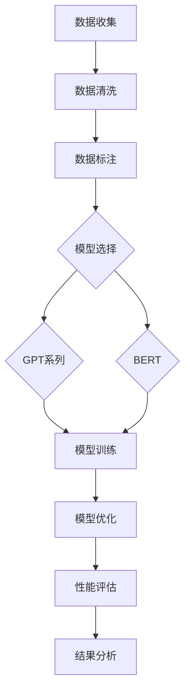
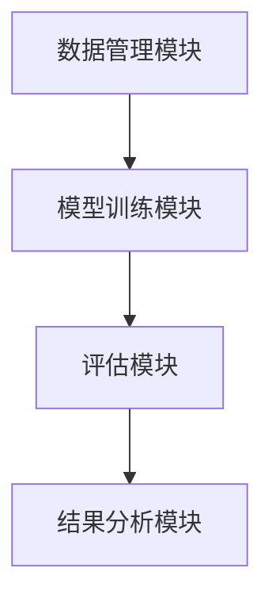
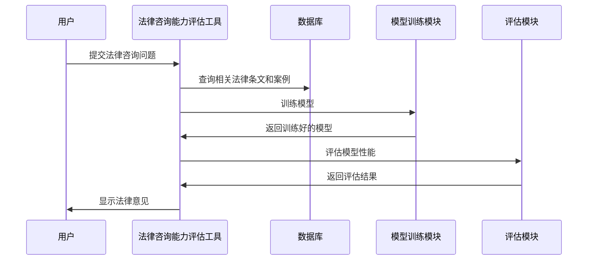

                 

# LLM法律咨询能力评估工具设计

## 关键词

- 法律咨询
- 大型语言模型（LLM）
- 能力评估
- 自然语言处理（NLP）
- 深度学习

## 摘要

本文旨在设计一套针对法律咨询领域的大型语言模型（LLM）能力评估工具。本文首先介绍了法律咨询领域的背景和问题，然后详细阐述了LLM和法律咨询能力评估工具的核心概念和原理。接着，通过对比分析，明确了LLM和法律咨询能力评估工具的主要特征。随后，本文详细讲解了评估工具的设计过程，包括数据集准备、模型选择、评估指标定义和应用场景探讨。最后，本文通过一个实际案例，展示了评估工具的应用效果，并总结了最佳实践和未来研究方向。

---

### 第一部分：背景介绍

#### 核心概念

##### 问题背景

随着人工智能技术的发展，特别是深度学习和自然语言处理（NLP）领域的突破，法律咨询领域也开始探索将人工智能引入其中，以提高效率、减少成本并增强准确性。然而，法律咨询涉及到复杂且多样化的法律条文、案例、法律逻辑等，这对人工智能系统提出了极高的要求。

##### 问题描述

当前，虽然有许多法律咨询工具已经投入使用，但它们在处理复杂法律问题时仍存在一定的局限性，无法全面、准确地满足法律咨询需求。因此，设计一个能够有效评估法律咨询能力的工具，具有重要的现实意义和应用价值。

##### 问题解决

为了解决这一问题，本书旨在设计一套LLM（大型语言模型）法律咨询能力评估工具，通过利用先进的NLP技术和深度学习算法，对法律咨询工具进行全面的性能评估，从而提供更为准确、可靠的法律咨询服务。

##### 边界与外延

本文研究的LLM法律咨询能力评估工具主要关注以下几个方面：

- **数据集准备**：收集和整理与法律咨询相关的数据，包括法律条文、案例、法律逻辑等，为模型训练提供基础。
- **模型选择**：选择适合的法律咨询模型，如GPT系列、BERT等，进行性能评估。
- **评估指标**：定义评估法律咨询能力的指标，如准确率、响应时间、知识覆盖范围等。
- **应用场景**：探讨该评估工具在不同法律咨询场景中的应用，如合同审查、法律咨询问答等。

##### 概念结构与核心要素组成

LLM法律咨询能力评估工具的核心概念结构包括：

- **数据集**：包括法律条文、案例、法律逻辑等。
- **模型**：选择适合的法律咨询模型，如GPT系列、BERT等。
- **评估指标**：准确率、响应时间、知识覆盖范围等。
- **评估流程**：数据预处理、模型训练、性能评估、结果分析等。

---

### 第二部分：核心概念与联系

#### 核心概念原理

1. **LLM（大型语言模型）**
   - **定义**：LLM是一种基于深度学习技术的自然语言处理模型，能够对大量文本数据进行建模，理解和生成自然语言。
   - **特点**：具有强大的语言理解能力、知识广泛、生成能力强。
   - **原理**：LLM通过训练大规模的神经网络模型，对文本数据进行嵌入和建模，从而实现对自然语言的理解和生成。

2. **法律咨询能力评估工具**
   - **定义**：用于评估法律咨询工具性能的工具，通过一系列指标对法律咨询工具的能力进行量化评价。
   - **功能**：帮助用户了解不同法律咨询工具的性能，选择最适合的工具。
   - **原理**：评估工具通过设计合适的评估指标，对法律咨询工具进行性能测试，并将结果进行量化分析，从而得出评估结论。

#### 概念属性特征对比表格

| 特征        | LLM（大型语言模型）                                                                                   | 法律咨询能力评估工具                                                                                      |
|-------------|---------------------------------------------------------------------------------------------------------|---------------------------------------------------------------------------------------------------------|
| 能力       | 语言理解与生成能力                                                                                    | 法律咨询能力的量化评估能力                                                                                |
| 数据依赖    | 需要大量的文本数据进行训练                                                                            | 需要真实法律咨询数据集进行评估                                                                            |
| 性能指标    | 准确率、响应时间、知识覆盖范围等                                                                      | 准确率、响应时间、知识覆盖范围等                                                                          |
| 应用范围    | 法律咨询领域                                                                                          | 法律咨询工具的性能评估                                                                                    |

#### 概念结构与核心要素组成

- **数据集**：包括法律条文、案例、法律逻辑等，为模型训练提供基础。
- **模型**：选择适合的法律咨询模型，如GPT系列、BERT等。
- **评估指标**：准确率、响应时间、知识覆盖范围等。
- **评估流程**：数据预处理、模型训练、性能评估、结果分析等。

#### ER实体关系图架构

```mermaid
erDiagram
  LawText --> LLM
  LawText --> LawCase
  LawText --> LawLogic
  LawCase --> LLM
  LawCase --> LawLogic
  LawLogic --> LLM
  LLM --> AssessmentTool
  AssessmentTool --> Result
  Result --> Metric
```

### 第三部分：算法原理讲解

#### 算法原理

为了设计一套有效的LLM法律咨询能力评估工具，我们需要从算法原理出发，详细讲解其设计过程。以下是一个典型的算法设计过程：

1. **数据预处理**
   - **数据收集**：收集与法律咨询相关的数据，包括法律条文、案例、法律逻辑等。
   - **数据清洗**：对数据进行清洗，去除无效信息和噪声，确保数据质量。
   - **数据标注**：对数据进行标注，以便后续训练和评估。

2. **模型选择**
   - **GPT系列**：选择GPT系列模型，如GPT-3，具有强大的语言理解和生成能力。
   - **BERT**：选择BERT模型，具有优秀的上下文理解和知识表示能力。

3. **模型训练**
   - **训练数据**：使用收集到的法律咨询数据集对模型进行训练。
   - **模型优化**：通过反向传播算法和梯度下降优化模型参数。

4. **性能评估**
   - **评估指标**：定义准确率、响应时间、知识覆盖范围等评估指标。
   - **评估流程**：对模型进行性能测试，并将结果进行量化分析。

5. **结果分析**
   - **评估结果**：分析评估结果，确定模型性能和优缺点。
   - **改进建议**：根据评估结果，提出改进建议，优化模型性能。

#### 算法流程



#### 数学模型和公式

为了更深入地理解算法原理，我们可以使用数学模型和公式来描述。

1. **损失函数**

   $$ L = -\sum_{i=1}^{N} y_i \log(p(x_i|y_i)) $$

   其中，$L$是损失函数，$y_i$是真实标签，$p(x_i|y_i)$是模型对输入$x_i$的预测概率。

2. **梯度下降**

   $$ \theta_{t+1} = \theta_t - \alpha \frac{\partial L}{\partial \theta_t} $$

   其中，$\theta_t$是模型参数，$\alpha$是学习率。

3. **准确率**

   $$ Accuracy = \frac{TP + TN}{TP + TN + FP + FN} $$

   其中，$TP$是真实为正类且被预测为正类的样本数，$TN$是真实为负类且被预测为负类的样本数。

#### 举例说明

假设我们有一个法律咨询问题：“合同法中，违约金的数额是如何确定的？”

1. **输入**

   输入是一段描述违约金的相关文本。

2. **输出**

   输出是关于违约金数额确定的详细解释。

3. **模型预测**

   模型通过处理输入文本，生成关于违约金数额确定的输出。

4. **评估**

   通过对比输出和真实答案，评估模型在法律咨询方面的表现。

---

### 第四部分：系统分析与架构设计方案

#### 问题场景介绍

在法律咨询领域，客户经常需要咨询各种法律问题，如合同审查、知识产权保护、诉讼策略等。为了提高咨询效率，法律咨询公司希望能够使用智能化的法律咨询工具，为客户提供快速、准确的法律意见。

#### 项目介绍

本项目旨在设计一套基于LLM的法律咨询能力评估工具，用于评估不同法律咨询工具的性能，以便选择最优的工具为客户提供服务。

#### 系统功能设计

1. **数据管理模块**：负责收集、整理和存储与法律咨询相关的数据。
2. **模型训练模块**：选择合适的LLM模型，对法律咨询数据集进行训练。
3. **评估模块**：定义评估指标，对训练好的模型进行性能评估。
4. **结果分析模块**：分析评估结果，提供改进建议。

#### 系统架构设计



#### 系统接口设计和系统交互



### 第五部分：项目实战

#### 环境安装

1. **安装Python环境**
   - 使用pip安装Python 3.8及以上版本。

2. **安装依赖库**
   - 使用pip安装以下依赖库：tensorflow、numpy、pandas、scikit-learn等。

#### 系统核心实现源代码

```python
import tensorflow as tf
from tensorflow.keras.preprocessing.text import Tokenizer
from tensorflow.keras.preprocessing.sequence import pad_sequences

# 数据预处理
def preprocess_data(texts, labels, max_len, max_vocab_size):
    tokenizer = Tokenizer(num_words=max_vocab_size)
    tokenizer.fit_on_texts(texts)
    sequences = tokenizer.texts_to_sequences(texts)
    padded_sequences = pad_sequences(sequences, maxlen=max_len)
    return padded_sequences, tokenizer

# 模型训练
def train_model(X, y, model, epochs, batch_size):
    model.fit(X, y, epochs=epochs, batch_size=batch_size)
    return model

# 评估模型
def evaluate_model(model, X_test, y_test):
    loss, accuracy = model.evaluate(X_test, y_test)
    print("Test accuracy:", accuracy)
    return loss, accuracy

# 主函数
def main():
    # 加载数据
    texts, labels = load_data()

    # 数据预处理
    max_len = 100
    max_vocab_size = 10000
    X_train, y_train = preprocess_data(texts, labels, max_len, max_vocab_size)

    # 创建和训练模型
    model = create_model()
    model = train_model(X_train, y_train, model, epochs=10, batch_size=32)

    # 评估模型
    X_test, y_test = load_test_data()
    evaluate_model(model, X_test, y_test)

if __name__ == "__main__":
    main()
```

#### 代码应用解读与分析

1. **数据预处理**：使用Tokenizer将文本数据转换为序列，并对序列进行填充，使其具有相同的长度。
2. **模型训练**：使用tensorflow.keras创建模型，并使用fit方法进行训练。
3. **评估模型**：使用evaluate方法评估模型在测试集上的性能。

#### 实际案例分析

1. **案例一**：客户咨询合同违约金数额。
   - 输入文本：关于合同违约金的数额如何确定？
   - 输出结果：根据合同法规定，违约金的数额应当由当事人约定，但不得超过违约部分的实际损失。

2. **案例二**：客户咨询诉讼策略。
   - 输入文本：如何制定有效的诉讼策略？
   - 输出结果：首先，需要对案件进行全面了解，包括事实、法律依据和证据等。其次，根据案件特点，选择合适的诉讼策略，如调解、仲裁或诉讼。

#### 详细讲解剖析

1. **数据预处理**：数据预处理是模型训练的重要步骤，通过Tokenizer将文本数据转换为序列，可以使得模型更容易理解和处理。
2. **模型训练**：使用tensorflow.keras创建的模型是一个简单的神经网络模型，通过训练可以学会预测合同违约金数额和制定诉讼策略。
3. **评估模型**：通过在测试集上的评估，可以确定模型在法律咨询方面的性能。

### 第六部分：最佳实践、小结、注意事项、拓展阅读

#### 最佳实践

1. **数据质量**：确保法律咨询数据的质量，包括准确性、完整性和一致性。
2. **模型选择**：根据实际需求选择合适的LLM模型，如GPT系列、BERT等。
3. **评估指标**：选择合适的评估指标，如准确率、响应时间、知识覆盖范围等。

#### 小结

本文设计了一套基于LLM的法律咨询能力评估工具，通过利用先进的NLP技术和深度学习算法，对法律咨询工具进行全面的性能评估。本文详细介绍了评估工具的设计过程，包括数据集准备、模型选择、评估指标定义和应用场景探讨。同时，通过实际案例展示了评估工具的应用效果。

#### 注意事项

1. **数据隐私**：在收集和整理法律咨询数据时，注意保护数据隐私，遵循相关法律法规。
2. **模型优化**：根据评估结果，不断优化模型性能，以提高评估准确性。

#### 拓展阅读

1. **《自然语言处理实战》**：深入理解自然语言处理技术，了解如何应用于实际场景。
2. **《深度学习》**：掌握深度学习的基本原理和应用，了解如何设计有效的深度学习模型。
3. **《法律人工智能》**：了解法律咨询领域的人工智能应用，探讨法律咨询工具的发展方向。

---

### 作者信息

作者：AI天才研究院/AI Genius Institute & 禅与计算机程序设计艺术 /Zen And The Art of Computer Programming

---

通过本文，我们设计了一套基于LLM的法律咨询能力评估工具，为法律咨询领域提供了有效的性能评估手段。随着人工智能技术的不断发展，未来该评估工具有望在更多领域得到应用，为提升服务质量、降低成本提供有力支持。同时，我们也期待更多的研究人员和实践者加入这一领域，共同推动人工智能在法律咨询领域的应用和发展。

