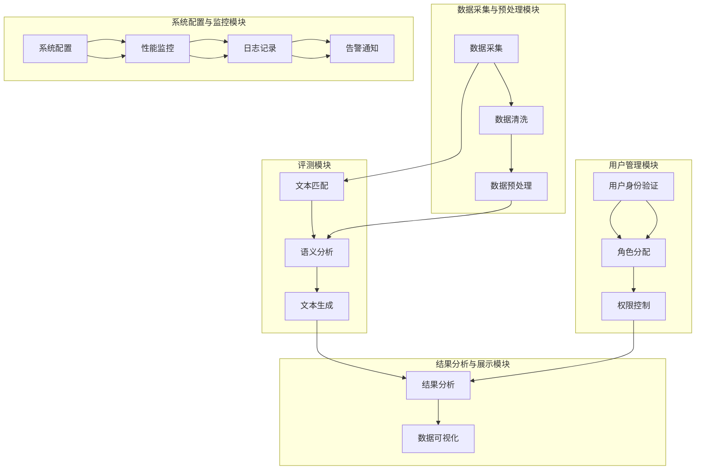
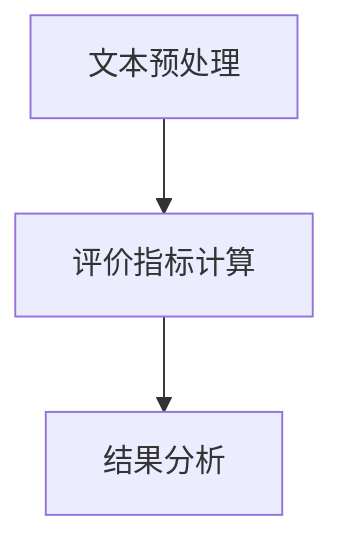

                 


### LLMS评估的多租户SaaS平台设计

#### 关键词：
- **LLM**（大型语言模型）
- **多租户SaaS平台**
- **设计原则**
- **性能优化**
- **算法实现**

#### 摘要：
本文旨在深入探讨大型语言模型（LLM）评估的多租户SaaS平台的设计与实现。文章首先介绍了LLM和SaaS平台的背景知识，然后详细分析了多租户架构的设计原理和实现策略。接着，文章介绍了LLM评测平台的整体功能模块设计，包括数据采集、预处理、评测和结果分析模块。随后，文章讲解了LLM评测算法的原理和实现，并使用Python代码进行了详细阐述。在此基础上，文章进一步探讨了平台的具体系统实现、部署和性能优化策略。最后，通过实际项目案例，文章展示了平台设计、实现和部署的全过程，并提出了最佳实践和未来展望。

### 目录

1. **背景与概述**
   1.1 **LLM评测的需求与挑战**
   1.2 **多租户SaaS平台的概念与特点**
   1.3 **本书内容结构与目标读者**

2. **多租户架构设计原理**
   2.1 **多租户架构的核心概念**
   2.2 **多租户数据库设计策略**
   2.3 **多租户权限控制机制**

3. **LLM评测平台功能模块设计**
   3.1 **平台总体架构设计**
   3.2 **数据采集与预处理模块**
   3.3 **评测模块设计**
   3.4 **结果分析与展示模块**

4. **LLM评测算法原理与实现**
   4.1 **LLM评测算法概述**
   4.2 **算法流程与mermaid流程图**
   4.3 **算法数学模型与公式解释**
   4.4 **算法Python代码实现与解读**

5. **多租户SaaS平台系统实现**
   5.1 **系统环境搭建**
   5.2 **平台核心实现代码解析**
   5.3 **系统接口设计与交互**

6. **平台部署与性能优化**
   6.1 **部署方案与流程**
   6.2 **性能优化策略**
   6.3 **故障处理与系统维护**

7. **项目实战与案例分析**
   7.1 **实际项目背景**
   7.2 **项目核心模块实现**
   7.3 **案例分析与实战经验**
   7.4 **项目总结与反思**

8. **最佳实践与未来展望**
   8.1 **平台运维最佳实践**
   8.2 **平台扩展性设计**
   8.3 **行业发展趋势与未来方向**
   8.4 **小结与拓展阅读**

### 第一部分: 平台设计与实现基础

#### 第1章: LLM评测背景与多租户SaaS平台概述

##### 1.1 LLM评测的需求与挑战

大型语言模型（LLM）作为一种先进的人工智能技术，广泛应用于自然语言处理、机器翻译、文本生成等领域。随着LLM的规模和复杂性不断增加，对其进行评测的需求也日益迫切。LLM评测不仅需要考虑模型的准确性、效率、稳定性等指标，还要应对数据量大、模型复杂度高、评测指标多样性等挑战。

首先，LLM评测需要处理大量的数据。由于LLM的训练和评估通常涉及数百万甚至数十亿个参数，因此需要高效的数据处理机制来确保评测的准确性和效率。其次，LLM模型的复杂性使得评测过程更加复杂。不同类型的LLM（如语言生成模型、机器翻译模型等）具有不同的特点和需求，因此需要定制化的评测策略和方法。此外，评测指标的多维度性也是一大挑战。除了传统的准确性、召回率等指标外，还需要考虑模型的可解释性、公平性、鲁棒性等新兴指标。

##### 1.2 多租户SaaS平台的概念与特点

多租户SaaS平台是一种基于云计算的服务架构，它允许多个用户或组织在同一平台上的独立运行和共享资源。多租户架构具有以下特点：

1. **资源共享**：多租户平台允许多个用户共享同一物理资源，从而提高资源利用率和降低成本。
2. **独立隔离**：每个租户在多租户平台上具有独立的运行环境和数据空间，确保数据安全和隐私。
3. **灵活性**：多租户平台可以根据用户需求进行灵活的资源分配和功能扩展。
4. **可伸缩性**：多租户架构支持水平扩展和垂直扩展，以满足不断增长的用户需求。

在LLM评测的多租户SaaS平台设计中，多租户架构的优势在于：

1. **资源高效利用**：多个租户可以共享同一套LLM评测系统，提高硬件资源的利用率和降低维护成本。
2. **数据隔离**：每个租户的数据独立存储，确保数据的安全性和隐私性。
3. **灵活部署**：租户可以根据自身需求定制化的评测服务和配置，提高用户体验。
4. **可伸缩性**：平台可以根据用户规模和需求进行弹性扩展，支持大规模并发评测。

##### 1.3 本书内容结构与目标读者

本书旨在为读者提供关于LLM评测多租户SaaS平台设计的全面指导和实践经验。本书的内容结构如下：

1. **第一部分：平台设计与实现基础**：介绍LLM评测的需求与挑战、多租户SaaS平台的概念与特点，以及平台功能模块设计。
2. **第二部分：算法原理与实现**：讲解LLM评测算法的原理、流程和实现。
3. **第三部分：系统实现与部署**：详细讨论平台的具体实现、部署和性能优化。
4. **第四部分：项目实战与案例分析**：通过实际项目案例展示平台设计、实现和部署的全过程。
5. **第五部分：最佳实践与未来展望**：总结平台运维最佳实践，探讨行业发展趋势和未来方向。

本书的目标读者包括：

1. **人工智能研究人员和工程师**：对LLM评测和多租户SaaS平台设计有兴趣的专业人士。
2. **软件开发人员和架构师**：需要构建和维护LLM评测平台的工程师和架构师。
3. **学术界和工业界的研究者**：关注LLM评测和云计算领域的研究者和从业者。

通过阅读本书，读者将能够：

1. **了解LLM评测的需求与挑战**：掌握LLM评测的核心问题和挑战。
2. **掌握多租户SaaS平台的设计原理**：理解多租户架构的优势和实现策略。
3. **设计高效的LLM评测平台**：掌握平台功能模块设计的方法和技巧。
4. **实现和部署LLM评测平台**：了解平台的具体实现和部署流程。
5. **优化平台性能**：学习平台性能优化的策略和方法。
6. **实践经验与案例分析**：通过实际项目案例学习平台设计和实现的实践经验。

#### 第2章: 多租户架构设计原理

##### 2.1 多租户架构的核心概念

多租户架构是一种分布式系统架构，它允许多个用户或组织在同一系统环境中独立运行和共享资源。在多租户架构中，每个租户都具有独立的运行环境和数据空间，但共享同一套系统资源。多租户架构的核心概念包括：

1. **租户**：租户是使用系统资源进行计算、存储和服务的用户或组织。租户可以是企业、组织或个人。
2. **资源池**：资源池是指系统中的所有可用资源，包括计算资源（CPU、内存等）、存储资源和网络资源。资源池由系统管理员统一管理和分配。
3. **隔离**：多租户架构通过隔离机制确保每个租户的数据和运行环境独立，避免数据泄露和互相干扰。
4. **灵活性**：多租户架构可以根据用户需求灵活分配和调整资源，提高系统的可扩展性和灵活性。

##### 2.2 多租户数据库设计策略

在多租户架构中，数据库设计是关键的一环。多租户数据库设计需要考虑以下几个方面：

1. **数据隔离**：确保每个租户的数据独立存储和管理，避免数据泄露和干扰。常用的方法包括：
   - **数据分区**：将不同租户的数据存储在独立的数据库或表空间中。
   - **数据隔离**：使用数据库权限和访问控制策略，确保租户只能访问自己的数据。
   - **虚拟数据库**：为每个租户创建一个虚拟数据库，将实际的数据存储在共享数据库中。

2. **性能优化**：多租户数据库需要支持大量并发读写操作，因此需要采用性能优化策略，包括：
   - **索引优化**：创建适当的索引，提高查询性能。
   - **缓存机制**：使用缓存技术，减少数据库访问次数，提高系统响应速度。
   - **读写分离**：将读操作和写操作分离到不同的数据库实例中，提高系统的并发能力。

3. **扩展性**：多租户数据库设计需要考虑系统的扩展性，包括：
   - **水平扩展**：通过增加数据库节点，提高系统的处理能力。
   - **垂直扩展**：通过增加硬件资源，如CPU、内存等，提高系统的性能。

##### 2.3 多租户权限控制机制

多租户权限控制机制是确保租户数据和资源安全的重要手段。多租户权限控制机制需要考虑以下几个方面：

1. **用户身份验证**：确保只有经过身份验证的用户才能访问系统。常用的身份验证方法包括密码验证、双因素认证等。

2. **角色和权限管理**：将用户划分为不同的角色，并分配相应的权限。常见的角色包括管理员、开发人员、测试人员等。

3. **细粒度访问控制**：采用基于属性的访问控制（ABAC）或基于角色的访问控制（RBAC）机制，确保用户只能访问自己的数据和资源。

4. **审计和监控**：对用户操作进行审计和监控，及时发现和阻止违规行为。

##### 2.4 多租户架构的优势和挑战

多租户架构具有以下优势：

1. **资源共享**：多个租户可以共享同一套系统资源，降低成本和提高资源利用率。

2. **独立隔离**：每个租户拥有独立的运行环境和数据空间，确保数据安全和隐私。

3. **灵活性**：租户可以根据自身需求定制化的系统和功能，提高用户体验。

4. **可伸缩性**：多租户架构支持水平扩展和垂直扩展，适应不断增长的用户需求。

然而，多租户架构也面临一些挑战：

1. **性能瓶颈**：大量租户的并发访问可能导致系统性能下降。

2. **数据隔离难度**：确保数据隔离和安全是一项复杂的工作，需要采用多种技术手段。

3. **资源分配**：如何公平合理地分配系统资源，确保每个租户得到适当的资源份额，是设计多租户架构时需要考虑的问题。

4. **安全性**：确保系统安全，防止数据泄露和非法访问，是多租户架构需要重点关注的方面。

### 第3章: LLM评测平台功能模块设计

##### 3.1 平台总体架构设计

LLM评测平台的总体架构设计应充分考虑功能模块的独立性、扩展性和可维护性。总体架构可分为以下几个模块：

1. **数据采集与预处理模块**：负责从各种数据源采集文本数据，并进行数据清洗、去重、格式转换等预处理操作。

2. **评测模块**：负责执行LLM评测算法，包括文本匹配、语义分析、文本生成等任务。

3. **结果分析与展示模块**：对评测结果进行分析和可视化展示，提供直观的图表和数据报告。

4. **用户管理模块**：负责用户身份验证、角色分配和权限控制，确保系统的安全性和数据隔离。

5. **系统配置与监控模块**：提供系统配置参数的设置和监控功能，包括性能监控、日志记录和告警通知。

总体架构设计如图3-1所示：



##### 3.2 数据采集与预处理模块

数据采集与预处理模块是LLM评测平台的核心模块之一，其主要功能包括：

1. **数据采集**：从各种数据源（如互联网、数据库、文件系统等）采集文本数据。

2. **数据清洗**：对采集到的数据进行清洗，去除无关信息、纠正错误、去除停用词等。

3. **数据去重**：检测并去除重复的数据，确保数据的唯一性和准确性。

4. **格式转换**：将不同格式的文本数据转换为统一的格式，便于后续处理。

数据采集与预处理模块的设计应考虑以下几个方面：

1. **数据来源多样性**：支持多种数据源，包括互联网爬虫、数据库连接、文件上传等。

2. **数据质量保障**：通过数据清洗和去重，确保数据的准确性和可靠性。

3. **高效处理**：采用并行处理和分布式计算技术，提高数据采集和预处理的速度。

4. **可扩展性**：设计模块时应考虑未来数据量增加的需求，确保系统可扩展性。

##### 3.3 评测模块设计

评测模块是LLM评测平台的核心，其主要功能包括：

1. **文本匹配**：评估LLM生成的文本与原始文本之间的匹配程度，通常使用BLEU、ROUGE等评价指标。

2. **语义分析**：分析LLM生成的文本的语义信息，评估其语义一致性、准确性等。

3. **文本生成**：根据给定输入，生成符合语法和语义规则的文本。

评测模块的设计应考虑以下几个方面：

1. **算法多样性**：支持多种评测算法，如文本匹配算法、语义分析算法、文本生成算法等。

2. **高效计算**：采用并行计算和分布式计算技术，提高评测速度和效率。

3. **可扩展性**：设计模块时考虑未来算法扩展和性能优化需求。

4. **结果分析**：对评测结果进行深入分析，提供详细的评测报告和可视化图表。

##### 3.4 结果分析与展示模块

结果分析与展示模块的主要功能是对评测结果进行整理和分析，并将其以直观的方式展示给用户。其主要功能包括：

1. **结果分析**：对评测结果进行统计分析，提取关键指标和趋势。

2. **数据可视化**：使用图表、图形等可视化手段展示评测结果，帮助用户快速理解和分析数据。

3. **报告生成**：生成详细的评测报告，包括评测结果、分析结论和可视化图表。

结果分析与展示模块的设计应考虑以下几个方面：

1. **易用性**：设计直观、易用的界面，方便用户快速查看和分析结果。

2. **交互性**：提供交互式功能，允许用户根据需求调整参数、筛选结果等。

3. **灵活性**：设计灵活的报表生成和展示功能，支持多种报表格式和展示方式。

4. **扩展性**：考虑未来需求的变化，确保模块的可扩展性和灵活性。

### 第4章: LLM评测算法原理与实现

##### 4.1 LLM评测算法概述

LLM评测算法主要分为以下几类：

1. **文本匹配算法**：评估LLM生成的文本与原始文本之间的匹配程度，常用的算法包括BLEU、ROUGE、METEOR等。

2. **语义分析算法**：评估LLM生成的文本的语义信息，常用的算法包括BERT、GPT等。

3. **文本生成算法**：根据给定输入生成符合语法和语义规则的文本，常用的算法包括GPT-2、GPT-3等。

在本章中，我们将重点介绍文本匹配算法的原理和实现。

##### 4.2 算法流程与mermaid流程图

文本匹配算法的流程包括以下几个步骤：

1. **文本预处理**：对原始文本和LLM生成的文本进行预处理，包括分词、去停用词等。

2. **评价指标计算**：计算评价指标，如BLEU、ROUGE、METEOR等。

3. **结果分析**：分析评价指标，评估文本匹配程度。

文本匹配算法的mermaid流程图如下：



##### 4.3 算法数学模型与公式解释

文本匹配算法的数学模型通常基于概率模型或统计模型。以下是一个简单的统计模型示例：

设原始文本为T，LLM生成的文本为S。则文本匹配程度可以用以下公式表示：

$$
匹配度 = \frac{ overlap(T, S) }{ length(T) + length(S) - overlap(T, S) }
$$

其中，$overlap(T, S)$表示T和S的公共部分长度，$length(T)$和$length(S)$分别表示T和S的长度。

##### 4.4 算法Python代码实现与解读

下面是一个简单的Python代码示例，实现文本匹配算法：

```python
import string

def preprocess(text):
    # 去除标点符号
    text = text.translate(str.maketrans('', '', string.punctuation))
    # 分词
    words = text.split()
    # 去停用词
    stop_words = set(['a', 'an', 'the', 'and', 'or', 'but'])
    words = [word for word in words if word not in stop_words]
    return ' '.join(words)

def calculate_overlap(text1, text2):
    text1 = preprocess(text1)
    text2 = preprocess(text2)
    common_words = set(text1).intersection(set(text2))
    return len(common_words)

def calculate_match(text1, text2):
    overlap = calculate_overlap(text1, text2)
    length1 = len(preprocess(text1).split())
    length2 = len(preprocess(text2).split())
    return overlap / (length1 + length2 - overlap)

text1 = "I love programming."
text2 = "Programming is my passion."

print("匹配度:", calculate_match(text1, text2))
```

代码解读：

1. **预处理函数**：`preprocess`函数对原始文本进行预处理，包括去除标点符号、分词和去停用词。

2. **公共部分计算函数**：`calculate_overlap`函数计算两个文本的公共部分长度。

3. **匹配度计算函数**：`calculate_match`函数计算两个文本的匹配度，使用公共部分长度除以总长度。

4. **示例**：使用示例文本计算匹配度，并输出结果。

通过上述代码示例，我们可以看到如何实现一个简单的文本匹配算法。在实际应用中，可以根据需求选择合适的算法和评价指标，进行更精细的文本匹配评估。

### 第5章: 多租户SaaS平台系统实现

#### 5.1 系统环境搭建

搭建多租户SaaS平台需要考虑硬件、软件和网络环境等多个方面。以下是一个基本的系统环境搭建方案：

1. **硬件环境**：服务器（如Dell R740、AWS EC2等），存储设备（如SSD硬盘、NAS等），网络设备（如路由器、交换机等）。

2. **软件环境**：
   - 操作系统：Linux发行版（如CentOS、Ubuntu等）
   - 服务器软件：Nginx（Web服务器）、Apache（Web服务器）、Tomcat（Java应用服务器）等
   - 数据库软件：MySQL、PostgreSQL等关系型数据库，MongoDB、Cassandra等NoSQL数据库
   - 容器化技术：Docker、Kubernetes等

3. **网络环境**：公网IP地址、防火墙配置、负载均衡等。

4. **开发工具**：IDE（如IntelliJ IDEA、VS Code等），版本控制工具（如Git）。

#### 5.2 平台核心实现代码解析

在多租户SaaS平台中，核心实现代码主要集中在以下几个方面：

1. **用户管理模块**：实现用户注册、登录、权限管理等功能。以下是一个简单的用户管理模块代码示例：

```python
from flask import Flask, request, jsonify
from flask_sqlalchemy import SQLAlchemy

app = Flask(__name__)
app.config['SQLALCHEMY_DATABASE_URI'] = 'sqlite:///users.db'
db = SQLAlchemy(app)

class User(db.Model):
    id = db.Column(db.Integer, primary_key=True)
    username = db.Column(db.String(80), unique=True, nullable=False)
    password = db.Column(db.String(120), nullable=False)
    role = db.Column(db.String(80), nullable=False)

@app.route('/register', methods=['POST'])
def register():
    username = request.form['username']
    password = request.form['password']
    role = request.form['role']
    if User.query.filter_by(username=username).first():
        return jsonify({'error': '用户已存在'})
    new_user = User(username=username, password=password, role=role)
    db.session.add(new_user)
    db.session.commit()
    return jsonify({'message': '注册成功'})

@app.route('/login', methods=['POST'])
def login():
    username = request.form['username']
    password = request.form['password']
    user = User.query.filter_by(username=username, password=password).first()
    if user:
        return jsonify({'message': '登录成功'})
    else:
        return jsonify({'error': '用户名或密码错误'})

if __name__ == '__main__':
    db.create_all()
    app.run(debug=True)
```

2. **数据采集与预处理模块**：实现数据采集、清洗、去重等功能。以下是一个简单的数据采集与预处理模块代码示例：

```python
import requests
import json

def fetch_data(url):
    response = requests.get(url)
    if response.status_code == 200:
        return json.loads(response.text)
    else:
        return None

def preprocess_data(data):
    # 数据清洗、去重、格式转换等操作
    # 示例：去除标点符号、分词、去停用词等
    return data

url = 'https://api.example.com/data'
data = fetch_data(url)
if data:
    preprocessed_data = preprocess_data(data)
    print(preprocessed_data)
else:
    print('数据获取失败')
```

3. **评测模块**：实现LLM评测算法，包括文本匹配、语义分析、文本生成等功能。以下是一个简单的评测模块代码示例：

```python
from text_match import calculate_match
from semantic_analysis import analyze_semantics
from text_generation import generate_text

def evaluate_text(original_text, generated_text):
    match_score = calculate_match(original_text, generated_text)
    semantics_score = analyze_semantics(generated_text)
    generated_text = generate_text(original_text)
    return match_score, semantics_score, generated_text

original_text = "I love programming."
generated_text = "Programming is my passion."

match_score, semantics_score, generated_text = evaluate_text(original_text, generated_text)
print("匹配度:", match_score)
print("语义分析得分:", semantics_score)
print("生成的文本:", generated_text)
```

4. **结果分析与展示模块**：实现结果分析、数据可视化、报告生成等功能。以下是一个简单的结果分析与展示模块代码示例：

```python
import matplotlib.pyplot as plt
import pandas as pd

def generate_report(results):
    df = pd.DataFrame(results, columns=['Match Score', 'Semantics Score'])
    df['Average Score'] = df[['Match Score', 'Semantics Score']].mean(axis=1)
    df.plot(x='Match Score', y='Average Score', kind='line')
    plt.xlabel('Match Score')
    plt.ylabel('Average Score')
    plt.title('Text Evaluation Report')
    plt.show()

results = [
    {'Match Score': 0.8, 'Semantics Score': 0.9},
    {'Match Score': 0.7, 'Semantics Score': 0.8},
    {'Match Score': 0.6, 'Semantics Score': 0.7}
]

generate_report(results)
```

通过以上代码示例，我们可以看到多租户SaaS平台核心模块的实现框架。在实际开发中，需要根据具体需求进一步优化和扩展这些模块。

#### 5.3 系统接口设计与交互

在多租户SaaS平台中，系统接口的设计和交互是保证各模块之间高效协作的关键。以下是一些常见的系统接口设计要点：

1. **API接口设计**：
   - **RESTful API**：采用RESTful风格设计API接口，便于客户端访问和调用。
   - **接口版本管理**：为API接口设置版本号，便于后续接口升级和维护。
   - **接口权限控制**：根据用户角色和权限，控制对接口的访问和操作。

2. **接口文档**：
   - **Swagger**：使用Swagger等工具生成接口文档，便于客户端了解和使用API接口。
   - **接口描述**：详细描述每个接口的URL、请求参数、响应格式等。

3. **交互协议**：
   - **HTTP协议**：使用HTTP协议进行接口通信，支持GET、POST、PUT、DELETE等常用方法。
   - **JSON格式**：使用JSON格式传递请求和响应数据，便于解析和处理。

4. **异步处理**：
   - **消息队列**：使用消息队列（如RabbitMQ、Kafka等）进行异步处理，提高系统并发能力和性能。

5. **安全性**：
   - **认证和授权**：使用JWT、OAuth等机制进行用户认证和授权，确保接口安全性。
   - **数据加密**：对敏感数据进行加密处理，确保数据传输安全。

以下是一个简单的API接口设计示例：

```json
{
  "paths": {
    "/users/register": {
      "post": {
        "summary": "用户注册",
        "description": "用于用户注册的API接口",
        "parameters": [
          {
            "name": "username",
            "in": "query",
            "required": true,
            "description": "用户名"
          },
          {
            "name": "password",
            "in": "query",
            "required": true,
            "description": "密码"
          }
        ],
        "responses": {
          "200": {
            "description": "注册成功"
          },
          "400": {
            "description": "参数错误"
          },
          "409": {
            "description": "用户已存在"
          }
        }
      }
    },
    "/users/login": {
      "post": {
        "summary": "用户登录",
        "description": "用于用户登录的API接口",
        "parameters": [
          {
            "name": "username",
            "in": "query",
            "required": true,
            "description": "用户名"
          },
          {
            "name": "password",
            "in": "query",
            "required": true,
            "description": "密码"
          }
        ],
        "responses": {
          "200": {
            "description": "登录成功"
          },
          "401": {
            "description": "用户名或密码错误"
          }
        }
      }
    }
  }
}
```

通过以上接口设计示例，我们可以看到如何定义API接口的URL、请求参数、响应格式等。在实际开发中，可以根据需求进一步优化和细化接口设计。

### 第6章: 平台部署与性能优化

#### 6.1 部署方案与流程

为了确保多租户SaaS平台的高可用性、可扩展性和可靠性，我们需要制定一套详细的部署方案和流程。以下是一个典型的部署方案和流程：

1. **环境准备**：
   - **硬件准备**：确保服务器、存储设备、网络设备等硬件资源充足。
   - **软件准备**：安装操作系统、数据库、Web服务器、应用服务器等软件环境。

2. **容器化部署**：
   - **Docker镜像**：创建Docker镜像，将平台应用打包为镜像文件。
   - **Docker Compose**：使用Docker Compose定义和启动容器化应用。

3. **负载均衡**：
   - **Nginx**：配置Nginx作为负载均衡器，将用户请求分发到多个应用容器。

4. **数据库部署**：
   - **主从复制**：配置主从数据库，提高数据备份和故障恢复能力。
   - **读写分离**：配置读写分离，提高数据库性能和并发能力。

5. **监控与告警**：
   - **Prometheus**：配置Prometheus进行系统监控和数据采集。
   - **Alertmanager**：配置Alertmanager进行告警通知和事件处理。

6. **部署流程**：
   - **容器化构建**：使用Docker命令构建Docker镜像。
   - **容器编排**：使用Docker Compose编排和启动容器。
   - **负载均衡配置**：配置Nginx进行负载均衡。
   - **数据库配置**：配置主从数据库和读写分离。
   - **监控与告警配置**：配置Prometheus和Alertmanager进行监控和告警。

以下是一个简单的部署流程示例：

1. **创建Dockerfile**：编写Dockerfile，定义应用容器镜像。
2. **构建镜像**：运行`docker build`命令构建容器镜像。
3. **启动容器**：使用Docker Compose启动容器化应用。
4. **配置Nginx**：配置Nginx进行负载均衡。
5. **配置数据库**：配置主从数据库和读写分离。
6. **配置监控与告警**：配置Prometheus和Alertmanager。

```bash
# 创建Dockerfile
docker build -t llm-evaluation-platform .

# 启动容器化应用
docker-compose up -d

# 配置Nginx
sudo nano /etc/nginx/conf.d/llm-evaluation.conf

# 配置主从数据库
# ...

# 配置监控与告警
# ...
```

#### 6.2 性能优化策略

为了确保多租户SaaS平台在高并发、大数据环境下能够稳定运行，我们需要采取一系列性能优化策略。以下是一些常用的性能优化策略：

1. **垂直扩展**：
   - **增加CPU和内存**：增加服务器的CPU和内存资源，提高应用性能。
   - **使用高性能硬件**：使用SSD硬盘、高性能网络设备等硬件设备，提高系统性能。

2. **水平扩展**：
   - **增加服务器节点**：增加应用服务器的节点数量，实现负载均衡和分布式处理。
   - **数据库分片**：对数据库进行分片，提高数据库的读写性能。

3. **缓存机制**：
   - **内存缓存**：使用Redis、Memcached等内存缓存技术，减少数据库访问次数。
   - **页面缓存**：使用Nginx等Web服务器配置页面缓存，提高页面响应速度。

4. **异步处理**：
   - **消息队列**：使用消息队列（如RabbitMQ、Kafka等）进行异步处理，提高系统并发能力和性能。

5. **数据库优化**：
   - **索引优化**：创建合适的索引，提高数据库查询性能。
   - **读写分离**：配置读写分离，提高数据库性能和并发能力。

6. **代码优化**：
   - **减少数据库查询次数**：优化数据库查询，减少查询次数和复杂度。
   - **使用缓存技术**：在代码中使用缓存技术，减少重复计算和查询。

7. **负载均衡**：
   - **配置负载均衡器**：配置Nginx、HAProxy等负载均衡器，实现负载均衡和故障转移。

以下是一个简单的性能优化策略示例：

1. **增加服务器资源**：
   - **CPU和内存**：增加服务器的CPU和内存资源，提高应用性能。
   - **硬盘**：使用SSD硬盘，提高I/O性能。

2. **配置Nginx负载均衡**：
   - **配置文件**：配置Nginx进行负载均衡，将用户请求分发到多个应用服务器。
   - **健康检查**：配置健康检查，实现故障转移。

3. **数据库优化**：
   - **索引优化**：创建合适的索引，提高数据库查询性能。
   - **读写分离**：配置读写分离，提高数据库性能和并发能力。

4. **异步处理**：
   - **消息队列**：使用RabbitMQ进行异步处理，提高系统并发能力和性能。

```bash
# 增加服务器资源
sudo systemctl restart docker

# 配置Nginx负载均衡
sudo nano /etc/nginx/conf.d/llm-evaluation.conf

# 数据库优化
sudo mysqlcheck -o -f -v

# 异步处理
sudo docker run -d --name rabbitmq -p 5672:5672 -p 6

