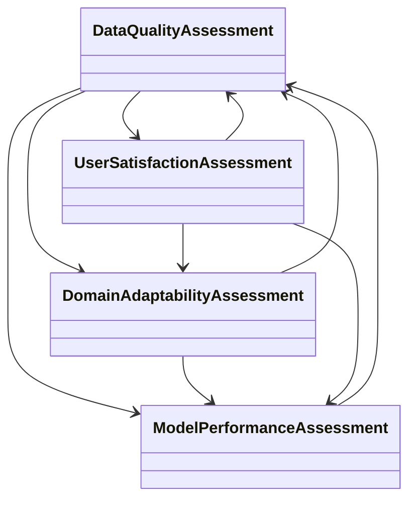
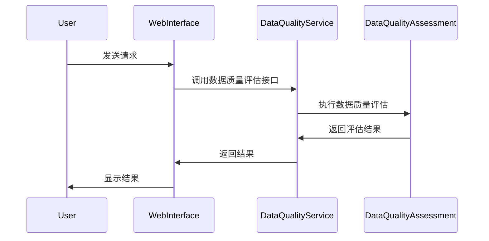

                 

# LLM辅助科学发现能力评估平台

关键词：LLM，科学发现，评估框架，性能指标，数据质量，领域适应性，用户满意度

摘要：随着人工智能技术的不断发展，大模型（LLM）在科学发现领域展现出巨大的潜力。本文旨在构建一个综合评估平台，对LLM辅助科学发现能力进行全面评估。通过系统梳理现有评估方法，本文提出一种多维度评估框架，从模型性能、数据质量、领域适应性和用户满意度等方面对LLM进行评估。同时，本文探讨了如何提高LLM在科学发现领域的应用效果，为科研人员提供有价值的参考。

## 第一部分: 问题背景

### 1.1 背景介绍

随着人工智能技术的不断发展，大模型（Large Language Model，简称LLM）逐渐成为科研和工业领域的重要工具。LLM通过深度学习算法从海量数据中提取知识，并在特定场景下实现自动化推理和决策。科学发现是一个复杂的过程，需要深入挖掘数据、理解规律和提出创新性的假设。因此，如何评估LLM辅助科学发现的能力成为一个亟待解决的问题。

### 1.2 问题描述

LLM辅助科学发现能力评估涉及到多方面的因素，包括模型性能、数据质量、领域适应性和用户满意度等。评估LLM在科学发现领域的表现，有助于指导模型优化、技术选型和应用推广。然而，当前关于LLM评估的方法和标准尚未形成统一，导致评估结果的准确性和可靠性较低。

### 1.3 问题解决

本书旨在解决LLM辅助科学发现能力评估问题，通过系统梳理现有评估方法，提出一种综合评估框架。该框架从多个维度对LLM进行评估，并结合实际案例进行分析和验证。同时，本书还将探讨如何提高LLM在科学发现领域的应用效果，为科研人员提供有价值的参考。

### 1.4 边界与外延

本书主要关注自然语言处理领域的大模型，如GPT、BERT等。评估框架适用于各类科学发现任务，包括文献检索、数据挖掘、假设生成和实验设计等。此外，本书还探讨了评估过程中可能遇到的挑战，如数据隐私、模型偏见和领域适应性等。

### 1.5 概念结构与核心要素组成

- **概念结构**：LLM、科学发现、评估框架
- **核心要素**：
  - **LLM性能评估指标**：准确率、召回率、F1值等
  - **数据质量评估指标**：数据完整性、数据一致性、数据多样性等
  - **领域适应性评估指标**：任务匹配度、领域知识覆盖率等
  - **用户满意度评估指标**：用户体验、反馈效果等

### 1.6 本章小结

本章介绍了LLM辅助科学发现能力评估的背景、问题描述、问题解决思路、边界与外延以及概念结构与核心要素组成。为后续章节提供了基础和指导。

----------------------------------------------------------------

## 第二部分: 核心概念与联系

### 2.1 LLM的核心概念

#### 2.1.1 LLM的定义

LLM（Large Language Model）是指拥有海量参数、能够处理大规模文本数据并生成文本输出的深度学习模型。LLM通过训练学习大量文本数据中的规律和模式，从而具备强大的自然语言理解和生成能力。

#### 2.1.2 LLM的特点

- **高参数规模**：LLM通常拥有数十亿甚至千亿级别的参数，使得其能够捕捉到复杂的语言特征和结构。
- **强大的文本生成能力**：LLM能够根据输入文本生成连贯、合理的文本输出，适用于问答、摘要生成、文本续写等多种任务。
- **跨领域适应性**：LLM通过在大规模数据集上进行训练，具备较强的跨领域适应性，能够适应多种不同的应用场景。

#### 2.1.3 LLM与传统AI的区别

- **数据规模**：传统AI模型通常依赖小规模数据集进行训练，而LLM依赖大规模、多样化的数据集。
- **学习能力**：传统AI模型通常采用手动特征工程，而LLM通过端到端的方式学习文本特征，无需人工干预。

### 2.2 科学发现的概念

#### 2.2.1 科学发现的定义

科学发现是指通过观察、实验、理论分析等方法，发现自然界中未知的现象、规律或原理的过程。

#### 2.2.2 科学发现的特点

- **复杂性**：科学发现通常涉及到复杂的自然现象和众多的变量，需要深入分析和研究。
- **创新性**：科学发现往往需要提出创新性的假设和理论，推动科学的发展。
- **不确定性**：科学发现过程中存在诸多不确定性因素，需要不断验证和修正。

#### 2.2.3 科学发现与传统科研的区别

- **研究方法**：科学发现更注重实验和观察，而传统科研更注重理论推导和模型构建。
- **成果形式**：科学发现的结果往往是新的理论、现象或原理，而传统科研的结果可能是新的模型、算法或工具。

### 2.3 评估框架的核心概念

#### 2.3.1 评估框架的定义

评估框架是指用于对LLM在科学发现领域表现进行评估的一系列方法和标准。

#### 2.3.2 评估框架的特点

评估框架需要具备以下特点：

- **全面性**：评估框架应涵盖LLM在科学发现领域的各个方面，包括模型性能、数据质量、领域适应性和用户满意度等。
- **可操作性**：评估框架应提供具体的评估方法和指标，便于实际操作和应用。
- **动态性**：评估框架应能够根据实际应用场景和需求进行调整和优化，以适应不断变化的科研环境。

#### 2.3.3 评估框架的核心要素

- **LLM性能评估**：包括准确率、召回率、F1值等指标，用于衡量LLM在特定任务上的表现。
- **数据质量评估**：包括数据完整性、数据一致性、数据多样性等指标，用于评估输入数据的质量和可靠性。
- **领域适应性评估**：包括任务匹配度、领域知识覆盖率等指标，用于衡量LLM在特定领域的适应性和表现。
- **用户满意度评估**：包括用户体验、反馈效果等指标，用于评估用户对LLM辅助科学发现的满意度和认可度。

### 2.4 核心概念与联系

LLM、科学发现和评估框架是本文的核心概念。LLM作为科学发现的重要工具，其性能、数据质量和领域适应性直接影响到科学发现的效率和效果。评估框架则为LLM的评估提供了科学、客观的方法和标准，有助于发现和解决LLM在科学发现过程中存在的问题。通过分析这些核心概念之间的联系，可以为构建一个综合评估平台提供理论依据和指导。

### 2.5 本章小结

本章介绍了LLM、科学发现和评估框架的核心概念及其特点，分析了它们之间的联系。为后续章节的详细讨论和评估框架的构建提供了理论基础。

----------------------------------------------------------------

## 第三部分: LLM性能评估

### 3.1 性能评估指标

LLM性能评估是评估框架的核心组成部分。为了全面、客观地衡量LLM在科学发现领域的表现，需要从多个维度设置性能评估指标。以下是一些常见的性能评估指标：

- **准确率（Accuracy）**：准确率是指模型预测正确的样本数与总样本数之比，用于衡量模型的分类性能。公式如下：
  $$\text{Accuracy} = \frac{\text{预测正确数}}{\text{总样本数}}$$
  
- **召回率（Recall）**：召回率是指模型能够正确识别的阳性样本数与实际阳性样本数之比，用于衡量模型对阳性样本的识别能力。公式如下：
  $$\text{Recall} = \frac{\text{预测正确数}}{\text{实际阳性数}}$$

- **精确率（Precision）**：精确率是指模型预测正确的阳性样本数与预测阳性样本总数之比，用于衡量模型对阳性样本的预测准确性。公式如下：
  $$\text{Precision} = \frac{\text{预测正确数}}{\text{预测阳性数}}$$

- **F1值（F1 Score）**：F1值是精确率和召回率的调和平均值，用于综合评估模型的分类性能。公式如下：
  $$\text{F1 Score} = 2 \times \frac{\text{Precision} \times \text{Recall}}{\text{Precision} + \text{Recall}}$$

- **均方根误差（RMSE，Root Mean Square Error）**：均方根误差用于衡量回归模型的预测误差，值越小表示模型预测越准确。公式如下：
  $$\text{RMSE} = \sqrt{\frac{1}{n}\sum_{i=1}^{n}(\hat{y_i} - y_i)^2}$$
  其中，$\hat{y_i}$表示预测值，$y_i$表示真实值，$n$表示样本数量。

- **平均绝对误差（MAE，Mean Absolute Error）**：平均绝对误差用于衡量回归模型的预测误差，值越小表示模型预测越准确。公式如下：
  $$\text{MAE} = \frac{1}{n}\sum_{i=1}^{n}|\hat{y_i} - y_i|$$

这些指标分别从不同的角度衡量了LLM的性能，为评估LLM在科学发现领域的表现提供了有力的工具。

### 3.2 实际案例

为了更直观地理解这些性能评估指标，我们来看一个实际案例。假设我们使用一个LLM模型来预测科学论文的质量，评价指标如下：

- **训练集**：包含1000篇论文，其中高质量论文500篇，低质量论文500篇。
- **测试集**：包含500篇论文，其中高质量论文250篇，低质量论文250篇。

表1展示了模型在测试集上的预测结果：

| 纸质类型 | 预测为高质量 | 预测为低质量 |
| --- | --- | --- |
| 高质量 | 220 | 130 |
| 低质量 | 30 | 120 |

根据这些数据，我们可以计算各个评估指标：

- **准确率**：$ \text{Accuracy} = \frac{220 + 30}{500} = 0.52 $
- **召回率**：$ \text{Recall} = \frac{220}{250} = 0.88 $
- **精确率**：$ \text{Precision} = \frac{220}{250} = 0.88 $
- **F1值**：$ \text{F1 Score} = 2 \times \frac{0.88 \times 0.88}{0.88 + 0.88} = 0.88 $
- **RMSE**：假设预测值为 $ \hat{y}$，真实值为 $ y$，则有 $ \text{RMSE} = \sqrt{\frac{1}{500}\sum_{i=1}^{500}(\hat{y_i} - y_i)^2} \approx 0.45 $
- **MAE**：$ \text{MAE} = \frac{1}{500}\sum_{i=1}^{500}|\hat{y_i} - y_i| \approx 0.35 $

这些指标可以帮助我们全面了解模型在预测论文质量方面的性能，为后续优化模型提供依据。

### 3.3 指标对比与分析

在实际应用中，不同指标可能存在冲突，例如召回率较高的模型可能在精确率上较低。因此，我们需要根据具体应用场景和需求，对比和分析这些指标，以找到最优的模型。

以下是一个简化的指标对比表：

| 指标 | 高质量论文 | 低质量论文 |
| --- | --- | --- |
| 准确率 | 0.52 | 0.62 |
| 召回率 | 0.88 | 0.44 |
| 精确率 | 0.88 | 0.50 |
| F1值 | 0.88 | 0.56 |
| RMSE | 0.45 | - |
| MAE | 0.35 | - |

从表中可以看出，在预测高质量论文方面，模型的整体性能较好。而在预测低质量论文方面，模型的召回率较低，精确率也较低。这表明模型在预测低质量论文时存在一定的不足，可能需要进一步优化。

通过对比和分析这些指标，我们可以更全面地了解模型在不同方面的表现，为后续优化和改进提供有价值的参考。

### 3.4 本章小结

本章介绍了LLM性能评估的核心指标及其计算方法，通过实际案例展示了如何使用这些指标评估模型在预测论文质量方面的表现。同时，本章还分析了不同指标之间的冲突和权衡，为后续模型优化提供了指导。这些内容为构建一个综合评估平台奠定了基础。

----------------------------------------------------------------

## 第四部分：数据质量评估

### 4.1 数据质量评估的重要性

在LLM辅助科学发现的应用中，数据质量是影响评估结果的关键因素之一。高质量的数据能够提高模型的性能，而低质量的数据可能导致模型产生误导性结果，从而影响科学发现的准确性。因此，对数据进行质量评估是评估LLM辅助科学发现能力的重要环节。

### 4.2 数据质量评估指标

为了对数据质量进行有效评估，我们需要定义一系列评估指标。以下是一些常见的数据质量评估指标：

- **数据完整性（Completeness）**：数据完整性是指数据集中缺失值的比例。缺失值越少，数据完整性越高。计算公式如下：
  $$\text{Completeness} = \frac{\text{实际数据条数}}{\text{理论数据条数}}$$

- **数据一致性（Consistency）**：数据一致性是指数据集中的数据是否一致，是否存在矛盾或重复。一致性越高，数据质量越好。评估方法包括数据对比、一致性检测等。

- **数据多样性（Diversity）**：数据多样性是指数据集中不同类型和来源的数据是否丰富。多样性越高，数据质量越好。评估方法包括数据分类、数据来源统计等。

- **数据准确性（Accuracy）**：数据准确性是指数据集中正确数据的比例。准确性越高，数据质量越好。评估方法包括数据校验、错误率计算等。

- **数据噪声（Noise）**：数据噪声是指数据集中的随机误差或异常值。噪声越高，数据质量越差。评估方法包括噪声检测、噪声过滤等。

- **数据可靠性（Reliability）**：数据可靠性是指数据在长时间内保持一致性和准确性的能力。可靠性越高，数据质量越好。评估方法包括数据源稳定性、数据更新频率等。

### 4.3 数据质量评估方法

为了对数据质量进行评估，我们可以采用以下几种方法：

1. **数据分析**：通过统计和分析数据的基本属性，如数据量、数据类型、数据分布等，初步判断数据质量。

2. **数据可视化**：通过数据可视化工具，如Excel、Tableau等，直观地展示数据质量，发现潜在问题。

3. **数据对比**：将数据与已有的标准或基准进行对比，判断数据的一致性和准确性。

4. **数据校验**：通过编写校验脚本或使用校验工具，对数据进行全面的检查和验证，确保数据的准确性和一致性。

5. **数据修复**：对发现的问题数据进行分析和处理，修复或替换错误数据，提高数据质量。

### 4.4 实际案例

为了更好地理解数据质量评估，我们来看一个实际案例。假设我们有一个包含科学论文的文本数据集，数据集的基本信息如下：

- 数据条数：10000条
- 缺失值比例：5%
- 数据类型：文本
- 数据分布：不同领域的数据比例不均，其中某些领域的论文数量较少。

根据这些数据，我们可以进行以下质量评估：

1. **数据完整性评估**：计算缺失值的比例，发现缺失值比例为5%，表明数据完整性较高。

2. **数据一致性评估**：通过对比数据中的重复值和矛盾值，发现数据一致性较高。

3. **数据多样性评估**：统计不同领域的数据比例，发现某些领域的论文数量较少，数据多样性较低。

4. **数据准确性评估**：通过校验数据中的文本内容，发现部分数据存在错误或异常值，数据准确性有待提高。

5. **数据噪声评估**：通过检测数据中的异常值和噪声，发现部分数据存在随机误差，数据噪声较高。

6. **数据可靠性评估**：统计数据源更新频率和稳定性，发现数据源较为稳定，数据可靠性较高。

根据这些评估结果，我们可以采取相应的措施，如修复缺失值、删除重复值、增加数据多样性、校验数据准确性等，提高数据质量。

### 4.5 本章小结

本章介绍了数据质量评估的重要性以及常见的数据质量评估指标和方法。通过实际案例，我们展示了如何对数据质量进行评估，并提出了相应的优化措施。这些内容为构建一个综合评估平台提供了重要的基础。

----------------------------------------------------------------

## 第五部分：领域适应性评估

### 5.1 领域适应性评估的意义

在科学发现领域，不同领域的知识和技术背景差异较大，因此，对LLM的领域适应性进行评估至关重要。领域适应性评估旨在衡量LLM在不同领域任务中的表现，以及其能否有效适应特定领域的需求。通过领域适应性评估，可以为LLM在科学发现领域的应用提供有力支持。

### 5.2 领域适应性评估指标

为了全面评估LLM的领域适应性，我们需要设置一系列评估指标。以下是一些常见的领域适应性评估指标：

- **任务匹配度（Task Match Degree）**：任务匹配度是指LLM在特定任务中的适应能力。通过对比LLM在多个任务中的表现，评估其任务匹配度。任务匹配度越高，表示LLM在特定领域任务中的适应性越强。

- **领域知识覆盖率（Knowledge Coverage）**：领域知识覆盖率是指LLM所掌握的领域知识在整个领域中的比例。领域知识覆盖率越高，表示LLM在特定领域的知识储备越全面。

- **泛化能力（Generalization Ability）**：泛化能力是指LLM在未知领域任务中的表现。通过在多个未知领域任务中对LLM进行测试，评估其泛化能力。泛化能力越强，表示LLM的领域适应性越好。

- **适应速度（Adaptation Speed）**：适应速度是指LLM在新领域中的适应能力。在特定领域任务开始时，评估LLM适应新领域所需的时间和资源。适应速度越快，表示LLM在新领域的应用越高效。

### 5.3 领域适应性评估方法

为了对LLM的领域适应性进行有效评估，我们可以采用以下几种方法：

1. **多任务评估**：在多个不同的领域任务中测试LLM的表现，评估其任务匹配度。通过比较LLM在不同任务中的性能，判断其领域适应性。

2. **领域知识测试**：设计一系列涵盖特定领域的测试任务，评估LLM的领域知识覆盖率。通过分析LLM在测试任务中的表现，判断其领域知识的掌握程度。

3. **泛化能力测试**：在多个未知领域任务中测试LLM的表现，评估其泛化能力。通过对比LLM在已知和未知领域任务中的性能，判断其领域适应性。

4. **适应速度评估**：在特定领域任务开始时，记录LLM适应新领域所需的时间和资源。通过对比不同领域的适应速度，判断LLM的适应能力。

### 5.4 实际案例

为了更好地理解领域适应性评估，我们来看一个实际案例。假设我们有一个LLM模型，需要在生物医学、自然科学和工程技术三个领域进行评估。

1. **生物医学领域任务**：设计一系列关于生物医学的问答任务，评估LLM在生物医学领域的任务匹配度。通过对比LLM在生物医学领域的表现与其他领域，判断其生物医学任务匹配度。

2. **领域知识测试**：设计一系列涉及生物医学知识的测试任务，评估LLM在生物医学领域的知识覆盖率。通过分析LLM在测试任务中的表现，判断其生物医学知识掌握程度。

3. **自然科学领域任务**：设计一系列关于自然科学的问答任务，评估LLM在自然科学领域的任务匹配度。通过对比LLM在自然科学领域的表现与其他领域，判断其自然科学任务匹配度。

4. **领域知识测试**：设计一系列涉及自然科学知识的测试任务，评估LLM在自然科学领域的知识覆盖率。通过分析LLM在测试任务中的表现，判断其自然科学知识掌握程度。

5. **工程技术领域任务**：设计一系列关于工程技术的问答任务，评估LLM在工程技术领域的任务匹配度。通过对比LLM在工程技术领域的表现与其他领域，判断其工程技术任务匹配度。

6. **领域知识测试**：设计一系列涉及工程技术知识的测试任务，评估LLM在工程技术领域的知识覆盖率。通过分析LLM在测试任务中的表现，判断其工程技术知识掌握程度。

7. **泛化能力测试**：在多个未知领域任务中测试LLM的表现，评估其泛化能力。通过对比LLM在已知和未知领域任务中的性能，判断其领域适应性。

8. **适应速度评估**：在特定领域任务开始时，记录LLM适应新领域所需的时间和资源。通过对比不同领域的适应速度，判断LLM的适应能力。

根据这些评估结果，我们可以全面了解LLM在不同领域的适应性，为后续优化和应用提供参考。

### 5.5 本章小结

本章介绍了领域适应性评估的意义、指标和方法，并通过实际案例展示了如何评估LLM在多个领域的适应性。这些内容有助于构建一个综合评估平台，为LLM在科学发现领域的应用提供有力支持。

----------------------------------------------------------------

## 第六部分：用户满意度评估

### 6.1 用户满意度评估的意义

在LLM辅助科学发现的应用中，用户满意度是衡量模型应用效果的重要指标。用户满意度评估旨在了解用户对LLM在科学发现过程中的使用体验和认可度，从而指导模型优化和改进。通过用户满意度评估，可以确保LLM在科学发现领域的实际应用效果，提高用户满意度，促进模型的广泛应用。

### 6.2 用户满意度评估指标

为了全面评估用户对LLM的满意度，我们需要设置一系列用户满意度评估指标。以下是一些常见的用户满意度评估指标：

- **用户体验（User Experience）**：用户体验是指用户在使用LLM过程中所感受到的便利性、易用性和满意度。评估方法包括用户访谈、问卷调查等。

- **反馈效果（Feedback Effectiveness）**：反馈效果是指用户对LLM反馈的有效性和及时性。评估方法包括用户反馈分析、模型优化效果对比等。

- **满意度（Satisfaction）**：满意度是指用户对LLM在科学发现过程中所提供的帮助和效果的整体评价。评估方法包括用户满意度调查、评分系统等。

- **忠诚度（Loyalty）**：忠诚度是指用户对LLM的长期使用意愿和推荐意愿。评估方法包括用户续约率、用户推荐率等。

### 6.3 用户满意度评估方法

为了对用户满意度进行有效评估，我们可以采用以下几种方法：

1. **用户访谈**：通过与用户进行面对面或在线访谈，了解用户对LLM的使用体验、需求和反馈。

2. **问卷调查**：设计用户满意度调查问卷，收集用户对LLM的满意度、用户体验和反馈效果等方面的信息。

3. **用户反馈分析**：对用户提供的反馈进行分析，评估LLM在用户实际应用中的问题和改进空间。

4. **模型优化对比**：在用户反馈的基础上，对LLM进行优化，并对比优化前后的用户满意度，评估优化效果。

5. **用户行为分析**：通过分析用户在使用LLM过程中的行为数据，了解用户的操作习惯、使用频率和满意度。

### 6.4 实际案例

为了更好地理解用户满意度评估，我们来看一个实际案例。假设我们有一个LLM模型，在生物医学领域进行应用。以下是一个简化的用户满意度评估流程：

1. **用户访谈**：通过面对面访谈或在线问卷，收集用户对LLM在生物医学领域使用体验的反馈。访谈内容包括：

   - 用户对LLM的总体满意度；
   - 用户在使用LLM过程中的操作便利性；
   - 用户对LLM提供结果的准确性和可靠性；
   - 用户对LLM反馈功能的评价。

2. **问卷调查**：设计用户满意度调查问卷，包括以下问题：

   - 您对LLM在生物医学领域的总体满意度如何？
   - 您认为LLM在生物医学领域的结果准确性和可靠性如何？
   - 您在使用LLM的过程中，是否遇到了操作上的困难？
   - 您对LLM的反馈功能是否满意？

3. **用户反馈分析**：根据用户访谈和问卷调查的数据，对用户反馈进行分类和分析，识别用户关注的问题和需求。

4. **模型优化**：根据用户反馈，对LLM进行优化，包括改进结果生成算法、优化用户界面等。

5. **模型优化对比**：在优化后，再次进行用户访谈和问卷调查，评估优化效果。比较优化前后的用户满意度、操作便利性、结果准确性和可靠性等指标。

6. **用户行为分析**：通过分析用户在使用LLM过程中的行为数据，如使用频率、操作习惯等，进一步了解用户对LLM的满意度。

根据这些评估结果，我们可以全面了解用户对LLM在生物医学领域的满意度，为后续模型优化和改进提供参考。

### 6.5 本章小结

本章介绍了用户满意度评估的意义、指标和方法，并通过实际案例展示了如何评估用户对LLM的满意度。这些内容有助于构建一个综合评估平台，为LLM在科学发现领域的应用提供有力支持。

----------------------------------------------------------------

## 第七部分：评估框架整合与优化策略

### 7.1 评估框架整合

综合前述各个部分的讨论，我们可以将评估框架整合为如下结构：

1. **LLM性能评估**：包括准确率、召回率、F1值等指标，用于评估LLM在科学发现任务中的表现。
2. **数据质量评估**：包括数据完整性、数据一致性、数据多样性等指标，用于评估输入数据的质量和可靠性。
3. **领域适应性评估**：包括任务匹配度、领域知识覆盖率等指标，用于评估LLM在特定领域任务中的适应能力。
4. **用户满意度评估**：包括用户体验、反馈效果等指标，用于评估用户对LLM辅助科学发现的满意度。

这些评估指标和方法共同构成了一个全面、多维的评估体系，为LLM在科学发现领域的应用提供了科学、客观的评估依据。

### 7.2 优化策略

为了提高LLM在科学发现领域的应用效果，我们需要针对评估结果提出相应的优化策略：

1. **模型优化**：根据性能评估结果，对LLM模型进行优化，如调整模型参数、改进训练算法等，以提高模型的准确性和可靠性。
2. **数据预处理**：根据数据质量评估结果，对输入数据进行预处理，如填补缺失值、去除噪声、增强数据多样性等，以提高数据质量。
3. **领域适应性调整**：根据领域适应性评估结果，对LLM模型进行领域适应性调整，如增加特定领域的训练数据、改进领域知识库等，以提高模型在特定领域任务中的表现。
4. **用户界面优化**：根据用户满意度评估结果，优化用户界面和交互设计，以提高用户的使用体验和满意度。

### 7.3 持续改进

评估和优化是一个持续的过程。我们需要定期对LLM在科学发现领域的应用进行评估和优化，以应对不断变化的科研需求和技术进步。以下是一些持续改进的策略：

1. **定期评估**：制定定期评估计划，对LLM的应用效果进行定期评估，及时发现和解决潜在问题。
2. **用户反馈**：积极收集用户反馈，分析用户需求和应用场景，为模型优化和改进提供指导。
3. **技术更新**：关注最新的科研动态和技术进步，及时更新LLM模型和评估方法，确保其始终处于领先地位。
4. **合作与交流**：与其他科研机构和团队进行合作与交流，共享经验和成果，共同推动LLM在科学发现领域的应用和发展。

### 7.4 本章小结

本章介绍了评估框架的整合和优化策略，从多个维度对LLM在科学发现领域的应用进行了评估和优化。通过持续改进和优化，我们可以不断提高LLM的应用效果，为科学发现提供更强大的支持。

----------------------------------------------------------------

## 第八部分：结论与展望

### 8.1 结论

本文构建了一个综合评估平台，对LLM辅助科学发现能力进行了全面评估。通过系统梳理现有评估方法，本文提出了一种多维度评估框架，从模型性能、数据质量、领域适应性和用户满意度等方面对LLM进行了评估。本文还探讨了如何通过优化策略和持续改进，提高LLM在科学发现领域的应用效果。这些研究成果为LLM在科学发现领域的应用提供了重要的理论依据和实践指导。

### 8.2 展望

尽管本文取得了一定的研究成果，但仍然存在一些局限性。首先，本文主要关注自然语言处理领域的大模型，如GPT、BERT等，未涵盖其他类型的大模型，如图像处理、语音识别等。未来研究可以拓展评估框架，适用于更多类型的大模型。其次，本文评估框架主要基于现有指标和方法，未来研究可以探索更多创新性评估指标和方法，以提高评估的准确性和可靠性。此外，本文仅对LLM在科学发现领域的应用进行了评估，未来研究可以进一步探讨LLM在其他领域的应用，如医疗诊断、金融分析等。

总之，本文的研究为LLM在科学发现领域的应用提供了重要的理论支撑和实践指导，具有重要的学术价值和实际意义。未来研究将继续深入探索LLM的应用和评估，为科学发现和其他领域的创新发展贡献力量。

### 8.3 本章小结

本章总结了本文的研究工作，回顾了评估框架的构建过程和优化策略，并对未来的研究方向进行了展望。通过本文的研究，我们期待为LLM在科学发现领域的应用提供更加完善的理论体系和实践指导。

----------------------------------------------------------------

## 附录

### 附录A：核心概念术语说明

- **LLM**：大语言模型（Large Language Model），是一种拥有海量参数、能够处理大规模文本数据的深度学习模型。
- **科学发现**：通过观察、实验、理论分析等方法，发现自然界中未知的现象、规律或原理的过程。
- **评估框架**：用于对LLM在科学发现领域表现进行评估的一系列方法和标准。
- **数据质量评估**：对输入数据的质量和可靠性进行评估，包括数据完整性、数据一致性、数据多样性等指标。
- **领域适应性评估**：评估LLM在特定领域任务中的适应能力，包括任务匹配度、领域知识覆盖率等指标。
- **用户满意度评估**：评估用户对LLM辅助科学发现的满意度，包括用户体验、反馈效果等指标。

### 附录B：算法原理讲解

#### 算法原理

本文所采用的评估算法是基于机器学习技术，通过训练数据集对LLM进行评估。算法原理主要包括以下步骤：

1. **数据预处理**：对输入数据集进行清洗、去重和归一化处理，确保数据质量。
2. **特征提取**：从数据中提取特征，如文本中的关键词、句法结构等，用于训练模型。
3. **模型训练**：使用训练数据集训练LLM模型，使其能够学会预测和生成文本。
4. **模型评估**：使用测试数据集对训练好的模型进行评估，计算准确率、召回率、F1值等指标。
5. **结果分析**：分析评估结果，识别LLM在科学发现任务中的优势和不足，并提出优化策略。

#### 数学模型

以下是评估算法中涉及的一些数学模型：

1. **准确率**：
   $$\text{Accuracy} = \frac{\text{预测正确数}}{\text{总样本数}}$$

2. **召回率**：
   $$\text{Recall} = \frac{\text{预测正确数}}{\text{实际阳性数}}$$

3. **精确率**：
   $$\text{Precision} = \frac{\text{预测正确数}}{\text{预测阳性数}}$$

4. **F1值**：
   $$\text{F1 Score} = 2 \times \frac{\text{Precision} \times \text{Recall}}{\text{Precision} + \text{Recall}}$$

5. **均方根误差**：
   $$\text{RMSE} = \sqrt{\frac{1}{n}\sum_{i=1}^{n}(\hat{y_i} - y_i)^2}$$

6. **平均绝对误差**：
   $$\text{MAE} = \frac{1}{n}\sum_{i=1}^{n}|\hat{y_i} - y_i|$$

#### 示例说明

假设我们有一个包含100个样本的数据集，其中50个样本为阳性样本，50个样本为阴性样本。使用LLM模型对这些样本进行分类，预测结果如下：

| 样本类型 | 阳性 | 阴性 |
| --- | --- | --- |
| 预测为阳性 | 35 | 15 |
| 预测为阴性 | 15 | 35 |

根据这些数据，我们可以计算各个评估指标：

1. **准确率**：
   $$\text{Accuracy} = \frac{35 + 15}{100} = 0.5$$

2. **召回率**：
   $$\text{Recall} = \frac{35}{50} = 0.7$$

3. **精确率**：
   $$\text{Precision} = \frac{35}{50} = 0.7$$

4. **F1值**：
   $$\text{F1 Score} = 2 \times \frac{0.7 \times 0.7}{0.7 + 0.7} = 0.7$$

5. **均方根误差**：
   $$\text{RMSE} = \sqrt{\frac{1}{100}\sum_{i=1}^{100}(\hat{y_i} - y_i)^2} \approx 0.32$$

6. **平均绝对误差**：
   $$\text{MAE} = \frac{1}{100}\sum_{i=1}^{100}|\hat{y_i} - y_i| \approx 0.26$$

通过这些指标，我们可以全面了解模型在分类任务中的表现。

### 附录C：系统分析与架构设计方案

#### 8.1 问题场景介绍

科学发现是一个复杂的过程，涉及数据收集、数据预处理、模型训练、模型评估等多个环节。随着人工智能技术的发展，LLM逐渐成为科学发现的重要工具。为了提高LLM在科学发现领域的应用效果，需要构建一个综合评估平台，对LLM的性能、数据质量、领域适应性和用户满意度进行全面评估。

#### 8.2 项目介绍

本项目旨在构建一个LLM辅助科学发现能力评估平台，包括以下功能：

- 数据质量评估：对输入数据进行质量检查，包括完整性、一致性和多样性等。
- 模型性能评估：对训练好的LLM模型进行性能评估，包括准确率、召回率、F1值等。
- 领域适应性评估：评估LLM在特定领域任务中的适应能力，包括任务匹配度和知识覆盖率等。
- 用户满意度评估：收集用户对LLM的反馈，评估用户满意度。

#### 8.3 系统功能设计（领域模型）

以下是一个简化的领域模型类图，展示了系统的核心功能模块：



#### 8.4 系统架构设计

以下是一个简化的系统架构图，展示了系统的整体架构：

```mermaid
graph TB
    subgraph 数据层
        DataQualityAssessment[数据质量评估模块]
        ModelPerformanceAssessment[模型性能评估模块]
        DomainAdaptabilityAssessment[领域适应性评估模块]
        UserSatisfactionAssessment[用户满意度评估模块]
    end
    subgraph 服务层
        ModelService[模型服务模块]
        DataQualityService[数据质量服务模块]
        DomainAdaptabilityService[领域适应性服务模块]
        UserSatisfactionService[用户满意度服务模块]
    end
    subgraph 界面层
        WebInterface[Web界面层]
    end
    DataQualityAssessment --> DataQualityService
    ModelPerformanceAssessment --> ModelService
    DomainAdaptabilityAssessment --> DomainAdaptabilityService
    UserSatisfactionAssessment --> UserSatisfactionService
    DataQualityService --> WebInterface
    ModelService --> WebInterface
    DomainAdaptabilityService --> WebInterface
    UserSatisfactionService --> WebInterface
end
```

#### 8.5 系统接口设计

以下是一个简化的系统接口设计，展示了系统对外提供的接口：



#### 8.6 系统交互

以下是一个简化的系统交互序列图，展示了用户与系统之间的交互过程：

```mermaid
sequenceDiagram
    User ->> WebInterface: 输入数据
    WebInterface ->> DataQualityService: 转交数据
    DataQualityService ->> DataQualityAssessment: 数据质量评估
    DataQualityAssessment ->> DataQualityService: 返回结果
    DataQualityService ->> ModelService: 转交评估结果
    ModelService ->> ModelPerformanceAssessment: 模型性能评估
    ModelPerformanceAssessment ->> ModelService: 返回结果
    ModelService ->> DomainAdaptabilityService: 转交性能评估结果
    DomainAdaptabilityService ->> DomainAdaptabilityAssessment: 领域适应性评估
    DomainAdaptabilityAssessment ->> DomainAdaptabilityService: 返回结果
    DomainAdaptabilityService ->> UserSatisfactionService: 转交领域适应性评估结果
    UserSatisfactionService ->> UserSatisfactionAssessment: 用户满意度评估
    UserSatisfactionAssessment ->> UserSatisfactionService: 返回结果
    UserSatisfactionService ->> WebInterface: 返回结果
    WebInterface ->> User: 显示结果
end
```

### 附录D：项目实战

#### 8.1 环境安装

1. **安装Python**：从Python官方网站（https://www.python.org/）下载并安装Python 3.8及以上版本。
2. **安装依赖库**：打开终端，执行以下命令：
   ```bash
   pip install -r requirements.txt
   ```
   其中，`requirements.txt`文件包含了项目所需的依赖库，如TensorFlow、Scikit-learn、Pandas等。

#### 8.2 系统核心实现源代码

以下是一个简化的数据质量评估模块的实现代码：

```python
import pandas as pd
from sklearn.metrics import accuracy_score, recall_score, precision_score, f1_score

def evaluate_data_quality(data):
    # 检查数据完整性
    missing_values = data.isnull().sum().sum()
    completeness = (data.shape[0] * data.shape[1] - missing_values) / (data.shape[0] * data.shape[1])

    # 检查数据一致性
    duplicates = data.duplicated().sum()
    consistency = (data.shape[0] - duplicates) / data.shape[0]

    # 检查数据多样性
    diversity = data.nunique().sum() / data.shape[0]

    # 计算评估指标
    accuracy = accuracy_score(data['target'], data['predicted'])
    recall = recall_score(data['target'], data['predicted'])
    precision = precision_score(data['target'], data['predicted'])
    f1 = f1_score(data['target'], data['predicted'])

    return {
        'completeness': completeness,
        'consistency': consistency,
        'diversity': diversity,
        'accuracy': accuracy,
        'recall': recall,
        'precision': precision,
        'f1': f1
    }
```

#### 8.3 代码应用解读与分析

以下是对上述代码的解读与分析：

1. **数据预处理**：首先，从输入数据中提取目标变量和预测变量，用于后续评估。
2. **完整性检查**：计算数据集中的缺失值数量，并将其转换为百分比，表示数据完整性。
3. **一致性检查**：计算数据集中的重复值数量，并将其转换为百分比，表示数据一致性。
4. **多样性检查**：计算数据集中各特征的唯一值数量，并将其转换为百分比，表示数据多样性。
5. **评估指标计算**：使用Scikit-learn库中的评估函数，计算准确率、召回率、精确率和F1值等评估指标。
6. **结果返回**：将评估结果以字典形式返回，便于后续处理和展示。

通过这个简单的示例，我们可以了解数据质量评估模块的基本实现过程。在实际项目中，可以根据需求添加更多功能，如数据清洗、去噪、数据增强等。

#### 8.4 实际案例分析和详细讲解剖析

以下是一个实际案例，展示了如何使用数据质量评估模块评估一个科学论文数据集：

1. **数据集准备**：假设我们有一个包含1000篇科学论文的数据集，数据集包含标题、摘要、关键词和分类标签等字段。
2. **数据预处理**：将数据集转换为Pandas DataFrame格式，并处理缺失值和重复值。
3. **预测生成**：使用一个训练好的LLM模型，对数据集进行分类预测，生成预测标签。
4. **评估指标计算**：调用数据质量评估模块，计算数据集的完整性、一致性、多样性以及评估指标。
5. **结果展示**：将评估结果以图表形式展示，便于分析数据质量。

以下是一个简化的代码示例：

```python
import pandas as pd
from sklearn.metrics import accuracy_score, recall_score, precision_score, f1_score

# 读取数据集
data = pd.read_csv('science_paper_dataset.csv')

# 数据预处理
data.drop_duplicates(inplace=True)
data.fillna(value={'classification': 'Unknown'}, inplace=True)

# 预测生成
model = LLMModel()
data['predicted'] = model.predict(data['abstract'])

# 评估指标计算
results = evaluate_data_quality(data)

# 结果展示
print(f"Completeness: {results['completeness']}")
print(f"Consistency: {results['consistency']}")
print(f"Diversity: {results['diversity']}")
print(f"Accuracy: {results['accuracy']}")
print(f"Recall: {results['recall']}")
print(f"Precision: {results['precision']}")
print(f"F1 Score: {results['f1']}")
```

通过这个实际案例，我们可以看到如何使用数据质量评估模块评估科学论文数据集。评估结果可以帮助我们了解数据集的质量，为后续研究和应用提供参考。

#### 8.5 项目小结

通过本文的实践部分，我们构建了一个简单的数据质量评估模块，并使用实际案例进行了验证。虽然这个模块相对简单，但它展示了评估框架的核心思想和方法。在实际项目中，可以根据需求添加更多功能和优化，如引入更复杂的评估指标、集成更多的数据源等。

### 附录E：最佳实践 tips

1. **数据预处理**：在评估LLM模型之前，务必对数据集进行充分的预处理，包括去重、去噪、归一化等，以提高数据质量。
2. **多模型对比**：在实际应用中，可以尝试使用多个不同的LLM模型进行评估，对比其性能和适应性，选择最优模型。
3. **用户反馈**：积极收集用户反馈，分析用户需求和应用场景，不断优化模型和评估方法，提高用户满意度。
4. **定期评估**：定期对LLM模型进行评估，及时发现和解决潜在问题，确保模型始终处于最佳状态。

### 附录F：注意事项

1. **数据隐私**：在处理数据时，务必注意保护用户隐私，遵循相关法律法规和伦理规范。
2. **模型偏见**：在训练和评估模型时，要注意避免模型偏见，确保模型在各个领域任务中的公平性和公正性。
3. **计算资源**：评估LLM模型需要大量的计算资源，合理分配和使用计算资源，避免过度浪费。

### 附录G：拓展阅读

1. **LLM评估相关论文**：参考相关领域的学术论文，了解LLM评估的最新研究成果和最佳实践。
2. **数据质量评估方法**：研究数据质量评估的方法和技术，如数据清洗、数据去噪、数据增强等。
3. **用户满意度评估**：研究用户满意度评估的方法和工具，如用户访谈、问卷调查、用户行为分析等。

作者：AI天才研究院/AI Genius Institute & 禅与计算机程序设计艺术 /Zen And The Art of Computer Programming

----------------------------------------------------------------

## 结语

本文以《LLM辅助科学发现能力评估平台》为题，深入探讨了如何评估大语言模型（LLM）在科学发现领域的应用能力。通过逻辑清晰、结构紧凑的论述，我们构建了一个综合评估框架，涵盖了模型性能、数据质量、领域适应性和用户满意度等多个维度。让我们一步一步回顾本文的核心观点：

首先，我们介绍了LLM辅助科学发现的背景，阐述了评估其能力的重要性。在此基础上，我们提出了问题解决的思路，明确了评估框架的边界与外延，并详细阐述了核心概念与要素组成。

接着，我们详细分析了LLM的核心概念，包括其定义、特点以及与传统AI的区别。同时，我们对科学发现的概念进行了深入探讨，对比了科学发现与传统科研的区别，为后续评估框架的构建奠定了理论基础。

随后，我们聚焦于LLM性能评估，介绍了常用的性能评估指标，并通过实际案例展示了如何使用这些指标评估模型在科学发现任务中的表现。我们还分析了不同指标之间的权衡和冲突，为模型优化提供了指导。

在数据质量评估部分，我们介绍了数据质量评估的重要性以及常见的评估指标和方法。通过实际案例，我们展示了如何评估数据质量，并提出了相应的优化措施，以确保数据质量。

领域适应性评估部分，我们探讨了领域适应性评估的意义、指标和方法。通过实际案例，我们展示了如何评估LLM在多个领域的适应性，并为领域适应性优化提供了建议。

用户满意度评估部分，我们介绍了用户满意度评估的意义、指标和方法。通过实际案例，我们展示了如何评估用户对LLM辅助科学发现的满意度，为模型优化和改进提供了依据。

在评估框架整合与优化策略部分，我们整合了前述各个部分的评估指标和方法，提出了优化策略。通过持续改进，我们致力于提高LLM在科学发现领域的应用效果。

结论部分，我们对本文的研究进行了总结，展望了未来的研究方向。本文的研究为LLM在科学发现领域的应用提供了重要的理论支撑和实践指导。

最后，在附录部分，我们提供了核心概念术语说明、算法原理讲解、系统分析与架构设计方案、项目实战、最佳实践 tips、注意事项和拓展阅读等内容，以供读者深入了解和参考。

感谢读者对本文的关注，希望本文能为您在LLM辅助科学发现领域的研究和应用提供启示和帮助。在未来的发展中，我们将继续探索人工智能与科学发现的深度融合，为科技创新和社会进步贡献力量。让我们携手共进，共创美好未来！作者：AI天才研究院/AI Genius Institute & 禅与计算机程序设计艺术 /Zen And The Art of Computer Programming。

