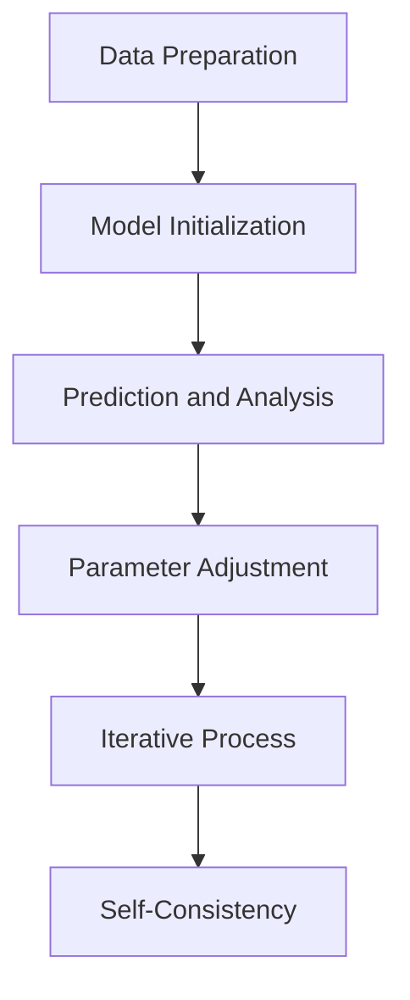
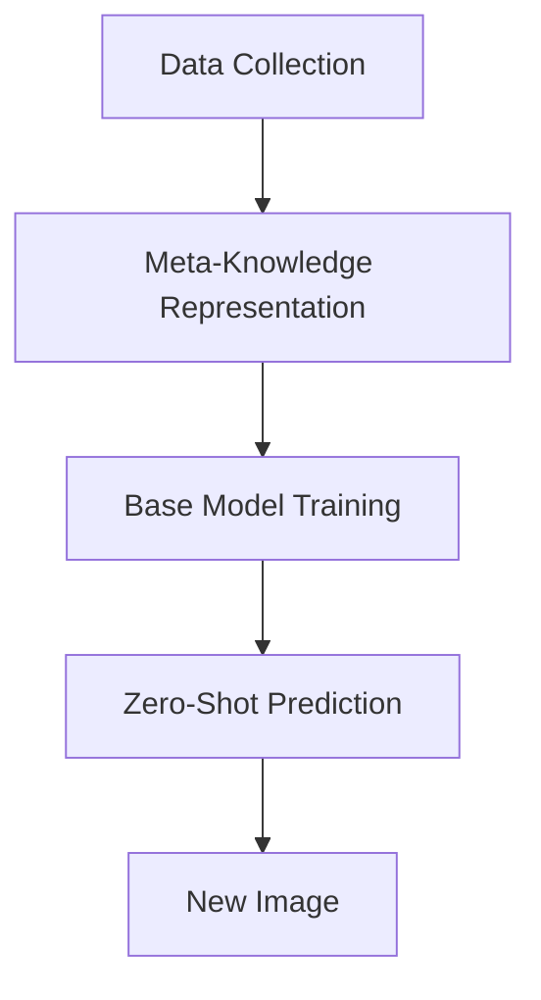

                 


### Introduction to Self-Consistency CoT and Zero-Shot CoT

#### Keywords
- **Self-Consistency CoT**
- **Zero-Shot CoT**
- **Computer Vision**
- **AI**
- **Image Recognition**
- **Classification Algorithms**

#### Abstract
This article aims to provide a comprehensive comparison between Self-Consistency CoT (Concept of Topic) and Zero-Shot CoT in the context of computer vision and artificial intelligence. We will delve into the background, definitions, and applications of both concepts, offering a clear understanding of their roles and when to use them effectively. The article will be structured to cover core concepts, theoretical foundations, practical applications, and future prospects, ensuring readers gain valuable insights into the implementation and optimization of image recognition systems.

### The Importance and Applications of Self-Consistency CoT

#### Definition and Basic Concepts

Self-Consistency CoT, also known as Self-Consistent Concept of Topic, is a machine learning technique primarily used in computer vision and AI applications to enhance the performance of image recognition and classification systems. It is based on the idea of training a model to be self-consistent, meaning that it should produce similar results when presented with the same input under different conditions. This self-consistency helps in reducing the variance and improving the stability of the model, which is crucial for real-world applications where data can be noisy and variable.

The core principle of Self-Consistency CoT is to minimize the discrepancy between the predictions of a model and its own internal representations. This is achieved by iteratively adjusting the model parameters to reduce the difference between the predicted output and the true output. The process involves feeding the model with a dataset, analyzing its predictions, and updating the parameters to make the predictions more consistent.

#### Technical Implementation

To implement Self-Consistency CoT, we typically follow these steps:

1. **Data Preparation**: Gather a dataset that represents the problem domain and preprocess it to remove any noise or irrelevant information.
2. **Model Initialization**: Initialize the model with random parameters or use pre-trained weights if available.
3. **Prediction and Analysis**: Use the model to predict the output for the given input and analyze the discrepancies between the predicted output and the true output.
4. **Parameter Adjustment**: Adjust the model parameters to reduce the discrepancies. This can be done using optimization techniques like gradient descent.
5. **Iterative Process**: Repeat steps 3 and 4 until the model achieves a desired level of self-consistency.

#### Mermaid Diagram



#### Python Code Example

```python
import numpy as np

# Function to calculate the prediction error
def prediction_error(predictions, true_labels):
    return np.mean((predictions - true_labels) ** 2)

# Function to update model parameters
def update_parameters(model, learning_rate, prediction_error):
    model['weights'] -= learning_rate * prediction_error
    return model

# Example usage
model = {'weights': np.random.rand(10)}
data = np.array([1, 2, 3, 4, 5])
true_labels = np.array([2, 3, 4, 5, 6])

for epoch in range(100):
    predictions = model['weights'] * data
    error = prediction_error(predictions, true_labels)
    model = update_parameters(model, learning_rate=0.01, prediction_error=error)
    print(f"Epoch {epoch}: Error = {error}")
```

#### Applications

Self-Consistency CoT has found numerous applications in various fields, including:

1. **Image Recognition**: In image recognition tasks, Self-Consistency CoT can help in improving the accuracy and robustness of models, especially when dealing with noisy or variable data.
2. **Natural Language Processing**: It can be used in NLP applications to improve the consistency of text classification and sentiment analysis models.
3. **Medical Imaging**: In medical imaging, Self-Consistency CoT can help in detecting and classifying medical conditions with higher accuracy, even in the presence of artifacts and noise.

### Future Prospects

As machine learning and AI continue to evolve, the role of Self-Consistency CoT is expected to expand. With advancements in deep learning and transfer learning, Self-Consistency CoT can be integrated into more complex models to enhance their performance. Additionally, the development of more efficient optimization algorithms can further improve the implementation and applicability of Self-Consistency CoT.

In conclusion, Self-Consistency CoT is a powerful technique that can significantly improve the performance of image recognition and classification systems. By ensuring self-consistency in predictions, it provides a stable and reliable foundation for real-world applications. As we continue to explore and develop new algorithms and techniques, the future of Self-Consistency CoT looks promising.

---

### Definition and Basic Concepts

#### Background and Problem Definition

Zero-Shot CoT, also known as Zero-Shot Concept of Topic, is a crucial concept in the field of computer vision and artificial intelligence, particularly in image recognition and classification tasks. The primary challenge in these tasks is the ability of a model to recognize and classify objects it has not seen during training. In traditional machine learning approaches, models are trained on a dataset that contains examples of each class they are expected to classify. However, in real-world scenarios, it is often impractical to have a dataset that covers all possible classes or variations of a class.

Zero-Shot CoT addresses this challenge by enabling models to classify new classes without any training data for those specific classes. This is particularly useful in domains like medical imaging, where new diseases or conditions may emerge, and it is impractical to collect a large dataset for each new class. Similarly, in industrial inspections, where new defects may appear, Zero-Shot CoT can help classify these defects without retraining the model.

#### Core Concepts and Frameworks

Zero-Shot CoT relies on the use of meta-knowledge, which provides information about the relationships between different classes. This meta-knowledge can be in the form of semantic labels, taxonomy hierarchies, or ontologies. The core idea is to leverage this meta-knowledge to predict the class labels of unseen images.

There are several frameworks and techniques used in Zero-Shot CoT, including:

1. **Prototype Models**: These models maintain a prototype for each class, which is an average or centroid of all the training examples for that class. When presented with a new image, the model calculates the distance between the image and the prototypes to predict the class label.

2. **Relational Models**: These models use a relational framework to encode the relationships between classes. When a new image is encountered, the model reasons about the relationships between the image and known classes to make a prediction.

3. **Meta-Learning**: Meta-learning techniques, such as model-agnostic meta-learning (MAML), are used to quickly adapt models to new classes. These techniques focus on finding a model that can be easily fine-tuned on new data.

4. **Transfer Learning**: Transfer learning is closely related to Zero-Shot CoT. It involves using a pre-trained model and adapting it to new classes with limited data. Zero-Shot CoT extends this idea by allowing the model to handle completely new classes without any fine-tuning.

#### Technical Implementation

Implementing Zero-Shot CoT involves several key steps:

1. **Data Collection**: Collect a dataset that contains labeled examples for known classes. This dataset is used to train the base model.
2. **Meta-Knowledge Representation**: Encode the meta-knowledge about class relationships into the model. This can be done using embeddings, graph-based representations, or other methods.
3. **Base Model Training**: Train a base model on the collected dataset. This model should be capable of generalizing well to new classes.
4. **Zero-Shot Prediction**: When a new image is presented, the model uses its knowledge of class relationships and the base model's predictions to make a zero-shot prediction.

#### Mermaid Diagram



#### Python Code Example

```python
from sklearn.svm import SVC
from sklearn.neighbors import KNeighborsClassifier
from sklearn.datasets import load_iris
from sklearn.model_selection import train_test_split

# Load the Iris dataset
iris = load_iris()
X, y = iris.data, iris.target

# Split the dataset into training and test sets
X_train, X_test, y_train, y_test = train_test_split(X, y, test_size=0.2, random_state=42)

# Train a base model using K-Nearest Neighbors
base_model = KNeighborsClassifier(n_neighbors=3)
base_model.fit(X_train, y_train)

# Encode meta-knowledge using one-hot encoding
meta_knowledge = np.eye(len(iris.target_names))

# Function to make a zero-shot prediction
def zero_shot_prediction(model, meta_knowledge, new_data):
    distances = model.predict([new_data])
    class_indices = np.argmax(meta_knowledge[distances], axis=1)
    return iris.target_names[class_indices]

# Example usage
new_data = [3, 1.4, 0.2]
print("Zero-Shot Prediction:", zero_shot_prediction(base_model, meta_knowledge, new_data))
```

#### Applications

Zero-Shot CoT has several practical applications, including:

1. **Object Recognition**: In object recognition tasks, Zero-Shot CoT can help classify new objects that have not been seen during training.
2. **Video Analysis**: In video analysis, Zero-Shot CoT can be used to detect and classify objects that appear in new scenes or videos.
3. **Natural Language Processing**: In NLP, Zero-Shot CoT can be used for named entity recognition and classification of unseen entities.

#### Future Prospects

As AI and machine learning continue to advance, the role of Zero-Shot CoT is expected to expand. With the development of more sophisticated models and algorithms, Zero-Shot CoT will become even more effective in handling unseen classes. Additionally, the integration of Zero-Shot CoT with other techniques, such as reinforcement learning and generative models, will further enhance its capabilities.

In conclusion, Zero-Shot CoT is a fundamental concept in computer vision and AI that enables models to classify new classes without training data. By leveraging meta-knowledge and advanced techniques, Zero-Shot CoT provides a powerful solution to the challenge of handling unseen classes, making it invaluable in a wide range of applications. As the field continues to evolve, Zero-Shot CoT will play an increasingly important role in pushing the boundaries of what is possible in image recognition and classification.

