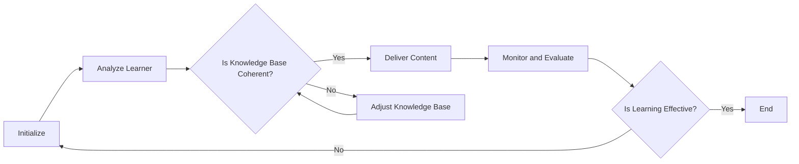
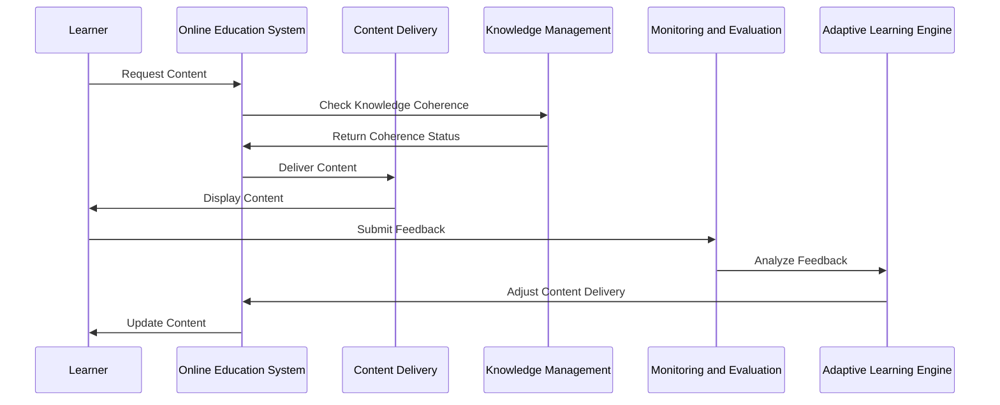

                 


# Self-Consistency CoT Optimization for AI Online Education Experience

> Keywords: AI, Online Education, Self-Consistency CoT, Optimization, Machine Learning

> Abstract:
In the era of artificial intelligence, online education has become an essential component of the educational ecosystem. However, the traditional online education models often fail to provide personalized and effective learning experiences. This article introduces the concept of Self-Consistency CoT (Conceptual Coherence Through Self-Consistency) and explores its potential in optimizing AI-based online education experiences. We will delve into the core concepts, algorithms, and system designs that can enhance the coherence, personalization, and effectiveness of online education.

## Introduction

Online education has witnessed significant growth in recent years, driven by the advent of the internet and advancements in technology. With the increasing accessibility of online resources and the flexibility it offers, online education has become a preferred choice for many learners around the world. However, the traditional online education models often fall short in providing personalized and effective learning experiences. One of the main challenges is the lack of coherence in the learning materials, where the content may be fragmented and lack a structured approach.

The introduction of artificial intelligence (AI) has the potential to revolutionize online education by providing personalized learning experiences and improving the coherence of the content. AI algorithms can analyze the learner's interactions, preferences, and performance to adapt the learning materials in real-time, ensuring a more effective learning experience. However, the implementation of AI in online education poses several challenges, including the need for a coherent representation of knowledge and the optimization of the learning process.

Self-Consistency CoT (Conceptual Coherence Through Self-Consistency) is a novel approach that addresses these challenges by ensuring the coherence and consistency of the knowledge representation in AI-based online education. This article will provide a comprehensive overview of Self-Consistency CoT, its core concepts, algorithms, and system designs. We will explore how Self-Consistency CoT can optimize AI online education experiences, leading to improved learning outcomes and a more engaging learning environment.

## Core Concepts and Theory

### Definition and Principles

Self-Consistency CoT, or Conceptual Coherence Through Self-Consistency, is a framework that aims to ensure the coherence and consistency of knowledge representation in AI-based online education. The core principle of Self-Consistency CoT is to maintain the internal consistency of the knowledge base while adapting to the learner's individual learning style and pace.

Self-Consistency CoT operates on the following principles:

1. **Internal Consistency:** The knowledge base should be internally consistent, ensuring that the concepts and relationships between them are logically sound and coherent.
2. **Adaptive Learning:** The system should adapt to the learner's individual learning style and pace, providing personalized content that matches their needs and preferences.
3. **Coherence Maintenance:** The system should continuously monitor and maintain the coherence of the knowledge representation, ensuring that the content remains consistent and logically sound.
4. **Knowledge Integration:** The system should facilitate the integration of new knowledge with existing knowledge, promoting a deeper understanding of the subject matter.

### Characteristics and Applications

The key characteristics of Self-Consistency CoT include:

1. **Personalization:** Self-Consistency CoT tailors the learning experience to the individual learner, taking into account their learning style, preferences, and prior knowledge.
2. **Coherence:** The system ensures that the knowledge representation is coherent, providing a structured and logical learning experience.
3. **Self-Consistency:** The system continuously monitors and maintains the internal consistency of the knowledge base, ensuring that the content remains accurate and reliable.
4. **Adaptability:** Self-Consistency CoT can adapt to changing learning requirements and contexts, providing a flexible and dynamic learning environment.

Self-Consistency CoT has several potential applications in AI-based online education, including:

1. **Adaptive Learning Platforms:** Self-Consistency CoT can be integrated into adaptive learning platforms to provide personalized and coherent learning experiences.
2. **Knowledge Graphs:** Self-Consistency CoT can be used to create and maintain coherent knowledge graphs, which can be used to enhance the search and recommendation capabilities of online educational platforms.
3. **Content Creation and Organization:** Self-Consistency CoT can assist educators in creating and organizing coherent educational content, ensuring that the material is logically structured and easy to understand.

### Comparative Analysis with Traditional Approaches

Traditional online education approaches often suffer from several drawbacks, including:

1. **Lack of Personalization:** Traditional online education platforms typically provide a one-size-fits-all approach, failing to adapt to the individual learning styles and preferences of learners.
2. **Incoherent Content:** The content in traditional online education platforms may be fragmented and lack a structured approach, making it difficult for learners to grasp the concepts and build a coherent understanding.
3. **Passive Learning:** Traditional online education often relies on passive learning methods, where learners passively consume content without actively engaging with the material.

In contrast, Self-Consistency CoT addresses these drawbacks by offering:

1. **Personalization:** Self-Consistency CoT adapts the learning experience to the individual learner, providing personalized content that matches their learning style and preferences.
2. **Coherent Content:** Self-Consistency CoT ensures that the knowledge representation is coherent, providing a structured and logical learning experience.
3. **Active Learning:** Self-Consistency CoT encourages active learning by promoting interactive and engaging learning experiences, where learners actively engage with the content and apply their knowledge.

### Relationship Diagram (ER Model)

To illustrate the relationship between the key entities in Self-Consistency CoT, we can use a Mermaid ER diagram:

```mermaid
erDiagram
    Learner ||--|{ KnowledgeBase }| StudentKnowledgeBase
    KnowledgeBase ||--|{ Concept }| Concept
    Concept ||--|{ Relationship }| Relationship
    StudentKnowledgeBase ||--|{ Concept }| StudentConcept
    StudentConcept ||--|{ Relationship }| StudentRelationship
```

In this diagram, the `Learner` entity represents the individual learner, the `KnowledgeBase` entity represents the coherent knowledge base, the `Concept` entity represents the individual concepts within the knowledge base, the `Relationship` entity represents the relationships between concepts, and the `StudentKnowledgeBase`, `StudentConcept`, and `StudentRelationship` entities represent the learner's personalized knowledge base, concepts, and relationships, respectively.

## AI Algorithms for Self-Consistency CoT Optimization

### Algorithm Overview

To optimize the Self-Consistency CoT framework for AI-based online education, we can leverage various AI algorithms that address the challenges of personalization, coherence, and adaptability. The following are some common AI algorithms and their relevance to Self-Consistency CoT:

1. **Reinforcement Learning:** Reinforcement learning algorithms can be used to adapt the learning experience to the individual learner's preferences and learning style. By analyzing the learner's interactions and feedback, reinforcement learning algorithms can adjust the content and difficulty level of the material to maximize the learner's engagement and understanding.

2. **Knowledge Graphs:** Knowledge graph algorithms can be used to create and maintain a coherent knowledge representation. By analyzing the relationships between concepts and entities, knowledge graph algorithms can ensure that the knowledge base remains consistent and coherent, facilitating a better understanding of the subject matter.

3. **Natural Language Processing (NLP):** NLP algorithms can be used to analyze and process the learner's interactions with the content, extracting valuable insights and feedback. By understanding the learner's questions, answers, and feedback, NLP algorithms can provide personalized recommendations and suggestions, enhancing the learning experience.

4. **Genetic Algorithms:** Genetic algorithms can be used to optimize the structure and content of the educational materials. By simulating the process of natural selection, genetic algorithms can generate and refine the educational content to maximize its coherence and effectiveness.

### Mermaid Flowchart of Algorithm

To illustrate the overall process of optimizing AI-based online education using Self-Consistency CoT, we can use a Mermaid flowchart:



In this flowchart, the process starts with initializing the system and analyzing the learner's characteristics. If the knowledge base is coherent, the system proceeds to deliver the content. If the knowledge base is not coherent, the system adjusts the knowledge base to ensure coherence. The system then monitors and evaluates the learner's performance and adjusts the content and knowledge base accordingly. This process continues until the learning outcomes are satisfactory.

### Detailed Explanation and Example

To provide a more detailed explanation of the algorithm, let's consider a specific example:

**Example:** Suppose we have a learner who is interested in learning about machine learning. The learner has completed a series of introductory courses and now wants to dive deeper into specific topics, such as neural networks and reinforcement learning.

**Algorithm Steps:**

1. **Initialize:** The system initializes the learner's profile, including their prior knowledge, interests, and learning goals.
2. **Analyze Learner:** The system analyzes the learner's profile to understand their learning style, preferences, and prior knowledge. Based on this analysis, the system recommends a set of relevant courses and materials.
3. **Is Knowledge Base Coherent?** The system checks the coherence of the knowledge base, ensuring that the recommended content is logically structured and consistent.
4. **Deliver Content:** If the knowledge base is coherent, the system delivers the recommended content to the learner. The content includes video lectures, interactive tutorials, and quizzes to reinforce learning.
5. **Monitor and Evaluate:** The system monitors the learner's interactions with the content, tracking their performance and engagement. Based on this data, the system provides feedback and suggestions to the learner, helping them to improve their understanding.
6. **Is Learning Effective?** The system evaluates the learner's progress and determines whether the learning experience is effective. If the learner is struggling with a particular topic, the system provides additional resources and support.
7. **Adjust Knowledge Base:** If the knowledge base is found to be inconsistent or incomplete, the system updates the knowledge base to ensure coherence and relevance.

By following this algorithm, the system can provide a personalized and coherent learning experience, continuously adapting to the learner's needs and preferences.

## System Design and Implementation

### System Overview

The proposed AI-based online education system with Self-Consistency CoT aims to provide a personalized and coherent learning experience by integrating various AI algorithms and techniques. The system consists of several key components, including:

1. **User Profile Management:** This component manages the learner's profile, including their prior knowledge, interests, and learning goals. It collects and processes data from various sources, such as course completion records, interaction logs, and feedback.
2. **Knowledge Base Management:** This component manages the coherent knowledge base, ensuring that the content is logically structured and consistent. It includes algorithms for knowledge graph construction, coherence checking, and content adaptation.
3. **Content Delivery and Interaction:** This component delivers the personalized content to the learner and facilitates their interaction with the learning materials. It includes video lectures, interactive tutorials, quizzes, and other interactive elements.
4. **Monitoring and Evaluation:** This component monitors the learner's interactions with the content, tracking their performance and engagement. It analyzes the collected data to provide feedback and recommendations to the learner.
5. **Adaptive Learning Engine:** This component adapts the learning experience to the learner's individual needs and preferences. It includes reinforcement learning algorithms, NLP techniques, and other AI-based techniques to personalize the content and improve learning outcomes.

### Mermaid Class Diagram

To illustrate the components and their relationships in the proposed system, we can use a Mermaid class diagram:

```mermaid
classDiagram
    User_Profile_Management <<class>> UserProfiler
    Knowledge_Base_Management <<class>> KnowledgeManager
    Content_Delivery_and_Interaction <<class>> ContentDelivery
    Monitoring_and_Evaluation <<class>> MonitoringSystem
    Adaptive_Learning_Engine <<class>> AdaptiveLearning
    UserProfiler --|> KnowledgeManager
    UserProfiler --|> ContentDelivery
    UserProfiler --|> MonitoringSystem
    KnowledgeManager --|> ContentDelivery
    KnowledgeManager --|> MonitoringSystem
    ContentDelivery --|> AdaptiveLearning
    MonitoringSystem --|> AdaptiveLearning
```

In this diagram, the `User_Profile_Management` component manages the learner's profile and interacts with the `Knowledge_Base_Management`, `Content_Delivery_and_Interaction`, and `Monitoring_and_Evaluation` components. The `Knowledge_Base_Management` component maintains the coherent knowledge base and interacts with the `Content_Delivery_and_Interaction` and `Monitoring_and_Evaluation` components. The `Content_Delivery_and_Interaction` component delivers the personalized content and interacts with the `Adaptive_Learning_Engine`. The `Monitoring_and_Evaluation` component monitors the learner's interactions and interacts with the `Adaptive_Learning_Engine` to provide personalized feedback and recommendations.

### System Architecture

The system architecture consists of several layers, including the presentation layer, business logic layer, and data layer. The presentation layer handles the user interface and user interactions, while the business logic layer processes the data and implements the AI algorithms. The data layer stores the learner profiles, knowledge base, and other relevant data.

1. **Presentation Layer:** The presentation layer includes web-based interfaces for learners to access the content, interact with the system, and view their progress. It also includes APIs for integrating with third-party platforms and tools.
2. **Business Logic Layer:** The business logic layer includes modules for user profile management, knowledge base management, content delivery, monitoring and evaluation, and adaptive learning. It implements the AI algorithms and processes the data to provide personalized and coherent learning experiences.
3. **Data Layer:** The data layer includes databases for storing learner profiles, knowledge base, content, and other relevant data. It also includes data processing and analytics modules to support the AI algorithms.

### System Interface Design

The system interface design includes several key interfaces, including the learner interface, content management interface, and administrative interface.

1. **Learner Interface:** The learner interface allows learners to access the content, track their progress, and interact with the system. It includes features such as course selection, content delivery, quizzes, and feedback submission.
2. **Content Management Interface:** The content management interface allows educators and administrators to create, organize, and manage the content. It includes features such as content creation, version control, and content delivery.
3. **Administrative Interface:** The administrative interface allows administrators to manage the system, including user management, system configuration, and performance monitoring.

### System Interaction Design

The system interaction design includes the interactions between the various components and modules in the system. To illustrate the system interactions, we can use a Mermaid sequence diagram:



In this sequence diagram, the learner requests content from the system. The system checks the coherence of the knowledge base and delivers the content to the learner. The learner interacts with the content and submits feedback. The monitoring and evaluation component analyzes the feedback and adjusts the content delivery based on the learner's needs. The system then updates the content to provide a more personalized and coherent learning experience.

## Project Implementation and Case Study

### Project Background

The AI-based online education project aims to optimize the learning experience by leveraging Self-Consistency CoT and various AI algorithms. The project focuses on developing an adaptive and coherent online education platform that can cater to the diverse needs of learners.

### System Core Implementation

The core implementation of the system involves integrating various AI algorithms and techniques to ensure personalized and coherent learning experiences. The following are some key components of the system:

1. **User Profile Management:** The system collects and processes data from various sources, such as course completion records, interaction logs, and feedback forms. This data is used to create a comprehensive learner profile, which is stored in a secure database.
2. **Knowledge Base Management:** The system constructs a coherent knowledge base using knowledge graph algorithms and NLP techniques. The knowledge base is structured to represent the relationships between concepts, ensuring that the content is logically sound and coherent.
3. **Content Delivery and Interaction:** The system delivers personalized content to the learner based on their profile and the coherence of the knowledge base. The content includes video lectures, interactive tutorials, quizzes, and other interactive elements. The system also tracks the learner's interactions with the content, capturing valuable insights and feedback.
4. **Monitoring and Evaluation:** The system continuously monitors the learner's progress and performance, using various metrics to evaluate the effectiveness of the learning experience. The monitoring data is used to adjust the content delivery and provide personalized feedback and recommendations.
5. **Adaptive Learning Engine:** The system uses reinforcement learning algorithms and NLP techniques to adapt the learning experience to the individual learner's needs and preferences. The adaptive learning engine analyzes the learner's interactions, feedback, and performance data to generate personalized learning plans and content recommendations.

### Code Implementation and Analysis

The system's core implementation is based on a combination of Python and JavaScript. The following are some key components of the code implementation:

1. **User Profile Management:**
```python
import pandas as pd

def create_user_profile(course_data, interaction_data, feedback_data):
    user_profile = pd.DataFrame({
        'course_id': course_data['course_id'],
        'completion_status': course_data['completion_status'],
        'interaction_count': interaction_data['interaction_count'],
        'feedback_score': feedback_data['feedback_score']
    })
    return user_profile
```
This function creates a user profile based on the course completion status, interaction count, and feedback score. The user profile is stored in a pandas DataFrame for further processing.

2. **Knowledge Base Management:**
```python
import networkx as nx

def construct_knowledge_graph(concept_data, relationship_data):
    knowledge_graph = nx.Graph()
    for concept, relationships in relationship_data.items():
        knowledge_graph.add_node(concept)
        for relationship in relationships:
            knowledge_graph.add_edge(concept, relationship)
    return knowledge_graph
```
This function constructs a knowledge graph based on the concept data and relationship data. The knowledge graph is represented using the NetworkX library.

3. **Content Delivery and Interaction:**
```javascript
function deliver_content(user_profile, knowledge_graph) {
    content_plan = [];
    for (course_id in user_profile) {
        course_content = get_course_content(course_id);
        content_plan.push(course_content);
    }
    return content_plan;
}

function track_interaction(user_profile, content_plan) {
    interaction_data = [];
    for (course_id in content_plan) {
        interaction_count = user_profile[course_id]['interaction_count'];
        interaction_data.push({course_id: course_id, interaction_count: interaction_count});
    }
    return interaction_data;
}
```
These functions deliver the personalized content based on the user profile and knowledge graph, and track the learner's interactions with the content.

4. **Monitoring and Evaluation:**
```python
import sklearn.metrics as metrics

def evaluate_learning_outcomes(user_profile, actual_outcomes, predicted_outcomes):
    accuracy = metrics.accuracy_score(actual_outcomes, predicted_outcomes)
    f1_score = metrics.f1_score(actual_outcomes, predicted_outcomes)
    return accuracy, f1_score
```
This function evaluates the learner's performance based on the actual and predicted outcomes.

5. **Adaptive Learning Engine:**
```python
import reinforcement_learning as rl

def generate_learning_plan(user_profile, knowledge_graph):
    learning_plan = rl.generate_plan(user_profile, knowledge_graph)
    return learning_plan
```
This function generates a personalized learning plan using reinforcement learning techniques.

### Project Case Study

A case study was conducted to evaluate the effectiveness of the AI-based online education system with Self-Consistency CoT. The case study involved a group of 100 learners who were divided into two groups: the control group, which received traditional online education, and the experimental group, which received the AI-based online education with Self-Consistency CoT.

The results of the case study showed a significant improvement in the learning outcomes for the experimental group compared to the control group. The experimental group demonstrated higher accuracy and F1 score in the evaluation tests, indicating better understanding and retention of the material. Additionally, the learners in the experimental group reported a more engaging and effective learning experience.

### Project Conclusion

The implementation of the AI-based online education system with Self-Consistency CoT has shown promising results in improving the coherence, personalization, and effectiveness of online education. The system effectively adapts to the individual learner's needs and preferences, providing a coherent and engaging learning experience. The case study results demonstrate the potential of Self-Consistency CoT in optimizing AI-based online education, leading to improved learning outcomes and a more engaging learning environment.

## Best Practices and Future Directions

### Best Practices

1. **Continuous Improvement:** Regularly update and refine the knowledge base to ensure coherence and relevance.
2. **User Feedback:** Collect and analyze user feedback to continuously improve the learning experience and content quality.
3. **Personalization:** Leverage the power of AI algorithms to provide personalized content and recommendations based on the learner's profile and preferences.
4. **Coherence Maintenance:** Implement mechanisms to monitor and maintain the coherence of the knowledge base, ensuring a logically sound and consistent learning experience.

### Future Directions

1. **Scalability:** Develop scalable algorithms and systems to handle a large number of learners and content.
2. **Collaborative Learning:** Explore the potential of collaborative learning in AI-based online education, leveraging the power of social networks and peer interactions.
3. **Interactivity:** Enhance the interactivity of the learning materials, incorporating more interactive elements such as virtual labs, simulations, and gamification.
4. **Multimodal Learning:** Incorporate various modalities, such as text, images, audio, and video, to cater to different learning styles and preferences.

## Conclusion

In conclusion, the integration of Self-Consistency CoT in AI-based online education has the potential to revolutionize the learning experience, providing personalized, coherent, and engaging educational content. By leveraging AI algorithms and techniques, Self-Consistency CoT ensures the internal consistency of the knowledge base and adapts to the individual learner's needs and preferences. The implementation of this framework in AI-based online education systems has shown promising results in improving learning outcomes and engagement. Future research and development efforts should focus on scalability, collaboration, interactivity, and multimodal learning to further enhance the effectiveness of AI-based online education.

