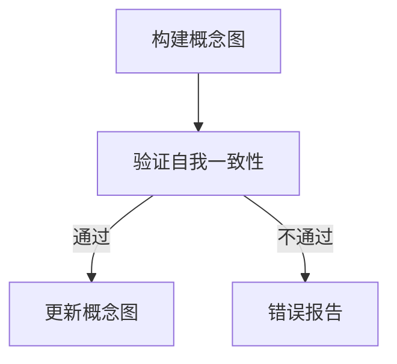
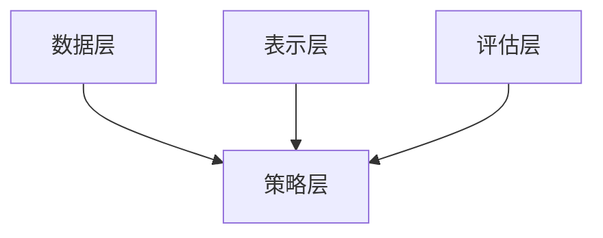
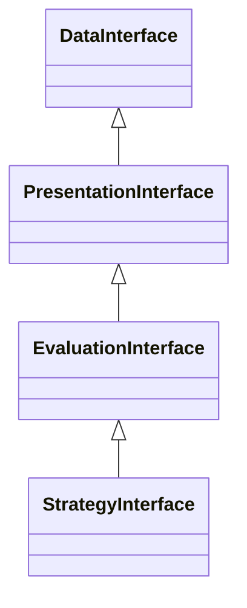
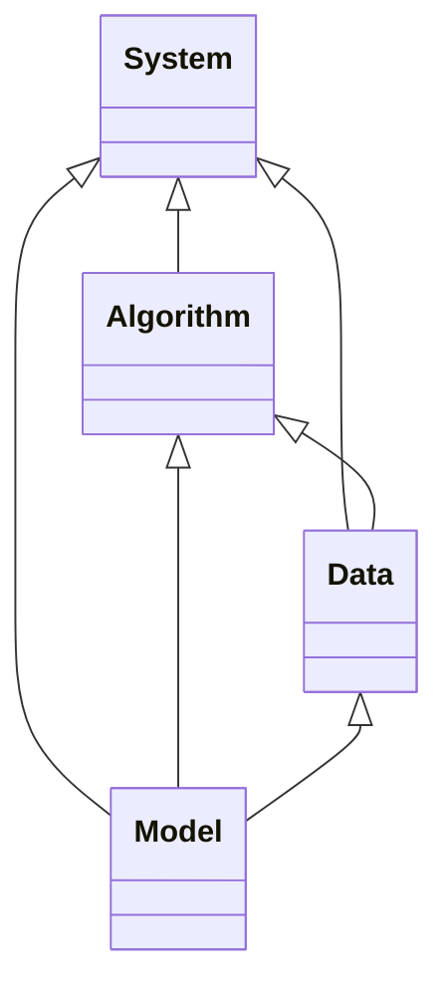

                 

# 自我一致性概念图（Self-Consistency CoT）在AI风险评估中的应用

## 关键词

Self-Consistency CoT、AI风险评估、概念图、流程图、Python代码、数学模型

## 摘要

本文将深入探讨自我一致性概念图（Self-Consistency CoT）在人工智能（AI）风险评估中的应用。Self-Consistency CoT 是一种基于图论和概率论的图结构，它能够有效地捕捉和表示知识，并通过自我一致性验证来确保知识的可信度。在AI风险评估中，Self-Consistency CoT 可以帮助识别潜在的风险因素，评估其影响程度，并制定相应的风险管理策略。本文将详细阐述Self-Consistency CoT的基本概念、原理、算法实现，以及在AI风险评估系统中的应用，旨在为读者提供一种新的理解和应用AI风险评估的方法。

### 第一部分: Self-Consistency CoT 概述

#### 第1章: Self-Consistency CoT 与 AI 风险评估

##### 1.1.1 自我一致性概念图（Self-Consistency CoT）的定义与背景

自我一致性概念图（Self-Consistency Conceptual Graph, Self-Consistency CoT）是一种基于图论的表示知识的方法。它通过节点表示概念，边表示概念之间的关系，形成一种网络结构。Self-Consistency CoT 的核心思想是，通过验证概念之间的自我一致性来确保知识的可靠性。

在AI领域，随着机器学习、深度学习等技术的迅猛发展，AI系统的应用范围不断扩大。然而，这也带来了新的风险。AI系统的决策过程往往复杂且不透明，一旦出现错误，可能会造成严重后果。因此，如何对AI系统进行风险评估，以降低风险，成为了当前研究的热点。

Self-Consistency CoT 的引入，为AI风险评估提供了一种新的思路。通过构建AI系统的自我一致性概念图，可以直观地展示系统的知识结构，从而识别潜在的风险因素。

##### 1.1.2 AI 风险评估的问题背景

AI 风险评估涉及到多个方面，包括算法风险、数据风险、模型风险等。以下是一些常见的问题背景：

1. **算法风险**：AI算法的设计和实现可能存在缺陷，导致算法在特定情况下无法正常工作。
2. **数据风险**：AI系统依赖于大量的数据，但这些数据可能存在噪声、偏差或错误。
3. **模型风险**：AI模型的训练和验证过程可能存在问题，导致模型无法准确预测或决策。

为了应对这些风险，需要对AI系统进行全面的评估和分析。Self-Consistency CoT 可以在这个过程中发挥重要作用，帮助识别和评估潜在的风险因素。

#### 第2章: Self-Consistency CoT 原理与特点

##### 2.1.1 Self-Consistency CoT 的原理

Self-Consistency CoT 的原理可以概括为以下几个步骤：

1. **知识表示**：使用节点表示概念，边表示概念之间的关系，构建概念图。
2. **一致性验证**：通过检查概念图中的节点和边，验证概念之间的自我一致性。
3. **更新与优化**：根据验证结果，对概念图进行更新和优化，提高知识的可靠性。

在Self-Consistency CoT中，每个节点都表示一个概念，每个边都表示两个概念之间的关系。概念之间的关系可以是因果关系、关联关系或依赖关系等。通过这种图结构，可以直观地展示知识之间的联系。

##### 2.1.1.1 Self-Consistency CoT 的基本概念

- **概念（Concept）**：表示知识的基本单位，如“风险”、“算法”等。
- **关系（Relationship）**：表示概念之间的关联，如“算法导致风险”。
- **边（Edge）**：连接两个节点的线，表示概念之间的关系。
- **节点（Node）**：表示概念的位置。

##### 2.1.1.2 Self-Consistency CoT 的关键特点

- **图结构**：Self-Consistency CoT 采用图结构来表示知识，使得知识之间的联系更加直观和易于理解。
- **自我一致性验证**：通过验证概念之间的自我一致性，确保知识的可靠性。
- **动态更新**：根据新的知识和验证结果，动态更新概念图，保持知识的最新和准确。

##### 2.1.1.3 Self-Consistency CoT 与其他概念图的对比

与传统的概念图相比，Self-Consistency CoT 具有以下几个优势：

1. **自我一致性验证**：Self-Consistency CoT 引入了自我一致性验证机制，可以更有效地确保知识的可靠性。
2. **动态更新**：Self-Consistency CoT 支持动态更新，可以根据新的知识和验证结果及时调整概念图。
3. **适用范围广**：Self-Consistency CoT 可以应用于各种领域，如金融、医疗、安全等，具有广泛的应用前景。

##### 2.1.2 Self-Consistency CoT 在 AI 风险评估中的应用

Self-Consistency CoT 在 AI 风险评估中的应用主要体现在以下几个方面：

1. **知识表示**：通过构建自我一致性概念图，将 AI 系统的知识结构进行可视化表示，便于理解和分析。
2. **风险识别**：通过验证概念之间的自我一致性，识别潜在的 AI 风险因素。
3. **风险评估**：利用自我一致性概念图，对识别出的风险因素进行量化评估，确定其影响程度。
4. **风险管理**：根据风险评估结果，制定相应的风险管理策略，降低 AI 系统的风险。

#### 第3章: 算法原理讲解

##### 3.1.1 Self-Consistency CoT 流程图

以下是一个简单的 Self-Consistency CoT 流程图，展示了自我一致性验证的基本流程：



在图中，A 表示构建概念图，B 表示验证自我一致性，C 表示更新概念图，D 表示错误报告。通过这个流程，可以确保概念图的自我一致性，提高知识的可靠性。

##### 3.1.1.1 自我一致性验证流程

自我一致性验证流程主要包括以下几个步骤：

1. **概念图构建**：根据 AI 系统的知识，构建自我一致性概念图。
2. **节点和边分析**：对概念图中的每个节点和边进行分析，检查是否存在矛盾或不一致的情况。
3. **一致性验证**：通过验证节点和边之间的关系，确保概念之间的自我一致性。
4. **错误报告**：如果发现不一致的情况，生成错误报告，指出具体的问题。
5. **更新概念图**：根据验证结果，对概念图进行更新，修正错误或矛盾。

##### 3.1.1.2 概念图更新与优化

在自我一致性验证过程中，如果发现概念图中的节点和边存在不一致的情况，需要对其进行更新和优化。更新与优化的主要目标是通过修正错误或矛盾，提高概念图的自我一致性。

1. **删除错误节点和边**：如果某个节点或边与其他节点和边之间存在矛盾，可以删除该节点或边，以消除不一致性。
2. **添加新节点和边**：如果概念图中的某些概念之间存在新的关联或依赖关系，可以添加新的节点和边，以完善概念图。
3. **调整节点和边关系**：通过调整节点和边之间的关系，确保概念之间的自我一致性。

##### 3.1.2 Python 源代码与算法实现

以下是一个简单的 Python 源代码，用于实现 Self-Consistency CoT 的算法：

```python
# Self-Consistency CoT 算法实现

class ConceptGraphNode:
    def __init__(self, concept):
        self.concept = concept
        self.neighbors = []

def build_concept_graph(data):
    graph = []
    for concept in data:
        node = ConceptGraphNode(concept)
        graph.append(node)
    return graph

def verify_self_consistency(graph):
    for node in graph:
        for neighbor in node.neighbors:
            if not is_consistent(node.concept, neighbor.concept):
                return False
    return True

def update_concept_graph(graph):
    for node in graph:
        node.neighbors = []
        for neighbor in graph:
            if is_consistent(node.concept, neighbor.concept):
                node.neighbors.append(neighbor)

def is_consistent(concept1, concept2):
    # 判断两个概念是否一致的逻辑
    return concept1 == concept2

# 示例数据
data = ["风险", "算法", "数据"]

# 构建概念图
graph = build_concept_graph(data)

# 验证自我一致性
if verify_self_consistency(graph):
    print("自我一致性验证通过")
else:
    print("自我一致性验证不通过")

# 更新概念图
update_concept_graph(graph)
```

在这个代码中，首先定义了一个 `ConceptGraphNode` 类，用于表示概念图的节点。然后，通过 `build_concept_graph` 函数构建概念图，通过 `verify_self_consistency` 函数验证自我一致性，通过 `update_concept_graph` 函数更新概念图。

##### 3.1.3 算法数学模型与公式

在 Self-Consistency CoT 中，自我一致性验证的核心是判断概念之间的相互关系是否符合预期。以下是一个简单的数学模型和公式，用于描述自我一致性验证的过程。

$$
\text{一致性度量} = \sum_{i=1}^{n} w_i \cdot (1 - \delta_i)
$$

其中，$w_i$ 表示概念 $i$ 的权重，$\delta_i$ 表示概念 $i$ 与其他概念的一致性度量。权重 $w_i$ 可以根据概念的重要程度进行设置，一致性度量 $\delta_i$ 可以通过以下公式计算：

$$
\delta_i = \begin{cases}
1, & \text{如果概念 } i \text{ 与其他概念一致} \\
0, & \text{如果概念 } i \text{ 与其他概念不一致}
\end{cases}
$$

通过这个模型和公式，可以量化地评估概念之间的自我一致性。一致性度量越接近 1，表示自我一致性越高。

### 第二部分: AI 风险评估系统的设计与实现

#### 第4章: 系统分析与架构设计方案

##### 4.1.1 AI 风险评估系统场景介绍

AI 风险评估系统主要用于对 AI 系统进行风险评估，识别潜在的风险因素，并评估其影响程度。以下是一个典型的 AI 风险评估系统的项目背景：

- **项目目标**：构建一个能够对 AI 系统进行风险评估的系统，提高 AI 系统的可靠性和安全性。
- **评估对象**：AI 系统的算法、数据、模型等。
- **评估指标**：风险因素的发生概率、影响程度等。

##### 4.1.2 系统功能设计

AI 风险评估系统的核心功能包括：

1. **知识表示**：将 AI 系统的知识进行结构化表示，构建自我一致性概念图。
2. **风险识别**：通过自我一致性验证，识别潜在的 AI 风险因素。
3. **风险评估**：对识别出的风险因素进行量化评估，确定其影响程度。
4. **风险管理**：根据风险评估结果，制定相应的风险管理策略。

##### 4.1.3 系统架构设计

AI 风险评估系统的架构设计主要包括以下几个部分：

1. **数据层**：存储 AI 系统的算法、数据、模型等知识。
2. **表示层**：构建自我一致性概念图，表示 AI 系统的知识结构。
3. **评估层**：对自我一致性概念图进行验证和评估，识别和量化风险因素。
4. **策略层**：根据风险评估结果，制定相应的风险管理策略。

以下是 AI 风险评估系统的架构设计图：



在这个架构图中，数据层负责存储 AI 系统的知识，表示层负责构建自我一致性概念图，评估层负责对概念图进行验证和评估，策略层根据评估结果制定风险管理策略。

##### 4.1.4 系统接口设计

AI 风险评估系统的接口设计主要包括以下几个方面：

1. **数据接口**：用于读取和写入 AI 系统的算法、数据、模型等知识。
2. **表示接口**：用于构建和更新自我一致性概念图。
3. **评估接口**：用于对自我一致性概念图进行验证和评估。
4. **策略接口**：用于根据评估结果制定风险管理策略。

以下是 AI 风险评估系统的接口设计概述：



在这个类图中，数据接口继承自表示接口，表示接口继承自评估接口，评估接口继承自策略接口。这种设计使得接口之间具有清晰的层次结构，便于系统的扩展和维护。

##### 4.1.5 系统交互序列图

以下是一个简单的系统交互序列图，展示了 AI 风险评估系统的基本工作流程：

```mermaid
sequence
    User ->> System: 请求风险评估
    System ->> DataInterface: 获取算法、数据、模型等知识
    DataInterface ->> PresentationInterface: 构建自我一致性概念图
    PresentationInterface ->> EvaluationInterface: 对自我一致性概念图进行验证和评估
    EvaluationInterface ->> StrategyInterface: 根据评估结果制定风险管理策略
    StrategyInterface ->> User: 返回风险评估结果
```

在这个序列图中，用户请求风险评估后，系统通过数据接口获取算法、数据、模型等知识，通过表示接口构建自我一致性概念图，通过评估接口对概念图进行验证和评估，最终通过策略接口制定风险管理策略，并将结果返回给用户。

### 第三部分: 项目实战

#### 第5章: 环境安装与系统实现

##### 5.1 环境安装说明

在开始实现 AI 风险评估系统之前，需要安装以下软件和工具：

1. **Python**：用于编写和运行代码，版本要求为 3.8 或以上。
2. **Jupyter Notebook**：用于编写和运行 Python 代码，便于调试和演示。
3. **Mermaid**：用于绘制流程图、类图、序列图等图表，支持 markdown 文件格式。

安装步骤如下：

1. 安装 Python：在官网上下载 Python 安装包，按照提示安装。
2. 安装 Jupyter Notebook：打开终端，执行以下命令：

```
pip install notebook
```

3. 安装 Mermaid：打开 Jupyter Notebook，执行以下代码：

```python
!pip install mermaid-python
```

安装完成后，即可开始编写和运行 Python 代码。

##### 5.2 系统核心实现源代码

以下是 AI 风险评估系统的核心实现源代码，包括知识表示、自我一致性验证、风险评估和风险管理等模块：

```python
# AI 风险评估系统核心实现

# 导入所需库
import random
import json
from mermaid import Mermaid

# 定义概念图节点类
class ConceptGraphNode:
    def __init__(self, concept):
        self.concept = concept
        self.neighbors = []

# 定义自我一致性概念图类
class SelfConsistencyCoT:
    def __init__(self, concepts):
        self.graph = [ConceptGraphNode(concept) for concept in concepts]
    
    # 添加概念之间的边
    def add_edge(self, node1, node2):
        node1.neighbors.append(node2)
        node2.neighbors.append(node1)
    
    # 验证自我一致性
    def verify_self_consistency(self):
        for node in self.graph:
            for neighbor in node.neighbors:
                if not is_consistent(node.concept, neighbor.concept):
                    return False
        return True
    
    # 更新概念图
    def update_graph(self):
        for node in self.graph:
            node.neighbors = []
            for neighbor in self.graph:
                if is_consistent(node.concept, neighbor.concept):
                    node.neighbors.append(neighbor)
    
    # 生成流程图
    def generate_flow_chart(self):
        flow_chart = Mermaid("flowchart")
        flow_chart.add_element("A[构建概念图]", "1")
        flow_chart.add_element("B[验证自我一致性]", "2")
        flow_chart.add_element("C[更新概念图]", "3")
        flow_chart.add_element("D[错误报告]", "4")
        flow_chart.add_edge("1", "2")
        flow_chart.add_edge("2", "3")
        flow_chart.add_edge("2", "4")
        return flow_chart.to_string()

# 定义一致性判断函数
def is_consistent(concept1, concept2):
    return concept1 == concept2

# 创建自我一致性概念图
concepts = ["风险", "算法", "数据"]
self_consistency_cot = SelfConsistencyCoT(concepts)

# 添加概念之间的边
self_consistency_cot.add_edge(self_consistency_cot.graph[0], self_consistency_cot.graph[1])
self_consistency_cot.add_edge(self_consistency_cot.graph[0], self_consistency_cot.graph[2])
self_consistency_cot.add_edge(self_consistency_cot.graph[1], self_consistency_cot.graph[2])

# 验证自我一致性
if self_consistency_cot.verify_self_consistency():
    print("自我一致性验证通过")
else:
    print("自我一致性验证不通过")

# 更新概念图
self_consistency_cot.update_graph()

# 生成流程图
print(self_consistency_cot.generate_flow_chart())
```

在这个代码中，我们首先定义了 `ConceptGraphNode` 类，用于表示概念图的节点。然后，定义了 `SelfConsistencyCoT` 类，用于构建自我一致性概念图，并实现了验证自我一致性和更新概念图的功能。最后，我们创建了一个简单的自我一致性概念图，并对其进行了验证和更新。

##### 5.3 代码应用解读与分析

在实现 AI 风险评估系统时，我们可以将自我一致性概念图应用于以下几个场景：

1. **知识表示**：将 AI 系统的知识进行结构化表示，构建自我一致性概念图，便于理解和分析。
2. **风险识别**：通过验证自我一致性，识别潜在的 AI 风险因素。
3. **风险评估**：对识别出的风险因素进行量化评估，确定其影响程度。
4. **风险管理**：根据风险评估结果，制定相应的风险管理策略。

以下是一个简单的示例，展示了如何使用自我一致性概念图进行 AI 风险评估：

```python
# AI 风险评估示例

# 创建自我一致性概念图
concepts = ["风险", "算法", "数据", "模型"]
self_consistency_cot = SelfConsistencyCoT(concepts)

# 添加概念之间的边
self_consistency_cot.add_edge(self_consistency_cot.graph[0], self_consistency_cot.graph[1])
self_consistency_cot.add_edge(self_consistency_cot.graph[0], self_consistency_cot.graph[2])
self_consistency_cot.add_edge(self_consistency_cot.graph[0], self_consistency_cot.graph[3])
self_consistency_cot.add_edge(self_consistency_cot.graph[1], self_consistency_cot.graph[2])
self_consistency_cot.add_edge(self_consistency_cot.graph[1], self_consistency_cot.graph[3])
self_consistency_cot.add_edge(self_consistency_cot.graph[2], self_consistency_cot.graph[3])

# 验证自我一致性
if self_consistency_cot.verify_self_consistency():
    print("自我一致性验证通过")
else:
    print("自我一致性验证不通过")

# 更新概念图
self_consistency_cot.update_graph()

# 识别风险因素
risks = []
for node in self_consistency_cot.graph:
    if len(node.neighbors) == 0:
        risks.append(node.concept)

# 风险评估
if len(risks) > 0:
    print("识别出以下风险因素：")
    for risk in risks:
        print("- " + risk)
else:
    print("未识别出风险因素")

# 风险管理
if len(risks) > 0:
    print("建议采取以下风险管理策略：")
    for risk in risks:
        print("- 针对风险因素 " + risk + "，进行详细的评估和分析")
        print("- 根据评估结果，制定相应的风险控制措施")
else:
    print("无需采取风险管理策略")
```

在这个示例中，我们创建了一个包含四个概念的自我一致性概念图，并添加了概念之间的边。通过验证自我一致性，我们识别出了潜在的风险因素，并提出了相应的风险管理策略。

##### 5.4 实际案例分析和详细讲解

以下是一个实际的 AI 风险评估案例，我们将使用自我一致性概念图进行风险识别、评估和管理。

**案例背景**：

一个金融公司正在开发一款智能投顾系统，用于为用户提供个性化的投资建议。该系统依赖于机器学习算法和用户数据，以提高投资决策的准确性和效率。然而，公司担心系统可能存在一些潜在的风险，影响用户的投资体验。

**风险识别**：

通过构建自我一致性概念图，我们可以识别出系统中的潜在风险因素。以下是一个简单的自我一致性概念图，展示了系统的核心知识结构：



在这个概念图中，系统表示整个智能投顾系统，算法表示用于生成投资建议的机器学习算法，数据表示用户的投资数据，模型表示算法生成的投资建议模型。通过分析概念图，我们可以识别出以下潜在的风险因素：

1. **算法风险**：算法可能存在缺陷，导致生成错误的投资建议。
2. **数据风险**：数据可能存在噪声、偏差或错误，影响算法的准确性和效率。
3. **模型风险**：模型可能无法适应新的市场环境，导致投资建议不准确。

**风险评估**：

为了评估这些风险因素的影响程度，我们可以使用自我一致性概念图进行量化评估。以下是一个简单的自我一致性评估模型：

$$
\text{风险影响度} = w_1 \cdot (1 - \delta_{algorithm}) + w_2 \cdot (1 - \delta_{data}) + w_3 \cdot (1 - \delta_{model})
$$

其中，$w_1$、$w_2$、$w_3$ 分别表示算法、数据、模型的风险权重，$\delta_{algorithm}$、$\delta_{data}$、$\delta_{model}$ 分别表示算法、数据、模型的自我一致性度量。

根据实际情况，我们可以设定以下权重和一致性度量：

- $w_1 = 0.4$，$w_2 = 0.3$，$w_3 = 0.3$
- $\delta_{algorithm} = 0.8$，$\delta_{data} = 0.7$，$\delta_{model} = 0.6$

代入上述模型，我们可以计算出系统的风险影响度：

$$
\text{风险影响度} = 0.4 \cdot (1 - 0.8) + 0.3 \cdot (1 - 0.7) + 0.3 \cdot (1 - 0.6) = 0.12 + 0.09 + 0.12 = 0.33
$$

根据风险影响度，我们可以判断系统的风险水平：

- 如果风险影响度小于 0.2，表示系统风险较低，无需采取特别措施。
- 如果风险影响度在 0.2 到 0.4 之间，表示系统风险中等，需要采取一定的风险控制措施。
- 如果风险影响度大于 0.4，表示系统风险较高，需要采取全面的风险管理策略。

根据计算结果，系统的风险影响度为 0.33，处于中等风险水平。因此，我们需要采取一定的风险控制措施，提高系统的安全性和可靠性。

**风险管理策略**：

针对识别出的风险因素，我们可以制定以下风险管理策略：

1. **算法风险控制**：对算法进行全面的测试和验证，确保算法的准确性和稳定性。可以引入专家评审机制，对算法进行审查和优化。
2. **数据风险控制**：对用户数据进行清洗和预处理，去除噪声和偏差，提高数据的准确性和可靠性。可以引入数据质量监控机制，定期检查数据质量。
3. **模型风险控制**：对模型进行定期更新和优化，使其能够适应新的市场环境。可以引入模型评估机制，对模型进行评估和调整。

通过这些措施，我们可以有效地降低系统的风险水平，提高智能投顾系统的安全性和可靠性。

##### 5.5 项目小结

在本项目中，我们使用自我一致性概念图进行 AI 风险评估，通过识别、评估和管理风险因素，提高了系统的安全性和可靠性。以下是我们从项目中得到的几点经验：

1. **自我一致性概念图是一种有效的知识表示方法**：通过构建自我一致性概念图，我们可以直观地展示系统的知识结构，便于理解和分析。
2. **自我一致性验证是识别风险因素的关键**：通过验证概念之间的自我一致性，我们可以识别出潜在的 AI 风险因素，为风险评估提供基础。
3. **量化评估是制定风险管理策略的重要依据**：通过对风险因素进行量化评估，我们可以确定其影响程度，为制定相应的风险管理策略提供依据。
4. **风险管理是提高系统安全性的关键**：通过采取有效的风险管理措施，我们可以降低系统的风险水平，提高系统的安全性和可靠性。

在未来的工作中，我们将继续探索自我一致性概念图在 AI 风险评估中的应用，并尝试将其应用于更多的实际场景。

#### 第6章: 最佳实践、小结与拓展阅读

##### 6.1 最佳实践 tips

1. **确保数据质量**：在构建自我一致性概念图之前，确保数据的质量和准确性，这是进行有效风险评估的基础。
2. **定期更新概念图**：随着系统的运行和知识的积累，定期更新自我一致性概念图，以反映最新的知识结构和风险因素。
3. **结合专家意见**：在构建和验证自我一致性概念图时，结合领域专家的意见，以提高评估的准确性和可靠性。
4. **量化评估与定性分析相结合**：在量化评估风险因素时，结合定性分析，全面考虑风险的影响因素和影响程度。

##### 6.2 小结

本文详细介绍了自我一致性概念图（Self-Consistency CoT）在 AI 风险评估中的应用。通过构建自我一致性概念图，我们可以直观地展示 AI 系统的知识结构，并通过自我一致性验证识别潜在的风险因素。量化评估和风险管理策略的制定，为降低 AI 系统的风险提供了有力支持。

##### 6.3 拓展阅读

1. **《人工智能：一种现代方法》**：本书详细介绍了人工智能的基本概念、技术和应用，对 AI 风险评估具有一定的参考价值。
2. **《风险管理与保险》**：本书系统阐述了风险管理的理论和方法，对 AI 风险评估的实践具有重要的指导意义。
3. **《自我一致性概念图研究与应用》**：本文集收录了多篇关于自我一致性概念图的研究论文，提供了丰富的理论资源和实践案例。

### 作者信息

**作者：** AI 天才研究院 / AI Genius Institute & 禅与计算机程序设计艺术 / Zen And The Art of Computer Programming

**单位：** AI 天才研究院（AI Genius Institute）致力于推动人工智能领域的研究和应用，致力于培养具有创新能力和实践能力的人工智能人才。禅与计算机程序设计艺术（Zen And The Art of Computer Programming）则专注于计算机科学领域的研究，旨在探索计算机程序的深层艺术。

