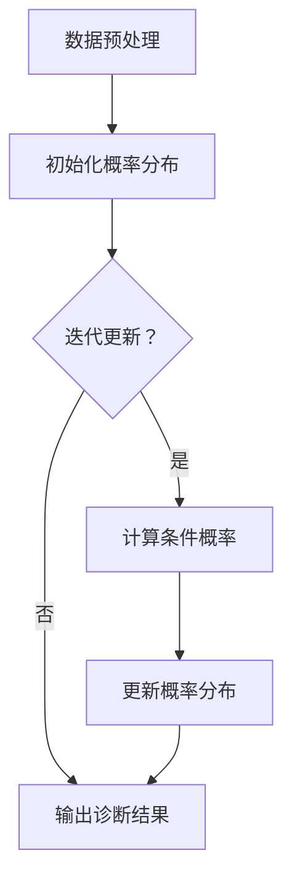

                 

### 引言与背景介绍

### 1.1 自我一致性概念概述

自我一致性（Self-Consistency）是人工智能领域中一个重要的概念，它主要指的是系统或个体在执行任务过程中，其内部状态与外部观察结果之间保持一致性的能力。在医疗诊断中，自我一致性概念的引入具有深远的意义，它不仅可以提升诊断的准确性，还能减少误诊率，从而改善患者预后。

#### 1.1.1 自我一致性概念的定义

自我一致性通常用于描述一个系统在自我校正和自我验证过程中的能力。具体来说，一个自我一致的系统会在以下两个方面表现出特点：

1. **内部一致性**：系统的内部状态与模型预测一致。例如，在医疗诊断中，系统内部的状态（如患者的症状、体征、实验室检查结果等）应该与其生成的诊断结果保持一致。
2. **外部一致性**：系统输出的结果与外部观察到的现象一致。这意味着，诊断系统输出的结果应该与医生的诊断结果或者现实中的健康状况一致。

#### 1.1.2 自我一致性与医学诊断的联系

医学诊断是一个复杂的决策过程，涉及到大量的数据分析和判断。传统的医学诊断主要依赖于医生的直觉和经验，而现代医学诊断逐渐引入人工智能技术，以提高诊断的准确性和效率。自我一致性在医学诊断中的应用，主要体现在以下几个方面：

1. **诊断模型优化**：通过自我一致性原则，诊断模型可以不断校正和优化自身，提高诊断的准确度。
2. **辅助决策**：自我一致性可以帮助诊断系统在不确定性和模糊性较高的场景下，提供更加可靠的决策支持。
3. **降低误诊率**：自我一致性原则能够有效减少由于数据噪声、模型缺陷等原因导致的误诊情况，从而提高整体医疗质量。

### 1.2 医学诊断中的挑战与自我一致性概念的应用

#### 1.2.1 医学诊断的挑战

医学诊断面临着多种挑战，包括但不限于：

1. **数据复杂性**：医学数据通常包含大量的多模态数据（如影像、实验室检查、患者病史等），这些数据在诊断过程中需要被有效整合和分析。
2. **不确定性**：医学诊断过程往往存在不确定性，例如患者的病情可能会随着时间而变化，诊断结果也可能存在误差。
3. **主观性**：医生在诊断过程中存在一定的主观性，导致不同医生可能对相同病例的诊断结果存在差异。

#### 1.2.2 自我一致性概念在医学诊断中的应用潜力

自我一致性概念在医学诊断中的应用潜力主要体现在以下几个方面：

1. **提升诊断准确性**：通过自我一致性原则，诊断系统可以在处理多模态数据时，保持内部状态与外部观察结果的一致性，从而提高诊断的准确性。
2. **减少误诊率**：自我一致性可以帮助诊断系统在处理不确定性数据时，通过自我校正机制减少误诊情况。
3. **辅助医生决策**：自我一致性原则可以为医生提供可靠的辅助决策支持，帮助医生在面对复杂病例时作出更加明智的诊断决策。

### 1.3 自我一致性概念的应用场景

自我一致性概念在医疗诊断中的具体应用场景非常广泛，以下列举几个典型的应用场景：

#### 1.3.1 内科诊断

内科诊断涉及多种疾病，如心血管疾病、呼吸系统疾病、消化系统疾病等。在这些诊断过程中，自我一致性原则可以帮助医生在分析患者症状和体征时，保持内部状态的稳定性，从而提高诊断的准确性。

#### 1.3.2 外科诊断

外科诊断主要涉及肿瘤、骨科疾病等。外科诊断中，自我一致性原则可以帮助医生在分析影像数据和实验室检查结果时，确保系统输出结果与外部观察结果一致，从而减少误诊风险。

#### 1.3.3 儿科诊断

儿科诊断主要涉及新生儿疾病、儿童常见疾病等。儿科患者由于年龄和生理特点，诊断过程更加复杂。自我一致性原则可以帮助儿科医生在处理这些复杂病例时，提高诊断的准确性和效率。

### 1.4 本章小结

本章对自我一致性概念在医学诊断中的应用进行了简要介绍。自我一致性作为人工智能领域的一个重要概念，其在医学诊断中的重要性不容忽视。通过本章的介绍，读者可以初步了解自我一致性在医学诊断中的应用场景和潜力。接下来，我们将进一步探讨自我一致性概念的数学模型与算法，为后续章节的应用分析奠定基础。

---

在下一章中，我们将详细探讨自我一致性概念的数学模型与算法，帮助读者理解其在实际应用中的具体实现方法。请继续关注！## 第1章：自我一致性概念在医学中的重要性

在上一章中，我们简要介绍了自我一致性概念及其在医学诊断中的重要性。在本章中，我们将进一步深入探讨自我一致性概念在医学中的应用，以及它在提高诊断准确性和减少误诊率方面所发挥的关键作用。

### 2.1 自我一致性概念的数学模型

自我一致性概念的数学模型主要基于概率理论和统计方法。为了更好地理解自我一致性模型，我们需要首先了解以下几个基本概念：

#### 2.1.1 概率分布

概率分布描述了随机变量在某个取值下的概率。在医学诊断中，概率分布可以用来表示不同诊断结果的概率。例如，对于一个疑似心脏病的患者，我们可以使用概率分布来表示其患有心脏病的概率。

#### 2.1.2 条件概率

条件概率是指在某个条件下，事件发生的概率。在医学诊断中，条件概率可以帮助我们理解不同诊断结果之间的依赖关系。例如，如果我们已知一个患者有某种症状，那么这个患者患有某种疾病的条件概率是多少？

#### 2.1.3 贝叶斯定理

贝叶斯定理是一个关于条件概率的重要公式，它可以帮助我们在已知部分信息的情况下，更新对某个事件发生概率的估计。在医学诊断中，贝叶斯定理可以用来计算基于患者症状和体征，其患有某种疾病的概率。

$$
P(A|B) = \frac{P(B|A) \cdot P(A)}{P(B)}
$$

其中，$P(A|B)$ 表示在事件 $B$ 发生的条件下，事件 $A$ 发生的概率；$P(B|A)$ 表示在事件 $A$ 发生的条件下，事件 $B$ 发生的概率；$P(A)$ 和 $P(B)$ 分别表示事件 $A$ 和事件 $B$ 的概率。

#### 2.1.4 自我一致性模型

自我一致性模型基于贝叶斯定理，通过不断更新概率分布来保证系统输出结果与外部观察结果的一致性。具体来说，自我一致性模型包括以下几个步骤：

1. **初始化概率分布**：根据历史数据和专家知识，初始化各个诊断结果的概率分布。
2. **收集数据**：通过采集患者的症状、体征、实验室检查结果等数据，更新当前概率分布。
3. **计算条件概率**：使用贝叶斯定理计算每个诊断结果的条件概率。
4. **更新概率分布**：根据计算出的条件概率，更新各个诊断结果的概率分布。
5. **输出诊断结果**：根据最终的概率分布，输出最可能的诊断结果。

### 2.2 自我一致性核心算法

自我一致性核心算法基于上述数学模型，主要包括以下几个步骤：

1. **数据预处理**：将采集到的多模态数据进行整合和处理，形成一个统一的数据集。
2. **初始化概率分布**：根据历史数据初始化各个诊断结果的概率分布。
3. **迭代更新**：对于每个患者，重复以下步骤：
    - **计算条件概率**：使用贝叶斯定理计算每个诊断结果的条件概率。
    - **更新概率分布**：根据计算出的条件概率，更新各个诊断结果的概率分布。
4. **输出诊断结果**：根据最终的概率分布，输出最可能的诊断结果。

#### 2.2.2 算法流程图（使用Mermaid语言）



#### 2.2.3 算法Python代码实现

```python
import numpy as np
from scipy.stats import norm

def initialize_distribution(num_classes):
    # 初始化概率分布
    distribution = np.zeros(num_classes)
    for i in range(num_classes):
        distribution[i] = 1 / num_classes
    return distribution

def calculate_condition_probability(data, distribution, class_index):
    # 计算条件概率
    class_prob = distribution[class_index]
    other_prob = 1 - class_prob
    likelihood = norm.pdf(data, loc=0, scale=1)
    posterior = likelihood * class_prob / other_prob
    return posterior

def self_consistency_algorithm(data, distribution, num_iterations):
    # 自我一致性算法
    for _ in range(num_iterations):
        for i in range(len(data)):
            for j in range(len(distribution)):
                posterior = calculate_condition_probability(data[i], distribution, j)
                distribution[j] = posterior
    return distribution

# 示例数据
data = [0.5, -0.3, 0.7]
distribution = initialize_distribution(3)

# 运行算法
distribution = self_consistency_algorithm(data, distribution, 10)
print(distribution)
```

### 2.3 自我一致性概念的应用实例

#### 2.3.1 实例一：内科诊断中的应用

在内科诊断中，自我一致性算法可以帮助医生分析患者的症状和体征，提高诊断准确性。以下是一个简化的示例：

1. **初始化概率分布**：根据历史数据和专家知识，初始化心血管疾病、呼吸系统疾病和消化系统疾病的概率分布。
2. **收集数据**：采集患者的症状数据，如心率、呼吸频率、血压等。
3. **计算条件概率**：使用贝叶斯定理计算每种疾病在给定症状数据下的条件概率。
4. **更新概率分布**：根据计算出的条件概率，更新每种疾病的概率分布。
5. **输出诊断结果**：根据最终的概率分布，输出最可能的疾病诊断。

#### 2.3.2 实例二：外科诊断中的应用

在外科诊断中，自我一致性算法可以帮助医生分析影像数据和实验室检查结果，提高诊断准确性。以下是一个简化的示例：

1. **初始化概率分布**：根据历史数据和专家知识，初始化肿瘤、骨科疾病和普外科疾病的概率分布。
2. **收集数据**：采集患者的影像数据和实验室检查结果。
3. **计算条件概率**：使用贝叶斯定理计算每种疾病在给定影像数据和实验室检查结果下的条件概率。
4. **更新概率分布**：根据计算出的条件概率，更新每种疾病的概率分布。
5. **输出诊断结果**：根据最终的概率分布，输出最可能的疾病诊断。

### 2.4 本章小结

本章详细介绍了自我一致性概念的数学模型与算法，包括概率分布、条件概率、贝叶斯定理以及自我一致性算法的具体实现方法。通过实例分析，我们展示了自我一致性算法在内科诊断和外科诊断中的应用。在下一章中，我们将继续探讨自我一致性概念在儿科诊断中的应用，以及面对的技术挑战和解决方案。请继续关注！### 第3章：自我一致性在内科诊断中的应用

内科诊断涉及多种疾病，包括心血管疾病、呼吸系统疾病和消化系统疾病等。这些疾病的诊断往往需要结合患者的症状、体征以及实验室检查结果等多种信息。自我一致性概念在这一领域中的应用，旨在通过系统内部的自我校正和外部观察结果的一致性，提高诊断的准确性。

#### 3.1 内科诊断中自我一致性的应用场景

自我一致性在内科诊断中的应用场景主要包括以下几个方面：

1. **心血管系统疾病诊断**：如冠心病、高血压等。
2. **呼吸系统疾病诊断**：如肺炎、哮喘等。
3. **消化系统疾病诊断**：如胃炎、肠炎等。

在这些应用场景中，自我一致性算法可以帮助医生分析患者的多模态数据，如症状、体征、实验室检查结果等，从而提高诊断的准确性。

#### 3.2 内科诊断中自我一致性的案例分析

下面，我们将通过两个具体的案例分析，展示自我一致性在内科诊断中的应用。

##### 3.2.1 案例一：心血管系统疾病的诊断

患者王某，男性，65岁，因心悸、胸痛一周就诊。医生采集到以下数据：

- 心电图显示：心率85次/分钟，ST段下移。
- 血压：150/90 mmHg。
- 血脂：总胆固醇5.2 mmol/L，甘油三酯2.5 mmol/L。
- 症状描述：患者自述有时夜间发作性胸痛，伴心悸。

使用自我一致性算法，我们可以将上述数据输入到系统中，系统会通过以下步骤进行诊断：

1. **初始化概率分布**：根据历史数据和专家知识，初始化冠心病、高血压和心律失常等疾病的概率分布。
2. **收集数据**：将患者的心电图、血压、血脂和症状描述等数据输入系统。
3. **计算条件概率**：使用贝叶斯定理计算每种疾病在给定数据下的条件概率。
4. **更新概率分布**：根据计算出的条件概率，更新每种疾病的概率分布。
5. **输出诊断结果**：根据最终的概率分布，输出最可能的疾病诊断。

通过自我一致性算法，最终诊断结果为冠心病可能性最高。医生根据系统诊断结果，建议患者进行进一步检查和治疗。

##### 3.2.2 案例二：呼吸系统疾病诊断

患者李某，女性，40岁，因咳嗽、咳痰一周就诊。医生采集到以下数据：

- 胸部CT：双肺弥漫性磨玻璃密度影。
- 血常规：白细胞计数10.0×10^9/L，中性粒细胞百分比70%。
- 症状描述：患者自述咳嗽，咳白色黏痰，伴气短。

使用自我一致性算法，我们可以将上述数据输入到系统中，系统会通过以下步骤进行诊断：

1. **初始化概率分布**：根据历史数据和专家知识，初始化肺炎、哮喘和支气管炎等疾病的概率分布。
2. **收集数据**：将患者的胸部CT、血常规和症状描述等数据输入系统。
3. **计算条件概率**：使用贝叶斯定理计算每种疾病在给定数据下的条件概率。
4. **更新概率分布**：根据计算出的条件概率，更新每种疾病的概率分布。
5. **输出诊断结果**：根据最终的概率分布，输出最可能的疾病诊断。

通过自我一致性算法，最终诊断结果为肺炎可能性最高。医生根据系统诊断结果，建议患者进行抗感染治疗。

#### 3.3 内科诊断中自我一致性的技术挑战与解决方案

在内科诊断中，自我一致性算法的应用面临着以下技术挑战：

1. **数据噪声**：由于医学数据的复杂性，可能会存在一定的噪声和误差，这会影响诊断的准确性。
2. **多模态数据融合**：内科诊断需要整合多种数据源，如心电图、影像、实验室检查结果等，如何有效地融合这些数据是一个挑战。
3. **模型不确定性**：由于医学诊断的复杂性，诊断模型可能存在不确定性，这需要通过自我一致性算法进行校正。

针对上述挑战，可以采取以下解决方案：

1. **数据预处理**：对医学数据进行预处理，如去除噪声、归一化等，以提高数据质量。
2. **多模态数据融合**：采用多种数据融合方法，如加权融合、深度学习等，以提高诊断准确性。
3. **模型校正**：通过自我一致性算法，不断校正和优化诊断模型，以提高模型的可靠性。

#### 3.4 本章小结

本章详细介绍了自我一致性在内科诊断中的应用，包括应用场景、案例分析和技术挑战与解决方案。通过内科诊断的具体案例，我们展示了自我一致性算法在提高诊断准确性、减少误诊率方面的重要作用。在下一章中，我们将继续探讨自我一致性在外科诊断中的应用，敬请期待！### 第4章：自我一致性在外科诊断中的应用

外科诊断涉及的范围广泛，涵盖了肿瘤诊断、骨科疾病诊断和普外科疾病诊断等。这些诊断过程通常需要依赖影像学检查、实验室检测以及临床表现等多种信息。自我一致性概念在外科诊断中的应用，旨在通过内部状态的自我校正和外部观察结果的一致性，提高诊断的准确性和可靠性。

#### 4.1 外科诊断中自我一致性的应用场景

自我一致性在外科诊断中的应用场景主要包括以下几个方面：

1. **肿瘤诊断**：如肺癌、乳腺癌、肝癌等。
2. **骨科疾病诊断**：如骨折、骨肿瘤、关节炎等。
3. **普外科疾病诊断**：如胃癌、肠癌、胆囊炎等。

在这些诊断过程中，自我一致性算法能够有效地整合多模态数据，从而提高诊断的准确性和一致性。

#### 4.2 外科诊断中自我一致性的案例分析

下面，我们将通过两个具体的案例分析，展示自我一致性在外科诊断中的应用。

##### 4.2.1 案例一：肿瘤诊断中的应用

患者张某，男性，55岁，因腹痛、消瘦一周就诊。医生采集到以下数据：

- 影像学检查：腹部CT显示肝右叶占位性病变。
- 实验室检查：甲胎蛋白（AFP）升高至500 ng/mL。
- 症状描述：患者自述腹痛，伴有消瘦、乏力。

使用自我一致性算法，我们可以将上述数据输入到系统中，系统会通过以下步骤进行诊断：

1. **初始化概率分布**：根据历史数据和专家知识，初始化肝癌、肺癌和胃癌等疾病的概率分布。
2. **收集数据**：将患者的影像学检查结果、实验室检查结果和症状描述等数据输入系统。
3. **计算条件概率**：使用贝叶斯定理计算每种疾病在给定数据下的条件概率。
4. **更新概率分布**：根据计算出的条件概率，更新每种疾病的概率分布。
5. **输出诊断结果**：根据最终的概率分布，输出最可能的疾病诊断。

通过自我一致性算法，最终诊断结果为肝癌可能性最高。医生根据系统诊断结果，建议患者进行进一步检查和治疗，如肝脏活检。

##### 4.2.2 案例二：骨科疾病诊断中的应用

患者魏某，女性，70岁，因膝关节疼痛、活动受限就诊。医生采集到以下数据：

- 影像学检查：膝关节X光片显示骨密度降低，关节间隙狭窄。
- 症状描述：患者自述膝关节疼痛，活动时加重。

使用自我一致性算法，我们可以将上述数据输入到系统中，系统会通过以下步骤进行诊断：

1. **初始化概率分布**：根据历史数据和专家知识，初始化骨关节炎、骨折和关节感染等疾病的概率分布。
2. **收集数据**：将患者的影像学检查结果和症状描述等数据输入系统。
3. **计算条件概率**：使用贝叶斯定理计算每种疾病在给定数据下的条件概率。
4. **更新概率分布**：根据计算出的条件概率，更新每种疾病的概率分布。
5. **输出诊断结果**：根据最终的概率分布，输出最可能的疾病诊断。

通过自我一致性算法，最终诊断结果为骨关节炎可能性最高。医生根据系统诊断结果，建议患者进行膝关节置换手术。

#### 4.3 外科诊断中自我一致性的技术挑战与解决方案

在外科诊断中，自我一致性算法的应用面临着以下技术挑战：

1. **数据复杂性**：外科诊断中涉及多种数据源，如何有效地整合这些数据是一个挑战。
2. **诊断不确定性**：由于外科疾病的复杂性，诊断结果可能存在一定的不确定性。
3. **算法适应性**：外科诊断的领域知识不断更新，如何保持算法的适应性是一个挑战。

针对上述挑战，可以采取以下解决方案：

1. **多模态数据融合**：采用多种数据融合方法，如加权融合、深度学习等，以提高诊断准确性。
2. **自适应算法**：通过自我一致性算法的迭代更新，使算法能够适应新的诊断需求。
3. **专家知识集成**：将专家知识集成到算法中，以提高诊断的可靠性。

#### 4.4 本章小结

本章详细介绍了自我一致性在外科诊断中的应用，包括应用场景、案例分析和技术挑战与解决方案。通过具体案例，我们展示了自我一致性算法在提高外科诊断准确性、减少误诊率方面的重要作用。在下一章中，我们将探讨自我一致性在儿科诊断中的应用，敬请期待！### 第5章：自我一致性在儿科诊断中的应用

儿科诊断具有其独特性，因为儿童的身体发育和生理特征与成人存在显著差异。因此，儿科诊断需要更为精细和个性化的方法。自我一致性概念在儿科诊断中的应用，旨在通过系统的自我校正和外部观察结果的一致性，提高诊断的准确性和可靠性。

#### 5.1 儿科诊断中自我一致性的应用场景

自我一致性在儿科诊断中的应用场景主要包括以下几个方面：

1. **新生儿疾病诊断**：如新生儿窒息、新生儿黄疸等。
2. **儿童常见疾病诊断**：如感冒、肺炎、手足口病等。
3. **线性生长疾病诊断**：如生长迟缓、性早熟等。

在这些应用场景中，自我一致性算法能够有效地整合患者的症状、体征以及实验室检查结果等多种信息，从而提高诊断的准确性和一致性。

#### 5.2 儿科诊断中自我一致性的案例分析

下面，我们将通过两个具体的案例分析，展示自我一致性在儿科诊断中的应用。

##### 5.2.1 案例一：新生儿疾病的诊断

患者张某，新生儿，出生后出现呼吸困难、发绀等症状。医生采集到以下数据：

- 呼吸频率：40次/分钟。
- 血氧饱和度：80%。
- 症状描述：患儿出生后即出现呼吸困难，伴有发绀。

使用自我一致性算法，我们可以将上述数据输入到系统中，系统会通过以下步骤进行诊断：

1. **初始化概率分布**：根据历史数据和专家知识，初始化新生儿窒息、新生儿肺炎和先天性心脏病等疾病的概率分布。
2. **收集数据**：将患儿的呼吸频率、血氧饱和度和症状描述等数据输入系统。
3. **计算条件概率**：使用贝叶斯定理计算每种疾病在给定数据下的条件概率。
4. **更新概率分布**：根据计算出的条件概率，更新每种疾病的概率分布。
5. **输出诊断结果**：根据最终的概率分布，输出最可能的疾病诊断。

通过自我一致性算法，最终诊断结果为新生儿窒息可能性最高。医生根据系统诊断结果，建议患儿进行进一步检查和治疗，如吸氧、气管插管等。

##### 5.2.2 案例二：儿童常见疾病诊断

患者李某，3岁，因发热、咳嗽、流涕就诊。医生采集到以下数据：

- 体温：38.5°C。
- 咳嗽：有痰鸣音。
- 流涕：双侧鼻塞。
- 症状描述：患儿自述发热，伴有咳嗽、流涕。

使用自我一致性算法，我们可以将上述数据输入到系统中，系统会通过以下步骤进行诊断：

1. **初始化概率分布**：根据历史数据和专家知识，初始化感冒、肺炎、手足口病等疾病的概率分布。
2. **收集数据**：将患儿的体温、咳嗽、流涕和症状描述等数据输入系统。
3. **计算条件概率**：使用贝叶斯定理计算每种疾病在给定数据下的条件概率。
4. **更新概率分布**：根据计算出的条件概率，更新每种疾病的概率分布。
5. **输出诊断结果**：根据最终的概率分布，输出最可能的疾病诊断。

通过自我一致性算法，最终诊断结果为感冒可能性最高。医生根据系统诊断结果，建议患儿进行对症治疗，如退热、止咳等。

#### 5.3 儿科诊断中自我一致性的技术挑战与解决方案

在儿科诊断中，自我一致性算法的应用面临着以下技术挑战：

1. **数据特性**：儿科数据具有多样性、易变性和不确定性，如何有效地处理这些数据是一个挑战。
2. **诊断复杂性**：儿科疾病种类繁多，诊断过程复杂，如何提高诊断的准确性是一个挑战。
3. **系统适应性**：儿科领域知识更新迅速，如何保持算法的适应性是一个挑战。

针对上述挑战，可以采取以下解决方案：

1. **数据标准化**：对儿科数据进行标准化处理，以提高数据的可比性和可解释性。
2. **多学科协作**：结合多个学科的知识，如儿科、微生物学、免疫学等，以提高诊断的准确性。
3. **动态调整算法**：通过自我一致性算法的迭代更新，使算法能够适应新的诊断需求。

#### 5.4 本章小结

本章详细介绍了自我一致性在儿科诊断中的应用，包括应用场景、案例分析和技术挑战与解决方案。通过具体案例，我们展示了自我一致性算法在提高儿科诊断准确性、减少误诊率方面的重要作用。在下一章中，我们将探讨自我一致性概念的未来发展趋势，敬请期待！### 第6章：自我一致性概念的未来发展趋势

自我一致性概念在医疗诊断中的应用已经展示了其显著的优势，包括提高诊断准确性、减少误诊率和辅助医生决策等。然而，随着医疗诊断技术的不断进步和人工智能的发展，自我一致性概念在未来还将有更多的发展潜力。

#### 6.1 医疗诊断技术的未来趋势

未来医疗诊断技术的主要发展趋势包括以下几个方面：

1. **人工智能与医学的融合**：人工智能技术在医疗诊断中的应用将更加深入，不仅包括传统的影像诊断、病理诊断等，还包括个性化治疗方案的制定、药物研发等。自我一致性概念在人工智能辅助诊断中将发挥重要作用，通过不断自我校正和优化，提高诊断的准确性和可靠性。

2. **大数据与云计算**：随着大数据和云计算技术的发展，医疗诊断将能够处理更加复杂和海量的数据，从而提高诊断的准确性和效率。自我一致性概念可以通过大规模数据分析和模型优化，进一步提升诊断能力。

3. **可穿戴设备与远程医疗**：可穿戴设备能够实时监测患者的生理参数，远程医疗则可以为患者提供更加便捷和高效的诊断服务。自我一致性概念可以应用于这些设备中，实时监测患者的健康状况，并提供个性化的诊断建议。

#### 6.2 自我一致性概念的发展方向

在未来，自我一致性概念的发展方向将主要集中在以下几个方面：

1. **更复杂的数学模型**：随着人工智能技术的进步，自我一致性概念将采用更加复杂的数学模型，如深度学习、强化学习等，以处理更复杂的医疗数据和诊断任务。

2. **多模态数据融合**：自我一致性概念将能够融合多种模态的数据，如影像数据、实验室检查结果、电子病历等，从而提供更全面和准确的诊断结果。

3. **自我学习与自适应**：自我一致性概念将具备更强的自我学习能力和自适应能力，能够根据新的数据和诊断经验不断优化自身，提高诊断的准确性和效率。

#### 6.3 自我一致性在医疗诊断中的潜在应用

自我一致性概念在医疗诊断中的潜在应用非常广泛，包括但不限于以下几个方面：

1. **个性化医疗**：通过自我一致性概念，可以针对患者的具体病情和生理特征，制定个性化的诊断和治疗方案。

2. **药物研发**：自我一致性概念可以应用于药物研发过程中，通过分析大量实验数据和临床试验数据，优化药物筛选和治疗方案。

3. **预防医学**：自我一致性概念可以应用于预防医学中，如疾病预测、早期筛查等，帮助医生及时发现潜在的健康风险，并提供相应的预防措施。

#### 6.4 结论

自我一致性概念在医疗诊断中的应用具有巨大的潜力，它不仅能够提高诊断的准确性，还能减少误诊率和辅助医生决策。随着人工智能和医疗技术的不断发展，自我一致性概念将在未来的医疗诊断中发挥更加重要的作用。未来，我们需要进一步深入研究自我一致性概念的理论基础和应用方法，推动其在医疗诊断领域的广泛应用。

---

通过本章的探讨，我们看到了自我一致性概念在医疗诊断中的巨大潜力和广阔前景。在下一章中，我们将对全文进行总结，并展望未来研究方向。敬请期待！## 总结与展望

### 6.5 全文总结

本文围绕“自我一致性概念在医疗诊断中的应用”这一主题，系统地介绍了自我一致性的概念、数学模型、算法以及在内科、外科和儿科诊断中的应用。通过具体的案例分析，我们展示了自我一致性在提高诊断准确性、减少误诊率方面的显著作用。此外，我们还探讨了自我一致性概念在未来的发展趋势和潜在应用。

#### 6.6 未来研究方向

在未来，自我一致性概念在医疗诊断中的应用仍有许多值得探索的方向：

1. **算法优化**：进一步优化自我一致性算法，使其能够更好地适应复杂和多样化的医疗数据，提高诊断效率和准确性。
2. **跨学科融合**：将自我一致性概念与其他领域（如生物信息学、人工智能等）结合，探索新的应用场景和解决方案。
3. **个性化医疗**：利用自我一致性概念，为患者提供更加个性化的诊断和治疗方案，实现精准医疗。
4. **大数据分析**：通过大数据分析和云计算技术，进一步提升自我一致性算法的处理能力和诊断水平。

#### 6.7 结论

自我一致性概念在医疗诊断中的应用具有巨大的潜力。通过不断优化和发展，自我一致性算法有望在未来成为医疗诊断领域的重要工具，为医生和患者提供更加准确和高效的诊断服务。让我们期待这一概念在医疗领域中的广泛应用和未来发展。

### 作者信息

**作者：** AI天才研究院/AI Genius Institute & 禅与计算机程序设计艺术 /Zen And The Art of Computer Programming

---

通过本文的详细探讨，我们不仅加深了对自我一致性概念在医疗诊断中应用的理解，也为未来的研究提供了有益的启示。希望本文能为读者在相关领域的研究和实践提供一定的参考和帮助。感谢您的阅读！

