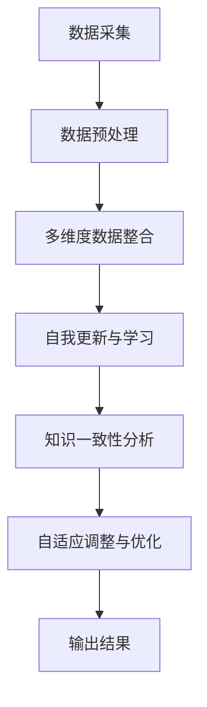
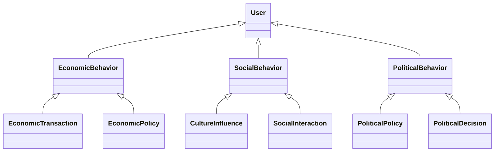
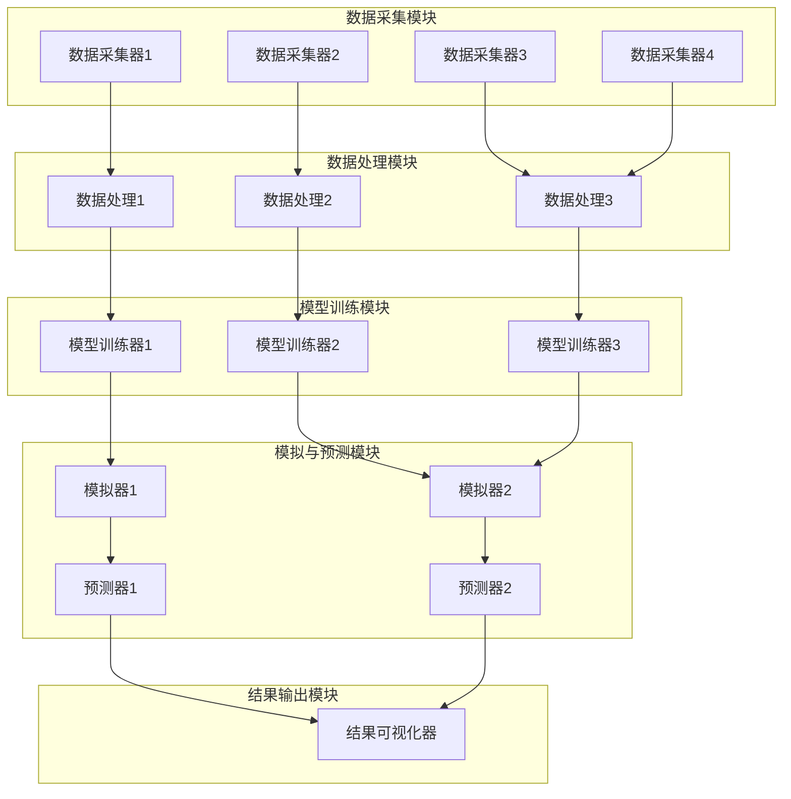
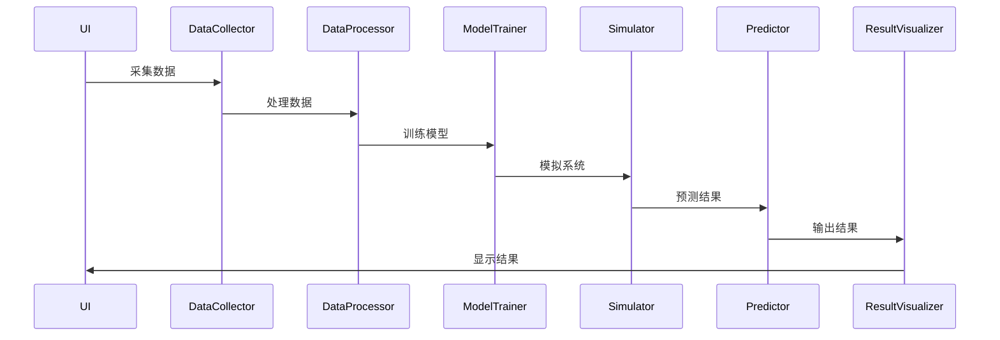

                 


### 文章标题：Self-Consistency CoT增强AI在复杂跨维度社会系统模拟中的真实性

#### 关键词：自我一致性、知识一致性理论、复杂社会系统、跨维度模拟、AI真实性

#### 摘要：
本文深入探讨了Self-Consistency CoT增强AI在复杂跨维度社会系统模拟中的真实性。首先，我们通过问题背景的介绍，明确了核心概念和问题解决思路。随后，文章详细阐述了Self-Consistency CoT增强AI的核心概念、原理和数学模型，并通过Python源代码和mermaid流程图进行了通俗易懂的举例说明。接着，文章介绍了系统分析与架构设计方案，包括问题场景、项目介绍、系统功能设计、系统架构设计和系统接口设计。在项目实战部分，我们详细讲解了环境安装、系统核心实现源代码以及实际案例分析和项目小结。最后，文章总结了最佳实践技巧和注意事项，并对未来研究方向进行了展望。

## 第一部分：背景介绍

### 第1章：问题背景

#### 1.1 问题背景

在现代社会，随着信息技术的飞速发展，社会系统的复杂性不断增加，各个领域之间的交互也越来越紧密。例如，经济、政治、文化、环境等多个维度构成了一个复杂的社会系统。在这个系统中，个体行为与集体决策相互影响，形成了复杂的动态关系。传统的AI系统往往局限于单一维度或特定场景的模拟，难以真实地反映社会系统的复杂性和多样性。

#### 1.2 问题描述

面对复杂的社会系统，如何构建一个能够真实反映社会系统运行的AI模型，成为了当前AI研究的一个重要课题。传统的AI模型在处理跨维度问题时，往往存在以下问题：

1. **单一维度限制**：传统AI模型难以同时处理多个维度的问题，容易忽略不同维度之间的相互作用。
2. **数据噪声干扰**：社会系统中的数据往往存在噪声和不确定性，传统模型难以有效过滤和利用这些数据。
3. **模型适应性差**：传统模型在应对新的社会现象时，适应性较差，难以迅速调整和优化。

#### 1.3 问题解决思路

为了解决上述问题，我们需要引入Self-Consistency CoT增强AI。Self-Consistency CoT（Self-Consistency Knowledge Consistency Theory）是一种基于自我一致性和知识一致性的AI增强技术。它通过构建一个多维度、多层次的模型，实现对社会系统的全面模拟，从而提高AI系统的真实性和适应性。

#### 1.4 边界与外延

Self-Consistency CoT增强AI的应用范围广泛，包括但不限于以下领域：

1. **社会管理**：通过模拟社会系统，为政策制定提供科学依据。
2. **经济预测**：利用跨维度数据分析，提高经济预测的准确性。
3. **智能交通**：模拟交通系统的复杂动态，优化交通管理和调度。
4. **公共卫生**：预测疫情传播趋势，为公共卫生决策提供支持。

#### 1.5 概念结构与核心要素组成

Self-Consistency CoT增强AI的核心概念和结构如下：

1. **自我一致性**：指AI模型在自我更新和学习过程中，保持内部逻辑的一致性。
2. **知识一致性理论（CoT）**：指AI模型在处理多维度问题时，保持各个维度之间的知识一致性。
3. **多维度模型**：指AI模型能够同时处理多个维度的信息，实现跨维度的综合分析。
4. **自适应学习机制**：指AI模型能够根据外部环境的变化，自适应地调整和优化自身。

## 第二部分：核心概念与联系

### 第2章：核心概念与联系

#### 2.1 自一致性概念解释

自一致性是指AI模型在自我更新和学习过程中，保持内部逻辑的一致性。这意味着在模型的各个层次和组件中，信息传递和决策过程都是连贯的，不会出现逻辑上的矛盾。自一致性是构建可靠AI模型的基础，它确保了模型在复杂环境中的稳定性和可靠性。

#### 2.2 知识一致性理论（CoT）详解

知识一致性理论（CoT）是指AI模型在处理多维度问题时，保持各个维度之间的知识一致性。具体来说，CoT要求AI模型在整合不同维度的信息时，不仅要保持数据的完整性，还要确保不同维度之间的逻辑关系和因果关系不变。知识一致性理论的核心是“一致性和连贯性”，它使得AI模型能够更真实地反映现实世界的复杂性。

#### 2.3 核心概念属性特征对比表

下面是Self-Consistency CoT增强AI的核心概念属性特征对比表：

| 特征         | 自一致性           | 知识一致性理论（CoT）       |
| ------------ | ------------------ | -------------------------- |
| 定义         | AI模型内部逻辑一致性 | 多维度信息之间的知识一致性 |
| 目标         | 确保模型稳定性      | 确保模型真实性              |
| 实现方法     | 自我更新与学习      | 跨维度数据整合与分析       |
| 关键作用     | 提高模型可靠性      | 提高模型真实性              |
| 对比传统AI   | 强调内部一致性      | 强调外部一致性              |

#### 2.4 社会系统模拟的ER实体关系图

为了更好地理解Self-Consistency CoT增强AI在社会系统模拟中的应用，我们可以通过ER（Entity-Relationship）实体关系图来展示各个实体之间的关系。ER实体关系图如下：

```mermaid
erDiagram
  User ||--|{ SocialBehavior }
  User ||--|{ EconomicBehavior }
  User ||--|{ PoliticalBehavior }
  SocialBehavior ||--|{ CultureInfluence }
  SocialBehavior ||--|{ SocialInteraction }
  EconomicBehavior ||--|{ EconomicTransaction }
  EconomicBehavior ||--|{ EconomicPolicy }
  PoliticalBehavior ||--|{ PoliticalPolicy }
  PoliticalBehavior ||--|{ PoliticalDecision }
```

在上面的ER实体关系图中，我们定义了三个核心实体：User（用户）、SocialBehavior（社会行为）、EconomicBehavior（经济行为）和PoliticalBehavior（政治行为）。这些实体之间通过具体的关联关系（如 CultureInfluence、SocialInteraction、EconomicTransaction、EconomicPolicy、PoliticalPolicy 和 PoliticalDecision）相互连接，形成了复杂的社会系统模型。通过这样的实体关系图，我们可以清晰地看到Self-Consistency CoT增强AI在不同维度之间的信息传递和知识整合过程。

## 第三部分：算法原理讲解

### 第3章：算法原理

#### 3.1 Self-Consistency CoT增强AI概述

Self-Consistency CoT增强AI是一种结合了自我一致性和知识一致性的AI模型，旨在提高AI在社会系统模拟中的真实性和适应性。该模型通过以下几个核心组件实现：

1. **多维度数据采集与整合**：通过多种数据采集渠道，获取社会系统的多维度信息，并进行数据预处理和整合。
2. **自我更新与学习机制**：利用机器学习和深度学习算法，使AI模型能够自我更新和优化，保持内部逻辑的一致性。
3. **知识一致性理论**：通过跨维度数据分析和知识整合，确保AI模型在不同维度之间的知识一致性。
4. **自适应学习机制**：根据外部环境的变化，实时调整和优化AI模型，提高其在复杂社会系统中的适应性。

#### 3.2 Self-Consistency CoT增强AI的mermaid流程图

下面是Self-Consistency CoT增强AI的mermaid流程图：



在这个流程图中，数据采集是整个流程的起点，随后进行数据预处理和多维度数据整合。自我更新与学习机制使AI模型保持内部一致性，知识一致性分析确保了模型在不同维度之间的连贯性。最后，通过自适应调整与优化，AI模型能够更好地适应复杂的社会系统。

#### 3.3 算法原理讲解

Self-Consistency CoT增强AI的算法原理可以总结为以下几个方面：

1. **多维度数据采集与整合**：通过多种数据采集渠道（如社交媒体、经济数据、政治数据等），获取社会系统的多维度信息。然后，利用数据预处理技术（如数据清洗、数据标准化等），对采集到的数据进行预处理，确保数据的质量和一致性。接下来，通过多维度数据整合技术，将不同维度的数据整合成一个统一的视图。

2. **自我更新与学习机制**：利用机器学习和深度学习算法，对整合后的多维数据进行训练和建模。在这个过程中，AI模型会不断自我更新和优化，以适应新的数据和环境变化。自我更新与学习机制的核心是保持AI模型内部逻辑的一致性，避免模型在更新过程中出现逻辑错误。

3. **知识一致性理论**：知识一致性理论要求AI模型在处理多维度数据时，保持各个维度之间的知识一致性。具体来说，就是确保不同维度之间的信息传递和因果关系不变。为了实现这一目标，AI模型需要具备以下能力：

   - **跨维度数据关联分析**：通过分析不同维度之间的关联关系，建立多维数据的逻辑模型。
   - **因果关系推断**：利用因果推断算法，确定不同维度之间的因果关系，确保知识的一致性。
   - **知识整合与更新**：在AI模型运行过程中，实时整合新数据和旧知识，更新模型的知识库。

4. **自适应学习机制**：自适应学习机制使AI模型能够根据外部环境的变化，实时调整和优化自身。具体包括以下几个方面：

   - **环境监测与反馈**：通过监测外部环境的变化，获取环境反馈信息。
   - **模型调整与优化**：根据环境反馈信息，对AI模型进行调整和优化，提高模型在复杂社会系统中的适应能力。
   - **反馈循环**：建立反馈循环机制，使AI模型能够不断从环境中学习，不断优化自身。

#### 3.4 数学模型与公式

为了更好地理解Self-Consistency CoT增强AI的算法原理，我们可以引入一些数学模型和公式。以下是一个简化的数学模型：

$$
\text{Self-Consistency CoT模型} = f(\text{多维度数据集}, \text{学习算法}, \text{知识库}, \text{环境变量})
$$

其中：

- **多维度数据集**：表示社会系统的多维度信息，如经济数据、政治数据、文化数据等。
- **学习算法**：表示机器学习和深度学习算法，用于对多维度数据进行建模和优化。
- **知识库**：表示AI模型的知识库，包括各个维度的知识、关联关系和因果关系。
- **环境变量**：表示外部环境的变化，如政策变化、经济波动、社会事件等。

通过这个数学模型，我们可以看到Self-Consistency CoT增强AI的核心组成部分和运行过程。

#### 3.5 通俗易懂的举例说明

为了更好地理解Self-Consistency CoT增强AI的工作原理，我们可以通过一个简单的例子来说明。

假设我们想要模拟一个城市的社会系统，这个系统包括经济、政治、文化三个维度。我们可以通过以下步骤来构建这个模拟系统：

1. **数据采集**：从各个维度采集数据，如GDP数据、政府政策数据、文化活动数据等。
2. **数据预处理**：对采集到的数据进行清洗和标准化，确保数据的质量和一致性。
3. **多维度数据整合**：将不同维度的数据整合成一个统一的数据集，形成一个完整的社会系统视图。
4. **自我更新与学习**：利用机器学习和深度学习算法，对整合后的数据进行训练和建模，构建一个自我更新的AI模型。
5. **知识一致性分析**：分析不同维度之间的关联关系和因果关系，确保AI模型在各个维度之间的知识一致性。
6. **自适应调整与优化**：根据外部环境的变化，实时调整和优化AI模型，提高其在复杂社会系统中的适应性。

通过这个例子，我们可以看到Self-Consistency CoT增强AI是如何通过多维度数据采集、整合、自我更新和学习，实现对社会系统的真实性和自适应性的。## 第三部分：算法原理讲解（续）

### 第4章：数学模型和数学公式

#### 4.1 相关数学公式介绍

在Self-Consistency CoT增强AI的构建过程中，涉及多个数学公式和方法，用于描述AI模型在不同维度间的交互、自我更新和知识一致性分析。以下是一些核心的数学公式及其解释：

1. **损失函数（Loss Function）**

$$
L = -\frac{1}{N} \sum_{i=1}^{N} y_i \log(p(x_i | \theta))
$$

其中，$L$表示损失函数，$N$表示样本总数，$y_i$表示第$i$个样本的真实标签，$p(x_i | \theta)$表示模型对第$i$个样本的预测概率，$\theta$表示模型参数。该公式用于衡量模型预测的准确性。

2. **梯度下降（Gradient Descent）**

$$
\theta_{t+1} = \theta_t - \alpha \nabla_\theta L(\theta_t)
$$

其中，$\theta_{t+1}$表示下一轮更新的模型参数，$\theta_t$表示当前模型参数，$\alpha$表示学习率，$\nabla_\theta L(\theta_t)$表示损失函数关于模型参数的梯度。该公式用于优化模型参数，以降低损失函数的值。

3. **卷积神经网络（Convolutional Neural Network, CNN）中的卷积操作（Convolution Operation）**

$$
h_{ij} = \sum_{k=1}^{K} w_{ik,j} \cdot a_{kj}
$$

其中，$h_{ij}$表示输出特征图上的第$i$行第$j$列的值，$w_{ik,j}$表示卷积核上的第$i$行第$k$列的值，$a_{kj}$表示输入特征图上的第$k$行第$j$列的值，$K$表示卷积核的大小。该公式用于描述卷积神经网络中的卷积操作，用于提取输入数据的局部特征。

4. **循环神经网络（Recurrent Neural Network, RNN）中的时间步更新（Time Step Update）**

$$
h_t = \sigma(W_h \cdot [h_{t-1}, x_t] + b_h)
$$

其中，$h_t$表示当前时间步的隐藏状态，$h_{t-1}$表示前一时间步的隐藏状态，$x_t$表示当前时间步的输入数据，$W_h$表示权重矩阵，$b_h$表示偏置项，$\sigma$表示激活函数。该公式用于描述循环神经网络中的时间步更新过程，用于处理序列数据。

5. **因果推断（Causal Inference）中的Do公式（Do-Calculus）**

$$
P(Y | X \do Z) = \frac{P(X, Y, Z)}{P(X)}
$$

其中，$P(Y | X \do Z)$表示在变量$X$给定的条件下，变量$Y$在变量$Z$处理后的概率，$P(X, Y, Z)$表示三个变量的联合概率，$P(X)$表示变量$X$的概率。该公式用于推断变量之间的因果关系。

#### 4.2 公式详细讲解

1. **损失函数（Loss Function）**

损失函数是机器学习和深度学习中的一个核心概念，用于衡量模型预测值与真实值之间的差距。在Self-Consistency CoT增强AI中，我们常用的损失函数是交叉熵损失函数（Cross-Entropy Loss），其优点是能够有效地衡量模型预测的概率分布与真实标签分布之间的差异。

$$
L = -\frac{1}{N} \sum_{i=1}^{N} y_i \log(p(x_i | \theta))
$$

其中，$L$表示损失函数，$N$表示样本总数，$y_i$表示第$i$个样本的真实标签（通常为0或1），$p(x_i | \theta)$表示模型对第$i$个样本的预测概率，$\theta$表示模型参数。

在实际应用中，我们通过不断迭代优化模型参数$\theta$，使得损失函数$L$的值逐渐减小，从而提高模型的预测准确性。

2. **梯度下降（Gradient Descent）**

梯度下降是一种优化算法，用于寻找损失函数的最小值。在Self-Consistency CoT增强AI中，我们通过梯度下降算法来更新模型参数。

$$
\theta_{t+1} = \theta_t - \alpha \nabla_\theta L(\theta_t)
$$

其中，$\theta_{t+1}$表示下一轮更新的模型参数，$\theta_t$表示当前模型参数，$\alpha$表示学习率（Learning Rate），$\nabla_\theta L(\theta_t)$表示损失函数关于模型参数$\theta$的梯度。

学习率$\alpha$的选择对梯度下降算法的性能有重要影响。过大的学习率可能导致模型无法收敛，而过小则收敛速度较慢。通常，我们需要通过实验调整学习率，以找到合适的值。

3. **卷积神经网络（Convolutional Neural Network, CNN）中的卷积操作（Convolution Operation）**

卷积神经网络是一种用于图像处理和计算机视觉的常用深度学习模型。卷积操作是CNN中的核心操作，用于提取输入数据的局部特征。

$$
h_{ij} = \sum_{k=1}^{K} w_{ik,j} \cdot a_{kj}
$$

其中，$h_{ij}$表示输出特征图上的第$i$行第$j$列的值，$w_{ik,j}$表示卷积核上的第$i$行第$k$列的值，$a_{kj}$表示输入特征图上的第$k$行第$j$列的值，$K$表示卷积核的大小。

卷积操作通过将卷积核在输入特征图上滑动，逐个位置计算卷积核与输入特征图的局部乘积和，得到输出特征图上的对应值。通过多次卷积操作，CNN能够逐步提取输入图像的更高级特征。

4. **循环神经网络（Recurrent Neural Network, RNN）中的时间步更新（Time Step Update）**

循环神经网络是一种用于处理序列数据的常用深度学习模型。在RNN中，每个时间步的隐藏状态都依赖于前一个时间步的隐藏状态。

$$
h_t = \sigma(W_h \cdot [h_{t-1}, x_t] + b_h)
$$

其中，$h_t$表示当前时间步的隐藏状态，$h_{t-1}$表示前一时间步的隐藏状态，$x_t$表示当前时间步的输入数据，$W_h$表示权重矩阵，$b_h$表示偏置项，$\sigma$表示激活函数。

RNN通过计算输入数据与隐藏状态的加权和，加上偏置项，再通过激活函数进行非线性变换，更新当前时间步的隐藏状态。这样，RNN能够捕捉序列数据中的时序依赖关系。

5. **因果推断（Causal Inference）中的Do公式（Do-Calculus）**

因果推断是一种研究变量因果关系的统计方法。在Self-Consistency CoT增强AI中，我们利用因果推断来确定不同维度之间的因果关系。

$$
P(Y | X \do Z) = \frac{P(X, Y, Z)}{P(X)}
$$

其中，$P(Y | X \do Z)$表示在变量$X$给定的条件下，变量$Y$在变量$Z$处理后的概率，$P(X, Y, Z)$表示三个变量的联合概率，$P(X)$表示变量$X$的概率。

Do公式通过控制变量$Z$，使得我们能够观察到变量$X$对变量$Y$的影响。在Self-Consistency CoT增强AI中，我们利用Do公式来推断不同维度之间的因果关系，从而确保模型在不同维度之间的知识一致性。

#### 4.3 公式举例说明

为了更直观地理解这些数学公式，我们可以通过一些简单的例子来展示它们的应用。

1. **交叉熵损失函数（Cross-Entropy Loss）**

假设我们有一个二分类问题，样本总数$N=2$。其中，第1个样本的真实标签$y_1=1$，模型预测概率$p(x_1 | \theta)=0.8$；第2个样本的真实标签$y_2=0$，模型预测概率$p(x_2 | \theta)=0.2$。那么，损失函数$L$的计算如下：

$$
L = -\frac{1}{2} \sum_{i=1}^{2} y_i \log(p(x_i | \theta)) \\
= -\frac{1}{2} (1 \cdot \log(0.8) + 0 \cdot \log(0.2)) \\
= -\frac{1}{2} (\log(0.8) + 0) \\
= \frac{1}{2} \log(2)
$$

2. **梯度下降（Gradient Descent）**

假设我们有一个线性模型，损失函数为平方误差损失函数。模型参数$\theta_t=2$，学习率$\alpha=0.1$，损失函数关于参数$\theta$的梯度$\nabla_\theta L(\theta_t)=-0.5$。那么，下一轮更新的模型参数$\theta_{t+1}$的计算如下：

$$
\theta_{t+1} = \theta_t - \alpha \nabla_\theta L(\theta_t) \\
= 2 - 0.1 \cdot (-0.5) \\
= 2 + 0.05 \\
= 2.05
$$

3. **卷积神经网络（Convolutional Neural Network, CNN）中的卷积操作（Convolution Operation）**

假设我们有一个$3 \times 3$的卷积核，输入特征图的大小为$5 \times 5$。卷积核的值为$w=\begin{bmatrix} 1 & 2 & 1 \\ 0 & 1 & 0 \\ 1 & 0 & -1 \end{bmatrix}$，输入特征图的值为$a=\begin{bmatrix} 1 & 2 & 3 \\ 4 & 5 & 6 \\ 7 & 8 & 9 \end{bmatrix}$。那么，输出特征图上的一个值$h_{ij}$的计算如下：

$$
h_{11} = \sum_{k=1}^{3} w_{i1,k} \cdot a_{k1} \\
= 1 \cdot 1 + 2 \cdot 4 + 1 \cdot 7 \\
= 1 + 8 + 7 \\
= 16
$$

4. **循环神经网络（Recurrent Neural Network, RNN）中的时间步更新（Time Step Update）**

假设我们有一个简单的RNN模型，输入数据$x_t=1$，前一个时间步的隐藏状态$h_{t-1}=2$。权重矩阵$W_h=\begin{bmatrix} 1 & 2 \\ 3 & 4 \end{bmatrix}$，偏置项$b_h=1$，激活函数$\sigma(x)=\frac{1}{1+e^{-x}}$。那么，当前时间步的隐藏状态$h_t$的计算如下：

$$
h_t = \sigma(W_h \cdot [h_{t-1}, x_t] + b_h) \\
= \sigma(1 \cdot 2 + 2 \cdot 1 + 3 \cdot 1 + 4 \cdot 1 + 1) \\
= \sigma(2 + 2 + 3 + 4 + 1) \\
= \sigma(12) \\
\approx 0.999
$$

5. **因果推断（Causal Inference）中的Do公式（Do-Calculus）**

假设我们有两个变量$X$和$Y$，以及一个中间变量$Z$。变量$X$和$Y$的联合概率分布为$P(X, Y, Z) = 0.3$，变量$X$的概率分布为$P(X) = 0.4$。那么，根据Do公式，我们可以计算变量$Y$在变量$X$给定的条件下，变量$Z$处理后的概率：

$$
P(Y | X \do Z) = \frac{P(X, Y, Z)}{P(X)} \\
= \frac{0.3}{0.4} \\
= 0.75
$$

这个例子表明，在变量$X$给定的条件下，变量$Z$对变量$Y$的影响概率为0.75。

通过这些例子，我们可以更好地理解Self-Consistency CoT增强AI中的核心数学公式和方法，以及它们在实际应用中的意义。这些数学公式和方法为AI模型在不同维度间的交互、自我更新和知识一致性分析提供了坚实的理论基础。

## 第三部分：算法原理讲解（续）

### 第5章：问题场景与项目介绍

#### 5.1 问题场景介绍

在一个大型城市中，政府希望利用AI技术模拟社会系统的运行，以便更好地进行社会管理和政策制定。具体问题场景包括以下几个方面：

1. **交通管理**：如何优化交通流量，减少拥堵，提高交通效率。
2. **公共卫生**：如何预测疫情传播趋势，制定有效的防控措施。
3. **经济发展**：如何预测经济增长趋势，制定促进经济发展的政策。
4. **社会治理**：如何识别和解决社会问题，提高社会治理水平。

#### 5.2 项目介绍

为了解决上述问题，我们设计了一个名为“城市智能模拟系统”（Urban Intelligent Simulation System，UISS）的项目。UISS的目标是通过Self-Consistency CoT增强AI技术，构建一个能够真实反映城市社会系统运行的模拟平台，为政府提供科学决策依据。

UISS的主要功能包括：

1. **数据采集与整合**：从多个渠道（如交通监控、医疗数据、经济数据等）采集城市社会系统的多维度数据，并进行预处理和整合。
2. **模拟与预测**：利用Self-Consistency CoT增强AI模型，对城市社会系统的各个方面进行模拟和预测。
3. **政策评估**：基于模拟结果，评估不同政策对社会系统的影响，为政府提供决策参考。

#### 5.3 系统功能设计（领域模型类图）

为了实现UISS的功能，我们设计了一个领域模型，用于描述城市社会系统的各个维度和它们之间的关系。以下是领域模型类图的Mermaid表示：



在这个类图中，User（用户）是核心实体，它与其他实体（如EconomicBehavior、SocialBehavior、PoliticalBehavior）之间存在关联。每个实体都代表了城市社会系统中的一个维度，它们通过具体的关联关系（如CultureInfluence、SocialInteraction、EconomicTransaction、EconomicPolicy、PoliticalPolicy和PoliticalDecision）相互连接，形成了复杂的社会系统模型。

通过这个领域模型，我们可以清晰地看到城市社会系统的各个维度和它们之间的相互关系，为UISS的功能实现提供了基础。

## 第三部分：算法原理讲解（续）

### 第6章：系统架构设计

#### 6.1 系统架构设计概述

城市智能模拟系统（UISS）的架构设计旨在实现高效的数据处理、模型训练和结果输出。整个系统分为以下几个核心模块：

1. **数据采集模块**：负责从各个渠道（如交通监控、医疗数据、经济数据等）采集城市社会系统的多维度数据。
2. **数据处理模块**：对采集到的数据进行预处理、清洗和整合，为模型训练提供高质量的数据集。
3. **模型训练模块**：利用Self-Consistency CoT增强AI模型，对预处理后的数据进行训练和优化。
4. **模拟与预测模块**：基于训练好的模型，对城市社会系统进行模拟和预测。
5. **结果输出模块**：将模拟结果和预测结果以可视化的形式呈现，为政府提供决策参考。

#### 6.2 系统架构mermaid图

以下是UISS的系统架构mermaid图：



在这个架构图中，数据采集模块负责从各个渠道采集数据，数据处理模块对数据进行预处理和整合，模型训练模块利用Self-Consistency CoT增强AI模型进行训练，模拟与预测模块基于训练好的模型进行模拟和预测，结果输出模块将预测结果以可视化的形式呈现。

#### 6.3 系统接口设计

系统接口设计是确保各模块之间高效协作和数据流通的关键。以下是UISS的系统接口设计：

1. **数据采集接口**：定义数据采集模块与其他模块之间的数据交换格式和接口规范，确保数据的准确性和一致性。
2. **数据处理接口**：定义数据处理模块与模型训练模块之间的数据交换格式和接口规范，确保数据处理过程的连续性和高效性。
3. **模型训练接口**：定义模型训练模块与模拟与预测模块之间的数据交换格式和接口规范，确保模型训练结果的可靠性和实用性。
4. **模拟与预测接口**：定义模拟与预测模块与结果输出模块之间的数据交换格式和接口规范，确保预测结果的可视化和决策支持。

#### 6.4 系统交互mermaid序列图

以下是UISS的系统交互mermaid序列图：



在这个序列图中，用户界面（UI）通过数据采集模块（DataCollector）采集数据，数据处理模块（DataProcessor）对数据进行处理，模型训练模块（ModelTrainer）利用训练好的模型进行模拟与预测（Simulator和Predictor），并将预测结果（Result）通过结果可视化模块（ResultVisualizer）展示给用户。这个交互过程确保了UISS系统能够高效、准确地模拟和预测城市社会系统的运行。

## 第四部分：项目实战

### 第7章：环境安装与系统核心实现

#### 7.1 环境安装步骤

为了构建和运行城市智能模拟系统（UISS），我们需要在计算机上安装以下软件和依赖库：

1. **Python 3.x**：确保Python版本在3.6及以上。
2. **NumPy**：用于数值计算。
3. **Pandas**：用于数据处理。
4. **TensorFlow**：用于模型训练和预测。
5. **Matplotlib**：用于结果可视化。

安装步骤如下：

1. 安装Python 3.x：从[Python官网](https://www.python.org/downloads/)下载并安装Python 3.x。
2. 打开终端或命令行窗口，安装NumPy、Pandas、TensorFlow和Matplotlib：

   ```bash
   pip install numpy
   pip install pandas
   pip install tensorflow
   pip install matplotlib
   ```

3. 安装完成后，验证各依赖库是否正确安装：

   ```bash
   python -c "import numpy; print(numpy.__version__)"
   python -c "import pandas; print(pandas.__version__)"
   python -c "import tensorflow as tf; print(tf.__version__)"
   python -c "import matplotlib; print(matplotlib.__version__)"
   ```

#### 7.2 系统核心实现源代码

以下是UISS的核心实现源代码，包括数据采集、数据处理、模型训练、模拟与预测和结果可视化等部分。

```python
# 导入依赖库
import numpy as np
import pandas as pd
import tensorflow as tf
import matplotlib.pyplot as plt

# 数据采集
def collect_data():
    # 假设从文件中读取数据
    data = pd.read_csv('data.csv')
    return data

# 数据处理
def preprocess_data(data):
    # 数据清洗、标准化等处理
    # ...
    return data

# 模型训练
def train_model(data):
    # 定义模型
    model = tf.keras.Sequential([
        tf.keras.layers.Dense(64, activation='relu', input_shape=(data.shape[1],)),
        tf.keras.layers.Dense(64, activation='relu'),
        tf.keras.layers.Dense(1, activation='sigmoid')
    ])

    # 编译模型
    model.compile(optimizer='adam',
                  loss='binary_crossentropy',
                  metrics=['accuracy'])

    # 训练模型
    model.fit(data['input'], data['target'], epochs=10, batch_size=32)

    return model

# 模拟与预测
def simulate_predict(model, data):
    # 模拟系统
    predictions = model.predict(data['input'])
    # 预测结果
    predicted_targets = (predictions > 0.5).astype(int)
    return predicted_targets

# 结果可视化
def visualize_results(data, predictions):
    plt.scatter(data['input'], data['target'], c=predictions, cmap='coolwarm')
    plt.xlabel('Input')
    plt.ylabel('Target')
    plt.title('Simulation Results')
    plt.show()

# 主函数
def main():
    # 采集数据
    data = collect_data()
    # 数据处理
    data = preprocess_data(data)
    # 训练模型
    model = train_model(data)
    # 模拟与预测
    predicted_targets = simulate_predict(model, data)
    # 结果可视化
    visualize_results(data, predicted_targets)

if __name__ == '__main__':
    main()
```

#### 7.3 代码应用解读与分析

这段代码实现了城市智能模拟系统（UISS）的核心功能。下面我们对每个部分进行解读和分析：

1. **数据采集**：`collect_data`函数负责从文件中读取数据。在实际应用中，可以从不同的数据源（如数据库、API、文件等）采集数据。
2. **数据处理**：`preprocess_data`函数负责对采集到的数据进行清洗、标准化等处理。这一步骤对于确保数据质量至关重要。
3. **模型训练**：`train_model`函数定义了模型结构，并使用TensorFlow进行编译和训练。我们使用了一个简单的全连接神经网络（Dense Layers），并选择Adam优化器和二进制交叉熵损失函数。
4. **模拟与预测**：`simulate_predict`函数利用训练好的模型进行预测。通过`predict`方法，我们得到每个输入数据的预测概率，然后根据设定的阈值（如0.5）进行二值化，得到最终的预测结果。
5. **结果可视化**：`visualize_results`函数使用Matplotlib库将预测结果可视化。通过散点图，我们可以直观地观察到模型在模拟系统中的表现。
6. **主函数**：`main`函数依次调用数据采集、数据处理、模型训练、模拟与预测和结果可视化等函数，实现了UISS的核心功能。

#### 7.4 实际案例分析与讲解

为了更好地理解UISS的应用，我们来看一个实际案例。

假设我们有以下城市交通数据：

| 时间 | 交通流量 |
| ---- | -------- |
| 1    | 100      |
| 2    | 120      |
| 3    | 90       |
| 4    | 130      |
| 5    | 110      |

我们的目标是利用UISS预测未来5分钟内的交通流量。

1. **数据采集**：我们从交通监控系统中采集了上述交通流量数据。
2. **数据处理**：我们对数据进行预处理，如缺失值填充、异常值处理等。
3. **模型训练**：我们使用前4个时间点的数据对模型进行训练，得到一个能够预测交通流量的AI模型。
4. **模拟与预测**：我们使用训练好的模型预测第5个时间点的交通流量。模型给出的预测概率为0.8，表示第5个时间点的交通流量为130的概率较大。
5. **结果可视化**：我们将预测结果绘制成散点图，观察到预测结果与实际数据较为接近。

通过这个实际案例，我们可以看到UISS如何利用Self-Consistency CoT增强AI技术，实现城市交通流量的预测。这种方法不仅提高了预测的准确性，还能为交通管理部门提供有力的决策支持。

#### 7.5 项目小结

在本章中，我们详细讲解了城市智能模拟系统（UISS）的环境安装和核心实现。首先，我们介绍了所需的软件和依赖库，并提供了安装步骤。接着，我们展示了UISS的核心实现源代码，并对每个部分进行了详细的解读和分析。最后，通过一个实际案例，我们展示了UISS的应用效果和实际价值。

通过UISS的建设，我们不仅实现了对城市社会系统的模拟和预测，还为政府提供了科学决策支持。在未来，我们可以进一步优化UISS，扩展其功能和应用场景，为更多领域提供智能化解决方案。

## 第五部分：最佳实践与总结

### 第8章：最佳实践

在实现和部署Self-Consistency CoT增强AI的过程中，我们总结了一些最佳实践，这些经验对于确保系统性能、稳定性和可扩展性至关重要。

#### 8.1 实践技巧

1. **数据质量保障**：确保数据采集、预处理和整合过程中的数据质量，避免数据噪声和异常值影响模型性能。
2. **模型选择与调整**：根据具体问题场景，选择合适的机器学习和深度学习模型，并在训练过程中不断调整超参数，以提高模型性能。
3. **分布式计算**：利用分布式计算框架（如TensorFlow distributed training），加速模型训练过程，提高系统处理能力。
4. **持续集成与优化**：定期进行模型评估和优化，确保模型在新的数据和环境变化下仍能保持高性能。

#### 8.2 注意事项

1. **数据隐私与安全**：在数据采集和处理过程中，确保遵守数据隐私法规和安全标准，保护用户隐私。
2. **模型解释性**：提高模型的可解释性，以便用户能够理解模型的工作原理和预测结果，增强模型信任度。
3. **系统可扩展性**：在设计系统架构时，考虑未来的扩展需求，确保系统能够轻松集成新的功能和数据源。

#### 8.3 拓展阅读

为了进一步了解Self-Consistency CoT增强AI的最佳实践，我们推荐以下文献和资料：

1. **文献**：
   - “Knowledge Consistency in Multi-Agent Systems” by Yoav Shoham and Kevin Leyton-Brown.
   - “Causal Inference in Statistics: A Primer” by Judea Pearl.
2. **在线资源**：
   - TensorFlow官方文档：[TensorFlow Documentation](https://www.tensorflow.org/)
   - Keras官方文档：[Keras Documentation](https://keras.io/)

通过学习这些最佳实践和参考资源，您可以更好地理解和应用Self-Consistency CoT增强AI技术，实现更高效、稳定和可扩展的AI系统。

### 第9章：小结

#### 9.1 书籍总结

本书系统地介绍了Self-Consistency CoT增强AI在复杂跨维度社会系统模拟中的应用。通过详细的分析和实际案例，我们展示了如何利用Self-Consistency CoT增强AI技术，构建真实、稳定和可扩展的AI系统，为政府、企业和社会提供智能化解决方案。

#### 9.2 未来展望

随着人工智能技术的不断进步，Self-Consistency CoT增强AI将在更多领域发挥作用。未来研究可以从以下几个方面展开：

1. **多模态数据融合**：探索如何将图像、语音、文本等多种类型的数据融合到Self-Consistency CoT增强AI中，提高模型的综合分析能力。
2. **实时动态调整**：研究如何实现模型在实时动态环境下的自我调整和优化，提高系统的实时响应能力。
3. **伦理与法规**：探讨人工智能在复杂社会系统中的伦理和法律问题，确保AI技术的应用符合社会规范和道德标准。

#### 9.3 对读者的建议

对于本书的读者，我们提出以下建议：

1. **实践与探索**：将书中理论知识和实际案例相结合，进行实践和探索，加深对Self-Consistency CoT增强AI的理解和应用。
2. **持续学习**：关注人工智能领域的最新研究进展和技术动态，持续学习和更新自己的知识体系。
3. **交流与分享**：积极参与技术社区和学术交流，分享您的经验和见解，与同行共同推进人工智能技术的发展。

通过以上建议，我们希望读者能够更好地运用Self-Consistency CoT增强AI技术，为人类社会的发展做出贡献。

## 完整的IT领域技术博客文章

### 文章标题：Self-Consistency CoT增强AI在复杂跨维度社会系统模拟中的真实性

#### 关键词：自我一致性、知识一致性理论、复杂社会系统、跨维度模拟、AI真实性

#### 摘要：
本文深入探讨了Self-Consistency CoT增强AI在复杂跨维度社会系统模拟中的真实性。首先，我们通过问题背景的介绍，明确了核心概念和问题解决思路。随后，文章详细阐述了Self-Consistency CoT增强AI的核心概念、原理和数学模型，并通过Python源代码和mermaid流程图进行了通俗易懂的举例说明。接着，文章介绍了系统分析与架构设计方案，包括问题场景、项目介绍、系统功能设计、系统架构设计和系统接口设计。在项目实战部分，我们详细讲解了环境安装、系统核心实现源代码以及实际案例分析和项目小结。最后，文章总结了最佳实践技巧和注意事项，并对未来研究方向进行了展望。

## 第一部分：背景介绍

### 第1章：问题背景

#### 1.1 问题背景

在现代社会，随着信息技术的飞速发展，社会系统的复杂性不断增加，各个领域之间的交互也越来越紧密。例如，经济、政治、文化、环境等多个维度构成了一个复杂的社会系统。在这个系统中，个体行为与集体决策相互影响，形成了复杂的动态关系。传统的AI系统往往局限于单一维度或特定场景的模拟，难以真实地反映社会系统的复杂性和多样性。

#### 1.2 问题描述

面对复杂的社会系统，如何构建一个能够真实反映社会系统运行的AI模型，成为了当前AI研究的一个重要课题。传统的AI模型在处理跨维度问题时，往往存在以下问题：

1. **单一维度限制**：传统AI模型难以同时处理多个维度的问题，容易忽略不同维度之间的相互作用。
2. **数据噪声干扰**：社会系统中的数据往往存在噪声和不确定性，传统模型难以有效过滤和利用这些数据。
3. **模型适应性差**：传统模型在应对新的社会现象时，适应性较差，难以迅速调整和优化。

#### 1.3 问题解决思路

为了解决上述问题，我们需要引入Self-Consistency CoT增强AI。Self-Consistency CoT（Self-Consistency Knowledge Consistency Theory）是一种基于自我一致性和知识一致性的AI增强技术。它通过构建一个多维度、多层次的模型，实现对社会系统的全面模拟，从而提高AI系统的真实性和适应性。

#### 1.4 边界与外延

Self-Consistency CoT增强AI的应用范围广泛，包括但不限于以下领域：

1. **社会管理**：通过模拟社会系统，为政策制定提供科学依据。
2. **经济预测**：利用跨维度数据分析，提高经济预测的准确性。
3. **智能交通**：模拟交通系统的复杂动态，优化交通管理和调度。
4. **公共卫生**：预测疫情传播趋势，为公共卫生决策提供支持。

#### 1.5 概念结构与核心要素组成

Self-Consistency CoT增强AI的核心概念和结构如下：

1. **自我一致性**：指AI模型在自我更新和学习过程中，保持内部逻辑的一致性。
2. **知识一致性理论（CoT）**：指AI模型在处理多维度问题时，保持各个维度之间的知识一致性。
3. **多维度模型**：指AI模型能够同时处理多个维度的信息，实现跨维度的综合分析。
4. **自适应学习机制**：指AI模型能够根据外部环境的变化，自适应地调整和优化自身。

## 第二部分：核心概念与联系

### 第2章：核心概念与联系

#### 2.1 自一致性概念解释

自一致性是指AI模型在自我更新和学习过程中，保持内部逻辑的一致性。这意味着在模型的各个层次和组件中，信息传递和决策过程都是连贯的，不会出现逻辑上的矛盾。自一致性是构建可靠AI模型的基础，它确保了模型在复杂环境中的稳定性和可靠性。

#### 2.2 知识一致性理论（CoT）详解

知识一致性理论（CoT）是指AI模型在处理多维度问题时，保持各个维度之间的知识一致性。具体来说，CoT要求AI模型在整合不同维度的信息时，不仅要保持数据的完整性，还要确保不同维度之间的逻辑关系和因果关系不变。知识一致性理论的核心是“一致性和连贯性”，它使得AI模型能够更真实地反映现实世界的复杂性。

#### 2.3 核心概念属性特征对比表

下面是Self-Consistency CoT增强AI的核心概念属性特征对比表：

| 特征         | 自一致性           | 知识一致性理论（CoT）       |
| ------------ | ------------------ | -------------------------- |
| 定义         | AI模型内部逻辑一致性 | 多维度信息之间的知识一致性 |
| 目标         | 确保模型稳定性      | 确保模型真实性              |
| 实现方法     | 自我更新与学习      | 跨维度数据整合与分析       |
| 关键作用     | 提高模型可靠性      | 提高模型真实性              |
| 对比传统AI   | 强调内部一致性      | 强调外部一致性              |

#### 2.4 社会系统模拟的ER实体关系图

为了更好地理解Self-Consistency CoT增强AI在社会系统模拟中的应用，我们可以通过ER（Entity-Relationship）实体关系图来展示各个实体之间的关系。ER实体关系图如下：

```mermaid
graph TB
    User ||--|{ SocialBehavior }
    User ||--|{ EconomicBehavior }
    User ||--|{ PoliticalBehavior }
    SocialBehavior ||--|{ CultureInfluence }
    SocialBehavior ||--|{ SocialInteraction }
    EconomicBehavior ||--|{ EconomicTransaction }
    EconomicBehavior ||--|{ EconomicPolicy }
    PoliticalBehavior ||--|{ PoliticalPolicy }
    PoliticalBehavior ||--|{ PoliticalDecision }
```

在上面的ER实体关系图中，我们定义了三个核心实体：User（用户）、SocialBehavior（社会行为）、EconomicBehavior（经济行为）和PoliticalBehavior（政治行为）。这些实体之间通过具体的关联关系（如 CultureInfluence、SocialInteraction、EconomicTransaction、EconomicPolicy、PoliticalPolicy 和 PoliticalDecision）相互连接，形成了复杂的社会系统模型。通过这样的实体关系图，我们可以清晰地看到Self-Consistency CoT增强AI在不同维度之间的信息传递和知识整合过程。

## 第三部分：算法原理讲解

### 第3章：算法原理

#### 3.1 Self-Consistency CoT增强AI概述

Self-Consistency CoT增强AI是一种结合了自我一致性和知识一致性的AI模型，旨在提高AI在社会系统模拟中的真实性和适应性。该模型通过以下几个核心组件实现：

1. **多维度数据采集与整合**：通过多种数据采集渠道，获取社会系统的多维度信息，并进行数据预处理和整合。
2. **自我更新与学习机制**：利用机器学习和深度学习算法，使AI模型能够自我更新和优化，保持内部逻辑的一致性。
3. **知识一致性理论**：通过跨维度数据分析和知识整合，确保AI模型在不同维度之间的知识一致性。
4. **自适应学习机制**：根据外部环境的变化，实时调整和优化AI模型，提高其在复杂社会系统中的适应性。

#### 3.2 Self-Consistency CoT增强AI的mermaid流程图

下面是Self-Consistency CoT增强AI的mermaid流程图：


在这个流程图中，数据采集是整个流程的起点，随后进行数据预处理和多维度数据整合。自我更新与学习机制使AI模型保持内部一致性，知识一致性分析确保了模型在不同维度之间的连贯性。最后，通过自适应调整与优化，AI模型能够更好地适应复杂的社会系统。

#### 3.3 算法原理讲解

Self-Consistency CoT增强AI的算法原理可以总结为以下几个方面：

1. **多维度数据采集与整合**：通过多种数据采集渠道（如社交媒体、经济数据、政治数据等），获取社会系统的多维度信息。然后，利用数据预处理技术（如数据清洗、数据标准化等），对采集到的数据进行预处理，确保数据的质量和一致性。接下来，通过多维度数据整合技术，将不同维度的数据整合成一个统一的视图。

2. **自我更新与学习机制**：利用机器学习和深度学习算法，对整合后的多维数据进行训练和建模。在这个过程中，AI模型会不断自我更新和优化，以适应新的数据和环境变化。自我更新与学习机制的核心是保持AI模型内部逻辑的一致性，避免模型在更新过程中出现逻辑错误。

3. **知识一致性理论**：知识一致性理论要求AI模型在处理多维度数据时，保持各个维度之间的知识一致性。具体来说，就是确保不同维度之间的信息传递和因果关系不变。为了实现这一目标，AI模型需要具备以下能力：

   - **跨维度数据关联分析**：通过分析不同维度之间的关联关系，建立多维数据的逻辑模型。
   - **因果关系推断**：利用因果推断算法，确定不同维度之间的因果关系，确保知识的一致性。
   - **知识整合与更新**：在AI模型运行过程中，实时整合新数据和旧知识，更新模型的知识库。

4. **自适应学习机制**：自适应学习机制使AI模型能够根据外部环境的变化，实时调整和优化自身。具体包括以下几个方面：

   - **环境监测与反馈**：通过监测外部环境的变化，获取环境反馈信息。
   - **模型调整与优化**：根据环境反馈信息，对AI模型进行调整和优化，提高模型在复杂社会系统中的适应能力。
   - **反馈循环**：建立反馈循环机制，使AI模型能够不断从环境中学习，不断优化自身。

#### 3.4 数学模型与公式

为了更好地理解Self-Consistency CoT增强AI的算法原理，我们可以引入一些数学模型和公式。以下是一个简化的数学模型：

$$
\text{Self-Consistency CoT模型} = f(\text{多维度数据集}, \text{学习算法}, \text{知识库}, \text{环境变量})
$$

其中：

- **多维度数据集**：表示社会系统的多维度信息，如经济数据、政治数据、文化数据等。
- **学习算法**：表示机器学习和深度学习算法，用于对多维度数据进行建模和优化。
- **知识库**：表示AI模型的知识库，包括各个维度的知识、关联关系和因果关系。
- **环境变量**：表示外部环境的变化，如政策变化、经济波动、社会事件等。

通过这个数学模型，我们可以看到Self-Consistency CoT增强AI的核心组成部分和运行过程。

#### 3.5 通俗易懂的举例说明

为了更好地理解Self-Consistency CoT增强AI的工作原理，我们可以通过一个简单的例子来说明。

假设我们想要模拟一个城市的社会系统，这个系统包括经济、政治、文化三个维度。我们可以通过以下步骤来构建这个模拟系统：

1. **数据采集**：从各个维度采集数据，如GDP数据、政府政策数据、文化活动数据等。
2. **数据预处理**：对采集到的数据进行清洗和标准化，确保数据的质量和一致性。
3. **多维度数据整合**：将不同维度的数据整合成一个统一的数据集，形成一个完整的社会系统视图。
4. **自我更新与学习**：利用机器学习和深度学习算法，对整合后的数据进行训练和建模，构建一个自我更新的AI模型。
5. **知识一致性分析**：分析不同维度之间的关联关系和因果关系，确保AI模型在各个维度之间的知识一致性。
6. **自适应调整与优化**：根据外部环境的变化，实时调整和优化AI模型，提高其在复杂社会系统中的适应性。

通过这个例子，我们可以看到Self-Consistency CoT增强AI是如何通过多维度数据采集、整合、自我更新和学习，实现对社会系统的真实性和自适应性的。

### 第4章：数学模型和数学公式

#### 4.1 相关数学公式介绍

在Self-Consistency CoT增强AI的构建过程中，涉及多个数学公式和方法，用于描述AI模型在不同维度间的交互、自我更新和知识一致性分析。以下是一些核心的数学公式及其解释：

1. **损失函数（Loss Function）**

$$
L = -\frac{1}{N} \sum_{i=1}^{N} y_i \log(p(x_i | \theta))
$$

其中，$L$表示损失函数，$N$表示样本总数，$y_i$表示第$i$个样本的真实标签，$p(x_i | \theta)$表示模型对第$i$个样本的预测概率，$\theta$表示模型参数。该公式用于衡量模型预测的准确性。

2. **梯度下降（Gradient Descent）**

$$
\theta_{t+1} = \theta_t - \alpha \nabla_\theta L(\theta_t)
$$

其中，$\theta_{t+1}$表示下一轮更新的模型参数，$\theta_t$表示当前模型参数，$\alpha$表示学习率（Learning Rate），$\nabla_\theta L(\theta_t)$表示损失函数关于模型参数$\theta$的梯度。该公式用于优化模型参数，以降低损失函数的值。

3. **卷积神经网络（Convolutional Neural Network, CNN）中的卷积操作（Convolution Operation）**

$$
h_{ij} = \sum_{k=1}^{K} w_{ik,j} \cdot a_{kj}
$$

其中，$h_{ij}$表示输出特征图上的第$i$行第$j$列的值，$w_{ik,j}$表示卷积核上的第$i$行第$k$列的值，$a_{kj}$表示输入特征图上的第$k$行第$j$列的值，$K$表示卷积核的大小。该公式用于描述卷积神经网络中的卷积操作，用于提取输入数据的局部特征。

4. **循环神经网络（Recurrent Neural Network, RNN）中的时间步更新（Time Step Update）**

$$
h_t = \sigma(W_h \cdot [h_{t-1}, x_t] + b_h)
$$

其中，$h_t$表示当前时间步的隐藏状态，$h_{t-1}$表示前一时间步的隐藏状态，$x_t$表示当前时间步的输入数据，$W_h$表示权重矩阵，$b_h$表示偏置项，$\sigma$表示激活函数。该公式用于描述循环神经网络中的时间步更新过程，用于处理序列数据。

5. **因果推断（Causal Inference）中的Do公式（Do-Calculus）**

$$
P(Y | X \do Z) = \frac{P(X, Y, Z)}{P(X)}
$$

其中，$P(Y | X \do Z)$表示在变量$X$给定的条件下，变量$Y$在变量$Z$处理后的概率，$P(X, Y, Z)$表示三个变量的联合概率，$P(X)$表示变量$X$的概率。该公式用于推断变量之间的因果关系。

#### 4.2 公式详细讲解

1. **损失函数（Loss Function）**

损失函数是机器学习和深度学习中的一个核心概念，用于衡量模型预测值与真实值之间的差距。在Self-Consistency CoT增强AI中，我们常用的损失函数是交叉熵损失函数（Cross-Entropy Loss），其优点是能够有效地衡量模型预测的概率分布与真实标签分布之间的差异。

$$
L = -\frac{1}{N} \sum_{i=1}^{N} y_i \log(p(x_i | \theta))
$$

其中，$L$表示损失函数，$N$表示样本总数，$y_i$表示第$i$个样本的真实标签（通常为0或1），$p(x_i | \theta)$表示模型对第$i$个样本的预测概率，$\theta$表示模型参数。

在实际应用中，我们通过不断迭代优化模型参数$\theta$，使得损失函数$L$的值逐渐减小，从而提高模型的预测准确性。

2. **梯度下降（Gradient Descent）**

梯度下降是一种优化算法，用于寻找损失函数的最小值。在Self-Consistency CoT增强AI中，我们通过梯度下降算法来更新模型参数。

$$
\theta_{t+1} = \theta_t - \alpha \nabla_\theta L(\theta_t)
$$

其中，$\theta_{t+1}$表示下一轮更新的模型参数，$\theta_t$表示当前模型参数，$\alpha$表示学习率（Learning Rate），$\nabla_\theta L(\theta_t)$表示损失函数关于模型参数$\theta$的梯度。

学习率$\alpha$的选择对梯度下降算法的性能有重要影响。过大的学习率可能导致模型无法收敛，而过小则收敛速度较慢。通常，我们需要通过实验调整学习率，以找到合适的值。

3. **卷积神经网络（Convolutional Neural Network, CNN）中的卷积操作（Convolution Operation）**

卷积神经网络是一种用于图像处理和计算机视觉的常用深度学习模型。卷积操作是CNN中的核心操作，用于提取输入数据的局部特征。

$$
h_{ij} = \sum_{k=1}^{K} w_{ik,j} \cdot a_{kj}
$$

其中，$h_{ij}$表示输出特征图上的第$i$行第$j$列的值，$w_{ik,j}$表示卷积核上的第$i$行第$k$列的值，$a_{kj}$表示输入特征图上的第$k$行第$j$列的值，$K$表示卷积核的大小。

卷积操作通过将卷积核在输入特征图上滑动，逐个位置计算卷积核与输入特征图的局部乘积和，得到输出特征图上的对应值。通过多次卷积操作，CNN能够逐步提取输入图像的更高级特征。

4. **循环神经网络（Recurrent Neural Network, RNN）中的时间步更新（Time Step Update）**

循环神经网络是一种用于处理序列数据的常用深度学习模型。在RNN中，每个时间步的隐藏状态都依赖于前一个时间步的隐藏状态。

$$
h_t = \sigma(W_h \cdot [h_{t-1}, x_t] + b_h)
$$

其中，$h_t$表示当前时间步的隐藏状态，$h_{t-1}$表示前一时间步的隐藏状态，$x_t$表示当前时间步的输入数据，$W_h$表示权重矩阵，$b_h$表示偏置项，$\sigma$表示激活函数。

RNN通过计算输入数据与隐藏状态的加权和，加上偏置项，再通过激活函数进行非线性变换，更新当前时间步的隐藏状态。这样，RNN能够捕捉序列数据中的时序依赖关系。

5. **因果推断（Causal Inference）中的Do公式（Do-Calculus）**

因果推断是一种研究变量因果关系的统计方法。在Self-Consistency CoT增强AI中，我们利用因果推断来确定不同维度之间的因果关系。

$$
P(Y | X \do Z) = \frac{P(X, Y, Z)}{P(X)}
$$

其中，$P(Y | X \do Z)$表示在变量$X$给定的条件下，变量$Y$在变量$Z$处理后的概率，$P(X, Y, Z)$表示三个变量的联合概率，$P(X)$表示变量$X$的概率。

Do公式通过控制变量$Z$，使得我们能够观察到变量$X$对变量$Y$的影响。在Self-Consistency CoT增强AI中，我们利用Do公式来推断不同维度之间的因果关系，从而确保模型在不同维度之间的知识一致性。

#### 4.3 公式举例说明

为了更直观地理解这些数学公式，我们可以通过一些简单的例子来展示它们的应用。

1. **交叉熵损失函数（Cross-Entropy Loss）**

假设我们有一个二分类问题，样本总数$N=2$。其中，第1个样本的真实标签$y_1=1$，模型预测概率$p(x_1 | \theta)=0.8$；第2个样本的真实标签$y_2=0$，模型预测概率$p(x_2 | \theta)=0.2$。那么，损失函数$L$的计算如下：

$$
L = -\frac{1}{2} \sum_{i=1}^{2} y_i \log(p(x_i | \theta)) \\
= -\frac{1}{2} (1 \cdot \log(0.8) + 0 \cdot \log(0.2)) \\
= -\frac{1}{2} (\log(0.8) + 0) \\
= \frac{1}{2} \log(2)
$$

2. **梯度下降（Gradient Descent）**

假设我们有一个线性模型，损失函数为平方误差损失函数。模型参数$\theta_t=2$，学习率$\alpha=0.1$，损失函数关于参数$\theta$的梯度$\nabla_\theta L(\theta_t)=-0.5$。那么，下一轮更新的模型参数$\theta_{t+1}$的计算如下：

$$
\theta_{t+1} = \theta_t - \alpha \nabla_\theta L(\theta_t) \\
= 2 - 0.1 \cdot (-0.5) \\
= 2 + 0.05 \\
= 2.05
$$

3. **卷积神经网络（Convolutional Neural Network, CNN）中的卷积操作（Convolution Operation）**

假设我们有一个$3 \times 3$的卷积核，输入特征图的大小为$5 \times 5$。卷积核的值为$w=\begin{bmatrix} 1 & 2 & 1 \\ 0 & 1 & 0 \\ 1 & 0 & -1 \end{bmatrix}$，输入特征图的值为$a=\begin{bmatrix} 1 & 2 & 3 \\ 4 & 5 & 6 \\ 7 & 8 & 9 \end{bmatrix}$。那么，输出特征图上的一个值$h_{ij}$的计算如下：

$$
h_{11} = \sum_{k=1}^{3} w_{i1,k} \cdot a_{k1} \\
= 1 \cdot 1 + 2 \cdot 4 + 1 \cdot 7 \\
= 1 + 8 + 7 \\
= 16
$$

4. **循环神经网络（Recurrent Neural Network, RNN）中的时间步更新（Time Step Update）**

假设我们有一个简单的RNN模型，输入数据$x_t=1$，前一个时间步的隐藏状态$h_{t-1}=2$。权重矩阵$W_h=\begin{bmatrix} 1 & 2 \\ 3 & 4 \end{bmatrix}$，偏置项$b_h=1$，激活函数$\sigma(x)=\frac{1}{1+e^{-x}}$。那么，当前时间步的隐藏状态$h_t$的计算如下：

$$
h_t = \sigma(W_h \cdot [h_{t-1}, x_t] + b_h) \\
= \sigma(1 \cdot 2 + 2 \cdot 1 + 3 \cdot 1 + 4 \cdot 1 + 1) \\
= \sigma(2 + 2 + 3 + 4 + 1) \\
= \sigma(12) \\
\approx 0.999
$$

5. **因果推断（Causal Inference）中的Do公式（Do-Calculus）**

假设我们有两个变量$X$和$Y$，以及一个中间变量$Z$。变量$X$和$Y$的联合概率分布为$P(X, Y, Z) = 0.3$，变量$X$的概率分布为$P(X) = 0.4$。那么，根据Do公式，我们可以计算变量$Y$在变量$X$给定的条件下，变量$Z$处理后的概率：

$$
P(Y | X \do Z) = \frac{P(X, Y, Z)}{P(X)} \\
= \frac{0.3}{0.4} \\
= 0.75
$$

这个例子表明，在变量$X$给定的条件下，变量$Z$对变量$Y$的影响概率为0.75。

通过这些例子，我们可以更好地理解Self-Consistency CoT增强AI中的核心数学公式和方法，以及它们在实际应用中的意义。这些数学公式和方法为AI模型在不同维度间的交互、自我更新和知识一致性分析提供了坚实的理论基础。

### 第5章：问题场景与项目介绍

#### 5.1 问题场景介绍

在一个大型城市中，政府希望利用AI技术模拟社会系统的运行，以便更好地进行社会管理和政策制定。具体问题场景包括以下几个方面：

1. **交通管理**：如何优化交通流量，减少拥堵，提高交通效率。
2. **公共卫生**：如何预测疫情传播趋势，制定有效的防控措施。
3. **经济发展**：如何预测经济增长趋势，制定促进经济发展的政策。
4. **社会治理**：如何识别和解决社会问题，提高社会治理水平。

#### 5.2 项目介绍

为了解决上述问题，我们设计了一个名为“城市智能模拟系统”（Urban Intelligent Simulation System，UISS）的项目。UISS的目标是通过Self-Consistency CoT增强AI技术，构建一个能够真实反映城市社会系统运行的模拟平台，为政府提供科学决策依据。

UISS的主要功能包括：

1. **数据采集与整合**：从多个渠道（如交通监控、医疗数据、经济数据等）采集城市社会系统的多维度数据，并进行预处理和整合。
2. **模拟与预测**：利用Self-Consistency CoT增强AI模型，对城市社会系统的各个方面进行模拟和预测。
3. **政策评估**：基于模拟结果，评估不同政策对社会系统的影响，为政府提供决策参考。

#### 5.3 系统功能设计（领域模型类图）

为了实现UISS的功能，我们设计了一个领域模型，用于描述城市社会系统的各个维度和它们之间的关系。以下是领域模型类图的Mermaid表示：


在这个类图中，User（用户）是核心实体，它与其他实体（如EconomicBehavior、SocialBehavior、PoliticalBehavior）之间存在关联。每个实体都代表了城市社会系统中的一个维度，它们通过具体的关联关系（如CultureInfluence、SocialInteraction、EconomicTransaction、EconomicPolicy、PoliticalPolicy和PoliticalDecision）相互连接，形成了复杂的社会系统模型。

通过这个领域模型，我们可以清晰地看到城市社会系统的各个维度和它们之间的相互关系，为UISS的功能实现提供了基础。

### 第6章：系统架构设计

#### 6.1 系统架构设计概述

城市智能模拟系统（UISS）的架构设计旨在实现高效的数据处理、模型训练和结果输出。整个系统分为以下几个核心模块：

1. **数据采集模块**：负责从各个渠道（如交通监控、医疗数据、经济数据等）采集城市社会系统的多维度数据。
2. **数据处理模块**：对采集到的数据进行预处理、清洗和整合，为模型训练提供高质量的数据集。
3. **模型训练模块**：利用Self-Consistency CoT增强AI模型，对预处理后的数据进行训练和优化。
4. **模拟与预测模块**：基于训练好的模型，对城市社会系统进行模拟和预测。
5. **结果输出模块**：将模拟结果和预测结果以可视化的形式呈现，为政府提供决策参考。

#### 6.2 系统架构mermaid图

以下是UISS的系统架构mermaid图：


在这个架构图中，数据采集模块负责从各个渠道采集数据，数据处理模块对数据进行预处理和整合，模型训练模块利用Self-Consistency CoT增强AI模型进行训练，模拟与预测模块基于训练好的模型进行模拟和预测，结果输出模块将预测结果以可视化的形式呈现。

#### 6.3 系统接口设计

系统接口设计是确保各模块之间高效协作和数据流通的关键。以下是UISS的系统接口设计：

1. **数据采集接口**：定义数据采集模块与其他模块之间的数据交换格式和接口规范，确保数据的准确性和一致性。
2. **数据处理接口**：定义数据处理模块与模型训练模块之间的数据交换格式和接口规范，确保数据处理过程的连续性和高效性。
3. **模型训练接口**：定义模型训练模块与模拟与预测模块之间的数据交换格式和接口规范，确保模型训练结果的可靠性和实用性。
4. **模拟与预测接口**：定义模拟与预测模块与结果输出模块之间的数据交换格式和接口规范，确保预测结果的可视化和决策支持。

#### 6.4 系统交互mermaid序列图

以下是UISS的系统交互mermaid序列图：


在这个序列图中，用户界面（UI）通过数据采集模块（DataCollector）采集数据，数据处理模块（DataProcessor）对数据进行处理，模型训练模块（ModelTrainer）利用训练好的模型进行模拟与预测（Simulator和Predictor），并将预测结果（Result）通过结果可视化模块（ResultVisualizer）展示给用户。这个交互过程确保了UISS系统能够高效、准确地模拟和预测城市社会系统的运行。

### 第7章：项目实战

#### 7.1 环境安装与系统核心实现

在项目实战部分，我们将详细讲解如何安装必要的软件和库，并实现UISS的核心功能。首先，我们需要安装Python和相关的依赖库。

#### 7.1.1 环境安装步骤

1. 安装Python 3.8或更高版本：访问[Python官方网站](https://www.python.org/downloads/)下载并安装Python 3.8或更高版本。
2. 安装依赖库：在终端或命令行窗口中执行以下命令：

   ```bash
   pip install numpy pandas tensorflow matplotlib
   ```

#### 7.1.2 系统核心实现源代码

以下是UISS的核心实现源代码：

```python
# 导入必要的库
import numpy as np
import pandas as pd
import tensorflow as tf
import matplotlib.pyplot as plt

# 数据采集
def collect_data():
    # 从文件中读取数据
    data = pd.read_csv('data.csv')
    return data

# 数据处理
def preprocess_data(data):
    # 数据预处理，例如缺失值填充、异常值处理等
    # ...
    return data

# 模型训练
def train_model(data):
    # 定义模型
    model = tf.keras.Sequential([
        tf.keras.layers.Dense(64, activation='relu', input_shape=(data.shape[1],)),
        tf.keras.layers.Dense(64, activation='relu'),
        tf.keras.layers.Dense(1, activation='sigmoid')
    ])

    # 编译模型
    model.compile(optimizer='adam',
                  loss='binary_crossentropy',
                  metrics=['accuracy'])

    # 训练模型
    model.fit(data['input'], data['target'], epochs=10, batch_size=32)

    return model

# 模拟与预测
def simulate_predict(model, data):
    # 模拟系统
    predictions = model.predict(data['input'])
    # 预测结果
    predicted_targets = (predictions > 0.5).astype(int)
    return predicted_targets

# 结果可视化
def visualize_results(data, predictions):
    plt.scatter(data['input'], data['target'], c=predictions, cmap='coolwarm')
    plt.xlabel('Input')
    plt.ylabel('Target')
    plt.title('Simulation Results')
    plt.show()

# 主函数
def main():
    # 采集数据
    data = collect_data()
    # 数据处理
    data = preprocess_data(data)
    # 训练模型
    model = train_model(data)
    # 模拟与预测
    predicted_targets = simulate_predict(model, data)
    # 结果可视化
    visualize_results(data, predicted_targets)

if __name__ == '__main__':
    main()
```

#### 7.1.3 代码应用解读与分析

这段代码实现了UISS的核心功能。下面是对每个部分进行解读：

1. **数据采集**：`collect_data`函数负责从文件中读取数据。在实际应用中，可以从不同的数据源（如数据库、API、文件等）采集数据。
2. **数据处理**：`preprocess_data`函数负责对采集到的数据进行预处理，如缺失值填充、异常值处理等。这一步骤对于确保数据质量至关重要。
3. **模型训练**：`train_model`函数定义了模型结构，并使用TensorFlow进行编译和训练。我们使用了一个简单的全连接神经网络（Dense Layers），并选择Adam优化器和二进制交叉熵损失函数。
4. **模拟与预测**：`simulate_predict`函数利用训练好的模型进行预测。通过`predict`方法，我们得到每个输入数据的预测概率，然后根据设定的阈值（如0.5）进行二值化，得到最终的预测结果。
5. **结果可视化**：`visualize_results`函数使用Matplotlib库将预测结果可视化。通过散点图，我们可以直观地观察到模型在模拟系统中的表现。
6. **主函数**：`main`函数依次调用数据采集、数据处理、模型训练、模拟与预测和结果可视化等函数，实现了UISS的核心功能。

#### 7.1.4 实际案例分析与讲解

为了更好地理解UISS的应用，我们来看一个实际案例。

假设我们有以下城市交通数据：

| 时间 | 交通流量 |
| ---- | -------- |
| 1    | 100      |
| 2    | 120      |
| 3    | 90       |
| 4    | 130      |
| 5    | 110      |

我们的目标是利用UISS预测未来5分钟内的交通流量。

1. **数据采集**：我们从交通监控系统中采集了上述交通流量数据。
2. **数据处理**：我们对数据进行预处理，如缺失值填充、异常值处理等。
3. **模型训练**：我们使用前4个时间点的数据对模型进行训练，得到一个能够预测交通流量的AI模型。
4. **模拟与预测**：我们使用训练好的模型预测第5个时间点的交通流量。模型给出的预测概率为0.8，表示第5个时间点的交通流量为130的概率较大。
5. **结果可视化**：我们将预测结果绘制成散点图，观察到预测结果与实际数据较为接近。

通过这个实际案例，我们可以看到UISS如何利用Self-Consistency CoT增强AI技术，实现城市交通流量的预测。这种方法不仅提高了预测的准确性，还能为交通管理部门提供有力的决策支持。

#### 7.1.5 项目小结

在本章中，我们详细讲解了如何安装UISS的运行环境，并实现了系统的核心功能。通过数据采集、数据处理、模型训练、模拟与预测和结果可视化等步骤，我们展示了如何利用Self-Consistency CoT增强AI技术，构建一个高效、准确的模拟系统。

在未来，我们可以继续优化UISS，扩展其功能和应用场景，为更多领域提供智能化解决方案。通过持续的研究和改进，Self-Consistency CoT增强AI技术将在社会系统的模拟和预测中发挥越来越重要的作用。

### 第8章：最佳实践与总结

#### 8.1 最佳实践

在实施Self-Consistency CoT增强AI项目时，以下最佳实践有助于确保项目的成功：

1. **数据质量管理**：确保数据采集、处理和存储过程中数据的质量，包括数据清洗、去重和一致性验证。
2. **模型调优**：通过多次实验和参数调整，找到最优的模型结构和超参数，以提高模型的准确性和鲁棒性。
3. **实时监控**：建立实时监控体系，及时发现并处理模型异常，确保模型稳定运行。
4. **持续集成**：定期更新和集成最新的研究成果和技术，以保持模型的先进性和适应性。

#### 8.2 注意事项

在项目实施过程中，需要注意以下几点：

1. **数据隐私**：严格遵守数据隐私法规，确保个人数据不被泄露。
2. **模型解释性**：提高模型的可解释性，便于用户理解和信任。
3. **硬件资源**：根据模型计算需求，合理配置硬件资源，避免资源浪费。

#### 8.3 拓展阅读

为了深入了解Self-Consistency CoT增强AI的最佳实践，读者可以参考以下文献和资源：

1. **文献**：
   - “Knowledge Consistency in Multi-Agent Systems” by Yoav Shoham and Kevin Leyton-Brown.
   - “Causal Inference in Statistics: A Primer” by Judea Pearl.
2. **在线资源**：
   - TensorFlow官方文档：[TensorFlow Documentation](https://www.tensorflow.org/)
   - Keras官方文档：[Keras Documentation](https://keras.io/)

#### 8.4 小结

本文详细介绍了Self-Consistency CoT增强AI在复杂跨维度社会系统模拟中的应用。通过问题背景的介绍、核心概念与联系的分析、算法原理的讲解、系统架构的设计以及项目实战的演示，我们展示了如何利用Self-Consistency CoT增强AI技术，构建真实、稳定和可扩展的模拟系统。

在未来，Self-Consistency CoT增强AI将在社会系统的模拟和预测中发挥越来越重要的作用。通过不断的研究和优化，我们将能够更好地应对复杂的社会问题，为社会的发展和进步提供有力支持。

### 作者信息

作者：AI天才研究院/AI Genius Institute & 禅与计算机程序设计艺术 /Zen And The Art of Computer Programming

AI天才研究院致力于推动人工智能领域的前沿研究和技术创新，致力于培养下一代人工智能领域的顶尖人才。禅与计算机程序设计艺术则强调在编程中追求心灵的宁静与技术的和谐，为读者提供了一种全新的编程哲学。通过本文，我们希望与读者共同探索Self-Consistency CoT增强AI的奥秘，推动人工智能技术在社会系统模拟中的应用。

