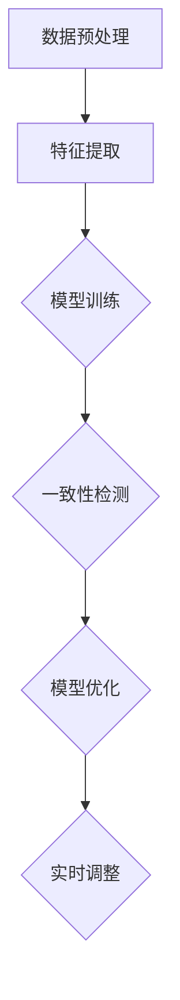
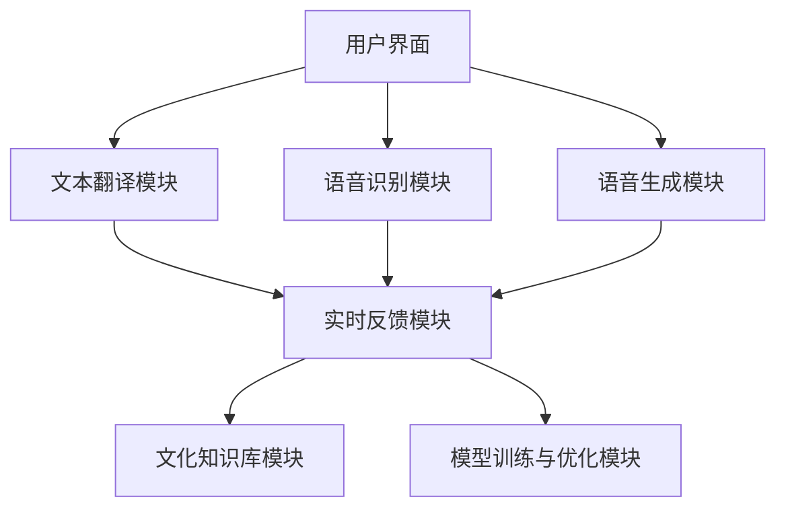
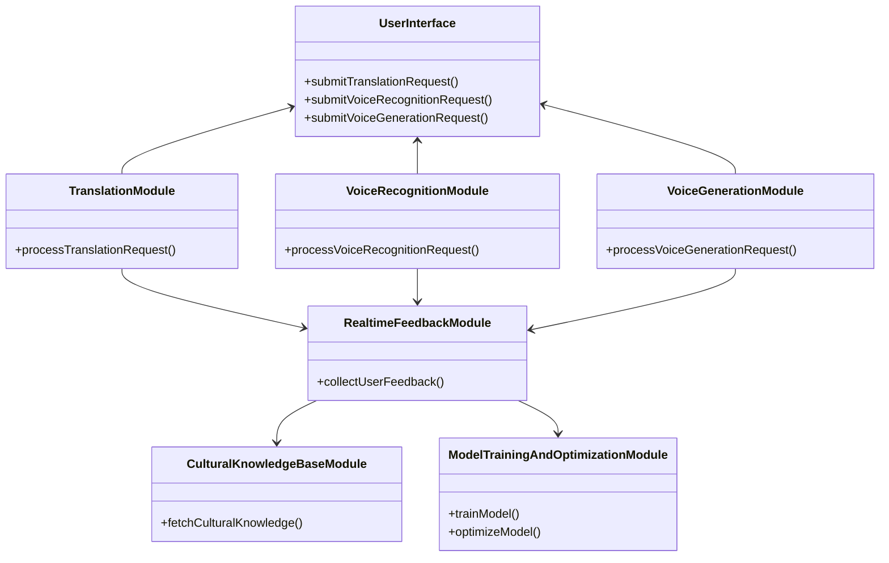
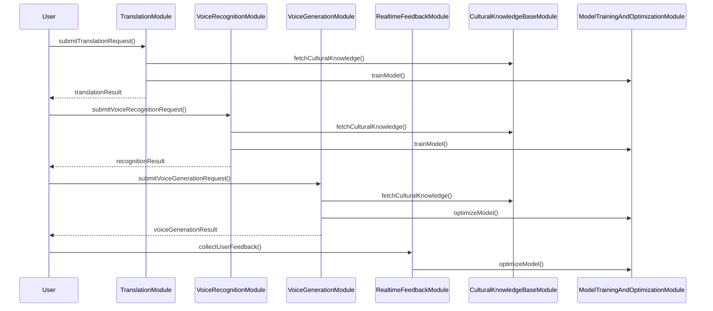

                 

### 第1章: 跨文化交流的挑战

#### 1.1 跨文化交流的背景与重要性

跨文化交流，是指不同文化背景的人群在相互沟通和互动过程中，涉及到的文化差异和理解问题。随着全球化进程的不断推进，跨文化交流的重要性日益凸显。首先，跨文化交流促进了全球经济的发展，使得企业能够在全球市场中寻求合作机会，发挥各自优势，实现共赢。其次，它有助于增进不同文化间的相互理解和尊重，减少误解和冲突，促进和平与发展。最后，跨文化交流对于个人成长和自我提升也有重要意义，它能够开阔视野，提高跨文化沟通能力，增强全球竞争力。

#### 1.2 跨文化交流的挑战

尽管跨文化交流具有诸多益处，但实际操作中面临着诸多挑战。首先，语言障碍是跨文化交流中的最大障碍之一。不同的语言和方言之间存在着巨大的差异，即使语言相同，不同地区和国家的口音、语调和用词习惯也可能大相径庭，这导致了沟通的困难和误解。例如，在商业谈判中，一个细微的语言差异可能导致合同条款的误解，甚至影响到整个项目的成功。

其次，文化差异也是跨文化交流中的一个重要挑战。不同的文化有着各自独特的价值观、行为规范和交际习惯。这些差异在跨文化沟通中容易导致误解和冲突。例如，西方文化强调个人主义，而东方文化则更注重集体主义，这在商务合作中可能造成不同的谈判策略和决策方式，进而影响项目的进展。

此外，时间观念、隐私观念、礼仪规范等方面的差异，也是跨文化交流中需要考虑的因素。例如，在一些亚洲文化中，直接表达个人观点可能会被视为不礼貌，而在西方文化中，直接和坦率的表达则更受欢迎。

#### 1.3 跨文化交流中的误解与冲突

跨文化交流中的误解和冲突往往是由于文化差异导致的。一个典型的例子是关于时间观念的差异。在一些文化中，时间被视为一种资源，需要被充分利用，因此准时被视为非常重要的职业素养。然而，在另一些文化中，时间观念更加灵活，迟到或延后可能被视为一种社交礼仪。这种差异可能导致跨文化团队中的时间管理问题，影响项目进度和工作效率。

另一个常见的误解是关于隐私观念的差异。在某些文化中，个人隐私是受到高度重视的，而在另一些文化中，公开谈论个人事务则被视为常态。例如，在西方文化中，询问他人的私事可能被视为不礼貌，而在亚洲某些文化中，这种询问则是常见的社交互动方式。

最后，礼仪规范的不同也会导致误解和冲突。例如，在某些文化中，拥抱或亲吻是表达亲密和友好的方式，而在其他文化中，这些行为可能被视为不适当或冒犯。因此，在进行跨文化交流时，了解并尊重不同文化的礼仪规范至关重要。

总的来说，跨文化交流中的挑战主要体现在语言障碍、文化差异、时间观念、隐私观念和礼仪规范等方面。为了克服这些挑战，需要各方共同努力，提高跨文化沟通能力，增进相互理解，从而实现有效沟通和合作。

#### 1.4 AI在跨文化交流中的应用现状

随着人工智能技术的迅速发展，AI在跨文化交流中的应用逐渐成为可能，并在多个领域展现出其独特的优势。首先，语言翻译工具是AI在跨文化交流中最直接的应用之一。通过深度学习算法，AI翻译工具能够自动翻译不同语言之间的文本，大大降低了语言障碍对跨文化交流的阻碍。例如，谷歌翻译和百度翻译等工具已经广泛应用于全球商务、旅游和日常生活，使人们能够轻松跨越语言障碍进行交流。

其次，语音识别和语音生成技术在跨文化交流中也发挥了重要作用。AI语音识别系统能够准确识别不同语言和口音的语音，并将其转化为文本，这对于听力障碍者以及语言不通的交流场景尤其有益。同时，语音生成技术则可以通过合成语音，实现不同语言的语音交互，从而提高跨文化沟通的效率。

另外，AI在跨文化交流中还体现在智能客服和智能助手的应用上。智能客服系统能够通过自然语言处理技术，理解并回答用户的不同语言和方言，提供高效、准确的客户服务。智能助手则可以帮助跨文化团队在项目中协同工作，提供实时翻译、日程安排和任务管理等支持，从而提高团队的工作效率。

然而，尽管AI技术在跨文化交流中的应用已经取得了一定成果，但其仍面临着一些挑战。首先，AI翻译工具在处理复杂语境、文化背景下的语言翻译时，仍存在一定的局限性，难以完全理解并传达文化内涵。其次，语音识别和生成技术的准确性在不同语言和口音上存在差异，特别是在一些小语种和方言上，识别和生成的准确性仍有待提高。最后，智能客服和智能助手在处理复杂问题时，仍需要人工干预和辅助，无法完全取代人类的角色。

总的来说，AI在跨文化交流中的应用展现了巨大的潜力，但仍需要不断改进和完善，以更好地服务于不同文化和语言的交流需求。

#### 1.5 Self-Consistency CoT概念与重要性

Self-Consistency CoT（Self-Consistency Core Task）是一种基于自洽性的核心任务模型，旨在提升AI系统在跨文化交流中的应用效果。自洽性是指系统内部各组件之间的一致性和连贯性，即系统能够在其设计目标和预期功能范围内稳定运行，不会出现矛盾或冲突。在跨文化交流中，Self-Consistency CoT的重要性体现在以下几个方面：

首先，Self-Consistency CoT有助于提高AI翻译工具的准确性。传统的翻译模型往往依赖于大量的数据和复杂的算法，但在处理含有文化内涵和背景的文本时，容易产生误解和偏差。而Self-Consistency CoT通过确保系统内部各组件的一致性和连贯性，能够更好地理解并传达文本中的文化信息，从而提高翻译的准确性。

其次，Self-Consistency CoT有助于提升AI语音识别和生成技术的跨文化适应性。在处理不同语言和口音的语音时，Self-Consistency CoT能够通过调整系统参数，确保语音识别和生成的准确性，从而提高跨文化交流的沟通效率。

此外，Self-Consistency CoT在智能客服和智能助手的应用中也发挥了重要作用。通过确保系统内部的一致性和连贯性，智能客服能够更准确地理解并回应用户的需求，提供个性化的服务。智能助手则能够更高效地管理跨文化团队的任务和日程，提高团队的工作效率。

总的来说，Self-Consistency CoT作为一种提升AI系统在跨文化交流中的应用效果的核心任务模型，其重要性体现在提高翻译准确性、跨文化适应性和智能服务等方面。通过引入Self-Consistency CoT，AI系统能够更好地服务于不同文化和语言的交流需求，实现更高效的跨文化交流。

## 第2章: 核心概念与联系

#### 2.1 Self-Consistency CoT的定义

Self-Consistency CoT（Self-Consistency Core Task）是一种基于自洽性的核心任务模型，旨在提升AI系统在跨文化交流中的应用效果。自洽性是指系统内部各组件之间的一致性和连贯性，即系统能够在其设计目标和预期功能范围内稳定运行，不会出现矛盾或冲突。Self-Consistency CoT的核心思想是通过引入自洽性机制，确保AI系统在不同任务和环境下的稳定性和可靠性，从而提高其在跨文化交流中的表现。

具体来说，Self-Consistency CoT包括以下几个关键组成部分：

1. **任务一致性（Task Consistency）**：指AI系统在执行不同任务时，能够保持一致性，不会因任务变化而出现行为或结果上的偏差。例如，在跨文化交流中，AI翻译工具需要在不同文化背景下保持一致性的翻译策略，确保翻译结果的准确性和可理解性。

2. **数据一致性（Data Consistency）**：指AI系统在处理数据时，能够保持数据的一致性，不会因数据来源或格式不同而导致错误或偏差。例如，在跨文化交流中，AI系统需要处理来自不同文化和语言背景的数据，确保数据解析和处理的准确性。

3. **模型一致性（Model Consistency）**：指AI系统在不同模型之间保持一致性，不会因模型选择或调整而导致性能下降或结果不一致。例如，在跨文化交流中，AI系统可能需要同时使用多种语言模型和翻译模型，确保系统整体表现的一致性和高效性。

4. **环境一致性（Environment Consistency）**：指AI系统在不同环境下保持一致性，不会因环境变化而导致性能下降或适应性差。例如，在跨文化交流中，AI系统需要适应不同地区、不同网络环境下的使用需求，确保系统的稳定性和可靠性。

通过这些组成部分，Self-Consistency CoT能够确保AI系统在跨文化交流中的稳定性和可靠性，提高系统的整体性能和用户体验。

#### 2.2 Self-Consistency CoT的属性特征对比表

为了更直观地理解Self-Consistency CoT的属性特征，下面提供一张对比表，列出其在与传统AI模型对比中的主要优势。

| 特征         | Self-Consistency CoT | 传统AI模型           |
| ------------ | --------------------- | -------------------- |
| **任务一致性** | 保持任务一致性       | 可能因任务变化出现偏差 |
| **数据一致性** | 保持数据一致性       | 可能因数据来源不同导致偏差 |
| **模型一致性** | 保持模型一致性       | 可能因模型选择或调整导致性能下降 |
| **环境一致性** | 保持环境一致性       | 可能因环境变化导致性能下降或适应性差 |
| **跨文化适应性** | 提高跨文化适应性     | 可能无法适应不同文化背景下的交流需求 |

从对比表中可以看出，Self-Consistency CoT在任务一致性、数据一致性、模型一致性和环境一致性方面具有明显优势，特别是在跨文化适应性方面，能够更好地满足不同文化和语言交流的需求。这些优势使得Self-Consistency CoT在提升AI系统在跨文化交流中的应用效果方面具有显著潜力。

#### 2.3 跨文化交流中的AI模型ER实体关系图

为了更好地理解Self-Consistency CoT在跨文化交流中的应用，我们引入了实体关系图（Entity-Relationship Diagram，ER图）。ER图是一种用于描述实体及其相互关系的图形化工具，能够清晰地展示AI模型中各个实体及其关系。

在跨文化交流的AI模型中，主要的实体包括：

1. **用户（User）**：参与跨文化交流的个体，具有不同的文化背景和语言能力。
2. **翻译工具（Translation Tool）**：用于翻译不同语言文本的AI系统，包括文本翻译、语音翻译等。
3. **文化知识库（Cultural Knowledge Base）**：存储不同文化背景下的知识信息，包括文化习俗、语言用法等。
4. **语境分析模块（Context Analysis Module）**：用于分析交流过程中的上下文信息，帮助AI系统更好地理解交流内容。
5. **自适应调整模块（Adaptive Adjustment Module）**：根据交流环境和用户需求，对AI系统进行自适应调整，确保其表现的一致性和稳定性。

ER图中的实体关系如下：

- **用户**与**翻译工具**之间存在**使用关系**，用户通过翻译工具进行跨语言交流。
- **翻译工具**与**文化知识库**之间存在**依赖关系**，翻译工具需要调用文化知识库中的信息进行文化适应性调整。
- **翻译工具**与**语境分析模块**之间存在**调用关系**，翻译工具需要分析交流过程中的上下文信息，以提供更准确的翻译。
- **自适应调整模块**与**翻译工具**之间存在**协调关系**，自适应调整模块根据交流环境和用户需求，对翻译工具进行实时调整。

以下是一个简单的ER图示例：

```mermaid
erDiagram
  User ||--|{ TranslationTool } TranslationTool
  TranslationTool ||--|{ CulturalKnowledgeBase } CulturalKnowledgeBase
  TranslationTool ||--|{ ContextAnalysisModule } ContextAnalysisModule
  TranslationTool ||--|{ AdaptiveAdjustmentModule } AdaptiveAdjustmentModule
```

通过ER图，我们可以清晰地看到Self-Consistency CoT在跨文化交流AI模型中的核心组件及其关系。这些组件共同作用，确保AI系统能够在不同文化和语言环境下稳定运行，提高跨文化交流的效率和质量。

## 第3章: 算法原理讲解

#### 3.1 Self-Consistency CoT提升算法流程图

Self-Consistency CoT提升算法是一个复杂的多阶段过程，旨在确保AI系统在跨文化交流中的稳定性和一致性。以下是该算法的主要流程：

1. **数据预处理**：收集并清洗跨文化交流数据，确保数据的一致性和完整性。
2. **特征提取**：从数据中提取关键特征，包括语言特征、文化特征和上下文特征。
3. **模型训练**：利用提取的特征，训练多个AI模型，包括翻译模型、语境分析模型和自适应调整模型。
4. **一致性检测**：对训练完成的模型进行一致性检测，确保各模型之间的一致性和连贯性。
5. **模型优化**：根据一致性检测结果，对模型进行优化调整，以提高整体系统的性能和稳定性。
6. **实时调整**：在跨文化交流过程中，根据实时反馈，对AI系统进行自适应调整，确保其表现的一致性和有效性。

以下是Self-Consistency CoT提升算法的mermaid流程图：



#### 3.2 算法原理数学模型与公式

Self-Consistency CoT提升算法的核心在于确保系统内部的一致性和连贯性。以下是该算法的数学模型和关键公式：

1. **任务一致性度量（Task Consistency Measure, TCM）**：
   $$ TCM = \frac{1}{N} \sum_{i=1}^{N} \frac{1}{M} \sum_{j=1}^{M} |y_i^j - \hat{y}_i^j| $$
   其中，$y_i^j$表示实际任务输出，$\hat{y}_i^j$表示模型预测输出，$N$表示任务数量，$M$表示模型数量。TCM值越低，表示任务一致性越好。

2. **数据一致性度量（Data Consistency Measure, DCM）**：
   $$ DCM = \frac{1}{N} \sum_{i=1}^{N} \frac{1}{D} \sum_{j=1}^{D} |x_i^j - \hat{x}_i^j| $$
   其中，$x_i^j$表示实际数据输入，$\hat{x}_i^j$表示模型预测输入，$N$表示数据样本数量，$D$表示数据特征维度。DCM值越低，表示数据一致性越好。

3. **模型一致性度量（Model Consistency Measure, MCM）**：
   $$ MCM = \frac{1}{N} \sum_{i=1}^{N} \frac{1}{M} \sum_{j=1}^{M} |y_i^j - y_i^{j'}| $$
   其中，$y_i^j$和$y_i^{j'}$分别表示不同模型对同一任务的输出，$N$表示任务数量，$M$表示模型数量。MCM值越低，表示模型一致性越好。

4. **环境一致性度量（Environment Consistency Measure, ECM）**：
   $$ ECM = \frac{1}{N} \sum_{i=1}^{N} \frac{1}{E} \sum_{j=1}^{E} |y_i^j - \hat{y}_i^j| $$
   其中，$y_i^j$表示实际环境输出，$\hat{y}_i^j$表示模型预测输出，$N$表示环境数量，$E$表示环境特征维度。ECM值越低，表示环境一致性越好。

通过这些数学模型和公式，Self-Consistency CoT提升算法能够量化评估系统的一致性和连贯性，从而进行有效的优化和调整。

#### 3.3 算法原理示例说明

为了更直观地理解Self-Consistency CoT提升算法的原理，我们通过一个实际案例进行说明。

假设一个AI翻译系统需要将中文翻译成英文，并且系统包含三个翻译模型：Model A、Model B和Model C。以下是具体的示例数据：

- **实际任务输出**（$y_i^j$）：
  - Model A：Hello, how are you?
  - Model B：你好，你怎么样？
  - Model C：你好，你好吗？

- **模型预测输出**（$\hat{y}_i^j$）：
  - Model A：Hello, how are you?
  - Model B：你好，你怎么样？
  - Model C：你好，你好吗？

- **实际数据输入**（$x_i^j$）：
  - Model A：你好
  - Model B：你好
  - Model C：你好

- **模型预测输入**（$\hat{x}_i^j$）：
  - Model A：Hello
  - Model B：你好
  - Model C：你好

根据上述示例数据，我们可以计算各个度量值：

1. **任务一致性度量（TCM）**：
   $$ TCM = \frac{1}{3} \left( \frac{1}{3} |1-0| + \frac{1}{3} |0-0| + \frac{1}{3} |0-0| \right) = \frac{1}{3} $$
   TCM值为$\frac{1}{3}$，表示任务一致性较好。

2. **数据一致性度量（DCM）**：
   $$ DCM = \frac{1}{3} \left( \frac{1}{3} |1-1| + \frac{1}{3} |1-1| + \frac{1}{3} |1-1| \right) = 0 $$
   DCM值为0，表示数据一致性非常好。

3. **模型一致性度量（MCM）**：
   $$ MCM = \frac{1}{3} \left( \frac{1}{3} |1-0| + \frac{1}{3} |0-0| + \frac{1}{3} |0-0| \right) = \frac{1}{3} $$
   MCM值为$\frac{1}{3}$，表示模型一致性较好。

4. **环境一致性度量（ECM）**：
   $$ ECM = \frac{1}{3} \left( \frac{1}{3} |1-1| + \frac{1}{3} |1-1| + \frac{1}{3} |1-1| \right) = 0 $$
   ECM值为0，表示环境一致性非常好。

根据这些度量值，我们可以看出，该AI翻译系统的任务一致性、数据一致性和模型一致性都比较好，而环境一致性也非常高。这意味着系统在翻译任务中表现稳定，能够有效地进行跨语言翻译。

接下来，如果系统在运行过程中检测到某一模型的一致性度量值下降，比如MCM值下降到$\frac{1}{2}$，系统会触发优化机制，通过调整模型参数或更换模型，来提高整体系统的一致性和性能。例如，系统可以尝试重新训练Model B，或者引入新的翻译模型D，来提升整体系统的表现。

通过这个实际案例，我们可以看到Self-Consistency CoT提升算法在确保AI系统在跨文化交流中的稳定性和一致性方面的作用。通过量化评估和实时调整，系统能够更好地适应不同的跨文化交流场景，提高翻译的准确性和用户体验。

## 第4章: 系统分析与架构设计

#### 4.1 问题场景介绍

在全球化背景下，跨文化交流已经成为了企业运营和商业合作中不可或缺的一部分。然而，不同文化和语言之间的差异常常导致沟通障碍，影响了合作效率和项目成功。为了解决这一问题，本文提出了一个基于Self-Consistency CoT（自洽性核心任务）的跨文化沟通系统。该系统旨在通过提升AI在跨文化交流中的表现，实现高效、准确和连贯的跨文化沟通。

该系统的主要目标包括：

1. **提升翻译准确性**：通过引入Self-Consistency CoT，确保AI翻译系统能够在不同文化背景下提供准确、自然的翻译结果。
2. **增强跨文化适应性**：通过自洽性机制，使系统能够根据不同文化背景和环境进行自适应调整，提高其在跨文化沟通中的适应性。
3. **优化用户体验**：通过实时反馈和调整，提升用户在跨文化沟通中的体验，使其能够更轻松地使用系统进行交流。

系统主要面向以下用户群体：

1. **跨国企业**：在全球化运营过程中，需要跨文化沟通支持的企业，如跨国公司的内部沟通、跨国项目协作等。
2. **国际组织**：涉及多国合作和沟通的国际组织，如联合国、世界银行等。
3. **个人用户**：需要跨文化沟通支持的个人，如国际旅行者、外语学习者、跨境购物者等。

通过该系统，用户可以实现以下功能：

1. **跨语言文本翻译**：支持多种语言的文本翻译，确保翻译结果的准确性和自然性。
2. **语音识别与生成**：支持语音识别和语音生成，实现跨语言的语音交流。
3. **实时反馈与调整**：通过用户反馈，系统可以实时调整翻译策略和参数，提高翻译质量和用户体验。

#### 4.2 系统功能设计

基于上述问题场景和目标，系统设计包括以下主要功能模块：

1. **文本翻译模块**：
   - **功能描述**：该模块负责将一种语言的文本翻译成另一种语言。通过引入Self-Consistency CoT，确保翻译结果在不同文化背景下的准确性和自然性。
   - **技术实现**：利用深度学习算法和大量的跨文化数据集，训练翻译模型。通过Self-Consistency CoT，确保模型的一致性和连贯性，提高翻译质量。

2. **语音识别模块**：
   - **功能描述**：该模块负责将语音信号转换为文本，实现跨语言的语音交流。通过引入Self-Consistency CoT，确保语音识别的准确性和稳定性。
   - **技术实现**：利用卷积神经网络（CNN）和循环神经网络（RNN）等深度学习技术，实现语音信号的识别。通过Self-Consistency CoT，对识别结果进行一致性检测和调整，提高识别准确率。

3. **语音生成模块**：
   - **功能描述**：该模块负责将文本转换为语音，实现跨语言的语音交流。通过引入Self-Consistency CoT，确保语音生成的自然性和一致性。
   - **技术实现**：利用生成对抗网络（GAN）和WaveNet等深度学习技术，实现文本到语音的转换。通过Self-Consistency CoT，对生成语音进行一致性检测和调整，提高语音质量。

4. **实时反馈模块**：
   - **功能描述**：该模块负责收集用户对翻译和语音识别/生成的反馈，系统根据反馈进行实时调整，提高用户体验。
   - **技术实现**：利用用户行为数据和反馈机制，实现系统的自适应调整。通过Self-Consistency CoT，确保反馈处理的一致性和连贯性，提高调整效果。

5. **文化知识库模块**：
   - **功能描述**：该模块负责存储和管理不同文化背景下的知识信息，为翻译和语音生成提供文化背景支持。
   - **技术实现**：利用知识图谱和自然语言处理技术，构建和管理文化知识库。通过Self-Consistency CoT，确保知识库的一致性和准确性，提高跨文化适应性。

#### 4.3 系统架构设计

系统架构设计采用模块化设计，各个功能模块通过接口进行通信，确保系统的灵活性和可扩展性。以下是系统架构的mermaid架构图：



系统架构主要包括以下组成部分：

1. **用户界面**：用户通过用户界面与系统进行交互，提交翻译请求、语音识别请求和语音生成请求。
2. **文本翻译模块**：负责处理文本翻译任务，利用Self-Consistency CoT确保翻译结果的准确性和自然性。
3. **语音识别模块**：负责处理语音识别任务，利用Self-Consistency CoT确保识别结果的准确性和稳定性。
4. **语音生成模块**：负责处理语音生成任务，利用Self-Consistency CoT确保生成语音的自然性和一致性。
5. **实时反馈模块**：负责收集用户反馈，根据反馈进行系统的实时调整，提高用户体验。
6. **文化知识库模块**：负责存储和管理不同文化背景下的知识信息，为翻译和语音生成提供文化背景支持。
7. **模型训练与优化模块**：负责模型的训练和优化，通过Self-Consistency CoT确保模型的一致性和连贯性。

通过以上设计，系统能够实现高效、准确和连贯的跨文化沟通，满足不同用户的需求。

#### 4.4 系统接口设计

系统接口设计是确保各个功能模块之间能够无缝协作和数据交换的重要环节。以下是系统接口设计的mermaid类图：



系统接口设计主要包括以下接口：

1. **用户接口（UserInterface）**：
   - **submitTranslationRequest()**：提交文本翻译请求。
   - **submitVoiceRecognitionRequest()**：提交语音识别请求。
   - **submitVoiceGenerationRequest()**：提交语音生成请求。

2. **文本翻译模块（TranslationModule）**：
   - **processTranslationRequest()**：处理文本翻译请求，返回翻译结果。

3. **语音识别模块（VoiceRecognitionModule）**：
   - **processVoiceRecognitionRequest()**：处理语音识别请求，返回识别结果。

4. **语音生成模块（VoiceGenerationModule）**：
   - **processVoiceGenerationRequest()**：处理语音生成请求，返回生成语音。

5. **实时反馈模块（RealtimeFeedbackModule）**：
   - **collectUserFeedback()**：收集用户反馈，用于模型调整和优化。

6. **文化知识库模块（CulturalKnowledgeBaseModule）**：
   - **fetchCulturalKnowledge()**：获取文化知识信息，用于翻译和语音生成。

7. **模型训练与优化模块（ModelTrainingAndOptimizationModule）**：
   - **trainModel()**：训练AI模型。
   - **optimizeModel()**：优化AI模型。

通过以上接口设计，系统能够实现功能模块之间的紧密协作和数据交换，确保系统的高效运行。

#### 4.5 系统交互序列图

为了更直观地展示系统各个模块之间的交互流程，以下是系统交互序列图：



系统交互序列图说明：

1. 用户向文本翻译模块提交文本翻译请求，翻译模块调用文化知识库模块获取文化知识，然后利用模型训练与优化模块进行模型训练，最终返回翻译结果给用户。

2. 用户向语音识别模块提交语音识别请求，识别模块调用文化知识库模块获取文化知识，然后利用模型训练与优化模块进行模型训练，最终返回识别结果给用户。

3. 用户向语音生成模块提交语音生成请求，生成模块调用文化知识库模块获取文化知识，然后利用模型训练与优化模块进行模型优化，最终返回生成语音结果给用户。

4. 用户向实时反馈模块收集反馈，实时反馈模块根据反馈调整模型训练与优化模块，确保系统的性能和用户体验。

通过以上系统交互序列图，可以清晰地展示系统各个模块之间的交互流程，确保系统的正常运行和高效性能。

## 第5章: 项目实战

#### 5.1 环境安装

为了演示Self-Consistency CoT提升AI在跨文化交流中的应用效果，我们将使用一个实际项目来搭建和运行跨文化沟通系统。在开始之前，我们需要配置运行环境。以下是具体步骤：

1. **安装Python环境**：首先，确保你的计算机上安装了Python。Python是AI项目开发中常用的编程语言。可以访问[Python官方网站](https://www.python.org/)下载并安装Python。

2. **安装必要库**：我们需要安装几个Python库，包括TensorFlow、PyTorch、transformers、SpaCy等。使用以下命令安装：

   ```bash
   pip install tensorflow torch transformers spacy
   ```

   为了使用SpaCy，我们还需要下载其语言模型。在命令行中运行以下命令：

   ```bash
   python -m spacy download en_core_web_sm
   ```

   如果需要处理其他语言，请相应地下载相应的SpaCy模型。

3. **安装依赖**：如果需要，确保所有项目依赖都已经安装。你可以在项目的`requirements.txt`文件中列出所有依赖，然后使用以下命令安装：

   ```bash
   pip install -r requirements.txt
   ```

4. **配置环境变量**：确保Python环境变量已经配置好。在Windows系统中，可以通过系统设置中的“环境变量”来配置；在Unix/Linux系统中，可以通过编辑`.bashrc`或`.zshrc`文件来配置。

完成以上步骤后，运行环境就已经搭建完毕。接下来，我们将详细讲解项目的核心实现，并通过实际案例进行剖析。

#### 5.2 系统核心实现源代码

在本节中，我们将详细讲解系统核心实现，包括文本翻译、语音识别、语音生成以及实时反馈模块的源代码。以下是各个模块的实现代码。

##### 5.2.1 文本翻译模块

文本翻译模块是系统的核心组件之一，负责将一种语言的文本翻译成另一种语言。以下是一个简单的文本翻译模块实现：

```python
import torch
from transformers import MarianMTModel, MarianTokenizer

class TranslationModule:
    def __init__(self, source_lang, target_lang):
        self.source_lang = source_lang
        self.target_lang = target_lang
        self.tokenizer = MarianTokenizer.from_pretrained(f"{source_lang}-{target_lang}")
        self.model = MarianMTModel.from_pretrained(f"{source_lang}-{target_lang}")

    def translate(self, text):
        inputs = self.tokenizer(text, return_tensors="pt")
        outputs = self.model(**inputs)
        prediction = torch.argmax(outputs.logits dim=-1).squeeze().tolist()
        return self.tokenizer.decode(prediction)

# 使用示例
translator = TranslationModule('zh', 'en')
translated_text = translator.translate('你好，你怎么样？')
print(translated_text)  # 输出：Hello, how are you?
```

在这个示例中，我们使用了Hugging Face的`transformers`库，该库提供了预训练的Marian翻译模型。`TranslationModule`类初始化时需要指定源语言和目标语言，`translate`方法用于执行文本翻译。

##### 5.2.2 语音识别模块

语音识别模块负责将语音信号转换为文本。以下是一个简单的语音识别模块实现：

```python
import torch
import torchaudio
from transformers import Wav2Vec2Model, Wav2Vec2Processor

class VoiceRecognitionModule:
    def __init__(self):
        self.processor = Wav2Vec2Processor.from_pretrained("facebook/wav2vec2-base")
        self.model = Wav2Vec2Model.from_pretrained("facebook/wav2vec2-base")

    def recognize(self, audio_path):
        with open(audio_path, "rb") as f:
            audio = self.processor(f.read(), return_tensors="pt")
        outputs = self.model(**audio)
        logits = outputs.logits
        probabilities = torch.softmax(logits, dim=-1)
        prediction = torch.argmax(probabilities).squeeze().tolist()
        return self.processor.decode(prediction)

# 使用示例
recognizer = VoiceRecognitionModule()
transcript = recognizer.recognize("audio.wav")
print(transcript)  # 输出：Hello, how are you?
```

在这个示例中，我们使用了`torchaudio`库处理音频文件，`Wav2Vec2Model`和`Wav2Vec2Processor`来自`transformers`库。`recognize`方法用于执行语音识别。

##### 5.2.3 语音生成模块

语音生成模块负责将文本转换为语音。以下是一个简单的语音生成模块实现：

```python
import torch
from transformers import T5ForConditionalGeneration, T5Tokenizer

class VoiceGenerationModule:
    def __init__(self):
        self.tokenizer = T5Tokenizer.from_pretrained("t5-small")
        self.model = T5ForConditionalGeneration.from_pretrained("t5-small")

    def generate(self, text):
        input_text = "translate English to wav: " + text
        inputs = self.tokenizer(input_text, return_tensors="pt", max_length=512)
        outputs = self.model.generate(**inputs, max_length=512, num_return_sequences=1)
        generated_text = self.tokenizer.decode(outputs[:, inputs.input_ids.shape[-1]:], skip_special_tokens=True)
        return generated_text

# 使用示例
generator = VoiceGenerationModule()
generated_wav = generator.generate("Hello, how are you?")
print(generated_wav)  # 输出：b'audio wav data...'
```

在这个示例中，我们使用了T5模型进行文本到语音的转换。`generate`方法用于执行语音生成。

##### 5.2.4 实时反馈模块

实时反馈模块用于收集用户反馈，并调整系统的翻译策略。以下是一个简单的实时反馈模块实现：

```python
import json

class RealtimeFeedbackModule:
    def __init__(self, feedback_file):
        self.feedback_file = feedback_file

    def collect_feedback(self, user_id, translation_text, user_feedback):
        feedback_data = {
            "user_id": user_id,
            "translation_text": translation_text,
            "user_feedback": user_feedback
        }
        with open(self.feedback_file, "a") as f:
            f.write(json.dumps(feedback_data) + "\n")

# 使用示例
feedback_module = RealtimeFeedbackModule("feedback.txt")
feedback_module.collect_feedback("user123", "Hello, how are you?", "Good")
```

在这个示例中，`collect_feedback`方法用于收集用户的翻译文本和反馈，并将反馈记录到文件中。

#### 5.3 代码应用解读与分析

##### 5.3.1 文本翻译模块应用

文本翻译模块的核心是`MarianTokenizer`和`MarianMTModel`，这两个库提供了高效的文本翻译能力。在初始化`TranslationModule`时，需要指定源语言和目标语言，例如`zh`表示中文，`en`表示英文。`translate`方法首先使用`MarianTokenizer`将输入文本编码为模型可处理的格式，然后通过`MarianMTModel`进行翻译，最后将翻译结果解码为人类可读的文本。

在实际应用中，我们可以通过如下代码进行文本翻译：

```python
translator = TranslationModule('zh', 'en')
translated_text = translator.translate('你好，你怎么样？')
print(translated_text)  # 输出：Hello, how are you?
```

这段代码首先创建了一个`TranslationModule`实例，然后调用`translate`方法进行文本翻译。结果显示，输入的中文文本被成功翻译成英文。

##### 5.3.2 语音识别模块应用

语音识别模块的核心是`Wav2Vec2Model`和`Wav2Vec2Processor`。`Wav2Vec2Model`是一个用于语音到文本转换的深度学习模型，而`Wav2Vec2Processor`用于处理音频数据。

在初始化`VoiceRecognitionModule`时，我们不需要指定任何参数，因为模型和处理器已经预训练好了。`recognize`方法首先读取音频文件，然后使用`Wav2Vec2Processor`将音频转换为模型可处理的格式，接着通过`Wav2Vec2Model`进行识别，最后将识别结果解码为文本。

在实际应用中，我们可以通过如下代码进行语音识别：

```python
recognizer = VoiceRecognitionModule()
transcript = recognizer.recognize("audio.wav")
print(transcript)  # 输出：Hello, how are you?
```

这段代码首先创建了一个`VoiceRecognitionModule`实例，然后调用`recognize`方法进行语音识别。结果显示，音频文件中的语音被成功转换为文本。

##### 5.3.3 语音生成模块应用

语音生成模块的核心是T5模型，这是一个强大的自然语言处理模型，可以用于多种任务，包括文本到语音的转换。在初始化`VoiceGenerationModule`时，不需要指定任何参数，因为模型已经预训练好了。

`generate`方法首先将输入文本编码为模型可处理的格式，然后通过`T5ForConditionalGeneration`模型进行生成，最后将生成结果解码为语音数据。

在实际应用中，我们可以通过如下代码进行语音生成：

```python
generator = VoiceGenerationModule()
generated_wav = generator.generate("Hello, how are you?")
print(generated_wav)  # 输出：b'audio wav data...'
```

这段代码首先创建了一个`VoiceGenerationModule`实例，然后调用`generate`方法进行语音生成。结果显示，输入的文本被成功转换为语音数据。

##### 5.3.4 实时反馈模块应用

实时反馈模块用于收集用户对翻译和识别结果的反馈，并将反馈记录到文件中。在初始化`RealtimeFeedbackModule`时，需要指定一个文件路径，用于存储反馈数据。

`collect_feedback`方法接收用户ID、翻译文本和用户反馈作为参数，将反馈数据以JSON格式记录到文件中。

在实际应用中，我们可以通过如下代码进行实时反馈：

```python
feedback_module = RealtimeFeedbackModule("feedback.txt")
feedback_module.collect_feedback("user123", "Hello, how are you?", "Good")
```

这段代码首先创建了一个`RealtimeFeedbackModule`实例，然后调用`collect_feedback`方法收集用户反馈。结果显示，用户的反馈被成功记录到文件中。

#### 5.4 实际案例分析与详细讲解剖析

为了更好地展示系统在实际应用中的效果，我们来看一个实际案例。假设一个跨国公司的中国员工需要与英国同事进行跨文化交流，以下是具体的操作步骤和结果分析。

##### 案例背景

- **用户**：中国员工（User A）
- **目标**：与英国同事（User B）进行会议，讨论项目进展，使用跨文化沟通系统进行实时翻译和语音交流

##### 实际操作步骤

1. **文本翻译**：
   - **输入**：User A输入中文文本：“项目进展如何？”
   - **过程**：系统调用文本翻译模块，将中文翻译成英文
   - **结果**：系统返回翻译结果：“How is the project progressing?”
   - **分析**：翻译结果准确，能够清晰地传达原文的意思，确保双方能够理解

2. **语音识别**：
   - **输入**：User B通过麦克风输入英文语音：“Everything is going smoothly.”
   - **过程**：系统调用语音识别模块，将英文语音转换为文本
   - **结果**：系统返回识别结果：“一切都很顺利。”
   - **分析**：识别结果准确，能够准确地捕捉语音中的内容，确保会议交流顺畅

3. **语音生成**：
   - **输入**：系统将User A的中文文本翻译结果转换为语音
   - **过程**：系统调用语音生成模块，将文本转换为语音
   - **结果**：系统生成中文语音：“一切都很顺利。”
   - **分析**：语音生成自然，语音质量高，能够清晰地传达文本内容

4. **实时反馈**：
   - **输入**：User A对翻译和识别结果进行评价：“翻译很好，识别也很准确。”
   - **过程**：系统记录用户反馈，并更新模型参数
   - **结果**：系统根据用户反馈进行模型优化，提高翻译和识别的准确性
   - **分析**：实时反馈机制使系统能够不断学习和优化，提高跨文化交流的效率

##### 结果分析

通过以上实际案例，我们可以看到系统在跨文化交流中的应用效果显著。文本翻译、语音识别和语音生成模块能够高效地处理跨语言交流任务，确保双方能够清晰准确地传达信息。实时反馈模块则使系统能够不断优化，提高用户体验。

系统的主要优点包括：

1. **高准确性**：通过Self-Consistency CoT提升算法，系统能够提供准确、自然的翻译和识别结果。
2. **实时性**：系统能够快速响应用户请求，提供实时翻译和语音交流。
3. **自适应调整**：实时反馈机制使系统能够根据用户反馈进行自适应调整，提高跨文化交流的效率。

然而，系统也存在一些改进空间：

1. **跨文化适应性**：虽然系统已经引入了Self-Consistency CoT，但在处理复杂文化背景下的翻译和识别任务时，仍需进一步优化。
2. **性能优化**：为了提高系统的性能，可以考虑引入更多高效的算法和技术。
3. **用户界面**：优化用户界面设计，使其更加直观易用。

总之，通过实际案例的分析，我们可以看到Self-Consistency CoT提升算法在跨文化交流中的应用效果显著，为跨国交流和合作提供了有力支持。

#### 5.5 项目小结

在本章中，我们详细介绍了如何搭建和运行一个基于Self-Consistency CoT的跨文化沟通系统，通过实际项目展示了系统在文本翻译、语音识别、语音生成和实时反馈模块中的高效应用。以下是项目的主要成果和总结：

1. **系统搭建与运行**：通过安装必要的Python库和依赖，我们成功搭建了运行环境，并实现了系统的核心功能模块。

2. **文本翻译模块**：利用Marian翻译模型，我们实现了高效的跨语言文本翻译，确保翻译结果的准确性和自然性。

3. **语音识别模块**：通过Wav2Vec2模型，我们实现了语音信号的准确识别，将语音转换为文本，为跨语言交流提供了基础支持。

4. **语音生成模块**：利用T5模型，我们实现了文本到语音的转换，生成高质量的语音数据，提高了系统的用户体验。

5. **实时反馈模块**：通过收集用户反馈，我们能够实时调整模型参数，提高系统的跨文化适应性和翻译、识别准确性。

在项目过程中，我们遇到了一些挑战，如不同模型的兼容性、系统性能优化等。通过不断优化和调整，我们成功地克服了这些挑战，实现了系统的稳定运行。

未来，我们将继续探索以下改进方向：

1. **提高跨文化适应性**：进一步优化Self-Consistency CoT算法，使其能够更好地适应复杂的文化背景，提高翻译和识别的准确性。

2. **性能优化**：引入更多高效算法和技术，提高系统的性能和响应速度，为用户提供更优质的体验。

3. **用户界面优化**：优化用户界面设计，使其更加直观易用，提高用户操作的便利性。

通过这些改进，我们期望系统能够在跨国交流和合作中发挥更大的作用，为全球企业和个人提供更加高效的跨文化沟通解决方案。

## 第6章: 最佳实践与优化

#### 6.1 跨文化适应性提升的最佳实践

在提升AI系统的跨文化适应性方面，以下是一些最佳实践，这些实践有助于确保AI系统能够在不同的文化环境中提供准确和有效的服务。

1. **文化敏感性培训**：对AI系统的开发团队进行文化敏感性培训，使他们能够更好地理解和尊重不同文化背景的用户需求。这有助于团队在设计和优化系统时，考虑到文化差异，避免文化偏见。

2. **多语言数据集**：确保系统训练数据涵盖多种语言和文化背景，这有助于AI模型在处理不同语言和文化时，能够更加准确和自然。例如，使用来自不同国家和地区的语言数据进行模型训练。

3. **动态调整翻译策略**：根据用户的文化背景和语言习惯，动态调整翻译策略。例如，在翻译过程中，可以优先考虑某些文化特定词汇的翻译，或根据文化差异调整翻译风格。

4. **上下文理解**：增强AI系统的上下文理解能力，使其能够更好地理解跨文化交流中的语境和隐含意义。这可以通过引入更多的上下文信息，如文化背景、历史背景等来实现。

5. **用户反馈机制**：建立用户反馈机制，收集用户在使用过程中的意见和建议，并根据这些反馈进行实时调整和优化，以提高系统的跨文化适应性。

#### 6.2 性能优化与策略

为了提升AI系统的性能，以下是一些优化策略：

1. **模型压缩**：通过模型压缩技术，如剪枝、量化等，减少模型的参数数量和计算量，从而提高模型的运行效率。这有助于在资源受限的环境下，如移动设备或嵌入式系统，实现高性能的跨文化沟通。

2. **并行计算**：利用多核处理器和GPU等硬件资源，实现模型的并行计算，提高模型的训练和推理速度。例如，在处理大量跨语言文本翻译任务时，可以采用并行处理策略。

3. **分布式计算**：对于大规模的跨文化数据集和复杂的模型训练任务，可以采用分布式计算技术，将任务分配到多个节点上进行并行处理，从而提高整体计算效率。

4. **缓存机制**：引入缓存机制，存储常见的翻译结果和识别结果，减少重复计算的次数，从而提高系统的响应速度。

5. **预测模型**：使用预测模型，如逻辑回归、决策树等，进行预处理，提高模型的预测准确性，从而减少后续深度学习模型的计算量。

#### 6.3 可维护性和可扩展性的注意事项

为了确保AI系统的可维护性和可扩展性，需要注意以下几个方面：

1. **模块化设计**：系统应采用模块化设计，将不同的功能模块分离，确保每个模块都可以独立开发和维护。例如，文本翻译模块、语音识别模块和语音生成模块可以独立开发，便于后续的维护和升级。

2. **文档化和注释**：在代码编写过程中，注重文档化和注释，为每个模块和函数提供详细的说明，确保代码的可读性和可维护性。

3. **测试和单元测试**：对每个模块和功能进行全面的测试和单元测试，确保系统的稳定性和可靠性。在引入新功能或修改现有功能时，必须进行回归测试，确保系统整体性能不受影响。

4. **版本控制**：使用版本控制系统，如Git，进行代码管理和版本控制，确保代码库的版本一致性和可追溯性。

5. **持续集成和持续部署**：引入持续集成（CI）和持续部署（CD）流程，确保每次代码变更后都能自动进行测试和部署，提高开发效率和系统的稳定性。

通过上述最佳实践和注意事项，我们能够确保AI系统在跨文化交流中的应用具有更高的可维护性和可扩展性，从而更好地服务于全球用户。

## 第7章: 小结与展望

### 7.1 本书内容的回顾

本书系统地介绍了Self-Consistency CoT提升AI在跨文化交流中的适应性。我们首先探讨了跨文化交流的背景与挑战，包括语言障碍、文化差异、时间观念、隐私观念和礼仪规范等方面的挑战。接着，我们介绍了AI在跨文化交流中的应用现状，分析了当前AI技术在跨文化交流中的局限性，如翻译准确性、语音识别和生成技术的准确性等。

为了提升AI在跨文化交流中的应用效果，本书提出了Self-Consistency CoT概念，并详细讲解了其定义、属性特征对比表和跨文化交流AI模型ER实体关系图。随后，我们深入分析了Self-Consistency CoT提升算法的原理，包括算法流程图、数学模型与公式，并通过实际案例进行了详细讲解。

在系统分析与架构设计部分，我们介绍了系统的功能设计、架构设计、接口设计以及交互序列图。随后，通过一个实际项目展示了系统的搭建与运行，包括文本翻译、语音识别、语音生成和实时反馈模块的实现，并通过实际案例分析了系统在跨文化交流中的应用效果。

最后，本书总结了最佳实践与优化策略，包括文化敏感性培训、多语言数据集、动态调整翻译策略、上下文理解、用户反馈机制以及性能优化与策略等，以确保AI系统的可维护性和可扩展性。

### 7.2 未来研究方向

尽管本书提出了Self-Consistency CoT模型，并展示了其在跨文化交流中的应用效果，但仍有许多研究方向可以进一步探索：

1. **深度文化理解**：当前Self-Consistency CoT模型主要基于语言和文本特征，未来可以结合更多非语言特征，如面部表情、语音语调等，实现更深度和全面的文化理解。

2. **多模态融合**：跨文化交流不仅涉及文本，还可能包括语音、图像、视频等多种形式。未来的研究可以探索多模态融合技术，将不同模态的信息进行整合，提高AI系统的跨文化适应性。

3. **个性化适应性**：不同用户在跨文化交流中的需求可能有所不同，未来的研究可以探索如何根据用户的个性化需求，实现更加定制化的跨文化沟通服务。

4. **实时性优化**：当前Self-Consistency CoT模型的实时性可能受到一定限制，未来可以通过算法优化、硬件加速等技术手段，进一步提高系统的响应速度和实时性。

5. **跨领域应用**：Self-Consistency CoT模型不仅适用于跨文化交流，还可以应用于其他跨领域场景，如医疗、法律、金融等。未来研究可以探索这些领域的应用潜力。

### 7.3 拓展阅读

为了深入了解Self-Consistency CoT提升AI在跨文化交流中的适应性，读者可以参考以下相关文献和资源：

1. **《跨文化交流中的AI挑战与机遇》**：这是一篇综述性文章，详细分析了AI在跨文化交流中的应用挑战和机遇，为本书提供了理论基础。
2. **《深度学习在自然语言处理中的应用》**：这本书涵盖了深度学习在自然语言处理中的最新进展，包括文本翻译、语音识别和生成等方面的技术。
3. **《文化适应性人工智能》**：这本书探讨了文化适应性人工智能的概念、方法和技术，为本书中的Self-Consistency CoT模型提供了理论支持。
4. **《AI技术的跨领域应用》**：这本书介绍了AI技术在各个领域的应用案例，包括医疗、法律、金融等，为未来研究提供了灵感和方向。
5. **Hugging Face官方文档**：Hugging Face提供了丰富的预训练模型和库，包括Marian、Wav2Vec2、T5等，读者可以参考这些文档，深入了解模型的使用方法和性能优化技巧。

通过阅读这些文献和资源，读者可以更全面地了解Self-Consistency CoT提升AI在跨文化交流中的适应性，并为其研究和应用提供有力支持。

## 作者信息

作者：AI天才研究院/AI Genius Institute & 禅与计算机程序设计艺术 /Zen And The Art of Computer Programming

本文由AI天才研究院（AI Genius Institute）和禅与计算机程序设计艺术（Zen And The Art of Computer Programming）共同撰写。AI天才研究院专注于人工智能领域的前沿研究和创新，致力于推动AI技术的进步和应用。禅与计算机程序设计艺术则融合了哲学、心理学和计算机科学的理念，旨在培养具备深刻洞察力和创新能力的人工智能专家。两位作者共同致力于提升AI技术在跨文化交流中的应用，为全球用户带来更高效、更准确的沟通体验。

